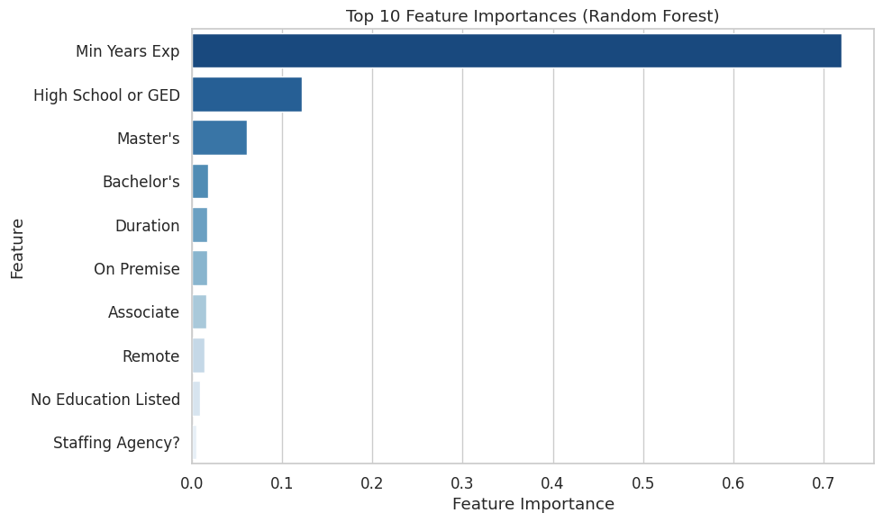
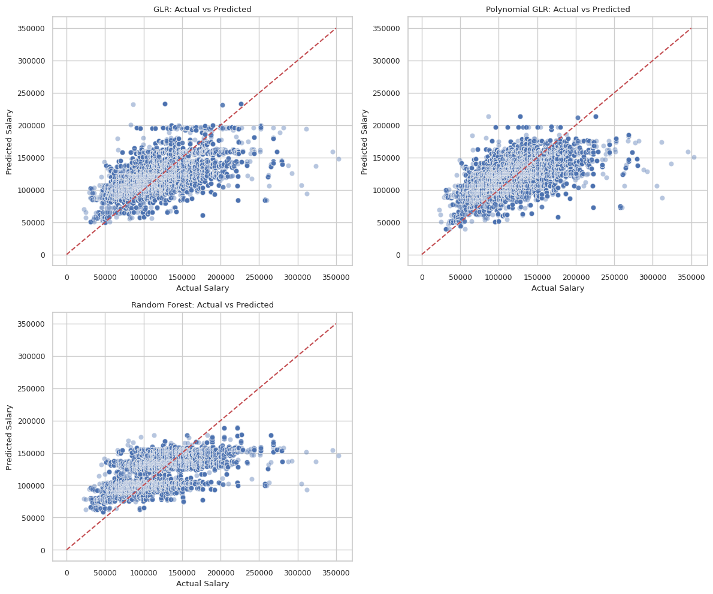

Feature Engineering and Missing Value Imputation


```python
## DATA LOADING & SETUP
import pandas as pd
import plotly.express as px
import plotly.io as pio
from pyspark.sql import SparkSession
import re
import numpy as np
import plotly.graph_objects as go
from pyspark.sql.functions import col, split, explode, regexp_replace, transform, when, trim, monotonically_increasing_id, pow, length, sum as spark_sum
from pyspark.sql import functions as F
from pyspark.ml.feature import StringIndexer, OneHotEncoder, VectorAssembler
from pyspark.ml import Pipeline
from pyspark.ml.regression import LinearRegression

np.random.seed(42)

pio.renderers.default = "notebook"

# Initialize Spark Session
spark = SparkSession.builder.appName("LightcastData").getOrCreate()

# Load Data
df = spark.read.option("header", "true").option("inferSchema", "true").option("multiLine", "true").option("quote", "\"").option("escape", "\"").csv("../data/lightcast_job_postings.csv")
df.createOrReplaceTempView("job_postings")

# Show Schema and Sample Data
#print("---This is Diagnostic check, No need to print it in the final doc---")
#df.printSchema() # comment this line when rendering the submission
df.show(5)
```

    WARNING: Using incubator modules: jdk.incubator.vector
    Using Spark's default log4j profile: org/apache/spark/log4j2-defaults.properties
    Setting default log level to "WARN".
    To adjust logging level use sc.setLogLevel(newLevel). For SparkR, use setLogLevel(newLevel).
    25/10/09 01:18:13 WARN NativeCodeLoader: Unable to load native-hadoop library for your platform... using builtin-java classes where applicable
    25/10/09 01:18:31 WARN SparkStringUtils: Truncated the string representation of a plan since it was too large. This behavior can be adjusted by setting 'spark.sql.debug.maxToStringFields'.
                                                                                    

    +--------------------+-----------------+----------------------+----------+--------+---------+--------+--------------------+--------------------+--------------------+-----------+-------------------+--------------------+--------------------+---------------+----------------+--------+--------------------+-----------+-------------------+----------------+---------------------+-------------+-------------------+-------------+------------------+---------------+--------------------+--------------------+--------------------+-------------+------+-----------+----------------+-------------------+---------+-----------+--------------------+--------------------+-------------+------+--------------+-----+--------------------+-----+----------+---------------+--------------------+---------------+--------------------+------------+--------------------+------------+--------------------+------+--------------------+------+--------------------+------+--------------------+------+--------------------+------+--------------------+------------------+-------------------+--------------------+--------------------+--------------------+--------------------+-----------------------+--------------------+--------------------+--------------------+--------------------+--------------------+--------------------+----------+--------------------+----------+--------------------+--------------------+--------------------+--------------------+--------------------+--------------------+--------------------+----------+--------------------+----------+--------------------+----------+---------------+----------+---------------+---------------+--------------------+--------------+--------------------+--------------------------+-------------------------------+--------------------+-------------------------+-----------------------------+----------------------------------+-----------------+----------------------+-----------------------+----------------------------+------------------+-----------------------+-------+--------------------+-------+--------------------+-------+---------------+-------+---------------+-----------------+----------------------+------------+--------------------+------------+--------------------+------------+--------------------+------------+--------------------+------------+--------------------+
    |                  ID|LAST_UPDATED_DATE|LAST_UPDATED_TIMESTAMP|DUPLICATES|  POSTED|  EXPIRED|DURATION|        SOURCE_TYPES|             SOURCES|                 URL|ACTIVE_URLS|ACTIVE_SOURCES_INFO|           TITLE_RAW|                BODY|MODELED_EXPIRED|MODELED_DURATION| COMPANY|        COMPANY_NAME|COMPANY_RAW|COMPANY_IS_STAFFING|EDUCATION_LEVELS|EDUCATION_LEVELS_NAME|MIN_EDULEVELS| MIN_EDULEVELS_NAME|MAX_EDULEVELS|MAX_EDULEVELS_NAME|EMPLOYMENT_TYPE|EMPLOYMENT_TYPE_NAME|MIN_YEARS_EXPERIENCE|MAX_YEARS_EXPERIENCE|IS_INTERNSHIP|SALARY|REMOTE_TYPE|REMOTE_TYPE_NAME|ORIGINAL_PAY_PERIOD|SALARY_TO|SALARY_FROM|            LOCATION|                CITY|    CITY_NAME|COUNTY|   COUNTY_NAME|  MSA|            MSA_NAME|STATE|STATE_NAME|COUNTY_OUTGOING|COUNTY_NAME_OUTGOING|COUNTY_INCOMING|COUNTY_NAME_INCOMING|MSA_OUTGOING|   MSA_NAME_OUTGOING|MSA_INCOMING|   MSA_NAME_INCOMING|NAICS2|         NAICS2_NAME|NAICS3|         NAICS3_NAME|NAICS4|         NAICS4_NAME|NAICS5|         NAICS5_NAME|NAICS6|         NAICS6_NAME|             TITLE|         TITLE_NAME|         TITLE_CLEAN|              SKILLS|         SKILLS_NAME|  SPECIALIZED_SKILLS|SPECIALIZED_SKILLS_NAME|      CERTIFICATIONS| CERTIFICATIONS_NAME|       COMMON_SKILLS|  COMMON_SKILLS_NAME|     SOFTWARE_SKILLS|SOFTWARE_SKILLS_NAME|      ONET|           ONET_NAME| ONET_2019|      ONET_2019_NAME|                CIP6|           CIP6_NAME|                CIP4|           CIP4_NAME|                CIP2|           CIP2_NAME|SOC_2021_2|     SOC_2021_2_NAME|SOC_2021_3|     SOC_2021_3_NAME|SOC_2021_4|SOC_2021_4_NAME|SOC_2021_5|SOC_2021_5_NAME|LOT_CAREER_AREA|LOT_CAREER_AREA_NAME|LOT_OCCUPATION| LOT_OCCUPATION_NAME|LOT_SPECIALIZED_OCCUPATION|LOT_SPECIALIZED_OCCUPATION_NAME|LOT_OCCUPATION_GROUP|LOT_OCCUPATION_GROUP_NAME|LOT_V6_SPECIALIZED_OCCUPATION|LOT_V6_SPECIALIZED_OCCUPATION_NAME|LOT_V6_OCCUPATION|LOT_V6_OCCUPATION_NAME|LOT_V6_OCCUPATION_GROUP|LOT_V6_OCCUPATION_GROUP_NAME|LOT_V6_CAREER_AREA|LOT_V6_CAREER_AREA_NAME|  SOC_2|          SOC_2_NAME|  SOC_3|          SOC_3_NAME|  SOC_4|     SOC_4_NAME|  SOC_5|     SOC_5_NAME|LIGHTCAST_SECTORS|LIGHTCAST_SECTORS_NAME|NAICS_2022_2|   NAICS_2022_2_NAME|NAICS_2022_3|   NAICS_2022_3_NAME|NAICS_2022_4|   NAICS_2022_4_NAME|NAICS_2022_5|   NAICS_2022_5_NAME|NAICS_2022_6|   NAICS_2022_6_NAME|
    +--------------------+-----------------+----------------------+----------+--------+---------+--------+--------------------+--------------------+--------------------+-----------+-------------------+--------------------+--------------------+---------------+----------------+--------+--------------------+-----------+-------------------+----------------+---------------------+-------------+-------------------+-------------+------------------+---------------+--------------------+--------------------+--------------------+-------------+------+-----------+----------------+-------------------+---------+-----------+--------------------+--------------------+-------------+------+--------------+-----+--------------------+-----+----------+---------------+--------------------+---------------+--------------------+------------+--------------------+------------+--------------------+------+--------------------+------+--------------------+------+--------------------+------+--------------------+------+--------------------+------------------+-------------------+--------------------+--------------------+--------------------+--------------------+-----------------------+--------------------+--------------------+--------------------+--------------------+--------------------+--------------------+----------+--------------------+----------+--------------------+--------------------+--------------------+--------------------+--------------------+--------------------+--------------------+----------+--------------------+----------+--------------------+----------+---------------+----------+---------------+---------------+--------------------+--------------+--------------------+--------------------------+-------------------------------+--------------------+-------------------------+-----------------------------+----------------------------------+-----------------+----------------------+-----------------------+----------------------------+------------------+-----------------------+-------+--------------------+-------+--------------------+-------+---------------+-------+---------------+-----------------+----------------------+------------+--------------------+------------+--------------------+------------+--------------------+------------+--------------------+------------+--------------------+
    |1f57d95acf4dc67ed...|         9/6/2024|  2024-09-06 20:32:...|         0|6/2/2024| 6/8/2024|       6|   [\n  "Company"\n]|[\n  "brassring.c...|[\n  "https://sjo...|         []|               NULL|Enterprise Analys...|31-May-2024\n\nEn...|       6/8/2024|               6|  894731|          Murphy USA| Murphy USA|              false|       [\n  2\n]| [\n  "Bachelor's ...|            2|  Bachelor's degree|         NULL|              NULL|              1|Full-time (> 32 h...|                   2|                   2|        false|  NULL|          0|          [None]|               NULL|     NULL|       NULL|{\n  "lat": 33.20...|RWwgRG9yYWRvLCBBUg==|El Dorado, AR|  5139|     Union, AR|20980|       El Dorado, AR|    5|  Arkansas|           5139|           Union, AR|           5139|           Union, AR|       20980|       El Dorado, AR|       20980|       El Dorado, AR|    44|        Retail Trade|   441|Motor Vehicle and...|  4413|Automotive Parts,...| 44133|Automotive Parts ...|441330|Automotive Parts ...|ET29C073C03D1F86B4|Enterprise Analysts|enterprise analys...|[\n  "KS126DB6T06...|[\n  "Merchandisi...|[\n  "KS126DB6T06...|   [\n  "Merchandisi...|                  []|                  []|[\n  "KS126706DPF...|[\n  "Mathematics...|[\n  "KS440W865GC...|[\n  "SQL (Progra...|15-2051.01|Business Intellig...|15-2051.01|Business Intellig...|[\n  "45.0601",\n...|[\n  "Economics, ...|[\n  "45.06",\n  ...|[\n  "Economics",...|[\n  "45",\n  "27...|[\n  "Social Scie...|   15-0000|Computer and Math...|   15-2000|Mathematical Scie...|   15-2050|Data Scientists|   15-2051|Data Scientists|             23|Information Techn...|        231010|Business Intellig...|                  23101011|           General ERP Analy...|                2310|     Business Intellig...|                     23101011|              General ERP Analy...|           231010|  Business Intellig...|                   2310|        Business Intellig...|                23|   Information Techn...|15-0000|Computer and Math...|15-2000|Mathematical Scie...|15-2050|Data Scientists|15-2051|Data Scientists|        [\n  7\n]|  [\n  "Artificial ...|          44|        Retail Trade|         441|Motor Vehicle and...|        4413|Automotive Parts,...|       44133|Automotive Parts ...|      441330|Automotive Parts ...|
    |0cb072af26757b6c4...|         8/2/2024|  2024-08-02 17:08:...|         0|6/2/2024| 8/1/2024|    NULL| [\n  "Job Board"\n]| [\n  "maine.gov"\n]|[\n  "https://job...|         []|               NULL|Oracle Consultant...|Oracle Consultant...|       8/1/2024|            NULL|  133098|Smx Corporation L...|        SMX|               true|      [\n  99\n]| [\n  "No Educatio...|           99|No Education Listed|         NULL|              NULL|              1|Full-time (> 32 h...|                   3|                   3|        false|  NULL|          1|          Remote|               NULL|     NULL|       NULL|{\n  "lat": 44.31...|    QXVndXN0YSwgTUU=|  Augusta, ME| 23011|  Kennebec, ME|12300|Augusta-Watervill...|   23|     Maine|          23011|        Kennebec, ME|          23011|        Kennebec, ME|       12300|Augusta-Watervill...|       12300|Augusta-Watervill...|    56|Administrative an...|   561|Administrative an...|  5613| Employment Services| 56132|Temporary Help Se...|561320|Temporary Help Se...|ET21DDA63780A7DC09| Oracle Consultants|oracle consultant...|[\n  "KS122626T55...|[\n  "Procurement...|[\n  "KS122626T55...|   [\n  "Procurement...|                  []|                  []|                  []|                  []|[\n  "BGSBF3F508F...|[\n  "Oracle Busi...|15-2051.01|Business Intellig...|15-2051.01|Business Intellig...|                  []|                  []|                  []|                  []|                  []|                  []|   15-0000|Computer and Math...|   15-2000|Mathematical Scie...|   15-2050|Data Scientists|   15-2051|Data Scientists|             23|Information Techn...|        231010|Business Intellig...|                  23101012|           Oracle Consultant...|                2310|     Business Intellig...|                     23101012|              Oracle Consultant...|           231010|  Business Intellig...|                   2310|        Business Intellig...|                23|   Information Techn...|15-0000|Computer and Math...|15-2000|Mathematical Scie...|15-2050|Data Scientists|15-2051|Data Scientists|             NULL|                  NULL|          56|Administrative an...|         561|Administrative an...|        5613| Employment Services|       56132|Temporary Help Se...|      561320|Temporary Help Se...|
    |85318b12b3331fa49...|         9/6/2024|  2024-09-06 20:32:...|         1|6/2/2024| 7/7/2024|      35| [\n  "Job Board"\n]|[\n  "dejobs.org"\n]|[\n  "https://dej...|         []|               NULL|        Data Analyst|Taking care of pe...|      6/10/2024|               8|39063746|            Sedgwick|   Sedgwick|              false|       [\n  2\n]| [\n  "Bachelor's ...|            2|  Bachelor's degree|         NULL|              NULL|              1|Full-time (> 32 h...|                   5|                NULL|        false|  NULL|          0|          [None]|               NULL|     NULL|       NULL|{\n  "lat": 32.77...|    RGFsbGFzLCBUWA==|   Dallas, TX| 48113|    Dallas, TX|19100|Dallas-Fort Worth...|   48|     Texas|          48113|          Dallas, TX|          48113|          Dallas, TX|       19100|Dallas-Fort Worth...|       19100|Dallas-Fort Worth...|    52|Finance and Insur...|   524|Insurance Carrier...|  5242|Agencies, Brokera...| 52429|Other Insurance R...|524291|    Claims Adjusting|ET3037E0C947A02404|      Data Analysts|        data analyst|[\n  "KS1218W78FG...|[\n  "Management"...|[\n  "ESF3939CE1F...|   [\n  "Exception R...|[\n  "KS683TN76T7...|[\n  "Security Cl...|[\n  "KS1218W78FG...|[\n  "Management"...|[\n  "KS126HY6YLT...|[\n  "Microsoft O...|15-2051.01|Business Intellig...|15-2051.01|Business Intellig...|                  []|                  []|                  []|                  []|                  []|                  []|   15-0000|Computer and Math...|   15-2000|Mathematical Scie...|   15-2050|Data Scientists|   15-2051|Data Scientists|             23|Information Techn...|        231113|Data / Data Minin...|                  23111310|                   Data Analyst|                2311|     Data Analysis and...|                     23111310|                      Data Analyst|           231113|  Data / Data Minin...|                   2311|        Data Analysis and...|                23|   Information Techn...|15-0000|Computer and Math...|15-2000|Mathematical Scie...|15-2050|Data Scientists|15-2051|Data Scientists|             NULL|                  NULL|          52|Finance and Insur...|         524|Insurance Carrier...|        5242|Agencies, Brokera...|       52429|Other Insurance R...|      524291|    Claims Adjusting|
    |1b5c3941e54a1889e...|         9/6/2024|  2024-09-06 20:32:...|         1|6/2/2024|7/20/2024|      48| [\n  "Job Board"\n]|[\n  "disabledper...|[\n  "https://www...|         []|               NULL|Sr. Lead Data Mgm...|About this role:\...|      6/12/2024|              10|37615159|         Wells Fargo|Wells Fargo|              false|      [\n  99\n]| [\n  "No Educatio...|           99|No Education Listed|         NULL|              NULL|              1|Full-time (> 32 h...|                   3|                NULL|        false|  NULL|          0|          [None]|               NULL|     NULL|       NULL|{\n  "lat": 33.44...|    UGhvZW5peCwgQVo=|  Phoenix, AZ|  4013|  Maricopa, AZ|38060|Phoenix-Mesa-Chan...|    4|   Arizona|           4013|        Maricopa, AZ|           4013|        Maricopa, AZ|       38060|Phoenix-Mesa-Chan...|       38060|Phoenix-Mesa-Chan...|    52|Finance and Insur...|   522|Credit Intermedia...|  5221|Depository Credit...| 52211|  Commercial Banking|522110|  Commercial Banking|ET2114E0404BA30075|Management Analysts|sr lead data mgmt...|[\n  "KS123QX62QY...|[\n  "Exit Strate...|[\n  "KS123QX62QY...|   [\n  "Exit Strate...|                  []|                  []|[\n  "KS7G6NP6R6L...|[\n  "Reliability...|[\n  "KS4409D76NW...|[\n  "SAS (Softwa...|15-2051.01|Business Intellig...|15-2051.01|Business Intellig...|                  []|                  []|                  []|                  []|                  []|                  []|   15-0000|Computer and Math...|   15-2000|Mathematical Scie...|   15-2050|Data Scientists|   15-2051|Data Scientists|             23|Information Techn...|        231113|Data / Data Minin...|                  23111310|                   Data Analyst|                2311|     Data Analysis and...|                     23111310|                      Data Analyst|           231113|  Data / Data Minin...|                   2311|        Data Analysis and...|                23|   Information Techn...|15-0000|Computer and Math...|15-2000|Mathematical Scie...|15-2050|Data Scientists|15-2051|Data Scientists|        [\n  6\n]|  [\n  "Data Privac...|          52|Finance and Insur...|         522|Credit Intermedia...|        5221|Depository Credit...|       52211|  Commercial Banking|      522110|  Commercial Banking|
    |cb5ca25f02bdf25c1...|        6/19/2024|   2024-06-19 07:00:00|         0|6/2/2024|6/17/2024|      15|[\n  "FreeJobBoar...|[\n  "craigslist....|[\n  "https://mod...|         []|               NULL|Comisiones de $10...|Comisiones de $10...|      6/17/2024|              15|       0|        Unclassified|      LH/GM|              false|      [\n  99\n]| [\n  "No Educatio...|           99|No Education Listed|         NULL|              NULL|              3|Part-time / full-...|                NULL|                NULL|        false| 92500|          0|          [None]|               year|   150000|      35000|{\n  "lat": 37.63...|    TW9kZXN0bywgQ0E=|  Modesto, CA|  6099|Stanislaus, CA|33700|         Modesto, CA|    6|California|           6099|      Stanislaus, CA|           6099|      Stanislaus, CA|       33700|         Modesto, CA|       33700|         Modesto, CA|    99|Unclassified Indu...|   999|Unclassified Indu...|  9999|Unclassified Indu...| 99999|Unclassified Indu...|999999|Unclassified Indu...|ET0000000000000000|       Unclassified|comisiones de por...|                  []|                  []|                  []|                     []|                  []|                  []|                  []|                  []|                  []|                  []|15-2051.01|Business Intellig...|15-2051.01|Business Intellig...|                  []|                  []|                  []|                  []|                  []|                  []|   15-0000|Computer and Math...|   15-2000|Mathematical Scie...|   15-2050|Data Scientists|   15-2051|Data Scientists|             23|Information Techn...|        231010|Business Intellig...|                  23101012|           Oracle Consultant...|                2310|     Business Intellig...|                     23101012|              Oracle Consultant...|           231010|  Business Intellig...|                   2310|        Business Intellig...|                23|   Information Techn...|15-0000|Computer and Math...|15-2000|Mathematical Scie...|15-2050|Data Scientists|15-2051|Data Scientists|             NULL|                  NULL|          99|Unclassified Indu...|         999|Unclassified Indu...|        9999|Unclassified Indu...|       99999|Unclassified Indu...|      999999|Unclassified Indu...|
    +--------------------+-----------------+----------------------+----------+--------+---------+--------+--------------------+--------------------+--------------------+-----------+-------------------+--------------------+--------------------+---------------+----------------+--------+--------------------+-----------+-------------------+----------------+---------------------+-------------+-------------------+-------------+------------------+---------------+--------------------+--------------------+--------------------+-------------+------+-----------+----------------+-------------------+---------+-----------+--------------------+--------------------+-------------+------+--------------+-----+--------------------+-----+----------+---------------+--------------------+---------------+--------------------+------------+--------------------+------------+--------------------+------+--------------------+------+--------------------+------+--------------------+------+--------------------+------+--------------------+------------------+-------------------+--------------------+--------------------+--------------------+--------------------+-----------------------+--------------------+--------------------+--------------------+--------------------+--------------------+--------------------+----------+--------------------+----------+--------------------+--------------------+--------------------+--------------------+--------------------+--------------------+--------------------+----------+--------------------+----------+--------------------+----------+---------------+----------+---------------+---------------+--------------------+--------------+--------------------+--------------------------+-------------------------------+--------------------+-------------------------+-----------------------------+----------------------------------+-----------------+----------------------+-----------------------+----------------------------+------------------+-----------------------+-------+--------------------+-------+--------------------+-------+---------------+-------+---------------+-----------------+----------------------+------------+--------------------+------------+--------------------+------------+--------------------+------------+--------------------+------------+--------------------+
    only showing top 5 rows


# Data Loading & Cleaning 
The dataset contains columns with irrelevant data and missing values, which can negatively impact the performance of our predictive models. To address this, columns containing unnecessary information for our analysis will be removed. We then define the dependent, independent, and categorical variables; columns with over 50% missing values will be dropped. For the remaining columns, only rows with non-null values will be kept for modeling.  


```python
## DATA CLEANING
# Drop columns that are not needed for this analysis 
columns_to_drop = [
  # tracking & other metadata
    "ID", "LAST_UPDATED_DATE", "LAST_UPDATED_TIMESTAMP", "DUPLICATES",
    "SOURCE_TYPES", "SOURCES", "URL", "ACTIVE_URLS", "ACTIVE_SOURCES_INFO", "MODELED_EXPIRED", "MODELED_DURATION", "TITLE_RAW", "ORIGINAL_PAY_PERIOD"
  # outdated NAICS and SOC codes
    "NAICS2", "NAICS2_NAME", "NAICS3", "NAICS3_NAME",
    "NAICS4", "NAICS4_NAME", "NAICS5", "NAICS5_NAME",
    "NAICS6", "NAICS6_NAME", 
    "SOC_2", "SOC_2_NAME", "SOC_3", "SOC_3_NAME",
    "SOC_4", "SOC_4_NAME", "SOC_5", "SOC_5_NAME",
    "SOC_2021_2", "SOC_2021_2_NAME", "SOC_2021_3", "SOC_2021_3_NAME",
    "SOC_2021_5", "SOC_2021_5_NAME",
    "NAICS_2022_2", "NAICS_2022_2_NAME", "NAICS_2022_3", "NAICS_2022_3_NAME",
    "NAICS_2022_4", "NAICS_2022_4_NAME", "NAICS_2022_5", "NAICS_2022_5_NAME"
  # Location encodings
    "COUNTY_OUTGOING", "COUNTY_NAME_OUTGOING",
    "COUNTY_INCOMING", "COUNTY_NAME_INCOMING",
    "MSA_OUTGOING", "MSA_NAME_OUTGOING",
    "MSA_INCOMING", "MSA_NAME_INCOMING"
]

# Drop columns 
df = df.drop(*columns_to_drop)

# Show resulting schema
df.printSchema()
```

    root
     |-- POSTED: string (nullable = true)
     |-- EXPIRED: string (nullable = true)
     |-- DURATION: integer (nullable = true)
     |-- BODY: string (nullable = true)
     |-- COMPANY: integer (nullable = true)
     |-- COMPANY_NAME: string (nullable = true)
     |-- COMPANY_RAW: string (nullable = true)
     |-- COMPANY_IS_STAFFING: boolean (nullable = true)
     |-- EDUCATION_LEVELS: string (nullable = true)
     |-- EDUCATION_LEVELS_NAME: string (nullable = true)
     |-- MIN_EDULEVELS: integer (nullable = true)
     |-- MIN_EDULEVELS_NAME: string (nullable = true)
     |-- MAX_EDULEVELS: integer (nullable = true)
     |-- MAX_EDULEVELS_NAME: string (nullable = true)
     |-- EMPLOYMENT_TYPE: integer (nullable = true)
     |-- EMPLOYMENT_TYPE_NAME: string (nullable = true)
     |-- MIN_YEARS_EXPERIENCE: integer (nullable = true)
     |-- MAX_YEARS_EXPERIENCE: integer (nullable = true)
     |-- IS_INTERNSHIP: boolean (nullable = true)
     |-- SALARY: integer (nullable = true)
     |-- REMOTE_TYPE: integer (nullable = true)
     |-- REMOTE_TYPE_NAME: string (nullable = true)
     |-- ORIGINAL_PAY_PERIOD: string (nullable = true)
     |-- SALARY_TO: integer (nullable = true)
     |-- SALARY_FROM: integer (nullable = true)
     |-- LOCATION: string (nullable = true)
     |-- CITY: string (nullable = true)
     |-- CITY_NAME: string (nullable = true)
     |-- COUNTY: integer (nullable = true)
     |-- COUNTY_NAME: string (nullable = true)
     |-- MSA: integer (nullable = true)
     |-- MSA_NAME: string (nullable = true)
     |-- STATE: integer (nullable = true)
     |-- STATE_NAME: string (nullable = true)
     |-- COUNTY_OUTGOING: integer (nullable = true)
     |-- NAICS2: integer (nullable = true)
     |-- TITLE: string (nullable = true)
     |-- TITLE_NAME: string (nullable = true)
     |-- TITLE_CLEAN: string (nullable = true)
     |-- SKILLS: string (nullable = true)
     |-- SKILLS_NAME: string (nullable = true)
     |-- SPECIALIZED_SKILLS: string (nullable = true)
     |-- SPECIALIZED_SKILLS_NAME: string (nullable = true)
     |-- CERTIFICATIONS: string (nullable = true)
     |-- CERTIFICATIONS_NAME: string (nullable = true)
     |-- COMMON_SKILLS: string (nullable = true)
     |-- COMMON_SKILLS_NAME: string (nullable = true)
     |-- SOFTWARE_SKILLS: string (nullable = true)
     |-- SOFTWARE_SKILLS_NAME: string (nullable = true)
     |-- ONET: string (nullable = true)
     |-- ONET_NAME: string (nullable = true)
     |-- ONET_2019: string (nullable = true)
     |-- ONET_2019_NAME: string (nullable = true)
     |-- CIP6: string (nullable = true)
     |-- CIP6_NAME: string (nullable = true)
     |-- CIP4: string (nullable = true)
     |-- CIP4_NAME: string (nullable = true)
     |-- CIP2: string (nullable = true)
     |-- CIP2_NAME: string (nullable = true)
     |-- SOC_2021_4: string (nullable = true)
     |-- SOC_2021_4_NAME: string (nullable = true)
     |-- LOT_CAREER_AREA: integer (nullable = true)
     |-- LOT_CAREER_AREA_NAME: string (nullable = true)
     |-- LOT_OCCUPATION: integer (nullable = true)
     |-- LOT_OCCUPATION_NAME: string (nullable = true)
     |-- LOT_SPECIALIZED_OCCUPATION: integer (nullable = true)
     |-- LOT_SPECIALIZED_OCCUPATION_NAME: string (nullable = true)
     |-- LOT_OCCUPATION_GROUP: integer (nullable = true)
     |-- LOT_OCCUPATION_GROUP_NAME: string (nullable = true)
     |-- LOT_V6_SPECIALIZED_OCCUPATION: integer (nullable = true)
     |-- LOT_V6_SPECIALIZED_OCCUPATION_NAME: string (nullable = true)
     |-- LOT_V6_OCCUPATION: integer (nullable = true)
     |-- LOT_V6_OCCUPATION_NAME: string (nullable = true)
     |-- LOT_V6_OCCUPATION_GROUP: integer (nullable = true)
     |-- LOT_V6_OCCUPATION_GROUP_NAME: string (nullable = true)
     |-- LOT_V6_CAREER_AREA: integer (nullable = true)
     |-- LOT_V6_CAREER_AREA_NAME: string (nullable = true)
     |-- LIGHTCAST_SECTORS: string (nullable = true)
     |-- LIGHTCAST_SECTORS_NAME: string (nullable = true)
     |-- NAICS_2022_5_NAME: string (nullable = true)
     |-- NAICS_2022_6: integer (nullable = true)
     |-- NAICS_2022_6_NAME: string (nullable = true)
    


```python
# Define columns for EDA: 
# dependent variable: SALARY
# indepdendent variable: MIN_YEARS_EXPERIENCE, SALARY_FROM, SALARY_TO, DURATION 
# categorical variables: COMPANY_IS_STAFFING, IS_INTERNSHIP, REMOTE_TYPE_NAME, EMPLOYMENT_TYPE_NAME, MIN_EDULEVELS_NAME, MAX_EDULEVELS_NAME, STATE_NAME

from pyspark.sql.functions import col, pow
from pyspark.ml.feature import StringIndexer, OneHotEncoder, VectorAssembler
from pyspark.ml import Pipeline

eda_columns = [
    "SALARY",
    "MIN_YEARS_EXPERIENCE", "DURATION",
    "COMPANY_IS_STAFFING", "IS_INTERNSHIP", "REMOTE_TYPE_NAME", "EMPLOYMENT_TYPE_NAME",
    "MIN_EDULEVELS_NAME", "STATE_NAME"
]
df_eda = df.select(eda_columns)
df_eda.show(5, truncate=False)
```

    +------+--------------------+--------+-------------------+-------------+----------------+----------------------+-------------------+----------+
    |SALARY|MIN_YEARS_EXPERIENCE|DURATION|COMPANY_IS_STAFFING|IS_INTERNSHIP|REMOTE_TYPE_NAME|EMPLOYMENT_TYPE_NAME  |MIN_EDULEVELS_NAME |STATE_NAME|
    +------+--------------------+--------+-------------------+-------------+----------------+----------------------+-------------------+----------+
    |NULL  |2                   |6       |false              |false        |[None]          |Full-time (> 32 hours)|Bachelor's degree  |Arkansas  |
    |NULL  |3                   |NULL    |true               |false        |Remote          |Full-time (> 32 hours)|No Education Listed|Maine     |
    |NULL  |5                   |35      |false              |false        |[None]          |Full-time (> 32 hours)|Bachelor's degree  |Texas     |
    |NULL  |3                   |48      |false              |false        |[None]          |Full-time (> 32 hours)|No Education Listed|Arizona   |
    |92500 |NULL                |15      |false              |false        |[None]          |Part-time / full-time |No Education Listed|California|
    +------+--------------------+--------+-------------------+-------------+----------------+----------------------+-------------------+----------+
    only showing top 5 rows


```python
from pyspark.sql.functions import col, split, explode, regexp_replace, transform, when, trim, monotonically_increasing_id, pow, length, sum as spark_sum
import hvplot.pandas

# Visualize the percentage of missing values for each column
df_na = df_eda.select([
    spark_sum(
        when(col(c).isNull() | (length(trim(col(c))) == 0), 1)
    ).alias(c)
    for c in df_eda.columns
])

df_na_pd = df_na.toPandas().T.reset_index()
df_na_pd.columns = ["column", "missing_count"]

total_rows = df.count()
df_na_pd["missing_pct"] = df_na_pd["missing_count"] / total_rows * 100


df_na_pd.sort_values("missing_pct", ascending=False).hvplot.bar(
    x="column",
    y="missing_pct",
    title="Percentage of Missing Values by Column",
    xlabel="Column Name",
    ylabel="Percentage of Missing Values",
    rot=45,
    height=600,
    width=1000
)
```


<script type="esms-options">{"shimMode": true}</script><style>*[data-root-id],
*[data-root-id] > * {
  box-sizing: border-box;
  font-family: var(--jp-ui-font-family);
  font-size: var(--jp-ui-font-size1);
  color: var(--vscode-editor-foreground, var(--jp-ui-font-color1));
}

/* Override VSCode background color */
.cell-output-ipywidget-background:has(
  > .cell-output-ipywidget-background > .lm-Widget > *[data-root-id]
),
.cell-output-ipywidget-background:has(> .lm-Widget > *[data-root-id]) {
  background-color: transparent !important;
}
</style>


<div id='3e491116-5f8a-485d-b3fb-271df73f1879'>
  <div id="d16b544e-4c2f-4b5f-8348-b710fe6cd377" data-root-id="3e491116-5f8a-485d-b3fb-271df73f1879" style="display: contents;"></div>
</div>
<script type="application/javascript">(function(root) {
  var docs_json = {"75e41eae-85ec-476c-bb02-4c590cef25a6":{"version":"3.8.0","title":"Bokeh Application","config":{"type":"object","name":"DocumentConfig","id":"b2df2ee8-d675-41eb-a573-1a845cbb97fd","attributes":{"notifications":{"type":"object","name":"Notifications","id":"030ea194-157a-4615-a836-0b364903747e"}}},"roots":[{"type":"object","name":"panel.models.browser.BrowserInfo","id":"3e491116-5f8a-485d-b3fb-271df73f1879"},{"type":"object","name":"panel.models.comm_manager.CommManager","id":"4dd3dd29-0180-471f-b779-6599fbae6293","attributes":{"plot_id":"3e491116-5f8a-485d-b3fb-271df73f1879","comm_id":"e10010ba31854c3eb7c52c16d58fabb9","client_comm_id":"129c0ff6d6d84c78832174fc3068a60a"}}],"defs":[{"type":"model","name":"ReactiveHTML1"},{"type":"model","name":"FlexBox1","properties":[{"name":"align_content","kind":"Any","default":"flex-start"},{"name":"align_items","kind":"Any","default":"flex-start"},{"name":"flex_direction","kind":"Any","default":"row"},{"name":"flex_wrap","kind":"Any","default":"wrap"},{"name":"gap","kind":"Any","default":""},{"name":"justify_content","kind":"Any","default":"flex-start"}]},{"type":"model","name":"FloatPanel1","properties":[{"name":"config","kind":"Any","default":{"type":"map"}},{"name":"contained","kind":"Any","default":true},{"name":"position","kind":"Any","default":"right-top"},{"name":"offsetx","kind":"Any","default":null},{"name":"offsety","kind":"Any","default":null},{"name":"theme","kind":"Any","default":"primary"},{"name":"status","kind":"Any","default":"normalized"}]},{"type":"model","name":"GridStack1","properties":[{"name":"ncols","kind":"Any","default":null},{"name":"nrows","kind":"Any","default":null},{"name":"allow_resize","kind":"Any","default":true},{"name":"allow_drag","kind":"Any","default":true},{"name":"state","kind":"Any","default":[]}]},{"type":"model","name":"drag1","properties":[{"name":"slider_width","kind":"Any","default":5},{"name":"slider_color","kind":"Any","default":"black"},{"name":"start","kind":"Any","default":0},{"name":"end","kind":"Any","default":100},{"name":"value","kind":"Any","default":50}]},{"type":"model","name":"click1","properties":[{"name":"terminal_output","kind":"Any","default":""},{"name":"debug_name","kind":"Any","default":""},{"name":"clears","kind":"Any","default":0}]},{"type":"model","name":"ReactiveESM1","properties":[{"name":"esm_constants","kind":"Any","default":{"type":"map"}}]},{"type":"model","name":"JSComponent1","properties":[{"name":"esm_constants","kind":"Any","default":{"type":"map"}}]},{"type":"model","name":"ReactComponent1","properties":[{"name":"use_shadow_dom","kind":"Any","default":true},{"name":"esm_constants","kind":"Any","default":{"type":"map"}}]},{"type":"model","name":"AnyWidgetComponent1","properties":[{"name":"use_shadow_dom","kind":"Any","default":true},{"name":"esm_constants","kind":"Any","default":{"type":"map"}}]},{"type":"model","name":"FastWrapper1","properties":[{"name":"object","kind":"Any","default":null},{"name":"style","kind":"Any","default":null}]},{"type":"model","name":"NotificationArea1","properties":[{"name":"js_events","kind":"Any","default":{"type":"map"}},{"name":"max_notifications","kind":"Any","default":5},{"name":"notifications","kind":"Any","default":[]},{"name":"position","kind":"Any","default":"bottom-right"},{"name":"_clear","kind":"Any","default":0},{"name":"types","kind":"Any","default":[{"type":"map","entries":[["type","warning"],["background","#ffc107"],["icon",{"type":"map","entries":[["className","fas fa-exclamation-triangle"],["tagName","i"],["color","white"]]}]]},{"type":"map","entries":[["type","info"],["background","#007bff"],["icon",{"type":"map","entries":[["className","fas fa-info-circle"],["tagName","i"],["color","white"]]}]]}]}]},{"type":"model","name":"Notification","properties":[{"name":"background","kind":"Any","default":null},{"name":"duration","kind":"Any","default":3000},{"name":"icon","kind":"Any","default":null},{"name":"message","kind":"Any","default":""},{"name":"notification_type","kind":"Any","default":null},{"name":"_rendered","kind":"Any","default":false},{"name":"_destroyed","kind":"Any","default":false}]},{"type":"model","name":"TemplateActions1","properties":[{"name":"open_modal","kind":"Any","default":0},{"name":"close_modal","kind":"Any","default":0}]},{"type":"model","name":"BootstrapTemplateActions1","properties":[{"name":"open_modal","kind":"Any","default":0},{"name":"close_modal","kind":"Any","default":0}]},{"type":"model","name":"TemplateEditor1","properties":[{"name":"layout","kind":"Any","default":[]}]},{"type":"model","name":"MaterialTemplateActions1","properties":[{"name":"open_modal","kind":"Any","default":0},{"name":"close_modal","kind":"Any","default":0}]},{"type":"model","name":"request_value1","properties":[{"name":"fill","kind":"Any","default":"none"},{"name":"_synced","kind":"Any","default":null},{"name":"_request_sync","kind":"Any","default":0}]},{"type":"model","name":"holoviews.plotting.bokeh.raster.HoverModel","properties":[{"name":"xy","kind":"Any","default":null},{"name":"data","kind":"Any","default":null}]}]}};
  var render_items = [{"docid":"75e41eae-85ec-476c-bb02-4c590cef25a6","roots":{"3e491116-5f8a-485d-b3fb-271df73f1879":"d16b544e-4c2f-4b5f-8348-b710fe6cd377"},"root_ids":["3e491116-5f8a-485d-b3fb-271df73f1879"]}];
  var docs = Object.values(docs_json)
  if (!docs) {
    return
  }
  const py_version = docs[0].version.replace('rc', '-rc.').replace('.dev', '-dev.')
  async function embed_document(root) {
    var Bokeh = get_bokeh(root)
    await Bokeh.embed.embed_items_notebook(docs_json, render_items);
    for (const render_item of render_items) {
      for (const root_id of render_item.root_ids) {
	const id_el = document.getElementById(root_id)
	if (id_el.children.length && id_el.children[0].hasAttribute('data-root-id')) {
	  const root_el = id_el.children[0]
	  root_el.id = root_el.id + '-rendered'
	  for (const child of root_el.children) {
            // Ensure JupyterLab does not capture keyboard shortcuts
            // see: https://jupyterlab.readthedocs.io/en/4.1.x/extension/notebook.html#keyboard-interaction-model
	    child.setAttribute('data-lm-suppress-shortcuts', 'true')
	  }
	}
      }
    }
  }
  function get_bokeh(root) {
    if (root.Bokeh === undefined) {
      return null
    } else if (root.Bokeh.version !== py_version) {
      if (root.Bokeh.versions === undefined || !root.Bokeh.versions.has(py_version)) {
	return null
      }
      return root.Bokeh.versions.get(py_version);
    } else if (root.Bokeh.version === py_version) {
      return root.Bokeh
    }
    return null
  }
  function is_loaded(root) {
    var Bokeh = get_bokeh(root)
    return (Bokeh != null && Bokeh.Panel !== undefined)
  }
  if (is_loaded(root)) {
    embed_document(root);
  } else {
    var attempts = 0;
    var timer = setInterval(function(root) {
      if (is_loaded(root)) {
        clearInterval(timer);
        embed_document(root);
      } else if (document.readyState == "complete") {
        attempts++;
        if (attempts > 200) {
          clearInterval(timer);
	  var Bokeh = get_bokeh(root)
	  if (Bokeh == null || Bokeh.Panel == null) {
            console.warn("Panel: ERROR: Unable to run Panel code because Bokeh or Panel library is missing");
	  } else {
	    console.warn("Panel: WARNING: Attempting to render but not all required libraries could be resolved.")
	    embed_document(root)
	  }
        }
      }
    }, 25, root)
  }
})(window);</script>


                                                                                    


<div id='47ab39e2-27aa-4054-a590-51a300bd5144'>
  <div id="e7036f45-be96-4ee8-a35c-18d2ef13e3f4" data-root-id="47ab39e2-27aa-4054-a590-51a300bd5144" style="display: contents;"></div>
</div>
<script type="application/javascript">(function(root) {
  var docs_json = {"ccfd0ddc-3b5b-4069-924d-6c422f3537c7":{"version":"3.8.0","title":"Bokeh Application","config":{"type":"object","name":"DocumentConfig","id":"29ae2d79-48e7-44eb-9ca6-d744f0918788","attributes":{"notifications":{"type":"object","name":"Notifications","id":"50633a0d-bc79-48b2-b2fa-08d009d99eb5"}}},"roots":[{"type":"object","name":"Row","id":"47ab39e2-27aa-4054-a590-51a300bd5144","attributes":{"name":"Row00278","tags":["embedded"],"stylesheets":["\n:host(.pn-loading):before, .pn-loading:before {\n  background-color: #c3c3c3;\n  mask-size: auto calc(min(50%, 300px));\n  -webkit-mask-size: auto calc(min(50%, 300px));\n}",{"type":"object","name":"ImportedStyleSheet","id":"b95c81e2-013f-4f41-9ba7-692105d00430","attributes":{"url":"https://cdn.holoviz.org/panel/1.8.1/dist/css/loading.css"}},{"type":"object","name":"ImportedStyleSheet","id":"3218e3ae-c0b8-4dff-8ca2-89517c9a4830","attributes":{"url":"https://cdn.holoviz.org/panel/1.8.1/dist/css/listpanel.css"}},{"type":"object","name":"ImportedStyleSheet","id":"805c9353-bae3-4d2c-87e5-0f6969de62ea","attributes":{"url":"https://cdn.holoviz.org/panel/1.8.1/dist/bundled/theme/default.css"}},{"type":"object","name":"ImportedStyleSheet","id":"57e378ec-5cc4-4a20-98aa-41ac70078699","attributes":{"url":"https://cdn.holoviz.org/panel/1.8.1/dist/bundled/theme/native.css"}}],"min_width":1000,"margin":0,"sizing_mode":"stretch_width","align":"start","children":[{"type":"object","name":"Spacer","id":"bc581ecb-f150-4ab2-95c4-fa3df950df31","attributes":{"name":"HSpacer00282","stylesheets":["\n:host(.pn-loading):before, .pn-loading:before {\n  background-color: #c3c3c3;\n  mask-size: auto calc(min(50%, 300px));\n  -webkit-mask-size: auto calc(min(50%, 300px));\n}",{"id":"b95c81e2-013f-4f41-9ba7-692105d00430"},{"id":"805c9353-bae3-4d2c-87e5-0f6969de62ea"},{"id":"57e378ec-5cc4-4a20-98aa-41ac70078699"}],"min_width":0,"margin":0,"sizing_mode":"stretch_width","align":"start"}},{"type":"object","name":"Figure","id":"d2674765-7c11-4e26-bc06-e31171094fbc","attributes":{"width":1000,"margin":[5,10],"sizing_mode":"fixed","align":"start","x_range":{"type":"object","name":"FactorRange","id":"3590feac-7dce-4d61-8d00-c4b434a2ae44","attributes":{"name":"column","tags":[[["column",null]],[]],"factors":["SALARY","DURATION","MIN_YEARS_EXPERIENCE","COMPANY_IS_STAFFING","IS_INTERNSHIP","REMOTE_TYPE_NAME","EMPLOYMENT_TYPE_NAME","MIN_EDULEVELS_NAME","STATE_NAME"]}},"y_range":{"type":"object","name":"Range1d","id":"3618ce1d-92cf-496a-b156-d4a016e5d468","attributes":{"name":"missing_pct","tags":[[["missing_pct",null]],{"type":"map","entries":[["invert_yaxis",false],["autorange",false]]}],"end":63.24946895086761,"reset_start":0.0,"reset_end":63.24946895086761}},"x_scale":{"type":"object","name":"CategoricalScale","id":"44d45ee6-0e3b-4971-958f-932d0fe7b0e9"},"y_scale":{"type":"object","name":"LinearScale","id":"47a011d9-fb8c-4231-bad8-86e65a9e5c99"},"title":{"type":"object","name":"Title","id":"4621c0e6-fe85-446f-8b97-65a44c57da2e","attributes":{"text":"Percentage of Missing Values by Column","text_color":"black","text_font_size":"12pt"}},"renderers":[{"type":"object","name":"GlyphRenderer","id":"11614533-b944-430b-955c-076fa53c6921","attributes":{"data_source":{"type":"object","name":"ColumnDataSource","id":"19401fcc-6670-498f-83da-9e00e9076d94","attributes":{"selected":{"type":"object","name":"Selection","id":"abcedabc-df89-4c1a-b827-afb8435feec1","attributes":{"indices":[],"line_indices":[]}},"selection_policy":{"type":"object","name":"UnionRenderers","id":"7e6cfc0f-5c45-4982-a831-9feb57da15fe"},"data":{"type":"map","entries":[["column",["SALARY","DURATION","MIN_YEARS_EXPERIENCE","COMPANY_IS_STAFFING","IS_INTERNSHIP","REMOTE_TYPE_NAME","EMPLOYMENT_TYPE_NAME","MIN_EDULEVELS_NAME","STATE_NAME"]],["missing_pct",{"type":"ndarray","array":{"type":"bytes","data":"H4sIAAEAAAAC/3u9vPznkgM+DmqqU55fvObkEN10LUvjrb3DItk/ou+F1tsTSwMAQeq1SUgAAAA="},"shape":[9],"dtype":"float64","order":"little"}]]}}},"view":{"type":"object","name":"CDSView","id":"b175aaec-fbe6-4139-bccc-8b67475575e4","attributes":{"filter":{"type":"object","name":"AllIndices","id":"6cfa2c5f-3de7-4599-a776-4bcbd37abf1f"}}},"glyph":{"type":"object","name":"VBar","id":"46a28993-9c69-442d-ae4e-ec8a05808e18","attributes":{"tags":["apply_ranges"],"x":{"type":"field","field":"column"},"width":{"type":"value","value":0.8},"top":{"type":"field","field":"missing_pct"},"fill_color":{"type":"value","value":"#30a2da"},"hatch_color":{"type":"value","value":"#30a2da"}}},"selection_glyph":{"type":"object","name":"VBar","id":"64ae2103-4065-40f6-ad82-e109d1c4046f","attributes":{"tags":["apply_ranges"],"x":{"type":"field","field":"column"},"width":{"type":"value","value":0.8},"bottom":{"type":"value","value":0},"top":{"type":"field","field":"missing_pct"},"line_color":{"type":"value","value":"black"},"line_alpha":{"type":"value","value":1.0},"line_width":{"type":"value","value":1},"line_join":{"type":"value","value":"bevel"},"line_cap":{"type":"value","value":"butt"},"line_dash":{"type":"value","value":[]},"line_dash_offset":{"type":"value","value":0},"fill_color":{"type":"value","value":"#30a2da"},"fill_alpha":{"type":"value","value":1.0},"hatch_color":{"type":"value","value":"#30a2da"},"hatch_alpha":{"type":"value","value":1.0},"hatch_scale":{"type":"value","value":12.0},"hatch_pattern":{"type":"value","value":null},"hatch_weight":{"type":"value","value":1.0}}},"nonselection_glyph":{"type":"object","name":"VBar","id":"2d825932-07fe-4562-9a4e-3749c78e3a12","attributes":{"tags":["apply_ranges"],"x":{"type":"field","field":"column"},"width":{"type":"value","value":0.8},"top":{"type":"field","field":"missing_pct"},"line_alpha":{"type":"value","value":0.1},"fill_color":{"type":"value","value":"#30a2da"},"fill_alpha":{"type":"value","value":0.1},"hatch_color":{"type":"value","value":"#30a2da"},"hatch_alpha":{"type":"value","value":0.1}}},"muted_glyph":{"type":"object","name":"VBar","id":"eb24476a-d372-4552-9fa9-5edd12eae763","attributes":{"tags":["apply_ranges"],"x":{"type":"field","field":"column"},"width":{"type":"value","value":0.8},"top":{"type":"field","field":"missing_pct"},"line_alpha":{"type":"value","value":0.2},"fill_color":{"type":"value","value":"#30a2da"},"fill_alpha":{"type":"value","value":0.2},"hatch_color":{"type":"value","value":"#30a2da"},"hatch_alpha":{"type":"value","value":0.2}}}}}],"toolbar":{"type":"object","name":"Toolbar","id":"f1b7ae69-5a4c-4b8b-b321-315e2a232bc0","attributes":{"tools":[{"type":"object","name":"WheelZoomTool","id":"f5ef107a-25ec-4028-a546-91282863a670","attributes":{"tags":["hv_created"],"renderers":"auto","zoom_together":"none"}},{"type":"object","name":"HoverTool","id":"cf822951-4939-4241-8217-de7fb9548330","attributes":{"tags":["hv_created"],"renderers":[{"id":"11614533-b944-430b-955c-076fa53c6921"}],"tooltips":[["column","@{column}"],["missing_pct","@{missing_pct}"]],"sort_by":null}},{"type":"object","name":"SaveTool","id":"f98b283a-4678-44c8-883b-152c8f6ccd8d"},{"type":"object","name":"PanTool","id":"0d812d98-108d-492b-9358-9c3a3e4febf0"},{"type":"object","name":"BoxZoomTool","id":"d9831f4f-12d1-4ed6-acb9-a63d1459c103","attributes":{"dimensions":"both","overlay":{"type":"object","name":"BoxAnnotation","id":"4169c256-1001-4577-8835-9be2c010a135","attributes":{"syncable":false,"line_color":"black","line_alpha":1.0,"line_width":2,"line_dash":[4,4],"fill_color":"lightgrey","fill_alpha":0.5,"level":"overlay","visible":false,"left":{"type":"number","value":"nan"},"right":{"type":"number","value":"nan"},"top":{"type":"number","value":"nan"},"bottom":{"type":"number","value":"nan"},"left_units":"canvas","right_units":"canvas","top_units":"canvas","bottom_units":"canvas","handles":{"type":"object","name":"BoxInteractionHandles","id":"8fa3286d-ce2c-49f8-ae13-7cf828d600fc","attributes":{"all":{"type":"object","name":"AreaVisuals","id":"aadc3d96-98eb-4963-b6df-908e724d0db6","attributes":{"fill_color":"white","hover_fill_color":"lightgray"}}}}}}}},{"type":"object","name":"ResetTool","id":"d34ec18f-e2ea-4fc1-a2ad-6fcc8ee4c8c4"}],"active_drag":{"id":"0d812d98-108d-492b-9358-9c3a3e4febf0"},"active_scroll":{"id":"f5ef107a-25ec-4028-a546-91282863a670"}}},"left":[{"type":"object","name":"LinearAxis","id":"0f6ab878-0589-477d-8dcf-8d3cb33cd728","attributes":{"ticker":{"type":"object","name":"BasicTicker","id":"d6434d64-779e-45d7-b591-6d0f2fb7d7f0","attributes":{"mantissas":[1,2,5]}},"formatter":{"type":"object","name":"BasicTickFormatter","id":"d1beb7db-3205-45ef-9df1-cc495a8b6d08"},"axis_label":"Percentage of Missing Values","major_label_policy":{"type":"object","name":"AllLabels","id":"68c156c8-bf69-4715-ae15-164523885403"}}}],"below":[{"type":"object","name":"CategoricalAxis","id":"0d3e14bd-f21b-41e9-9dfb-a1f61eed315a","attributes":{"ticker":{"type":"object","name":"CategoricalTicker","id":"6ef092fb-d643-4d23-aff0-b3e40ec69a8a"},"formatter":{"type":"object","name":"CategoricalTickFormatter","id":"3eede49f-8ae9-42be-b6d2-fcc440b673f8"},"axis_label":"Column Name","major_label_orientation":0.7853981633974483,"major_label_policy":{"type":"object","name":"AllLabels","id":"8dc9517d-3665-4451-912c-2cfb134a724c"}}}],"center":[{"type":"object","name":"Grid","id":"5f25da7b-a17a-4847-a09a-6b288e7685c2","attributes":{"axis":{"id":"0d3e14bd-f21b-41e9-9dfb-a1f61eed315a"},"grid_line_color":null}},{"type":"object","name":"Grid","id":"582257c4-9328-4b42-a840-4818bc5e6ea0","attributes":{"dimension":1,"axis":{"id":"0f6ab878-0589-477d-8dcf-8d3cb33cd728"},"grid_line_color":null}}],"min_border_top":10,"min_border_bottom":10,"min_border_left":10,"min_border_right":10,"output_backend":"webgl"}},{"type":"object","name":"Spacer","id":"f8141f84-bcc8-40b1-86df-1fdd4cc53d3f","attributes":{"name":"HSpacer00283","stylesheets":["\n:host(.pn-loading):before, .pn-loading:before {\n  background-color: #c3c3c3;\n  mask-size: auto calc(min(50%, 300px));\n  -webkit-mask-size: auto calc(min(50%, 300px));\n}",{"id":"b95c81e2-013f-4f41-9ba7-692105d00430"},{"id":"805c9353-bae3-4d2c-87e5-0f6969de62ea"},{"id":"57e378ec-5cc4-4a20-98aa-41ac70078699"}],"min_width":0,"margin":0,"sizing_mode":"stretch_width","align":"start"}}]}}],"defs":[{"type":"model","name":"ReactiveHTML1"},{"type":"model","name":"FlexBox1","properties":[{"name":"align_content","kind":"Any","default":"flex-start"},{"name":"align_items","kind":"Any","default":"flex-start"},{"name":"flex_direction","kind":"Any","default":"row"},{"name":"flex_wrap","kind":"Any","default":"wrap"},{"name":"gap","kind":"Any","default":""},{"name":"justify_content","kind":"Any","default":"flex-start"}]},{"type":"model","name":"FloatPanel1","properties":[{"name":"config","kind":"Any","default":{"type":"map"}},{"name":"contained","kind":"Any","default":true},{"name":"position","kind":"Any","default":"right-top"},{"name":"offsetx","kind":"Any","default":null},{"name":"offsety","kind":"Any","default":null},{"name":"theme","kind":"Any","default":"primary"},{"name":"status","kind":"Any","default":"normalized"}]},{"type":"model","name":"GridStack1","properties":[{"name":"ncols","kind":"Any","default":null},{"name":"nrows","kind":"Any","default":null},{"name":"allow_resize","kind":"Any","default":true},{"name":"allow_drag","kind":"Any","default":true},{"name":"state","kind":"Any","default":[]}]},{"type":"model","name":"drag1","properties":[{"name":"slider_width","kind":"Any","default":5},{"name":"slider_color","kind":"Any","default":"black"},{"name":"start","kind":"Any","default":0},{"name":"end","kind":"Any","default":100},{"name":"value","kind":"Any","default":50}]},{"type":"model","name":"click1","properties":[{"name":"terminal_output","kind":"Any","default":""},{"name":"debug_name","kind":"Any","default":""},{"name":"clears","kind":"Any","default":0}]},{"type":"model","name":"ReactiveESM1","properties":[{"name":"esm_constants","kind":"Any","default":{"type":"map"}}]},{"type":"model","name":"JSComponent1","properties":[{"name":"esm_constants","kind":"Any","default":{"type":"map"}}]},{"type":"model","name":"ReactComponent1","properties":[{"name":"use_shadow_dom","kind":"Any","default":true},{"name":"esm_constants","kind":"Any","default":{"type":"map"}}]},{"type":"model","name":"AnyWidgetComponent1","properties":[{"name":"use_shadow_dom","kind":"Any","default":true},{"name":"esm_constants","kind":"Any","default":{"type":"map"}}]},{"type":"model","name":"FastWrapper1","properties":[{"name":"object","kind":"Any","default":null},{"name":"style","kind":"Any","default":null}]},{"type":"model","name":"NotificationArea1","properties":[{"name":"js_events","kind":"Any","default":{"type":"map"}},{"name":"max_notifications","kind":"Any","default":5},{"name":"notifications","kind":"Any","default":[]},{"name":"position","kind":"Any","default":"bottom-right"},{"name":"_clear","kind":"Any","default":0},{"name":"types","kind":"Any","default":[{"type":"map","entries":[["type","warning"],["background","#ffc107"],["icon",{"type":"map","entries":[["className","fas fa-exclamation-triangle"],["tagName","i"],["color","white"]]}]]},{"type":"map","entries":[["type","info"],["background","#007bff"],["icon",{"type":"map","entries":[["className","fas fa-info-circle"],["tagName","i"],["color","white"]]}]]}]}]},{"type":"model","name":"Notification","properties":[{"name":"background","kind":"Any","default":null},{"name":"duration","kind":"Any","default":3000},{"name":"icon","kind":"Any","default":null},{"name":"message","kind":"Any","default":""},{"name":"notification_type","kind":"Any","default":null},{"name":"_rendered","kind":"Any","default":false},{"name":"_destroyed","kind":"Any","default":false}]},{"type":"model","name":"TemplateActions1","properties":[{"name":"open_modal","kind":"Any","default":0},{"name":"close_modal","kind":"Any","default":0}]},{"type":"model","name":"BootstrapTemplateActions1","properties":[{"name":"open_modal","kind":"Any","default":0},{"name":"close_modal","kind":"Any","default":0}]},{"type":"model","name":"TemplateEditor1","properties":[{"name":"layout","kind":"Any","default":[]}]},{"type":"model","name":"MaterialTemplateActions1","properties":[{"name":"open_modal","kind":"Any","default":0},{"name":"close_modal","kind":"Any","default":0}]},{"type":"model","name":"request_value1","properties":[{"name":"fill","kind":"Any","default":"none"},{"name":"_synced","kind":"Any","default":null},{"name":"_request_sync","kind":"Any","default":0}]},{"type":"model","name":"holoviews.plotting.bokeh.raster.HoverModel","properties":[{"name":"xy","kind":"Any","default":null},{"name":"data","kind":"Any","default":null}]}]}};
  var render_items = [{"docid":"ccfd0ddc-3b5b-4069-924d-6c422f3537c7","roots":{"47ab39e2-27aa-4054-a590-51a300bd5144":"e7036f45-be96-4ee8-a35c-18d2ef13e3f4"},"root_ids":["47ab39e2-27aa-4054-a590-51a300bd5144"]}];
  var docs = Object.values(docs_json)
  if (!docs) {
    return
  }
  const py_version = docs[0].version.replace('rc', '-rc.').replace('.dev', '-dev.')
  async function embed_document(root) {
    var Bokeh = get_bokeh(root)
    await Bokeh.embed.embed_items_notebook(docs_json, render_items);
    for (const render_item of render_items) {
      for (const root_id of render_item.root_ids) {
	const id_el = document.getElementById(root_id)
	if (id_el.children.length && id_el.children[0].hasAttribute('data-root-id')) {
	  const root_el = id_el.children[0]
	  root_el.id = root_el.id + '-rendered'
	  for (const child of root_el.children) {
            // Ensure JupyterLab does not capture keyboard shortcuts
            // see: https://jupyterlab.readthedocs.io/en/4.1.x/extension/notebook.html#keyboard-interaction-model
	    child.setAttribute('data-lm-suppress-shortcuts', 'true')
	  }
	}
      }
    }
  }
  function get_bokeh(root) {
    if (root.Bokeh === undefined) {
      return null
    } else if (root.Bokeh.version !== py_version) {
      if (root.Bokeh.versions === undefined || !root.Bokeh.versions.has(py_version)) {
	return null
      }
      return root.Bokeh.versions.get(py_version);
    } else if (root.Bokeh.version === py_version) {
      return root.Bokeh
    }
    return null
  }
  function is_loaded(root) {
    var Bokeh = get_bokeh(root)
    return (Bokeh != null && Bokeh.Panel !== undefined)
  }
  if (is_loaded(root)) {
    embed_document(root);
  } else {
    var attempts = 0;
    var timer = setInterval(function(root) {
      if (is_loaded(root)) {
        clearInterval(timer);
        embed_document(root);
      } else if (document.readyState == "complete") {
        attempts++;
        if (attempts > 200) {
          clearInterval(timer);
	  var Bokeh = get_bokeh(root)
	  if (Bokeh == null || Bokeh.Panel == null) {
            console.warn("Panel: ERROR: Unable to run Panel code because Bokeh or Panel library is missing");
	  } else {
	    console.warn("Panel: WARNING: Attempting to render but not all required libraries could be resolved.")
	    embed_document(root)
	  }
        }
      }
    }, 25, root)
  }
})(window);</script>


```python
import pandas as pd
import hvplot.pandas  # make sure this is imported for hvplot support

# Sample a small fraction of the data and convert to Pandas
df_sample = df_eda.sample(fraction=0.05, seed=42).toPandas()

# Create a boolean mask of missing values
missing_mask = df_sample.isnull()

# Melt the mask into long-form format
missing_long = (
    missing_mask.reset_index()
    .melt(id_vars="index", var_name="column", value_name="is_missing")
)

# Convert boolean to int (True → 1, False → 0)
missing_long["is_missing"] = missing_long["is_missing"].astype(int)

# Plot heatmap
missing_long.hvplot.heatmap(
    x="column", y="index", C="is_missing",
    cmap="Reds", colorbar=False,
    width=900, height=700,
    title="Heatmap of Missing Values (Sample)"
).opts(xrotation=45)

```


<script type="esms-options">{"shimMode": true}</script><style>*[data-root-id],
*[data-root-id] > * {
  box-sizing: border-box;
  font-family: var(--jp-ui-font-family);
  font-size: var(--jp-ui-font-size1);
  color: var(--vscode-editor-foreground, var(--jp-ui-font-color1));
}

/* Override VSCode background color */
.cell-output-ipywidget-background:has(
  > .cell-output-ipywidget-background > .lm-Widget > *[data-root-id]
),
.cell-output-ipywidget-background:has(> .lm-Widget > *[data-root-id]) {
  background-color: transparent !important;
}
</style>


<div id='82ed4abe-95a7-4a11-977c-0be46e30be4f'>
  <div id="f182da7b-0982-450e-b44c-ff85267555e0" data-root-id="82ed4abe-95a7-4a11-977c-0be46e30be4f" style="display: contents;"></div>
</div>
<script type="application/javascript">(function(root) {
  var docs_json = {"794f1486-271f-46b6-b61b-48e3b8c08619":{"version":"3.8.0","title":"Bokeh Application","config":{"type":"object","name":"DocumentConfig","id":"30e5ae54-2ced-4e1d-b8e6-bd73a61e7d44","attributes":{"notifications":{"type":"object","name":"Notifications","id":"940f4d48-4c34-4fa2-a4f2-8f1336a05c68"}}},"roots":[{"type":"object","name":"panel.models.browser.BrowserInfo","id":"82ed4abe-95a7-4a11-977c-0be46e30be4f"},{"type":"object","name":"panel.models.comm_manager.CommManager","id":"f873833d-0986-452e-85a0-c361d74f1854","attributes":{"plot_id":"82ed4abe-95a7-4a11-977c-0be46e30be4f","comm_id":"96a176c0acec41fa9bdd1cce71b96ecb","client_comm_id":"0f9ebfb07ddc45ce92e1d98b27cfdb8c"}}],"defs":[{"type":"model","name":"ReactiveHTML1"},{"type":"model","name":"FlexBox1","properties":[{"name":"align_content","kind":"Any","default":"flex-start"},{"name":"align_items","kind":"Any","default":"flex-start"},{"name":"flex_direction","kind":"Any","default":"row"},{"name":"flex_wrap","kind":"Any","default":"wrap"},{"name":"gap","kind":"Any","default":""},{"name":"justify_content","kind":"Any","default":"flex-start"}]},{"type":"model","name":"FloatPanel1","properties":[{"name":"config","kind":"Any","default":{"type":"map"}},{"name":"contained","kind":"Any","default":true},{"name":"position","kind":"Any","default":"right-top"},{"name":"offsetx","kind":"Any","default":null},{"name":"offsety","kind":"Any","default":null},{"name":"theme","kind":"Any","default":"primary"},{"name":"status","kind":"Any","default":"normalized"}]},{"type":"model","name":"GridStack1","properties":[{"name":"ncols","kind":"Any","default":null},{"name":"nrows","kind":"Any","default":null},{"name":"allow_resize","kind":"Any","default":true},{"name":"allow_drag","kind":"Any","default":true},{"name":"state","kind":"Any","default":[]}]},{"type":"model","name":"drag1","properties":[{"name":"slider_width","kind":"Any","default":5},{"name":"slider_color","kind":"Any","default":"black"},{"name":"start","kind":"Any","default":0},{"name":"end","kind":"Any","default":100},{"name":"value","kind":"Any","default":50}]},{"type":"model","name":"click1","properties":[{"name":"terminal_output","kind":"Any","default":""},{"name":"debug_name","kind":"Any","default":""},{"name":"clears","kind":"Any","default":0}]},{"type":"model","name":"ReactiveESM1","properties":[{"name":"esm_constants","kind":"Any","default":{"type":"map"}}]},{"type":"model","name":"JSComponent1","properties":[{"name":"esm_constants","kind":"Any","default":{"type":"map"}}]},{"type":"model","name":"ReactComponent1","properties":[{"name":"use_shadow_dom","kind":"Any","default":true},{"name":"esm_constants","kind":"Any","default":{"type":"map"}}]},{"type":"model","name":"AnyWidgetComponent1","properties":[{"name":"use_shadow_dom","kind":"Any","default":true},{"name":"esm_constants","kind":"Any","default":{"type":"map"}}]},{"type":"model","name":"FastWrapper1","properties":[{"name":"object","kind":"Any","default":null},{"name":"style","kind":"Any","default":null}]},{"type":"model","name":"NotificationArea1","properties":[{"name":"js_events","kind":"Any","default":{"type":"map"}},{"name":"max_notifications","kind":"Any","default":5},{"name":"notifications","kind":"Any","default":[]},{"name":"position","kind":"Any","default":"bottom-right"},{"name":"_clear","kind":"Any","default":0},{"name":"types","kind":"Any","default":[{"type":"map","entries":[["type","warning"],["background","#ffc107"],["icon",{"type":"map","entries":[["className","fas fa-exclamation-triangle"],["tagName","i"],["color","white"]]}]]},{"type":"map","entries":[["type","info"],["background","#007bff"],["icon",{"type":"map","entries":[["className","fas fa-info-circle"],["tagName","i"],["color","white"]]}]]}]}]},{"type":"model","name":"Notification","properties":[{"name":"background","kind":"Any","default":null},{"name":"duration","kind":"Any","default":3000},{"name":"icon","kind":"Any","default":null},{"name":"message","kind":"Any","default":""},{"name":"notification_type","kind":"Any","default":null},{"name":"_rendered","kind":"Any","default":false},{"name":"_destroyed","kind":"Any","default":false}]},{"type":"model","name":"TemplateActions1","properties":[{"name":"open_modal","kind":"Any","default":0},{"name":"close_modal","kind":"Any","default":0}]},{"type":"model","name":"BootstrapTemplateActions1","properties":[{"name":"open_modal","kind":"Any","default":0},{"name":"close_modal","kind":"Any","default":0}]},{"type":"model","name":"TemplateEditor1","properties":[{"name":"layout","kind":"Any","default":[]}]},{"type":"model","name":"MaterialTemplateActions1","properties":[{"name":"open_modal","kind":"Any","default":0},{"name":"close_modal","kind":"Any","default":0}]},{"type":"model","name":"request_value1","properties":[{"name":"fill","kind":"Any","default":"none"},{"name":"_synced","kind":"Any","default":null},{"name":"_request_sync","kind":"Any","default":0}]},{"type":"model","name":"holoviews.plotting.bokeh.raster.HoverModel","properties":[{"name":"xy","kind":"Any","default":null},{"name":"data","kind":"Any","default":null}]}]}};
  var render_items = [{"docid":"794f1486-271f-46b6-b61b-48e3b8c08619","roots":{"82ed4abe-95a7-4a11-977c-0be46e30be4f":"f182da7b-0982-450e-b44c-ff85267555e0"},"root_ids":["82ed4abe-95a7-4a11-977c-0be46e30be4f"]}];
  var docs = Object.values(docs_json)
  if (!docs) {
    return
  }
  const py_version = docs[0].version.replace('rc', '-rc.').replace('.dev', '-dev.')
  async function embed_document(root) {
    var Bokeh = get_bokeh(root)
    await Bokeh.embed.embed_items_notebook(docs_json, render_items);
    for (const render_item of render_items) {
      for (const root_id of render_item.root_ids) {
	const id_el = document.getElementById(root_id)
	if (id_el.children.length && id_el.children[0].hasAttribute('data-root-id')) {
	  const root_el = id_el.children[0]
	  root_el.id = root_el.id + '-rendered'
	  for (const child of root_el.children) {
            // Ensure JupyterLab does not capture keyboard shortcuts
            // see: https://jupyterlab.readthedocs.io/en/4.1.x/extension/notebook.html#keyboard-interaction-model
	    child.setAttribute('data-lm-suppress-shortcuts', 'true')
	  }
	}
      }
    }
  }
  function get_bokeh(root) {
    if (root.Bokeh === undefined) {
      return null
    } else if (root.Bokeh.version !== py_version) {
      if (root.Bokeh.versions === undefined || !root.Bokeh.versions.has(py_version)) {
	return null
      }
      return root.Bokeh.versions.get(py_version);
    } else if (root.Bokeh.version === py_version) {
      return root.Bokeh
    }
    return null
  }
  function is_loaded(root) {
    var Bokeh = get_bokeh(root)
    return (Bokeh != null && Bokeh.Panel !== undefined)
  }
  if (is_loaded(root)) {
    embed_document(root);
  } else {
    var attempts = 0;
    var timer = setInterval(function(root) {
      if (is_loaded(root)) {
        clearInterval(timer);
        embed_document(root);
      } else if (document.readyState == "complete") {
        attempts++;
        if (attempts > 200) {
          clearInterval(timer);
	  var Bokeh = get_bokeh(root)
	  if (Bokeh == null || Bokeh.Panel == null) {
            console.warn("Panel: ERROR: Unable to run Panel code because Bokeh or Panel library is missing");
	  } else {
	    console.warn("Panel: WARNING: Attempting to render but not all required libraries could be resolved.")
	    embed_document(root)
	  }
        }
      }
    }, 25, root)
  }
})(window);</script>


                                                                                    


<div id='826a977c-fde7-4a66-8888-346f5d6272a1'>
  <div id="bdf5b9a2-d9ac-4560-9373-31502e5fb7f0" data-root-id="826a977c-fde7-4a66-8888-346f5d6272a1" style="display: contents;"></div>
</div>
<script type="application/javascript">(function(root) {
  var docs_json = {"1b81fc61-7196-4be4-a159-3c5daf80908d":{"version":"3.8.0","title":"Bokeh Application","config":{"type":"object","name":"DocumentConfig","id":"4088d03d-2bfe-41a3-81fb-eabe32f9211b","attributes":{"notifications":{"type":"object","name":"Notifications","id":"cacf2261-7d56-4a8b-9bbe-11165ee7b7a6"}}},"roots":[{"type":"object","name":"Row","id":"826a977c-fde7-4a66-8888-346f5d6272a1","attributes":{"name":"Row00340","tags":["embedded"],"stylesheets":["\n:host(.pn-loading):before, .pn-loading:before {\n  background-color: #c3c3c3;\n  mask-size: auto calc(min(50%, 300px));\n  -webkit-mask-size: auto calc(min(50%, 300px));\n}",{"type":"object","name":"ImportedStyleSheet","id":"86792f63-4125-4c8d-825d-8746e5679018","attributes":{"url":"https://cdn.holoviz.org/panel/1.8.1/dist/css/loading.css"}},{"type":"object","name":"ImportedStyleSheet","id":"f92d889c-6829-46bb-bb04-fa388c4db9c7","attributes":{"url":"https://cdn.holoviz.org/panel/1.8.1/dist/css/listpanel.css"}},{"type":"object","name":"ImportedStyleSheet","id":"163d06c4-07b6-4389-b6b9-6de0207f75a9","attributes":{"url":"https://cdn.holoviz.org/panel/1.8.1/dist/bundled/theme/default.css"}},{"type":"object","name":"ImportedStyleSheet","id":"536c5c93-26b0-4a4b-bf36-8438e962e74e","attributes":{"url":"https://cdn.holoviz.org/panel/1.8.1/dist/bundled/theme/native.css"}}],"min_width":900,"margin":0,"sizing_mode":"stretch_width","align":"start","children":[{"type":"object","name":"Spacer","id":"1ff95865-30c1-459d-b349-165636b3ca57","attributes":{"name":"HSpacer00344","stylesheets":["\n:host(.pn-loading):before, .pn-loading:before {\n  background-color: #c3c3c3;\n  mask-size: auto calc(min(50%, 300px));\n  -webkit-mask-size: auto calc(min(50%, 300px));\n}",{"id":"86792f63-4125-4c8d-825d-8746e5679018"},{"id":"163d06c4-07b6-4389-b6b9-6de0207f75a9"},{"id":"536c5c93-26b0-4a4b-bf36-8438e962e74e"}],"min_width":0,"margin":0,"sizing_mode":"stretch_width","align":"start"}},{"type":"object","name":"Figure","id":"39d6ce6c-3673-4dd6-81ae-c6e08d0e4faf","attributes":{"width":900,"height":700,"margin":[5,10],"sizing_mode":"fixed","align":"start","x_range":{"type":"object","name":"FactorRange","id":"fecbef49-526f-4005-944f-0e7d6793c2e8","attributes":{"name":"column","tags":[[["column",null]],[]],"factors":["SALARY","MIN_YEARS_EXPERIENCE","DURATION","COMPANY_IS_STAFFING","IS_INTERNSHIP","REMOTE_TYPE_NAME","EMPLOYMENT_TYPE_NAME","MIN_EDULEVELS_NAME","STATE_NAME"]}},"y_range":{"type":"object","name":"Range1d","id":"624d7afc-8480-4cf1-9215-28b9cb60cb23","attributes":{"name":"index","tags":[[["index",null]],{"type":"map","entries":[["invert_yaxis",false],["autorange",false]]}],"start":-0.5,"end":3702.5,"reset_start":-0.5,"reset_end":3702.5}},"x_scale":{"type":"object","name":"CategoricalScale","id":"0a8c398b-66cd-4088-ab65-9e766182596f"},"y_scale":{"type":"object","name":"LinearScale","id":"06c3ce53-69f3-44f1-aa21-3442180c7d08"},"title":{"type":"object","name":"Title","id":"354d9fa8-d735-42bd-9c01-5e8d7e920e0c","attributes":{"text":"Heatmap of Missing Values (Sample)","text_color":"black","text_font_size":"12pt"}},"renderers":[{"type":"object","name":"GlyphRenderer","id":"4ec016a7-fb7f-4c10-a3e9-89843351e8dd","attributes":{"data_source":{"type":"object","name":"ColumnDataSource","id":"d47679e4-3222-4829-b2f8-010907231597","attributes":{"selected":{"type":"object","name":"Selection","id":"0fd10567-68a3-4677-a41b-9b089a6914c2","attributes":{"indices":[],"line_indices":[]}},"selection_policy":{"type":"object","name":"UnionRenderers","id":"d8eb3c15-101e-46f9-8d33-50d6d3d661a7"},"data":{"type":"map","entries":[["column",["SALARY","SALARY","SALARY","SALARY","SALARY","SALARY","SALARY","SALARY","SALARY","SALARY","SALARY","SALARY","SALARY","SALARY","SALARY","SALARY","SALARY","SALARY","SALARY","SALARY","SALARY","SALARY","SALARY","SALARY","SALARY","SALARY","SALARY","SALARY","SALARY","SALARY","SALARY","SALARY","SALARY","SALARY","SALARY","SALARY","SALARY","SALARY","SALARY","SALARY","SALARY","SALARY","SALARY","SALARY","SALARY","SALARY","SALARY","SALARY","SALARY","SALARY","SALARY","SALARY","SALARY","SALARY","SALARY","SALARY","SALARY","SALARY","SALARY","SALARY","SALARY","SALARY","SALARY","SALARY","SALARY","SALARY","SALARY","SALARY","SALARY","SALARY","SALARY","SALARY","SALARY","SALARY","SALARY","SALARY","SALARY","SALARY","SALARY","SALARY","SALARY","SALARY","SALARY","SALARY","SALARY","SALARY","SALARY","SALARY","SALARY","SALARY","SALARY","SALARY","SALARY","SALARY","SALARY","SALARY","SALARY","SALARY","SALARY","SALARY","SALARY","SALARY","SALARY","SALARY","SALARY","SALARY","SALARY","SALARY","SALARY","SALARY","SALARY","SALARY","SALARY","SALARY","SALARY","SALARY","SALARY","SALARY","SALARY","SALARY","SALARY","SALARY","SALARY","SALARY","SALARY","SALARY","SALARY","SALARY","SALARY","SALARY","SALARY","SALARY","SALARY","SALARY","SALARY","SALARY","SALARY","SALARY","SALARY","SALARY","SALARY","SALARY","SALARY","SALARY","SALARY","SALARY","SALARY","SALARY","SALARY","SALARY","SALARY","SALARY","SALARY","SALARY","SALARY","SALARY","SALARY","SALARY","SALARY","SALARY","SALARY","SALARY","SALARY","SALARY","SALARY","SALARY","SALARY","SALARY","SALARY","SALARY","SALARY","SALARY","SALARY","SALARY","SALARY","SALARY","SALARY","SALARY","SALARY","SALARY","SALARY","SALARY","SALARY","SALARY","SALARY","SALARY","SALARY","SALARY","SALARY","SALARY","SALARY","SALARY","SALARY","SALARY","SALARY","SALARY","SALARY","SALARY","SALARY","SALARY","SALARY","SALARY","SALARY","SALARY","SALARY","SALARY","SALARY","SALARY","SALARY","SALARY","SALARY","SALARY","SALARY","SALARY","SALARY","SALARY","SALARY","SALARY","SALARY","SALARY","SALARY","SALARY","SALARY","SALARY","SALARY","SALARY","SALARY","SALARY","SALARY","SALARY","SALARY","SALARY","SALARY","SALARY","SALARY","SALARY","SALARY","SALARY","SALARY","SALARY","SALARY","SALARY","SALARY","SALARY","SALARY","SALARY","SALARY","SALARY","SALARY","SALARY","SALARY","SALARY","SALARY","SALARY","SALARY","SALARY","SALARY","SALARY","SALARY","SALARY","SALARY","SALARY","SALARY","SALARY","SALARY","SALARY","SALARY","SALARY","SALARY","SALARY","SALARY","SALARY","SALARY","SALARY","SALARY","SALARY","SALARY","SALARY","SALARY","SALARY","SALARY","SALARY","SALARY","SALARY","SALARY","SALARY","SALARY","SALARY","SALARY","SALARY","SALARY","SALARY","SALARY","SALARY","SALARY","SALARY","SALARY","SALARY","SALARY","SALARY","SALARY","SALARY","SALARY","SALARY","SALARY","SALARY","SALARY","SALARY","SALARY","SALARY","SALARY","SALARY","SALARY","SALARY","SALARY","SALARY","SALARY","SALARY","SALARY","SALARY","SALARY","SALARY","SALARY","SALARY","SALARY","SALARY","SALARY","SALARY","SALARY","SALARY","SALARY","SALARY","SALARY","SALARY","SALARY","SALARY","SALARY","SALARY","SALARY","SALARY","SALARY","SALARY","SALARY","SALARY","SALARY","SALARY","SALARY","SALARY","SALARY","SALARY","SALARY","SALARY","SALARY","SALARY","SALARY","SALARY","SALARY","SALARY","SALARY","SALARY","SALARY","SALARY","SALARY","SALARY","SALARY","SALARY","SALARY","SALARY","SALARY","SALARY","SALARY","SALARY","SALARY","SALARY","SALARY","SALARY","SALARY","SALARY","SALARY","SALARY","SALARY","SALARY","SALARY","SALARY","SALARY","SALARY","SALARY","SALARY","SALARY","SALARY","SALARY","SALARY","SALARY","SALARY","SALARY","SALARY","SALARY","SALARY","SALARY","SALARY","SALARY","SALARY","SALARY","SALARY","SALARY","SALARY","SALARY","SALARY","SALARY","SALARY","SALARY","SALARY","SALARY","SALARY","SALARY","SALARY","SALARY","SALARY","SALARY","SALARY","SALARY","SALARY","SALARY","SALARY","SALARY","SALARY","SALARY","SALARY","SALARY","SALARY","SALARY","SALARY","SALARY","SALARY","SALARY","SALARY","SALARY","SALARY","SALARY","SALARY","SALARY","SALARY","SALARY","SALARY","SALARY","SALARY","SALARY","SALARY","SALARY","SALARY","SALARY","SALARY","SALARY","SALARY","SALARY","SALARY","SALARY","SALARY","SALARY","SALARY","SALARY","SALARY","SALARY","SALARY","SALARY","SALARY","SALARY","SALARY","SALARY","SALARY","SALARY","SALARY","SALARY","SALARY","SALARY","SALARY","SALARY","SALARY","SALARY","SALARY","SALARY","SALARY","SALARY","SALARY","SALARY","SALARY","SALARY","SALARY","SALARY","SALARY","SALARY","SALARY","SALARY","SALARY","SALARY","SALARY","SALARY","SALARY","SALARY","SALARY","SALARY","SALARY","SALARY","SALARY","SALARY","SALARY","SALARY","SALARY","SALARY","SALARY","SALARY","SALARY","SALARY","SALARY","SALARY","SALARY","SALARY","SALARY","SALARY","SALARY","SALARY","SALARY","SALARY","SALARY","SALARY","SALARY","SALARY","SALARY","SALARY","SALARY","SALARY","SALARY","SALARY","SALARY","SALARY","SALARY","SALARY","SALARY","SALARY","SALARY","SALARY","SALARY","SALARY","SALARY","SALARY","SALARY","SALARY","SALARY","SALARY","SALARY","SALARY","SALARY","SALARY","SALARY","SALARY","SALARY","SALARY","SALARY","SALARY","SALARY","SALARY","SALARY","SALARY","SALARY","SALARY","SALARY","SALARY","SALARY","SALARY","SALARY","SALARY","SALARY","SALARY","SALARY","SALARY","SALARY","SALARY","SALARY","SALARY","SALARY","SALARY","SALARY","SALARY","SALARY","SALARY","SALARY","SALARY","SALARY","SALARY","SALARY","SALARY","SALARY","SALARY","SALARY","SALARY","SALARY","SALARY","SALARY","SALARY","SALARY","SALARY","SALARY","SALARY","SALARY","SALARY","SALARY","SALARY","SALARY","SALARY","SALARY","SALARY","SALARY","SALARY","SALARY","SALARY","SALARY","SALARY","SALARY","SALARY","SALARY","SALARY","SALARY","SALARY","SALARY","SALARY","SALARY","SALARY","SALARY","SALARY","SALARY","SALARY","SALARY","SALARY","SALARY","SALARY","SALARY","SALARY","SALARY","SALARY","SALARY","SALARY","SALARY","SALARY","SALARY","SALARY","SALARY","SALARY","SALARY","SALARY","SALARY","SALARY","SALARY","SALARY","SALARY","SALARY","SALARY","SALARY","SALARY","SALARY","SALARY","SALARY","SALARY","SALARY","SALARY","SALARY","SALARY","SALARY","SALARY","SALARY","SALARY","SALARY","SALARY","SALARY","SALARY","SALARY","SALARY","SALARY","SALARY","SALARY","SALARY","SALARY","SALARY","SALARY","SALARY","SALARY","SALARY","SALARY","SALARY","SALARY","SALARY","SALARY","SALARY","SALARY","SALARY","SALARY","SALARY","SALARY","SALARY","SALARY","SALARY","SALARY","SALARY","SALARY","SALARY","SALARY","SALARY","SALARY","SALARY","SALARY","SALARY","SALARY","SALARY","SALARY","SALARY","SALARY","SALARY","SALARY","SALARY","SALARY","SALARY","SALARY","SALARY","SALARY","SALARY","SALARY","SALARY","SALARY","SALARY","SALARY","SALARY","SALARY","SALARY","SALARY","SALARY","SALARY","SALARY","SALARY","SALARY","SALARY","SALARY","SALARY","SALARY","SALARY","SALARY","SALARY","SALARY","SALARY","SALARY","SALARY","SALARY","SALARY","SALARY","SALARY","SALARY","SALARY","SALARY","SALARY","SALARY","SALARY","SALARY","SALARY","SALARY","SALARY","SALARY","SALARY","SALARY","SALARY","SALARY","SALARY","SALARY","SALARY","SALARY","SALARY","SALARY","SALARY","SALARY","SALARY","SALARY","SALARY","SALARY","SALARY","SALARY","SALARY","SALARY","SALARY","SALARY","SALARY","SALARY","SALARY","SALARY","SALARY","SALARY","SALARY","SALARY","SALARY","SALARY","SALARY","SALARY","SALARY","SALARY","SALARY","SALARY","SALARY","SALARY","SALARY","SALARY","SALARY","SALARY","SALARY","SALARY","SALARY","SALARY","SALARY","SALARY","SALARY","SALARY","SALARY","SALARY","SALARY","SALARY","SALARY","SALARY","SALARY","SALARY","SALARY","SALARY","SALARY","SALARY","SALARY","SALARY","SALARY","SALARY","SALARY","SALARY","SALARY","SALARY","SALARY","SALARY","SALARY","SALARY","SALARY","SALARY","SALARY","SALARY","SALARY","SALARY","SALARY","SALARY","SALARY","SALARY","SALARY","SALARY","SALARY","SALARY","SALARY","SALARY","SALARY","SALARY","SALARY","SALARY","SALARY","SALARY","SALARY","SALARY","SALARY","SALARY","SALARY","SALARY","SALARY","SALARY","SALARY","SALARY","SALARY","SALARY","SALARY","SALARY","SALARY","SALARY","SALARY","SALARY","SALARY","SALARY","SALARY","SALARY","SALARY","SALARY","SALARY","SALARY","SALARY","SALARY","SALARY","SALARY","SALARY","SALARY","SALARY","SALARY","SALARY","SALARY","SALARY","SALARY","SALARY","SALARY","SALARY","SALARY","SALARY","SALARY","SALARY","SALARY","SALARY","SALARY","SALARY","SALARY","SALARY","SALARY","SALARY","SALARY","SALARY","SALARY","SALARY","SALARY","SALARY","SALARY","SALARY","SALARY","SALARY","SALARY","SALARY","SALARY","SALARY","SALARY","SALARY","SALARY","SALARY","SALARY","SALARY","SALARY","SALARY","SALARY","SALARY","SALARY","SALARY","SALARY","SALARY","SALARY","SALARY","SALARY","SALARY","SALARY","SALARY","SALARY","SALARY","SALARY","SALARY","SALARY","SALARY","SALARY","SALARY","SALARY","SALARY","SALARY","SALARY","SALARY","SALARY","SALARY","SALARY","SALARY","SALARY","SALARY","SALARY","SALARY","SALARY","SALARY","SALARY","SALARY","SALARY","SALARY","SALARY","SALARY","SALARY","SALARY","SALARY","SALARY","SALARY","SALARY","SALARY","SALARY","SALARY","SALARY","SALARY","SALARY","SALARY","SALARY","SALARY","SALARY","SALARY","SALARY","SALARY","SALARY","SALARY","SALARY","SALARY","SALARY","SALARY","SALARY","SALARY","SALARY","SALARY","SALARY","SALARY","SALARY","SALARY","SALARY","SALARY","SALARY","SALARY","SALARY","SALARY","SALARY","SALARY","SALARY","SALARY","SALARY","SALARY","SALARY","SALARY","SALARY","SALARY","SALARY","SALARY","SALARY","SALARY","SALARY","SALARY","SALARY","SALARY","SALARY","SALARY","SALARY","SALARY","SALARY","SALARY","SALARY","SALARY","SALARY","SALARY","SALARY","SALARY","SALARY","SALARY","SALARY","SALARY","SALARY","SALARY","SALARY","SALARY","SALARY","SALARY","SALARY","SALARY","SALARY","SALARY","SALARY","SALARY","SALARY","SALARY","SALARY","SALARY","SALARY","SALARY","SALARY","SALARY","SALARY","SALARY","SALARY","SALARY","SALARY","SALARY","SALARY","SALARY","SALARY","SALARY","SALARY","SALARY","SALARY","SALARY","SALARY","SALARY","SALARY","SALARY","SALARY","SALARY","SALARY","SALARY","SALARY","SALARY","SALARY","SALARY","SALARY","SALARY","SALARY","SALARY","SALARY","SALARY","SALARY","SALARY","SALARY","SALARY","SALARY","SALARY","SALARY","SALARY","SALARY","SALARY","SALARY","SALARY","SALARY","SALARY","SALARY","SALARY","SALARY","SALARY","SALARY","SALARY","SALARY","SALARY","SALARY","SALARY","SALARY","SALARY","SALARY","SALARY","SALARY","SALARY","SALARY","SALARY","SALARY","SALARY","SALARY","SALARY","SALARY","SALARY","SALARY","SALARY","SALARY","SALARY","SALARY","SALARY","SALARY","SALARY","SALARY","SALARY","SALARY","SALARY","SALARY","SALARY","SALARY","SALARY","SALARY","SALARY","SALARY","SALARY","SALARY","SALARY","SALARY","SALARY","SALARY","SALARY","SALARY","SALARY","SALARY","SALARY","SALARY","SALARY","SALARY","SALARY","SALARY","SALARY","SALARY","SALARY","SALARY","SALARY","SALARY","SALARY","SALARY","SALARY","SALARY","SALARY","SALARY","SALARY","SALARY","SALARY","SALARY","SALARY","SALARY","SALARY","SALARY","SALARY","SALARY","SALARY","SALARY","SALARY","SALARY","SALARY","SALARY","SALARY","SALARY","SALARY","SALARY","SALARY","SALARY","SALARY","SALARY","SALARY","SALARY","SALARY","SALARY","SALARY","SALARY","SALARY","SALARY","SALARY","SALARY","SALARY","SALARY","SALARY","SALARY","SALARY","SALARY","SALARY","SALARY","SALARY","SALARY","SALARY","SALARY","SALARY","SALARY","SALARY","SALARY","SALARY","SALARY","SALARY","SALARY","SALARY","SALARY","SALARY","SALARY","SALARY","SALARY","SALARY","SALARY","SALARY","SALARY","SALARY","SALARY","SALARY","SALARY","SALARY","SALARY","SALARY","SALARY","SALARY","SALARY","SALARY","SALARY","SALARY","SALARY","SALARY","SALARY","SALARY","SALARY","SALARY","SALARY","SALARY","SALARY","SALARY","SALARY","SALARY","SALARY","SALARY","SALARY","SALARY","SALARY","SALARY","SALARY","SALARY","SALARY","SALARY","SALARY","SALARY","SALARY","SALARY","SALARY","SALARY","SALARY","SALARY","SALARY","SALARY","SALARY","SALARY","SALARY","SALARY","SALARY","SALARY","SALARY","SALARY","SALARY","SALARY","SALARY","SALARY","SALARY","SALARY","SALARY","SALARY","SALARY","SALARY","SALARY","SALARY","SALARY","SALARY","SALARY","SALARY","SALARY","SALARY","SALARY","SALARY","SALARY","SALARY","SALARY","SALARY","SALARY","SALARY","SALARY","SALARY","SALARY","SALARY","SALARY","SALARY","SALARY","SALARY","SALARY","SALARY","SALARY","SALARY","SALARY","SALARY","SALARY","SALARY","SALARY","SALARY","SALARY","SALARY","SALARY","SALARY","SALARY","SALARY","SALARY","SALARY","SALARY","SALARY","SALARY","SALARY","SALARY","SALARY","SALARY","SALARY","SALARY","SALARY","SALARY","SALARY","SALARY","SALARY","SALARY","SALARY","SALARY","SALARY","SALARY","SALARY","SALARY","SALARY","SALARY","SALARY","SALARY","SALARY","SALARY","SALARY","SALARY","SALARY","SALARY","SALARY","SALARY","SALARY","SALARY","SALARY","SALARY","SALARY","SALARY","SALARY","SALARY","SALARY","SALARY","SALARY","SALARY","SALARY","SALARY","SALARY","SALARY","SALARY","SALARY","SALARY","SALARY","SALARY","SALARY","SALARY","SALARY","SALARY","SALARY","SALARY","SALARY","SALARY","SALARY","SALARY","SALARY","SALARY","SALARY","SALARY","SALARY","SALARY","SALARY","SALARY","SALARY","SALARY","SALARY","SALARY","SALARY","SALARY","SALARY","SALARY","SALARY","SALARY","SALARY","SALARY","SALARY","SALARY","SALARY","SALARY","SALARY","SALARY","SALARY","SALARY","SALARY","SALARY","SALARY","SALARY","SALARY","SALARY","SALARY","SALARY","SALARY","SALARY","SALARY","SALARY","SALARY","SALARY","SALARY","SALARY","SALARY","SALARY","SALARY","SALARY","SALARY","SALARY","SALARY","SALARY","SALARY","SALARY","SALARY","SALARY","SALARY","SALARY","SALARY","SALARY","SALARY","SALARY","SALARY","SALARY","SALARY","SALARY","SALARY","SALARY","SALARY","SALARY","SALARY","SALARY","SALARY","SALARY","SALARY","SALARY","SALARY","SALARY","SALARY","SALARY","SALARY","SALARY","SALARY","SALARY","SALARY","SALARY","SALARY","SALARY","SALARY","SALARY","SALARY","SALARY","SALARY","SALARY","SALARY","SALARY","SALARY","SALARY","SALARY","SALARY","SALARY","SALARY","SALARY","SALARY","SALARY","SALARY","SALARY","SALARY","SALARY","SALARY","SALARY","SALARY","SALARY","SALARY","SALARY","SALARY","SALARY","SALARY","SALARY","SALARY","SALARY","SALARY","SALARY","SALARY","SALARY","SALARY","SALARY","SALARY","SALARY","SALARY","SALARY","SALARY","SALARY","SALARY","SALARY","SALARY","SALARY","SALARY","SALARY","SALARY","SALARY","SALARY","SALARY","SALARY","SALARY","SALARY","SALARY","SALARY","SALARY","SALARY","SALARY","SALARY","SALARY","SALARY","SALARY","SALARY","SALARY","SALARY","SALARY","SALARY","SALARY","SALARY","SALARY","SALARY","SALARY","SALARY","SALARY","SALARY","SALARY","SALARY","SALARY","SALARY","SALARY","SALARY","SALARY","SALARY","SALARY","SALARY","SALARY","SALARY","SALARY","SALARY","SALARY","SALARY","SALARY","SALARY","SALARY","SALARY","SALARY","SALARY","SALARY","SALARY","SALARY","SALARY","SALARY","SALARY","SALARY","SALARY","SALARY","SALARY","SALARY","SALARY","SALARY","SALARY","SALARY","SALARY","SALARY","SALARY","SALARY","SALARY","SALARY","SALARY","SALARY","SALARY","SALARY","SALARY","SALARY","SALARY","SALARY","SALARY","SALARY","SALARY","SALARY","SALARY","SALARY","SALARY","SALARY","SALARY","SALARY","SALARY","SALARY","SALARY","SALARY","SALARY","SALARY","SALARY","SALARY","SALARY","SALARY","SALARY","SALARY","SALARY","SALARY","SALARY","SALARY","SALARY","SALARY","SALARY","SALARY","SALARY","SALARY","SALARY","SALARY","SALARY","SALARY","SALARY","SALARY","SALARY","SALARY","SALARY","SALARY","SALARY","SALARY","SALARY","SALARY","SALARY","SALARY","SALARY","SALARY","SALARY","SALARY","SALARY","SALARY","SALARY","SALARY","SALARY","SALARY","SALARY","SALARY","SALARY","SALARY","SALARY","SALARY","SALARY","SALARY","SALARY","SALARY","SALARY","SALARY","SALARY","SALARY","SALARY","SALARY","SALARY","SALARY","SALARY","SALARY","SALARY","SALARY","SALARY","SALARY","SALARY","SALARY","SALARY","SALARY","SALARY","SALARY","SALARY","SALARY","SALARY","SALARY","SALARY","SALARY","SALARY","SALARY","SALARY","SALARY","SALARY","SALARY","SALARY","SALARY","SALARY","SALARY","SALARY","SALARY","SALARY","SALARY","SALARY","SALARY","SALARY","SALARY","SALARY","SALARY","SALARY","SALARY","SALARY","SALARY","SALARY","SALARY","SALARY","SALARY","SALARY","SALARY","SALARY","SALARY","SALARY","SALARY","SALARY","SALARY","SALARY","SALARY","SALARY","SALARY","SALARY","SALARY","SALARY","SALARY","SALARY","SALARY","SALARY","SALARY","SALARY","SALARY","SALARY","SALARY","SALARY","SALARY","SALARY","SALARY","SALARY","SALARY","SALARY","SALARY","SALARY","SALARY","SALARY","SALARY","SALARY","SALARY","SALARY","SALARY","SALARY","SALARY","SALARY","SALARY","SALARY","SALARY","SALARY","SALARY","SALARY","SALARY","SALARY","SALARY","SALARY","SALARY","SALARY","SALARY","SALARY","SALARY","SALARY","SALARY","SALARY","SALARY","SALARY","SALARY","SALARY","SALARY","SALARY","SALARY","SALARY","SALARY","SALARY","SALARY","SALARY","SALARY","SALARY","SALARY","SALARY","SALARY","SALARY","SALARY","SALARY","SALARY","SALARY","SALARY","SALARY","SALARY","SALARY","SALARY","SALARY","SALARY","SALARY","SALARY","SALARY","SALARY","SALARY","SALARY","SALARY","SALARY","SALARY","SALARY","SALARY","SALARY","SALARY","SALARY","SALARY","SALARY","SALARY","SALARY","SALARY","SALARY","SALARY","SALARY","SALARY","SALARY","SALARY","SALARY","SALARY","SALARY","SALARY","SALARY","SALARY","SALARY","SALARY","SALARY","SALARY","SALARY","SALARY","SALARY","SALARY","SALARY","SALARY","SALARY","SALARY","SALARY","SALARY","SALARY","SALARY","SALARY","SALARY","SALARY","SALARY","SALARY","SALARY","SALARY","SALARY","SALARY","SALARY","SALARY","SALARY","SALARY","SALARY","SALARY","SALARY","SALARY","SALARY","SALARY","SALARY","SALARY","SALARY","SALARY","SALARY","SALARY","SALARY","SALARY","SALARY","SALARY","SALARY","SALARY","SALARY","SALARY","SALARY","SALARY","SALARY","SALARY","SALARY","SALARY","SALARY","SALARY","SALARY","SALARY","SALARY","SALARY","SALARY","SALARY","SALARY","SALARY","SALARY","SALARY","SALARY","SALARY","SALARY","SALARY","SALARY","SALARY","SALARY","SALARY","SALARY","SALARY","SALARY","SALARY","SALARY","SALARY","SALARY","SALARY","SALARY","SALARY","SALARY","SALARY","SALARY","SALARY","SALARY","SALARY","SALARY","SALARY","SALARY","SALARY","SALARY","SALARY","SALARY","SALARY","SALARY","SALARY","SALARY","SALARY","SALARY","SALARY","SALARY","SALARY","SALARY","SALARY","SALARY","SALARY","SALARY","SALARY","SALARY","SALARY","SALARY","SALARY","SALARY","SALARY","SALARY","SALARY","SALARY","SALARY","SALARY","SALARY","SALARY","SALARY","SALARY","SALARY","SALARY","SALARY","SALARY","SALARY","SALARY","SALARY","SALARY","SALARY","SALARY","SALARY","SALARY","SALARY","SALARY","SALARY","SALARY","SALARY","SALARY","SALARY","SALARY","SALARY","SALARY","SALARY","SALARY","SALARY","SALARY","SALARY","SALARY","SALARY","SALARY","SALARY","SALARY","SALARY","SALARY","SALARY","SALARY","SALARY","SALARY","SALARY","SALARY","SALARY","SALARY","SALARY","SALARY","SALARY","SALARY","SALARY","SALARY","SALARY","SALARY","SALARY","SALARY","SALARY","SALARY","SALARY","SALARY","SALARY","SALARY","SALARY","SALARY","SALARY","SALARY","SALARY","SALARY","SALARY","SALARY","SALARY","SALARY","SALARY","SALARY","SALARY","SALARY","SALARY","SALARY","SALARY","SALARY","SALARY","SALARY","SALARY","SALARY","SALARY","SALARY","SALARY","SALARY","SALARY","SALARY","SALARY","SALARY","SALARY","SALARY","SALARY","SALARY","SALARY","SALARY","SALARY","SALARY","SALARY","SALARY","SALARY","SALARY","SALARY","SALARY","SALARY","SALARY","SALARY","SALARY","SALARY","SALARY","SALARY","SALARY","SALARY","SALARY","SALARY","SALARY","SALARY","SALARY","SALARY","SALARY","SALARY","SALARY","SALARY","SALARY","SALARY","SALARY","SALARY","SALARY","SALARY","SALARY","SALARY","SALARY","SALARY","SALARY","SALARY","SALARY","SALARY","SALARY","SALARY","SALARY","SALARY","SALARY","SALARY","SALARY","SALARY","SALARY","SALARY","SALARY","SALARY","SALARY","SALARY","SALARY","SALARY","SALARY","SALARY","SALARY","SALARY","SALARY","SALARY","SALARY","SALARY","SALARY","SALARY","SALARY","SALARY","SALARY","SALARY","SALARY","SALARY","SALARY","SALARY","SALARY","SALARY","SALARY","SALARY","SALARY","SALARY","SALARY","SALARY","SALARY","SALARY","SALARY","SALARY","SALARY","SALARY","SALARY","SALARY","SALARY","SALARY","SALARY","SALARY","SALARY","SALARY","SALARY","SALARY","SALARY","SALARY","SALARY","SALARY","SALARY","SALARY","SALARY","SALARY","SALARY","SALARY","SALARY","SALARY","SALARY","SALARY","SALARY","SALARY","SALARY","SALARY","SALARY","SALARY","SALARY","SALARY","SALARY","SALARY","SALARY","SALARY","SALARY","SALARY","SALARY","SALARY","SALARY","SALARY","SALARY","SALARY","SALARY","SALARY","SALARY","SALARY","SALARY","SALARY","SALARY","SALARY","SALARY","SALARY","SALARY","SALARY","SALARY","SALARY","SALARY","SALARY","SALARY","SALARY","SALARY","SALARY","SALARY","SALARY","SALARY","SALARY","SALARY","SALARY","SALARY","SALARY","SALARY","SALARY","SALARY","SALARY","SALARY","SALARY","SALARY","SALARY","SALARY","SALARY","SALARY","SALARY","SALARY","SALARY","SALARY","SALARY","SALARY","SALARY","SALARY","SALARY","SALARY","SALARY","SALARY","SALARY","SALARY","SALARY","SALARY","SALARY","SALARY","SALARY","SALARY","SALARY","SALARY","SALARY","SALARY","SALARY","SALARY","SALARY","SALARY","SALARY","SALARY","SALARY","SALARY","SALARY","SALARY","SALARY","SALARY","SALARY","SALARY","SALARY","SALARY","SALARY","SALARY","SALARY","SALARY","SALARY","SALARY","SALARY","SALARY","SALARY","SALARY","SALARY","SALARY","SALARY","SALARY","SALARY","SALARY","SALARY","SALARY","SALARY","SALARY","SALARY","SALARY","SALARY","SALARY","SALARY","SALARY","SALARY","SALARY","SALARY","SALARY","SALARY","SALARY","SALARY","SALARY","SALARY","SALARY","SALARY","SALARY","SALARY","SALARY","SALARY","SALARY","SALARY","SALARY","SALARY","SALARY","SALARY","SALARY","SALARY","SALARY","SALARY","SALARY","SALARY","SALARY","SALARY","SALARY","SALARY","SALARY","SALARY","SALARY","SALARY","SALARY","SALARY","SALARY","SALARY","SALARY","SALARY","SALARY","SALARY","SALARY","SALARY","SALARY","SALARY","SALARY","SALARY","SALARY","SALARY","SALARY","SALARY","SALARY","SALARY","SALARY","SALARY","SALARY","SALARY","SALARY","SALARY","SALARY","SALARY","SALARY","SALARY","SALARY","SALARY","SALARY","SALARY","SALARY","SALARY","SALARY","SALARY","SALARY","SALARY","SALARY","SALARY","SALARY","SALARY","SALARY","SALARY","SALARY","SALARY","SALARY","SALARY","SALARY","SALARY","SALARY","SALARY","SALARY","SALARY","SALARY","SALARY","SALARY","SALARY","SALARY","SALARY","SALARY","SALARY","SALARY","SALARY","SALARY","SALARY","SALARY","SALARY","SALARY","SALARY","SALARY","SALARY","SALARY","SALARY","SALARY","SALARY","SALARY","SALARY","SALARY","SALARY","SALARY","SALARY","SALARY","SALARY","SALARY","SALARY","SALARY","SALARY","SALARY","SALARY","SALARY","SALARY","SALARY","SALARY","SALARY","SALARY","SALARY","SALARY","SALARY","SALARY","SALARY","SALARY","SALARY","SALARY","SALARY","SALARY","SALARY","SALARY","SALARY","SALARY","SALARY","SALARY","SALARY","SALARY","SALARY","SALARY","SALARY","SALARY","SALARY","SALARY","SALARY","SALARY","SALARY","SALARY","SALARY","SALARY","SALARY","SALARY","SALARY","SALARY","SALARY","SALARY","SALARY","SALARY","SALARY","SALARY","SALARY","SALARY","SALARY","SALARY","SALARY","SALARY","SALARY","SALARY","SALARY","SALARY","SALARY","SALARY","SALARY","SALARY","SALARY","SALARY","SALARY","SALARY","SALARY","SALARY","SALARY","SALARY","SALARY","SALARY","SALARY","SALARY","SALARY","SALARY","SALARY","SALARY","SALARY","SALARY","SALARY","SALARY","SALARY","SALARY","SALARY","SALARY","SALARY","SALARY","SALARY","SALARY","SALARY","SALARY","SALARY","SALARY","SALARY","SALARY","SALARY","SALARY","SALARY","SALARY","SALARY","SALARY","SALARY","SALARY","SALARY","SALARY","SALARY","SALARY","SALARY","SALARY","SALARY","SALARY","SALARY","SALARY","SALARY","SALARY","SALARY","SALARY","SALARY","SALARY","SALARY","SALARY","SALARY","SALARY","SALARY","SALARY","SALARY","SALARY","SALARY","SALARY","SALARY","SALARY","SALARY","SALARY","SALARY","SALARY","SALARY","SALARY","SALARY","SALARY","SALARY","SALARY","SALARY","SALARY","SALARY","SALARY","SALARY","SALARY","SALARY","SALARY","SALARY","SALARY","SALARY","SALARY","SALARY","SALARY","SALARY","SALARY","SALARY","SALARY","SALARY","SALARY","SALARY","SALARY","SALARY","SALARY","SALARY","SALARY","SALARY","SALARY","SALARY","SALARY","SALARY","SALARY","SALARY","SALARY","SALARY","SALARY","SALARY","SALARY","SALARY","SALARY","SALARY","SALARY","SALARY","SALARY","SALARY","SALARY","SALARY","SALARY","SALARY","SALARY","SALARY","SALARY","SALARY","SALARY","SALARY","SALARY","SALARY","SALARY","SALARY","SALARY","SALARY","SALARY","SALARY","SALARY","SALARY","SALARY","SALARY","SALARY","SALARY","SALARY","SALARY","SALARY","SALARY","SALARY","SALARY","SALARY","SALARY","SALARY","SALARY","SALARY","SALARY","SALARY","SALARY","SALARY","SALARY","SALARY","SALARY","SALARY","SALARY","SALARY","SALARY","SALARY","SALARY","SALARY","SALARY","SALARY","SALARY","SALARY","SALARY","SALARY","SALARY","SALARY","SALARY","SALARY","SALARY","SALARY","SALARY","SALARY","SALARY","SALARY","SALARY","SALARY","SALARY","SALARY","SALARY","SALARY","SALARY","SALARY","SALARY","SALARY","SALARY","SALARY","SALARY","SALARY","SALARY","SALARY","SALARY","SALARY","SALARY","SALARY","SALARY","SALARY","SALARY","SALARY","SALARY","SALARY","SALARY","SALARY","SALARY","SALARY","SALARY","SALARY","SALARY","SALARY","SALARY","SALARY","SALARY","SALARY","SALARY","SALARY","SALARY","SALARY","SALARY","SALARY","SALARY","SALARY","SALARY","SALARY","SALARY","SALARY","SALARY","SALARY","SALARY","SALARY","SALARY","SALARY","SALARY","SALARY","SALARY","SALARY","SALARY","SALARY","SALARY","SALARY","SALARY","SALARY","SALARY","SALARY","SALARY","SALARY","SALARY","SALARY","SALARY","SALARY","SALARY","SALARY","SALARY","SALARY","SALARY","SALARY","SALARY","SALARY","SALARY","SALARY","SALARY","SALARY","SALARY","SALARY","SALARY","SALARY","SALARY","SALARY","SALARY","SALARY","SALARY","SALARY","SALARY","SALARY","SALARY","SALARY","SALARY","SALARY","SALARY","SALARY","SALARY","SALARY","SALARY","SALARY","SALARY","SALARY","SALARY","SALARY","SALARY","SALARY","SALARY","SALARY","SALARY","SALARY","SALARY","SALARY","SALARY","SALARY","SALARY","SALARY","SALARY","SALARY","SALARY","SALARY","SALARY","SALARY","SALARY","SALARY","SALARY","SALARY","SALARY","SALARY","SALARY","SALARY","SALARY","SALARY","SALARY","SALARY","SALARY","SALARY","SALARY","SALARY","SALARY","SALARY","SALARY","SALARY","SALARY","SALARY","SALARY","SALARY","SALARY","SALARY","SALARY","SALARY","SALARY","SALARY","SALARY","SALARY","SALARY","SALARY","SALARY","SALARY","SALARY","SALARY","SALARY","SALARY","SALARY","SALARY","SALARY","SALARY","SALARY","SALARY","SALARY","SALARY","SALARY","SALARY","SALARY","SALARY","SALARY","SALARY","SALARY","SALARY","SALARY","SALARY","SALARY","SALARY","SALARY","SALARY","SALARY","SALARY","SALARY","SALARY","SALARY","SALARY","SALARY","SALARY","SALARY","SALARY","SALARY","SALARY","SALARY","SALARY","SALARY","SALARY","SALARY","SALARY","SALARY","SALARY","SALARY","SALARY","SALARY","SALARY","SALARY","SALARY","SALARY","SALARY","SALARY","SALARY","SALARY","SALARY","SALARY","SALARY","SALARY","SALARY","SALARY","SALARY","SALARY","SALARY","SALARY","SALARY","SALARY","SALARY","SALARY","SALARY","SALARY","SALARY","SALARY","SALARY","SALARY","SALARY","SALARY","SALARY","SALARY","SALARY","SALARY","SALARY","SALARY","SALARY","SALARY","SALARY","SALARY","SALARY","SALARY","SALARY","SALARY","SALARY","SALARY","SALARY","SALARY","SALARY","SALARY","SALARY","SALARY","SALARY","SALARY","SALARY","SALARY","SALARY","SALARY","SALARY","SALARY","SALARY","SALARY","SALARY","SALARY","SALARY","SALARY","SALARY","SALARY","SALARY","SALARY","SALARY","SALARY","SALARY","SALARY","SALARY","SALARY","SALARY","SALARY","SALARY","SALARY","SALARY","SALARY","SALARY","SALARY","SALARY","SALARY","SALARY","SALARY","SALARY","SALARY","SALARY","SALARY","SALARY","SALARY","SALARY","SALARY","SALARY","SALARY","SALARY","SALARY","SALARY","SALARY","SALARY","SALARY","SALARY","SALARY","SALARY","SALARY","SALARY","SALARY","SALARY","SALARY","SALARY","SALARY","SALARY","SALARY","SALARY","SALARY","SALARY","SALARY","SALARY","SALARY","SALARY","SALARY","SALARY","SALARY","SALARY","SALARY","SALARY","SALARY","SALARY","SALARY","SALARY","SALARY","SALARY","SALARY","SALARY","SALARY","SALARY","SALARY","SALARY","SALARY","SALARY","SALARY","SALARY","SALARY","SALARY","SALARY","SALARY","SALARY","SALARY","SALARY","SALARY","SALARY","SALARY","SALARY","SALARY","SALARY","SALARY","SALARY","SALARY","SALARY","SALARY","SALARY","SALARY","SALARY","SALARY","SALARY","SALARY","SALARY","SALARY","SALARY","SALARY","SALARY","SALARY","SALARY","SALARY","SALARY","SALARY","SALARY","SALARY","SALARY","SALARY","SALARY","SALARY","SALARY","SALARY","SALARY","SALARY","SALARY","SALARY","SALARY","SALARY","SALARY","SALARY","SALARY","SALARY","SALARY","SALARY","SALARY","SALARY","SALARY","SALARY","SALARY","SALARY","SALARY","SALARY","SALARY","SALARY","SALARY","SALARY","SALARY","SALARY","SALARY","SALARY","SALARY","SALARY","SALARY","SALARY","SALARY","SALARY","SALARY","SALARY","SALARY","SALARY","SALARY","SALARY","SALARY","SALARY","SALARY","SALARY","SALARY","SALARY","SALARY","SALARY","SALARY","SALARY","SALARY","SALARY","SALARY","SALARY","SALARY","SALARY","SALARY","SALARY","SALARY","SALARY","SALARY","SALARY","SALARY","SALARY","SALARY","SALARY","SALARY","SALARY","SALARY","SALARY","SALARY","SALARY","SALARY","SALARY","SALARY","SALARY","SALARY","SALARY","SALARY","SALARY","SALARY","SALARY","SALARY","SALARY","SALARY","SALARY","SALARY","SALARY","SALARY","SALARY","SALARY","SALARY","SALARY","SALARY","SALARY","SALARY","SALARY","SALARY","SALARY","SALARY","SALARY","SALARY","SALARY","SALARY","SALARY","SALARY","SALARY","SALARY","SALARY","SALARY","SALARY","SALARY","SALARY","SALARY","SALARY","SALARY","SALARY","SALARY","SALARY","SALARY","SALARY","SALARY","SALARY","SALARY","SALARY","SALARY","SALARY","SALARY","SALARY","SALARY","SALARY","SALARY","SALARY","SALARY","SALARY","SALARY","SALARY","SALARY","SALARY","SALARY","SALARY","SALARY","SALARY","SALARY","SALARY","SALARY","SALARY","SALARY","SALARY","SALARY","SALARY","SALARY","SALARY","SALARY","SALARY","SALARY","SALARY","SALARY","SALARY","SALARY","SALARY","SALARY","SALARY","SALARY","SALARY","SALARY","SALARY","SALARY","SALARY","SALARY","SALARY","SALARY","SALARY","SALARY","SALARY","SALARY","SALARY","SALARY","SALARY","SALARY","SALARY","SALARY","SALARY","SALARY","SALARY","SALARY","SALARY","SALARY","SALARY","SALARY","SALARY","SALARY","SALARY","SALARY","SALARY","SALARY","SALARY","SALARY","SALARY","SALARY","SALARY","SALARY","SALARY","SALARY","SALARY","SALARY","SALARY","SALARY","SALARY","SALARY","SALARY","SALARY","SALARY","SALARY","SALARY","SALARY","SALARY","SALARY","SALARY","SALARY","SALARY","SALARY","SALARY","SALARY","SALARY","SALARY","SALARY","SALARY","SALARY","SALARY","SALARY","SALARY","SALARY","SALARY","SALARY","SALARY","SALARY","SALARY","SALARY","SALARY","SALARY","SALARY","SALARY","SALARY","SALARY","SALARY","SALARY","SALARY","SALARY","SALARY","SALARY","SALARY","SALARY","SALARY","SALARY","SALARY","SALARY","SALARY","SALARY","SALARY","SALARY","SALARY","SALARY","SALARY","SALARY","SALARY","SALARY","SALARY","SALARY","SALARY","SALARY","SALARY","SALARY","SALARY","SALARY","SALARY","SALARY","SALARY","SALARY","SALARY","SALARY","SALARY","SALARY","SALARY","SALARY","SALARY","SALARY","SALARY","SALARY","SALARY","SALARY","SALARY","SALARY","SALARY","SALARY","SALARY","SALARY","SALARY","SALARY","SALARY","SALARY","SALARY","SALARY","SALARY","SALARY","SALARY","SALARY","SALARY","SALARY","SALARY","SALARY","SALARY","SALARY","SALARY","SALARY","SALARY","SALARY","SALARY","SALARY","SALARY","SALARY","SALARY","SALARY","SALARY","SALARY","SALARY","SALARY","SALARY","SALARY","SALARY","SALARY","SALARY","SALARY","SALARY","SALARY","SALARY","SALARY","SALARY","SALARY","SALARY","SALARY","SALARY","SALARY","SALARY","SALARY","SALARY","SALARY","SALARY","SALARY","SALARY","SALARY","SALARY","SALARY","SALARY","SALARY","SALARY","SALARY","SALARY","SALARY","SALARY","SALARY","SALARY","SALARY","SALARY","SALARY","SALARY","SALARY","SALARY","SALARY","SALARY","SALARY","SALARY","SALARY","SALARY","SALARY","SALARY","SALARY","SALARY","SALARY","SALARY","SALARY","SALARY","SALARY","SALARY","SALARY","SALARY","SALARY","SALARY","SALARY","SALARY","SALARY","SALARY","SALARY","SALARY","SALARY","SALARY","SALARY","SALARY","SALARY","SALARY","SALARY","SALARY","SALARY","SALARY","SALARY","SALARY","SALARY","SALARY","SALARY","SALARY","SALARY","SALARY","SALARY","SALARY","SALARY","SALARY","SALARY","SALARY","SALARY","SALARY","SALARY","SALARY","SALARY","SALARY","SALARY","SALARY","SALARY","SALARY","SALARY","SALARY","SALARY","SALARY","SALARY","SALARY","SALARY","SALARY","SALARY","SALARY","SALARY","SALARY","SALARY","SALARY","SALARY","SALARY","SALARY","SALARY","SALARY","SALARY","SALARY","SALARY","SALARY","SALARY","SALARY","SALARY","SALARY","SALARY","SALARY","SALARY","SALARY","SALARY","SALARY","SALARY","SALARY","SALARY","SALARY","SALARY","SALARY","SALARY","SALARY","SALARY","SALARY","SALARY","SALARY","SALARY","SALARY","SALARY","SALARY","SALARY","SALARY","SALARY","SALARY","SALARY","SALARY","SALARY","SALARY","SALARY","SALARY","SALARY","SALARY","SALARY","SALARY","SALARY","SALARY","SALARY","SALARY","SALARY","SALARY","SALARY","SALARY","SALARY","SALARY","SALARY","SALARY","SALARY","SALARY","SALARY","SALARY","SALARY","SALARY","SALARY","SALARY","SALARY","SALARY","SALARY","SALARY","SALARY","SALARY","SALARY","SALARY","SALARY","SALARY","SALARY","SALARY","SALARY","SALARY","SALARY","SALARY","SALARY","SALARY","SALARY","SALARY","SALARY","SALARY","SALARY","SALARY","SALARY","SALARY","SALARY","SALARY","SALARY","SALARY","SALARY","SALARY","SALARY","SALARY","SALARY","SALARY","SALARY","SALARY","SALARY","SALARY","SALARY","SALARY","SALARY","SALARY","SALARY","SALARY","SALARY","SALARY","SALARY","SALARY","SALARY","SALARY","SALARY","SALARY","SALARY","SALARY","SALARY","SALARY","SALARY","SALARY","SALARY","SALARY","SALARY","SALARY","SALARY","SALARY","SALARY","SALARY","SALARY","SALARY","MIN_YEARS_EXPERIENCE","MIN_YEARS_EXPERIENCE","MIN_YEARS_EXPERIENCE","MIN_YEARS_EXPERIENCE","MIN_YEARS_EXPERIENCE","MIN_YEARS_EXPERIENCE","MIN_YEARS_EXPERIENCE","MIN_YEARS_EXPERIENCE","MIN_YEARS_EXPERIENCE","MIN_YEARS_EXPERIENCE","MIN_YEARS_EXPERIENCE","MIN_YEARS_EXPERIENCE","MIN_YEARS_EXPERIENCE","MIN_YEARS_EXPERIENCE","MIN_YEARS_EXPERIENCE","MIN_YEARS_EXPERIENCE","MIN_YEARS_EXPERIENCE","MIN_YEARS_EXPERIENCE","MIN_YEARS_EXPERIENCE","MIN_YEARS_EXPERIENCE","MIN_YEARS_EXPERIENCE","MIN_YEARS_EXPERIENCE","MIN_YEARS_EXPERIENCE","MIN_YEARS_EXPERIENCE","MIN_YEARS_EXPERIENCE","MIN_YEARS_EXPERIENCE","MIN_YEARS_EXPERIENCE","MIN_YEARS_EXPERIENCE","MIN_YEARS_EXPERIENCE","MIN_YEARS_EXPERIENCE","MIN_YEARS_EXPERIENCE","MIN_YEARS_EXPERIENCE","MIN_YEARS_EXPERIENCE","MIN_YEARS_EXPERIENCE","MIN_YEARS_EXPERIENCE","MIN_YEARS_EXPERIENCE","MIN_YEARS_EXPERIENCE","MIN_YEARS_EXPERIENCE","MIN_YEARS_EXPERIENCE","MIN_YEARS_EXPERIENCE","MIN_YEARS_EXPERIENCE","MIN_YEARS_EXPERIENCE","MIN_YEARS_EXPERIENCE","MIN_YEARS_EXPERIENCE","MIN_YEARS_EXPERIENCE","MIN_YEARS_EXPERIENCE","MIN_YEARS_EXPERIENCE","MIN_YEARS_EXPERIENCE","MIN_YEARS_EXPERIENCE","MIN_YEARS_EXPERIENCE","MIN_YEARS_EXPERIENCE","MIN_YEARS_EXPERIENCE","MIN_YEARS_EXPERIENCE","MIN_YEARS_EXPERIENCE","MIN_YEARS_EXPERIENCE","MIN_YEARS_EXPERIENCE","MIN_YEARS_EXPERIENCE","MIN_YEARS_EXPERIENCE","MIN_YEARS_EXPERIENCE","MIN_YEARS_EXPERIENCE","MIN_YEARS_EXPERIENCE","MIN_YEARS_EXPERIENCE","MIN_YEARS_EXPERIENCE","MIN_YEARS_EXPERIENCE","MIN_YEARS_EXPERIENCE","MIN_YEARS_EXPERIENCE","MIN_YEARS_EXPERIENCE","MIN_YEARS_EXPERIENCE","MIN_YEARS_EXPERIENCE","MIN_YEARS_EXPERIENCE","MIN_YEARS_EXPERIENCE","MIN_YEARS_EXPERIENCE","MIN_YEARS_EXPERIENCE","MIN_YEARS_EXPERIENCE","MIN_YEARS_EXPERIENCE","MIN_YEARS_EXPERIENCE","MIN_YEARS_EXPERIENCE","MIN_YEARS_EXPERIENCE","MIN_YEARS_EXPERIENCE","MIN_YEARS_EXPERIENCE","MIN_YEARS_EXPERIENCE","MIN_YEARS_EXPERIENCE","MIN_YEARS_EXPERIENCE","MIN_YEARS_EXPERIENCE","MIN_YEARS_EXPERIENCE","MIN_YEARS_EXPERIENCE","MIN_YEARS_EXPERIENCE","MIN_YEARS_EXPERIENCE","MIN_YEARS_EXPERIENCE","MIN_YEARS_EXPERIENCE","MIN_YEARS_EXPERIENCE","MIN_YEARS_EXPERIENCE","MIN_YEARS_EXPERIENCE","MIN_YEARS_EXPERIENCE","MIN_YEARS_EXPERIENCE","MIN_YEARS_EXPERIENCE","MIN_YEARS_EXPERIENCE","MIN_YEARS_EXPERIENCE","MIN_YEARS_EXPERIENCE","MIN_YEARS_EXPERIENCE","MIN_YEARS_EXPERIENCE","MIN_YEARS_EXPERIENCE","MIN_YEARS_EXPERIENCE","MIN_YEARS_EXPERIENCE","MIN_YEARS_EXPERIENCE","MIN_YEARS_EXPERIENCE","MIN_YEARS_EXPERIENCE","MIN_YEARS_EXPERIENCE","MIN_YEARS_EXPERIENCE","MIN_YEARS_EXPERIENCE","MIN_YEARS_EXPERIENCE","MIN_YEARS_EXPERIENCE","MIN_YEARS_EXPERIENCE","MIN_YEARS_EXPERIENCE","MIN_YEARS_EXPERIENCE","MIN_YEARS_EXPERIENCE","MIN_YEARS_EXPERIENCE","MIN_YEARS_EXPERIENCE","MIN_YEARS_EXPERIENCE","MIN_YEARS_EXPERIENCE","MIN_YEARS_EXPERIENCE","MIN_YEARS_EXPERIENCE","MIN_YEARS_EXPERIENCE","MIN_YEARS_EXPERIENCE","MIN_YEARS_EXPERIENCE","MIN_YEARS_EXPERIENCE","MIN_YEARS_EXPERIENCE","MIN_YEARS_EXPERIENCE","MIN_YEARS_EXPERIENCE","MIN_YEARS_EXPERIENCE","MIN_YEARS_EXPERIENCE","MIN_YEARS_EXPERIENCE","MIN_YEARS_EXPERIENCE","MIN_YEARS_EXPERIENCE","MIN_YEARS_EXPERIENCE","MIN_YEARS_EXPERIENCE","MIN_YEARS_EXPERIENCE","MIN_YEARS_EXPERIENCE","MIN_YEARS_EXPERIENCE","MIN_YEARS_EXPERIENCE","MIN_YEARS_EXPERIENCE","MIN_YEARS_EXPERIENCE","MIN_YEARS_EXPERIENCE","MIN_YEARS_EXPERIENCE","MIN_YEARS_EXPERIENCE","MIN_YEARS_EXPERIENCE","MIN_YEARS_EXPERIENCE","MIN_YEARS_EXPERIENCE","MIN_YEARS_EXPERIENCE","MIN_YEARS_EXPERIENCE","MIN_YEARS_EXPERIENCE","MIN_YEARS_EXPERIENCE","MIN_YEARS_EXPERIENCE","MIN_YEARS_EXPERIENCE","MIN_YEARS_EXPERIENCE","MIN_YEARS_EXPERIENCE","MIN_YEARS_EXPERIENCE","MIN_YEARS_EXPERIENCE","MIN_YEARS_EXPERIENCE","MIN_YEARS_EXPERIENCE","MIN_YEARS_EXPERIENCE","MIN_YEARS_EXPERIENCE","MIN_YEARS_EXPERIENCE","MIN_YEARS_EXPERIENCE","MIN_YEARS_EXPERIENCE","MIN_YEARS_EXPERIENCE","MIN_YEARS_EXPERIENCE","MIN_YEARS_EXPERIENCE","MIN_YEARS_EXPERIENCE","MIN_YEARS_EXPERIENCE","MIN_YEARS_EXPERIENCE","MIN_YEARS_EXPERIENCE","MIN_YEARS_EXPERIENCE","MIN_YEARS_EXPERIENCE","MIN_YEARS_EXPERIENCE","MIN_YEARS_EXPERIENCE","MIN_YEARS_EXPERIENCE","MIN_YEARS_EXPERIENCE","MIN_YEARS_EXPERIENCE","MIN_YEARS_EXPERIENCE","MIN_YEARS_EXPERIENCE","MIN_YEARS_EXPERIENCE","MIN_YEARS_EXPERIENCE","MIN_YEARS_EXPERIENCE","MIN_YEARS_EXPERIENCE","MIN_YEARS_EXPERIENCE","MIN_YEARS_EXPERIENCE","MIN_YEARS_EXPERIENCE","MIN_YEARS_EXPERIENCE","MIN_YEARS_EXPERIENCE","MIN_YEARS_EXPERIENCE","MIN_YEARS_EXPERIENCE","MIN_YEARS_EXPERIENCE","MIN_YEARS_EXPERIENCE","MIN_YEARS_EXPERIENCE","MIN_YEARS_EXPERIENCE","MIN_YEARS_EXPERIENCE","MIN_YEARS_EXPERIENCE","MIN_YEARS_EXPERIENCE","MIN_YEARS_EXPERIENCE","MIN_YEARS_EXPERIENCE","MIN_YEARS_EXPERIENCE","MIN_YEARS_EXPERIENCE","MIN_YEARS_EXPERIENCE","MIN_YEARS_EXPERIENCE","MIN_YEARS_EXPERIENCE","MIN_YEARS_EXPERIENCE","MIN_YEARS_EXPERIENCE","MIN_YEARS_EXPERIENCE","MIN_YEARS_EXPERIENCE","MIN_YEARS_EXPERIENCE","MIN_YEARS_EXPERIENCE","MIN_YEARS_EXPERIENCE","MIN_YEARS_EXPERIENCE","MIN_YEARS_EXPERIENCE","MIN_YEARS_EXPERIENCE","MIN_YEARS_EXPERIENCE","MIN_YEARS_EXPERIENCE","MIN_YEARS_EXPERIENCE","MIN_YEARS_EXPERIENCE","MIN_YEARS_EXPERIENCE","MIN_YEARS_EXPERIENCE","MIN_YEARS_EXPERIENCE","MIN_YEARS_EXPERIENCE","MIN_YEARS_EXPERIENCE","MIN_YEARS_EXPERIENCE","MIN_YEARS_EXPERIENCE","MIN_YEARS_EXPERIENCE","MIN_YEARS_EXPERIENCE","MIN_YEARS_EXPERIENCE","MIN_YEARS_EXPERIENCE","MIN_YEARS_EXPERIENCE","MIN_YEARS_EXPERIENCE","MIN_YEARS_EXPERIENCE","MIN_YEARS_EXPERIENCE","MIN_YEARS_EXPERIENCE","MIN_YEARS_EXPERIENCE","MIN_YEARS_EXPERIENCE","MIN_YEARS_EXPERIENCE","MIN_YEARS_EXPERIENCE","MIN_YEARS_EXPERIENCE","MIN_YEARS_EXPERIENCE","MIN_YEARS_EXPERIENCE","MIN_YEARS_EXPERIENCE","MIN_YEARS_EXPERIENCE","MIN_YEARS_EXPERIENCE","MIN_YEARS_EXPERIENCE","MIN_YEARS_EXPERIENCE","MIN_YEARS_EXPERIENCE","MIN_YEARS_EXPERIENCE","MIN_YEARS_EXPERIENCE","MIN_YEARS_EXPERIENCE","MIN_YEARS_EXPERIENCE","MIN_YEARS_EXPERIENCE","MIN_YEARS_EXPERIENCE","MIN_YEARS_EXPERIENCE","MIN_YEARS_EXPERIENCE","MIN_YEARS_EXPERIENCE","MIN_YEARS_EXPERIENCE","MIN_YEARS_EXPERIENCE","MIN_YEARS_EXPERIENCE","MIN_YEARS_EXPERIENCE","MIN_YEARS_EXPERIENCE","MIN_YEARS_EXPERIENCE","MIN_YEARS_EXPERIENCE","MIN_YEARS_EXPERIENCE","MIN_YEARS_EXPERIENCE","MIN_YEARS_EXPERIENCE","MIN_YEARS_EXPERIENCE","MIN_YEARS_EXPERIENCE","MIN_YEARS_EXPERIENCE","MIN_YEARS_EXPERIENCE","MIN_YEARS_EXPERIENCE","MIN_YEARS_EXPERIENCE","MIN_YEARS_EXPERIENCE","MIN_YEARS_EXPERIENCE","MIN_YEARS_EXPERIENCE","MIN_YEARS_EXPERIENCE","MIN_YEARS_EXPERIENCE","MIN_YEARS_EXPERIENCE","MIN_YEARS_EXPERIENCE","MIN_YEARS_EXPERIENCE","MIN_YEARS_EXPERIENCE","MIN_YEARS_EXPERIENCE","MIN_YEARS_EXPERIENCE","MIN_YEARS_EXPERIENCE","MIN_YEARS_EXPERIENCE","MIN_YEARS_EXPERIENCE","MIN_YEARS_EXPERIENCE","MIN_YEARS_EXPERIENCE","MIN_YEARS_EXPERIENCE","MIN_YEARS_EXPERIENCE","MIN_YEARS_EXPERIENCE","MIN_YEARS_EXPERIENCE","MIN_YEARS_EXPERIENCE","MIN_YEARS_EXPERIENCE","MIN_YEARS_EXPERIENCE","MIN_YEARS_EXPERIENCE","MIN_YEARS_EXPERIENCE","MIN_YEARS_EXPERIENCE","MIN_YEARS_EXPERIENCE","MIN_YEARS_EXPERIENCE","MIN_YEARS_EXPERIENCE","MIN_YEARS_EXPERIENCE","MIN_YEARS_EXPERIENCE","MIN_YEARS_EXPERIENCE","MIN_YEARS_EXPERIENCE","MIN_YEARS_EXPERIENCE","MIN_YEARS_EXPERIENCE","MIN_YEARS_EXPERIENCE","MIN_YEARS_EXPERIENCE","MIN_YEARS_EXPERIENCE","MIN_YEARS_EXPERIENCE","MIN_YEARS_EXPERIENCE","MIN_YEARS_EXPERIENCE","MIN_YEARS_EXPERIENCE","MIN_YEARS_EXPERIENCE","MIN_YEARS_EXPERIENCE","MIN_YEARS_EXPERIENCE","MIN_YEARS_EXPERIENCE","MIN_YEARS_EXPERIENCE","MIN_YEARS_EXPERIENCE","MIN_YEARS_EXPERIENCE","MIN_YEARS_EXPERIENCE","MIN_YEARS_EXPERIENCE","MIN_YEARS_EXPERIENCE","MIN_YEARS_EXPERIENCE","MIN_YEARS_EXPERIENCE","MIN_YEARS_EXPERIENCE","MIN_YEARS_EXPERIENCE","MIN_YEARS_EXPERIENCE","MIN_YEARS_EXPERIENCE","MIN_YEARS_EXPERIENCE","MIN_YEARS_EXPERIENCE","MIN_YEARS_EXPERIENCE","MIN_YEARS_EXPERIENCE","MIN_YEARS_EXPERIENCE","MIN_YEARS_EXPERIENCE","MIN_YEARS_EXPERIENCE","MIN_YEARS_EXPERIENCE","MIN_YEARS_EXPERIENCE","MIN_YEARS_EXPERIENCE","MIN_YEARS_EXPERIENCE","MIN_YEARS_EXPERIENCE","MIN_YEARS_EXPERIENCE","MIN_YEARS_EXPERIENCE","MIN_YEARS_EXPERIENCE","MIN_YEARS_EXPERIENCE","MIN_YEARS_EXPERIENCE","MIN_YEARS_EXPERIENCE","MIN_YEARS_EXPERIENCE","MIN_YEARS_EXPERIENCE","MIN_YEARS_EXPERIENCE","MIN_YEARS_EXPERIENCE","MIN_YEARS_EXPERIENCE","MIN_YEARS_EXPERIENCE","MIN_YEARS_EXPERIENCE","MIN_YEARS_EXPERIENCE","MIN_YEARS_EXPERIENCE","MIN_YEARS_EXPERIENCE","MIN_YEARS_EXPERIENCE","MIN_YEARS_EXPERIENCE","MIN_YEARS_EXPERIENCE","MIN_YEARS_EXPERIENCE","MIN_YEARS_EXPERIENCE","MIN_YEARS_EXPERIENCE","MIN_YEARS_EXPERIENCE","MIN_YEARS_EXPERIENCE","MIN_YEARS_EXPERIENCE","MIN_YEARS_EXPERIENCE","MIN_YEARS_EXPERIENCE","MIN_YEARS_EXPERIENCE","MIN_YEARS_EXPERIENCE","MIN_YEARS_EXPERIENCE","MIN_YEARS_EXPERIENCE","MIN_YEARS_EXPERIENCE","MIN_YEARS_EXPERIENCE","MIN_YEARS_EXPERIENCE","MIN_YEARS_EXPERIENCE","MIN_YEARS_EXPERIENCE","MIN_YEARS_EXPERIENCE","MIN_YEARS_EXPERIENCE","MIN_YEARS_EXPERIENCE","MIN_YEARS_EXPERIENCE","MIN_YEARS_EXPERIENCE","MIN_YEARS_EXPERIENCE","MIN_YEARS_EXPERIENCE","MIN_YEARS_EXPERIENCE","MIN_YEARS_EXPERIENCE","MIN_YEARS_EXPERIENCE","MIN_YEARS_EXPERIENCE","MIN_YEARS_EXPERIENCE","MIN_YEARS_EXPERIENCE","MIN_YEARS_EXPERIENCE","MIN_YEARS_EXPERIENCE","MIN_YEARS_EXPERIENCE","MIN_YEARS_EXPERIENCE","MIN_YEARS_EXPERIENCE","MIN_YEARS_EXPERIENCE","MIN_YEARS_EXPERIENCE","MIN_YEARS_EXPERIENCE","MIN_YEARS_EXPERIENCE","MIN_YEARS_EXPERIENCE","MIN_YEARS_EXPERIENCE","MIN_YEARS_EXPERIENCE","MIN_YEARS_EXPERIENCE","MIN_YEARS_EXPERIENCE","MIN_YEARS_EXPERIENCE","MIN_YEARS_EXPERIENCE","MIN_YEARS_EXPERIENCE","MIN_YEARS_EXPERIENCE","MIN_YEARS_EXPERIENCE","MIN_YEARS_EXPERIENCE","MIN_YEARS_EXPERIENCE","MIN_YEARS_EXPERIENCE","MIN_YEARS_EXPERIENCE","MIN_YEARS_EXPERIENCE","MIN_YEARS_EXPERIENCE","MIN_YEARS_EXPERIENCE","MIN_YEARS_EXPERIENCE","MIN_YEARS_EXPERIENCE","MIN_YEARS_EXPERIENCE","MIN_YEARS_EXPERIENCE","MIN_YEARS_EXPERIENCE","MIN_YEARS_EXPERIENCE","MIN_YEARS_EXPERIENCE","MIN_YEARS_EXPERIENCE","MIN_YEARS_EXPERIENCE","MIN_YEARS_EXPERIENCE","MIN_YEARS_EXPERIENCE","MIN_YEARS_EXPERIENCE","MIN_YEARS_EXPERIENCE","MIN_YEARS_EXPERIENCE","MIN_YEARS_EXPERIENCE","MIN_YEARS_EXPERIENCE","MIN_YEARS_EXPERIENCE","MIN_YEARS_EXPERIENCE","MIN_YEARS_EXPERIENCE","MIN_YEARS_EXPERIENCE","MIN_YEARS_EXPERIENCE","MIN_YEARS_EXPERIENCE","MIN_YEARS_EXPERIENCE","MIN_YEARS_EXPERIENCE","MIN_YEARS_EXPERIENCE","MIN_YEARS_EXPERIENCE","MIN_YEARS_EXPERIENCE","MIN_YEARS_EXPERIENCE","MIN_YEARS_EXPERIENCE","MIN_YEARS_EXPERIENCE","MIN_YEARS_EXPERIENCE","MIN_YEARS_EXPERIENCE","MIN_YEARS_EXPERIENCE","MIN_YEARS_EXPERIENCE","MIN_YEARS_EXPERIENCE","MIN_YEARS_EXPERIENCE","MIN_YEARS_EXPERIENCE","MIN_YEARS_EXPERIENCE","MIN_YEARS_EXPERIENCE","MIN_YEARS_EXPERIENCE","MIN_YEARS_EXPERIENCE","MIN_YEARS_EXPERIENCE","MIN_YEARS_EXPERIENCE","MIN_YEARS_EXPERIENCE","MIN_YEARS_EXPERIENCE","MIN_YEARS_EXPERIENCE","MIN_YEARS_EXPERIENCE","MIN_YEARS_EXPERIENCE","MIN_YEARS_EXPERIENCE","MIN_YEARS_EXPERIENCE","MIN_YEARS_EXPERIENCE","MIN_YEARS_EXPERIENCE","MIN_YEARS_EXPERIENCE","MIN_YEARS_EXPERIENCE","MIN_YEARS_EXPERIENCE","MIN_YEARS_EXPERIENCE","MIN_YEARS_EXPERIENCE","MIN_YEARS_EXPERIENCE","MIN_YEARS_EXPERIENCE","MIN_YEARS_EXPERIENCE","MIN_YEARS_EXPERIENCE","MIN_YEARS_EXPERIENCE","MIN_YEARS_EXPERIENCE","MIN_YEARS_EXPERIENCE","MIN_YEARS_EXPERIENCE","MIN_YEARS_EXPERIENCE","MIN_YEARS_EXPERIENCE","MIN_YEARS_EXPERIENCE","MIN_YEARS_EXPERIENCE","MIN_YEARS_EXPERIENCE","MIN_YEARS_EXPERIENCE","MIN_YEARS_EXPERIENCE","MIN_YEARS_EXPERIENCE","MIN_YEARS_EXPERIENCE","MIN_YEARS_EXPERIENCE","MIN_YEARS_EXPERIENCE","MIN_YEARS_EXPERIENCE","MIN_YEARS_EXPERIENCE","MIN_YEARS_EXPERIENCE","MIN_YEARS_EXPERIENCE","MIN_YEARS_EXPERIENCE","MIN_YEARS_EXPERIENCE","MIN_YEARS_EXPERIENCE","MIN_YEARS_EXPERIENCE","MIN_YEARS_EXPERIENCE","MIN_YEARS_EXPERIENCE","MIN_YEARS_EXPERIENCE","MIN_YEARS_EXPERIENCE","MIN_YEARS_EXPERIENCE","MIN_YEARS_EXPERIENCE","MIN_YEARS_EXPERIENCE","MIN_YEARS_EXPERIENCE","MIN_YEARS_EXPERIENCE","MIN_YEARS_EXPERIENCE","MIN_YEARS_EXPERIENCE","MIN_YEARS_EXPERIENCE","MIN_YEARS_EXPERIENCE","MIN_YEARS_EXPERIENCE","MIN_YEARS_EXPERIENCE","MIN_YEARS_EXPERIENCE","MIN_YEARS_EXPERIENCE","MIN_YEARS_EXPERIENCE","MIN_YEARS_EXPERIENCE","MIN_YEARS_EXPERIENCE","MIN_YEARS_EXPERIENCE","MIN_YEARS_EXPERIENCE","MIN_YEARS_EXPERIENCE","MIN_YEARS_EXPERIENCE","MIN_YEARS_EXPERIENCE","MIN_YEARS_EXPERIENCE","MIN_YEARS_EXPERIENCE","MIN_YEARS_EXPERIENCE","MIN_YEARS_EXPERIENCE","MIN_YEARS_EXPERIENCE","MIN_YEARS_EXPERIENCE","MIN_YEARS_EXPERIENCE","MIN_YEARS_EXPERIENCE","MIN_YEARS_EXPERIENCE","MIN_YEARS_EXPERIENCE","MIN_YEARS_EXPERIENCE","MIN_YEARS_EXPERIENCE","MIN_YEARS_EXPERIENCE","MIN_YEARS_EXPERIENCE","MIN_YEARS_EXPERIENCE","MIN_YEARS_EXPERIENCE","MIN_YEARS_EXPERIENCE","MIN_YEARS_EXPERIENCE","MIN_YEARS_EXPERIENCE","MIN_YEARS_EXPERIENCE","MIN_YEARS_EXPERIENCE","MIN_YEARS_EXPERIENCE","MIN_YEARS_EXPERIENCE","MIN_YEARS_EXPERIENCE","MIN_YEARS_EXPERIENCE","MIN_YEARS_EXPERIENCE","MIN_YEARS_EXPERIENCE","MIN_YEARS_EXPERIENCE","MIN_YEARS_EXPERIENCE","MIN_YEARS_EXPERIENCE","MIN_YEARS_EXPERIENCE","MIN_YEARS_EXPERIENCE","MIN_YEARS_EXPERIENCE","MIN_YEARS_EXPERIENCE","MIN_YEARS_EXPERIENCE","MIN_YEARS_EXPERIENCE","MIN_YEARS_EXPERIENCE","MIN_YEARS_EXPERIENCE","MIN_YEARS_EXPERIENCE","MIN_YEARS_EXPERIENCE","MIN_YEARS_EXPERIENCE","MIN_YEARS_EXPERIENCE","MIN_YEARS_EXPERIENCE","MIN_YEARS_EXPERIENCE","MIN_YEARS_EXPERIENCE","MIN_YEARS_EXPERIENCE","MIN_YEARS_EXPERIENCE","MIN_YEARS_EXPERIENCE","MIN_YEARS_EXPERIENCE","MIN_YEARS_EXPERIENCE","MIN_YEARS_EXPERIENCE","MIN_YEARS_EXPERIENCE","MIN_YEARS_EXPERIENCE","MIN_YEARS_EXPERIENCE","MIN_YEARS_EXPERIENCE","MIN_YEARS_EXPERIENCE","MIN_YEARS_EXPERIENCE","MIN_YEARS_EXPERIENCE","MIN_YEARS_EXPERIENCE","MIN_YEARS_EXPERIENCE","MIN_YEARS_EXPERIENCE","MIN_YEARS_EXPERIENCE","MIN_YEARS_EXPERIENCE","MIN_YEARS_EXPERIENCE","MIN_YEARS_EXPERIENCE","MIN_YEARS_EXPERIENCE","MIN_YEARS_EXPERIENCE","MIN_YEARS_EXPERIENCE","MIN_YEARS_EXPERIENCE","MIN_YEARS_EXPERIENCE","MIN_YEARS_EXPERIENCE","MIN_YEARS_EXPERIENCE","MIN_YEARS_EXPERIENCE","MIN_YEARS_EXPERIENCE","MIN_YEARS_EXPERIENCE","MIN_YEARS_EXPERIENCE","MIN_YEARS_EXPERIENCE","MIN_YEARS_EXPERIENCE","MIN_YEARS_EXPERIENCE","MIN_YEARS_EXPERIENCE","MIN_YEARS_EXPERIENCE","MIN_YEARS_EXPERIENCE","MIN_YEARS_EXPERIENCE","MIN_YEARS_EXPERIENCE","MIN_YEARS_EXPERIENCE","MIN_YEARS_EXPERIENCE","MIN_YEARS_EXPERIENCE","MIN_YEARS_EXPERIENCE","MIN_YEARS_EXPERIENCE","MIN_YEARS_EXPERIENCE","MIN_YEARS_EXPERIENCE","MIN_YEARS_EXPERIENCE","MIN_YEARS_EXPERIENCE","MIN_YEARS_EXPERIENCE","MIN_YEARS_EXPERIENCE","MIN_YEARS_EXPERIENCE","MIN_YEARS_EXPERIENCE","MIN_YEARS_EXPERIENCE","MIN_YEARS_EXPERIENCE","MIN_YEARS_EXPERIENCE","MIN_YEARS_EXPERIENCE","MIN_YEARS_EXPERIENCE","MIN_YEARS_EXPERIENCE","MIN_YEARS_EXPERIENCE","MIN_YEARS_EXPERIENCE","MIN_YEARS_EXPERIENCE","MIN_YEARS_EXPERIENCE","MIN_YEARS_EXPERIENCE","MIN_YEARS_EXPERIENCE","MIN_YEARS_EXPERIENCE","MIN_YEARS_EXPERIENCE","MIN_YEARS_EXPERIENCE","MIN_YEARS_EXPERIENCE","MIN_YEARS_EXPERIENCE","MIN_YEARS_EXPERIENCE","MIN_YEARS_EXPERIENCE","MIN_YEARS_EXPERIENCE","MIN_YEARS_EXPERIENCE","MIN_YEARS_EXPERIENCE","MIN_YEARS_EXPERIENCE","MIN_YEARS_EXPERIENCE","MIN_YEARS_EXPERIENCE","MIN_YEARS_EXPERIENCE","MIN_YEARS_EXPERIENCE","MIN_YEARS_EXPERIENCE","MIN_YEARS_EXPERIENCE","MIN_YEARS_EXPERIENCE","MIN_YEARS_EXPERIENCE","MIN_YEARS_EXPERIENCE","MIN_YEARS_EXPERIENCE","MIN_YEARS_EXPERIENCE","MIN_YEARS_EXPERIENCE","MIN_YEARS_EXPERIENCE","MIN_YEARS_EXPERIENCE","MIN_YEARS_EXPERIENCE","MIN_YEARS_EXPERIENCE","MIN_YEARS_EXPERIENCE","MIN_YEARS_EXPERIENCE","MIN_YEARS_EXPERIENCE","MIN_YEARS_EXPERIENCE","MIN_YEARS_EXPERIENCE","MIN_YEARS_EXPERIENCE","MIN_YEARS_EXPERIENCE","MIN_YEARS_EXPERIENCE","MIN_YEARS_EXPERIENCE","MIN_YEARS_EXPERIENCE","MIN_YEARS_EXPERIENCE","MIN_YEARS_EXPERIENCE","MIN_YEARS_EXPERIENCE","MIN_YEARS_EXPERIENCE","MIN_YEARS_EXPERIENCE","MIN_YEARS_EXPERIENCE","MIN_YEARS_EXPERIENCE","MIN_YEARS_EXPERIENCE","MIN_YEARS_EXPERIENCE","MIN_YEARS_EXPERIENCE","MIN_YEARS_EXPERIENCE","MIN_YEARS_EXPERIENCE","MIN_YEARS_EXPERIENCE","MIN_YEARS_EXPERIENCE","MIN_YEARS_EXPERIENCE","MIN_YEARS_EXPERIENCE","MIN_YEARS_EXPERIENCE","MIN_YEARS_EXPERIENCE","MIN_YEARS_EXPERIENCE","MIN_YEARS_EXPERIENCE","MIN_YEARS_EXPERIENCE","MIN_YEARS_EXPERIENCE","MIN_YEARS_EXPERIENCE","MIN_YEARS_EXPERIENCE","MIN_YEARS_EXPERIENCE","MIN_YEARS_EXPERIENCE","MIN_YEARS_EXPERIENCE","MIN_YEARS_EXPERIENCE","MIN_YEARS_EXPERIENCE","MIN_YEARS_EXPERIENCE","MIN_YEARS_EXPERIENCE","MIN_YEARS_EXPERIENCE","MIN_YEARS_EXPERIENCE","MIN_YEARS_EXPERIENCE","MIN_YEARS_EXPERIENCE","MIN_YEARS_EXPERIENCE","MIN_YEARS_EXPERIENCE","MIN_YEARS_EXPERIENCE","MIN_YEARS_EXPERIENCE","MIN_YEARS_EXPERIENCE","MIN_YEARS_EXPERIENCE","MIN_YEARS_EXPERIENCE","MIN_YEARS_EXPERIENCE","MIN_YEARS_EXPERIENCE","MIN_YEARS_EXPERIENCE","MIN_YEARS_EXPERIENCE","MIN_YEARS_EXPERIENCE","MIN_YEARS_EXPERIENCE","MIN_YEARS_EXPERIENCE","MIN_YEARS_EXPERIENCE","MIN_YEARS_EXPERIENCE","MIN_YEARS_EXPERIENCE","MIN_YEARS_EXPERIENCE","MIN_YEARS_EXPERIENCE","MIN_YEARS_EXPERIENCE","MIN_YEARS_EXPERIENCE","MIN_YEARS_EXPERIENCE","MIN_YEARS_EXPERIENCE","MIN_YEARS_EXPERIENCE","MIN_YEARS_EXPERIENCE","MIN_YEARS_EXPERIENCE","MIN_YEARS_EXPERIENCE","MIN_YEARS_EXPERIENCE","MIN_YEARS_EXPERIENCE","MIN_YEARS_EXPERIENCE","MIN_YEARS_EXPERIENCE","MIN_YEARS_EXPERIENCE","MIN_YEARS_EXPERIENCE","MIN_YEARS_EXPERIENCE","MIN_YEARS_EXPERIENCE","MIN_YEARS_EXPERIENCE","MIN_YEARS_EXPERIENCE","MIN_YEARS_EXPERIENCE","MIN_YEARS_EXPERIENCE","MIN_YEARS_EXPERIENCE","MIN_YEARS_EXPERIENCE","MIN_YEARS_EXPERIENCE","MIN_YEARS_EXPERIENCE","MIN_YEARS_EXPERIENCE","MIN_YEARS_EXPERIENCE","MIN_YEARS_EXPERIENCE","MIN_YEARS_EXPERIENCE","MIN_YEARS_EXPERIENCE","MIN_YEARS_EXPERIENCE","MIN_YEARS_EXPERIENCE","MIN_YEARS_EXPERIENCE","MIN_YEARS_EXPERIENCE","MIN_YEARS_EXPERIENCE","MIN_YEARS_EXPERIENCE","MIN_YEARS_EXPERIENCE","MIN_YEARS_EXPERIENCE","MIN_YEARS_EXPERIENCE","MIN_YEARS_EXPERIENCE","MIN_YEARS_EXPERIENCE","MIN_YEARS_EXPERIENCE","MIN_YEARS_EXPERIENCE","MIN_YEARS_EXPERIENCE","MIN_YEARS_EXPERIENCE","MIN_YEARS_EXPERIENCE","MIN_YEARS_EXPERIENCE","MIN_YEARS_EXPERIENCE","MIN_YEARS_EXPERIENCE","MIN_YEARS_EXPERIENCE","MIN_YEARS_EXPERIENCE","MIN_YEARS_EXPERIENCE","MIN_YEARS_EXPERIENCE","MIN_YEARS_EXPERIENCE","MIN_YEARS_EXPERIENCE","MIN_YEARS_EXPERIENCE","MIN_YEARS_EXPERIENCE","MIN_YEARS_EXPERIENCE","MIN_YEARS_EXPERIENCE","MIN_YEARS_EXPERIENCE","MIN_YEARS_EXPERIENCE","MIN_YEARS_EXPERIENCE","MIN_YEARS_EXPERIENCE","MIN_YEARS_EXPERIENCE","MIN_YEARS_EXPERIENCE","MIN_YEARS_EXPERIENCE","MIN_YEARS_EXPERIENCE","MIN_YEARS_EXPERIENCE","MIN_YEARS_EXPERIENCE","MIN_YEARS_EXPERIENCE","MIN_YEARS_EXPERIENCE","MIN_YEARS_EXPERIENCE","MIN_YEARS_EXPERIENCE","MIN_YEARS_EXPERIENCE","MIN_YEARS_EXPERIENCE","MIN_YEARS_EXPERIENCE","MIN_YEARS_EXPERIENCE","MIN_YEARS_EXPERIENCE","MIN_YEARS_EXPERIENCE","MIN_YEARS_EXPERIENCE","MIN_YEARS_EXPERIENCE","MIN_YEARS_EXPERIENCE","MIN_YEARS_EXPERIENCE","MIN_YEARS_EXPERIENCE","MIN_YEARS_EXPERIENCE","MIN_YEARS_EXPERIENCE","MIN_YEARS_EXPERIENCE","MIN_YEARS_EXPERIENCE","MIN_YEARS_EXPERIENCE","MIN_YEARS_EXPERIENCE","MIN_YEARS_EXPERIENCE","MIN_YEARS_EXPERIENCE","MIN_YEARS_EXPERIENCE","MIN_YEARS_EXPERIENCE","MIN_YEARS_EXPERIENCE","MIN_YEARS_EXPERIENCE","MIN_YEARS_EXPERIENCE","MIN_YEARS_EXPERIENCE","MIN_YEARS_EXPERIENCE","MIN_YEARS_EXPERIENCE","MIN_YEARS_EXPERIENCE","MIN_YEARS_EXPERIENCE","MIN_YEARS_EXPERIENCE","MIN_YEARS_EXPERIENCE","MIN_YEARS_EXPERIENCE","MIN_YEARS_EXPERIENCE","MIN_YEARS_EXPERIENCE","MIN_YEARS_EXPERIENCE","MIN_YEARS_EXPERIENCE","MIN_YEARS_EXPERIENCE","MIN_YEARS_EXPERIENCE","MIN_YEARS_EXPERIENCE","MIN_YEARS_EXPERIENCE","MIN_YEARS_EXPERIENCE","MIN_YEARS_EXPERIENCE","MIN_YEARS_EXPERIENCE","MIN_YEARS_EXPERIENCE","MIN_YEARS_EXPERIENCE","MIN_YEARS_EXPERIENCE","MIN_YEARS_EXPERIENCE","MIN_YEARS_EXPERIENCE","MIN_YEARS_EXPERIENCE","MIN_YEARS_EXPERIENCE","MIN_YEARS_EXPERIENCE","MIN_YEARS_EXPERIENCE","MIN_YEARS_EXPERIENCE","MIN_YEARS_EXPERIENCE","MIN_YEARS_EXPERIENCE","MIN_YEARS_EXPERIENCE","MIN_YEARS_EXPERIENCE","MIN_YEARS_EXPERIENCE","MIN_YEARS_EXPERIENCE","MIN_YEARS_EXPERIENCE","MIN_YEARS_EXPERIENCE","MIN_YEARS_EXPERIENCE","MIN_YEARS_EXPERIENCE","MIN_YEARS_EXPERIENCE","MIN_YEARS_EXPERIENCE","MIN_YEARS_EXPERIENCE","MIN_YEARS_EXPERIENCE","MIN_YEARS_EXPERIENCE","MIN_YEARS_EXPERIENCE","MIN_YEARS_EXPERIENCE","MIN_YEARS_EXPERIENCE","MIN_YEARS_EXPERIENCE","MIN_YEARS_EXPERIENCE","MIN_YEARS_EXPERIENCE","MIN_YEARS_EXPERIENCE","MIN_YEARS_EXPERIENCE","MIN_YEARS_EXPERIENCE","MIN_YEARS_EXPERIENCE","MIN_YEARS_EXPERIENCE","MIN_YEARS_EXPERIENCE","MIN_YEARS_EXPERIENCE","MIN_YEARS_EXPERIENCE","MIN_YEARS_EXPERIENCE","MIN_YEARS_EXPERIENCE","MIN_YEARS_EXPERIENCE","MIN_YEARS_EXPERIENCE","MIN_YEARS_EXPERIENCE","MIN_YEARS_EXPERIENCE","MIN_YEARS_EXPERIENCE","MIN_YEARS_EXPERIENCE","MIN_YEARS_EXPERIENCE","MIN_YEARS_EXPERIENCE","MIN_YEARS_EXPERIENCE","MIN_YEARS_EXPERIENCE","MIN_YEARS_EXPERIENCE","MIN_YEARS_EXPERIENCE","MIN_YEARS_EXPERIENCE","MIN_YEARS_EXPERIENCE","MIN_YEARS_EXPERIENCE","MIN_YEARS_EXPERIENCE","MIN_YEARS_EXPERIENCE","MIN_YEARS_EXPERIENCE","MIN_YEARS_EXPERIENCE","MIN_YEARS_EXPERIENCE","MIN_YEARS_EXPERIENCE","MIN_YEARS_EXPERIENCE","MIN_YEARS_EXPERIENCE","MIN_YEARS_EXPERIENCE","MIN_YEARS_EXPERIENCE","MIN_YEARS_EXPERIENCE","MIN_YEARS_EXPERIENCE","MIN_YEARS_EXPERIENCE","MIN_YEARS_EXPERIENCE","MIN_YEARS_EXPERIENCE","MIN_YEARS_EXPERIENCE","MIN_YEARS_EXPERIENCE","MIN_YEARS_EXPERIENCE","MIN_YEARS_EXPERIENCE","MIN_YEARS_EXPERIENCE","MIN_YEARS_EXPERIENCE","MIN_YEARS_EXPERIENCE","MIN_YEARS_EXPERIENCE","MIN_YEARS_EXPERIENCE","MIN_YEARS_EXPERIENCE","MIN_YEARS_EXPERIENCE","MIN_YEARS_EXPERIENCE","MIN_YEARS_EXPERIENCE","MIN_YEARS_EXPERIENCE","MIN_YEARS_EXPERIENCE","MIN_YEARS_EXPERIENCE","MIN_YEARS_EXPERIENCE","MIN_YEARS_EXPERIENCE","MIN_YEARS_EXPERIENCE","MIN_YEARS_EXPERIENCE","MIN_YEARS_EXPERIENCE","MIN_YEARS_EXPERIENCE","MIN_YEARS_EXPERIENCE","MIN_YEARS_EXPERIENCE","MIN_YEARS_EXPERIENCE","MIN_YEARS_EXPERIENCE","MIN_YEARS_EXPERIENCE","MIN_YEARS_EXPERIENCE","MIN_YEARS_EXPERIENCE","MIN_YEARS_EXPERIENCE","MIN_YEARS_EXPERIENCE","MIN_YEARS_EXPERIENCE","MIN_YEARS_EXPERIENCE","MIN_YEARS_EXPERIENCE","MIN_YEARS_EXPERIENCE","MIN_YEARS_EXPERIENCE","MIN_YEARS_EXPERIENCE","MIN_YEARS_EXPERIENCE","MIN_YEARS_EXPERIENCE","MIN_YEARS_EXPERIENCE","MIN_YEARS_EXPERIENCE","MIN_YEARS_EXPERIENCE","MIN_YEARS_EXPERIENCE","MIN_YEARS_EXPERIENCE","MIN_YEARS_EXPERIENCE","MIN_YEARS_EXPERIENCE","MIN_YEARS_EXPERIENCE","MIN_YEARS_EXPERIENCE","MIN_YEARS_EXPERIENCE","MIN_YEARS_EXPERIENCE","MIN_YEARS_EXPERIENCE","MIN_YEARS_EXPERIENCE","MIN_YEARS_EXPERIENCE","MIN_YEARS_EXPERIENCE","MIN_YEARS_EXPERIENCE","MIN_YEARS_EXPERIENCE","MIN_YEARS_EXPERIENCE","MIN_YEARS_EXPERIENCE","MIN_YEARS_EXPERIENCE","MIN_YEARS_EXPERIENCE","MIN_YEARS_EXPERIENCE","MIN_YEARS_EXPERIENCE","MIN_YEARS_EXPERIENCE","MIN_YEARS_EXPERIENCE","MIN_YEARS_EXPERIENCE","MIN_YEARS_EXPERIENCE","MIN_YEARS_EXPERIENCE","MIN_YEARS_EXPERIENCE","MIN_YEARS_EXPERIENCE","MIN_YEARS_EXPERIENCE","MIN_YEARS_EXPERIENCE","MIN_YEARS_EXPERIENCE","MIN_YEARS_EXPERIENCE","MIN_YEARS_EXPERIENCE","MIN_YEARS_EXPERIENCE","MIN_YEARS_EXPERIENCE","MIN_YEARS_EXPERIENCE","MIN_YEARS_EXPERIENCE","MIN_YEARS_EXPERIENCE","MIN_YEARS_EXPERIENCE","MIN_YEARS_EXPERIENCE","MIN_YEARS_EXPERIENCE","MIN_YEARS_EXPERIENCE","MIN_YEARS_EXPERIENCE","MIN_YEARS_EXPERIENCE","MIN_YEARS_EXPERIENCE","MIN_YEARS_EXPERIENCE","MIN_YEARS_EXPERIENCE","MIN_YEARS_EXPERIENCE","MIN_YEARS_EXPERIENCE","MIN_YEARS_EXPERIENCE","MIN_YEARS_EXPERIENCE","MIN_YEARS_EXPERIENCE","MIN_YEARS_EXPERIENCE","MIN_YEARS_EXPERIENCE","MIN_YEARS_EXPERIENCE","MIN_YEARS_EXPERIENCE","MIN_YEARS_EXPERIENCE","MIN_YEARS_EXPERIENCE","MIN_YEARS_EXPERIENCE","MIN_YEARS_EXPERIENCE","MIN_YEARS_EXPERIENCE","MIN_YEARS_EXPERIENCE","MIN_YEARS_EXPERIENCE","MIN_YEARS_EXPERIENCE","MIN_YEARS_EXPERIENCE","MIN_YEARS_EXPERIENCE","MIN_YEARS_EXPERIENCE","MIN_YEARS_EXPERIENCE","MIN_YEARS_EXPERIENCE","MIN_YEARS_EXPERIENCE","MIN_YEARS_EXPERIENCE","MIN_YEARS_EXPERIENCE","MIN_YEARS_EXPERIENCE","MIN_YEARS_EXPERIENCE","MIN_YEARS_EXPERIENCE","MIN_YEARS_EXPERIENCE","MIN_YEARS_EXPERIENCE","MIN_YEARS_EXPERIENCE","MIN_YEARS_EXPERIENCE","MIN_YEARS_EXPERIENCE","MIN_YEARS_EXPERIENCE","MIN_YEARS_EXPERIENCE","MIN_YEARS_EXPERIENCE","MIN_YEARS_EXPERIENCE","MIN_YEARS_EXPERIENCE","MIN_YEARS_EXPERIENCE","MIN_YEARS_EXPERIENCE","MIN_YEARS_EXPERIENCE","MIN_YEARS_EXPERIENCE","MIN_YEARS_EXPERIENCE","MIN_YEARS_EXPERIENCE","MIN_YEARS_EXPERIENCE","MIN_YEARS_EXPERIENCE","MIN_YEARS_EXPERIENCE","MIN_YEARS_EXPERIENCE","MIN_YEARS_EXPERIENCE","MIN_YEARS_EXPERIENCE","MIN_YEARS_EXPERIENCE","MIN_YEARS_EXPERIENCE","MIN_YEARS_EXPERIENCE","MIN_YEARS_EXPERIENCE","MIN_YEARS_EXPERIENCE","MIN_YEARS_EXPERIENCE","MIN_YEARS_EXPERIENCE","MIN_YEARS_EXPERIENCE","MIN_YEARS_EXPERIENCE","MIN_YEARS_EXPERIENCE","MIN_YEARS_EXPERIENCE","MIN_YEARS_EXPERIENCE","MIN_YEARS_EXPERIENCE","MIN_YEARS_EXPERIENCE","MIN_YEARS_EXPERIENCE","MIN_YEARS_EXPERIENCE","MIN_YEARS_EXPERIENCE","MIN_YEARS_EXPERIENCE","MIN_YEARS_EXPERIENCE","MIN_YEARS_EXPERIENCE","MIN_YEARS_EXPERIENCE","MIN_YEARS_EXPERIENCE","MIN_YEARS_EXPERIENCE","MIN_YEARS_EXPERIENCE","MIN_YEARS_EXPERIENCE","MIN_YEARS_EXPERIENCE","MIN_YEARS_EXPERIENCE","MIN_YEARS_EXPERIENCE","MIN_YEARS_EXPERIENCE","MIN_YEARS_EXPERIENCE","MIN_YEARS_EXPERIENCE","MIN_YEARS_EXPERIENCE","MIN_YEARS_EXPERIENCE","MIN_YEARS_EXPERIENCE","MIN_YEARS_EXPERIENCE","MIN_YEARS_EXPERIENCE","MIN_YEARS_EXPERIENCE","MIN_YEARS_EXPERIENCE","MIN_YEARS_EXPERIENCE","MIN_YEARS_EXPERIENCE","MIN_YEARS_EXPERIENCE","MIN_YEARS_EXPERIENCE","MIN_YEARS_EXPERIENCE","MIN_YEARS_EXPERIENCE","MIN_YEARS_EXPERIENCE","MIN_YEARS_EXPERIENCE","MIN_YEARS_EXPERIENCE","MIN_YEARS_EXPERIENCE","MIN_YEARS_EXPERIENCE","MIN_YEARS_EXPERIENCE","MIN_YEARS_EXPERIENCE","MIN_YEARS_EXPERIENCE","MIN_YEARS_EXPERIENCE","MIN_YEARS_EXPERIENCE","MIN_YEARS_EXPERIENCE","MIN_YEARS_EXPERIENCE","MIN_YEARS_EXPERIENCE","MIN_YEARS_EXPERIENCE","MIN_YEARS_EXPERIENCE","MIN_YEARS_EXPERIENCE","MIN_YEARS_EXPERIENCE","MIN_YEARS_EXPERIENCE","MIN_YEARS_EXPERIENCE","MIN_YEARS_EXPERIENCE","MIN_YEARS_EXPERIENCE","MIN_YEARS_EXPERIENCE","MIN_YEARS_EXPERIENCE","MIN_YEARS_EXPERIENCE","MIN_YEARS_EXPERIENCE","MIN_YEARS_EXPERIENCE","MIN_YEARS_EXPERIENCE","MIN_YEARS_EXPERIENCE","MIN_YEARS_EXPERIENCE","MIN_YEARS_EXPERIENCE","MIN_YEARS_EXPERIENCE","MIN_YEARS_EXPERIENCE","MIN_YEARS_EXPERIENCE","MIN_YEARS_EXPERIENCE","MIN_YEARS_EXPERIENCE","MIN_YEARS_EXPERIENCE","MIN_YEARS_EXPERIENCE","MIN_YEARS_EXPERIENCE","MIN_YEARS_EXPERIENCE","MIN_YEARS_EXPERIENCE","MIN_YEARS_EXPERIENCE","MIN_YEARS_EXPERIENCE","MIN_YEARS_EXPERIENCE","MIN_YEARS_EXPERIENCE","MIN_YEARS_EXPERIENCE","MIN_YEARS_EXPERIENCE","MIN_YEARS_EXPERIENCE","MIN_YEARS_EXPERIENCE","MIN_YEARS_EXPERIENCE","MIN_YEARS_EXPERIENCE","MIN_YEARS_EXPERIENCE","MIN_YEARS_EXPERIENCE","MIN_YEARS_EXPERIENCE","MIN_YEARS_EXPERIENCE","MIN_YEARS_EXPERIENCE","MIN_YEARS_EXPERIENCE","MIN_YEARS_EXPERIENCE","MIN_YEARS_EXPERIENCE","MIN_YEARS_EXPERIENCE","MIN_YEARS_EXPERIENCE","MIN_YEARS_EXPERIENCE","MIN_YEARS_EXPERIENCE","MIN_YEARS_EXPERIENCE","MIN_YEARS_EXPERIENCE","MIN_YEARS_EXPERIENCE","MIN_YEARS_EXPERIENCE","MIN_YEARS_EXPERIENCE","MIN_YEARS_EXPERIENCE","MIN_YEARS_EXPERIENCE","MIN_YEARS_EXPERIENCE","MIN_YEARS_EXPERIENCE","MIN_YEARS_EXPERIENCE","MIN_YEARS_EXPERIENCE","MIN_YEARS_EXPERIENCE","MIN_YEARS_EXPERIENCE","MIN_YEARS_EXPERIENCE","MIN_YEARS_EXPERIENCE","MIN_YEARS_EXPERIENCE","MIN_YEARS_EXPERIENCE","MIN_YEARS_EXPERIENCE","MIN_YEARS_EXPERIENCE","MIN_YEARS_EXPERIENCE","MIN_YEARS_EXPERIENCE","MIN_YEARS_EXPERIENCE","MIN_YEARS_EXPERIENCE","MIN_YEARS_EXPERIENCE","MIN_YEARS_EXPERIENCE","MIN_YEARS_EXPERIENCE","MIN_YEARS_EXPERIENCE","MIN_YEARS_EXPERIENCE","MIN_YEARS_EXPERIENCE","MIN_YEARS_EXPERIENCE","MIN_YEARS_EXPERIENCE","MIN_YEARS_EXPERIENCE","MIN_YEARS_EXPERIENCE","MIN_YEARS_EXPERIENCE","MIN_YEARS_EXPERIENCE","MIN_YEARS_EXPERIENCE","MIN_YEARS_EXPERIENCE","MIN_YEARS_EXPERIENCE","MIN_YEARS_EXPERIENCE","MIN_YEARS_EXPERIENCE","MIN_YEARS_EXPERIENCE","MIN_YEARS_EXPERIENCE","MIN_YEARS_EXPERIENCE","MIN_YEARS_EXPERIENCE","MIN_YEARS_EXPERIENCE","MIN_YEARS_EXPERIENCE","MIN_YEARS_EXPERIENCE","MIN_YEARS_EXPERIENCE","MIN_YEARS_EXPERIENCE","MIN_YEARS_EXPERIENCE","MIN_YEARS_EXPERIENCE","MIN_YEARS_EXPERIENCE","MIN_YEARS_EXPERIENCE","MIN_YEARS_EXPERIENCE","MIN_YEARS_EXPERIENCE","MIN_YEARS_EXPERIENCE","MIN_YEARS_EXPERIENCE","MIN_YEARS_EXPERIENCE","MIN_YEARS_EXPERIENCE","MIN_YEARS_EXPERIENCE","MIN_YEARS_EXPERIENCE","MIN_YEARS_EXPERIENCE","MIN_YEARS_EXPERIENCE","MIN_YEARS_EXPERIENCE","MIN_YEARS_EXPERIENCE","MIN_YEARS_EXPERIENCE","MIN_YEARS_EXPERIENCE","MIN_YEARS_EXPERIENCE","MIN_YEARS_EXPERIENCE","MIN_YEARS_EXPERIENCE","MIN_YEARS_EXPERIENCE","MIN_YEARS_EXPERIENCE","MIN_YEARS_EXPERIENCE","MIN_YEARS_EXPERIENCE","MIN_YEARS_EXPERIENCE","MIN_YEARS_EXPERIENCE","MIN_YEARS_EXPERIENCE","MIN_YEARS_EXPERIENCE","MIN_YEARS_EXPERIENCE","MIN_YEARS_EXPERIENCE","MIN_YEARS_EXPERIENCE","MIN_YEARS_EXPERIENCE","MIN_YEARS_EXPERIENCE","MIN_YEARS_EXPERIENCE","MIN_YEARS_EXPERIENCE","MIN_YEARS_EXPERIENCE","MIN_YEARS_EXPERIENCE","MIN_YEARS_EXPERIENCE","MIN_YEARS_EXPERIENCE","MIN_YEARS_EXPERIENCE","MIN_YEARS_EXPERIENCE","MIN_YEARS_EXPERIENCE","MIN_YEARS_EXPERIENCE","MIN_YEARS_EXPERIENCE","MIN_YEARS_EXPERIENCE","MIN_YEARS_EXPERIENCE","MIN_YEARS_EXPERIENCE","MIN_YEARS_EXPERIENCE","MIN_YEARS_EXPERIENCE","MIN_YEARS_EXPERIENCE","MIN_YEARS_EXPERIENCE","MIN_YEARS_EXPERIENCE","MIN_YEARS_EXPERIENCE","MIN_YEARS_EXPERIENCE","MIN_YEARS_EXPERIENCE","MIN_YEARS_EXPERIENCE","MIN_YEARS_EXPERIENCE","MIN_YEARS_EXPERIENCE","MIN_YEARS_EXPERIENCE","MIN_YEARS_EXPERIENCE","MIN_YEARS_EXPERIENCE","MIN_YEARS_EXPERIENCE","MIN_YEARS_EXPERIENCE","MIN_YEARS_EXPERIENCE","MIN_YEARS_EXPERIENCE","MIN_YEARS_EXPERIENCE","MIN_YEARS_EXPERIENCE","MIN_YEARS_EXPERIENCE","MIN_YEARS_EXPERIENCE","MIN_YEARS_EXPERIENCE","MIN_YEARS_EXPERIENCE","MIN_YEARS_EXPERIENCE","MIN_YEARS_EXPERIENCE","MIN_YEARS_EXPERIENCE","MIN_YEARS_EXPERIENCE","MIN_YEARS_EXPERIENCE","MIN_YEARS_EXPERIENCE","MIN_YEARS_EXPERIENCE","MIN_YEARS_EXPERIENCE","MIN_YEARS_EXPERIENCE","MIN_YEARS_EXPERIENCE","MIN_YEARS_EXPERIENCE","MIN_YEARS_EXPERIENCE","MIN_YEARS_EXPERIENCE","MIN_YEARS_EXPERIENCE","MIN_YEARS_EXPERIENCE","MIN_YEARS_EXPERIENCE","MIN_YEARS_EXPERIENCE","MIN_YEARS_EXPERIENCE","MIN_YEARS_EXPERIENCE","MIN_YEARS_EXPERIENCE","MIN_YEARS_EXPERIENCE","MIN_YEARS_EXPERIENCE","MIN_YEARS_EXPERIENCE","MIN_YEARS_EXPERIENCE","MIN_YEARS_EXPERIENCE","MIN_YEARS_EXPERIENCE","MIN_YEARS_EXPERIENCE","MIN_YEARS_EXPERIENCE","MIN_YEARS_EXPERIENCE","MIN_YEARS_EXPERIENCE","MIN_YEARS_EXPERIENCE","MIN_YEARS_EXPERIENCE","MIN_YEARS_EXPERIENCE","MIN_YEARS_EXPERIENCE","MIN_YEARS_EXPERIENCE","MIN_YEARS_EXPERIENCE","MIN_YEARS_EXPERIENCE","MIN_YEARS_EXPERIENCE","MIN_YEARS_EXPERIENCE","MIN_YEARS_EXPERIENCE","MIN_YEARS_EXPERIENCE","MIN_YEARS_EXPERIENCE","MIN_YEARS_EXPERIENCE","MIN_YEARS_EXPERIENCE","MIN_YEARS_EXPERIENCE","MIN_YEARS_EXPERIENCE","MIN_YEARS_EXPERIENCE","MIN_YEARS_EXPERIENCE","MIN_YEARS_EXPERIENCE","MIN_YEARS_EXPERIENCE","MIN_YEARS_EXPERIENCE","MIN_YEARS_EXPERIENCE","MIN_YEARS_EXPERIENCE","MIN_YEARS_EXPERIENCE","MIN_YEARS_EXPERIENCE","MIN_YEARS_EXPERIENCE","MIN_YEARS_EXPERIENCE","MIN_YEARS_EXPERIENCE","MIN_YEARS_EXPERIENCE","MIN_YEARS_EXPERIENCE","MIN_YEARS_EXPERIENCE","MIN_YEARS_EXPERIENCE","MIN_YEARS_EXPERIENCE","MIN_YEARS_EXPERIENCE","MIN_YEARS_EXPERIENCE","MIN_YEARS_EXPERIENCE","MIN_YEARS_EXPERIENCE","MIN_YEARS_EXPERIENCE","MIN_YEARS_EXPERIENCE","MIN_YEARS_EXPERIENCE","MIN_YEARS_EXPERIENCE","MIN_YEARS_EXPERIENCE","MIN_YEARS_EXPERIENCE","MIN_YEARS_EXPERIENCE","MIN_YEARS_EXPERIENCE","MIN_YEARS_EXPERIENCE","MIN_YEARS_EXPERIENCE","MIN_YEARS_EXPERIENCE","MIN_YEARS_EXPERIENCE","MIN_YEARS_EXPERIENCE","MIN_YEARS_EXPERIENCE","MIN_YEARS_EXPERIENCE","MIN_YEARS_EXPERIENCE","MIN_YEARS_EXPERIENCE","MIN_YEARS_EXPERIENCE","MIN_YEARS_EXPERIENCE","MIN_YEARS_EXPERIENCE","MIN_YEARS_EXPERIENCE","MIN_YEARS_EXPERIENCE","MIN_YEARS_EXPERIENCE","MIN_YEARS_EXPERIENCE","MIN_YEARS_EXPERIENCE","MIN_YEARS_EXPERIENCE","MIN_YEARS_EXPERIENCE","MIN_YEARS_EXPERIENCE","MIN_YEARS_EXPERIENCE","MIN_YEARS_EXPERIENCE","MIN_YEARS_EXPERIENCE","MIN_YEARS_EXPERIENCE","MIN_YEARS_EXPERIENCE","MIN_YEARS_EXPERIENCE","MIN_YEARS_EXPERIENCE","MIN_YEARS_EXPERIENCE","MIN_YEARS_EXPERIENCE","MIN_YEARS_EXPERIENCE","MIN_YEARS_EXPERIENCE","MIN_YEARS_EXPERIENCE","MIN_YEARS_EXPERIENCE","MIN_YEARS_EXPERIENCE","MIN_YEARS_EXPERIENCE","MIN_YEARS_EXPERIENCE","MIN_YEARS_EXPERIENCE","MIN_YEARS_EXPERIENCE","MIN_YEARS_EXPERIENCE","MIN_YEARS_EXPERIENCE","MIN_YEARS_EXPERIENCE","MIN_YEARS_EXPERIENCE","MIN_YEARS_EXPERIENCE","MIN_YEARS_EXPERIENCE","MIN_YEARS_EXPERIENCE","MIN_YEARS_EXPERIENCE","MIN_YEARS_EXPERIENCE","MIN_YEARS_EXPERIENCE","MIN_YEARS_EXPERIENCE","MIN_YEARS_EXPERIENCE","MIN_YEARS_EXPERIENCE","MIN_YEARS_EXPERIENCE","MIN_YEARS_EXPERIENCE","MIN_YEARS_EXPERIENCE","MIN_YEARS_EXPERIENCE","MIN_YEARS_EXPERIENCE","MIN_YEARS_EXPERIENCE","MIN_YEARS_EXPERIENCE","MIN_YEARS_EXPERIENCE","MIN_YEARS_EXPERIENCE","MIN_YEARS_EXPERIENCE","MIN_YEARS_EXPERIENCE","MIN_YEARS_EXPERIENCE","MIN_YEARS_EXPERIENCE","MIN_YEARS_EXPERIENCE","MIN_YEARS_EXPERIENCE","MIN_YEARS_EXPERIENCE","MIN_YEARS_EXPERIENCE","MIN_YEARS_EXPERIENCE","MIN_YEARS_EXPERIENCE","MIN_YEARS_EXPERIENCE","MIN_YEARS_EXPERIENCE","MIN_YEARS_EXPERIENCE","MIN_YEARS_EXPERIENCE","MIN_YEARS_EXPERIENCE","MIN_YEARS_EXPERIENCE","MIN_YEARS_EXPERIENCE","MIN_YEARS_EXPERIENCE","MIN_YEARS_EXPERIENCE","MIN_YEARS_EXPERIENCE","MIN_YEARS_EXPERIENCE","MIN_YEARS_EXPERIENCE","MIN_YEARS_EXPERIENCE","MIN_YEARS_EXPERIENCE","MIN_YEARS_EXPERIENCE","MIN_YEARS_EXPERIENCE","MIN_YEARS_EXPERIENCE","MIN_YEARS_EXPERIENCE","MIN_YEARS_EXPERIENCE","MIN_YEARS_EXPERIENCE","MIN_YEARS_EXPERIENCE","MIN_YEARS_EXPERIENCE","MIN_YEARS_EXPERIENCE","MIN_YEARS_EXPERIENCE","MIN_YEARS_EXPERIENCE","MIN_YEARS_EXPERIENCE","MIN_YEARS_EXPERIENCE","MIN_YEARS_EXPERIENCE","MIN_YEARS_EXPERIENCE","MIN_YEARS_EXPERIENCE","MIN_YEARS_EXPERIENCE","MIN_YEARS_EXPERIENCE","MIN_YEARS_EXPERIENCE","MIN_YEARS_EXPERIENCE","MIN_YEARS_EXPERIENCE","MIN_YEARS_EXPERIENCE","MIN_YEARS_EXPERIENCE","MIN_YEARS_EXPERIENCE","MIN_YEARS_EXPERIENCE","MIN_YEARS_EXPERIENCE","MIN_YEARS_EXPERIENCE","MIN_YEARS_EXPERIENCE","MIN_YEARS_EXPERIENCE","MIN_YEARS_EXPERIENCE","MIN_YEARS_EXPERIENCE","MIN_YEARS_EXPERIENCE","MIN_YEARS_EXPERIENCE","MIN_YEARS_EXPERIENCE","MIN_YEARS_EXPERIENCE","MIN_YEARS_EXPERIENCE","MIN_YEARS_EXPERIENCE","MIN_YEARS_EXPERIENCE","MIN_YEARS_EXPERIENCE","MIN_YEARS_EXPERIENCE","MIN_YEARS_EXPERIENCE","MIN_YEARS_EXPERIENCE","MIN_YEARS_EXPERIENCE","MIN_YEARS_EXPERIENCE","MIN_YEARS_EXPERIENCE","MIN_YEARS_EXPERIENCE","MIN_YEARS_EXPERIENCE","MIN_YEARS_EXPERIENCE","MIN_YEARS_EXPERIENCE","MIN_YEARS_EXPERIENCE","MIN_YEARS_EXPERIENCE","MIN_YEARS_EXPERIENCE","MIN_YEARS_EXPERIENCE","MIN_YEARS_EXPERIENCE","MIN_YEARS_EXPERIENCE","MIN_YEARS_EXPERIENCE","MIN_YEARS_EXPERIENCE","MIN_YEARS_EXPERIENCE","MIN_YEARS_EXPERIENCE","MIN_YEARS_EXPERIENCE","MIN_YEARS_EXPERIENCE","MIN_YEARS_EXPERIENCE","MIN_YEARS_EXPERIENCE","MIN_YEARS_EXPERIENCE","MIN_YEARS_EXPERIENCE","MIN_YEARS_EXPERIENCE","MIN_YEARS_EXPERIENCE","MIN_YEARS_EXPERIENCE","MIN_YEARS_EXPERIENCE","MIN_YEARS_EXPERIENCE","MIN_YEARS_EXPERIENCE","MIN_YEARS_EXPERIENCE","MIN_YEARS_EXPERIENCE","MIN_YEARS_EXPERIENCE","MIN_YEARS_EXPERIENCE","MIN_YEARS_EXPERIENCE","MIN_YEARS_EXPERIENCE","MIN_YEARS_EXPERIENCE","MIN_YEARS_EXPERIENCE","MIN_YEARS_EXPERIENCE","MIN_YEARS_EXPERIENCE","MIN_YEARS_EXPERIENCE","MIN_YEARS_EXPERIENCE","MIN_YEARS_EXPERIENCE","MIN_YEARS_EXPERIENCE","MIN_YEARS_EXPERIENCE","MIN_YEARS_EXPERIENCE","MIN_YEARS_EXPERIENCE","MIN_YEARS_EXPERIENCE","MIN_YEARS_EXPERIENCE","MIN_YEARS_EXPERIENCE","MIN_YEARS_EXPERIENCE","MIN_YEARS_EXPERIENCE","MIN_YEARS_EXPERIENCE","MIN_YEARS_EXPERIENCE","MIN_YEARS_EXPERIENCE","MIN_YEARS_EXPERIENCE","MIN_YEARS_EXPERIENCE","MIN_YEARS_EXPERIENCE","MIN_YEARS_EXPERIENCE","MIN_YEARS_EXPERIENCE","MIN_YEARS_EXPERIENCE","MIN_YEARS_EXPERIENCE","MIN_YEARS_EXPERIENCE","MIN_YEARS_EXPERIENCE","MIN_YEARS_EXPERIENCE","MIN_YEARS_EXPERIENCE","MIN_YEARS_EXPERIENCE","MIN_YEARS_EXPERIENCE","MIN_YEARS_EXPERIENCE","MIN_YEARS_EXPERIENCE","MIN_YEARS_EXPERIENCE","MIN_YEARS_EXPERIENCE","MIN_YEARS_EXPERIENCE","MIN_YEARS_EXPERIENCE","MIN_YEARS_EXPERIENCE","MIN_YEARS_EXPERIENCE","MIN_YEARS_EXPERIENCE","MIN_YEARS_EXPERIENCE","MIN_YEARS_EXPERIENCE","MIN_YEARS_EXPERIENCE","MIN_YEARS_EXPERIENCE","MIN_YEARS_EXPERIENCE","MIN_YEARS_EXPERIENCE","MIN_YEARS_EXPERIENCE","MIN_YEARS_EXPERIENCE","MIN_YEARS_EXPERIENCE","MIN_YEARS_EXPERIENCE","MIN_YEARS_EXPERIENCE","MIN_YEARS_EXPERIENCE","MIN_YEARS_EXPERIENCE","MIN_YEARS_EXPERIENCE","MIN_YEARS_EXPERIENCE","MIN_YEARS_EXPERIENCE","MIN_YEARS_EXPERIENCE","MIN_YEARS_EXPERIENCE","MIN_YEARS_EXPERIENCE","MIN_YEARS_EXPERIENCE","MIN_YEARS_EXPERIENCE","MIN_YEARS_EXPERIENCE","MIN_YEARS_EXPERIENCE","MIN_YEARS_EXPERIENCE","MIN_YEARS_EXPERIENCE","MIN_YEARS_EXPERIENCE","MIN_YEARS_EXPERIENCE","MIN_YEARS_EXPERIENCE","MIN_YEARS_EXPERIENCE","MIN_YEARS_EXPERIENCE","MIN_YEARS_EXPERIENCE","MIN_YEARS_EXPERIENCE","MIN_YEARS_EXPERIENCE","MIN_YEARS_EXPERIENCE","MIN_YEARS_EXPERIENCE","MIN_YEARS_EXPERIENCE","MIN_YEARS_EXPERIENCE","MIN_YEARS_EXPERIENCE","MIN_YEARS_EXPERIENCE","MIN_YEARS_EXPERIENCE","MIN_YEARS_EXPERIENCE","MIN_YEARS_EXPERIENCE","MIN_YEARS_EXPERIENCE","MIN_YEARS_EXPERIENCE","MIN_YEARS_EXPERIENCE","MIN_YEARS_EXPERIENCE","MIN_YEARS_EXPERIENCE","MIN_YEARS_EXPERIENCE","MIN_YEARS_EXPERIENCE","MIN_YEARS_EXPERIENCE","MIN_YEARS_EXPERIENCE","MIN_YEARS_EXPERIENCE","MIN_YEARS_EXPERIENCE","MIN_YEARS_EXPERIENCE","MIN_YEARS_EXPERIENCE","MIN_YEARS_EXPERIENCE","MIN_YEARS_EXPERIENCE","MIN_YEARS_EXPERIENCE","MIN_YEARS_EXPERIENCE","MIN_YEARS_EXPERIENCE","MIN_YEARS_EXPERIENCE","MIN_YEARS_EXPERIENCE","MIN_YEARS_EXPERIENCE","MIN_YEARS_EXPERIENCE","MIN_YEARS_EXPERIENCE","MIN_YEARS_EXPERIENCE","MIN_YEARS_EXPERIENCE","MIN_YEARS_EXPERIENCE","MIN_YEARS_EXPERIENCE","MIN_YEARS_EXPERIENCE","MIN_YEARS_EXPERIENCE","MIN_YEARS_EXPERIENCE","MIN_YEARS_EXPERIENCE","MIN_YEARS_EXPERIENCE","MIN_YEARS_EXPERIENCE","MIN_YEARS_EXPERIENCE","MIN_YEARS_EXPERIENCE","MIN_YEARS_EXPERIENCE","MIN_YEARS_EXPERIENCE","MIN_YEARS_EXPERIENCE","MIN_YEARS_EXPERIENCE","MIN_YEARS_EXPERIENCE","MIN_YEARS_EXPERIENCE","MIN_YEARS_EXPERIENCE","MIN_YEARS_EXPERIENCE","MIN_YEARS_EXPERIENCE","MIN_YEARS_EXPERIENCE","MIN_YEARS_EXPERIENCE","MIN_YEARS_EXPERIENCE","MIN_YEARS_EXPERIENCE","MIN_YEARS_EXPERIENCE","MIN_YEARS_EXPERIENCE","MIN_YEARS_EXPERIENCE","MIN_YEARS_EXPERIENCE","MIN_YEARS_EXPERIENCE","MIN_YEARS_EXPERIENCE","MIN_YEARS_EXPERIENCE","MIN_YEARS_EXPERIENCE","MIN_YEARS_EXPERIENCE","MIN_YEARS_EXPERIENCE","MIN_YEARS_EXPERIENCE","MIN_YEARS_EXPERIENCE","MIN_YEARS_EXPERIENCE","MIN_YEARS_EXPERIENCE","MIN_YEARS_EXPERIENCE","MIN_YEARS_EXPERIENCE","MIN_YEARS_EXPERIENCE","MIN_YEARS_EXPERIENCE","MIN_YEARS_EXPERIENCE","MIN_YEARS_EXPERIENCE","MIN_YEARS_EXPERIENCE","MIN_YEARS_EXPERIENCE","MIN_YEARS_EXPERIENCE","MIN_YEARS_EXPERIENCE","MIN_YEARS_EXPERIENCE","MIN_YEARS_EXPERIENCE","MIN_YEARS_EXPERIENCE","MIN_YEARS_EXPERIENCE","MIN_YEARS_EXPERIENCE","MIN_YEARS_EXPERIENCE","MIN_YEARS_EXPERIENCE","MIN_YEARS_EXPERIENCE","MIN_YEARS_EXPERIENCE","MIN_YEARS_EXPERIENCE","MIN_YEARS_EXPERIENCE","MIN_YEARS_EXPERIENCE","MIN_YEARS_EXPERIENCE","MIN_YEARS_EXPERIENCE","MIN_YEARS_EXPERIENCE","MIN_YEARS_EXPERIENCE","MIN_YEARS_EXPERIENCE","MIN_YEARS_EXPERIENCE","MIN_YEARS_EXPERIENCE","MIN_YEARS_EXPERIENCE","MIN_YEARS_EXPERIENCE","MIN_YEARS_EXPERIENCE","MIN_YEARS_EXPERIENCE","MIN_YEARS_EXPERIENCE","MIN_YEARS_EXPERIENCE","MIN_YEARS_EXPERIENCE","MIN_YEARS_EXPERIENCE","MIN_YEARS_EXPERIENCE","MIN_YEARS_EXPERIENCE","MIN_YEARS_EXPERIENCE","MIN_YEARS_EXPERIENCE","MIN_YEARS_EXPERIENCE","MIN_YEARS_EXPERIENCE","MIN_YEARS_EXPERIENCE","MIN_YEARS_EXPERIENCE","MIN_YEARS_EXPERIENCE","MIN_YEARS_EXPERIENCE","MIN_YEARS_EXPERIENCE","MIN_YEARS_EXPERIENCE","MIN_YEARS_EXPERIENCE","MIN_YEARS_EXPERIENCE","MIN_YEARS_EXPERIENCE","MIN_YEARS_EXPERIENCE","MIN_YEARS_EXPERIENCE","MIN_YEARS_EXPERIENCE","MIN_YEARS_EXPERIENCE","MIN_YEARS_EXPERIENCE","MIN_YEARS_EXPERIENCE","MIN_YEARS_EXPERIENCE","MIN_YEARS_EXPERIENCE","MIN_YEARS_EXPERIENCE","MIN_YEARS_EXPERIENCE","MIN_YEARS_EXPERIENCE","MIN_YEARS_EXPERIENCE","MIN_YEARS_EXPERIENCE","MIN_YEARS_EXPERIENCE","MIN_YEARS_EXPERIENCE","MIN_YEARS_EXPERIENCE","MIN_YEARS_EXPERIENCE","MIN_YEARS_EXPERIENCE","MIN_YEARS_EXPERIENCE","MIN_YEARS_EXPERIENCE","MIN_YEARS_EXPERIENCE","MIN_YEARS_EXPERIENCE","MIN_YEARS_EXPERIENCE","MIN_YEARS_EXPERIENCE","MIN_YEARS_EXPERIENCE","MIN_YEARS_EXPERIENCE","MIN_YEARS_EXPERIENCE","MIN_YEARS_EXPERIENCE","MIN_YEARS_EXPERIENCE","MIN_YEARS_EXPERIENCE","MIN_YEARS_EXPERIENCE","MIN_YEARS_EXPERIENCE","MIN_YEARS_EXPERIENCE","MIN_YEARS_EXPERIENCE","MIN_YEARS_EXPERIENCE","MIN_YEARS_EXPERIENCE","MIN_YEARS_EXPERIENCE","MIN_YEARS_EXPERIENCE","MIN_YEARS_EXPERIENCE","MIN_YEARS_EXPERIENCE","MIN_YEARS_EXPERIENCE","MIN_YEARS_EXPERIENCE","MIN_YEARS_EXPERIENCE","MIN_YEARS_EXPERIENCE","MIN_YEARS_EXPERIENCE","MIN_YEARS_EXPERIENCE","MIN_YEARS_EXPERIENCE","MIN_YEARS_EXPERIENCE","MIN_YEARS_EXPERIENCE","MIN_YEARS_EXPERIENCE","MIN_YEARS_EXPERIENCE","MIN_YEARS_EXPERIENCE","MIN_YEARS_EXPERIENCE","MIN_YEARS_EXPERIENCE","MIN_YEARS_EXPERIENCE","MIN_YEARS_EXPERIENCE","MIN_YEARS_EXPERIENCE","MIN_YEARS_EXPERIENCE","MIN_YEARS_EXPERIENCE","MIN_YEARS_EXPERIENCE","MIN_YEARS_EXPERIENCE","MIN_YEARS_EXPERIENCE","MIN_YEARS_EXPERIENCE","MIN_YEARS_EXPERIENCE","MIN_YEARS_EXPERIENCE","MIN_YEARS_EXPERIENCE","MIN_YEARS_EXPERIENCE","MIN_YEARS_EXPERIENCE","MIN_YEARS_EXPERIENCE","MIN_YEARS_EXPERIENCE","MIN_YEARS_EXPERIENCE","MIN_YEARS_EXPERIENCE","MIN_YEARS_EXPERIENCE","MIN_YEARS_EXPERIENCE","MIN_YEARS_EXPERIENCE","MIN_YEARS_EXPERIENCE","MIN_YEARS_EXPERIENCE","MIN_YEARS_EXPERIENCE","MIN_YEARS_EXPERIENCE","MIN_YEARS_EXPERIENCE","MIN_YEARS_EXPERIENCE","MIN_YEARS_EXPERIENCE","MIN_YEARS_EXPERIENCE","MIN_YEARS_EXPERIENCE","MIN_YEARS_EXPERIENCE","MIN_YEARS_EXPERIENCE","MIN_YEARS_EXPERIENCE","MIN_YEARS_EXPERIENCE","MIN_YEARS_EXPERIENCE","MIN_YEARS_EXPERIENCE","MIN_YEARS_EXPERIENCE","MIN_YEARS_EXPERIENCE","MIN_YEARS_EXPERIENCE","MIN_YEARS_EXPERIENCE","MIN_YEARS_EXPERIENCE","MIN_YEARS_EXPERIENCE","MIN_YEARS_EXPERIENCE","MIN_YEARS_EXPERIENCE","MIN_YEARS_EXPERIENCE","MIN_YEARS_EXPERIENCE","MIN_YEARS_EXPERIENCE","MIN_YEARS_EXPERIENCE","MIN_YEARS_EXPERIENCE","MIN_YEARS_EXPERIENCE","MIN_YEARS_EXPERIENCE","MIN_YEARS_EXPERIENCE","MIN_YEARS_EXPERIENCE","MIN_YEARS_EXPERIENCE","MIN_YEARS_EXPERIENCE","MIN_YEARS_EXPERIENCE","MIN_YEARS_EXPERIENCE","MIN_YEARS_EXPERIENCE","MIN_YEARS_EXPERIENCE","MIN_YEARS_EXPERIENCE","MIN_YEARS_EXPERIENCE","MIN_YEARS_EXPERIENCE","MIN_YEARS_EXPERIENCE","MIN_YEARS_EXPERIENCE","MIN_YEARS_EXPERIENCE","MIN_YEARS_EXPERIENCE","MIN_YEARS_EXPERIENCE","MIN_YEARS_EXPERIENCE","MIN_YEARS_EXPERIENCE","MIN_YEARS_EXPERIENCE","MIN_YEARS_EXPERIENCE","MIN_YEARS_EXPERIENCE","MIN_YEARS_EXPERIENCE","MIN_YEARS_EXPERIENCE","MIN_YEARS_EXPERIENCE","MIN_YEARS_EXPERIENCE","MIN_YEARS_EXPERIENCE","MIN_YEARS_EXPERIENCE","MIN_YEARS_EXPERIENCE","MIN_YEARS_EXPERIENCE","MIN_YEARS_EXPERIENCE","MIN_YEARS_EXPERIENCE","MIN_YEARS_EXPERIENCE","MIN_YEARS_EXPERIENCE","MIN_YEARS_EXPERIENCE","MIN_YEARS_EXPERIENCE","MIN_YEARS_EXPERIENCE","MIN_YEARS_EXPERIENCE","MIN_YEARS_EXPERIENCE","MIN_YEARS_EXPERIENCE","MIN_YEARS_EXPERIENCE","MIN_YEARS_EXPERIENCE","MIN_YEARS_EXPERIENCE","MIN_YEARS_EXPERIENCE","MIN_YEARS_EXPERIENCE","MIN_YEARS_EXPERIENCE","MIN_YEARS_EXPERIENCE","MIN_YEARS_EXPERIENCE","MIN_YEARS_EXPERIENCE","MIN_YEARS_EXPERIENCE","MIN_YEARS_EXPERIENCE","MIN_YEARS_EXPERIENCE","MIN_YEARS_EXPERIENCE","MIN_YEARS_EXPERIENCE","MIN_YEARS_EXPERIENCE","MIN_YEARS_EXPERIENCE","MIN_YEARS_EXPERIENCE","MIN_YEARS_EXPERIENCE","MIN_YEARS_EXPERIENCE","MIN_YEARS_EXPERIENCE","MIN_YEARS_EXPERIENCE","MIN_YEARS_EXPERIENCE","MIN_YEARS_EXPERIENCE","MIN_YEARS_EXPERIENCE","MIN_YEARS_EXPERIENCE","MIN_YEARS_EXPERIENCE","MIN_YEARS_EXPERIENCE","MIN_YEARS_EXPERIENCE","MIN_YEARS_EXPERIENCE","MIN_YEARS_EXPERIENCE","MIN_YEARS_EXPERIENCE","MIN_YEARS_EXPERIENCE","MIN_YEARS_EXPERIENCE","MIN_YEARS_EXPERIENCE","MIN_YEARS_EXPERIENCE","MIN_YEARS_EXPERIENCE","MIN_YEARS_EXPERIENCE","MIN_YEARS_EXPERIENCE","MIN_YEARS_EXPERIENCE","MIN_YEARS_EXPERIENCE","MIN_YEARS_EXPERIENCE","MIN_YEARS_EXPERIENCE","MIN_YEARS_EXPERIENCE","MIN_YEARS_EXPERIENCE","MIN_YEARS_EXPERIENCE","MIN_YEARS_EXPERIENCE","MIN_YEARS_EXPERIENCE","MIN_YEARS_EXPERIENCE","MIN_YEARS_EXPERIENCE","MIN_YEARS_EXPERIENCE","MIN_YEARS_EXPERIENCE","MIN_YEARS_EXPERIENCE","MIN_YEARS_EXPERIENCE","MIN_YEARS_EXPERIENCE","MIN_YEARS_EXPERIENCE","MIN_YEARS_EXPERIENCE","MIN_YEARS_EXPERIENCE","MIN_YEARS_EXPERIENCE","MIN_YEARS_EXPERIENCE","MIN_YEARS_EXPERIENCE","MIN_YEARS_EXPERIENCE","MIN_YEARS_EXPERIENCE","MIN_YEARS_EXPERIENCE","MIN_YEARS_EXPERIENCE","MIN_YEARS_EXPERIENCE","MIN_YEARS_EXPERIENCE","MIN_YEARS_EXPERIENCE","MIN_YEARS_EXPERIENCE","MIN_YEARS_EXPERIENCE","MIN_YEARS_EXPERIENCE","MIN_YEARS_EXPERIENCE","MIN_YEARS_EXPERIENCE","MIN_YEARS_EXPERIENCE","MIN_YEARS_EXPERIENCE","MIN_YEARS_EXPERIENCE","MIN_YEARS_EXPERIENCE","MIN_YEARS_EXPERIENCE","MIN_YEARS_EXPERIENCE","MIN_YEARS_EXPERIENCE","MIN_YEARS_EXPERIENCE","MIN_YEARS_EXPERIENCE","MIN_YEARS_EXPERIENCE","MIN_YEARS_EXPERIENCE","MIN_YEARS_EXPERIENCE","MIN_YEARS_EXPERIENCE","MIN_YEARS_EXPERIENCE","MIN_YEARS_EXPERIENCE","MIN_YEARS_EXPERIENCE","MIN_YEARS_EXPERIENCE","MIN_YEARS_EXPERIENCE","MIN_YEARS_EXPERIENCE","MIN_YEARS_EXPERIENCE","MIN_YEARS_EXPERIENCE","MIN_YEARS_EXPERIENCE","MIN_YEARS_EXPERIENCE","MIN_YEARS_EXPERIENCE","MIN_YEARS_EXPERIENCE","MIN_YEARS_EXPERIENCE","MIN_YEARS_EXPERIENCE","MIN_YEARS_EXPERIENCE","MIN_YEARS_EXPERIENCE","MIN_YEARS_EXPERIENCE","MIN_YEARS_EXPERIENCE","MIN_YEARS_EXPERIENCE","MIN_YEARS_EXPERIENCE","MIN_YEARS_EXPERIENCE","MIN_YEARS_EXPERIENCE","MIN_YEARS_EXPERIENCE","MIN_YEARS_EXPERIENCE","MIN_YEARS_EXPERIENCE","MIN_YEARS_EXPERIENCE","MIN_YEARS_EXPERIENCE","MIN_YEARS_EXPERIENCE","MIN_YEARS_EXPERIENCE","MIN_YEARS_EXPERIENCE","MIN_YEARS_EXPERIENCE","MIN_YEARS_EXPERIENCE","MIN_YEARS_EXPERIENCE","MIN_YEARS_EXPERIENCE","MIN_YEARS_EXPERIENCE","MIN_YEARS_EXPERIENCE","MIN_YEARS_EXPERIENCE","MIN_YEARS_EXPERIENCE","MIN_YEARS_EXPERIENCE","MIN_YEARS_EXPERIENCE","MIN_YEARS_EXPERIENCE","MIN_YEARS_EXPERIENCE","MIN_YEARS_EXPERIENCE","MIN_YEARS_EXPERIENCE","MIN_YEARS_EXPERIENCE","MIN_YEARS_EXPERIENCE","MIN_YEARS_EXPERIENCE","MIN_YEARS_EXPERIENCE","MIN_YEARS_EXPERIENCE","MIN_YEARS_EXPERIENCE","MIN_YEARS_EXPERIENCE","MIN_YEARS_EXPERIENCE","MIN_YEARS_EXPERIENCE","MIN_YEARS_EXPERIENCE","MIN_YEARS_EXPERIENCE","MIN_YEARS_EXPERIENCE","MIN_YEARS_EXPERIENCE","MIN_YEARS_EXPERIENCE","MIN_YEARS_EXPERIENCE","MIN_YEARS_EXPERIENCE","MIN_YEARS_EXPERIENCE","MIN_YEARS_EXPERIENCE","MIN_YEARS_EXPERIENCE","MIN_YEARS_EXPERIENCE","MIN_YEARS_EXPERIENCE","MIN_YEARS_EXPERIENCE","MIN_YEARS_EXPERIENCE","MIN_YEARS_EXPERIENCE","MIN_YEARS_EXPERIENCE","MIN_YEARS_EXPERIENCE","MIN_YEARS_EXPERIENCE","MIN_YEARS_EXPERIENCE","MIN_YEARS_EXPERIENCE","MIN_YEARS_EXPERIENCE","MIN_YEARS_EXPERIENCE","MIN_YEARS_EXPERIENCE","MIN_YEARS_EXPERIENCE","MIN_YEARS_EXPERIENCE","MIN_YEARS_EXPERIENCE","MIN_YEARS_EXPERIENCE","MIN_YEARS_EXPERIENCE","MIN_YEARS_EXPERIENCE","MIN_YEARS_EXPERIENCE","MIN_YEARS_EXPERIENCE","MIN_YEARS_EXPERIENCE","MIN_YEARS_EXPERIENCE","MIN_YEARS_EXPERIENCE","MIN_YEARS_EXPERIENCE","MIN_YEARS_EXPERIENCE","MIN_YEARS_EXPERIENCE","MIN_YEARS_EXPERIENCE","MIN_YEARS_EXPERIENCE","MIN_YEARS_EXPERIENCE","MIN_YEARS_EXPERIENCE","MIN_YEARS_EXPERIENCE","MIN_YEARS_EXPERIENCE","MIN_YEARS_EXPERIENCE","MIN_YEARS_EXPERIENCE","MIN_YEARS_EXPERIENCE","MIN_YEARS_EXPERIENCE","MIN_YEARS_EXPERIENCE","MIN_YEARS_EXPERIENCE","MIN_YEARS_EXPERIENCE","MIN_YEARS_EXPERIENCE","MIN_YEARS_EXPERIENCE","MIN_YEARS_EXPERIENCE","MIN_YEARS_EXPERIENCE","MIN_YEARS_EXPERIENCE","MIN_YEARS_EXPERIENCE","MIN_YEARS_EXPERIENCE","MIN_YEARS_EXPERIENCE","MIN_YEARS_EXPERIENCE","MIN_YEARS_EXPERIENCE","MIN_YEARS_EXPERIENCE","MIN_YEARS_EXPERIENCE","MIN_YEARS_EXPERIENCE","MIN_YEARS_EXPERIENCE","MIN_YEARS_EXPERIENCE","MIN_YEARS_EXPERIENCE","MIN_YEARS_EXPERIENCE","MIN_YEARS_EXPERIENCE","MIN_YEARS_EXPERIENCE","MIN_YEARS_EXPERIENCE","MIN_YEARS_EXPERIENCE","MIN_YEARS_EXPERIENCE","MIN_YEARS_EXPERIENCE","MIN_YEARS_EXPERIENCE","MIN_YEARS_EXPERIENCE","MIN_YEARS_EXPERIENCE","MIN_YEARS_EXPERIENCE","MIN_YEARS_EXPERIENCE","MIN_YEARS_EXPERIENCE","MIN_YEARS_EXPERIENCE","MIN_YEARS_EXPERIENCE","MIN_YEARS_EXPERIENCE","MIN_YEARS_EXPERIENCE","MIN_YEARS_EXPERIENCE","MIN_YEARS_EXPERIENCE","MIN_YEARS_EXPERIENCE","MIN_YEARS_EXPERIENCE","MIN_YEARS_EXPERIENCE","MIN_YEARS_EXPERIENCE","MIN_YEARS_EXPERIENCE","MIN_YEARS_EXPERIENCE","MIN_YEARS_EXPERIENCE","MIN_YEARS_EXPERIENCE","MIN_YEARS_EXPERIENCE","MIN_YEARS_EXPERIENCE","MIN_YEARS_EXPERIENCE","MIN_YEARS_EXPERIENCE","MIN_YEARS_EXPERIENCE","MIN_YEARS_EXPERIENCE","MIN_YEARS_EXPERIENCE","MIN_YEARS_EXPERIENCE","MIN_YEARS_EXPERIENCE","MIN_YEARS_EXPERIENCE","MIN_YEARS_EXPERIENCE","MIN_YEARS_EXPERIENCE","MIN_YEARS_EXPERIENCE","MIN_YEARS_EXPERIENCE","MIN_YEARS_EXPERIENCE","MIN_YEARS_EXPERIENCE","MIN_YEARS_EXPERIENCE","MIN_YEARS_EXPERIENCE","MIN_YEARS_EXPERIENCE","MIN_YEARS_EXPERIENCE","MIN_YEARS_EXPERIENCE","MIN_YEARS_EXPERIENCE","MIN_YEARS_EXPERIENCE","MIN_YEARS_EXPERIENCE","MIN_YEARS_EXPERIENCE","MIN_YEARS_EXPERIENCE","MIN_YEARS_EXPERIENCE","MIN_YEARS_EXPERIENCE","MIN_YEARS_EXPERIENCE","MIN_YEARS_EXPERIENCE","MIN_YEARS_EXPERIENCE","MIN_YEARS_EXPERIENCE","MIN_YEARS_EXPERIENCE","MIN_YEARS_EXPERIENCE","MIN_YEARS_EXPERIENCE","MIN_YEARS_EXPERIENCE","MIN_YEARS_EXPERIENCE","MIN_YEARS_EXPERIENCE","MIN_YEARS_EXPERIENCE","MIN_YEARS_EXPERIENCE","MIN_YEARS_EXPERIENCE","MIN_YEARS_EXPERIENCE","MIN_YEARS_EXPERIENCE","MIN_YEARS_EXPERIENCE","MIN_YEARS_EXPERIENCE","MIN_YEARS_EXPERIENCE","MIN_YEARS_EXPERIENCE","MIN_YEARS_EXPERIENCE","MIN_YEARS_EXPERIENCE","MIN_YEARS_EXPERIENCE","MIN_YEARS_EXPERIENCE","MIN_YEARS_EXPERIENCE","MIN_YEARS_EXPERIENCE","MIN_YEARS_EXPERIENCE","MIN_YEARS_EXPERIENCE","MIN_YEARS_EXPERIENCE","MIN_YEARS_EXPERIENCE","MIN_YEARS_EXPERIENCE","MIN_YEARS_EXPERIENCE","MIN_YEARS_EXPERIENCE","MIN_YEARS_EXPERIENCE","MIN_YEARS_EXPERIENCE","MIN_YEARS_EXPERIENCE","MIN_YEARS_EXPERIENCE","MIN_YEARS_EXPERIENCE","MIN_YEARS_EXPERIENCE","MIN_YEARS_EXPERIENCE","MIN_YEARS_EXPERIENCE","MIN_YEARS_EXPERIENCE","MIN_YEARS_EXPERIENCE","MIN_YEARS_EXPERIENCE","MIN_YEARS_EXPERIENCE","MIN_YEARS_EXPERIENCE","MIN_YEARS_EXPERIENCE","MIN_YEARS_EXPERIENCE","MIN_YEARS_EXPERIENCE","MIN_YEARS_EXPERIENCE","MIN_YEARS_EXPERIENCE","MIN_YEARS_EXPERIENCE","MIN_YEARS_EXPERIENCE","MIN_YEARS_EXPERIENCE","MIN_YEARS_EXPERIENCE","MIN_YEARS_EXPERIENCE","MIN_YEARS_EXPERIENCE","MIN_YEARS_EXPERIENCE","MIN_YEARS_EXPERIENCE","MIN_YEARS_EXPERIENCE","MIN_YEARS_EXPERIENCE","MIN_YEARS_EXPERIENCE","MIN_YEARS_EXPERIENCE","MIN_YEARS_EXPERIENCE","MIN_YEARS_EXPERIENCE","MIN_YEARS_EXPERIENCE","MIN_YEARS_EXPERIENCE","MIN_YEARS_EXPERIENCE","MIN_YEARS_EXPERIENCE","MIN_YEARS_EXPERIENCE","MIN_YEARS_EXPERIENCE","MIN_YEARS_EXPERIENCE","MIN_YEARS_EXPERIENCE","MIN_YEARS_EXPERIENCE","MIN_YEARS_EXPERIENCE","MIN_YEARS_EXPERIENCE","MIN_YEARS_EXPERIENCE","MIN_YEARS_EXPERIENCE","MIN_YEARS_EXPERIENCE","MIN_YEARS_EXPERIENCE","MIN_YEARS_EXPERIENCE","MIN_YEARS_EXPERIENCE","MIN_YEARS_EXPERIENCE","MIN_YEARS_EXPERIENCE","MIN_YEARS_EXPERIENCE","MIN_YEARS_EXPERIENCE","MIN_YEARS_EXPERIENCE","MIN_YEARS_EXPERIENCE","MIN_YEARS_EXPERIENCE","MIN_YEARS_EXPERIENCE","MIN_YEARS_EXPERIENCE","MIN_YEARS_EXPERIENCE","MIN_YEARS_EXPERIENCE","MIN_YEARS_EXPERIENCE","MIN_YEARS_EXPERIENCE","MIN_YEARS_EXPERIENCE","MIN_YEARS_EXPERIENCE","MIN_YEARS_EXPERIENCE","MIN_YEARS_EXPERIENCE","MIN_YEARS_EXPERIENCE","MIN_YEARS_EXPERIENCE","MIN_YEARS_EXPERIENCE","MIN_YEARS_EXPERIENCE","MIN_YEARS_EXPERIENCE","MIN_YEARS_EXPERIENCE","MIN_YEARS_EXPERIENCE","MIN_YEARS_EXPERIENCE","MIN_YEARS_EXPERIENCE","MIN_YEARS_EXPERIENCE","MIN_YEARS_EXPERIENCE","MIN_YEARS_EXPERIENCE","MIN_YEARS_EXPERIENCE","MIN_YEARS_EXPERIENCE","MIN_YEARS_EXPERIENCE","MIN_YEARS_EXPERIENCE","MIN_YEARS_EXPERIENCE","MIN_YEARS_EXPERIENCE","MIN_YEARS_EXPERIENCE","MIN_YEARS_EXPERIENCE","MIN_YEARS_EXPERIENCE","MIN_YEARS_EXPERIENCE","MIN_YEARS_EXPERIENCE","MIN_YEARS_EXPERIENCE","MIN_YEARS_EXPERIENCE","MIN_YEARS_EXPERIENCE","MIN_YEARS_EXPERIENCE","MIN_YEARS_EXPERIENCE","MIN_YEARS_EXPERIENCE","MIN_YEARS_EXPERIENCE","MIN_YEARS_EXPERIENCE","MIN_YEARS_EXPERIENCE","MIN_YEARS_EXPERIENCE","MIN_YEARS_EXPERIENCE","MIN_YEARS_EXPERIENCE","MIN_YEARS_EXPERIENCE","MIN_YEARS_EXPERIENCE","MIN_YEARS_EXPERIENCE","MIN_YEARS_EXPERIENCE","MIN_YEARS_EXPERIENCE","MIN_YEARS_EXPERIENCE","MIN_YEARS_EXPERIENCE","MIN_YEARS_EXPERIENCE","MIN_YEARS_EXPERIENCE","MIN_YEARS_EXPERIENCE","MIN_YEARS_EXPERIENCE","MIN_YEARS_EXPERIENCE","MIN_YEARS_EXPERIENCE","MIN_YEARS_EXPERIENCE","MIN_YEARS_EXPERIENCE","MIN_YEARS_EXPERIENCE","MIN_YEARS_EXPERIENCE","MIN_YEARS_EXPERIENCE","MIN_YEARS_EXPERIENCE","MIN_YEARS_EXPERIENCE","MIN_YEARS_EXPERIENCE","MIN_YEARS_EXPERIENCE","MIN_YEARS_EXPERIENCE","MIN_YEARS_EXPERIENCE","MIN_YEARS_EXPERIENCE","MIN_YEARS_EXPERIENCE","MIN_YEARS_EXPERIENCE","MIN_YEARS_EXPERIENCE","MIN_YEARS_EXPERIENCE","MIN_YEARS_EXPERIENCE","MIN_YEARS_EXPERIENCE","MIN_YEARS_EXPERIENCE","MIN_YEARS_EXPERIENCE","MIN_YEARS_EXPERIENCE","MIN_YEARS_EXPERIENCE","MIN_YEARS_EXPERIENCE","MIN_YEARS_EXPERIENCE","MIN_YEARS_EXPERIENCE","MIN_YEARS_EXPERIENCE","MIN_YEARS_EXPERIENCE","MIN_YEARS_EXPERIENCE","MIN_YEARS_EXPERIENCE","MIN_YEARS_EXPERIENCE","MIN_YEARS_EXPERIENCE","MIN_YEARS_EXPERIENCE","MIN_YEARS_EXPERIENCE","MIN_YEARS_EXPERIENCE","MIN_YEARS_EXPERIENCE","MIN_YEARS_EXPERIENCE","MIN_YEARS_EXPERIENCE","MIN_YEARS_EXPERIENCE","MIN_YEARS_EXPERIENCE","MIN_YEARS_EXPERIENCE","MIN_YEARS_EXPERIENCE","MIN_YEARS_EXPERIENCE","MIN_YEARS_EXPERIENCE","MIN_YEARS_EXPERIENCE","MIN_YEARS_EXPERIENCE","MIN_YEARS_EXPERIENCE","MIN_YEARS_EXPERIENCE","MIN_YEARS_EXPERIENCE","MIN_YEARS_EXPERIENCE","MIN_YEARS_EXPERIENCE","MIN_YEARS_EXPERIENCE","MIN_YEARS_EXPERIENCE","MIN_YEARS_EXPERIENCE","MIN_YEARS_EXPERIENCE","MIN_YEARS_EXPERIENCE","MIN_YEARS_EXPERIENCE","MIN_YEARS_EXPERIENCE","MIN_YEARS_EXPERIENCE","MIN_YEARS_EXPERIENCE","MIN_YEARS_EXPERIENCE","MIN_YEARS_EXPERIENCE","MIN_YEARS_EXPERIENCE","MIN_YEARS_EXPERIENCE","MIN_YEARS_EXPERIENCE","MIN_YEARS_EXPERIENCE","MIN_YEARS_EXPERIENCE","MIN_YEARS_EXPERIENCE","MIN_YEARS_EXPERIENCE","MIN_YEARS_EXPERIENCE","MIN_YEARS_EXPERIENCE","MIN_YEARS_EXPERIENCE","MIN_YEARS_EXPERIENCE","MIN_YEARS_EXPERIENCE","MIN_YEARS_EXPERIENCE","MIN_YEARS_EXPERIENCE","MIN_YEARS_EXPERIENCE","MIN_YEARS_EXPERIENCE","MIN_YEARS_EXPERIENCE","MIN_YEARS_EXPERIENCE","MIN_YEARS_EXPERIENCE","MIN_YEARS_EXPERIENCE","MIN_YEARS_EXPERIENCE","MIN_YEARS_EXPERIENCE","MIN_YEARS_EXPERIENCE","MIN_YEARS_EXPERIENCE","MIN_YEARS_EXPERIENCE","MIN_YEARS_EXPERIENCE","MIN_YEARS_EXPERIENCE","MIN_YEARS_EXPERIENCE","MIN_YEARS_EXPERIENCE","MIN_YEARS_EXPERIENCE","MIN_YEARS_EXPERIENCE","MIN_YEARS_EXPERIENCE","MIN_YEARS_EXPERIENCE","MIN_YEARS_EXPERIENCE","MIN_YEARS_EXPERIENCE","MIN_YEARS_EXPERIENCE","MIN_YEARS_EXPERIENCE","MIN_YEARS_EXPERIENCE","MIN_YEARS_EXPERIENCE","MIN_YEARS_EXPERIENCE","MIN_YEARS_EXPERIENCE","MIN_YEARS_EXPERIENCE","MIN_YEARS_EXPERIENCE","MIN_YEARS_EXPERIENCE","MIN_YEARS_EXPERIENCE","MIN_YEARS_EXPERIENCE","MIN_YEARS_EXPERIENCE","MIN_YEARS_EXPERIENCE","MIN_YEARS_EXPERIENCE","MIN_YEARS_EXPERIENCE","MIN_YEARS_EXPERIENCE","MIN_YEARS_EXPERIENCE","MIN_YEARS_EXPERIENCE","MIN_YEARS_EXPERIENCE","MIN_YEARS_EXPERIENCE","MIN_YEARS_EXPERIENCE","MIN_YEARS_EXPERIENCE","MIN_YEARS_EXPERIENCE","MIN_YEARS_EXPERIENCE","MIN_YEARS_EXPERIENCE","MIN_YEARS_EXPERIENCE","MIN_YEARS_EXPERIENCE","MIN_YEARS_EXPERIENCE","MIN_YEARS_EXPERIENCE","MIN_YEARS_EXPERIENCE","MIN_YEARS_EXPERIENCE","MIN_YEARS_EXPERIENCE","MIN_YEARS_EXPERIENCE","MIN_YEARS_EXPERIENCE","MIN_YEARS_EXPERIENCE","MIN_YEARS_EXPERIENCE","MIN_YEARS_EXPERIENCE","MIN_YEARS_EXPERIENCE","MIN_YEARS_EXPERIENCE","MIN_YEARS_EXPERIENCE","MIN_YEARS_EXPERIENCE","MIN_YEARS_EXPERIENCE","MIN_YEARS_EXPERIENCE","MIN_YEARS_EXPERIENCE","MIN_YEARS_EXPERIENCE","MIN_YEARS_EXPERIENCE","MIN_YEARS_EXPERIENCE","MIN_YEARS_EXPERIENCE","MIN_YEARS_EXPERIENCE","MIN_YEARS_EXPERIENCE","MIN_YEARS_EXPERIENCE","MIN_YEARS_EXPERIENCE","MIN_YEARS_EXPERIENCE","MIN_YEARS_EXPERIENCE","MIN_YEARS_EXPERIENCE","MIN_YEARS_EXPERIENCE","MIN_YEARS_EXPERIENCE","MIN_YEARS_EXPERIENCE","MIN_YEARS_EXPERIENCE","MIN_YEARS_EXPERIENCE","MIN_YEARS_EXPERIENCE","MIN_YEARS_EXPERIENCE","MIN_YEARS_EXPERIENCE","MIN_YEARS_EXPERIENCE","MIN_YEARS_EXPERIENCE","MIN_YEARS_EXPERIENCE","MIN_YEARS_EXPERIENCE","MIN_YEARS_EXPERIENCE","MIN_YEARS_EXPERIENCE","MIN_YEARS_EXPERIENCE","MIN_YEARS_EXPERIENCE","MIN_YEARS_EXPERIENCE","MIN_YEARS_EXPERIENCE","MIN_YEARS_EXPERIENCE","MIN_YEARS_EXPERIENCE","MIN_YEARS_EXPERIENCE","MIN_YEARS_EXPERIENCE","MIN_YEARS_EXPERIENCE","MIN_YEARS_EXPERIENCE","MIN_YEARS_EXPERIENCE","MIN_YEARS_EXPERIENCE","MIN_YEARS_EXPERIENCE","MIN_YEARS_EXPERIENCE","MIN_YEARS_EXPERIENCE","MIN_YEARS_EXPERIENCE","MIN_YEARS_EXPERIENCE","MIN_YEARS_EXPERIENCE","MIN_YEARS_EXPERIENCE","MIN_YEARS_EXPERIENCE","MIN_YEARS_EXPERIENCE","MIN_YEARS_EXPERIENCE","MIN_YEARS_EXPERIENCE","MIN_YEARS_EXPERIENCE","MIN_YEARS_EXPERIENCE","MIN_YEARS_EXPERIENCE","MIN_YEARS_EXPERIENCE","MIN_YEARS_EXPERIENCE","MIN_YEARS_EXPERIENCE","MIN_YEARS_EXPERIENCE","MIN_YEARS_EXPERIENCE","MIN_YEARS_EXPERIENCE","MIN_YEARS_EXPERIENCE","MIN_YEARS_EXPERIENCE","MIN_YEARS_EXPERIENCE","MIN_YEARS_EXPERIENCE","MIN_YEARS_EXPERIENCE","MIN_YEARS_EXPERIENCE","MIN_YEARS_EXPERIENCE","MIN_YEARS_EXPERIENCE","MIN_YEARS_EXPERIENCE","MIN_YEARS_EXPERIENCE","MIN_YEARS_EXPERIENCE","MIN_YEARS_EXPERIENCE","MIN_YEARS_EXPERIENCE","MIN_YEARS_EXPERIENCE","MIN_YEARS_EXPERIENCE","MIN_YEARS_EXPERIENCE","MIN_YEARS_EXPERIENCE","MIN_YEARS_EXPERIENCE","MIN_YEARS_EXPERIENCE","MIN_YEARS_EXPERIENCE","MIN_YEARS_EXPERIENCE","MIN_YEARS_EXPERIENCE","MIN_YEARS_EXPERIENCE","MIN_YEARS_EXPERIENCE","MIN_YEARS_EXPERIENCE","MIN_YEARS_EXPERIENCE","MIN_YEARS_EXPERIENCE","MIN_YEARS_EXPERIENCE","MIN_YEARS_EXPERIENCE","MIN_YEARS_EXPERIENCE","MIN_YEARS_EXPERIENCE","MIN_YEARS_EXPERIENCE","MIN_YEARS_EXPERIENCE","MIN_YEARS_EXPERIENCE","MIN_YEARS_EXPERIENCE","MIN_YEARS_EXPERIENCE","MIN_YEARS_EXPERIENCE","MIN_YEARS_EXPERIENCE","MIN_YEARS_EXPERIENCE","MIN_YEARS_EXPERIENCE","MIN_YEARS_EXPERIENCE","MIN_YEARS_EXPERIENCE","MIN_YEARS_EXPERIENCE","MIN_YEARS_EXPERIENCE","MIN_YEARS_EXPERIENCE","MIN_YEARS_EXPERIENCE","MIN_YEARS_EXPERIENCE","MIN_YEARS_EXPERIENCE","MIN_YEARS_EXPERIENCE","MIN_YEARS_EXPERIENCE","MIN_YEARS_EXPERIENCE","MIN_YEARS_EXPERIENCE","MIN_YEARS_EXPERIENCE","MIN_YEARS_EXPERIENCE","MIN_YEARS_EXPERIENCE","MIN_YEARS_EXPERIENCE","MIN_YEARS_EXPERIENCE","MIN_YEARS_EXPERIENCE","MIN_YEARS_EXPERIENCE","MIN_YEARS_EXPERIENCE","MIN_YEARS_EXPERIENCE","MIN_YEARS_EXPERIENCE","MIN_YEARS_EXPERIENCE","MIN_YEARS_EXPERIENCE","MIN_YEARS_EXPERIENCE","MIN_YEARS_EXPERIENCE","MIN_YEARS_EXPERIENCE","MIN_YEARS_EXPERIENCE","MIN_YEARS_EXPERIENCE","MIN_YEARS_EXPERIENCE","MIN_YEARS_EXPERIENCE","MIN_YEARS_EXPERIENCE","MIN_YEARS_EXPERIENCE","MIN_YEARS_EXPERIENCE","MIN_YEARS_EXPERIENCE","MIN_YEARS_EXPERIENCE","MIN_YEARS_EXPERIENCE","MIN_YEARS_EXPERIENCE","MIN_YEARS_EXPERIENCE","MIN_YEARS_EXPERIENCE","MIN_YEARS_EXPERIENCE","MIN_YEARS_EXPERIENCE","MIN_YEARS_EXPERIENCE","MIN_YEARS_EXPERIENCE","MIN_YEARS_EXPERIENCE","MIN_YEARS_EXPERIENCE","MIN_YEARS_EXPERIENCE","MIN_YEARS_EXPERIENCE","MIN_YEARS_EXPERIENCE","MIN_YEARS_EXPERIENCE","MIN_YEARS_EXPERIENCE","MIN_YEARS_EXPERIENCE","MIN_YEARS_EXPERIENCE","MIN_YEARS_EXPERIENCE","MIN_YEARS_EXPERIENCE","MIN_YEARS_EXPERIENCE","MIN_YEARS_EXPERIENCE","MIN_YEARS_EXPERIENCE","MIN_YEARS_EXPERIENCE","MIN_YEARS_EXPERIENCE","MIN_YEARS_EXPERIENCE","MIN_YEARS_EXPERIENCE","MIN_YEARS_EXPERIENCE","MIN_YEARS_EXPERIENCE","MIN_YEARS_EXPERIENCE","MIN_YEARS_EXPERIENCE","MIN_YEARS_EXPERIENCE","MIN_YEARS_EXPERIENCE","MIN_YEARS_EXPERIENCE","MIN_YEARS_EXPERIENCE","MIN_YEARS_EXPERIENCE","MIN_YEARS_EXPERIENCE","MIN_YEARS_EXPERIENCE","MIN_YEARS_EXPERIENCE","MIN_YEARS_EXPERIENCE","MIN_YEARS_EXPERIENCE","MIN_YEARS_EXPERIENCE","MIN_YEARS_EXPERIENCE","MIN_YEARS_EXPERIENCE","MIN_YEARS_EXPERIENCE","MIN_YEARS_EXPERIENCE","MIN_YEARS_EXPERIENCE","MIN_YEARS_EXPERIENCE","MIN_YEARS_EXPERIENCE","MIN_YEARS_EXPERIENCE","MIN_YEARS_EXPERIENCE","MIN_YEARS_EXPERIENCE","MIN_YEARS_EXPERIENCE","MIN_YEARS_EXPERIENCE","MIN_YEARS_EXPERIENCE","MIN_YEARS_EXPERIENCE","MIN_YEARS_EXPERIENCE","MIN_YEARS_EXPERIENCE","MIN_YEARS_EXPERIENCE","MIN_YEARS_EXPERIENCE","MIN_YEARS_EXPERIENCE","MIN_YEARS_EXPERIENCE","MIN_YEARS_EXPERIENCE","MIN_YEARS_EXPERIENCE","MIN_YEARS_EXPERIENCE","MIN_YEARS_EXPERIENCE","MIN_YEARS_EXPERIENCE","MIN_YEARS_EXPERIENCE","MIN_YEARS_EXPERIENCE","MIN_YEARS_EXPERIENCE","MIN_YEARS_EXPERIENCE","MIN_YEARS_EXPERIENCE","MIN_YEARS_EXPERIENCE","MIN_YEARS_EXPERIENCE","MIN_YEARS_EXPERIENCE","MIN_YEARS_EXPERIENCE","MIN_YEARS_EXPERIENCE","MIN_YEARS_EXPERIENCE","MIN_YEARS_EXPERIENCE","MIN_YEARS_EXPERIENCE","MIN_YEARS_EXPERIENCE","MIN_YEARS_EXPERIENCE","MIN_YEARS_EXPERIENCE","MIN_YEARS_EXPERIENCE","MIN_YEARS_EXPERIENCE","MIN_YEARS_EXPERIENCE","MIN_YEARS_EXPERIENCE","MIN_YEARS_EXPERIENCE","MIN_YEARS_EXPERIENCE","MIN_YEARS_EXPERIENCE","MIN_YEARS_EXPERIENCE","MIN_YEARS_EXPERIENCE","MIN_YEARS_EXPERIENCE","MIN_YEARS_EXPERIENCE","MIN_YEARS_EXPERIENCE","MIN_YEARS_EXPERIENCE","MIN_YEARS_EXPERIENCE","MIN_YEARS_EXPERIENCE","MIN_YEARS_EXPERIENCE","MIN_YEARS_EXPERIENCE","MIN_YEARS_EXPERIENCE","MIN_YEARS_EXPERIENCE","MIN_YEARS_EXPERIENCE","MIN_YEARS_EXPERIENCE","MIN_YEARS_EXPERIENCE","MIN_YEARS_EXPERIENCE","MIN_YEARS_EXPERIENCE","MIN_YEARS_EXPERIENCE","MIN_YEARS_EXPERIENCE","MIN_YEARS_EXPERIENCE","MIN_YEARS_EXPERIENCE","MIN_YEARS_EXPERIENCE","MIN_YEARS_EXPERIENCE","MIN_YEARS_EXPERIENCE","MIN_YEARS_EXPERIENCE","MIN_YEARS_EXPERIENCE","MIN_YEARS_EXPERIENCE","MIN_YEARS_EXPERIENCE","MIN_YEARS_EXPERIENCE","MIN_YEARS_EXPERIENCE","MIN_YEARS_EXPERIENCE","MIN_YEARS_EXPERIENCE","MIN_YEARS_EXPERIENCE","MIN_YEARS_EXPERIENCE","MIN_YEARS_EXPERIENCE","MIN_YEARS_EXPERIENCE","MIN_YEARS_EXPERIENCE","MIN_YEARS_EXPERIENCE","MIN_YEARS_EXPERIENCE","MIN_YEARS_EXPERIENCE","MIN_YEARS_EXPERIENCE","MIN_YEARS_EXPERIENCE","MIN_YEARS_EXPERIENCE","MIN_YEARS_EXPERIENCE","MIN_YEARS_EXPERIENCE","MIN_YEARS_EXPERIENCE","MIN_YEARS_EXPERIENCE","MIN_YEARS_EXPERIENCE","MIN_YEARS_EXPERIENCE","MIN_YEARS_EXPERIENCE","MIN_YEARS_EXPERIENCE","MIN_YEARS_EXPERIENCE","MIN_YEARS_EXPERIENCE","MIN_YEARS_EXPERIENCE","MIN_YEARS_EXPERIENCE","MIN_YEARS_EXPERIENCE","MIN_YEARS_EXPERIENCE","MIN_YEARS_EXPERIENCE","MIN_YEARS_EXPERIENCE","MIN_YEARS_EXPERIENCE","MIN_YEARS_EXPERIENCE","MIN_YEARS_EXPERIENCE","MIN_YEARS_EXPERIENCE","MIN_YEARS_EXPERIENCE","MIN_YEARS_EXPERIENCE","MIN_YEARS_EXPERIENCE","MIN_YEARS_EXPERIENCE","MIN_YEARS_EXPERIENCE","MIN_YEARS_EXPERIENCE","MIN_YEARS_EXPERIENCE","MIN_YEARS_EXPERIENCE","MIN_YEARS_EXPERIENCE","MIN_YEARS_EXPERIENCE","MIN_YEARS_EXPERIENCE","MIN_YEARS_EXPERIENCE","MIN_YEARS_EXPERIENCE","MIN_YEARS_EXPERIENCE","MIN_YEARS_EXPERIENCE","MIN_YEARS_EXPERIENCE","MIN_YEARS_EXPERIENCE","MIN_YEARS_EXPERIENCE","MIN_YEARS_EXPERIENCE","MIN_YEARS_EXPERIENCE","MIN_YEARS_EXPERIENCE","MIN_YEARS_EXPERIENCE","MIN_YEARS_EXPERIENCE","MIN_YEARS_EXPERIENCE","MIN_YEARS_EXPERIENCE","MIN_YEARS_EXPERIENCE","MIN_YEARS_EXPERIENCE","MIN_YEARS_EXPERIENCE","MIN_YEARS_EXPERIENCE","MIN_YEARS_EXPERIENCE","MIN_YEARS_EXPERIENCE","MIN_YEARS_EXPERIENCE","MIN_YEARS_EXPERIENCE","MIN_YEARS_EXPERIENCE","MIN_YEARS_EXPERIENCE","MIN_YEARS_EXPERIENCE","MIN_YEARS_EXPERIENCE","MIN_YEARS_EXPERIENCE","MIN_YEARS_EXPERIENCE","MIN_YEARS_EXPERIENCE","MIN_YEARS_EXPERIENCE","MIN_YEARS_EXPERIENCE","MIN_YEARS_EXPERIENCE","MIN_YEARS_EXPERIENCE","MIN_YEARS_EXPERIENCE","MIN_YEARS_EXPERIENCE","MIN_YEARS_EXPERIENCE","MIN_YEARS_EXPERIENCE","MIN_YEARS_EXPERIENCE","MIN_YEARS_EXPERIENCE","MIN_YEARS_EXPERIENCE","MIN_YEARS_EXPERIENCE","MIN_YEARS_EXPERIENCE","MIN_YEARS_EXPERIENCE","MIN_YEARS_EXPERIENCE","MIN_YEARS_EXPERIENCE","MIN_YEARS_EXPERIENCE","MIN_YEARS_EXPERIENCE","MIN_YEARS_EXPERIENCE","MIN_YEARS_EXPERIENCE","MIN_YEARS_EXPERIENCE","MIN_YEARS_EXPERIENCE","MIN_YEARS_EXPERIENCE","MIN_YEARS_EXPERIENCE","MIN_YEARS_EXPERIENCE","MIN_YEARS_EXPERIENCE","MIN_YEARS_EXPERIENCE","MIN_YEARS_EXPERIENCE","MIN_YEARS_EXPERIENCE","MIN_YEARS_EXPERIENCE","MIN_YEARS_EXPERIENCE","MIN_YEARS_EXPERIENCE","MIN_YEARS_EXPERIENCE","MIN_YEARS_EXPERIENCE","MIN_YEARS_EXPERIENCE","MIN_YEARS_EXPERIENCE","MIN_YEARS_EXPERIENCE","MIN_YEARS_EXPERIENCE","MIN_YEARS_EXPERIENCE","MIN_YEARS_EXPERIENCE","MIN_YEARS_EXPERIENCE","MIN_YEARS_EXPERIENCE","MIN_YEARS_EXPERIENCE","MIN_YEARS_EXPERIENCE","MIN_YEARS_EXPERIENCE","MIN_YEARS_EXPERIENCE","MIN_YEARS_EXPERIENCE","MIN_YEARS_EXPERIENCE","MIN_YEARS_EXPERIENCE","MIN_YEARS_EXPERIENCE","MIN_YEARS_EXPERIENCE","MIN_YEARS_EXPERIENCE","MIN_YEARS_EXPERIENCE","MIN_YEARS_EXPERIENCE","MIN_YEARS_EXPERIENCE","MIN_YEARS_EXPERIENCE","MIN_YEARS_EXPERIENCE","MIN_YEARS_EXPERIENCE","MIN_YEARS_EXPERIENCE","MIN_YEARS_EXPERIENCE","MIN_YEARS_EXPERIENCE","MIN_YEARS_EXPERIENCE","MIN_YEARS_EXPERIENCE","MIN_YEARS_EXPERIENCE","MIN_YEARS_EXPERIENCE","MIN_YEARS_EXPERIENCE","MIN_YEARS_EXPERIENCE","MIN_YEARS_EXPERIENCE","MIN_YEARS_EXPERIENCE","MIN_YEARS_EXPERIENCE","MIN_YEARS_EXPERIENCE","MIN_YEARS_EXPERIENCE","MIN_YEARS_EXPERIENCE","MIN_YEARS_EXPERIENCE","MIN_YEARS_EXPERIENCE","MIN_YEARS_EXPERIENCE","MIN_YEARS_EXPERIENCE","MIN_YEARS_EXPERIENCE","MIN_YEARS_EXPERIENCE","MIN_YEARS_EXPERIENCE","MIN_YEARS_EXPERIENCE","MIN_YEARS_EXPERIENCE","MIN_YEARS_EXPERIENCE","MIN_YEARS_EXPERIENCE","MIN_YEARS_EXPERIENCE","MIN_YEARS_EXPERIENCE","MIN_YEARS_EXPERIENCE","MIN_YEARS_EXPERIENCE","MIN_YEARS_EXPERIENCE","MIN_YEARS_EXPERIENCE","MIN_YEARS_EXPERIENCE","MIN_YEARS_EXPERIENCE","MIN_YEARS_EXPERIENCE","MIN_YEARS_EXPERIENCE","MIN_YEARS_EXPERIENCE","MIN_YEARS_EXPERIENCE","MIN_YEARS_EXPERIENCE","MIN_YEARS_EXPERIENCE","MIN_YEARS_EXPERIENCE","MIN_YEARS_EXPERIENCE","MIN_YEARS_EXPERIENCE","MIN_YEARS_EXPERIENCE","MIN_YEARS_EXPERIENCE","MIN_YEARS_EXPERIENCE","MIN_YEARS_EXPERIENCE","MIN_YEARS_EXPERIENCE","MIN_YEARS_EXPERIENCE","MIN_YEARS_EXPERIENCE","MIN_YEARS_EXPERIENCE","MIN_YEARS_EXPERIENCE","MIN_YEARS_EXPERIENCE","MIN_YEARS_EXPERIENCE","MIN_YEARS_EXPERIENCE","MIN_YEARS_EXPERIENCE","MIN_YEARS_EXPERIENCE","MIN_YEARS_EXPERIENCE","MIN_YEARS_EXPERIENCE","MIN_YEARS_EXPERIENCE","MIN_YEARS_EXPERIENCE","MIN_YEARS_EXPERIENCE","MIN_YEARS_EXPERIENCE","MIN_YEARS_EXPERIENCE","MIN_YEARS_EXPERIENCE","MIN_YEARS_EXPERIENCE","MIN_YEARS_EXPERIENCE","MIN_YEARS_EXPERIENCE","MIN_YEARS_EXPERIENCE","MIN_YEARS_EXPERIENCE","MIN_YEARS_EXPERIENCE","MIN_YEARS_EXPERIENCE","MIN_YEARS_EXPERIENCE","MIN_YEARS_EXPERIENCE","MIN_YEARS_EXPERIENCE","MIN_YEARS_EXPERIENCE","MIN_YEARS_EXPERIENCE","MIN_YEARS_EXPERIENCE","MIN_YEARS_EXPERIENCE","MIN_YEARS_EXPERIENCE","MIN_YEARS_EXPERIENCE","MIN_YEARS_EXPERIENCE","MIN_YEARS_EXPERIENCE","MIN_YEARS_EXPERIENCE","MIN_YEARS_EXPERIENCE","MIN_YEARS_EXPERIENCE","MIN_YEARS_EXPERIENCE","MIN_YEARS_EXPERIENCE","MIN_YEARS_EXPERIENCE","MIN_YEARS_EXPERIENCE","MIN_YEARS_EXPERIENCE","MIN_YEARS_EXPERIENCE","MIN_YEARS_EXPERIENCE","MIN_YEARS_EXPERIENCE","MIN_YEARS_EXPERIENCE","MIN_YEARS_EXPERIENCE","MIN_YEARS_EXPERIENCE","MIN_YEARS_EXPERIENCE","MIN_YEARS_EXPERIENCE","MIN_YEARS_EXPERIENCE","MIN_YEARS_EXPERIENCE","MIN_YEARS_EXPERIENCE","MIN_YEARS_EXPERIENCE","MIN_YEARS_EXPERIENCE","MIN_YEARS_EXPERIENCE","MIN_YEARS_EXPERIENCE","MIN_YEARS_EXPERIENCE","MIN_YEARS_EXPERIENCE","MIN_YEARS_EXPERIENCE","MIN_YEARS_EXPERIENCE","MIN_YEARS_EXPERIENCE","MIN_YEARS_EXPERIENCE","MIN_YEARS_EXPERIENCE","MIN_YEARS_EXPERIENCE","MIN_YEARS_EXPERIENCE","MIN_YEARS_EXPERIENCE","MIN_YEARS_EXPERIENCE","MIN_YEARS_EXPERIENCE","MIN_YEARS_EXPERIENCE","MIN_YEARS_EXPERIENCE","MIN_YEARS_EXPERIENCE","MIN_YEARS_EXPERIENCE","MIN_YEARS_EXPERIENCE","MIN_YEARS_EXPERIENCE","MIN_YEARS_EXPERIENCE","MIN_YEARS_EXPERIENCE","MIN_YEARS_EXPERIENCE","MIN_YEARS_EXPERIENCE","MIN_YEARS_EXPERIENCE","MIN_YEARS_EXPERIENCE","MIN_YEARS_EXPERIENCE","MIN_YEARS_EXPERIENCE","MIN_YEARS_EXPERIENCE","MIN_YEARS_EXPERIENCE","MIN_YEARS_EXPERIENCE","MIN_YEARS_EXPERIENCE","MIN_YEARS_EXPERIENCE","MIN_YEARS_EXPERIENCE","MIN_YEARS_EXPERIENCE","MIN_YEARS_EXPERIENCE","MIN_YEARS_EXPERIENCE","MIN_YEARS_EXPERIENCE","MIN_YEARS_EXPERIENCE","MIN_YEARS_EXPERIENCE","MIN_YEARS_EXPERIENCE","MIN_YEARS_EXPERIENCE","MIN_YEARS_EXPERIENCE","MIN_YEARS_EXPERIENCE","MIN_YEARS_EXPERIENCE","MIN_YEARS_EXPERIENCE","MIN_YEARS_EXPERIENCE","MIN_YEARS_EXPERIENCE","MIN_YEARS_EXPERIENCE","MIN_YEARS_EXPERIENCE","MIN_YEARS_EXPERIENCE","MIN_YEARS_EXPERIENCE","MIN_YEARS_EXPERIENCE","MIN_YEARS_EXPERIENCE","MIN_YEARS_EXPERIENCE","MIN_YEARS_EXPERIENCE","MIN_YEARS_EXPERIENCE","MIN_YEARS_EXPERIENCE","MIN_YEARS_EXPERIENCE","MIN_YEARS_EXPERIENCE","MIN_YEARS_EXPERIENCE","MIN_YEARS_EXPERIENCE","MIN_YEARS_EXPERIENCE","MIN_YEARS_EXPERIENCE","MIN_YEARS_EXPERIENCE","MIN_YEARS_EXPERIENCE","MIN_YEARS_EXPERIENCE","MIN_YEARS_EXPERIENCE","MIN_YEARS_EXPERIENCE","MIN_YEARS_EXPERIENCE","MIN_YEARS_EXPERIENCE","MIN_YEARS_EXPERIENCE","MIN_YEARS_EXPERIENCE","MIN_YEARS_EXPERIENCE","MIN_YEARS_EXPERIENCE","MIN_YEARS_EXPERIENCE","MIN_YEARS_EXPERIENCE","MIN_YEARS_EXPERIENCE","MIN_YEARS_EXPERIENCE","MIN_YEARS_EXPERIENCE","MIN_YEARS_EXPERIENCE","MIN_YEARS_EXPERIENCE","MIN_YEARS_EXPERIENCE","MIN_YEARS_EXPERIENCE","MIN_YEARS_EXPERIENCE","MIN_YEARS_EXPERIENCE","MIN_YEARS_EXPERIENCE","MIN_YEARS_EXPERIENCE","MIN_YEARS_EXPERIENCE","MIN_YEARS_EXPERIENCE","MIN_YEARS_EXPERIENCE","MIN_YEARS_EXPERIENCE","MIN_YEARS_EXPERIENCE","MIN_YEARS_EXPERIENCE","MIN_YEARS_EXPERIENCE","MIN_YEARS_EXPERIENCE","MIN_YEARS_EXPERIENCE","MIN_YEARS_EXPERIENCE","MIN_YEARS_EXPERIENCE","MIN_YEARS_EXPERIENCE","MIN_YEARS_EXPERIENCE","MIN_YEARS_EXPERIENCE","MIN_YEARS_EXPERIENCE","MIN_YEARS_EXPERIENCE","MIN_YEARS_EXPERIENCE","MIN_YEARS_EXPERIENCE","MIN_YEARS_EXPERIENCE","MIN_YEARS_EXPERIENCE","MIN_YEARS_EXPERIENCE","MIN_YEARS_EXPERIENCE","MIN_YEARS_EXPERIENCE","MIN_YEARS_EXPERIENCE","MIN_YEARS_EXPERIENCE","MIN_YEARS_EXPERIENCE","MIN_YEARS_EXPERIENCE","MIN_YEARS_EXPERIENCE","MIN_YEARS_EXPERIENCE","MIN_YEARS_EXPERIENCE","MIN_YEARS_EXPERIENCE","MIN_YEARS_EXPERIENCE","MIN_YEARS_EXPERIENCE","MIN_YEARS_EXPERIENCE","MIN_YEARS_EXPERIENCE","MIN_YEARS_EXPERIENCE","MIN_YEARS_EXPERIENCE","MIN_YEARS_EXPERIENCE","MIN_YEARS_EXPERIENCE","MIN_YEARS_EXPERIENCE","MIN_YEARS_EXPERIENCE","MIN_YEARS_EXPERIENCE","MIN_YEARS_EXPERIENCE","MIN_YEARS_EXPERIENCE","MIN_YEARS_EXPERIENCE","MIN_YEARS_EXPERIENCE","MIN_YEARS_EXPERIENCE","MIN_YEARS_EXPERIENCE","MIN_YEARS_EXPERIENCE","MIN_YEARS_EXPERIENCE","MIN_YEARS_EXPERIENCE","MIN_YEARS_EXPERIENCE","MIN_YEARS_EXPERIENCE","MIN_YEARS_EXPERIENCE","MIN_YEARS_EXPERIENCE","MIN_YEARS_EXPERIENCE","MIN_YEARS_EXPERIENCE","MIN_YEARS_EXPERIENCE","MIN_YEARS_EXPERIENCE","MIN_YEARS_EXPERIENCE","MIN_YEARS_EXPERIENCE","MIN_YEARS_EXPERIENCE","MIN_YEARS_EXPERIENCE","MIN_YEARS_EXPERIENCE","MIN_YEARS_EXPERIENCE","MIN_YEARS_EXPERIENCE","MIN_YEARS_EXPERIENCE","MIN_YEARS_EXPERIENCE","MIN_YEARS_EXPERIENCE","MIN_YEARS_EXPERIENCE","MIN_YEARS_EXPERIENCE","MIN_YEARS_EXPERIENCE","MIN_YEARS_EXPERIENCE","MIN_YEARS_EXPERIENCE","MIN_YEARS_EXPERIENCE","MIN_YEARS_EXPERIENCE","MIN_YEARS_EXPERIENCE","MIN_YEARS_EXPERIENCE","MIN_YEARS_EXPERIENCE","MIN_YEARS_EXPERIENCE","MIN_YEARS_EXPERIENCE","MIN_YEARS_EXPERIENCE","MIN_YEARS_EXPERIENCE","MIN_YEARS_EXPERIENCE","MIN_YEARS_EXPERIENCE","MIN_YEARS_EXPERIENCE","MIN_YEARS_EXPERIENCE","MIN_YEARS_EXPERIENCE","MIN_YEARS_EXPERIENCE","MIN_YEARS_EXPERIENCE","MIN_YEARS_EXPERIENCE","MIN_YEARS_EXPERIENCE","MIN_YEARS_EXPERIENCE","MIN_YEARS_EXPERIENCE","MIN_YEARS_EXPERIENCE","MIN_YEARS_EXPERIENCE","MIN_YEARS_EXPERIENCE","MIN_YEARS_EXPERIENCE","MIN_YEARS_EXPERIENCE","MIN_YEARS_EXPERIENCE","MIN_YEARS_EXPERIENCE","MIN_YEARS_EXPERIENCE","MIN_YEARS_EXPERIENCE","MIN_YEARS_EXPERIENCE","MIN_YEARS_EXPERIENCE","MIN_YEARS_EXPERIENCE","MIN_YEARS_EXPERIENCE","MIN_YEARS_EXPERIENCE","MIN_YEARS_EXPERIENCE","MIN_YEARS_EXPERIENCE","MIN_YEARS_EXPERIENCE","MIN_YEARS_EXPERIENCE","MIN_YEARS_EXPERIENCE","MIN_YEARS_EXPERIENCE","MIN_YEARS_EXPERIENCE","MIN_YEARS_EXPERIENCE","MIN_YEARS_EXPERIENCE","MIN_YEARS_EXPERIENCE","MIN_YEARS_EXPERIENCE","MIN_YEARS_EXPERIENCE","MIN_YEARS_EXPERIENCE","MIN_YEARS_EXPERIENCE","MIN_YEARS_EXPERIENCE","MIN_YEARS_EXPERIENCE","MIN_YEARS_EXPERIENCE","MIN_YEARS_EXPERIENCE","MIN_YEARS_EXPERIENCE","MIN_YEARS_EXPERIENCE","MIN_YEARS_EXPERIENCE","MIN_YEARS_EXPERIENCE","MIN_YEARS_EXPERIENCE","MIN_YEARS_EXPERIENCE","MIN_YEARS_EXPERIENCE","MIN_YEARS_EXPERIENCE","MIN_YEARS_EXPERIENCE","MIN_YEARS_EXPERIENCE","MIN_YEARS_EXPERIENCE","MIN_YEARS_EXPERIENCE","MIN_YEARS_EXPERIENCE","MIN_YEARS_EXPERIENCE","MIN_YEARS_EXPERIENCE","MIN_YEARS_EXPERIENCE","MIN_YEARS_EXPERIENCE","MIN_YEARS_EXPERIENCE","MIN_YEARS_EXPERIENCE","MIN_YEARS_EXPERIENCE","MIN_YEARS_EXPERIENCE","MIN_YEARS_EXPERIENCE","MIN_YEARS_EXPERIENCE","MIN_YEARS_EXPERIENCE","MIN_YEARS_EXPERIENCE","MIN_YEARS_EXPERIENCE","MIN_YEARS_EXPERIENCE","MIN_YEARS_EXPERIENCE","MIN_YEARS_EXPERIENCE","MIN_YEARS_EXPERIENCE","MIN_YEARS_EXPERIENCE","MIN_YEARS_EXPERIENCE","MIN_YEARS_EXPERIENCE","MIN_YEARS_EXPERIENCE","MIN_YEARS_EXPERIENCE","MIN_YEARS_EXPERIENCE","MIN_YEARS_EXPERIENCE","MIN_YEARS_EXPERIENCE","MIN_YEARS_EXPERIENCE","MIN_YEARS_EXPERIENCE","MIN_YEARS_EXPERIENCE","MIN_YEARS_EXPERIENCE","MIN_YEARS_EXPERIENCE","MIN_YEARS_EXPERIENCE","MIN_YEARS_EXPERIENCE","MIN_YEARS_EXPERIENCE","MIN_YEARS_EXPERIENCE","MIN_YEARS_EXPERIENCE","MIN_YEARS_EXPERIENCE","MIN_YEARS_EXPERIENCE","MIN_YEARS_EXPERIENCE","MIN_YEARS_EXPERIENCE","MIN_YEARS_EXPERIENCE","MIN_YEARS_EXPERIENCE","MIN_YEARS_EXPERIENCE","MIN_YEARS_EXPERIENCE","MIN_YEARS_EXPERIENCE","MIN_YEARS_EXPERIENCE","MIN_YEARS_EXPERIENCE","MIN_YEARS_EXPERIENCE","MIN_YEARS_EXPERIENCE","MIN_YEARS_EXPERIENCE","MIN_YEARS_EXPERIENCE","MIN_YEARS_EXPERIENCE","MIN_YEARS_EXPERIENCE","MIN_YEARS_EXPERIENCE","MIN_YEARS_EXPERIENCE","MIN_YEARS_EXPERIENCE","MIN_YEARS_EXPERIENCE","MIN_YEARS_EXPERIENCE","MIN_YEARS_EXPERIENCE","MIN_YEARS_EXPERIENCE","MIN_YEARS_EXPERIENCE","MIN_YEARS_EXPERIENCE","MIN_YEARS_EXPERIENCE","MIN_YEARS_EXPERIENCE","MIN_YEARS_EXPERIENCE","MIN_YEARS_EXPERIENCE","MIN_YEARS_EXPERIENCE","MIN_YEARS_EXPERIENCE","MIN_YEARS_EXPERIENCE","MIN_YEARS_EXPERIENCE","MIN_YEARS_EXPERIENCE","MIN_YEARS_EXPERIENCE","MIN_YEARS_EXPERIENCE","MIN_YEARS_EXPERIENCE","MIN_YEARS_EXPERIENCE","MIN_YEARS_EXPERIENCE","MIN_YEARS_EXPERIENCE","MIN_YEARS_EXPERIENCE","MIN_YEARS_EXPERIENCE","MIN_YEARS_EXPERIENCE","MIN_YEARS_EXPERIENCE","MIN_YEARS_EXPERIENCE","MIN_YEARS_EXPERIENCE","MIN_YEARS_EXPERIENCE","MIN_YEARS_EXPERIENCE","MIN_YEARS_EXPERIENCE","MIN_YEARS_EXPERIENCE","MIN_YEARS_EXPERIENCE","MIN_YEARS_EXPERIENCE","MIN_YEARS_EXPERIENCE","MIN_YEARS_EXPERIENCE","MIN_YEARS_EXPERIENCE","MIN_YEARS_EXPERIENCE","MIN_YEARS_EXPERIENCE","MIN_YEARS_EXPERIENCE","MIN_YEARS_EXPERIENCE","MIN_YEARS_EXPERIENCE","MIN_YEARS_EXPERIENCE","MIN_YEARS_EXPERIENCE","MIN_YEARS_EXPERIENCE","MIN_YEARS_EXPERIENCE","MIN_YEARS_EXPERIENCE","MIN_YEARS_EXPERIENCE","MIN_YEARS_EXPERIENCE","MIN_YEARS_EXPERIENCE","MIN_YEARS_EXPERIENCE","MIN_YEARS_EXPERIENCE","MIN_YEARS_EXPERIENCE","MIN_YEARS_EXPERIENCE","MIN_YEARS_EXPERIENCE","MIN_YEARS_EXPERIENCE","MIN_YEARS_EXPERIENCE","MIN_YEARS_EXPERIENCE","MIN_YEARS_EXPERIENCE","MIN_YEARS_EXPERIENCE","MIN_YEARS_EXPERIENCE","MIN_YEARS_EXPERIENCE","MIN_YEARS_EXPERIENCE","MIN_YEARS_EXPERIENCE","MIN_YEARS_EXPERIENCE","MIN_YEARS_EXPERIENCE","MIN_YEARS_EXPERIENCE","MIN_YEARS_EXPERIENCE","MIN_YEARS_EXPERIENCE","MIN_YEARS_EXPERIENCE","MIN_YEARS_EXPERIENCE","MIN_YEARS_EXPERIENCE","MIN_YEARS_EXPERIENCE","MIN_YEARS_EXPERIENCE","MIN_YEARS_EXPERIENCE","MIN_YEARS_EXPERIENCE","MIN_YEARS_EXPERIENCE","MIN_YEARS_EXPERIENCE","MIN_YEARS_EXPERIENCE","MIN_YEARS_EXPERIENCE","MIN_YEARS_EXPERIENCE","MIN_YEARS_EXPERIENCE","MIN_YEARS_EXPERIENCE","MIN_YEARS_EXPERIENCE","MIN_YEARS_EXPERIENCE","MIN_YEARS_EXPERIENCE","MIN_YEARS_EXPERIENCE","MIN_YEARS_EXPERIENCE","MIN_YEARS_EXPERIENCE","MIN_YEARS_EXPERIENCE","MIN_YEARS_EXPERIENCE","MIN_YEARS_EXPERIENCE","MIN_YEARS_EXPERIENCE","MIN_YEARS_EXPERIENCE","MIN_YEARS_EXPERIENCE","MIN_YEARS_EXPERIENCE","MIN_YEARS_EXPERIENCE","MIN_YEARS_EXPERIENCE","MIN_YEARS_EXPERIENCE","MIN_YEARS_EXPERIENCE","MIN_YEARS_EXPERIENCE","MIN_YEARS_EXPERIENCE","MIN_YEARS_EXPERIENCE","MIN_YEARS_EXPERIENCE","MIN_YEARS_EXPERIENCE","MIN_YEARS_EXPERIENCE","MIN_YEARS_EXPERIENCE","MIN_YEARS_EXPERIENCE","MIN_YEARS_EXPERIENCE","MIN_YEARS_EXPERIENCE","MIN_YEARS_EXPERIENCE","MIN_YEARS_EXPERIENCE","MIN_YEARS_EXPERIENCE","MIN_YEARS_EXPERIENCE","MIN_YEARS_EXPERIENCE","MIN_YEARS_EXPERIENCE","MIN_YEARS_EXPERIENCE","MIN_YEARS_EXPERIENCE","MIN_YEARS_EXPERIENCE","MIN_YEARS_EXPERIENCE","MIN_YEARS_EXPERIENCE","MIN_YEARS_EXPERIENCE","MIN_YEARS_EXPERIENCE","MIN_YEARS_EXPERIENCE","MIN_YEARS_EXPERIENCE","MIN_YEARS_EXPERIENCE","MIN_YEARS_EXPERIENCE","MIN_YEARS_EXPERIENCE","MIN_YEARS_EXPERIENCE","MIN_YEARS_EXPERIENCE","MIN_YEARS_EXPERIENCE","MIN_YEARS_EXPERIENCE","MIN_YEARS_EXPERIENCE","MIN_YEARS_EXPERIENCE","MIN_YEARS_EXPERIENCE","MIN_YEARS_EXPERIENCE","MIN_YEARS_EXPERIENCE","MIN_YEARS_EXPERIENCE","MIN_YEARS_EXPERIENCE","MIN_YEARS_EXPERIENCE","MIN_YEARS_EXPERIENCE","MIN_YEARS_EXPERIENCE","MIN_YEARS_EXPERIENCE","MIN_YEARS_EXPERIENCE","MIN_YEARS_EXPERIENCE","MIN_YEARS_EXPERIENCE","MIN_YEARS_EXPERIENCE","MIN_YEARS_EXPERIENCE","MIN_YEARS_EXPERIENCE","MIN_YEARS_EXPERIENCE","MIN_YEARS_EXPERIENCE","MIN_YEARS_EXPERIENCE","MIN_YEARS_EXPERIENCE","MIN_YEARS_EXPERIENCE","MIN_YEARS_EXPERIENCE","MIN_YEARS_EXPERIENCE","MIN_YEARS_EXPERIENCE","MIN_YEARS_EXPERIENCE","MIN_YEARS_EXPERIENCE","MIN_YEARS_EXPERIENCE","MIN_YEARS_EXPERIENCE","MIN_YEARS_EXPERIENCE","MIN_YEARS_EXPERIENCE","MIN_YEARS_EXPERIENCE","MIN_YEARS_EXPERIENCE","MIN_YEARS_EXPERIENCE","MIN_YEARS_EXPERIENCE","MIN_YEARS_EXPERIENCE","MIN_YEARS_EXPERIENCE","MIN_YEARS_EXPERIENCE","MIN_YEARS_EXPERIENCE","MIN_YEARS_EXPERIENCE","MIN_YEARS_EXPERIENCE","MIN_YEARS_EXPERIENCE","MIN_YEARS_EXPERIENCE","MIN_YEARS_EXPERIENCE","MIN_YEARS_EXPERIENCE","MIN_YEARS_EXPERIENCE","MIN_YEARS_EXPERIENCE","MIN_YEARS_EXPERIENCE","MIN_YEARS_EXPERIENCE","MIN_YEARS_EXPERIENCE","MIN_YEARS_EXPERIENCE","MIN_YEARS_EXPERIENCE","MIN_YEARS_EXPERIENCE","MIN_YEARS_EXPERIENCE","MIN_YEARS_EXPERIENCE","MIN_YEARS_EXPERIENCE","MIN_YEARS_EXPERIENCE","MIN_YEARS_EXPERIENCE","MIN_YEARS_EXPERIENCE","MIN_YEARS_EXPERIENCE","MIN_YEARS_EXPERIENCE","MIN_YEARS_EXPERIENCE","MIN_YEARS_EXPERIENCE","MIN_YEARS_EXPERIENCE","MIN_YEARS_EXPERIENCE","MIN_YEARS_EXPERIENCE","MIN_YEARS_EXPERIENCE","MIN_YEARS_EXPERIENCE","MIN_YEARS_EXPERIENCE","MIN_YEARS_EXPERIENCE","MIN_YEARS_EXPERIENCE","MIN_YEARS_EXPERIENCE","MIN_YEARS_EXPERIENCE","MIN_YEARS_EXPERIENCE","MIN_YEARS_EXPERIENCE","MIN_YEARS_EXPERIENCE","MIN_YEARS_EXPERIENCE","MIN_YEARS_EXPERIENCE","MIN_YEARS_EXPERIENCE","MIN_YEARS_EXPERIENCE","MIN_YEARS_EXPERIENCE","MIN_YEARS_EXPERIENCE","MIN_YEARS_EXPERIENCE","MIN_YEARS_EXPERIENCE","MIN_YEARS_EXPERIENCE","MIN_YEARS_EXPERIENCE","MIN_YEARS_EXPERIENCE","MIN_YEARS_EXPERIENCE","MIN_YEARS_EXPERIENCE","MIN_YEARS_EXPERIENCE","MIN_YEARS_EXPERIENCE","MIN_YEARS_EXPERIENCE","MIN_YEARS_EXPERIENCE","MIN_YEARS_EXPERIENCE","MIN_YEARS_EXPERIENCE","MIN_YEARS_EXPERIENCE","MIN_YEARS_EXPERIENCE","MIN_YEARS_EXPERIENCE","MIN_YEARS_EXPERIENCE","MIN_YEARS_EXPERIENCE","MIN_YEARS_EXPERIENCE","MIN_YEARS_EXPERIENCE","MIN_YEARS_EXPERIENCE","MIN_YEARS_EXPERIENCE","MIN_YEARS_EXPERIENCE","MIN_YEARS_EXPERIENCE","MIN_YEARS_EXPERIENCE","MIN_YEARS_EXPERIENCE","MIN_YEARS_EXPERIENCE","MIN_YEARS_EXPERIENCE","MIN_YEARS_EXPERIENCE","MIN_YEARS_EXPERIENCE","MIN_YEARS_EXPERIENCE","MIN_YEARS_EXPERIENCE","MIN_YEARS_EXPERIENCE","MIN_YEARS_EXPERIENCE","MIN_YEARS_EXPERIENCE","MIN_YEARS_EXPERIENCE","MIN_YEARS_EXPERIENCE","MIN_YEARS_EXPERIENCE","MIN_YEARS_EXPERIENCE","MIN_YEARS_EXPERIENCE","MIN_YEARS_EXPERIENCE","MIN_YEARS_EXPERIENCE","MIN_YEARS_EXPERIENCE","MIN_YEARS_EXPERIENCE","MIN_YEARS_EXPERIENCE","MIN_YEARS_EXPERIENCE","MIN_YEARS_EXPERIENCE","MIN_YEARS_EXPERIENCE","MIN_YEARS_EXPERIENCE","MIN_YEARS_EXPERIENCE","MIN_YEARS_EXPERIENCE","MIN_YEARS_EXPERIENCE","MIN_YEARS_EXPERIENCE","MIN_YEARS_EXPERIENCE","MIN_YEARS_EXPERIENCE","MIN_YEARS_EXPERIENCE","MIN_YEARS_EXPERIENCE","MIN_YEARS_EXPERIENCE","MIN_YEARS_EXPERIENCE","MIN_YEARS_EXPERIENCE","MIN_YEARS_EXPERIENCE","MIN_YEARS_EXPERIENCE","MIN_YEARS_EXPERIENCE","MIN_YEARS_EXPERIENCE","MIN_YEARS_EXPERIENCE","MIN_YEARS_EXPERIENCE","MIN_YEARS_EXPERIENCE","MIN_YEARS_EXPERIENCE","MIN_YEARS_EXPERIENCE","MIN_YEARS_EXPERIENCE","MIN_YEARS_EXPERIENCE","MIN_YEARS_EXPERIENCE","MIN_YEARS_EXPERIENCE","MIN_YEARS_EXPERIENCE","MIN_YEARS_EXPERIENCE","MIN_YEARS_EXPERIENCE","MIN_YEARS_EXPERIENCE","MIN_YEARS_EXPERIENCE","MIN_YEARS_EXPERIENCE","MIN_YEARS_EXPERIENCE","MIN_YEARS_EXPERIENCE","MIN_YEARS_EXPERIENCE","MIN_YEARS_EXPERIENCE","MIN_YEARS_EXPERIENCE","MIN_YEARS_EXPERIENCE","MIN_YEARS_EXPERIENCE","MIN_YEARS_EXPERIENCE","MIN_YEARS_EXPERIENCE","MIN_YEARS_EXPERIENCE","MIN_YEARS_EXPERIENCE","MIN_YEARS_EXPERIENCE","MIN_YEARS_EXPERIENCE","MIN_YEARS_EXPERIENCE","MIN_YEARS_EXPERIENCE","MIN_YEARS_EXPERIENCE","MIN_YEARS_EXPERIENCE","MIN_YEARS_EXPERIENCE","MIN_YEARS_EXPERIENCE","MIN_YEARS_EXPERIENCE","MIN_YEARS_EXPERIENCE","MIN_YEARS_EXPERIENCE","MIN_YEARS_EXPERIENCE","MIN_YEARS_EXPERIENCE","MIN_YEARS_EXPERIENCE","MIN_YEARS_EXPERIENCE","MIN_YEARS_EXPERIENCE","MIN_YEARS_EXPERIENCE","MIN_YEARS_EXPERIENCE","MIN_YEARS_EXPERIENCE","MIN_YEARS_EXPERIENCE","MIN_YEARS_EXPERIENCE","MIN_YEARS_EXPERIENCE","MIN_YEARS_EXPERIENCE","MIN_YEARS_EXPERIENCE","MIN_YEARS_EXPERIENCE","MIN_YEARS_EXPERIENCE","MIN_YEARS_EXPERIENCE","MIN_YEARS_EXPERIENCE","MIN_YEARS_EXPERIENCE","MIN_YEARS_EXPERIENCE","MIN_YEARS_EXPERIENCE","MIN_YEARS_EXPERIENCE","MIN_YEARS_EXPERIENCE","MIN_YEARS_EXPERIENCE","MIN_YEARS_EXPERIENCE","MIN_YEARS_EXPERIENCE","MIN_YEARS_EXPERIENCE","MIN_YEARS_EXPERIENCE","MIN_YEARS_EXPERIENCE","MIN_YEARS_EXPERIENCE","MIN_YEARS_EXPERIENCE","MIN_YEARS_EXPERIENCE","MIN_YEARS_EXPERIENCE","MIN_YEARS_EXPERIENCE","MIN_YEARS_EXPERIENCE","MIN_YEARS_EXPERIENCE","MIN_YEARS_EXPERIENCE","MIN_YEARS_EXPERIENCE","MIN_YEARS_EXPERIENCE","MIN_YEARS_EXPERIENCE","MIN_YEARS_EXPERIENCE","MIN_YEARS_EXPERIENCE","MIN_YEARS_EXPERIENCE","MIN_YEARS_EXPERIENCE","MIN_YEARS_EXPERIENCE","MIN_YEARS_EXPERIENCE","MIN_YEARS_EXPERIENCE","MIN_YEARS_EXPERIENCE","MIN_YEARS_EXPERIENCE","MIN_YEARS_EXPERIENCE","MIN_YEARS_EXPERIENCE","MIN_YEARS_EXPERIENCE","MIN_YEARS_EXPERIENCE","MIN_YEARS_EXPERIENCE","MIN_YEARS_EXPERIENCE","MIN_YEARS_EXPERIENCE","MIN_YEARS_EXPERIENCE","MIN_YEARS_EXPERIENCE","MIN_YEARS_EXPERIENCE","MIN_YEARS_EXPERIENCE","MIN_YEARS_EXPERIENCE","MIN_YEARS_EXPERIENCE","MIN_YEARS_EXPERIENCE","MIN_YEARS_EXPERIENCE","MIN_YEARS_EXPERIENCE","MIN_YEARS_EXPERIENCE","MIN_YEARS_EXPERIENCE","MIN_YEARS_EXPERIENCE","MIN_YEARS_EXPERIENCE","MIN_YEARS_EXPERIENCE","MIN_YEARS_EXPERIENCE","MIN_YEARS_EXPERIENCE","MIN_YEARS_EXPERIENCE","MIN_YEARS_EXPERIENCE","MIN_YEARS_EXPERIENCE","MIN_YEARS_EXPERIENCE","MIN_YEARS_EXPERIENCE","MIN_YEARS_EXPERIENCE","MIN_YEARS_EXPERIENCE","MIN_YEARS_EXPERIENCE","MIN_YEARS_EXPERIENCE","MIN_YEARS_EXPERIENCE","MIN_YEARS_EXPERIENCE","MIN_YEARS_EXPERIENCE","MIN_YEARS_EXPERIENCE","MIN_YEARS_EXPERIENCE","MIN_YEARS_EXPERIENCE","MIN_YEARS_EXPERIENCE","MIN_YEARS_EXPERIENCE","MIN_YEARS_EXPERIENCE","MIN_YEARS_EXPERIENCE","MIN_YEARS_EXPERIENCE","MIN_YEARS_EXPERIENCE","MIN_YEARS_EXPERIENCE","MIN_YEARS_EXPERIENCE","MIN_YEARS_EXPERIENCE","MIN_YEARS_EXPERIENCE","MIN_YEARS_EXPERIENCE","MIN_YEARS_EXPERIENCE","MIN_YEARS_EXPERIENCE","MIN_YEARS_EXPERIENCE","MIN_YEARS_EXPERIENCE","MIN_YEARS_EXPERIENCE","MIN_YEARS_EXPERIENCE","MIN_YEARS_EXPERIENCE","MIN_YEARS_EXPERIENCE","MIN_YEARS_EXPERIENCE","MIN_YEARS_EXPERIENCE","MIN_YEARS_EXPERIENCE","MIN_YEARS_EXPERIENCE","MIN_YEARS_EXPERIENCE","MIN_YEARS_EXPERIENCE","MIN_YEARS_EXPERIENCE","MIN_YEARS_EXPERIENCE","MIN_YEARS_EXPERIENCE","MIN_YEARS_EXPERIENCE","MIN_YEARS_EXPERIENCE","MIN_YEARS_EXPERIENCE","MIN_YEARS_EXPERIENCE","MIN_YEARS_EXPERIENCE","MIN_YEARS_EXPERIENCE","MIN_YEARS_EXPERIENCE","MIN_YEARS_EXPERIENCE","MIN_YEARS_EXPERIENCE","MIN_YEARS_EXPERIENCE","MIN_YEARS_EXPERIENCE","MIN_YEARS_EXPERIENCE","MIN_YEARS_EXPERIENCE","MIN_YEARS_EXPERIENCE","MIN_YEARS_EXPERIENCE","MIN_YEARS_EXPERIENCE","MIN_YEARS_EXPERIENCE","MIN_YEARS_EXPERIENCE","MIN_YEARS_EXPERIENCE","MIN_YEARS_EXPERIENCE","MIN_YEARS_EXPERIENCE","MIN_YEARS_EXPERIENCE","MIN_YEARS_EXPERIENCE","MIN_YEARS_EXPERIENCE","MIN_YEARS_EXPERIENCE","MIN_YEARS_EXPERIENCE","MIN_YEARS_EXPERIENCE","MIN_YEARS_EXPERIENCE","MIN_YEARS_EXPERIENCE","MIN_YEARS_EXPERIENCE","MIN_YEARS_EXPERIENCE","MIN_YEARS_EXPERIENCE","MIN_YEARS_EXPERIENCE","MIN_YEARS_EXPERIENCE","MIN_YEARS_EXPERIENCE","MIN_YEARS_EXPERIENCE","MIN_YEARS_EXPERIENCE","MIN_YEARS_EXPERIENCE","MIN_YEARS_EXPERIENCE","MIN_YEARS_EXPERIENCE","MIN_YEARS_EXPERIENCE","MIN_YEARS_EXPERIENCE","MIN_YEARS_EXPERIENCE","MIN_YEARS_EXPERIENCE","MIN_YEARS_EXPERIENCE","MIN_YEARS_EXPERIENCE","MIN_YEARS_EXPERIENCE","MIN_YEARS_EXPERIENCE","MIN_YEARS_EXPERIENCE","MIN_YEARS_EXPERIENCE","MIN_YEARS_EXPERIENCE","MIN_YEARS_EXPERIENCE","MIN_YEARS_EXPERIENCE","MIN_YEARS_EXPERIENCE","MIN_YEARS_EXPERIENCE","MIN_YEARS_EXPERIENCE","MIN_YEARS_EXPERIENCE","MIN_YEARS_EXPERIENCE","MIN_YEARS_EXPERIENCE","MIN_YEARS_EXPERIENCE","MIN_YEARS_EXPERIENCE","MIN_YEARS_EXPERIENCE","MIN_YEARS_EXPERIENCE","MIN_YEARS_EXPERIENCE","MIN_YEARS_EXPERIENCE","MIN_YEARS_EXPERIENCE","MIN_YEARS_EXPERIENCE","MIN_YEARS_EXPERIENCE","MIN_YEARS_EXPERIENCE","MIN_YEARS_EXPERIENCE","MIN_YEARS_EXPERIENCE","MIN_YEARS_EXPERIENCE","MIN_YEARS_EXPERIENCE","MIN_YEARS_EXPERIENCE","MIN_YEARS_EXPERIENCE","MIN_YEARS_EXPERIENCE","MIN_YEARS_EXPERIENCE","MIN_YEARS_EXPERIENCE","MIN_YEARS_EXPERIENCE","MIN_YEARS_EXPERIENCE","MIN_YEARS_EXPERIENCE","MIN_YEARS_EXPERIENCE","MIN_YEARS_EXPERIENCE","MIN_YEARS_EXPERIENCE","MIN_YEARS_EXPERIENCE","MIN_YEARS_EXPERIENCE","MIN_YEARS_EXPERIENCE","MIN_YEARS_EXPERIENCE","MIN_YEARS_EXPERIENCE","MIN_YEARS_EXPERIENCE","MIN_YEARS_EXPERIENCE","MIN_YEARS_EXPERIENCE","MIN_YEARS_EXPERIENCE","MIN_YEARS_EXPERIENCE","MIN_YEARS_EXPERIENCE","MIN_YEARS_EXPERIENCE","MIN_YEARS_EXPERIENCE","MIN_YEARS_EXPERIENCE","MIN_YEARS_EXPERIENCE","MIN_YEARS_EXPERIENCE","MIN_YEARS_EXPERIENCE","MIN_YEARS_EXPERIENCE","MIN_YEARS_EXPERIENCE","MIN_YEARS_EXPERIENCE","MIN_YEARS_EXPERIENCE","DURATION","DURATION","DURATION","DURATION","DURATION","DURATION","DURATION","DURATION","DURATION","DURATION","DURATION","DURATION","DURATION","DURATION","DURATION","DURATION","DURATION","DURATION","DURATION","DURATION","DURATION","DURATION","DURATION","DURATION","DURATION","DURATION","DURATION","DURATION","DURATION","DURATION","DURATION","DURATION","DURATION","DURATION","DURATION","DURATION","DURATION","DURATION","DURATION","DURATION","DURATION","DURATION","DURATION","DURATION","DURATION","DURATION","DURATION","DURATION","DURATION","DURATION","DURATION","DURATION","DURATION","DURATION","DURATION","DURATION","DURATION","DURATION","DURATION","DURATION","DURATION","DURATION","DURATION","DURATION","DURATION","DURATION","DURATION","DURATION","DURATION","DURATION","DURATION","DURATION","DURATION","DURATION","DURATION","DURATION","DURATION","DURATION","DURATION","DURATION","DURATION","DURATION","DURATION","DURATION","DURATION","DURATION","DURATION","DURATION","DURATION","DURATION","DURATION","DURATION","DURATION","DURATION","DURATION","DURATION","DURATION","DURATION","DURATION","DURATION","DURATION","DURATION","DURATION","DURATION","DURATION","DURATION","DURATION","DURATION","DURATION","DURATION","DURATION","DURATION","DURATION","DURATION","DURATION","DURATION","DURATION","DURATION","DURATION","DURATION","DURATION","DURATION","DURATION","DURATION","DURATION","DURATION","DURATION","DURATION","DURATION","DURATION","DURATION","DURATION","DURATION","DURATION","DURATION","DURATION","DURATION","DURATION","DURATION","DURATION","DURATION","DURATION","DURATION","DURATION","DURATION","DURATION","DURATION","DURATION","DURATION","DURATION","DURATION","DURATION","DURATION","DURATION","DURATION","DURATION","DURATION","DURATION","DURATION","DURATION","DURATION","DURATION","DURATION","DURATION","DURATION","DURATION","DURATION","DURATION","DURATION","DURATION","DURATION","DURATION","DURATION","DURATION","DURATION","DURATION","DURATION","DURATION","DURATION","DURATION","DURATION","DURATION","DURATION","DURATION","DURATION","DURATION","DURATION","DURATION","DURATION","DURATION","DURATION","DURATION","DURATION","DURATION","DURATION","DURATION","DURATION","DURATION","DURATION","DURATION","DURATION","DURATION","DURATION","DURATION","DURATION","DURATION","DURATION","DURATION","DURATION","DURATION","DURATION","DURATION","DURATION","DURATION","DURATION","DURATION","DURATION","DURATION","DURATION","DURATION","DURATION","DURATION","DURATION","DURATION","DURATION","DURATION","DURATION","DURATION","DURATION","DURATION","DURATION","DURATION","DURATION","DURATION","DURATION","DURATION","DURATION","DURATION","DURATION","DURATION","DURATION","DURATION","DURATION","DURATION","DURATION","DURATION","DURATION","DURATION","DURATION","DURATION","DURATION","DURATION","DURATION","DURATION","DURATION","DURATION","DURATION","DURATION","DURATION","DURATION","DURATION","DURATION","DURATION","DURATION","DURATION","DURATION","DURATION","DURATION","DURATION","DURATION","DURATION","DURATION","DURATION","DURATION","DURATION","DURATION","DURATION","DURATION","DURATION","DURATION","DURATION","DURATION","DURATION","DURATION","DURATION","DURATION","DURATION","DURATION","DURATION","DURATION","DURATION","DURATION","DURATION","DURATION","DURATION","DURATION","DURATION","DURATION","DURATION","DURATION","DURATION","DURATION","DURATION","DURATION","DURATION","DURATION","DURATION","DURATION","DURATION","DURATION","DURATION","DURATION","DURATION","DURATION","DURATION","DURATION","DURATION","DURATION","DURATION","DURATION","DURATION","DURATION","DURATION","DURATION","DURATION","DURATION","DURATION","DURATION","DURATION","DURATION","DURATION","DURATION","DURATION","DURATION","DURATION","DURATION","DURATION","DURATION","DURATION","DURATION","DURATION","DURATION","DURATION","DURATION","DURATION","DURATION","DURATION","DURATION","DURATION","DURATION","DURATION","DURATION","DURATION","DURATION","DURATION","DURATION","DURATION","DURATION","DURATION","DURATION","DURATION","DURATION","DURATION","DURATION","DURATION","DURATION","DURATION","DURATION","DURATION","DURATION","DURATION","DURATION","DURATION","DURATION","DURATION","DURATION","DURATION","DURATION","DURATION","DURATION","DURATION","DURATION","DURATION","DURATION","DURATION","DURATION","DURATION","DURATION","DURATION","DURATION","DURATION","DURATION","DURATION","DURATION","DURATION","DURATION","DURATION","DURATION","DURATION","DURATION","DURATION","DURATION","DURATION","DURATION","DURATION","DURATION","DURATION","DURATION","DURATION","DURATION","DURATION","DURATION","DURATION","DURATION","DURATION","DURATION","DURATION","DURATION","DURATION","DURATION","DURATION","DURATION","DURATION","DURATION","DURATION","DURATION","DURATION","DURATION","DURATION","DURATION","DURATION","DURATION","DURATION","DURATION","DURATION","DURATION","DURATION","DURATION","DURATION","DURATION","DURATION","DURATION","DURATION","DURATION","DURATION","DURATION","DURATION","DURATION","DURATION","DURATION","DURATION","DURATION","DURATION","DURATION","DURATION","DURATION","DURATION","DURATION","DURATION","DURATION","DURATION","DURATION","DURATION","DURATION","DURATION","DURATION","DURATION","DURATION","DURATION","DURATION","DURATION","DURATION","DURATION","DURATION","DURATION","DURATION","DURATION","DURATION","DURATION","DURATION","DURATION","DURATION","DURATION","DURATION","DURATION","DURATION","DURATION","DURATION","DURATION","DURATION","DURATION","DURATION","DURATION","DURATION","DURATION","DURATION","DURATION","DURATION","DURATION","DURATION","DURATION","DURATION","DURATION","DURATION","DURATION","DURATION","DURATION","DURATION","DURATION","DURATION","DURATION","DURATION","DURATION","DURATION","DURATION","DURATION","DURATION","DURATION","DURATION","DURATION","DURATION","DURATION","DURATION","DURATION","DURATION","DURATION","DURATION","DURATION","DURATION","DURATION","DURATION","DURATION","DURATION","DURATION","DURATION","DURATION","DURATION","DURATION","DURATION","DURATION","DURATION","DURATION","DURATION","DURATION","DURATION","DURATION","DURATION","DURATION","DURATION","DURATION","DURATION","DURATION","DURATION","DURATION","DURATION","DURATION","DURATION","DURATION","DURATION","DURATION","DURATION","DURATION","DURATION","DURATION","DURATION","DURATION","DURATION","DURATION","DURATION","DURATION","DURATION","DURATION","DURATION","DURATION","DURATION","DURATION","DURATION","DURATION","DURATION","DURATION","DURATION","DURATION","DURATION","DURATION","DURATION","DURATION","DURATION","DURATION","DURATION","DURATION","DURATION","DURATION","DURATION","DURATION","DURATION","DURATION","DURATION","DURATION","DURATION","DURATION","DURATION","DURATION","DURATION","DURATION","DURATION","DURATION","DURATION","DURATION","DURATION","DURATION","DURATION","DURATION","DURATION","DURATION","DURATION","DURATION","DURATION","DURATION","DURATION","DURATION","DURATION","DURATION","DURATION","DURATION","DURATION","DURATION","DURATION","DURATION","DURATION","DURATION","DURATION","DURATION","DURATION","DURATION","DURATION","DURATION","DURATION","DURATION","DURATION","DURATION","DURATION","DURATION","DURATION","DURATION","DURATION","DURATION","DURATION","DURATION","DURATION","DURATION","DURATION","DURATION","DURATION","DURATION","DURATION","DURATION","DURATION","DURATION","DURATION","DURATION","DURATION","DURATION","DURATION","DURATION","DURATION","DURATION","DURATION","DURATION","DURATION","DURATION","DURATION","DURATION","DURATION","DURATION","DURATION","DURATION","DURATION","DURATION","DURATION","DURATION","DURATION","DURATION","DURATION","DURATION","DURATION","DURATION","DURATION","DURATION","DURATION","DURATION","DURATION","DURATION","DURATION","DURATION","DURATION","DURATION","DURATION","DURATION","DURATION","DURATION","DURATION","DURATION","DURATION","DURATION","DURATION","DURATION","DURATION","DURATION","DURATION","DURATION","DURATION","DURATION","DURATION","DURATION","DURATION","DURATION","DURATION","DURATION","DURATION","DURATION","DURATION","DURATION","DURATION","DURATION","DURATION","DURATION","DURATION","DURATION","DURATION","DURATION","DURATION","DURATION","DURATION","DURATION","DURATION","DURATION","DURATION","DURATION","DURATION","DURATION","DURATION","DURATION","DURATION","DURATION","DURATION","DURATION","DURATION","DURATION","DURATION","DURATION","DURATION","DURATION","DURATION","DURATION","DURATION","DURATION","DURATION","DURATION","DURATION","DURATION","DURATION","DURATION","DURATION","DURATION","DURATION","DURATION","DURATION","DURATION","DURATION","DURATION","DURATION","DURATION","DURATION","DURATION","DURATION","DURATION","DURATION","DURATION","DURATION","DURATION","DURATION","DURATION","DURATION","DURATION","DURATION","DURATION","DURATION","DURATION","DURATION","DURATION","DURATION","DURATION","DURATION","DURATION","DURATION","DURATION","DURATION","DURATION","DURATION","DURATION","DURATION","DURATION","DURATION","DURATION","DURATION","DURATION","DURATION","DURATION","DURATION","DURATION","DURATION","DURATION","DURATION","DURATION","DURATION","DURATION","DURATION","DURATION","DURATION","DURATION","DURATION","DURATION","DURATION","DURATION","DURATION","DURATION","DURATION","DURATION","DURATION","DURATION","DURATION","DURATION","DURATION","DURATION","DURATION","DURATION","DURATION","DURATION","DURATION","DURATION","DURATION","DURATION","DURATION","DURATION","DURATION","DURATION","DURATION","DURATION","DURATION","DURATION","DURATION","DURATION","DURATION","DURATION","DURATION","DURATION","DURATION","DURATION","DURATION","DURATION","DURATION","DURATION","DURATION","DURATION","DURATION","DURATION","DURATION","DURATION","DURATION","DURATION","DURATION","DURATION","DURATION","DURATION","DURATION","DURATION","DURATION","DURATION","DURATION","DURATION","DURATION","DURATION","DURATION","DURATION","DURATION","DURATION","DURATION","DURATION","DURATION","DURATION","DURATION","DURATION","DURATION","DURATION","DURATION","DURATION","DURATION","DURATION","DURATION","DURATION","DURATION","DURATION","DURATION","DURATION","DURATION","DURATION","DURATION","DURATION","DURATION","DURATION","DURATION","DURATION","DURATION","DURATION","DURATION","DURATION","DURATION","DURATION","DURATION","DURATION","DURATION","DURATION","DURATION","DURATION","DURATION","DURATION","DURATION","DURATION","DURATION","DURATION","DURATION","DURATION","DURATION","DURATION","DURATION","DURATION","DURATION","DURATION","DURATION","DURATION","DURATION","DURATION","DURATION","DURATION","DURATION","DURATION","DURATION","DURATION","DURATION","DURATION","DURATION","DURATION","DURATION","DURATION","DURATION","DURATION","DURATION","DURATION","DURATION","DURATION","DURATION","DURATION","DURATION","DURATION","DURATION","DURATION","DURATION","DURATION","DURATION","DURATION","DURATION","DURATION","DURATION","DURATION","DURATION","DURATION","DURATION","DURATION","DURATION","DURATION","DURATION","DURATION","DURATION","DURATION","DURATION","DURATION","DURATION","DURATION","DURATION","DURATION","DURATION","DURATION","DURATION","DURATION","DURATION","DURATION","DURATION","DURATION","DURATION","DURATION","DURATION","DURATION","DURATION","DURATION","DURATION","DURATION","DURATION","DURATION","DURATION","DURATION","DURATION","DURATION","DURATION","DURATION","DURATION","DURATION","DURATION","DURATION","DURATION","DURATION","DURATION","DURATION","DURATION","DURATION","DURATION","DURATION","DURATION","DURATION","DURATION","DURATION","DURATION","DURATION","DURATION","DURATION","DURATION","DURATION","DURATION","DURATION","DURATION","DURATION","DURATION","DURATION","DURATION","DURATION","DURATION","DURATION","DURATION","DURATION","DURATION","DURATION","DURATION","DURATION","DURATION","DURATION","DURATION","DURATION","DURATION","DURATION","DURATION","DURATION","DURATION","DURATION","DURATION","DURATION","DURATION","DURATION","DURATION","DURATION","DURATION","DURATION","DURATION","DURATION","DURATION","DURATION","DURATION","DURATION","DURATION","DURATION","DURATION","DURATION","DURATION","DURATION","DURATION","DURATION","DURATION","DURATION","DURATION","DURATION","DURATION","DURATION","DURATION","DURATION","DURATION","DURATION","DURATION","DURATION","DURATION","DURATION","DURATION","DURATION","DURATION","DURATION","DURATION","DURATION","DURATION","DURATION","DURATION","DURATION","DURATION","DURATION","DURATION","DURATION","DURATION","DURATION","DURATION","DURATION","DURATION","DURATION","DURATION","DURATION","DURATION","DURATION","DURATION","DURATION","DURATION","DURATION","DURATION","DURATION","DURATION","DURATION","DURATION","DURATION","DURATION","DURATION","DURATION","DURATION","DURATION","DURATION","DURATION","DURATION","DURATION","DURATION","DURATION","DURATION","DURATION","DURATION","DURATION","DURATION","DURATION","DURATION","DURATION","DURATION","DURATION","DURATION","DURATION","DURATION","DURATION","DURATION","DURATION","DURATION","DURATION","DURATION","DURATION","DURATION","DURATION","DURATION","DURATION","DURATION","DURATION","DURATION","DURATION","DURATION","DURATION","DURATION","DURATION","DURATION","DURATION","DURATION","DURATION","DURATION","DURATION","DURATION","DURATION","DURATION","DURATION","DURATION","DURATION","DURATION","DURATION","DURATION","DURATION","DURATION","DURATION","DURATION","DURATION","DURATION","DURATION","DURATION","DURATION","DURATION","DURATION","DURATION","DURATION","DURATION","DURATION","DURATION","DURATION","DURATION","DURATION","DURATION","DURATION","DURATION","DURATION","DURATION","DURATION","DURATION","DURATION","DURATION","DURATION","DURATION","DURATION","DURATION","DURATION","DURATION","DURATION","DURATION","DURATION","DURATION","DURATION","DURATION","DURATION","DURATION","DURATION","DURATION","DURATION","DURATION","DURATION","DURATION","DURATION","DURATION","DURATION","DURATION","DURATION","DURATION","DURATION","DURATION","DURATION","DURATION","DURATION","DURATION","DURATION","DURATION","DURATION","DURATION","DURATION","DURATION","DURATION","DURATION","DURATION","DURATION","DURATION","DURATION","DURATION","DURATION","DURATION","DURATION","DURATION","DURATION","DURATION","DURATION","DURATION","DURATION","DURATION","DURATION","DURATION","DURATION","DURATION","DURATION","DURATION","DURATION","DURATION","DURATION","DURATION","DURATION","DURATION","DURATION","DURATION","DURATION","DURATION","DURATION","DURATION","DURATION","DURATION","DURATION","DURATION","DURATION","DURATION","DURATION","DURATION","DURATION","DURATION","DURATION","DURATION","DURATION","DURATION","DURATION","DURATION","DURATION","DURATION","DURATION","DURATION","DURATION","DURATION","DURATION","DURATION","DURATION","DURATION","DURATION","DURATION","DURATION","DURATION","DURATION","DURATION","DURATION","DURATION","DURATION","DURATION","DURATION","DURATION","DURATION","DURATION","DURATION","DURATION","DURATION","DURATION","DURATION","DURATION","DURATION","DURATION","DURATION","DURATION","DURATION","DURATION","DURATION","DURATION","DURATION","DURATION","DURATION","DURATION","DURATION","DURATION","DURATION","DURATION","DURATION","DURATION","DURATION","DURATION","DURATION","DURATION","DURATION","DURATION","DURATION","DURATION","DURATION","DURATION","DURATION","DURATION","DURATION","DURATION","DURATION","DURATION","DURATION","DURATION","DURATION","DURATION","DURATION","DURATION","DURATION","DURATION","DURATION","DURATION","DURATION","DURATION","DURATION","DURATION","DURATION","DURATION","DURATION","DURATION","DURATION","DURATION","DURATION","DURATION","DURATION","DURATION","DURATION","DURATION","DURATION","DURATION","DURATION","DURATION","DURATION","DURATION","DURATION","DURATION","DURATION","DURATION","DURATION","DURATION","DURATION","DURATION","DURATION","DURATION","DURATION","DURATION","DURATION","DURATION","DURATION","DURATION","DURATION","DURATION","DURATION","DURATION","DURATION","DURATION","DURATION","DURATION","DURATION","DURATION","DURATION","DURATION","DURATION","DURATION","DURATION","DURATION","DURATION","DURATION","DURATION","DURATION","DURATION","DURATION","DURATION","DURATION","DURATION","DURATION","DURATION","DURATION","DURATION","DURATION","DURATION","DURATION","DURATION","DURATION","DURATION","DURATION","DURATION","DURATION","DURATION","DURATION","DURATION","DURATION","DURATION","DURATION","DURATION","DURATION","DURATION","DURATION","DURATION","DURATION","DURATION","DURATION","DURATION","DURATION","DURATION","DURATION","DURATION","DURATION","DURATION","DURATION","DURATION","DURATION","DURATION","DURATION","DURATION","DURATION","DURATION","DURATION","DURATION","DURATION","DURATION","DURATION","DURATION","DURATION","DURATION","DURATION","DURATION","DURATION","DURATION","DURATION","DURATION","DURATION","DURATION","DURATION","DURATION","DURATION","DURATION","DURATION","DURATION","DURATION","DURATION","DURATION","DURATION","DURATION","DURATION","DURATION","DURATION","DURATION","DURATION","DURATION","DURATION","DURATION","DURATION","DURATION","DURATION","DURATION","DURATION","DURATION","DURATION","DURATION","DURATION","DURATION","DURATION","DURATION","DURATION","DURATION","DURATION","DURATION","DURATION","DURATION","DURATION","DURATION","DURATION","DURATION","DURATION","DURATION","DURATION","DURATION","DURATION","DURATION","DURATION","DURATION","DURATION","DURATION","DURATION","DURATION","DURATION","DURATION","DURATION","DURATION","DURATION","DURATION","DURATION","DURATION","DURATION","DURATION","DURATION","DURATION","DURATION","DURATION","DURATION","DURATION","DURATION","DURATION","DURATION","DURATION","DURATION","DURATION","DURATION","DURATION","DURATION","DURATION","DURATION","DURATION","DURATION","DURATION","DURATION","DURATION","DURATION","DURATION","DURATION","DURATION","DURATION","DURATION","DURATION","DURATION","DURATION","DURATION","DURATION","DURATION","DURATION","DURATION","DURATION","DURATION","DURATION","DURATION","DURATION","DURATION","DURATION","DURATION","DURATION","DURATION","DURATION","DURATION","DURATION","DURATION","DURATION","DURATION","DURATION","DURATION","DURATION","DURATION","DURATION","DURATION","DURATION","DURATION","DURATION","DURATION","DURATION","DURATION","DURATION","DURATION","DURATION","DURATION","DURATION","DURATION","DURATION","DURATION","DURATION","DURATION","DURATION","DURATION","DURATION","DURATION","DURATION","DURATION","DURATION","DURATION","DURATION","DURATION","DURATION","DURATION","DURATION","DURATION","DURATION","DURATION","DURATION","DURATION","DURATION","DURATION","DURATION","DURATION","DURATION","DURATION","DURATION","DURATION","DURATION","DURATION","DURATION","DURATION","DURATION","DURATION","DURATION","DURATION","DURATION","DURATION","DURATION","DURATION","DURATION","DURATION","DURATION","DURATION","DURATION","DURATION","DURATION","DURATION","DURATION","DURATION","DURATION","DURATION","DURATION","DURATION","DURATION","DURATION","DURATION","DURATION","DURATION","DURATION","DURATION","DURATION","DURATION","DURATION","DURATION","DURATION","DURATION","DURATION","DURATION","DURATION","DURATION","DURATION","DURATION","DURATION","DURATION","DURATION","DURATION","DURATION","DURATION","DURATION","DURATION","DURATION","DURATION","DURATION","DURATION","DURATION","DURATION","DURATION","DURATION","DURATION","DURATION","DURATION","DURATION","DURATION","DURATION","DURATION","DURATION","DURATION","DURATION","DURATION","DURATION","DURATION","DURATION","DURATION","DURATION","DURATION","DURATION","DURATION","DURATION","DURATION","DURATION","DURATION","DURATION","DURATION","DURATION","DURATION","DURATION","DURATION","DURATION","DURATION","DURATION","DURATION","DURATION","DURATION","DURATION","DURATION","DURATION","DURATION","DURATION","DURATION","DURATION","DURATION","DURATION","DURATION","DURATION","DURATION","DURATION","DURATION","DURATION","DURATION","DURATION","DURATION","DURATION","DURATION","DURATION","DURATION","DURATION","DURATION","DURATION","DURATION","DURATION","DURATION","DURATION","DURATION","DURATION","DURATION","DURATION","DURATION","DURATION","DURATION","DURATION","DURATION","DURATION","DURATION","DURATION","DURATION","DURATION","DURATION","DURATION","DURATION","DURATION","DURATION","DURATION","DURATION","DURATION","DURATION","DURATION","DURATION","DURATION","DURATION","DURATION","DURATION","DURATION","DURATION","DURATION","DURATION","DURATION","DURATION","DURATION","DURATION","DURATION","DURATION","DURATION","DURATION","DURATION","DURATION","DURATION","DURATION","DURATION","DURATION","DURATION","DURATION","DURATION","DURATION","DURATION","DURATION","DURATION","DURATION","DURATION","DURATION","DURATION","DURATION","DURATION","DURATION","DURATION","DURATION","DURATION","DURATION","DURATION","DURATION","DURATION","DURATION","DURATION","DURATION","DURATION","DURATION","DURATION","DURATION","DURATION","DURATION","DURATION","DURATION","DURATION","DURATION","DURATION","DURATION","DURATION","DURATION","DURATION","DURATION","DURATION","DURATION","DURATION","DURATION","DURATION","DURATION","DURATION","DURATION","DURATION","DURATION","DURATION","DURATION","DURATION","DURATION","DURATION","DURATION","DURATION","DURATION","DURATION","DURATION","DURATION","DURATION","DURATION","DURATION","DURATION","DURATION","DURATION","DURATION","DURATION","DURATION","DURATION","DURATION","DURATION","DURATION","DURATION","DURATION","DURATION","DURATION","DURATION","DURATION","DURATION","DURATION","DURATION","DURATION","DURATION","DURATION","DURATION","DURATION","DURATION","DURATION","DURATION","DURATION","DURATION","DURATION","DURATION","DURATION","DURATION","DURATION","DURATION","DURATION","DURATION","DURATION","DURATION","DURATION","DURATION","DURATION","DURATION","DURATION","DURATION","DURATION","DURATION","DURATION","DURATION","DURATION","DURATION","DURATION","DURATION","DURATION","DURATION","DURATION","DURATION","DURATION","DURATION","DURATION","DURATION","DURATION","DURATION","DURATION","DURATION","DURATION","DURATION","DURATION","DURATION","DURATION","DURATION","DURATION","DURATION","DURATION","DURATION","DURATION","DURATION","DURATION","DURATION","DURATION","DURATION","DURATION","DURATION","DURATION","DURATION","DURATION","DURATION","DURATION","DURATION","DURATION","DURATION","DURATION","DURATION","DURATION","DURATION","DURATION","DURATION","DURATION","DURATION","DURATION","DURATION","DURATION","DURATION","DURATION","DURATION","DURATION","DURATION","DURATION","DURATION","DURATION","DURATION","DURATION","DURATION","DURATION","DURATION","DURATION","DURATION","DURATION","DURATION","DURATION","DURATION","DURATION","DURATION","DURATION","DURATION","DURATION","DURATION","DURATION","DURATION","DURATION","DURATION","DURATION","DURATION","DURATION","DURATION","DURATION","DURATION","DURATION","DURATION","DURATION","DURATION","DURATION","DURATION","DURATION","DURATION","DURATION","DURATION","DURATION","DURATION","DURATION","DURATION","DURATION","DURATION","DURATION","DURATION","DURATION","DURATION","DURATION","DURATION","DURATION","DURATION","DURATION","DURATION","DURATION","DURATION","DURATION","DURATION","DURATION","DURATION","DURATION","DURATION","DURATION","DURATION","DURATION","DURATION","DURATION","DURATION","DURATION","DURATION","DURATION","DURATION","DURATION","DURATION","DURATION","DURATION","DURATION","DURATION","DURATION","DURATION","DURATION","DURATION","DURATION","DURATION","DURATION","DURATION","DURATION","DURATION","DURATION","DURATION","DURATION","DURATION","DURATION","DURATION","DURATION","DURATION","DURATION","DURATION","DURATION","DURATION","DURATION","DURATION","DURATION","DURATION","DURATION","DURATION","DURATION","DURATION","DURATION","DURATION","DURATION","DURATION","DURATION","DURATION","DURATION","DURATION","DURATION","DURATION","DURATION","DURATION","DURATION","DURATION","DURATION","DURATION","DURATION","DURATION","DURATION","DURATION","DURATION","DURATION","DURATION","DURATION","DURATION","DURATION","DURATION","DURATION","DURATION","DURATION","DURATION","DURATION","DURATION","DURATION","DURATION","DURATION","DURATION","DURATION","DURATION","DURATION","DURATION","DURATION","DURATION","DURATION","DURATION","DURATION","DURATION","DURATION","DURATION","DURATION","DURATION","DURATION","DURATION","DURATION","DURATION","DURATION","DURATION","DURATION","DURATION","DURATION","DURATION","DURATION","DURATION","DURATION","DURATION","DURATION","DURATION","DURATION","DURATION","DURATION","DURATION","DURATION","DURATION","DURATION","DURATION","DURATION","DURATION","DURATION","DURATION","DURATION","DURATION","DURATION","DURATION","DURATION","DURATION","DURATION","DURATION","DURATION","DURATION","DURATION","DURATION","DURATION","DURATION","DURATION","DURATION","DURATION","DURATION","DURATION","DURATION","DURATION","DURATION","DURATION","DURATION","DURATION","DURATION","DURATION","DURATION","DURATION","DURATION","DURATION","DURATION","DURATION","DURATION","DURATION","DURATION","DURATION","DURATION","DURATION","DURATION","DURATION","DURATION","DURATION","DURATION","DURATION","DURATION","DURATION","DURATION","DURATION","DURATION","DURATION","DURATION","DURATION","DURATION","DURATION","DURATION","DURATION","DURATION","DURATION","DURATION","DURATION","DURATION","DURATION","DURATION","DURATION","DURATION","DURATION","DURATION","DURATION","DURATION","DURATION","DURATION","DURATION","DURATION","DURATION","DURATION","DURATION","DURATION","DURATION","DURATION","DURATION","DURATION","DURATION","DURATION","DURATION","DURATION","DURATION","DURATION","DURATION","DURATION","DURATION","DURATION","DURATION","DURATION","DURATION","DURATION","DURATION","DURATION","DURATION","DURATION","DURATION","DURATION","DURATION","DURATION","DURATION","DURATION","DURATION","DURATION","DURATION","DURATION","DURATION","DURATION","DURATION","DURATION","DURATION","DURATION","DURATION","DURATION","DURATION","DURATION","DURATION","DURATION","DURATION","DURATION","DURATION","DURATION","DURATION","DURATION","DURATION","DURATION","DURATION","DURATION","DURATION","DURATION","DURATION","DURATION","DURATION","DURATION","DURATION","DURATION","DURATION","DURATION","DURATION","DURATION","DURATION","DURATION","DURATION","DURATION","DURATION","DURATION","DURATION","DURATION","DURATION","DURATION","DURATION","DURATION","DURATION","DURATION","DURATION","DURATION","DURATION","DURATION","DURATION","DURATION","DURATION","DURATION","DURATION","DURATION","DURATION","DURATION","DURATION","DURATION","DURATION","DURATION","DURATION","DURATION","DURATION","DURATION","DURATION","DURATION","DURATION","DURATION","DURATION","DURATION","DURATION","DURATION","DURATION","DURATION","DURATION","DURATION","DURATION","DURATION","DURATION","DURATION","DURATION","DURATION","DURATION","DURATION","DURATION","DURATION","DURATION","DURATION","DURATION","DURATION","DURATION","DURATION","DURATION","DURATION","DURATION","DURATION","DURATION","DURATION","DURATION","DURATION","DURATION","DURATION","DURATION","DURATION","DURATION","DURATION","DURATION","DURATION","DURATION","DURATION","DURATION","DURATION","DURATION","DURATION","DURATION","DURATION","DURATION","DURATION","DURATION","DURATION","DURATION","DURATION","DURATION","DURATION","DURATION","DURATION","DURATION","DURATION","DURATION","DURATION","DURATION","DURATION","DURATION","DURATION","DURATION","DURATION","DURATION","DURATION","DURATION","DURATION","DURATION","DURATION","DURATION","DURATION","DURATION","DURATION","DURATION","DURATION","DURATION","DURATION","DURATION","DURATION","DURATION","DURATION","DURATION","DURATION","DURATION","DURATION","DURATION","DURATION","DURATION","DURATION","DURATION","DURATION","DURATION","DURATION","DURATION","DURATION","DURATION","DURATION","DURATION","DURATION","DURATION","DURATION","DURATION","DURATION","DURATION","DURATION","DURATION","DURATION","DURATION","DURATION","DURATION","DURATION","DURATION","DURATION","DURATION","DURATION","DURATION","DURATION","DURATION","DURATION","DURATION","DURATION","DURATION","DURATION","DURATION","DURATION","DURATION","DURATION","DURATION","DURATION","DURATION","DURATION","DURATION","DURATION","DURATION","DURATION","DURATION","DURATION","DURATION","DURATION","DURATION","DURATION","DURATION","DURATION","DURATION","DURATION","DURATION","DURATION","DURATION","DURATION","DURATION","DURATION","DURATION","DURATION","DURATION","DURATION","DURATION","DURATION","DURATION","DURATION","DURATION","DURATION","DURATION","DURATION","DURATION","DURATION","DURATION","DURATION","DURATION","DURATION","DURATION","DURATION","DURATION","DURATION","DURATION","DURATION","DURATION","DURATION","DURATION","DURATION","DURATION","DURATION","DURATION","DURATION","DURATION","DURATION","DURATION","DURATION","DURATION","DURATION","DURATION","DURATION","DURATION","DURATION","DURATION","DURATION","DURATION","DURATION","DURATION","DURATION","DURATION","DURATION","DURATION","DURATION","DURATION","DURATION","DURATION","DURATION","DURATION","DURATION","DURATION","DURATION","DURATION","DURATION","DURATION","DURATION","DURATION","DURATION","DURATION","DURATION","DURATION","DURATION","DURATION","DURATION","DURATION","DURATION","DURATION","DURATION","DURATION","DURATION","DURATION","DURATION","DURATION","DURATION","DURATION","DURATION","DURATION","DURATION","DURATION","DURATION","DURATION","DURATION","DURATION","DURATION","DURATION","DURATION","DURATION","DURATION","DURATION","DURATION","DURATION","DURATION","DURATION","DURATION","DURATION","DURATION","DURATION","DURATION","DURATION","DURATION","DURATION","DURATION","DURATION","DURATION","DURATION","DURATION","DURATION","DURATION","DURATION","DURATION","DURATION","DURATION","DURATION","DURATION","DURATION","DURATION","DURATION","DURATION","DURATION","DURATION","DURATION","DURATION","DURATION","DURATION","DURATION","DURATION","DURATION","DURATION","DURATION","DURATION","DURATION","DURATION","DURATION","DURATION","DURATION","DURATION","DURATION","DURATION","DURATION","DURATION","DURATION","DURATION","DURATION","DURATION","DURATION","DURATION","DURATION","DURATION","DURATION","DURATION","DURATION","DURATION","DURATION","DURATION","DURATION","DURATION","DURATION","DURATION","DURATION","DURATION","DURATION","DURATION","DURATION","DURATION","DURATION","DURATION","DURATION","DURATION","DURATION","DURATION","DURATION","DURATION","DURATION","DURATION","DURATION","DURATION","DURATION","DURATION","DURATION","DURATION","DURATION","DURATION","DURATION","DURATION","DURATION","DURATION","DURATION","DURATION","DURATION","DURATION","DURATION","DURATION","DURATION","DURATION","DURATION","DURATION","DURATION","DURATION","DURATION","DURATION","DURATION","DURATION","DURATION","DURATION","DURATION","DURATION","DURATION","DURATION","DURATION","DURATION","DURATION","DURATION","DURATION","DURATION","DURATION","DURATION","DURATION","DURATION","DURATION","DURATION","DURATION","DURATION","DURATION","DURATION","DURATION","DURATION","DURATION","DURATION","DURATION","DURATION","DURATION","DURATION","DURATION","DURATION","DURATION","DURATION","DURATION","DURATION","DURATION","DURATION","DURATION","DURATION","DURATION","DURATION","DURATION","DURATION","DURATION","DURATION","DURATION","DURATION","DURATION","DURATION","DURATION","DURATION","DURATION","DURATION","DURATION","DURATION","DURATION","DURATION","DURATION","DURATION","DURATION","DURATION","DURATION","DURATION","DURATION","DURATION","DURATION","DURATION","DURATION","DURATION","DURATION","DURATION","DURATION","DURATION","DURATION","DURATION","DURATION","DURATION","DURATION","DURATION","DURATION","DURATION","DURATION","DURATION","DURATION","DURATION","DURATION","DURATION","DURATION","DURATION","DURATION","DURATION","DURATION","DURATION","DURATION","DURATION","DURATION","DURATION","DURATION","DURATION","DURATION","DURATION","DURATION","DURATION","DURATION","DURATION","DURATION","DURATION","DURATION","DURATION","DURATION","DURATION","DURATION","DURATION","DURATION","DURATION","DURATION","DURATION","DURATION","DURATION","DURATION","DURATION","DURATION","DURATION","DURATION","DURATION","DURATION","DURATION","DURATION","DURATION","DURATION","DURATION","DURATION","DURATION","DURATION","DURATION","DURATION","DURATION","DURATION","DURATION","DURATION","DURATION","DURATION","DURATION","DURATION","DURATION","DURATION","DURATION","DURATION","DURATION","DURATION","DURATION","DURATION","DURATION","DURATION","DURATION","DURATION","DURATION","DURATION","DURATION","DURATION","DURATION","DURATION","DURATION","DURATION","DURATION","DURATION","DURATION","DURATION","DURATION","DURATION","DURATION","DURATION","DURATION","DURATION","DURATION","DURATION","DURATION","DURATION","DURATION","DURATION","DURATION","DURATION","DURATION","DURATION","DURATION","DURATION","DURATION","DURATION","DURATION","DURATION","DURATION","DURATION","DURATION","DURATION","DURATION","DURATION","DURATION","DURATION","DURATION","DURATION","DURATION","DURATION","DURATION","DURATION","DURATION","DURATION","DURATION","DURATION","DURATION","DURATION","DURATION","DURATION","DURATION","DURATION","DURATION","DURATION","DURATION","DURATION","DURATION","DURATION","DURATION","DURATION","DURATION","DURATION","DURATION","DURATION","DURATION","DURATION","DURATION","DURATION","DURATION","DURATION","DURATION","DURATION","DURATION","DURATION","DURATION","DURATION","DURATION","DURATION","DURATION","DURATION","DURATION","DURATION","DURATION","DURATION","DURATION","DURATION","DURATION","DURATION","DURATION","DURATION","DURATION","DURATION","DURATION","DURATION","DURATION","DURATION","DURATION","DURATION","DURATION","DURATION","DURATION","DURATION","DURATION","DURATION","DURATION","DURATION","DURATION","DURATION","DURATION","DURATION","DURATION","DURATION","DURATION","DURATION","DURATION","DURATION","DURATION","DURATION","DURATION","DURATION","DURATION","DURATION","DURATION","DURATION","DURATION","DURATION","DURATION","DURATION","DURATION","DURATION","DURATION","DURATION","DURATION","DURATION","DURATION","DURATION","DURATION","DURATION","DURATION","DURATION","DURATION","DURATION","DURATION","DURATION","DURATION","DURATION","DURATION","DURATION","DURATION","DURATION","DURATION","DURATION","DURATION","DURATION","DURATION","DURATION","DURATION","DURATION","DURATION","DURATION","DURATION","DURATION","DURATION","DURATION","DURATION","DURATION","DURATION","DURATION","DURATION","DURATION","DURATION","DURATION","DURATION","DURATION","DURATION","DURATION","DURATION","DURATION","DURATION","DURATION","DURATION","DURATION","DURATION","DURATION","DURATION","DURATION","DURATION","DURATION","DURATION","DURATION","DURATION","DURATION","DURATION","DURATION","DURATION","DURATION","DURATION","DURATION","DURATION","DURATION","DURATION","DURATION","DURATION","DURATION","DURATION","DURATION","DURATION","DURATION","DURATION","DURATION","DURATION","DURATION","DURATION","DURATION","DURATION","DURATION","DURATION","DURATION","DURATION","DURATION","DURATION","DURATION","DURATION","DURATION","DURATION","DURATION","DURATION","DURATION","DURATION","DURATION","DURATION","DURATION","DURATION","DURATION","DURATION","DURATION","DURATION","DURATION","DURATION","DURATION","DURATION","DURATION","DURATION","DURATION","DURATION","DURATION","DURATION","DURATION","DURATION","DURATION","DURATION","DURATION","DURATION","DURATION","DURATION","DURATION","DURATION","DURATION","DURATION","DURATION","DURATION","DURATION","DURATION","DURATION","DURATION","DURATION","DURATION","DURATION","DURATION","DURATION","DURATION","DURATION","DURATION","DURATION","DURATION","DURATION","DURATION","DURATION","DURATION","DURATION","DURATION","DURATION","DURATION","DURATION","DURATION","DURATION","DURATION","DURATION","DURATION","DURATION","DURATION","DURATION","DURATION","DURATION","DURATION","DURATION","DURATION","DURATION","DURATION","DURATION","DURATION","DURATION","DURATION","DURATION","DURATION","DURATION","DURATION","DURATION","DURATION","DURATION","DURATION","DURATION","DURATION","DURATION","DURATION","DURATION","DURATION","DURATION","DURATION","DURATION","DURATION","DURATION","DURATION","DURATION","DURATION","DURATION","DURATION","DURATION","DURATION","DURATION","DURATION","DURATION","DURATION","DURATION","DURATION","DURATION","DURATION","DURATION","DURATION","DURATION","DURATION","DURATION","DURATION","DURATION","DURATION","DURATION","DURATION","DURATION","DURATION","DURATION","DURATION","DURATION","DURATION","DURATION","DURATION","DURATION","DURATION","DURATION","DURATION","DURATION","DURATION","DURATION","DURATION","DURATION","DURATION","DURATION","DURATION","DURATION","DURATION","DURATION","DURATION","DURATION","DURATION","DURATION","DURATION","DURATION","DURATION","DURATION","DURATION","DURATION","DURATION","DURATION","DURATION","DURATION","DURATION","DURATION","DURATION","DURATION","DURATION","DURATION","DURATION","DURATION","DURATION","DURATION","DURATION","DURATION","DURATION","DURATION","DURATION","DURATION","DURATION","DURATION","DURATION","DURATION","DURATION","DURATION","DURATION","DURATION","DURATION","DURATION","DURATION","DURATION","DURATION","DURATION","DURATION","DURATION","DURATION","DURATION","DURATION","DURATION","DURATION","DURATION","DURATION","DURATION","DURATION","DURATION","DURATION","DURATION","DURATION","DURATION","DURATION","DURATION","DURATION","DURATION","DURATION","DURATION","DURATION","DURATION","DURATION","DURATION","DURATION","DURATION","DURATION","DURATION","DURATION","DURATION","DURATION","DURATION","DURATION","DURATION","DURATION","DURATION","DURATION","DURATION","DURATION","DURATION","DURATION","DURATION","DURATION","DURATION","DURATION","DURATION","DURATION","DURATION","DURATION","DURATION","DURATION","DURATION","DURATION","DURATION","DURATION","DURATION","DURATION","DURATION","DURATION","DURATION","DURATION","DURATION","DURATION","DURATION","DURATION","DURATION","DURATION","DURATION","DURATION","DURATION","DURATION","DURATION","DURATION","DURATION","DURATION","DURATION","DURATION","DURATION","DURATION","DURATION","DURATION","DURATION","DURATION","DURATION","DURATION","DURATION","DURATION","DURATION","DURATION","DURATION","DURATION","DURATION","DURATION","DURATION","DURATION","DURATION","DURATION","DURATION","DURATION","DURATION","DURATION","DURATION","DURATION","DURATION","DURATION","DURATION","DURATION","DURATION","DURATION","DURATION","DURATION","DURATION","DURATION","DURATION","DURATION","DURATION","DURATION","DURATION","DURATION","DURATION","DURATION","DURATION","DURATION","DURATION","DURATION","DURATION","DURATION","DURATION","DURATION","DURATION","DURATION","DURATION","DURATION","DURATION","DURATION","DURATION","DURATION","DURATION","DURATION","DURATION","DURATION","DURATION","DURATION","DURATION","DURATION","DURATION","DURATION","DURATION","DURATION","DURATION","DURATION","DURATION","DURATION","DURATION","DURATION","DURATION","DURATION","DURATION","DURATION","DURATION","DURATION","DURATION","DURATION","DURATION","DURATION","DURATION","DURATION","DURATION","DURATION","DURATION","DURATION","DURATION","DURATION","DURATION","DURATION","DURATION","DURATION","DURATION","DURATION","DURATION","DURATION","DURATION","DURATION","DURATION","DURATION","DURATION","DURATION","DURATION","DURATION","DURATION","DURATION","DURATION","DURATION","DURATION","DURATION","DURATION","DURATION","DURATION","DURATION","DURATION","DURATION","DURATION","DURATION","DURATION","DURATION","DURATION","DURATION","DURATION","DURATION","DURATION","DURATION","DURATION","DURATION","DURATION","DURATION","DURATION","DURATION","DURATION","DURATION","DURATION","DURATION","DURATION","DURATION","DURATION","DURATION","DURATION","DURATION","DURATION","DURATION","DURATION","DURATION","DURATION","DURATION","DURATION","DURATION","DURATION","DURATION","DURATION","DURATION","DURATION","DURATION","DURATION","DURATION","DURATION","DURATION","DURATION","DURATION","DURATION","DURATION","DURATION","DURATION","DURATION","DURATION","DURATION","DURATION","DURATION","DURATION","DURATION","DURATION","DURATION","DURATION","DURATION","DURATION","DURATION","DURATION","DURATION","DURATION","DURATION","DURATION","DURATION","DURATION","DURATION","DURATION","DURATION","DURATION","DURATION","DURATION","DURATION","DURATION","DURATION","DURATION","DURATION","DURATION","DURATION","DURATION","DURATION","DURATION","DURATION","DURATION","DURATION","DURATION","DURATION","DURATION","DURATION","DURATION","DURATION","DURATION","DURATION","DURATION","DURATION","DURATION","DURATION","DURATION","DURATION","DURATION","DURATION","DURATION","DURATION","DURATION","DURATION","DURATION","DURATION","DURATION","DURATION","DURATION","DURATION","DURATION","DURATION","DURATION","DURATION","DURATION","DURATION","DURATION","DURATION","DURATION","DURATION","DURATION","DURATION","DURATION","DURATION","DURATION","DURATION","DURATION","DURATION","DURATION","DURATION","DURATION","DURATION","DURATION","DURATION","DURATION","DURATION","DURATION","DURATION","DURATION","DURATION","DURATION","DURATION","DURATION","DURATION","DURATION","DURATION","DURATION","DURATION","DURATION","DURATION","DURATION","DURATION","DURATION","DURATION","DURATION","DURATION","DURATION","DURATION","DURATION","DURATION","DURATION","DURATION","DURATION","DURATION","DURATION","DURATION","DURATION","DURATION","DURATION","DURATION","DURATION","DURATION","DURATION","COMPANY_IS_STAFFING","COMPANY_IS_STAFFING","COMPANY_IS_STAFFING","COMPANY_IS_STAFFING","COMPANY_IS_STAFFING","COMPANY_IS_STAFFING","COMPANY_IS_STAFFING","COMPANY_IS_STAFFING","COMPANY_IS_STAFFING","COMPANY_IS_STAFFING","COMPANY_IS_STAFFING","COMPANY_IS_STAFFING","COMPANY_IS_STAFFING","COMPANY_IS_STAFFING","COMPANY_IS_STAFFING","COMPANY_IS_STAFFING","COMPANY_IS_STAFFING","COMPANY_IS_STAFFING","COMPANY_IS_STAFFING","COMPANY_IS_STAFFING","COMPANY_IS_STAFFING","COMPANY_IS_STAFFING","COMPANY_IS_STAFFING","COMPANY_IS_STAFFING","COMPANY_IS_STAFFING","COMPANY_IS_STAFFING","COMPANY_IS_STAFFING","COMPANY_IS_STAFFING","COMPANY_IS_STAFFING","COMPANY_IS_STAFFING","COMPANY_IS_STAFFING","COMPANY_IS_STAFFING","COMPANY_IS_STAFFING","COMPANY_IS_STAFFING","COMPANY_IS_STAFFING","COMPANY_IS_STAFFING","COMPANY_IS_STAFFING","COMPANY_IS_STAFFING","COMPANY_IS_STAFFING","COMPANY_IS_STAFFING","COMPANY_IS_STAFFING","COMPANY_IS_STAFFING","COMPANY_IS_STAFFING","COMPANY_IS_STAFFING","COMPANY_IS_STAFFING","COMPANY_IS_STAFFING","COMPANY_IS_STAFFING","COMPANY_IS_STAFFING","COMPANY_IS_STAFFING","COMPANY_IS_STAFFING","COMPANY_IS_STAFFING","COMPANY_IS_STAFFING","COMPANY_IS_STAFFING","COMPANY_IS_STAFFING","COMPANY_IS_STAFFING","COMPANY_IS_STAFFING","COMPANY_IS_STAFFING","COMPANY_IS_STAFFING","COMPANY_IS_STAFFING","COMPANY_IS_STAFFING","COMPANY_IS_STAFFING","COMPANY_IS_STAFFING","COMPANY_IS_STAFFING","COMPANY_IS_STAFFING","COMPANY_IS_STAFFING","COMPANY_IS_STAFFING","COMPANY_IS_STAFFING","COMPANY_IS_STAFFING","COMPANY_IS_STAFFING","COMPANY_IS_STAFFING","COMPANY_IS_STAFFING","COMPANY_IS_STAFFING","COMPANY_IS_STAFFING","COMPANY_IS_STAFFING","COMPANY_IS_STAFFING","COMPANY_IS_STAFFING","COMPANY_IS_STAFFING","COMPANY_IS_STAFFING","COMPANY_IS_STAFFING","COMPANY_IS_STAFFING","COMPANY_IS_STAFFING","COMPANY_IS_STAFFING","COMPANY_IS_STAFFING","COMPANY_IS_STAFFING","COMPANY_IS_STAFFING","COMPANY_IS_STAFFING","COMPANY_IS_STAFFING","COMPANY_IS_STAFFING","COMPANY_IS_STAFFING","COMPANY_IS_STAFFING","COMPANY_IS_STAFFING","COMPANY_IS_STAFFING","COMPANY_IS_STAFFING","COMPANY_IS_STAFFING","COMPANY_IS_STAFFING","COMPANY_IS_STAFFING","COMPANY_IS_STAFFING","COMPANY_IS_STAFFING","COMPANY_IS_STAFFING","COMPANY_IS_STAFFING","COMPANY_IS_STAFFING","COMPANY_IS_STAFFING","COMPANY_IS_STAFFING","COMPANY_IS_STAFFING","COMPANY_IS_STAFFING","COMPANY_IS_STAFFING","COMPANY_IS_STAFFING","COMPANY_IS_STAFFING","COMPANY_IS_STAFFING","COMPANY_IS_STAFFING","COMPANY_IS_STAFFING","COMPANY_IS_STAFFING","COMPANY_IS_STAFFING","COMPANY_IS_STAFFING","COMPANY_IS_STAFFING","COMPANY_IS_STAFFING","COMPANY_IS_STAFFING","COMPANY_IS_STAFFING","COMPANY_IS_STAFFING","COMPANY_IS_STAFFING","COMPANY_IS_STAFFING","COMPANY_IS_STAFFING","COMPANY_IS_STAFFING","COMPANY_IS_STAFFING","COMPANY_IS_STAFFING","COMPANY_IS_STAFFING","COMPANY_IS_STAFFING","COMPANY_IS_STAFFING","COMPANY_IS_STAFFING","COMPANY_IS_STAFFING","COMPANY_IS_STAFFING","COMPANY_IS_STAFFING","COMPANY_IS_STAFFING","COMPANY_IS_STAFFING","COMPANY_IS_STAFFING","COMPANY_IS_STAFFING","COMPANY_IS_STAFFING","COMPANY_IS_STAFFING","COMPANY_IS_STAFFING","COMPANY_IS_STAFFING","COMPANY_IS_STAFFING","COMPANY_IS_STAFFING","COMPANY_IS_STAFFING","COMPANY_IS_STAFFING","COMPANY_IS_STAFFING","COMPANY_IS_STAFFING","COMPANY_IS_STAFFING","COMPANY_IS_STAFFING","COMPANY_IS_STAFFING","COMPANY_IS_STAFFING","COMPANY_IS_STAFFING","COMPANY_IS_STAFFING","COMPANY_IS_STAFFING","COMPANY_IS_STAFFING","COMPANY_IS_STAFFING","COMPANY_IS_STAFFING","COMPANY_IS_STAFFING","COMPANY_IS_STAFFING","COMPANY_IS_STAFFING","COMPANY_IS_STAFFING","COMPANY_IS_STAFFING","COMPANY_IS_STAFFING","COMPANY_IS_STAFFING","COMPANY_IS_STAFFING","COMPANY_IS_STAFFING","COMPANY_IS_STAFFING","COMPANY_IS_STAFFING","COMPANY_IS_STAFFING","COMPANY_IS_STAFFING","COMPANY_IS_STAFFING","COMPANY_IS_STAFFING","COMPANY_IS_STAFFING","COMPANY_IS_STAFFING","COMPANY_IS_STAFFING","COMPANY_IS_STAFFING","COMPANY_IS_STAFFING","COMPANY_IS_STAFFING","COMPANY_IS_STAFFING","COMPANY_IS_STAFFING","COMPANY_IS_STAFFING","COMPANY_IS_STAFFING","COMPANY_IS_STAFFING","COMPANY_IS_STAFFING","COMPANY_IS_STAFFING","COMPANY_IS_STAFFING","COMPANY_IS_STAFFING","COMPANY_IS_STAFFING","COMPANY_IS_STAFFING","COMPANY_IS_STAFFING","COMPANY_IS_STAFFING","COMPANY_IS_STAFFING","COMPANY_IS_STAFFING","COMPANY_IS_STAFFING","COMPANY_IS_STAFFING","COMPANY_IS_STAFFING","COMPANY_IS_STAFFING","COMPANY_IS_STAFFING","COMPANY_IS_STAFFING","COMPANY_IS_STAFFING","COMPANY_IS_STAFFING","COMPANY_IS_STAFFING","COMPANY_IS_STAFFING","COMPANY_IS_STAFFING","COMPANY_IS_STAFFING","COMPANY_IS_STAFFING","COMPANY_IS_STAFFING","COMPANY_IS_STAFFING","COMPANY_IS_STAFFING","COMPANY_IS_STAFFING","COMPANY_IS_STAFFING","COMPANY_IS_STAFFING","COMPANY_IS_STAFFING","COMPANY_IS_STAFFING","COMPANY_IS_STAFFING","COMPANY_IS_STAFFING","COMPANY_IS_STAFFING","COMPANY_IS_STAFFING","COMPANY_IS_STAFFING","COMPANY_IS_STAFFING","COMPANY_IS_STAFFING","COMPANY_IS_STAFFING","COMPANY_IS_STAFFING","COMPANY_IS_STAFFING","COMPANY_IS_STAFFING","COMPANY_IS_STAFFING","COMPANY_IS_STAFFING","COMPANY_IS_STAFFING","COMPANY_IS_STAFFING","COMPANY_IS_STAFFING","COMPANY_IS_STAFFING","COMPANY_IS_STAFFING","COMPANY_IS_STAFFING","COMPANY_IS_STAFFING","COMPANY_IS_STAFFING","COMPANY_IS_STAFFING","COMPANY_IS_STAFFING","COMPANY_IS_STAFFING","COMPANY_IS_STAFFING","COMPANY_IS_STAFFING","COMPANY_IS_STAFFING","COMPANY_IS_STAFFING","COMPANY_IS_STAFFING","COMPANY_IS_STAFFING","COMPANY_IS_STAFFING","COMPANY_IS_STAFFING","COMPANY_IS_STAFFING","COMPANY_IS_STAFFING","COMPANY_IS_STAFFING","COMPANY_IS_STAFFING","COMPANY_IS_STAFFING","COMPANY_IS_STAFFING","COMPANY_IS_STAFFING","COMPANY_IS_STAFFING","COMPANY_IS_STAFFING","COMPANY_IS_STAFFING","COMPANY_IS_STAFFING","COMPANY_IS_STAFFING","COMPANY_IS_STAFFING","COMPANY_IS_STAFFING","COMPANY_IS_STAFFING","COMPANY_IS_STAFFING","COMPANY_IS_STAFFING","COMPANY_IS_STAFFING","COMPANY_IS_STAFFING","COMPANY_IS_STAFFING","COMPANY_IS_STAFFING","COMPANY_IS_STAFFING","COMPANY_IS_STAFFING","COMPANY_IS_STAFFING","COMPANY_IS_STAFFING","COMPANY_IS_STAFFING","COMPANY_IS_STAFFING","COMPANY_IS_STAFFING","COMPANY_IS_STAFFING","COMPANY_IS_STAFFING","COMPANY_IS_STAFFING","COMPANY_IS_STAFFING","COMPANY_IS_STAFFING","COMPANY_IS_STAFFING","COMPANY_IS_STAFFING","COMPANY_IS_STAFFING","COMPANY_IS_STAFFING","COMPANY_IS_STAFFING","COMPANY_IS_STAFFING","COMPANY_IS_STAFFING","COMPANY_IS_STAFFING","COMPANY_IS_STAFFING","COMPANY_IS_STAFFING","COMPANY_IS_STAFFING","COMPANY_IS_STAFFING","COMPANY_IS_STAFFING","COMPANY_IS_STAFFING","COMPANY_IS_STAFFING","COMPANY_IS_STAFFING","COMPANY_IS_STAFFING","COMPANY_IS_STAFFING","COMPANY_IS_STAFFING","COMPANY_IS_STAFFING","COMPANY_IS_STAFFING","COMPANY_IS_STAFFING","COMPANY_IS_STAFFING","COMPANY_IS_STAFFING","COMPANY_IS_STAFFING","COMPANY_IS_STAFFING","COMPANY_IS_STAFFING","COMPANY_IS_STAFFING","COMPANY_IS_STAFFING","COMPANY_IS_STAFFING","COMPANY_IS_STAFFING","COMPANY_IS_STAFFING","COMPANY_IS_STAFFING","COMPANY_IS_STAFFING","COMPANY_IS_STAFFING","COMPANY_IS_STAFFING","COMPANY_IS_STAFFING","COMPANY_IS_STAFFING","COMPANY_IS_STAFFING","COMPANY_IS_STAFFING","COMPANY_IS_STAFFING","COMPANY_IS_STAFFING","COMPANY_IS_STAFFING","COMPANY_IS_STAFFING","COMPANY_IS_STAFFING","COMPANY_IS_STAFFING","COMPANY_IS_STAFFING","COMPANY_IS_STAFFING","COMPANY_IS_STAFFING","COMPANY_IS_STAFFING","COMPANY_IS_STAFFING","COMPANY_IS_STAFFING","COMPANY_IS_STAFFING","COMPANY_IS_STAFFING","COMPANY_IS_STAFFING","COMPANY_IS_STAFFING","COMPANY_IS_STAFFING","COMPANY_IS_STAFFING","COMPANY_IS_STAFFING","COMPANY_IS_STAFFING","COMPANY_IS_STAFFING","COMPANY_IS_STAFFING","COMPANY_IS_STAFFING","COMPANY_IS_STAFFING","COMPANY_IS_STAFFING","COMPANY_IS_STAFFING","COMPANY_IS_STAFFING","COMPANY_IS_STAFFING","COMPANY_IS_STAFFING","COMPANY_IS_STAFFING","COMPANY_IS_STAFFING","COMPANY_IS_STAFFING","COMPANY_IS_STAFFING","COMPANY_IS_STAFFING","COMPANY_IS_STAFFING","COMPANY_IS_STAFFING","COMPANY_IS_STAFFING","COMPANY_IS_STAFFING","COMPANY_IS_STAFFING","COMPANY_IS_STAFFING","COMPANY_IS_STAFFING","COMPANY_IS_STAFFING","COMPANY_IS_STAFFING","COMPANY_IS_STAFFING","COMPANY_IS_STAFFING","COMPANY_IS_STAFFING","COMPANY_IS_STAFFING","COMPANY_IS_STAFFING","COMPANY_IS_STAFFING","COMPANY_IS_STAFFING","COMPANY_IS_STAFFING","COMPANY_IS_STAFFING","COMPANY_IS_STAFFING","COMPANY_IS_STAFFING","COMPANY_IS_STAFFING","COMPANY_IS_STAFFING","COMPANY_IS_STAFFING","COMPANY_IS_STAFFING","COMPANY_IS_STAFFING","COMPANY_IS_STAFFING","COMPANY_IS_STAFFING","COMPANY_IS_STAFFING","COMPANY_IS_STAFFING","COMPANY_IS_STAFFING","COMPANY_IS_STAFFING","COMPANY_IS_STAFFING","COMPANY_IS_STAFFING","COMPANY_IS_STAFFING","COMPANY_IS_STAFFING","COMPANY_IS_STAFFING","COMPANY_IS_STAFFING","COMPANY_IS_STAFFING","COMPANY_IS_STAFFING","COMPANY_IS_STAFFING","COMPANY_IS_STAFFING","COMPANY_IS_STAFFING","COMPANY_IS_STAFFING","COMPANY_IS_STAFFING","COMPANY_IS_STAFFING","COMPANY_IS_STAFFING","COMPANY_IS_STAFFING","COMPANY_IS_STAFFING","COMPANY_IS_STAFFING","COMPANY_IS_STAFFING","COMPANY_IS_STAFFING","COMPANY_IS_STAFFING","COMPANY_IS_STAFFING","COMPANY_IS_STAFFING","COMPANY_IS_STAFFING","COMPANY_IS_STAFFING","COMPANY_IS_STAFFING","COMPANY_IS_STAFFING","COMPANY_IS_STAFFING","COMPANY_IS_STAFFING","COMPANY_IS_STAFFING","COMPANY_IS_STAFFING","COMPANY_IS_STAFFING","COMPANY_IS_STAFFING","COMPANY_IS_STAFFING","COMPANY_IS_STAFFING","COMPANY_IS_STAFFING","COMPANY_IS_STAFFING","COMPANY_IS_STAFFING","COMPANY_IS_STAFFING","COMPANY_IS_STAFFING","COMPANY_IS_STAFFING","COMPANY_IS_STAFFING","COMPANY_IS_STAFFING","COMPANY_IS_STAFFING","COMPANY_IS_STAFFING","COMPANY_IS_STAFFING","COMPANY_IS_STAFFING","COMPANY_IS_STAFFING","COMPANY_IS_STAFFING","COMPANY_IS_STAFFING","COMPANY_IS_STAFFING","COMPANY_IS_STAFFING","COMPANY_IS_STAFFING","COMPANY_IS_STAFFING","COMPANY_IS_STAFFING","COMPANY_IS_STAFFING","COMPANY_IS_STAFFING","COMPANY_IS_STAFFING","COMPANY_IS_STAFFING","COMPANY_IS_STAFFING","COMPANY_IS_STAFFING","COMPANY_IS_STAFFING","COMPANY_IS_STAFFING","COMPANY_IS_STAFFING","COMPANY_IS_STAFFING","COMPANY_IS_STAFFING","COMPANY_IS_STAFFING","COMPANY_IS_STAFFING","COMPANY_IS_STAFFING","COMPANY_IS_STAFFING","COMPANY_IS_STAFFING","COMPANY_IS_STAFFING","COMPANY_IS_STAFFING","COMPANY_IS_STAFFING","COMPANY_IS_STAFFING","COMPANY_IS_STAFFING","COMPANY_IS_STAFFING","COMPANY_IS_STAFFING","COMPANY_IS_STAFFING","COMPANY_IS_STAFFING","COMPANY_IS_STAFFING","COMPANY_IS_STAFFING","COMPANY_IS_STAFFING","COMPANY_IS_STAFFING","COMPANY_IS_STAFFING","COMPANY_IS_STAFFING","COMPANY_IS_STAFFING","COMPANY_IS_STAFFING","COMPANY_IS_STAFFING","COMPANY_IS_STAFFING","COMPANY_IS_STAFFING","COMPANY_IS_STAFFING","COMPANY_IS_STAFFING","COMPANY_IS_STAFFING","COMPANY_IS_STAFFING","COMPANY_IS_STAFFING","COMPANY_IS_STAFFING","COMPANY_IS_STAFFING","COMPANY_IS_STAFFING","COMPANY_IS_STAFFING","COMPANY_IS_STAFFING","COMPANY_IS_STAFFING","COMPANY_IS_STAFFING","COMPANY_IS_STAFFING","COMPANY_IS_STAFFING","COMPANY_IS_STAFFING","COMPANY_IS_STAFFING","COMPANY_IS_STAFFING","COMPANY_IS_STAFFING","COMPANY_IS_STAFFING","COMPANY_IS_STAFFING","COMPANY_IS_STAFFING","COMPANY_IS_STAFFING","COMPANY_IS_STAFFING","COMPANY_IS_STAFFING","COMPANY_IS_STAFFING","COMPANY_IS_STAFFING","COMPANY_IS_STAFFING","COMPANY_IS_STAFFING","COMPANY_IS_STAFFING","COMPANY_IS_STAFFING","COMPANY_IS_STAFFING","COMPANY_IS_STAFFING","COMPANY_IS_STAFFING","COMPANY_IS_STAFFING","COMPANY_IS_STAFFING","COMPANY_IS_STAFFING","COMPANY_IS_STAFFING","COMPANY_IS_STAFFING","COMPANY_IS_STAFFING","COMPANY_IS_STAFFING","COMPANY_IS_STAFFING","COMPANY_IS_STAFFING","COMPANY_IS_STAFFING","COMPANY_IS_STAFFING","COMPANY_IS_STAFFING","COMPANY_IS_STAFFING","COMPANY_IS_STAFFING","COMPANY_IS_STAFFING","COMPANY_IS_STAFFING","COMPANY_IS_STAFFING","COMPANY_IS_STAFFING","COMPANY_IS_STAFFING","COMPANY_IS_STAFFING","COMPANY_IS_STAFFING","COMPANY_IS_STAFFING","COMPANY_IS_STAFFING","COMPANY_IS_STAFFING","COMPANY_IS_STAFFING","COMPANY_IS_STAFFING","COMPANY_IS_STAFFING","COMPANY_IS_STAFFING","COMPANY_IS_STAFFING","COMPANY_IS_STAFFING","COMPANY_IS_STAFFING","COMPANY_IS_STAFFING","COMPANY_IS_STAFFING","COMPANY_IS_STAFFING","COMPANY_IS_STAFFING","COMPANY_IS_STAFFING","COMPANY_IS_STAFFING","COMPANY_IS_STAFFING","COMPANY_IS_STAFFING","COMPANY_IS_STAFFING","COMPANY_IS_STAFFING","COMPANY_IS_STAFFING","COMPANY_IS_STAFFING","COMPANY_IS_STAFFING","COMPANY_IS_STAFFING","COMPANY_IS_STAFFING","COMPANY_IS_STAFFING","COMPANY_IS_STAFFING","COMPANY_IS_STAFFING","COMPANY_IS_STAFFING","COMPANY_IS_STAFFING","COMPANY_IS_STAFFING","COMPANY_IS_STAFFING","COMPANY_IS_STAFFING","COMPANY_IS_STAFFING","COMPANY_IS_STAFFING","COMPANY_IS_STAFFING","COMPANY_IS_STAFFING","COMPANY_IS_STAFFING","COMPANY_IS_STAFFING","COMPANY_IS_STAFFING","COMPANY_IS_STAFFING","COMPANY_IS_STAFFING","COMPANY_IS_STAFFING","COMPANY_IS_STAFFING","COMPANY_IS_STAFFING","COMPANY_IS_STAFFING","COMPANY_IS_STAFFING","COMPANY_IS_STAFFING","COMPANY_IS_STAFFING","COMPANY_IS_STAFFING","COMPANY_IS_STAFFING","COMPANY_IS_STAFFING","COMPANY_IS_STAFFING","COMPANY_IS_STAFFING","COMPANY_IS_STAFFING","COMPANY_IS_STAFFING","COMPANY_IS_STAFFING","COMPANY_IS_STAFFING","COMPANY_IS_STAFFING","COMPANY_IS_STAFFING","COMPANY_IS_STAFFING","COMPANY_IS_STAFFING","COMPANY_IS_STAFFING","COMPANY_IS_STAFFING","COMPANY_IS_STAFFING","COMPANY_IS_STAFFING","COMPANY_IS_STAFFING","COMPANY_IS_STAFFING","COMPANY_IS_STAFFING","COMPANY_IS_STAFFING","COMPANY_IS_STAFFING","COMPANY_IS_STAFFING","COMPANY_IS_STAFFING","COMPANY_IS_STAFFING","COMPANY_IS_STAFFING","COMPANY_IS_STAFFING","COMPANY_IS_STAFFING","COMPANY_IS_STAFFING","COMPANY_IS_STAFFING","COMPANY_IS_STAFFING","COMPANY_IS_STAFFING","COMPANY_IS_STAFFING","COMPANY_IS_STAFFING","COMPANY_IS_STAFFING","COMPANY_IS_STAFFING","COMPANY_IS_STAFFING","COMPANY_IS_STAFFING","COMPANY_IS_STAFFING","COMPANY_IS_STAFFING","COMPANY_IS_STAFFING","COMPANY_IS_STAFFING","COMPANY_IS_STAFFING","COMPANY_IS_STAFFING","COMPANY_IS_STAFFING","COMPANY_IS_STAFFING","COMPANY_IS_STAFFING","COMPANY_IS_STAFFING","COMPANY_IS_STAFFING","COMPANY_IS_STAFFING","COMPANY_IS_STAFFING","COMPANY_IS_STAFFING","COMPANY_IS_STAFFING","COMPANY_IS_STAFFING","COMPANY_IS_STAFFING","COMPANY_IS_STAFFING","COMPANY_IS_STAFFING","COMPANY_IS_STAFFING","COMPANY_IS_STAFFING","COMPANY_IS_STAFFING","COMPANY_IS_STAFFING","COMPANY_IS_STAFFING","COMPANY_IS_STAFFING","COMPANY_IS_STAFFING","COMPANY_IS_STAFFING","COMPANY_IS_STAFFING","COMPANY_IS_STAFFING","COMPANY_IS_STAFFING","COMPANY_IS_STAFFING","COMPANY_IS_STAFFING","COMPANY_IS_STAFFING","COMPANY_IS_STAFFING","COMPANY_IS_STAFFING","COMPANY_IS_STAFFING","COMPANY_IS_STAFFING","COMPANY_IS_STAFFING","COMPANY_IS_STAFFING","COMPANY_IS_STAFFING","COMPANY_IS_STAFFING","COMPANY_IS_STAFFING","COMPANY_IS_STAFFING","COMPANY_IS_STAFFING","COMPANY_IS_STAFFING","COMPANY_IS_STAFFING","COMPANY_IS_STAFFING","COMPANY_IS_STAFFING","COMPANY_IS_STAFFING","COMPANY_IS_STAFFING","COMPANY_IS_STAFFING","COMPANY_IS_STAFFING","COMPANY_IS_STAFFING","COMPANY_IS_STAFFING","COMPANY_IS_STAFFING","COMPANY_IS_STAFFING","COMPANY_IS_STAFFING","COMPANY_IS_STAFFING","COMPANY_IS_STAFFING","COMPANY_IS_STAFFING","COMPANY_IS_STAFFING","COMPANY_IS_STAFFING","COMPANY_IS_STAFFING","COMPANY_IS_STAFFING","COMPANY_IS_STAFFING","COMPANY_IS_STAFFING","COMPANY_IS_STAFFING","COMPANY_IS_STAFFING","COMPANY_IS_STAFFING","COMPANY_IS_STAFFING","COMPANY_IS_STAFFING","COMPANY_IS_STAFFING","COMPANY_IS_STAFFING","COMPANY_IS_STAFFING","COMPANY_IS_STAFFING","COMPANY_IS_STAFFING","COMPANY_IS_STAFFING","COMPANY_IS_STAFFING","COMPANY_IS_STAFFING","COMPANY_IS_STAFFING","COMPANY_IS_STAFFING","COMPANY_IS_STAFFING","COMPANY_IS_STAFFING","COMPANY_IS_STAFFING","COMPANY_IS_STAFFING","COMPANY_IS_STAFFING","COMPANY_IS_STAFFING","COMPANY_IS_STAFFING","COMPANY_IS_STAFFING","COMPANY_IS_STAFFING","COMPANY_IS_STAFFING","COMPANY_IS_STAFFING","COMPANY_IS_STAFFING","COMPANY_IS_STAFFING","COMPANY_IS_STAFFING","COMPANY_IS_STAFFING","COMPANY_IS_STAFFING","COMPANY_IS_STAFFING","COMPANY_IS_STAFFING","COMPANY_IS_STAFFING","COMPANY_IS_STAFFING","COMPANY_IS_STAFFING","COMPANY_IS_STAFFING","COMPANY_IS_STAFFING","COMPANY_IS_STAFFING","COMPANY_IS_STAFFING","COMPANY_IS_STAFFING","COMPANY_IS_STAFFING","COMPANY_IS_STAFFING","COMPANY_IS_STAFFING","COMPANY_IS_STAFFING","COMPANY_IS_STAFFING","COMPANY_IS_STAFFING","COMPANY_IS_STAFFING","COMPANY_IS_STAFFING","COMPANY_IS_STAFFING","COMPANY_IS_STAFFING","COMPANY_IS_STAFFING","COMPANY_IS_STAFFING","COMPANY_IS_STAFFING","COMPANY_IS_STAFFING","COMPANY_IS_STAFFING","COMPANY_IS_STAFFING","COMPANY_IS_STAFFING","COMPANY_IS_STAFFING","COMPANY_IS_STAFFING","COMPANY_IS_STAFFING","COMPANY_IS_STAFFING","COMPANY_IS_STAFFING","COMPANY_IS_STAFFING","COMPANY_IS_STAFFING","COMPANY_IS_STAFFING","COMPANY_IS_STAFFING","COMPANY_IS_STAFFING","COMPANY_IS_STAFFING","COMPANY_IS_STAFFING","COMPANY_IS_STAFFING","COMPANY_IS_STAFFING","COMPANY_IS_STAFFING","COMPANY_IS_STAFFING","COMPANY_IS_STAFFING","COMPANY_IS_STAFFING","COMPANY_IS_STAFFING","COMPANY_IS_STAFFING","COMPANY_IS_STAFFING","COMPANY_IS_STAFFING","COMPANY_IS_STAFFING","COMPANY_IS_STAFFING","COMPANY_IS_STAFFING","COMPANY_IS_STAFFING","COMPANY_IS_STAFFING","COMPANY_IS_STAFFING","COMPANY_IS_STAFFING","COMPANY_IS_STAFFING","COMPANY_IS_STAFFING","COMPANY_IS_STAFFING","COMPANY_IS_STAFFING","COMPANY_IS_STAFFING","COMPANY_IS_STAFFING","COMPANY_IS_STAFFING","COMPANY_IS_STAFFING","COMPANY_IS_STAFFING","COMPANY_IS_STAFFING","COMPANY_IS_STAFFING","COMPANY_IS_STAFFING","COMPANY_IS_STAFFING","COMPANY_IS_STAFFING","COMPANY_IS_STAFFING","COMPANY_IS_STAFFING","COMPANY_IS_STAFFING","COMPANY_IS_STAFFING","COMPANY_IS_STAFFING","COMPANY_IS_STAFFING","COMPANY_IS_STAFFING","COMPANY_IS_STAFFING","COMPANY_IS_STAFFING","COMPANY_IS_STAFFING","COMPANY_IS_STAFFING","COMPANY_IS_STAFFING","COMPANY_IS_STAFFING","COMPANY_IS_STAFFING","COMPANY_IS_STAFFING","COMPANY_IS_STAFFING","COMPANY_IS_STAFFING","COMPANY_IS_STAFFING","COMPANY_IS_STAFFING","COMPANY_IS_STAFFING","COMPANY_IS_STAFFING","COMPANY_IS_STAFFING","COMPANY_IS_STAFFING","COMPANY_IS_STAFFING","COMPANY_IS_STAFFING","COMPANY_IS_STAFFING","COMPANY_IS_STAFFING","COMPANY_IS_STAFFING","COMPANY_IS_STAFFING","COMPANY_IS_STAFFING","COMPANY_IS_STAFFING","COMPANY_IS_STAFFING","COMPANY_IS_STAFFING","COMPANY_IS_STAFFING","COMPANY_IS_STAFFING","COMPANY_IS_STAFFING","COMPANY_IS_STAFFING","COMPANY_IS_STAFFING","COMPANY_IS_STAFFING","COMPANY_IS_STAFFING","COMPANY_IS_STAFFING","COMPANY_IS_STAFFING","COMPANY_IS_STAFFING","COMPANY_IS_STAFFING","COMPANY_IS_STAFFING","COMPANY_IS_STAFFING","COMPANY_IS_STAFFING","COMPANY_IS_STAFFING","COMPANY_IS_STAFFING","COMPANY_IS_STAFFING","COMPANY_IS_STAFFING","COMPANY_IS_STAFFING","COMPANY_IS_STAFFING","COMPANY_IS_STAFFING","COMPANY_IS_STAFFING","COMPANY_IS_STAFFING","COMPANY_IS_STAFFING","COMPANY_IS_STAFFING","COMPANY_IS_STAFFING","COMPANY_IS_STAFFING","COMPANY_IS_STAFFING","COMPANY_IS_STAFFING","COMPANY_IS_STAFFING","COMPANY_IS_STAFFING","COMPANY_IS_STAFFING","COMPANY_IS_STAFFING","COMPANY_IS_STAFFING","COMPANY_IS_STAFFING","COMPANY_IS_STAFFING","COMPANY_IS_STAFFING","COMPANY_IS_STAFFING","COMPANY_IS_STAFFING","COMPANY_IS_STAFFING","COMPANY_IS_STAFFING","COMPANY_IS_STAFFING","COMPANY_IS_STAFFING","COMPANY_IS_STAFFING","COMPANY_IS_STAFFING","COMPANY_IS_STAFFING","COMPANY_IS_STAFFING","COMPANY_IS_STAFFING","COMPANY_IS_STAFFING","COMPANY_IS_STAFFING","COMPANY_IS_STAFFING","COMPANY_IS_STAFFING","COMPANY_IS_STAFFING","COMPANY_IS_STAFFING","COMPANY_IS_STAFFING","COMPANY_IS_STAFFING","COMPANY_IS_STAFFING","COMPANY_IS_STAFFING","COMPANY_IS_STAFFING","COMPANY_IS_STAFFING","COMPANY_IS_STAFFING","COMPANY_IS_STAFFING","COMPANY_IS_STAFFING","COMPANY_IS_STAFFING","COMPANY_IS_STAFFING","COMPANY_IS_STAFFING","COMPANY_IS_STAFFING","COMPANY_IS_STAFFING","COMPANY_IS_STAFFING","COMPANY_IS_STAFFING","COMPANY_IS_STAFFING","COMPANY_IS_STAFFING","COMPANY_IS_STAFFING","COMPANY_IS_STAFFING","COMPANY_IS_STAFFING","COMPANY_IS_STAFFING","COMPANY_IS_STAFFING","COMPANY_IS_STAFFING","COMPANY_IS_STAFFING","COMPANY_IS_STAFFING","COMPANY_IS_STAFFING","COMPANY_IS_STAFFING","COMPANY_IS_STAFFING","COMPANY_IS_STAFFING","COMPANY_IS_STAFFING","COMPANY_IS_STAFFING","COMPANY_IS_STAFFING","COMPANY_IS_STAFFING","COMPANY_IS_STAFFING","COMPANY_IS_STAFFING","COMPANY_IS_STAFFING","COMPANY_IS_STAFFING","COMPANY_IS_STAFFING","COMPANY_IS_STAFFING","COMPANY_IS_STAFFING","COMPANY_IS_STAFFING","COMPANY_IS_STAFFING","COMPANY_IS_STAFFING","COMPANY_IS_STAFFING","COMPANY_IS_STAFFING","COMPANY_IS_STAFFING","COMPANY_IS_STAFFING","COMPANY_IS_STAFFING","COMPANY_IS_STAFFING","COMPANY_IS_STAFFING","COMPANY_IS_STAFFING","COMPANY_IS_STAFFING","COMPANY_IS_STAFFING","COMPANY_IS_STAFFING","COMPANY_IS_STAFFING","COMPANY_IS_STAFFING","COMPANY_IS_STAFFING","COMPANY_IS_STAFFING","COMPANY_IS_STAFFING","COMPANY_IS_STAFFING","COMPANY_IS_STAFFING","COMPANY_IS_STAFFING","COMPANY_IS_STAFFING","COMPANY_IS_STAFFING","COMPANY_IS_STAFFING","COMPANY_IS_STAFFING","COMPANY_IS_STAFFING","COMPANY_IS_STAFFING","COMPANY_IS_STAFFING","COMPANY_IS_STAFFING","COMPANY_IS_STAFFING","COMPANY_IS_STAFFING","COMPANY_IS_STAFFING","COMPANY_IS_STAFFING","COMPANY_IS_STAFFING","COMPANY_IS_STAFFING","COMPANY_IS_STAFFING","COMPANY_IS_STAFFING","COMPANY_IS_STAFFING","COMPANY_IS_STAFFING","COMPANY_IS_STAFFING","COMPANY_IS_STAFFING","COMPANY_IS_STAFFING","COMPANY_IS_STAFFING","COMPANY_IS_STAFFING","COMPANY_IS_STAFFING","COMPANY_IS_STAFFING","COMPANY_IS_STAFFING","COMPANY_IS_STAFFING","COMPANY_IS_STAFFING","COMPANY_IS_STAFFING","COMPANY_IS_STAFFING","COMPANY_IS_STAFFING","COMPANY_IS_STAFFING","COMPANY_IS_STAFFING","COMPANY_IS_STAFFING","COMPANY_IS_STAFFING","COMPANY_IS_STAFFING","COMPANY_IS_STAFFING","COMPANY_IS_STAFFING","COMPANY_IS_STAFFING","COMPANY_IS_STAFFING","COMPANY_IS_STAFFING","COMPANY_IS_STAFFING","COMPANY_IS_STAFFING","COMPANY_IS_STAFFING","COMPANY_IS_STAFFING","COMPANY_IS_STAFFING","COMPANY_IS_STAFFING","COMPANY_IS_STAFFING","COMPANY_IS_STAFFING","COMPANY_IS_STAFFING","COMPANY_IS_STAFFING","COMPANY_IS_STAFFING","COMPANY_IS_STAFFING","COMPANY_IS_STAFFING","COMPANY_IS_STAFFING","COMPANY_IS_STAFFING","COMPANY_IS_STAFFING","COMPANY_IS_STAFFING","COMPANY_IS_STAFFING","COMPANY_IS_STAFFING","COMPANY_IS_STAFFING","COMPANY_IS_STAFFING","COMPANY_IS_STAFFING","COMPANY_IS_STAFFING","COMPANY_IS_STAFFING","COMPANY_IS_STAFFING","COMPANY_IS_STAFFING","COMPANY_IS_STAFFING","COMPANY_IS_STAFFING","COMPANY_IS_STAFFING","COMPANY_IS_STAFFING","COMPANY_IS_STAFFING","COMPANY_IS_STAFFING","COMPANY_IS_STAFFING","COMPANY_IS_STAFFING","COMPANY_IS_STAFFING","COMPANY_IS_STAFFING","COMPANY_IS_STAFFING","COMPANY_IS_STAFFING","COMPANY_IS_STAFFING","COMPANY_IS_STAFFING","COMPANY_IS_STAFFING","COMPANY_IS_STAFFING","COMPANY_IS_STAFFING","COMPANY_IS_STAFFING","COMPANY_IS_STAFFING","COMPANY_IS_STAFFING","COMPANY_IS_STAFFING","COMPANY_IS_STAFFING","COMPANY_IS_STAFFING","COMPANY_IS_STAFFING","COMPANY_IS_STAFFING","COMPANY_IS_STAFFING","COMPANY_IS_STAFFING","COMPANY_IS_STAFFING","COMPANY_IS_STAFFING","COMPANY_IS_STAFFING","COMPANY_IS_STAFFING","COMPANY_IS_STAFFING","COMPANY_IS_STAFFING","COMPANY_IS_STAFFING","COMPANY_IS_STAFFING","COMPANY_IS_STAFFING","COMPANY_IS_STAFFING","COMPANY_IS_STAFFING","COMPANY_IS_STAFFING","COMPANY_IS_STAFFING","COMPANY_IS_STAFFING","COMPANY_IS_STAFFING","COMPANY_IS_STAFFING","COMPANY_IS_STAFFING","COMPANY_IS_STAFFING","COMPANY_IS_STAFFING","COMPANY_IS_STAFFING","COMPANY_IS_STAFFING","COMPANY_IS_STAFFING","COMPANY_IS_STAFFING","COMPANY_IS_STAFFING","COMPANY_IS_STAFFING","COMPANY_IS_STAFFING","COMPANY_IS_STAFFING","COMPANY_IS_STAFFING","COMPANY_IS_STAFFING","COMPANY_IS_STAFFING","COMPANY_IS_STAFFING","COMPANY_IS_STAFFING","COMPANY_IS_STAFFING","COMPANY_IS_STAFFING","COMPANY_IS_STAFFING","COMPANY_IS_STAFFING","COMPANY_IS_STAFFING","COMPANY_IS_STAFFING","COMPANY_IS_STAFFING","COMPANY_IS_STAFFING","COMPANY_IS_STAFFING","COMPANY_IS_STAFFING","COMPANY_IS_STAFFING","COMPANY_IS_STAFFING","COMPANY_IS_STAFFING","COMPANY_IS_STAFFING","COMPANY_IS_STAFFING","COMPANY_IS_STAFFING","COMPANY_IS_STAFFING","COMPANY_IS_STAFFING","COMPANY_IS_STAFFING","COMPANY_IS_STAFFING","COMPANY_IS_STAFFING","COMPANY_IS_STAFFING","COMPANY_IS_STAFFING","COMPANY_IS_STAFFING","COMPANY_IS_STAFFING","COMPANY_IS_STAFFING","COMPANY_IS_STAFFING","COMPANY_IS_STAFFING","COMPANY_IS_STAFFING","COMPANY_IS_STAFFING","COMPANY_IS_STAFFING","COMPANY_IS_STAFFING","COMPANY_IS_STAFFING","COMPANY_IS_STAFFING","COMPANY_IS_STAFFING","COMPANY_IS_STAFFING","COMPANY_IS_STAFFING","COMPANY_IS_STAFFING","COMPANY_IS_STAFFING","COMPANY_IS_STAFFING","COMPANY_IS_STAFFING","COMPANY_IS_STAFFING","COMPANY_IS_STAFFING","COMPANY_IS_STAFFING","COMPANY_IS_STAFFING","COMPANY_IS_STAFFING","COMPANY_IS_STAFFING","COMPANY_IS_STAFFING","COMPANY_IS_STAFFING","COMPANY_IS_STAFFING","COMPANY_IS_STAFFING","COMPANY_IS_STAFFING","COMPANY_IS_STAFFING","COMPANY_IS_STAFFING","COMPANY_IS_STAFFING","COMPANY_IS_STAFFING","COMPANY_IS_STAFFING","COMPANY_IS_STAFFING","COMPANY_IS_STAFFING","COMPANY_IS_STAFFING","COMPANY_IS_STAFFING","COMPANY_IS_STAFFING","COMPANY_IS_STAFFING","COMPANY_IS_STAFFING","COMPANY_IS_STAFFING","COMPANY_IS_STAFFING","COMPANY_IS_STAFFING","COMPANY_IS_STAFFING","COMPANY_IS_STAFFING","COMPANY_IS_STAFFING","COMPANY_IS_STAFFING","COMPANY_IS_STAFFING","COMPANY_IS_STAFFING","COMPANY_IS_STAFFING","COMPANY_IS_STAFFING","COMPANY_IS_STAFFING","COMPANY_IS_STAFFING","COMPANY_IS_STAFFING","COMPANY_IS_STAFFING","COMPANY_IS_STAFFING","COMPANY_IS_STAFFING","COMPANY_IS_STAFFING","COMPANY_IS_STAFFING","COMPANY_IS_STAFFING","COMPANY_IS_STAFFING","COMPANY_IS_STAFFING","COMPANY_IS_STAFFING","COMPANY_IS_STAFFING","COMPANY_IS_STAFFING","COMPANY_IS_STAFFING","COMPANY_IS_STAFFING","COMPANY_IS_STAFFING","COMPANY_IS_STAFFING","COMPANY_IS_STAFFING","COMPANY_IS_STAFFING","COMPANY_IS_STAFFING","COMPANY_IS_STAFFING","COMPANY_IS_STAFFING","COMPANY_IS_STAFFING","COMPANY_IS_STAFFING","COMPANY_IS_STAFFING","COMPANY_IS_STAFFING","COMPANY_IS_STAFFING","COMPANY_IS_STAFFING","COMPANY_IS_STAFFING","COMPANY_IS_STAFFING","COMPANY_IS_STAFFING","COMPANY_IS_STAFFING","COMPANY_IS_STAFFING","COMPANY_IS_STAFFING","COMPANY_IS_STAFFING","COMPANY_IS_STAFFING","COMPANY_IS_STAFFING","COMPANY_IS_STAFFING","COMPANY_IS_STAFFING","COMPANY_IS_STAFFING","COMPANY_IS_STAFFING","COMPANY_IS_STAFFING","COMPANY_IS_STAFFING","COMPANY_IS_STAFFING","COMPANY_IS_STAFFING","COMPANY_IS_STAFFING","COMPANY_IS_STAFFING","COMPANY_IS_STAFFING","COMPANY_IS_STAFFING","COMPANY_IS_STAFFING","COMPANY_IS_STAFFING","COMPANY_IS_STAFFING","COMPANY_IS_STAFFING","COMPANY_IS_STAFFING","COMPANY_IS_STAFFING","COMPANY_IS_STAFFING","COMPANY_IS_STAFFING","COMPANY_IS_STAFFING","COMPANY_IS_STAFFING","COMPANY_IS_STAFFING","COMPANY_IS_STAFFING","COMPANY_IS_STAFFING","COMPANY_IS_STAFFING","COMPANY_IS_STAFFING","COMPANY_IS_STAFFING","COMPANY_IS_STAFFING","COMPANY_IS_STAFFING","COMPANY_IS_STAFFING","COMPANY_IS_STAFFING","COMPANY_IS_STAFFING","COMPANY_IS_STAFFING","COMPANY_IS_STAFFING","COMPANY_IS_STAFFING","COMPANY_IS_STAFFING","COMPANY_IS_STAFFING","COMPANY_IS_STAFFING","COMPANY_IS_STAFFING","COMPANY_IS_STAFFING","COMPANY_IS_STAFFING","COMPANY_IS_STAFFING","COMPANY_IS_STAFFING","COMPANY_IS_STAFFING","COMPANY_IS_STAFFING","COMPANY_IS_STAFFING","COMPANY_IS_STAFFING","COMPANY_IS_STAFFING","COMPANY_IS_STAFFING","COMPANY_IS_STAFFING","COMPANY_IS_STAFFING","COMPANY_IS_STAFFING","COMPANY_IS_STAFFING","COMPANY_IS_STAFFING","COMPANY_IS_STAFFING","COMPANY_IS_STAFFING","COMPANY_IS_STAFFING","COMPANY_IS_STAFFING","COMPANY_IS_STAFFING","COMPANY_IS_STAFFING","COMPANY_IS_STAFFING","COMPANY_IS_STAFFING","COMPANY_IS_STAFFING","COMPANY_IS_STAFFING","COMPANY_IS_STAFFING","COMPANY_IS_STAFFING","COMPANY_IS_STAFFING","COMPANY_IS_STAFFING","COMPANY_IS_STAFFING","COMPANY_IS_STAFFING","COMPANY_IS_STAFFING","COMPANY_IS_STAFFING","COMPANY_IS_STAFFING","COMPANY_IS_STAFFING","COMPANY_IS_STAFFING","COMPANY_IS_STAFFING","COMPANY_IS_STAFFING","COMPANY_IS_STAFFING","COMPANY_IS_STAFFING","COMPANY_IS_STAFFING","COMPANY_IS_STAFFING","COMPANY_IS_STAFFING","COMPANY_IS_STAFFING","COMPANY_IS_STAFFING","COMPANY_IS_STAFFING","COMPANY_IS_STAFFING","COMPANY_IS_STAFFING","COMPANY_IS_STAFFING","COMPANY_IS_STAFFING","COMPANY_IS_STAFFING","COMPANY_IS_STAFFING","COMPANY_IS_STAFFING","COMPANY_IS_STAFFING","COMPANY_IS_STAFFING","COMPANY_IS_STAFFING","COMPANY_IS_STAFFING","COMPANY_IS_STAFFING","COMPANY_IS_STAFFING","COMPANY_IS_STAFFING","COMPANY_IS_STAFFING","COMPANY_IS_STAFFING","COMPANY_IS_STAFFING","COMPANY_IS_STAFFING","COMPANY_IS_STAFFING","COMPANY_IS_STAFFING","COMPANY_IS_STAFFING","COMPANY_IS_STAFFING","COMPANY_IS_STAFFING","COMPANY_IS_STAFFING","COMPANY_IS_STAFFING","COMPANY_IS_STAFFING","COMPANY_IS_STAFFING","COMPANY_IS_STAFFING","COMPANY_IS_STAFFING","COMPANY_IS_STAFFING","COMPANY_IS_STAFFING","COMPANY_IS_STAFFING","COMPANY_IS_STAFFING","COMPANY_IS_STAFFING","COMPANY_IS_STAFFING","COMPANY_IS_STAFFING","COMPANY_IS_STAFFING","COMPANY_IS_STAFFING","COMPANY_IS_STAFFING","COMPANY_IS_STAFFING","COMPANY_IS_STAFFING","COMPANY_IS_STAFFING","COMPANY_IS_STAFFING","COMPANY_IS_STAFFING","COMPANY_IS_STAFFING","COMPANY_IS_STAFFING","COMPANY_IS_STAFFING","COMPANY_IS_STAFFING","COMPANY_IS_STAFFING","COMPANY_IS_STAFFING","COMPANY_IS_STAFFING","COMPANY_IS_STAFFING","COMPANY_IS_STAFFING","COMPANY_IS_STAFFING","COMPANY_IS_STAFFING","COMPANY_IS_STAFFING","COMPANY_IS_STAFFING","COMPANY_IS_STAFFING","COMPANY_IS_STAFFING","COMPANY_IS_STAFFING","COMPANY_IS_STAFFING","COMPANY_IS_STAFFING","COMPANY_IS_STAFFING","COMPANY_IS_STAFFING","COMPANY_IS_STAFFING","COMPANY_IS_STAFFING","COMPANY_IS_STAFFING","COMPANY_IS_STAFFING","COMPANY_IS_STAFFING","COMPANY_IS_STAFFING","COMPANY_IS_STAFFING","COMPANY_IS_STAFFING","COMPANY_IS_STAFFING","COMPANY_IS_STAFFING","COMPANY_IS_STAFFING","COMPANY_IS_STAFFING","COMPANY_IS_STAFFING","COMPANY_IS_STAFFING","COMPANY_IS_STAFFING","COMPANY_IS_STAFFING","COMPANY_IS_STAFFING","COMPANY_IS_STAFFING","COMPANY_IS_STAFFING","COMPANY_IS_STAFFING","COMPANY_IS_STAFFING","COMPANY_IS_STAFFING","COMPANY_IS_STAFFING","COMPANY_IS_STAFFING","COMPANY_IS_STAFFING","COMPANY_IS_STAFFING","COMPANY_IS_STAFFING","COMPANY_IS_STAFFING","COMPANY_IS_STAFFING","COMPANY_IS_STAFFING","COMPANY_IS_STAFFING","COMPANY_IS_STAFFING","COMPANY_IS_STAFFING","COMPANY_IS_STAFFING","COMPANY_IS_STAFFING","COMPANY_IS_STAFFING","COMPANY_IS_STAFFING","COMPANY_IS_STAFFING","COMPANY_IS_STAFFING","COMPANY_IS_STAFFING","COMPANY_IS_STAFFING","COMPANY_IS_STAFFING","COMPANY_IS_STAFFING","COMPANY_IS_STAFFING","COMPANY_IS_STAFFING","COMPANY_IS_STAFFING","COMPANY_IS_STAFFING","COMPANY_IS_STAFFING","COMPANY_IS_STAFFING","COMPANY_IS_STAFFING","COMPANY_IS_STAFFING","COMPANY_IS_STAFFING","COMPANY_IS_STAFFING","COMPANY_IS_STAFFING","COMPANY_IS_STAFFING","COMPANY_IS_STAFFING","COMPANY_IS_STAFFING","COMPANY_IS_STAFFING","COMPANY_IS_STAFFING","COMPANY_IS_STAFFING","COMPANY_IS_STAFFING","COMPANY_IS_STAFFING","COMPANY_IS_STAFFING","COMPANY_IS_STAFFING","COMPANY_IS_STAFFING","COMPANY_IS_STAFFING","COMPANY_IS_STAFFING","COMPANY_IS_STAFFING","COMPANY_IS_STAFFING","COMPANY_IS_STAFFING","COMPANY_IS_STAFFING","COMPANY_IS_STAFFING","COMPANY_IS_STAFFING","COMPANY_IS_STAFFING","COMPANY_IS_STAFFING","COMPANY_IS_STAFFING","COMPANY_IS_STAFFING","COMPANY_IS_STAFFING","COMPANY_IS_STAFFING","COMPANY_IS_STAFFING","COMPANY_IS_STAFFING","COMPANY_IS_STAFFING","COMPANY_IS_STAFFING","COMPANY_IS_STAFFING","COMPANY_IS_STAFFING","COMPANY_IS_STAFFING","COMPANY_IS_STAFFING","COMPANY_IS_STAFFING","COMPANY_IS_STAFFING","COMPANY_IS_STAFFING","COMPANY_IS_STAFFING","COMPANY_IS_STAFFING","COMPANY_IS_STAFFING","COMPANY_IS_STAFFING","COMPANY_IS_STAFFING","COMPANY_IS_STAFFING","COMPANY_IS_STAFFING","COMPANY_IS_STAFFING","COMPANY_IS_STAFFING","COMPANY_IS_STAFFING","COMPANY_IS_STAFFING","COMPANY_IS_STAFFING","COMPANY_IS_STAFFING","COMPANY_IS_STAFFING","COMPANY_IS_STAFFING","COMPANY_IS_STAFFING","COMPANY_IS_STAFFING","COMPANY_IS_STAFFING","COMPANY_IS_STAFFING","COMPANY_IS_STAFFING","COMPANY_IS_STAFFING","COMPANY_IS_STAFFING","COMPANY_IS_STAFFING","COMPANY_IS_STAFFING","COMPANY_IS_STAFFING","COMPANY_IS_STAFFING","COMPANY_IS_STAFFING","COMPANY_IS_STAFFING","COMPANY_IS_STAFFING","COMPANY_IS_STAFFING","COMPANY_IS_STAFFING","COMPANY_IS_STAFFING","COMPANY_IS_STAFFING","COMPANY_IS_STAFFING","COMPANY_IS_STAFFING","COMPANY_IS_STAFFING","COMPANY_IS_STAFFING","COMPANY_IS_STAFFING","COMPANY_IS_STAFFING","COMPANY_IS_STAFFING","COMPANY_IS_STAFFING","COMPANY_IS_STAFFING","COMPANY_IS_STAFFING","COMPANY_IS_STAFFING","COMPANY_IS_STAFFING","COMPANY_IS_STAFFING","COMPANY_IS_STAFFING","COMPANY_IS_STAFFING","COMPANY_IS_STAFFING","COMPANY_IS_STAFFING","COMPANY_IS_STAFFING","COMPANY_IS_STAFFING","COMPANY_IS_STAFFING","COMPANY_IS_STAFFING","COMPANY_IS_STAFFING","COMPANY_IS_STAFFING","COMPANY_IS_STAFFING","COMPANY_IS_STAFFING","COMPANY_IS_STAFFING","COMPANY_IS_STAFFING","COMPANY_IS_STAFFING","COMPANY_IS_STAFFING","COMPANY_IS_STAFFING","COMPANY_IS_STAFFING","COMPANY_IS_STAFFING","COMPANY_IS_STAFFING","COMPANY_IS_STAFFING","COMPANY_IS_STAFFING","COMPANY_IS_STAFFING","COMPANY_IS_STAFFING","COMPANY_IS_STAFFING","COMPANY_IS_STAFFING","COMPANY_IS_STAFFING","COMPANY_IS_STAFFING","COMPANY_IS_STAFFING","COMPANY_IS_STAFFING","COMPANY_IS_STAFFING","COMPANY_IS_STAFFING","COMPANY_IS_STAFFING","COMPANY_IS_STAFFING","COMPANY_IS_STAFFING","COMPANY_IS_STAFFING","COMPANY_IS_STAFFING","COMPANY_IS_STAFFING","COMPANY_IS_STAFFING","COMPANY_IS_STAFFING","COMPANY_IS_STAFFING","COMPANY_IS_STAFFING","COMPANY_IS_STAFFING","COMPANY_IS_STAFFING","COMPANY_IS_STAFFING","COMPANY_IS_STAFFING","COMPANY_IS_STAFFING","COMPANY_IS_STAFFING","COMPANY_IS_STAFFING","COMPANY_IS_STAFFING","COMPANY_IS_STAFFING","COMPANY_IS_STAFFING","COMPANY_IS_STAFFING","COMPANY_IS_STAFFING","COMPANY_IS_STAFFING","COMPANY_IS_STAFFING","COMPANY_IS_STAFFING","COMPANY_IS_STAFFING","COMPANY_IS_STAFFING","COMPANY_IS_STAFFING","COMPANY_IS_STAFFING","COMPANY_IS_STAFFING","COMPANY_IS_STAFFING","COMPANY_IS_STAFFING","COMPANY_IS_STAFFING","COMPANY_IS_STAFFING","COMPANY_IS_STAFFING","COMPANY_IS_STAFFING","COMPANY_IS_STAFFING","COMPANY_IS_STAFFING","COMPANY_IS_STAFFING","COMPANY_IS_STAFFING","COMPANY_IS_STAFFING","COMPANY_IS_STAFFING","COMPANY_IS_STAFFING","COMPANY_IS_STAFFING","COMPANY_IS_STAFFING","COMPANY_IS_STAFFING","COMPANY_IS_STAFFING","COMPANY_IS_STAFFING","COMPANY_IS_STAFFING","COMPANY_IS_STAFFING","COMPANY_IS_STAFFING","COMPANY_IS_STAFFING","COMPANY_IS_STAFFING","COMPANY_IS_STAFFING","COMPANY_IS_STAFFING","COMPANY_IS_STAFFING","COMPANY_IS_STAFFING","COMPANY_IS_STAFFING","COMPANY_IS_STAFFING","COMPANY_IS_STAFFING","COMPANY_IS_STAFFING","COMPANY_IS_STAFFING","COMPANY_IS_STAFFING","COMPANY_IS_STAFFING","COMPANY_IS_STAFFING","COMPANY_IS_STAFFING","COMPANY_IS_STAFFING","COMPANY_IS_STAFFING","COMPANY_IS_STAFFING","COMPANY_IS_STAFFING","COMPANY_IS_STAFFING","COMPANY_IS_STAFFING","COMPANY_IS_STAFFING","COMPANY_IS_STAFFING","COMPANY_IS_STAFFING","COMPANY_IS_STAFFING","COMPANY_IS_STAFFING","COMPANY_IS_STAFFING","COMPANY_IS_STAFFING","COMPANY_IS_STAFFING","COMPANY_IS_STAFFING","COMPANY_IS_STAFFING","COMPANY_IS_STAFFING","COMPANY_IS_STAFFING","COMPANY_IS_STAFFING","COMPANY_IS_STAFFING","COMPANY_IS_STAFFING","COMPANY_IS_STAFFING","COMPANY_IS_STAFFING","COMPANY_IS_STAFFING","COMPANY_IS_STAFFING","COMPANY_IS_STAFFING","COMPANY_IS_STAFFING","COMPANY_IS_STAFFING","COMPANY_IS_STAFFING","COMPANY_IS_STAFFING","COMPANY_IS_STAFFING","COMPANY_IS_STAFFING","COMPANY_IS_STAFFING","COMPANY_IS_STAFFING","COMPANY_IS_STAFFING","COMPANY_IS_STAFFING","COMPANY_IS_STAFFING","COMPANY_IS_STAFFING","COMPANY_IS_STAFFING","COMPANY_IS_STAFFING","COMPANY_IS_STAFFING","COMPANY_IS_STAFFING","COMPANY_IS_STAFFING","COMPANY_IS_STAFFING","COMPANY_IS_STAFFING","COMPANY_IS_STAFFING","COMPANY_IS_STAFFING","COMPANY_IS_STAFFING","COMPANY_IS_STAFFING","COMPANY_IS_STAFFING","COMPANY_IS_STAFFING","COMPANY_IS_STAFFING","COMPANY_IS_STAFFING","COMPANY_IS_STAFFING","COMPANY_IS_STAFFING","COMPANY_IS_STAFFING","COMPANY_IS_STAFFING","COMPANY_IS_STAFFING","COMPANY_IS_STAFFING","COMPANY_IS_STAFFING","COMPANY_IS_STAFFING","COMPANY_IS_STAFFING","COMPANY_IS_STAFFING","COMPANY_IS_STAFFING","COMPANY_IS_STAFFING","COMPANY_IS_STAFFING","COMPANY_IS_STAFFING","COMPANY_IS_STAFFING","COMPANY_IS_STAFFING","COMPANY_IS_STAFFING","COMPANY_IS_STAFFING","COMPANY_IS_STAFFING","COMPANY_IS_STAFFING","COMPANY_IS_STAFFING","COMPANY_IS_STAFFING","COMPANY_IS_STAFFING","COMPANY_IS_STAFFING","COMPANY_IS_STAFFING","COMPANY_IS_STAFFING","COMPANY_IS_STAFFING","COMPANY_IS_STAFFING","COMPANY_IS_STAFFING","COMPANY_IS_STAFFING","COMPANY_IS_STAFFING","COMPANY_IS_STAFFING","COMPANY_IS_STAFFING","COMPANY_IS_STAFFING","COMPANY_IS_STAFFING","COMPANY_IS_STAFFING","COMPANY_IS_STAFFING","COMPANY_IS_STAFFING","COMPANY_IS_STAFFING","COMPANY_IS_STAFFING","COMPANY_IS_STAFFING","COMPANY_IS_STAFFING","COMPANY_IS_STAFFING","COMPANY_IS_STAFFING","COMPANY_IS_STAFFING","COMPANY_IS_STAFFING","COMPANY_IS_STAFFING","COMPANY_IS_STAFFING","COMPANY_IS_STAFFING","COMPANY_IS_STAFFING","COMPANY_IS_STAFFING","COMPANY_IS_STAFFING","COMPANY_IS_STAFFING","COMPANY_IS_STAFFING","COMPANY_IS_STAFFING","COMPANY_IS_STAFFING","COMPANY_IS_STAFFING","COMPANY_IS_STAFFING","COMPANY_IS_STAFFING","COMPANY_IS_STAFFING","COMPANY_IS_STAFFING","COMPANY_IS_STAFFING","COMPANY_IS_STAFFING","COMPANY_IS_STAFFING","COMPANY_IS_STAFFING","COMPANY_IS_STAFFING","COMPANY_IS_STAFFING","COMPANY_IS_STAFFING","COMPANY_IS_STAFFING","COMPANY_IS_STAFFING","COMPANY_IS_STAFFING","COMPANY_IS_STAFFING","COMPANY_IS_STAFFING","COMPANY_IS_STAFFING","COMPANY_IS_STAFFING","COMPANY_IS_STAFFING","COMPANY_IS_STAFFING","COMPANY_IS_STAFFING","COMPANY_IS_STAFFING","COMPANY_IS_STAFFING","COMPANY_IS_STAFFING","COMPANY_IS_STAFFING","COMPANY_IS_STAFFING","COMPANY_IS_STAFFING","COMPANY_IS_STAFFING","COMPANY_IS_STAFFING","COMPANY_IS_STAFFING","COMPANY_IS_STAFFING","COMPANY_IS_STAFFING","COMPANY_IS_STAFFING","COMPANY_IS_STAFFING","COMPANY_IS_STAFFING","COMPANY_IS_STAFFING","COMPANY_IS_STAFFING","COMPANY_IS_STAFFING","COMPANY_IS_STAFFING","COMPANY_IS_STAFFING","COMPANY_IS_STAFFING","COMPANY_IS_STAFFING","COMPANY_IS_STAFFING","COMPANY_IS_STAFFING","COMPANY_IS_STAFFING","COMPANY_IS_STAFFING","COMPANY_IS_STAFFING","COMPANY_IS_STAFFING","COMPANY_IS_STAFFING","COMPANY_IS_STAFFING","COMPANY_IS_STAFFING","COMPANY_IS_STAFFING","COMPANY_IS_STAFFING","COMPANY_IS_STAFFING","COMPANY_IS_STAFFING","COMPANY_IS_STAFFING","COMPANY_IS_STAFFING","COMPANY_IS_STAFFING","COMPANY_IS_STAFFING","COMPANY_IS_STAFFING","COMPANY_IS_STAFFING","COMPANY_IS_STAFFING","COMPANY_IS_STAFFING","COMPANY_IS_STAFFING","COMPANY_IS_STAFFING","COMPANY_IS_STAFFING","COMPANY_IS_STAFFING","COMPANY_IS_STAFFING","COMPANY_IS_STAFFING","COMPANY_IS_STAFFING","COMPANY_IS_STAFFING","COMPANY_IS_STAFFING","COMPANY_IS_STAFFING","COMPANY_IS_STAFFING","COMPANY_IS_STAFFING","COMPANY_IS_STAFFING","COMPANY_IS_STAFFING","COMPANY_IS_STAFFING","COMPANY_IS_STAFFING","COMPANY_IS_STAFFING","COMPANY_IS_STAFFING","COMPANY_IS_STAFFING","COMPANY_IS_STAFFING","COMPANY_IS_STAFFING","COMPANY_IS_STAFFING","COMPANY_IS_STAFFING","COMPANY_IS_STAFFING","COMPANY_IS_STAFFING","COMPANY_IS_STAFFING","COMPANY_IS_STAFFING","COMPANY_IS_STAFFING","COMPANY_IS_STAFFING","COMPANY_IS_STAFFING","COMPANY_IS_STAFFING","COMPANY_IS_STAFFING","COMPANY_IS_STAFFING","COMPANY_IS_STAFFING","COMPANY_IS_STAFFING","COMPANY_IS_STAFFING","COMPANY_IS_STAFFING","COMPANY_IS_STAFFING","COMPANY_IS_STAFFING","COMPANY_IS_STAFFING","COMPANY_IS_STAFFING","COMPANY_IS_STAFFING","COMPANY_IS_STAFFING","COMPANY_IS_STAFFING","COMPANY_IS_STAFFING","COMPANY_IS_STAFFING","COMPANY_IS_STAFFING","COMPANY_IS_STAFFING","COMPANY_IS_STAFFING","COMPANY_IS_STAFFING","COMPANY_IS_STAFFING","COMPANY_IS_STAFFING","COMPANY_IS_STAFFING","COMPANY_IS_STAFFING","COMPANY_IS_STAFFING","COMPANY_IS_STAFFING","COMPANY_IS_STAFFING","COMPANY_IS_STAFFING","COMPANY_IS_STAFFING","COMPANY_IS_STAFFING","COMPANY_IS_STAFFING","COMPANY_IS_STAFFING","COMPANY_IS_STAFFING","COMPANY_IS_STAFFING","COMPANY_IS_STAFFING","COMPANY_IS_STAFFING","COMPANY_IS_STAFFING","COMPANY_IS_STAFFING","COMPANY_IS_STAFFING","COMPANY_IS_STAFFING","COMPANY_IS_STAFFING","COMPANY_IS_STAFFING","COMPANY_IS_STAFFING","COMPANY_IS_STAFFING","COMPANY_IS_STAFFING","COMPANY_IS_STAFFING","COMPANY_IS_STAFFING","COMPANY_IS_STAFFING","COMPANY_IS_STAFFING","COMPANY_IS_STAFFING","COMPANY_IS_STAFFING","COMPANY_IS_STAFFING","COMPANY_IS_STAFFING","COMPANY_IS_STAFFING","COMPANY_IS_STAFFING","COMPANY_IS_STAFFING","COMPANY_IS_STAFFING","COMPANY_IS_STAFFING","COMPANY_IS_STAFFING","COMPANY_IS_STAFFING","COMPANY_IS_STAFFING","COMPANY_IS_STAFFING","COMPANY_IS_STAFFING","COMPANY_IS_STAFFING","COMPANY_IS_STAFFING","COMPANY_IS_STAFFING","COMPANY_IS_STAFFING","COMPANY_IS_STAFFING","COMPANY_IS_STAFFING","COMPANY_IS_STAFFING","COMPANY_IS_STAFFING","COMPANY_IS_STAFFING","COMPANY_IS_STAFFING","COMPANY_IS_STAFFING","COMPANY_IS_STAFFING","COMPANY_IS_STAFFING","COMPANY_IS_STAFFING","COMPANY_IS_STAFFING","COMPANY_IS_STAFFING","COMPANY_IS_STAFFING","COMPANY_IS_STAFFING","COMPANY_IS_STAFFING","COMPANY_IS_STAFFING","COMPANY_IS_STAFFING","COMPANY_IS_STAFFING","COMPANY_IS_STAFFING","COMPANY_IS_STAFFING","COMPANY_IS_STAFFING","COMPANY_IS_STAFFING","COMPANY_IS_STAFFING","COMPANY_IS_STAFFING","COMPANY_IS_STAFFING","COMPANY_IS_STAFFING","COMPANY_IS_STAFFING","COMPANY_IS_STAFFING","COMPANY_IS_STAFFING","COMPANY_IS_STAFFING","COMPANY_IS_STAFFING","COMPANY_IS_STAFFING","COMPANY_IS_STAFFING","COMPANY_IS_STAFFING","COMPANY_IS_STAFFING","COMPANY_IS_STAFFING","COMPANY_IS_STAFFING","COMPANY_IS_STAFFING","COMPANY_IS_STAFFING","COMPANY_IS_STAFFING","COMPANY_IS_STAFFING","COMPANY_IS_STAFFING","COMPANY_IS_STAFFING","COMPANY_IS_STAFFING","COMPANY_IS_STAFFING","COMPANY_IS_STAFFING","COMPANY_IS_STAFFING","COMPANY_IS_STAFFING","COMPANY_IS_STAFFING","COMPANY_IS_STAFFING","COMPANY_IS_STAFFING","COMPANY_IS_STAFFING","COMPANY_IS_STAFFING","COMPANY_IS_STAFFING","COMPANY_IS_STAFFING","COMPANY_IS_STAFFING","COMPANY_IS_STAFFING","COMPANY_IS_STAFFING","COMPANY_IS_STAFFING","COMPANY_IS_STAFFING","COMPANY_IS_STAFFING","COMPANY_IS_STAFFING","COMPANY_IS_STAFFING","COMPANY_IS_STAFFING","COMPANY_IS_STAFFING","COMPANY_IS_STAFFING","COMPANY_IS_STAFFING","COMPANY_IS_STAFFING","COMPANY_IS_STAFFING","COMPANY_IS_STAFFING","COMPANY_IS_STAFFING","COMPANY_IS_STAFFING","COMPANY_IS_STAFFING","COMPANY_IS_STAFFING","COMPANY_IS_STAFFING","COMPANY_IS_STAFFING","COMPANY_IS_STAFFING","COMPANY_IS_STAFFING","COMPANY_IS_STAFFING","COMPANY_IS_STAFFING","COMPANY_IS_STAFFING","COMPANY_IS_STAFFING","COMPANY_IS_STAFFING","COMPANY_IS_STAFFING","COMPANY_IS_STAFFING","COMPANY_IS_STAFFING","COMPANY_IS_STAFFING","COMPANY_IS_STAFFING","COMPANY_IS_STAFFING","COMPANY_IS_STAFFING","COMPANY_IS_STAFFING","COMPANY_IS_STAFFING","COMPANY_IS_STAFFING","COMPANY_IS_STAFFING","COMPANY_IS_STAFFING","COMPANY_IS_STAFFING","COMPANY_IS_STAFFING","COMPANY_IS_STAFFING","COMPANY_IS_STAFFING","COMPANY_IS_STAFFING","COMPANY_IS_STAFFING","COMPANY_IS_STAFFING","COMPANY_IS_STAFFING","COMPANY_IS_STAFFING","COMPANY_IS_STAFFING","COMPANY_IS_STAFFING","COMPANY_IS_STAFFING","COMPANY_IS_STAFFING","COMPANY_IS_STAFFING","COMPANY_IS_STAFFING","COMPANY_IS_STAFFING","COMPANY_IS_STAFFING","COMPANY_IS_STAFFING","COMPANY_IS_STAFFING","COMPANY_IS_STAFFING","COMPANY_IS_STAFFING","COMPANY_IS_STAFFING","COMPANY_IS_STAFFING","COMPANY_IS_STAFFING","COMPANY_IS_STAFFING","COMPANY_IS_STAFFING","COMPANY_IS_STAFFING","COMPANY_IS_STAFFING","COMPANY_IS_STAFFING","COMPANY_IS_STAFFING","COMPANY_IS_STAFFING","COMPANY_IS_STAFFING","COMPANY_IS_STAFFING","COMPANY_IS_STAFFING","COMPANY_IS_STAFFING","COMPANY_IS_STAFFING","COMPANY_IS_STAFFING","COMPANY_IS_STAFFING","COMPANY_IS_STAFFING","COMPANY_IS_STAFFING","COMPANY_IS_STAFFING","COMPANY_IS_STAFFING","COMPANY_IS_STAFFING","COMPANY_IS_STAFFING","COMPANY_IS_STAFFING","COMPANY_IS_STAFFING","COMPANY_IS_STAFFING","COMPANY_IS_STAFFING","COMPANY_IS_STAFFING","COMPANY_IS_STAFFING","COMPANY_IS_STAFFING","COMPANY_IS_STAFFING","COMPANY_IS_STAFFING","COMPANY_IS_STAFFING","COMPANY_IS_STAFFING","COMPANY_IS_STAFFING","COMPANY_IS_STAFFING","COMPANY_IS_STAFFING","COMPANY_IS_STAFFING","COMPANY_IS_STAFFING","COMPANY_IS_STAFFING","COMPANY_IS_STAFFING","COMPANY_IS_STAFFING","COMPANY_IS_STAFFING","COMPANY_IS_STAFFING","COMPANY_IS_STAFFING","COMPANY_IS_STAFFING","COMPANY_IS_STAFFING","COMPANY_IS_STAFFING","COMPANY_IS_STAFFING","COMPANY_IS_STAFFING","COMPANY_IS_STAFFING","COMPANY_IS_STAFFING","COMPANY_IS_STAFFING","COMPANY_IS_STAFFING","COMPANY_IS_STAFFING","COMPANY_IS_STAFFING","COMPANY_IS_STAFFING","COMPANY_IS_STAFFING","COMPANY_IS_STAFFING","COMPANY_IS_STAFFING","COMPANY_IS_STAFFING","COMPANY_IS_STAFFING","COMPANY_IS_STAFFING","COMPANY_IS_STAFFING","COMPANY_IS_STAFFING","COMPANY_IS_STAFFING","COMPANY_IS_STAFFING","COMPANY_IS_STAFFING","COMPANY_IS_STAFFING","COMPANY_IS_STAFFING","COMPANY_IS_STAFFING","COMPANY_IS_STAFFING","COMPANY_IS_STAFFING","COMPANY_IS_STAFFING","COMPANY_IS_STAFFING","COMPANY_IS_STAFFING","COMPANY_IS_STAFFING","COMPANY_IS_STAFFING","COMPANY_IS_STAFFING","COMPANY_IS_STAFFING","COMPANY_IS_STAFFING","COMPANY_IS_STAFFING","COMPANY_IS_STAFFING","COMPANY_IS_STAFFING","COMPANY_IS_STAFFING","COMPANY_IS_STAFFING","COMPANY_IS_STAFFING","COMPANY_IS_STAFFING","COMPANY_IS_STAFFING","COMPANY_IS_STAFFING","COMPANY_IS_STAFFING","COMPANY_IS_STAFFING","COMPANY_IS_STAFFING","COMPANY_IS_STAFFING","COMPANY_IS_STAFFING","COMPANY_IS_STAFFING","COMPANY_IS_STAFFING","COMPANY_IS_STAFFING","COMPANY_IS_STAFFING","COMPANY_IS_STAFFING","COMPANY_IS_STAFFING","COMPANY_IS_STAFFING","COMPANY_IS_STAFFING","COMPANY_IS_STAFFING","COMPANY_IS_STAFFING","COMPANY_IS_STAFFING","COMPANY_IS_STAFFING","COMPANY_IS_STAFFING","COMPANY_IS_STAFFING","COMPANY_IS_STAFFING","COMPANY_IS_STAFFING","COMPANY_IS_STAFFING","COMPANY_IS_STAFFING","COMPANY_IS_STAFFING","COMPANY_IS_STAFFING","COMPANY_IS_STAFFING","COMPANY_IS_STAFFING","COMPANY_IS_STAFFING","COMPANY_IS_STAFFING","COMPANY_IS_STAFFING","COMPANY_IS_STAFFING","COMPANY_IS_STAFFING","COMPANY_IS_STAFFING","COMPANY_IS_STAFFING","COMPANY_IS_STAFFING","COMPANY_IS_STAFFING","COMPANY_IS_STAFFING","COMPANY_IS_STAFFING","COMPANY_IS_STAFFING","COMPANY_IS_STAFFING","COMPANY_IS_STAFFING","COMPANY_IS_STAFFING","COMPANY_IS_STAFFING","COMPANY_IS_STAFFING","COMPANY_IS_STAFFING","COMPANY_IS_STAFFING","COMPANY_IS_STAFFING","COMPANY_IS_STAFFING","COMPANY_IS_STAFFING","COMPANY_IS_STAFFING","COMPANY_IS_STAFFING","COMPANY_IS_STAFFING","COMPANY_IS_STAFFING","COMPANY_IS_STAFFING","COMPANY_IS_STAFFING","COMPANY_IS_STAFFING","COMPANY_IS_STAFFING","COMPANY_IS_STAFFING","COMPANY_IS_STAFFING","COMPANY_IS_STAFFING","COMPANY_IS_STAFFING","COMPANY_IS_STAFFING","COMPANY_IS_STAFFING","COMPANY_IS_STAFFING","COMPANY_IS_STAFFING","COMPANY_IS_STAFFING","COMPANY_IS_STAFFING","COMPANY_IS_STAFFING","COMPANY_IS_STAFFING","COMPANY_IS_STAFFING","COMPANY_IS_STAFFING","COMPANY_IS_STAFFING","COMPANY_IS_STAFFING","COMPANY_IS_STAFFING","COMPANY_IS_STAFFING","COMPANY_IS_STAFFING","COMPANY_IS_STAFFING","COMPANY_IS_STAFFING","COMPANY_IS_STAFFING","COMPANY_IS_STAFFING","COMPANY_IS_STAFFING","COMPANY_IS_STAFFING","COMPANY_IS_STAFFING","COMPANY_IS_STAFFING","COMPANY_IS_STAFFING","COMPANY_IS_STAFFING","COMPANY_IS_STAFFING","COMPANY_IS_STAFFING","COMPANY_IS_STAFFING","COMPANY_IS_STAFFING","COMPANY_IS_STAFFING","COMPANY_IS_STAFFING","COMPANY_IS_STAFFING","COMPANY_IS_STAFFING","COMPANY_IS_STAFFING","COMPANY_IS_STAFFING","COMPANY_IS_STAFFING","COMPANY_IS_STAFFING","COMPANY_IS_STAFFING","COMPANY_IS_STAFFING","COMPANY_IS_STAFFING","COMPANY_IS_STAFFING","COMPANY_IS_STAFFING","COMPANY_IS_STAFFING","COMPANY_IS_STAFFING","COMPANY_IS_STAFFING","COMPANY_IS_STAFFING","COMPANY_IS_STAFFING","COMPANY_IS_STAFFING","COMPANY_IS_STAFFING","COMPANY_IS_STAFFING","COMPANY_IS_STAFFING","COMPANY_IS_STAFFING","COMPANY_IS_STAFFING","COMPANY_IS_STAFFING","COMPANY_IS_STAFFING","COMPANY_IS_STAFFING","COMPANY_IS_STAFFING","COMPANY_IS_STAFFING","COMPANY_IS_STAFFING","COMPANY_IS_STAFFING","COMPANY_IS_STAFFING","COMPANY_IS_STAFFING","COMPANY_IS_STAFFING","COMPANY_IS_STAFFING","COMPANY_IS_STAFFING","COMPANY_IS_STAFFING","COMPANY_IS_STAFFING","COMPANY_IS_STAFFING","COMPANY_IS_STAFFING","COMPANY_IS_STAFFING","COMPANY_IS_STAFFING","COMPANY_IS_STAFFING","COMPANY_IS_STAFFING","COMPANY_IS_STAFFING","COMPANY_IS_STAFFING","COMPANY_IS_STAFFING","COMPANY_IS_STAFFING","COMPANY_IS_STAFFING","COMPANY_IS_STAFFING","COMPANY_IS_STAFFING","COMPANY_IS_STAFFING","COMPANY_IS_STAFFING","COMPANY_IS_STAFFING","COMPANY_IS_STAFFING","COMPANY_IS_STAFFING","COMPANY_IS_STAFFING","COMPANY_IS_STAFFING","COMPANY_IS_STAFFING","COMPANY_IS_STAFFING","COMPANY_IS_STAFFING","COMPANY_IS_STAFFING","COMPANY_IS_STAFFING","COMPANY_IS_STAFFING","COMPANY_IS_STAFFING","COMPANY_IS_STAFFING","COMPANY_IS_STAFFING","COMPANY_IS_STAFFING","COMPANY_IS_STAFFING","COMPANY_IS_STAFFING","COMPANY_IS_STAFFING","COMPANY_IS_STAFFING","COMPANY_IS_STAFFING","COMPANY_IS_STAFFING","COMPANY_IS_STAFFING","COMPANY_IS_STAFFING","COMPANY_IS_STAFFING","COMPANY_IS_STAFFING","COMPANY_IS_STAFFING","COMPANY_IS_STAFFING","COMPANY_IS_STAFFING","COMPANY_IS_STAFFING","COMPANY_IS_STAFFING","COMPANY_IS_STAFFING","COMPANY_IS_STAFFING","COMPANY_IS_STAFFING","COMPANY_IS_STAFFING","COMPANY_IS_STAFFING","COMPANY_IS_STAFFING","COMPANY_IS_STAFFING","COMPANY_IS_STAFFING","COMPANY_IS_STAFFING","COMPANY_IS_STAFFING","COMPANY_IS_STAFFING","COMPANY_IS_STAFFING","COMPANY_IS_STAFFING","COMPANY_IS_STAFFING","COMPANY_IS_STAFFING","COMPANY_IS_STAFFING","COMPANY_IS_STAFFING","COMPANY_IS_STAFFING","COMPANY_IS_STAFFING","COMPANY_IS_STAFFING","COMPANY_IS_STAFFING","COMPANY_IS_STAFFING","COMPANY_IS_STAFFING","COMPANY_IS_STAFFING","COMPANY_IS_STAFFING","COMPANY_IS_STAFFING","COMPANY_IS_STAFFING","COMPANY_IS_STAFFING","COMPANY_IS_STAFFING","COMPANY_IS_STAFFING","COMPANY_IS_STAFFING","COMPANY_IS_STAFFING","COMPANY_IS_STAFFING","COMPANY_IS_STAFFING","COMPANY_IS_STAFFING","COMPANY_IS_STAFFING","COMPANY_IS_STAFFING","COMPANY_IS_STAFFING","COMPANY_IS_STAFFING","COMPANY_IS_STAFFING","COMPANY_IS_STAFFING","COMPANY_IS_STAFFING","COMPANY_IS_STAFFING","COMPANY_IS_STAFFING","COMPANY_IS_STAFFING","COMPANY_IS_STAFFING","COMPANY_IS_STAFFING","COMPANY_IS_STAFFING","COMPANY_IS_STAFFING","COMPANY_IS_STAFFING","COMPANY_IS_STAFFING","COMPANY_IS_STAFFING","COMPANY_IS_STAFFING","COMPANY_IS_STAFFING","COMPANY_IS_STAFFING","COMPANY_IS_STAFFING","COMPANY_IS_STAFFING","COMPANY_IS_STAFFING","COMPANY_IS_STAFFING","COMPANY_IS_STAFFING","COMPANY_IS_STAFFING","COMPANY_IS_STAFFING","COMPANY_IS_STAFFING","COMPANY_IS_STAFFING","COMPANY_IS_STAFFING","COMPANY_IS_STAFFING","COMPANY_IS_STAFFING","COMPANY_IS_STAFFING","COMPANY_IS_STAFFING","COMPANY_IS_STAFFING","COMPANY_IS_STAFFING","COMPANY_IS_STAFFING","COMPANY_IS_STAFFING","COMPANY_IS_STAFFING","COMPANY_IS_STAFFING","COMPANY_IS_STAFFING","COMPANY_IS_STAFFING","COMPANY_IS_STAFFING","COMPANY_IS_STAFFING","COMPANY_IS_STAFFING","COMPANY_IS_STAFFING","COMPANY_IS_STAFFING","COMPANY_IS_STAFFING","COMPANY_IS_STAFFING","COMPANY_IS_STAFFING","COMPANY_IS_STAFFING","COMPANY_IS_STAFFING","COMPANY_IS_STAFFING","COMPANY_IS_STAFFING","COMPANY_IS_STAFFING","COMPANY_IS_STAFFING","COMPANY_IS_STAFFING","COMPANY_IS_STAFFING","COMPANY_IS_STAFFING","COMPANY_IS_STAFFING","COMPANY_IS_STAFFING","COMPANY_IS_STAFFING","COMPANY_IS_STAFFING","COMPANY_IS_STAFFING","COMPANY_IS_STAFFING","COMPANY_IS_STAFFING","COMPANY_IS_STAFFING","COMPANY_IS_STAFFING","COMPANY_IS_STAFFING","COMPANY_IS_STAFFING","COMPANY_IS_STAFFING","COMPANY_IS_STAFFING","COMPANY_IS_STAFFING","COMPANY_IS_STAFFING","COMPANY_IS_STAFFING","COMPANY_IS_STAFFING","COMPANY_IS_STAFFING","COMPANY_IS_STAFFING","COMPANY_IS_STAFFING","COMPANY_IS_STAFFING","COMPANY_IS_STAFFING","COMPANY_IS_STAFFING","COMPANY_IS_STAFFING","COMPANY_IS_STAFFING","COMPANY_IS_STAFFING","COMPANY_IS_STAFFING","COMPANY_IS_STAFFING","COMPANY_IS_STAFFING","COMPANY_IS_STAFFING","COMPANY_IS_STAFFING","COMPANY_IS_STAFFING","COMPANY_IS_STAFFING","COMPANY_IS_STAFFING","COMPANY_IS_STAFFING","COMPANY_IS_STAFFING","COMPANY_IS_STAFFING","COMPANY_IS_STAFFING","COMPANY_IS_STAFFING","COMPANY_IS_STAFFING","COMPANY_IS_STAFFING","COMPANY_IS_STAFFING","COMPANY_IS_STAFFING","COMPANY_IS_STAFFING","COMPANY_IS_STAFFING","COMPANY_IS_STAFFING","COMPANY_IS_STAFFING","COMPANY_IS_STAFFING","COMPANY_IS_STAFFING","COMPANY_IS_STAFFING","COMPANY_IS_STAFFING","COMPANY_IS_STAFFING","COMPANY_IS_STAFFING","COMPANY_IS_STAFFING","COMPANY_IS_STAFFING","COMPANY_IS_STAFFING","COMPANY_IS_STAFFING","COMPANY_IS_STAFFING","COMPANY_IS_STAFFING","COMPANY_IS_STAFFING","COMPANY_IS_STAFFING","COMPANY_IS_STAFFING","COMPANY_IS_STAFFING","COMPANY_IS_STAFFING","COMPANY_IS_STAFFING","COMPANY_IS_STAFFING","COMPANY_IS_STAFFING","COMPANY_IS_STAFFING","COMPANY_IS_STAFFING","COMPANY_IS_STAFFING","COMPANY_IS_STAFFING","COMPANY_IS_STAFFING","COMPANY_IS_STAFFING","COMPANY_IS_STAFFING","COMPANY_IS_STAFFING","COMPANY_IS_STAFFING","COMPANY_IS_STAFFING","COMPANY_IS_STAFFING","COMPANY_IS_STAFFING","COMPANY_IS_STAFFING","COMPANY_IS_STAFFING","COMPANY_IS_STAFFING","COMPANY_IS_STAFFING","COMPANY_IS_STAFFING","COMPANY_IS_STAFFING","COMPANY_IS_STAFFING","COMPANY_IS_STAFFING","COMPANY_IS_STAFFING","COMPANY_IS_STAFFING","COMPANY_IS_STAFFING","COMPANY_IS_STAFFING","COMPANY_IS_STAFFING","COMPANY_IS_STAFFING","COMPANY_IS_STAFFING","COMPANY_IS_STAFFING","COMPANY_IS_STAFFING","COMPANY_IS_STAFFING","COMPANY_IS_STAFFING","COMPANY_IS_STAFFING","COMPANY_IS_STAFFING","COMPANY_IS_STAFFING","COMPANY_IS_STAFFING","COMPANY_IS_STAFFING","COMPANY_IS_STAFFING","COMPANY_IS_STAFFING","COMPANY_IS_STAFFING","COMPANY_IS_STAFFING","COMPANY_IS_STAFFING","COMPANY_IS_STAFFING","COMPANY_IS_STAFFING","COMPANY_IS_STAFFING","COMPANY_IS_STAFFING","COMPANY_IS_STAFFING","COMPANY_IS_STAFFING","COMPANY_IS_STAFFING","COMPANY_IS_STAFFING","COMPANY_IS_STAFFING","COMPANY_IS_STAFFING","COMPANY_IS_STAFFING","COMPANY_IS_STAFFING","COMPANY_IS_STAFFING","COMPANY_IS_STAFFING","COMPANY_IS_STAFFING","COMPANY_IS_STAFFING","COMPANY_IS_STAFFING","COMPANY_IS_STAFFING","COMPANY_IS_STAFFING","COMPANY_IS_STAFFING","COMPANY_IS_STAFFING","COMPANY_IS_STAFFING","COMPANY_IS_STAFFING","COMPANY_IS_STAFFING","COMPANY_IS_STAFFING","COMPANY_IS_STAFFING","COMPANY_IS_STAFFING","COMPANY_IS_STAFFING","COMPANY_IS_STAFFING","COMPANY_IS_STAFFING","COMPANY_IS_STAFFING","COMPANY_IS_STAFFING","COMPANY_IS_STAFFING","COMPANY_IS_STAFFING","COMPANY_IS_STAFFING","COMPANY_IS_STAFFING","COMPANY_IS_STAFFING","COMPANY_IS_STAFFING","COMPANY_IS_STAFFING","COMPANY_IS_STAFFING","COMPANY_IS_STAFFING","COMPANY_IS_STAFFING","COMPANY_IS_STAFFING","COMPANY_IS_STAFFING","COMPANY_IS_STAFFING","COMPANY_IS_STAFFING","COMPANY_IS_STAFFING","COMPANY_IS_STAFFING","COMPANY_IS_STAFFING","COMPANY_IS_STAFFING","COMPANY_IS_STAFFING","COMPANY_IS_STAFFING","COMPANY_IS_STAFFING","COMPANY_IS_STAFFING","COMPANY_IS_STAFFING","COMPANY_IS_STAFFING","COMPANY_IS_STAFFING","COMPANY_IS_STAFFING","COMPANY_IS_STAFFING","COMPANY_IS_STAFFING","COMPANY_IS_STAFFING","COMPANY_IS_STAFFING","COMPANY_IS_STAFFING","COMPANY_IS_STAFFING","COMPANY_IS_STAFFING","COMPANY_IS_STAFFING","COMPANY_IS_STAFFING","COMPANY_IS_STAFFING","COMPANY_IS_STAFFING","COMPANY_IS_STAFFING","COMPANY_IS_STAFFING","COMPANY_IS_STAFFING","COMPANY_IS_STAFFING","COMPANY_IS_STAFFING","COMPANY_IS_STAFFING","COMPANY_IS_STAFFING","COMPANY_IS_STAFFING","COMPANY_IS_STAFFING","COMPANY_IS_STAFFING","COMPANY_IS_STAFFING","COMPANY_IS_STAFFING","COMPANY_IS_STAFFING","COMPANY_IS_STAFFING","COMPANY_IS_STAFFING","COMPANY_IS_STAFFING","COMPANY_IS_STAFFING","COMPANY_IS_STAFFING","COMPANY_IS_STAFFING","COMPANY_IS_STAFFING","COMPANY_IS_STAFFING","COMPANY_IS_STAFFING","COMPANY_IS_STAFFING","COMPANY_IS_STAFFING","COMPANY_IS_STAFFING","COMPANY_IS_STAFFING","COMPANY_IS_STAFFING","COMPANY_IS_STAFFING","COMPANY_IS_STAFFING","COMPANY_IS_STAFFING","COMPANY_IS_STAFFING","COMPANY_IS_STAFFING","COMPANY_IS_STAFFING","COMPANY_IS_STAFFING","COMPANY_IS_STAFFING","COMPANY_IS_STAFFING","COMPANY_IS_STAFFING","COMPANY_IS_STAFFING","COMPANY_IS_STAFFING","COMPANY_IS_STAFFING","COMPANY_IS_STAFFING","COMPANY_IS_STAFFING","COMPANY_IS_STAFFING","COMPANY_IS_STAFFING","COMPANY_IS_STAFFING","COMPANY_IS_STAFFING","COMPANY_IS_STAFFING","COMPANY_IS_STAFFING","COMPANY_IS_STAFFING","COMPANY_IS_STAFFING","COMPANY_IS_STAFFING","COMPANY_IS_STAFFING","COMPANY_IS_STAFFING","COMPANY_IS_STAFFING","COMPANY_IS_STAFFING","COMPANY_IS_STAFFING","COMPANY_IS_STAFFING","COMPANY_IS_STAFFING","COMPANY_IS_STAFFING","COMPANY_IS_STAFFING","COMPANY_IS_STAFFING","COMPANY_IS_STAFFING","COMPANY_IS_STAFFING","COMPANY_IS_STAFFING","COMPANY_IS_STAFFING","COMPANY_IS_STAFFING","COMPANY_IS_STAFFING","COMPANY_IS_STAFFING","COMPANY_IS_STAFFING","COMPANY_IS_STAFFING","COMPANY_IS_STAFFING","COMPANY_IS_STAFFING","COMPANY_IS_STAFFING","COMPANY_IS_STAFFING","COMPANY_IS_STAFFING","COMPANY_IS_STAFFING","COMPANY_IS_STAFFING","COMPANY_IS_STAFFING","COMPANY_IS_STAFFING","COMPANY_IS_STAFFING","COMPANY_IS_STAFFING","COMPANY_IS_STAFFING","COMPANY_IS_STAFFING","COMPANY_IS_STAFFING","COMPANY_IS_STAFFING","COMPANY_IS_STAFFING","COMPANY_IS_STAFFING","COMPANY_IS_STAFFING","COMPANY_IS_STAFFING","COMPANY_IS_STAFFING","COMPANY_IS_STAFFING","COMPANY_IS_STAFFING","COMPANY_IS_STAFFING","COMPANY_IS_STAFFING","COMPANY_IS_STAFFING","COMPANY_IS_STAFFING","COMPANY_IS_STAFFING","COMPANY_IS_STAFFING","COMPANY_IS_STAFFING","COMPANY_IS_STAFFING","COMPANY_IS_STAFFING","COMPANY_IS_STAFFING","COMPANY_IS_STAFFING","COMPANY_IS_STAFFING","COMPANY_IS_STAFFING","COMPANY_IS_STAFFING","COMPANY_IS_STAFFING","COMPANY_IS_STAFFING","COMPANY_IS_STAFFING","COMPANY_IS_STAFFING","COMPANY_IS_STAFFING","COMPANY_IS_STAFFING","COMPANY_IS_STAFFING","COMPANY_IS_STAFFING","COMPANY_IS_STAFFING","COMPANY_IS_STAFFING","COMPANY_IS_STAFFING","COMPANY_IS_STAFFING","COMPANY_IS_STAFFING","COMPANY_IS_STAFFING","COMPANY_IS_STAFFING","COMPANY_IS_STAFFING","COMPANY_IS_STAFFING","COMPANY_IS_STAFFING","COMPANY_IS_STAFFING","COMPANY_IS_STAFFING","COMPANY_IS_STAFFING","COMPANY_IS_STAFFING","COMPANY_IS_STAFFING","COMPANY_IS_STAFFING","COMPANY_IS_STAFFING","COMPANY_IS_STAFFING","COMPANY_IS_STAFFING","COMPANY_IS_STAFFING","COMPANY_IS_STAFFING","COMPANY_IS_STAFFING","COMPANY_IS_STAFFING","COMPANY_IS_STAFFING","COMPANY_IS_STAFFING","COMPANY_IS_STAFFING","COMPANY_IS_STAFFING","COMPANY_IS_STAFFING","COMPANY_IS_STAFFING","COMPANY_IS_STAFFING","COMPANY_IS_STAFFING","COMPANY_IS_STAFFING","COMPANY_IS_STAFFING","COMPANY_IS_STAFFING","COMPANY_IS_STAFFING","COMPANY_IS_STAFFING","COMPANY_IS_STAFFING","COMPANY_IS_STAFFING","COMPANY_IS_STAFFING","COMPANY_IS_STAFFING","COMPANY_IS_STAFFING","COMPANY_IS_STAFFING","COMPANY_IS_STAFFING","COMPANY_IS_STAFFING","COMPANY_IS_STAFFING","COMPANY_IS_STAFFING","COMPANY_IS_STAFFING","COMPANY_IS_STAFFING","COMPANY_IS_STAFFING","COMPANY_IS_STAFFING","COMPANY_IS_STAFFING","COMPANY_IS_STAFFING","COMPANY_IS_STAFFING","COMPANY_IS_STAFFING","COMPANY_IS_STAFFING","COMPANY_IS_STAFFING","COMPANY_IS_STAFFING","COMPANY_IS_STAFFING","COMPANY_IS_STAFFING","COMPANY_IS_STAFFING","COMPANY_IS_STAFFING","COMPANY_IS_STAFFING","COMPANY_IS_STAFFING","COMPANY_IS_STAFFING","COMPANY_IS_STAFFING","COMPANY_IS_STAFFING","COMPANY_IS_STAFFING","COMPANY_IS_STAFFING","COMPANY_IS_STAFFING","COMPANY_IS_STAFFING","COMPANY_IS_STAFFING","COMPANY_IS_STAFFING","COMPANY_IS_STAFFING","COMPANY_IS_STAFFING","COMPANY_IS_STAFFING","COMPANY_IS_STAFFING","COMPANY_IS_STAFFING","COMPANY_IS_STAFFING","COMPANY_IS_STAFFING","COMPANY_IS_STAFFING","COMPANY_IS_STAFFING","COMPANY_IS_STAFFING","COMPANY_IS_STAFFING","COMPANY_IS_STAFFING","COMPANY_IS_STAFFING","COMPANY_IS_STAFFING","COMPANY_IS_STAFFING","COMPANY_IS_STAFFING","COMPANY_IS_STAFFING","COMPANY_IS_STAFFING","COMPANY_IS_STAFFING","COMPANY_IS_STAFFING","COMPANY_IS_STAFFING","COMPANY_IS_STAFFING","COMPANY_IS_STAFFING","COMPANY_IS_STAFFING","COMPANY_IS_STAFFING","COMPANY_IS_STAFFING","COMPANY_IS_STAFFING","COMPANY_IS_STAFFING","COMPANY_IS_STAFFING","COMPANY_IS_STAFFING","COMPANY_IS_STAFFING","COMPANY_IS_STAFFING","COMPANY_IS_STAFFING","COMPANY_IS_STAFFING","COMPANY_IS_STAFFING","COMPANY_IS_STAFFING","COMPANY_IS_STAFFING","COMPANY_IS_STAFFING","COMPANY_IS_STAFFING","COMPANY_IS_STAFFING","COMPANY_IS_STAFFING","COMPANY_IS_STAFFING","COMPANY_IS_STAFFING","COMPANY_IS_STAFFING","COMPANY_IS_STAFFING","COMPANY_IS_STAFFING","COMPANY_IS_STAFFING","COMPANY_IS_STAFFING","COMPANY_IS_STAFFING","COMPANY_IS_STAFFING","COMPANY_IS_STAFFING","COMPANY_IS_STAFFING","COMPANY_IS_STAFFING","COMPANY_IS_STAFFING","COMPANY_IS_STAFFING","COMPANY_IS_STAFFING","COMPANY_IS_STAFFING","COMPANY_IS_STAFFING","COMPANY_IS_STAFFING","COMPANY_IS_STAFFING","COMPANY_IS_STAFFING","COMPANY_IS_STAFFING","COMPANY_IS_STAFFING","COMPANY_IS_STAFFING","COMPANY_IS_STAFFING","COMPANY_IS_STAFFING","COMPANY_IS_STAFFING","COMPANY_IS_STAFFING","COMPANY_IS_STAFFING","COMPANY_IS_STAFFING","COMPANY_IS_STAFFING","COMPANY_IS_STAFFING","COMPANY_IS_STAFFING","COMPANY_IS_STAFFING","COMPANY_IS_STAFFING","COMPANY_IS_STAFFING","COMPANY_IS_STAFFING","COMPANY_IS_STAFFING","COMPANY_IS_STAFFING","COMPANY_IS_STAFFING","COMPANY_IS_STAFFING","COMPANY_IS_STAFFING","COMPANY_IS_STAFFING","COMPANY_IS_STAFFING","COMPANY_IS_STAFFING","COMPANY_IS_STAFFING","COMPANY_IS_STAFFING","COMPANY_IS_STAFFING","COMPANY_IS_STAFFING","COMPANY_IS_STAFFING","COMPANY_IS_STAFFING","COMPANY_IS_STAFFING","COMPANY_IS_STAFFING","COMPANY_IS_STAFFING","COMPANY_IS_STAFFING","COMPANY_IS_STAFFING","COMPANY_IS_STAFFING","COMPANY_IS_STAFFING","COMPANY_IS_STAFFING","COMPANY_IS_STAFFING","COMPANY_IS_STAFFING","COMPANY_IS_STAFFING","COMPANY_IS_STAFFING","COMPANY_IS_STAFFING","COMPANY_IS_STAFFING","COMPANY_IS_STAFFING","COMPANY_IS_STAFFING","COMPANY_IS_STAFFING","COMPANY_IS_STAFFING","COMPANY_IS_STAFFING","COMPANY_IS_STAFFING","COMPANY_IS_STAFFING","COMPANY_IS_STAFFING","COMPANY_IS_STAFFING","COMPANY_IS_STAFFING","COMPANY_IS_STAFFING","COMPANY_IS_STAFFING","COMPANY_IS_STAFFING","COMPANY_IS_STAFFING","COMPANY_IS_STAFFING","COMPANY_IS_STAFFING","COMPANY_IS_STAFFING","COMPANY_IS_STAFFING","COMPANY_IS_STAFFING","COMPANY_IS_STAFFING","COMPANY_IS_STAFFING","COMPANY_IS_STAFFING","COMPANY_IS_STAFFING","COMPANY_IS_STAFFING","COMPANY_IS_STAFFING","COMPANY_IS_STAFFING","COMPANY_IS_STAFFING","COMPANY_IS_STAFFING","COMPANY_IS_STAFFING","COMPANY_IS_STAFFING","COMPANY_IS_STAFFING","COMPANY_IS_STAFFING","COMPANY_IS_STAFFING","COMPANY_IS_STAFFING","COMPANY_IS_STAFFING","COMPANY_IS_STAFFING","COMPANY_IS_STAFFING","COMPANY_IS_STAFFING","COMPANY_IS_STAFFING","COMPANY_IS_STAFFING","COMPANY_IS_STAFFING","COMPANY_IS_STAFFING","COMPANY_IS_STAFFING","COMPANY_IS_STAFFING","COMPANY_IS_STAFFING","COMPANY_IS_STAFFING","COMPANY_IS_STAFFING","COMPANY_IS_STAFFING","COMPANY_IS_STAFFING","COMPANY_IS_STAFFING","COMPANY_IS_STAFFING","COMPANY_IS_STAFFING","COMPANY_IS_STAFFING","COMPANY_IS_STAFFING","COMPANY_IS_STAFFING","COMPANY_IS_STAFFING","COMPANY_IS_STAFFING","COMPANY_IS_STAFFING","COMPANY_IS_STAFFING","COMPANY_IS_STAFFING","COMPANY_IS_STAFFING","COMPANY_IS_STAFFING","COMPANY_IS_STAFFING","COMPANY_IS_STAFFING","COMPANY_IS_STAFFING","COMPANY_IS_STAFFING","COMPANY_IS_STAFFING","COMPANY_IS_STAFFING","COMPANY_IS_STAFFING","COMPANY_IS_STAFFING","COMPANY_IS_STAFFING","COMPANY_IS_STAFFING","COMPANY_IS_STAFFING","COMPANY_IS_STAFFING","COMPANY_IS_STAFFING","COMPANY_IS_STAFFING","COMPANY_IS_STAFFING","COMPANY_IS_STAFFING","COMPANY_IS_STAFFING","COMPANY_IS_STAFFING","COMPANY_IS_STAFFING","COMPANY_IS_STAFFING","COMPANY_IS_STAFFING","COMPANY_IS_STAFFING","COMPANY_IS_STAFFING","COMPANY_IS_STAFFING","COMPANY_IS_STAFFING","COMPANY_IS_STAFFING","COMPANY_IS_STAFFING","COMPANY_IS_STAFFING","COMPANY_IS_STAFFING","COMPANY_IS_STAFFING","COMPANY_IS_STAFFING","COMPANY_IS_STAFFING","COMPANY_IS_STAFFING","COMPANY_IS_STAFFING","COMPANY_IS_STAFFING","COMPANY_IS_STAFFING","COMPANY_IS_STAFFING","COMPANY_IS_STAFFING","COMPANY_IS_STAFFING","COMPANY_IS_STAFFING","COMPANY_IS_STAFFING","COMPANY_IS_STAFFING","COMPANY_IS_STAFFING","COMPANY_IS_STAFFING","COMPANY_IS_STAFFING","COMPANY_IS_STAFFING","COMPANY_IS_STAFFING","COMPANY_IS_STAFFING","COMPANY_IS_STAFFING","COMPANY_IS_STAFFING","COMPANY_IS_STAFFING","COMPANY_IS_STAFFING","COMPANY_IS_STAFFING","COMPANY_IS_STAFFING","COMPANY_IS_STAFFING","COMPANY_IS_STAFFING","COMPANY_IS_STAFFING","COMPANY_IS_STAFFING","COMPANY_IS_STAFFING","COMPANY_IS_STAFFING","COMPANY_IS_STAFFING","COMPANY_IS_STAFFING","COMPANY_IS_STAFFING","COMPANY_IS_STAFFING","COMPANY_IS_STAFFING","COMPANY_IS_STAFFING","COMPANY_IS_STAFFING","COMPANY_IS_STAFFING","COMPANY_IS_STAFFING","COMPANY_IS_STAFFING","COMPANY_IS_STAFFING","COMPANY_IS_STAFFING","COMPANY_IS_STAFFING","COMPANY_IS_STAFFING","COMPANY_IS_STAFFING","COMPANY_IS_STAFFING","COMPANY_IS_STAFFING","COMPANY_IS_STAFFING","COMPANY_IS_STAFFING","COMPANY_IS_STAFFING","COMPANY_IS_STAFFING","COMPANY_IS_STAFFING","COMPANY_IS_STAFFING","COMPANY_IS_STAFFING","COMPANY_IS_STAFFING","COMPANY_IS_STAFFING","COMPANY_IS_STAFFING","COMPANY_IS_STAFFING","COMPANY_IS_STAFFING","COMPANY_IS_STAFFING","COMPANY_IS_STAFFING","COMPANY_IS_STAFFING","COMPANY_IS_STAFFING","COMPANY_IS_STAFFING","COMPANY_IS_STAFFING","COMPANY_IS_STAFFING","COMPANY_IS_STAFFING","COMPANY_IS_STAFFING","COMPANY_IS_STAFFING","COMPANY_IS_STAFFING","COMPANY_IS_STAFFING","COMPANY_IS_STAFFING","COMPANY_IS_STAFFING","COMPANY_IS_STAFFING","COMPANY_IS_STAFFING","COMPANY_IS_STAFFING","COMPANY_IS_STAFFING","COMPANY_IS_STAFFING","COMPANY_IS_STAFFING","COMPANY_IS_STAFFING","COMPANY_IS_STAFFING","COMPANY_IS_STAFFING","COMPANY_IS_STAFFING","COMPANY_IS_STAFFING","COMPANY_IS_STAFFING","COMPANY_IS_STAFFING","COMPANY_IS_STAFFING","COMPANY_IS_STAFFING","COMPANY_IS_STAFFING","COMPANY_IS_STAFFING","COMPANY_IS_STAFFING","COMPANY_IS_STAFFING","COMPANY_IS_STAFFING","COMPANY_IS_STAFFING","COMPANY_IS_STAFFING","COMPANY_IS_STAFFING","COMPANY_IS_STAFFING","COMPANY_IS_STAFFING","COMPANY_IS_STAFFING","COMPANY_IS_STAFFING","COMPANY_IS_STAFFING","COMPANY_IS_STAFFING","COMPANY_IS_STAFFING","COMPANY_IS_STAFFING","COMPANY_IS_STAFFING","COMPANY_IS_STAFFING","COMPANY_IS_STAFFING","COMPANY_IS_STAFFING","COMPANY_IS_STAFFING","COMPANY_IS_STAFFING","COMPANY_IS_STAFFING","COMPANY_IS_STAFFING","COMPANY_IS_STAFFING","COMPANY_IS_STAFFING","COMPANY_IS_STAFFING","COMPANY_IS_STAFFING","COMPANY_IS_STAFFING","COMPANY_IS_STAFFING","COMPANY_IS_STAFFING","COMPANY_IS_STAFFING","COMPANY_IS_STAFFING","COMPANY_IS_STAFFING","COMPANY_IS_STAFFING","COMPANY_IS_STAFFING","COMPANY_IS_STAFFING","COMPANY_IS_STAFFING","COMPANY_IS_STAFFING","COMPANY_IS_STAFFING","COMPANY_IS_STAFFING","COMPANY_IS_STAFFING","COMPANY_IS_STAFFING","COMPANY_IS_STAFFING","COMPANY_IS_STAFFING","COMPANY_IS_STAFFING","COMPANY_IS_STAFFING","COMPANY_IS_STAFFING","COMPANY_IS_STAFFING","COMPANY_IS_STAFFING","COMPANY_IS_STAFFING","COMPANY_IS_STAFFING","COMPANY_IS_STAFFING","COMPANY_IS_STAFFING","COMPANY_IS_STAFFING","COMPANY_IS_STAFFING","COMPANY_IS_STAFFING","COMPANY_IS_STAFFING","COMPANY_IS_STAFFING","COMPANY_IS_STAFFING","COMPANY_IS_STAFFING","COMPANY_IS_STAFFING","COMPANY_IS_STAFFING","COMPANY_IS_STAFFING","COMPANY_IS_STAFFING","COMPANY_IS_STAFFING","COMPANY_IS_STAFFING","COMPANY_IS_STAFFING","COMPANY_IS_STAFFING","COMPANY_IS_STAFFING","COMPANY_IS_STAFFING","COMPANY_IS_STAFFING","COMPANY_IS_STAFFING","COMPANY_IS_STAFFING","COMPANY_IS_STAFFING","COMPANY_IS_STAFFING","COMPANY_IS_STAFFING","COMPANY_IS_STAFFING","COMPANY_IS_STAFFING","COMPANY_IS_STAFFING","COMPANY_IS_STAFFING","COMPANY_IS_STAFFING","COMPANY_IS_STAFFING","COMPANY_IS_STAFFING","COMPANY_IS_STAFFING","COMPANY_IS_STAFFING","COMPANY_IS_STAFFING","COMPANY_IS_STAFFING","COMPANY_IS_STAFFING","COMPANY_IS_STAFFING","COMPANY_IS_STAFFING","COMPANY_IS_STAFFING","COMPANY_IS_STAFFING","COMPANY_IS_STAFFING","COMPANY_IS_STAFFING","COMPANY_IS_STAFFING","COMPANY_IS_STAFFING","COMPANY_IS_STAFFING","COMPANY_IS_STAFFING","COMPANY_IS_STAFFING","COMPANY_IS_STAFFING","COMPANY_IS_STAFFING","COMPANY_IS_STAFFING","COMPANY_IS_STAFFING","COMPANY_IS_STAFFING","COMPANY_IS_STAFFING","COMPANY_IS_STAFFING","COMPANY_IS_STAFFING","COMPANY_IS_STAFFING","COMPANY_IS_STAFFING","COMPANY_IS_STAFFING","COMPANY_IS_STAFFING","COMPANY_IS_STAFFING","COMPANY_IS_STAFFING","COMPANY_IS_STAFFING","COMPANY_IS_STAFFING","COMPANY_IS_STAFFING","COMPANY_IS_STAFFING","COMPANY_IS_STAFFING","COMPANY_IS_STAFFING","COMPANY_IS_STAFFING","COMPANY_IS_STAFFING","COMPANY_IS_STAFFING","COMPANY_IS_STAFFING","COMPANY_IS_STAFFING","COMPANY_IS_STAFFING","COMPANY_IS_STAFFING","COMPANY_IS_STAFFING","COMPANY_IS_STAFFING","COMPANY_IS_STAFFING","COMPANY_IS_STAFFING","COMPANY_IS_STAFFING","COMPANY_IS_STAFFING","COMPANY_IS_STAFFING","COMPANY_IS_STAFFING","COMPANY_IS_STAFFING","COMPANY_IS_STAFFING","COMPANY_IS_STAFFING","COMPANY_IS_STAFFING","COMPANY_IS_STAFFING","COMPANY_IS_STAFFING","COMPANY_IS_STAFFING","COMPANY_IS_STAFFING","COMPANY_IS_STAFFING","COMPANY_IS_STAFFING","COMPANY_IS_STAFFING","COMPANY_IS_STAFFING","COMPANY_IS_STAFFING","COMPANY_IS_STAFFING","COMPANY_IS_STAFFING","COMPANY_IS_STAFFING","COMPANY_IS_STAFFING","COMPANY_IS_STAFFING","COMPANY_IS_STAFFING","COMPANY_IS_STAFFING","COMPANY_IS_STAFFING","COMPANY_IS_STAFFING","COMPANY_IS_STAFFING","COMPANY_IS_STAFFING","COMPANY_IS_STAFFING","COMPANY_IS_STAFFING","COMPANY_IS_STAFFING","COMPANY_IS_STAFFING","COMPANY_IS_STAFFING","COMPANY_IS_STAFFING","COMPANY_IS_STAFFING","COMPANY_IS_STAFFING","COMPANY_IS_STAFFING","COMPANY_IS_STAFFING","COMPANY_IS_STAFFING","COMPANY_IS_STAFFING","COMPANY_IS_STAFFING","COMPANY_IS_STAFFING","COMPANY_IS_STAFFING","COMPANY_IS_STAFFING","COMPANY_IS_STAFFING","COMPANY_IS_STAFFING","COMPANY_IS_STAFFING","COMPANY_IS_STAFFING","COMPANY_IS_STAFFING","COMPANY_IS_STAFFING","COMPANY_IS_STAFFING","COMPANY_IS_STAFFING","COMPANY_IS_STAFFING","COMPANY_IS_STAFFING","COMPANY_IS_STAFFING","COMPANY_IS_STAFFING","COMPANY_IS_STAFFING","COMPANY_IS_STAFFING","COMPANY_IS_STAFFING","COMPANY_IS_STAFFING","COMPANY_IS_STAFFING","COMPANY_IS_STAFFING","COMPANY_IS_STAFFING","COMPANY_IS_STAFFING","COMPANY_IS_STAFFING","COMPANY_IS_STAFFING","COMPANY_IS_STAFFING","COMPANY_IS_STAFFING","COMPANY_IS_STAFFING","COMPANY_IS_STAFFING","COMPANY_IS_STAFFING","COMPANY_IS_STAFFING","COMPANY_IS_STAFFING","COMPANY_IS_STAFFING","COMPANY_IS_STAFFING","COMPANY_IS_STAFFING","COMPANY_IS_STAFFING","COMPANY_IS_STAFFING","COMPANY_IS_STAFFING","COMPANY_IS_STAFFING","COMPANY_IS_STAFFING","COMPANY_IS_STAFFING","COMPANY_IS_STAFFING","COMPANY_IS_STAFFING","COMPANY_IS_STAFFING","COMPANY_IS_STAFFING","COMPANY_IS_STAFFING","COMPANY_IS_STAFFING","COMPANY_IS_STAFFING","COMPANY_IS_STAFFING","COMPANY_IS_STAFFING","COMPANY_IS_STAFFING","COMPANY_IS_STAFFING","COMPANY_IS_STAFFING","COMPANY_IS_STAFFING","COMPANY_IS_STAFFING","COMPANY_IS_STAFFING","COMPANY_IS_STAFFING","COMPANY_IS_STAFFING","COMPANY_IS_STAFFING","COMPANY_IS_STAFFING","COMPANY_IS_STAFFING","COMPANY_IS_STAFFING","COMPANY_IS_STAFFING","COMPANY_IS_STAFFING","COMPANY_IS_STAFFING","COMPANY_IS_STAFFING","COMPANY_IS_STAFFING","COMPANY_IS_STAFFING","COMPANY_IS_STAFFING","COMPANY_IS_STAFFING","COMPANY_IS_STAFFING","COMPANY_IS_STAFFING","COMPANY_IS_STAFFING","COMPANY_IS_STAFFING","COMPANY_IS_STAFFING","COMPANY_IS_STAFFING","COMPANY_IS_STAFFING","COMPANY_IS_STAFFING","COMPANY_IS_STAFFING","COMPANY_IS_STAFFING","COMPANY_IS_STAFFING","COMPANY_IS_STAFFING","COMPANY_IS_STAFFING","COMPANY_IS_STAFFING","COMPANY_IS_STAFFING","COMPANY_IS_STAFFING","COMPANY_IS_STAFFING","COMPANY_IS_STAFFING","COMPANY_IS_STAFFING","COMPANY_IS_STAFFING","COMPANY_IS_STAFFING","COMPANY_IS_STAFFING","COMPANY_IS_STAFFING","COMPANY_IS_STAFFING","COMPANY_IS_STAFFING","COMPANY_IS_STAFFING","COMPANY_IS_STAFFING","COMPANY_IS_STAFFING","COMPANY_IS_STAFFING","COMPANY_IS_STAFFING","COMPANY_IS_STAFFING","COMPANY_IS_STAFFING","COMPANY_IS_STAFFING","COMPANY_IS_STAFFING","COMPANY_IS_STAFFING","COMPANY_IS_STAFFING","COMPANY_IS_STAFFING","COMPANY_IS_STAFFING","COMPANY_IS_STAFFING","COMPANY_IS_STAFFING","COMPANY_IS_STAFFING","COMPANY_IS_STAFFING","COMPANY_IS_STAFFING","COMPANY_IS_STAFFING","COMPANY_IS_STAFFING","COMPANY_IS_STAFFING","COMPANY_IS_STAFFING","COMPANY_IS_STAFFING","COMPANY_IS_STAFFING","COMPANY_IS_STAFFING","COMPANY_IS_STAFFING","COMPANY_IS_STAFFING","COMPANY_IS_STAFFING","COMPANY_IS_STAFFING","COMPANY_IS_STAFFING","COMPANY_IS_STAFFING","COMPANY_IS_STAFFING","COMPANY_IS_STAFFING","COMPANY_IS_STAFFING","COMPANY_IS_STAFFING","COMPANY_IS_STAFFING","COMPANY_IS_STAFFING","COMPANY_IS_STAFFING","COMPANY_IS_STAFFING","COMPANY_IS_STAFFING","COMPANY_IS_STAFFING","COMPANY_IS_STAFFING","COMPANY_IS_STAFFING","COMPANY_IS_STAFFING","COMPANY_IS_STAFFING","COMPANY_IS_STAFFING","COMPANY_IS_STAFFING","COMPANY_IS_STAFFING","COMPANY_IS_STAFFING","COMPANY_IS_STAFFING","COMPANY_IS_STAFFING","COMPANY_IS_STAFFING","COMPANY_IS_STAFFING","COMPANY_IS_STAFFING","COMPANY_IS_STAFFING","COMPANY_IS_STAFFING","COMPANY_IS_STAFFING","COMPANY_IS_STAFFING","COMPANY_IS_STAFFING","COMPANY_IS_STAFFING","COMPANY_IS_STAFFING","COMPANY_IS_STAFFING","COMPANY_IS_STAFFING","COMPANY_IS_STAFFING","COMPANY_IS_STAFFING","COMPANY_IS_STAFFING","COMPANY_IS_STAFFING","COMPANY_IS_STAFFING","COMPANY_IS_STAFFING","COMPANY_IS_STAFFING","COMPANY_IS_STAFFING","COMPANY_IS_STAFFING","COMPANY_IS_STAFFING","COMPANY_IS_STAFFING","COMPANY_IS_STAFFING","COMPANY_IS_STAFFING","COMPANY_IS_STAFFING","COMPANY_IS_STAFFING","COMPANY_IS_STAFFING","COMPANY_IS_STAFFING","COMPANY_IS_STAFFING","COMPANY_IS_STAFFING","COMPANY_IS_STAFFING","COMPANY_IS_STAFFING","COMPANY_IS_STAFFING","COMPANY_IS_STAFFING","COMPANY_IS_STAFFING","COMPANY_IS_STAFFING","COMPANY_IS_STAFFING","COMPANY_IS_STAFFING","COMPANY_IS_STAFFING","COMPANY_IS_STAFFING","COMPANY_IS_STAFFING","COMPANY_IS_STAFFING","COMPANY_IS_STAFFING","COMPANY_IS_STAFFING","COMPANY_IS_STAFFING","COMPANY_IS_STAFFING","COMPANY_IS_STAFFING","COMPANY_IS_STAFFING","COMPANY_IS_STAFFING","COMPANY_IS_STAFFING","COMPANY_IS_STAFFING","COMPANY_IS_STAFFING","COMPANY_IS_STAFFING","COMPANY_IS_STAFFING","COMPANY_IS_STAFFING","COMPANY_IS_STAFFING","COMPANY_IS_STAFFING","COMPANY_IS_STAFFING","COMPANY_IS_STAFFING","COMPANY_IS_STAFFING","COMPANY_IS_STAFFING","COMPANY_IS_STAFFING","COMPANY_IS_STAFFING","COMPANY_IS_STAFFING","COMPANY_IS_STAFFING","COMPANY_IS_STAFFING","COMPANY_IS_STAFFING","COMPANY_IS_STAFFING","COMPANY_IS_STAFFING","COMPANY_IS_STAFFING","COMPANY_IS_STAFFING","COMPANY_IS_STAFFING","COMPANY_IS_STAFFING","COMPANY_IS_STAFFING","COMPANY_IS_STAFFING","COMPANY_IS_STAFFING","COMPANY_IS_STAFFING","COMPANY_IS_STAFFING","COMPANY_IS_STAFFING","COMPANY_IS_STAFFING","COMPANY_IS_STAFFING","COMPANY_IS_STAFFING","COMPANY_IS_STAFFING","COMPANY_IS_STAFFING","COMPANY_IS_STAFFING","COMPANY_IS_STAFFING","COMPANY_IS_STAFFING","COMPANY_IS_STAFFING","COMPANY_IS_STAFFING","COMPANY_IS_STAFFING","COMPANY_IS_STAFFING","COMPANY_IS_STAFFING","COMPANY_IS_STAFFING","COMPANY_IS_STAFFING","COMPANY_IS_STAFFING","COMPANY_IS_STAFFING","COMPANY_IS_STAFFING","COMPANY_IS_STAFFING","COMPANY_IS_STAFFING","COMPANY_IS_STAFFING","COMPANY_IS_STAFFING","COMPANY_IS_STAFFING","COMPANY_IS_STAFFING","COMPANY_IS_STAFFING","COMPANY_IS_STAFFING","COMPANY_IS_STAFFING","COMPANY_IS_STAFFING","COMPANY_IS_STAFFING","COMPANY_IS_STAFFING","COMPANY_IS_STAFFING","COMPANY_IS_STAFFING","COMPANY_IS_STAFFING","COMPANY_IS_STAFFING","COMPANY_IS_STAFFING","COMPANY_IS_STAFFING","COMPANY_IS_STAFFING","COMPANY_IS_STAFFING","COMPANY_IS_STAFFING","COMPANY_IS_STAFFING","COMPANY_IS_STAFFING","COMPANY_IS_STAFFING","COMPANY_IS_STAFFING","COMPANY_IS_STAFFING","COMPANY_IS_STAFFING","COMPANY_IS_STAFFING","COMPANY_IS_STAFFING","COMPANY_IS_STAFFING","COMPANY_IS_STAFFING","COMPANY_IS_STAFFING","COMPANY_IS_STAFFING","COMPANY_IS_STAFFING","COMPANY_IS_STAFFING","COMPANY_IS_STAFFING","COMPANY_IS_STAFFING","COMPANY_IS_STAFFING","COMPANY_IS_STAFFING","COMPANY_IS_STAFFING","COMPANY_IS_STAFFING","COMPANY_IS_STAFFING","COMPANY_IS_STAFFING","COMPANY_IS_STAFFING","COMPANY_IS_STAFFING","COMPANY_IS_STAFFING","COMPANY_IS_STAFFING","COMPANY_IS_STAFFING","COMPANY_IS_STAFFING","COMPANY_IS_STAFFING","COMPANY_IS_STAFFING","COMPANY_IS_STAFFING","COMPANY_IS_STAFFING","COMPANY_IS_STAFFING","COMPANY_IS_STAFFING","COMPANY_IS_STAFFING","COMPANY_IS_STAFFING","COMPANY_IS_STAFFING","COMPANY_IS_STAFFING","COMPANY_IS_STAFFING","COMPANY_IS_STAFFING","COMPANY_IS_STAFFING","COMPANY_IS_STAFFING","COMPANY_IS_STAFFING","COMPANY_IS_STAFFING","COMPANY_IS_STAFFING","COMPANY_IS_STAFFING","COMPANY_IS_STAFFING","COMPANY_IS_STAFFING","COMPANY_IS_STAFFING","COMPANY_IS_STAFFING","COMPANY_IS_STAFFING","COMPANY_IS_STAFFING","COMPANY_IS_STAFFING","COMPANY_IS_STAFFING","COMPANY_IS_STAFFING","COMPANY_IS_STAFFING","COMPANY_IS_STAFFING","COMPANY_IS_STAFFING","COMPANY_IS_STAFFING","COMPANY_IS_STAFFING","COMPANY_IS_STAFFING","COMPANY_IS_STAFFING","COMPANY_IS_STAFFING","COMPANY_IS_STAFFING","COMPANY_IS_STAFFING","COMPANY_IS_STAFFING","COMPANY_IS_STAFFING","COMPANY_IS_STAFFING","COMPANY_IS_STAFFING","COMPANY_IS_STAFFING","COMPANY_IS_STAFFING","COMPANY_IS_STAFFING","COMPANY_IS_STAFFING","COMPANY_IS_STAFFING","COMPANY_IS_STAFFING","COMPANY_IS_STAFFING","COMPANY_IS_STAFFING","COMPANY_IS_STAFFING","COMPANY_IS_STAFFING","COMPANY_IS_STAFFING","COMPANY_IS_STAFFING","COMPANY_IS_STAFFING","COMPANY_IS_STAFFING","COMPANY_IS_STAFFING","COMPANY_IS_STAFFING","COMPANY_IS_STAFFING","COMPANY_IS_STAFFING","COMPANY_IS_STAFFING","COMPANY_IS_STAFFING","COMPANY_IS_STAFFING","COMPANY_IS_STAFFING","COMPANY_IS_STAFFING","COMPANY_IS_STAFFING","COMPANY_IS_STAFFING","COMPANY_IS_STAFFING","COMPANY_IS_STAFFING","COMPANY_IS_STAFFING","COMPANY_IS_STAFFING","COMPANY_IS_STAFFING","COMPANY_IS_STAFFING","COMPANY_IS_STAFFING","COMPANY_IS_STAFFING","COMPANY_IS_STAFFING","COMPANY_IS_STAFFING","COMPANY_IS_STAFFING","COMPANY_IS_STAFFING","COMPANY_IS_STAFFING","COMPANY_IS_STAFFING","COMPANY_IS_STAFFING","COMPANY_IS_STAFFING","COMPANY_IS_STAFFING","COMPANY_IS_STAFFING","COMPANY_IS_STAFFING","COMPANY_IS_STAFFING","COMPANY_IS_STAFFING","COMPANY_IS_STAFFING","COMPANY_IS_STAFFING","COMPANY_IS_STAFFING","COMPANY_IS_STAFFING","COMPANY_IS_STAFFING","COMPANY_IS_STAFFING","COMPANY_IS_STAFFING","COMPANY_IS_STAFFING","COMPANY_IS_STAFFING","COMPANY_IS_STAFFING","COMPANY_IS_STAFFING","COMPANY_IS_STAFFING","COMPANY_IS_STAFFING","COMPANY_IS_STAFFING","COMPANY_IS_STAFFING","COMPANY_IS_STAFFING","COMPANY_IS_STAFFING","COMPANY_IS_STAFFING","COMPANY_IS_STAFFING","COMPANY_IS_STAFFING","COMPANY_IS_STAFFING","COMPANY_IS_STAFFING","COMPANY_IS_STAFFING","COMPANY_IS_STAFFING","COMPANY_IS_STAFFING","COMPANY_IS_STAFFING","COMPANY_IS_STAFFING","COMPANY_IS_STAFFING","COMPANY_IS_STAFFING","COMPANY_IS_STAFFING","COMPANY_IS_STAFFING","COMPANY_IS_STAFFING","COMPANY_IS_STAFFING","COMPANY_IS_STAFFING","COMPANY_IS_STAFFING","COMPANY_IS_STAFFING","COMPANY_IS_STAFFING","COMPANY_IS_STAFFING","COMPANY_IS_STAFFING","COMPANY_IS_STAFFING","COMPANY_IS_STAFFING","COMPANY_IS_STAFFING","COMPANY_IS_STAFFING","COMPANY_IS_STAFFING","COMPANY_IS_STAFFING","COMPANY_IS_STAFFING","COMPANY_IS_STAFFING","COMPANY_IS_STAFFING","COMPANY_IS_STAFFING","COMPANY_IS_STAFFING","COMPANY_IS_STAFFING","COMPANY_IS_STAFFING","COMPANY_IS_STAFFING","COMPANY_IS_STAFFING","COMPANY_IS_STAFFING","COMPANY_IS_STAFFING","COMPANY_IS_STAFFING","COMPANY_IS_STAFFING","COMPANY_IS_STAFFING","COMPANY_IS_STAFFING","COMPANY_IS_STAFFING","COMPANY_IS_STAFFING","COMPANY_IS_STAFFING","COMPANY_IS_STAFFING","COMPANY_IS_STAFFING","COMPANY_IS_STAFFING","COMPANY_IS_STAFFING","COMPANY_IS_STAFFING","COMPANY_IS_STAFFING","COMPANY_IS_STAFFING","COMPANY_IS_STAFFING","COMPANY_IS_STAFFING","COMPANY_IS_STAFFING","COMPANY_IS_STAFFING","COMPANY_IS_STAFFING","COMPANY_IS_STAFFING","COMPANY_IS_STAFFING","COMPANY_IS_STAFFING","COMPANY_IS_STAFFING","COMPANY_IS_STAFFING","COMPANY_IS_STAFFING","COMPANY_IS_STAFFING","COMPANY_IS_STAFFING","COMPANY_IS_STAFFING","COMPANY_IS_STAFFING","COMPANY_IS_STAFFING","COMPANY_IS_STAFFING","COMPANY_IS_STAFFING","COMPANY_IS_STAFFING","COMPANY_IS_STAFFING","COMPANY_IS_STAFFING","COMPANY_IS_STAFFING","COMPANY_IS_STAFFING","COMPANY_IS_STAFFING","COMPANY_IS_STAFFING","COMPANY_IS_STAFFING","COMPANY_IS_STAFFING","COMPANY_IS_STAFFING","COMPANY_IS_STAFFING","COMPANY_IS_STAFFING","COMPANY_IS_STAFFING","COMPANY_IS_STAFFING","COMPANY_IS_STAFFING","COMPANY_IS_STAFFING","COMPANY_IS_STAFFING","COMPANY_IS_STAFFING","COMPANY_IS_STAFFING","COMPANY_IS_STAFFING","COMPANY_IS_STAFFING","COMPANY_IS_STAFFING","COMPANY_IS_STAFFING","COMPANY_IS_STAFFING","COMPANY_IS_STAFFING","COMPANY_IS_STAFFING","COMPANY_IS_STAFFING","COMPANY_IS_STAFFING","COMPANY_IS_STAFFING","COMPANY_IS_STAFFING","COMPANY_IS_STAFFING","COMPANY_IS_STAFFING","COMPANY_IS_STAFFING","COMPANY_IS_STAFFING","COMPANY_IS_STAFFING","COMPANY_IS_STAFFING","COMPANY_IS_STAFFING","COMPANY_IS_STAFFING","COMPANY_IS_STAFFING","COMPANY_IS_STAFFING","COMPANY_IS_STAFFING","COMPANY_IS_STAFFING","COMPANY_IS_STAFFING","COMPANY_IS_STAFFING","COMPANY_IS_STAFFING","COMPANY_IS_STAFFING","COMPANY_IS_STAFFING","COMPANY_IS_STAFFING","COMPANY_IS_STAFFING","COMPANY_IS_STAFFING","COMPANY_IS_STAFFING","COMPANY_IS_STAFFING","COMPANY_IS_STAFFING","COMPANY_IS_STAFFING","COMPANY_IS_STAFFING","COMPANY_IS_STAFFING","COMPANY_IS_STAFFING","COMPANY_IS_STAFFING","COMPANY_IS_STAFFING","COMPANY_IS_STAFFING","COMPANY_IS_STAFFING","COMPANY_IS_STAFFING","COMPANY_IS_STAFFING","COMPANY_IS_STAFFING","COMPANY_IS_STAFFING","COMPANY_IS_STAFFING","COMPANY_IS_STAFFING","COMPANY_IS_STAFFING","COMPANY_IS_STAFFING","COMPANY_IS_STAFFING","COMPANY_IS_STAFFING","COMPANY_IS_STAFFING","COMPANY_IS_STAFFING","COMPANY_IS_STAFFING","COMPANY_IS_STAFFING","COMPANY_IS_STAFFING","COMPANY_IS_STAFFING","COMPANY_IS_STAFFING","COMPANY_IS_STAFFING","COMPANY_IS_STAFFING","COMPANY_IS_STAFFING","COMPANY_IS_STAFFING","COMPANY_IS_STAFFING","COMPANY_IS_STAFFING","COMPANY_IS_STAFFING","COMPANY_IS_STAFFING","COMPANY_IS_STAFFING","COMPANY_IS_STAFFING","COMPANY_IS_STAFFING","COMPANY_IS_STAFFING","COMPANY_IS_STAFFING","COMPANY_IS_STAFFING","COMPANY_IS_STAFFING","COMPANY_IS_STAFFING","COMPANY_IS_STAFFING","COMPANY_IS_STAFFING","COMPANY_IS_STAFFING","COMPANY_IS_STAFFING","COMPANY_IS_STAFFING","COMPANY_IS_STAFFING","COMPANY_IS_STAFFING","COMPANY_IS_STAFFING","COMPANY_IS_STAFFING","COMPANY_IS_STAFFING","COMPANY_IS_STAFFING","COMPANY_IS_STAFFING","COMPANY_IS_STAFFING","COMPANY_IS_STAFFING","COMPANY_IS_STAFFING","COMPANY_IS_STAFFING","COMPANY_IS_STAFFING","COMPANY_IS_STAFFING","COMPANY_IS_STAFFING","COMPANY_IS_STAFFING","COMPANY_IS_STAFFING","COMPANY_IS_STAFFING","COMPANY_IS_STAFFING","IS_INTERNSHIP","IS_INTERNSHIP","IS_INTERNSHIP","IS_INTERNSHIP","IS_INTERNSHIP","IS_INTERNSHIP","IS_INTERNSHIP","IS_INTERNSHIP","IS_INTERNSHIP","IS_INTERNSHIP","IS_INTERNSHIP","IS_INTERNSHIP","IS_INTERNSHIP","IS_INTERNSHIP","IS_INTERNSHIP","IS_INTERNSHIP","IS_INTERNSHIP","IS_INTERNSHIP","IS_INTERNSHIP","IS_INTERNSHIP","IS_INTERNSHIP","IS_INTERNSHIP","IS_INTERNSHIP","IS_INTERNSHIP","IS_INTERNSHIP","IS_INTERNSHIP","IS_INTERNSHIP","IS_INTERNSHIP","IS_INTERNSHIP","IS_INTERNSHIP","IS_INTERNSHIP","IS_INTERNSHIP","IS_INTERNSHIP","IS_INTERNSHIP","IS_INTERNSHIP","IS_INTERNSHIP","IS_INTERNSHIP","IS_INTERNSHIP","IS_INTERNSHIP","IS_INTERNSHIP","IS_INTERNSHIP","IS_INTERNSHIP","IS_INTERNSHIP","IS_INTERNSHIP","IS_INTERNSHIP","IS_INTERNSHIP","IS_INTERNSHIP","IS_INTERNSHIP","IS_INTERNSHIP","IS_INTERNSHIP","IS_INTERNSHIP","IS_INTERNSHIP","IS_INTERNSHIP","IS_INTERNSHIP","IS_INTERNSHIP","IS_INTERNSHIP","IS_INTERNSHIP","IS_INTERNSHIP","IS_INTERNSHIP","IS_INTERNSHIP","IS_INTERNSHIP","IS_INTERNSHIP","IS_INTERNSHIP","IS_INTERNSHIP","IS_INTERNSHIP","IS_INTERNSHIP","IS_INTERNSHIP","IS_INTERNSHIP","IS_INTERNSHIP","IS_INTERNSHIP","IS_INTERNSHIP","IS_INTERNSHIP","IS_INTERNSHIP","IS_INTERNSHIP","IS_INTERNSHIP","IS_INTERNSHIP","IS_INTERNSHIP","IS_INTERNSHIP","IS_INTERNSHIP","IS_INTERNSHIP","IS_INTERNSHIP","IS_INTERNSHIP","IS_INTERNSHIP","IS_INTERNSHIP","IS_INTERNSHIP","IS_INTERNSHIP","IS_INTERNSHIP","IS_INTERNSHIP","IS_INTERNSHIP","IS_INTERNSHIP","IS_INTERNSHIP","IS_INTERNSHIP","IS_INTERNSHIP","IS_INTERNSHIP","IS_INTERNSHIP","IS_INTERNSHIP","IS_INTERNSHIP","IS_INTERNSHIP","IS_INTERNSHIP","IS_INTERNSHIP","IS_INTERNSHIP","IS_INTERNSHIP","IS_INTERNSHIP","IS_INTERNSHIP","IS_INTERNSHIP","IS_INTERNSHIP","IS_INTERNSHIP","IS_INTERNSHIP","IS_INTERNSHIP","IS_INTERNSHIP","IS_INTERNSHIP","IS_INTERNSHIP","IS_INTERNSHIP","IS_INTERNSHIP","IS_INTERNSHIP","IS_INTERNSHIP","IS_INTERNSHIP","IS_INTERNSHIP","IS_INTERNSHIP","IS_INTERNSHIP","IS_INTERNSHIP","IS_INTERNSHIP","IS_INTERNSHIP","IS_INTERNSHIP","IS_INTERNSHIP","IS_INTERNSHIP","IS_INTERNSHIP","IS_INTERNSHIP","IS_INTERNSHIP","IS_INTERNSHIP","IS_INTERNSHIP","IS_INTERNSHIP","IS_INTERNSHIP","IS_INTERNSHIP","IS_INTERNSHIP","IS_INTERNSHIP","IS_INTERNSHIP","IS_INTERNSHIP","IS_INTERNSHIP","IS_INTERNSHIP","IS_INTERNSHIP","IS_INTERNSHIP","IS_INTERNSHIP","IS_INTERNSHIP","IS_INTERNSHIP","IS_INTERNSHIP","IS_INTERNSHIP","IS_INTERNSHIP","IS_INTERNSHIP","IS_INTERNSHIP","IS_INTERNSHIP","IS_INTERNSHIP","IS_INTERNSHIP","IS_INTERNSHIP","IS_INTERNSHIP","IS_INTERNSHIP","IS_INTERNSHIP","IS_INTERNSHIP","IS_INTERNSHIP","IS_INTERNSHIP","IS_INTERNSHIP","IS_INTERNSHIP","IS_INTERNSHIP","IS_INTERNSHIP","IS_INTERNSHIP","IS_INTERNSHIP","IS_INTERNSHIP","IS_INTERNSHIP","IS_INTERNSHIP","IS_INTERNSHIP","IS_INTERNSHIP","IS_INTERNSHIP","IS_INTERNSHIP","IS_INTERNSHIP","IS_INTERNSHIP","IS_INTERNSHIP","IS_INTERNSHIP","IS_INTERNSHIP","IS_INTERNSHIP","IS_INTERNSHIP","IS_INTERNSHIP","IS_INTERNSHIP","IS_INTERNSHIP","IS_INTERNSHIP","IS_INTERNSHIP","IS_INTERNSHIP","IS_INTERNSHIP","IS_INTERNSHIP","IS_INTERNSHIP","IS_INTERNSHIP","IS_INTERNSHIP","IS_INTERNSHIP","IS_INTERNSHIP","IS_INTERNSHIP","IS_INTERNSHIP","IS_INTERNSHIP","IS_INTERNSHIP","IS_INTERNSHIP","IS_INTERNSHIP","IS_INTERNSHIP","IS_INTERNSHIP","IS_INTERNSHIP","IS_INTERNSHIP","IS_INTERNSHIP","IS_INTERNSHIP","IS_INTERNSHIP","IS_INTERNSHIP","IS_INTERNSHIP","IS_INTERNSHIP","IS_INTERNSHIP","IS_INTERNSHIP","IS_INTERNSHIP","IS_INTERNSHIP","IS_INTERNSHIP","IS_INTERNSHIP","IS_INTERNSHIP","IS_INTERNSHIP","IS_INTERNSHIP","IS_INTERNSHIP","IS_INTERNSHIP","IS_INTERNSHIP","IS_INTERNSHIP","IS_INTERNSHIP","IS_INTERNSHIP","IS_INTERNSHIP","IS_INTERNSHIP","IS_INTERNSHIP","IS_INTERNSHIP","IS_INTERNSHIP","IS_INTERNSHIP","IS_INTERNSHIP","IS_INTERNSHIP","IS_INTERNSHIP","IS_INTERNSHIP","IS_INTERNSHIP","IS_INTERNSHIP","IS_INTERNSHIP","IS_INTERNSHIP","IS_INTERNSHIP","IS_INTERNSHIP","IS_INTERNSHIP","IS_INTERNSHIP","IS_INTERNSHIP","IS_INTERNSHIP","IS_INTERNSHIP","IS_INTERNSHIP","IS_INTERNSHIP","IS_INTERNSHIP","IS_INTERNSHIP","IS_INTERNSHIP","IS_INTERNSHIP","IS_INTERNSHIP","IS_INTERNSHIP","IS_INTERNSHIP","IS_INTERNSHIP","IS_INTERNSHIP","IS_INTERNSHIP","IS_INTERNSHIP","IS_INTERNSHIP","IS_INTERNSHIP","IS_INTERNSHIP","IS_INTERNSHIP","IS_INTERNSHIP","IS_INTERNSHIP","IS_INTERNSHIP","IS_INTERNSHIP","IS_INTERNSHIP","IS_INTERNSHIP","IS_INTERNSHIP","IS_INTERNSHIP","IS_INTERNSHIP","IS_INTERNSHIP","IS_INTERNSHIP","IS_INTERNSHIP","IS_INTERNSHIP","IS_INTERNSHIP","IS_INTERNSHIP","IS_INTERNSHIP","IS_INTERNSHIP","IS_INTERNSHIP","IS_INTERNSHIP","IS_INTERNSHIP","IS_INTERNSHIP","IS_INTERNSHIP","IS_INTERNSHIP","IS_INTERNSHIP","IS_INTERNSHIP","IS_INTERNSHIP","IS_INTERNSHIP","IS_INTERNSHIP","IS_INTERNSHIP","IS_INTERNSHIP","IS_INTERNSHIP","IS_INTERNSHIP","IS_INTERNSHIP","IS_INTERNSHIP","IS_INTERNSHIP","IS_INTERNSHIP","IS_INTERNSHIP","IS_INTERNSHIP","IS_INTERNSHIP","IS_INTERNSHIP","IS_INTERNSHIP","IS_INTERNSHIP","IS_INTERNSHIP","IS_INTERNSHIP","IS_INTERNSHIP","IS_INTERNSHIP","IS_INTERNSHIP","IS_INTERNSHIP","IS_INTERNSHIP","IS_INTERNSHIP","IS_INTERNSHIP","IS_INTERNSHIP","IS_INTERNSHIP","IS_INTERNSHIP","IS_INTERNSHIP","IS_INTERNSHIP","IS_INTERNSHIP","IS_INTERNSHIP","IS_INTERNSHIP","IS_INTERNSHIP","IS_INTERNSHIP","IS_INTERNSHIP","IS_INTERNSHIP","IS_INTERNSHIP","IS_INTERNSHIP","IS_INTERNSHIP","IS_INTERNSHIP","IS_INTERNSHIP","IS_INTERNSHIP","IS_INTERNSHIP","IS_INTERNSHIP","IS_INTERNSHIP","IS_INTERNSHIP","IS_INTERNSHIP","IS_INTERNSHIP","IS_INTERNSHIP","IS_INTERNSHIP","IS_INTERNSHIP","IS_INTERNSHIP","IS_INTERNSHIP","IS_INTERNSHIP","IS_INTERNSHIP","IS_INTERNSHIP","IS_INTERNSHIP","IS_INTERNSHIP","IS_INTERNSHIP","IS_INTERNSHIP","IS_INTERNSHIP","IS_INTERNSHIP","IS_INTERNSHIP","IS_INTERNSHIP","IS_INTERNSHIP","IS_INTERNSHIP","IS_INTERNSHIP","IS_INTERNSHIP","IS_INTERNSHIP","IS_INTERNSHIP","IS_INTERNSHIP","IS_INTERNSHIP","IS_INTERNSHIP","IS_INTERNSHIP","IS_INTERNSHIP","IS_INTERNSHIP","IS_INTERNSHIP","IS_INTERNSHIP","IS_INTERNSHIP","IS_INTERNSHIP","IS_INTERNSHIP","IS_INTERNSHIP","IS_INTERNSHIP","IS_INTERNSHIP","IS_INTERNSHIP","IS_INTERNSHIP","IS_INTERNSHIP","IS_INTERNSHIP","IS_INTERNSHIP","IS_INTERNSHIP","IS_INTERNSHIP","IS_INTERNSHIP","IS_INTERNSHIP","IS_INTERNSHIP","IS_INTERNSHIP","IS_INTERNSHIP","IS_INTERNSHIP","IS_INTERNSHIP","IS_INTERNSHIP","IS_INTERNSHIP","IS_INTERNSHIP","IS_INTERNSHIP","IS_INTERNSHIP","IS_INTERNSHIP","IS_INTERNSHIP","IS_INTERNSHIP","IS_INTERNSHIP","IS_INTERNSHIP","IS_INTERNSHIP","IS_INTERNSHIP","IS_INTERNSHIP","IS_INTERNSHIP","IS_INTERNSHIP","IS_INTERNSHIP","IS_INTERNSHIP","IS_INTERNSHIP","IS_INTERNSHIP","IS_INTERNSHIP","IS_INTERNSHIP","IS_INTERNSHIP","IS_INTERNSHIP","IS_INTERNSHIP","IS_INTERNSHIP","IS_INTERNSHIP","IS_INTERNSHIP","IS_INTERNSHIP","IS_INTERNSHIP","IS_INTERNSHIP","IS_INTERNSHIP","IS_INTERNSHIP","IS_INTERNSHIP","IS_INTERNSHIP","IS_INTERNSHIP","IS_INTERNSHIP","IS_INTERNSHIP","IS_INTERNSHIP","IS_INTERNSHIP","IS_INTERNSHIP","IS_INTERNSHIP","IS_INTERNSHIP","IS_INTERNSHIP","IS_INTERNSHIP","IS_INTERNSHIP","IS_INTERNSHIP","IS_INTERNSHIP","IS_INTERNSHIP","IS_INTERNSHIP","IS_INTERNSHIP","IS_INTERNSHIP","IS_INTERNSHIP","IS_INTERNSHIP","IS_INTERNSHIP","IS_INTERNSHIP","IS_INTERNSHIP","IS_INTERNSHIP","IS_INTERNSHIP","IS_INTERNSHIP","IS_INTERNSHIP","IS_INTERNSHIP","IS_INTERNSHIP","IS_INTERNSHIP","IS_INTERNSHIP","IS_INTERNSHIP","IS_INTERNSHIP","IS_INTERNSHIP","IS_INTERNSHIP","IS_INTERNSHIP","IS_INTERNSHIP","IS_INTERNSHIP","IS_INTERNSHIP","IS_INTERNSHIP","IS_INTERNSHIP","IS_INTERNSHIP","IS_INTERNSHIP","IS_INTERNSHIP","IS_INTERNSHIP","IS_INTERNSHIP","IS_INTERNSHIP","IS_INTERNSHIP","IS_INTERNSHIP","IS_INTERNSHIP","IS_INTERNSHIP","IS_INTERNSHIP","IS_INTERNSHIP","IS_INTERNSHIP","IS_INTERNSHIP","IS_INTERNSHIP","IS_INTERNSHIP","IS_INTERNSHIP","IS_INTERNSHIP","IS_INTERNSHIP","IS_INTERNSHIP","IS_INTERNSHIP","IS_INTERNSHIP","IS_INTERNSHIP","IS_INTERNSHIP","IS_INTERNSHIP","IS_INTERNSHIP","IS_INTERNSHIP","IS_INTERNSHIP","IS_INTERNSHIP","IS_INTERNSHIP","IS_INTERNSHIP","IS_INTERNSHIP","IS_INTERNSHIP","IS_INTERNSHIP","IS_INTERNSHIP","IS_INTERNSHIP","IS_INTERNSHIP","IS_INTERNSHIP","IS_INTERNSHIP","IS_INTERNSHIP","IS_INTERNSHIP","IS_INTERNSHIP","IS_INTERNSHIP","IS_INTERNSHIP","IS_INTERNSHIP","IS_INTERNSHIP","IS_INTERNSHIP","IS_INTERNSHIP","IS_INTERNSHIP","IS_INTERNSHIP","IS_INTERNSHIP","IS_INTERNSHIP","IS_INTERNSHIP","IS_INTERNSHIP","IS_INTERNSHIP","IS_INTERNSHIP","IS_INTERNSHIP","IS_INTERNSHIP","IS_INTERNSHIP","IS_INTERNSHIP","IS_INTERNSHIP","IS_INTERNSHIP","IS_INTERNSHIP","IS_INTERNSHIP","IS_INTERNSHIP","IS_INTERNSHIP","IS_INTERNSHIP","IS_INTERNSHIP","IS_INTERNSHIP","IS_INTERNSHIP","IS_INTERNSHIP","IS_INTERNSHIP","IS_INTERNSHIP","IS_INTERNSHIP","IS_INTERNSHIP","IS_INTERNSHIP","IS_INTERNSHIP","IS_INTERNSHIP","IS_INTERNSHIP","IS_INTERNSHIP","IS_INTERNSHIP","IS_INTERNSHIP","IS_INTERNSHIP","IS_INTERNSHIP","IS_INTERNSHIP","IS_INTERNSHIP","IS_INTERNSHIP","IS_INTERNSHIP","IS_INTERNSHIP","IS_INTERNSHIP","IS_INTERNSHIP","IS_INTERNSHIP","IS_INTERNSHIP","IS_INTERNSHIP","IS_INTERNSHIP","IS_INTERNSHIP","IS_INTERNSHIP","IS_INTERNSHIP","IS_INTERNSHIP","IS_INTERNSHIP","IS_INTERNSHIP","IS_INTERNSHIP","IS_INTERNSHIP","IS_INTERNSHIP","IS_INTERNSHIP","IS_INTERNSHIP","IS_INTERNSHIP","IS_INTERNSHIP","IS_INTERNSHIP","IS_INTERNSHIP","IS_INTERNSHIP","IS_INTERNSHIP","IS_INTERNSHIP","IS_INTERNSHIP","IS_INTERNSHIP","IS_INTERNSHIP","IS_INTERNSHIP","IS_INTERNSHIP","IS_INTERNSHIP","IS_INTERNSHIP","IS_INTERNSHIP","IS_INTERNSHIP","IS_INTERNSHIP","IS_INTERNSHIP","IS_INTERNSHIP","IS_INTERNSHIP","IS_INTERNSHIP","IS_INTERNSHIP","IS_INTERNSHIP","IS_INTERNSHIP","IS_INTERNSHIP","IS_INTERNSHIP","IS_INTERNSHIP","IS_INTERNSHIP","IS_INTERNSHIP","IS_INTERNSHIP","IS_INTERNSHIP","IS_INTERNSHIP","IS_INTERNSHIP","IS_INTERNSHIP","IS_INTERNSHIP","IS_INTERNSHIP","IS_INTERNSHIP","IS_INTERNSHIP","IS_INTERNSHIP","IS_INTERNSHIP","IS_INTERNSHIP","IS_INTERNSHIP","IS_INTERNSHIP","IS_INTERNSHIP","IS_INTERNSHIP","IS_INTERNSHIP","IS_INTERNSHIP","IS_INTERNSHIP","IS_INTERNSHIP","IS_INTERNSHIP","IS_INTERNSHIP","IS_INTERNSHIP","IS_INTERNSHIP","IS_INTERNSHIP","IS_INTERNSHIP","IS_INTERNSHIP","IS_INTERNSHIP","IS_INTERNSHIP","IS_INTERNSHIP","IS_INTERNSHIP","IS_INTERNSHIP","IS_INTERNSHIP","IS_INTERNSHIP","IS_INTERNSHIP","IS_INTERNSHIP","IS_INTERNSHIP","IS_INTERNSHIP","IS_INTERNSHIP","IS_INTERNSHIP","IS_INTERNSHIP","IS_INTERNSHIP","IS_INTERNSHIP","IS_INTERNSHIP","IS_INTERNSHIP","IS_INTERNSHIP","IS_INTERNSHIP","IS_INTERNSHIP","IS_INTERNSHIP","IS_INTERNSHIP","IS_INTERNSHIP","IS_INTERNSHIP","IS_INTERNSHIP","IS_INTERNSHIP","IS_INTERNSHIP","IS_INTERNSHIP","IS_INTERNSHIP","IS_INTERNSHIP","IS_INTERNSHIP","IS_INTERNSHIP","IS_INTERNSHIP","IS_INTERNSHIP","IS_INTERNSHIP","IS_INTERNSHIP","IS_INTERNSHIP","IS_INTERNSHIP","IS_INTERNSHIP","IS_INTERNSHIP","IS_INTERNSHIP","IS_INTERNSHIP","IS_INTERNSHIP","IS_INTERNSHIP","IS_INTERNSHIP","IS_INTERNSHIP","IS_INTERNSHIP","IS_INTERNSHIP","IS_INTERNSHIP","IS_INTERNSHIP","IS_INTERNSHIP","IS_INTERNSHIP","IS_INTERNSHIP","IS_INTERNSHIP","IS_INTERNSHIP","IS_INTERNSHIP","IS_INTERNSHIP","IS_INTERNSHIP","IS_INTERNSHIP","IS_INTERNSHIP","IS_INTERNSHIP","IS_INTERNSHIP","IS_INTERNSHIP","IS_INTERNSHIP","IS_INTERNSHIP","IS_INTERNSHIP","IS_INTERNSHIP","IS_INTERNSHIP","IS_INTERNSHIP","IS_INTERNSHIP","IS_INTERNSHIP","IS_INTERNSHIP","IS_INTERNSHIP","IS_INTERNSHIP","IS_INTERNSHIP","IS_INTERNSHIP","IS_INTERNSHIP","IS_INTERNSHIP","IS_INTERNSHIP","IS_INTERNSHIP","IS_INTERNSHIP","IS_INTERNSHIP","IS_INTERNSHIP","IS_INTERNSHIP","IS_INTERNSHIP","IS_INTERNSHIP","IS_INTERNSHIP","IS_INTERNSHIP","IS_INTERNSHIP","IS_INTERNSHIP","IS_INTERNSHIP","IS_INTERNSHIP","IS_INTERNSHIP","IS_INTERNSHIP","IS_INTERNSHIP","IS_INTERNSHIP","IS_INTERNSHIP","IS_INTERNSHIP","IS_INTERNSHIP","IS_INTERNSHIP","IS_INTERNSHIP","IS_INTERNSHIP","IS_INTERNSHIP","IS_INTERNSHIP","IS_INTERNSHIP","IS_INTERNSHIP","IS_INTERNSHIP","IS_INTERNSHIP","IS_INTERNSHIP","IS_INTERNSHIP","IS_INTERNSHIP","IS_INTERNSHIP","IS_INTERNSHIP","IS_INTERNSHIP","IS_INTERNSHIP","IS_INTERNSHIP","IS_INTERNSHIP","IS_INTERNSHIP","IS_INTERNSHIP","IS_INTERNSHIP","IS_INTERNSHIP","IS_INTERNSHIP","IS_INTERNSHIP","IS_INTERNSHIP","IS_INTERNSHIP","IS_INTERNSHIP","IS_INTERNSHIP","IS_INTERNSHIP","IS_INTERNSHIP","IS_INTERNSHIP","IS_INTERNSHIP","IS_INTERNSHIP","IS_INTERNSHIP","IS_INTERNSHIP","IS_INTERNSHIP","IS_INTERNSHIP","IS_INTERNSHIP","IS_INTERNSHIP","IS_INTERNSHIP","IS_INTERNSHIP","IS_INTERNSHIP","IS_INTERNSHIP","IS_INTERNSHIP","IS_INTERNSHIP","IS_INTERNSHIP","IS_INTERNSHIP","IS_INTERNSHIP","IS_INTERNSHIP","IS_INTERNSHIP","IS_INTERNSHIP","IS_INTERNSHIP","IS_INTERNSHIP","IS_INTERNSHIP","IS_INTERNSHIP","IS_INTERNSHIP","IS_INTERNSHIP","IS_INTERNSHIP","IS_INTERNSHIP","IS_INTERNSHIP","IS_INTERNSHIP","IS_INTERNSHIP","IS_INTERNSHIP","IS_INTERNSHIP","IS_INTERNSHIP","IS_INTERNSHIP","IS_INTERNSHIP","IS_INTERNSHIP","IS_INTERNSHIP","IS_INTERNSHIP","IS_INTERNSHIP","IS_INTERNSHIP","IS_INTERNSHIP","IS_INTERNSHIP","IS_INTERNSHIP","IS_INTERNSHIP","IS_INTERNSHIP","IS_INTERNSHIP","IS_INTERNSHIP","IS_INTERNSHIP","IS_INTERNSHIP","IS_INTERNSHIP","IS_INTERNSHIP","IS_INTERNSHIP","IS_INTERNSHIP","IS_INTERNSHIP","IS_INTERNSHIP","IS_INTERNSHIP","IS_INTERNSHIP","IS_INTERNSHIP","IS_INTERNSHIP","IS_INTERNSHIP","IS_INTERNSHIP","IS_INTERNSHIP","IS_INTERNSHIP","IS_INTERNSHIP","IS_INTERNSHIP","IS_INTERNSHIP","IS_INTERNSHIP","IS_INTERNSHIP","IS_INTERNSHIP","IS_INTERNSHIP","IS_INTERNSHIP","IS_INTERNSHIP","IS_INTERNSHIP","IS_INTERNSHIP","IS_INTERNSHIP","IS_INTERNSHIP","IS_INTERNSHIP","IS_INTERNSHIP","IS_INTERNSHIP","IS_INTERNSHIP","IS_INTERNSHIP","IS_INTERNSHIP","IS_INTERNSHIP","IS_INTERNSHIP","IS_INTERNSHIP","IS_INTERNSHIP","IS_INTERNSHIP","IS_INTERNSHIP","IS_INTERNSHIP","IS_INTERNSHIP","IS_INTERNSHIP","IS_INTERNSHIP","IS_INTERNSHIP","IS_INTERNSHIP","IS_INTERNSHIP","IS_INTERNSHIP","IS_INTERNSHIP","IS_INTERNSHIP","IS_INTERNSHIP","IS_INTERNSHIP","IS_INTERNSHIP","IS_INTERNSHIP","IS_INTERNSHIP","IS_INTERNSHIP","IS_INTERNSHIP","IS_INTERNSHIP","IS_INTERNSHIP","IS_INTERNSHIP","IS_INTERNSHIP","IS_INTERNSHIP","IS_INTERNSHIP","IS_INTERNSHIP","IS_INTERNSHIP","IS_INTERNSHIP","IS_INTERNSHIP","IS_INTERNSHIP","IS_INTERNSHIP","IS_INTERNSHIP","IS_INTERNSHIP","IS_INTERNSHIP","IS_INTERNSHIP","IS_INTERNSHIP","IS_INTERNSHIP","IS_INTERNSHIP","IS_INTERNSHIP","IS_INTERNSHIP","IS_INTERNSHIP","IS_INTERNSHIP","IS_INTERNSHIP","IS_INTERNSHIP","IS_INTERNSHIP","IS_INTERNSHIP","IS_INTERNSHIP","IS_INTERNSHIP","IS_INTERNSHIP","IS_INTERNSHIP","IS_INTERNSHIP","IS_INTERNSHIP","IS_INTERNSHIP","IS_INTERNSHIP","IS_INTERNSHIP","IS_INTERNSHIP","IS_INTERNSHIP","IS_INTERNSHIP","IS_INTERNSHIP","IS_INTERNSHIP","IS_INTERNSHIP","IS_INTERNSHIP","IS_INTERNSHIP","IS_INTERNSHIP","IS_INTERNSHIP","IS_INTERNSHIP","IS_INTERNSHIP","IS_INTERNSHIP","IS_INTERNSHIP","IS_INTERNSHIP","IS_INTERNSHIP","IS_INTERNSHIP","IS_INTERNSHIP","IS_INTERNSHIP","IS_INTERNSHIP","IS_INTERNSHIP","IS_INTERNSHIP","IS_INTERNSHIP","IS_INTERNSHIP","IS_INTERNSHIP","IS_INTERNSHIP","IS_INTERNSHIP","IS_INTERNSHIP","IS_INTERNSHIP","IS_INTERNSHIP","IS_INTERNSHIP","IS_INTERNSHIP","IS_INTERNSHIP","IS_INTERNSHIP","IS_INTERNSHIP","IS_INTERNSHIP","IS_INTERNSHIP","IS_INTERNSHIP","IS_INTERNSHIP","IS_INTERNSHIP","IS_INTERNSHIP","IS_INTERNSHIP","IS_INTERNSHIP","IS_INTERNSHIP","IS_INTERNSHIP","IS_INTERNSHIP","IS_INTERNSHIP","IS_INTERNSHIP","IS_INTERNSHIP","IS_INTERNSHIP","IS_INTERNSHIP","IS_INTERNSHIP","IS_INTERNSHIP","IS_INTERNSHIP","IS_INTERNSHIP","IS_INTERNSHIP","IS_INTERNSHIP","IS_INTERNSHIP","IS_INTERNSHIP","IS_INTERNSHIP","IS_INTERNSHIP","IS_INTERNSHIP","IS_INTERNSHIP","IS_INTERNSHIP","IS_INTERNSHIP","IS_INTERNSHIP","IS_INTERNSHIP","IS_INTERNSHIP","IS_INTERNSHIP","IS_INTERNSHIP","IS_INTERNSHIP","IS_INTERNSHIP","IS_INTERNSHIP","IS_INTERNSHIP","IS_INTERNSHIP","IS_INTERNSHIP","IS_INTERNSHIP","IS_INTERNSHIP","IS_INTERNSHIP","IS_INTERNSHIP","IS_INTERNSHIP","IS_INTERNSHIP","IS_INTERNSHIP","IS_INTERNSHIP","IS_INTERNSHIP","IS_INTERNSHIP","IS_INTERNSHIP","IS_INTERNSHIP","IS_INTERNSHIP","IS_INTERNSHIP","IS_INTERNSHIP","IS_INTERNSHIP","IS_INTERNSHIP","IS_INTERNSHIP","IS_INTERNSHIP","IS_INTERNSHIP","IS_INTERNSHIP","IS_INTERNSHIP","IS_INTERNSHIP","IS_INTERNSHIP","IS_INTERNSHIP","IS_INTERNSHIP","IS_INTERNSHIP","IS_INTERNSHIP","IS_INTERNSHIP","IS_INTERNSHIP","IS_INTERNSHIP","IS_INTERNSHIP","IS_INTERNSHIP","IS_INTERNSHIP","IS_INTERNSHIP","IS_INTERNSHIP","IS_INTERNSHIP","IS_INTERNSHIP","IS_INTERNSHIP","IS_INTERNSHIP","IS_INTERNSHIP","IS_INTERNSHIP","IS_INTERNSHIP","IS_INTERNSHIP","IS_INTERNSHIP","IS_INTERNSHIP","IS_INTERNSHIP","IS_INTERNSHIP","IS_INTERNSHIP","IS_INTERNSHIP","IS_INTERNSHIP","IS_INTERNSHIP","IS_INTERNSHIP","IS_INTERNSHIP","IS_INTERNSHIP","IS_INTERNSHIP","IS_INTERNSHIP","IS_INTERNSHIP","IS_INTERNSHIP","IS_INTERNSHIP","IS_INTERNSHIP","IS_INTERNSHIP","IS_INTERNSHIP","IS_INTERNSHIP","IS_INTERNSHIP","IS_INTERNSHIP","IS_INTERNSHIP","IS_INTERNSHIP","IS_INTERNSHIP","IS_INTERNSHIP","IS_INTERNSHIP","IS_INTERNSHIP","IS_INTERNSHIP","IS_INTERNSHIP","IS_INTERNSHIP","IS_INTERNSHIP","IS_INTERNSHIP","IS_INTERNSHIP","IS_INTERNSHIP","IS_INTERNSHIP","IS_INTERNSHIP","IS_INTERNSHIP","IS_INTERNSHIP","IS_INTERNSHIP","IS_INTERNSHIP","IS_INTERNSHIP","IS_INTERNSHIP","IS_INTERNSHIP","IS_INTERNSHIP","IS_INTERNSHIP","IS_INTERNSHIP","IS_INTERNSHIP","IS_INTERNSHIP","IS_INTERNSHIP","IS_INTERNSHIP","IS_INTERNSHIP","IS_INTERNSHIP","IS_INTERNSHIP","IS_INTERNSHIP","IS_INTERNSHIP","IS_INTERNSHIP","IS_INTERNSHIP","IS_INTERNSHIP","IS_INTERNSHIP","IS_INTERNSHIP","IS_INTERNSHIP","IS_INTERNSHIP","IS_INTERNSHIP","IS_INTERNSHIP","IS_INTERNSHIP","IS_INTERNSHIP","IS_INTERNSHIP","IS_INTERNSHIP","IS_INTERNSHIP","IS_INTERNSHIP","IS_INTERNSHIP","IS_INTERNSHIP","IS_INTERNSHIP","IS_INTERNSHIP","IS_INTERNSHIP","IS_INTERNSHIP","IS_INTERNSHIP","IS_INTERNSHIP","IS_INTERNSHIP","IS_INTERNSHIP","IS_INTERNSHIP","IS_INTERNSHIP","IS_INTERNSHIP","IS_INTERNSHIP","IS_INTERNSHIP","IS_INTERNSHIP","IS_INTERNSHIP","IS_INTERNSHIP","IS_INTERNSHIP","IS_INTERNSHIP","IS_INTERNSHIP","IS_INTERNSHIP","IS_INTERNSHIP","IS_INTERNSHIP","IS_INTERNSHIP","IS_INTERNSHIP","IS_INTERNSHIP","IS_INTERNSHIP","IS_INTERNSHIP","IS_INTERNSHIP","IS_INTERNSHIP","IS_INTERNSHIP","IS_INTERNSHIP","IS_INTERNSHIP","IS_INTERNSHIP","IS_INTERNSHIP","IS_INTERNSHIP","IS_INTERNSHIP","IS_INTERNSHIP","IS_INTERNSHIP","IS_INTERNSHIP","IS_INTERNSHIP","IS_INTERNSHIP","IS_INTERNSHIP","IS_INTERNSHIP","IS_INTERNSHIP","IS_INTERNSHIP","IS_INTERNSHIP","IS_INTERNSHIP","IS_INTERNSHIP","IS_INTERNSHIP","IS_INTERNSHIP","IS_INTERNSHIP","IS_INTERNSHIP","IS_INTERNSHIP","IS_INTERNSHIP","IS_INTERNSHIP","IS_INTERNSHIP","IS_INTERNSHIP","IS_INTERNSHIP","IS_INTERNSHIP","IS_INTERNSHIP","IS_INTERNSHIP","IS_INTERNSHIP","IS_INTERNSHIP","IS_INTERNSHIP","IS_INTERNSHIP","IS_INTERNSHIP","IS_INTERNSHIP","IS_INTERNSHIP","IS_INTERNSHIP","IS_INTERNSHIP","IS_INTERNSHIP","IS_INTERNSHIP","IS_INTERNSHIP","IS_INTERNSHIP","IS_INTERNSHIP","IS_INTERNSHIP","IS_INTERNSHIP","IS_INTERNSHIP","IS_INTERNSHIP","IS_INTERNSHIP","IS_INTERNSHIP","IS_INTERNSHIP","IS_INTERNSHIP","IS_INTERNSHIP","IS_INTERNSHIP","IS_INTERNSHIP","IS_INTERNSHIP","IS_INTERNSHIP","IS_INTERNSHIP","IS_INTERNSHIP","IS_INTERNSHIP","IS_INTERNSHIP","IS_INTERNSHIP","IS_INTERNSHIP","IS_INTERNSHIP","IS_INTERNSHIP","IS_INTERNSHIP","IS_INTERNSHIP","IS_INTERNSHIP","IS_INTERNSHIP","IS_INTERNSHIP","IS_INTERNSHIP","IS_INTERNSHIP","IS_INTERNSHIP","IS_INTERNSHIP","IS_INTERNSHIP","IS_INTERNSHIP","IS_INTERNSHIP","IS_INTERNSHIP","IS_INTERNSHIP","IS_INTERNSHIP","IS_INTERNSHIP","IS_INTERNSHIP","IS_INTERNSHIP","IS_INTERNSHIP","IS_INTERNSHIP","IS_INTERNSHIP","IS_INTERNSHIP","IS_INTERNSHIP","IS_INTERNSHIP","IS_INTERNSHIP","IS_INTERNSHIP","IS_INTERNSHIP","IS_INTERNSHIP","IS_INTERNSHIP","IS_INTERNSHIP","IS_INTERNSHIP","IS_INTERNSHIP","IS_INTERNSHIP","IS_INTERNSHIP","IS_INTERNSHIP","IS_INTERNSHIP","IS_INTERNSHIP","IS_INTERNSHIP","IS_INTERNSHIP","IS_INTERNSHIP","IS_INTERNSHIP","IS_INTERNSHIP","IS_INTERNSHIP","IS_INTERNSHIP","IS_INTERNSHIP","IS_INTERNSHIP","IS_INTERNSHIP","IS_INTERNSHIP","IS_INTERNSHIP","IS_INTERNSHIP","IS_INTERNSHIP","IS_INTERNSHIP","IS_INTERNSHIP","IS_INTERNSHIP","IS_INTERNSHIP","IS_INTERNSHIP","IS_INTERNSHIP","IS_INTERNSHIP","IS_INTERNSHIP","IS_INTERNSHIP","IS_INTERNSHIP","IS_INTERNSHIP","IS_INTERNSHIP","IS_INTERNSHIP","IS_INTERNSHIP","IS_INTERNSHIP","IS_INTERNSHIP","IS_INTERNSHIP","IS_INTERNSHIP","IS_INTERNSHIP","IS_INTERNSHIP","IS_INTERNSHIP","IS_INTERNSHIP","IS_INTERNSHIP","IS_INTERNSHIP","IS_INTERNSHIP","IS_INTERNSHIP","IS_INTERNSHIP","IS_INTERNSHIP","IS_INTERNSHIP","IS_INTERNSHIP","IS_INTERNSHIP","IS_INTERNSHIP","IS_INTERNSHIP","IS_INTERNSHIP","IS_INTERNSHIP","IS_INTERNSHIP","IS_INTERNSHIP","IS_INTERNSHIP","IS_INTERNSHIP","IS_INTERNSHIP","IS_INTERNSHIP","IS_INTERNSHIP","IS_INTERNSHIP","IS_INTERNSHIP","IS_INTERNSHIP","IS_INTERNSHIP","IS_INTERNSHIP","IS_INTERNSHIP","IS_INTERNSHIP","IS_INTERNSHIP","IS_INTERNSHIP","IS_INTERNSHIP","IS_INTERNSHIP","IS_INTERNSHIP","IS_INTERNSHIP","IS_INTERNSHIP","IS_INTERNSHIP","IS_INTERNSHIP","IS_INTERNSHIP","IS_INTERNSHIP","IS_INTERNSHIP","IS_INTERNSHIP","IS_INTERNSHIP","IS_INTERNSHIP","IS_INTERNSHIP","IS_INTERNSHIP","IS_INTERNSHIP","IS_INTERNSHIP","IS_INTERNSHIP","IS_INTERNSHIP","IS_INTERNSHIP","IS_INTERNSHIP","IS_INTERNSHIP","IS_INTERNSHIP","IS_INTERNSHIP","IS_INTERNSHIP","IS_INTERNSHIP","IS_INTERNSHIP","IS_INTERNSHIP","IS_INTERNSHIP","IS_INTERNSHIP","IS_INTERNSHIP","IS_INTERNSHIP","IS_INTERNSHIP","IS_INTERNSHIP","IS_INTERNSHIP","IS_INTERNSHIP","IS_INTERNSHIP","IS_INTERNSHIP","IS_INTERNSHIP","IS_INTERNSHIP","IS_INTERNSHIP","IS_INTERNSHIP","IS_INTERNSHIP","IS_INTERNSHIP","IS_INTERNSHIP","IS_INTERNSHIP","IS_INTERNSHIP","IS_INTERNSHIP","IS_INTERNSHIP","IS_INTERNSHIP","IS_INTERNSHIP","IS_INTERNSHIP","IS_INTERNSHIP","IS_INTERNSHIP","IS_INTERNSHIP","IS_INTERNSHIP","IS_INTERNSHIP","IS_INTERNSHIP","IS_INTERNSHIP","IS_INTERNSHIP","IS_INTERNSHIP","IS_INTERNSHIP","IS_INTERNSHIP","IS_INTERNSHIP","IS_INTERNSHIP","IS_INTERNSHIP","IS_INTERNSHIP","IS_INTERNSHIP","IS_INTERNSHIP","IS_INTERNSHIP","IS_INTERNSHIP","IS_INTERNSHIP","IS_INTERNSHIP","IS_INTERNSHIP","IS_INTERNSHIP","IS_INTERNSHIP","IS_INTERNSHIP","IS_INTERNSHIP","IS_INTERNSHIP","IS_INTERNSHIP","IS_INTERNSHIP","IS_INTERNSHIP","IS_INTERNSHIP","IS_INTERNSHIP","IS_INTERNSHIP","IS_INTERNSHIP","IS_INTERNSHIP","IS_INTERNSHIP","IS_INTERNSHIP","IS_INTERNSHIP","IS_INTERNSHIP","IS_INTERNSHIP","IS_INTERNSHIP","IS_INTERNSHIP","IS_INTERNSHIP","IS_INTERNSHIP","IS_INTERNSHIP","IS_INTERNSHIP","IS_INTERNSHIP","IS_INTERNSHIP","IS_INTERNSHIP","IS_INTERNSHIP","IS_INTERNSHIP","IS_INTERNSHIP","IS_INTERNSHIP","IS_INTERNSHIP","IS_INTERNSHIP","IS_INTERNSHIP","IS_INTERNSHIP","IS_INTERNSHIP","IS_INTERNSHIP","IS_INTERNSHIP","IS_INTERNSHIP","IS_INTERNSHIP","IS_INTERNSHIP","IS_INTERNSHIP","IS_INTERNSHIP","IS_INTERNSHIP","IS_INTERNSHIP","IS_INTERNSHIP","IS_INTERNSHIP","IS_INTERNSHIP","IS_INTERNSHIP","IS_INTERNSHIP","IS_INTERNSHIP","IS_INTERNSHIP","IS_INTERNSHIP","IS_INTERNSHIP","IS_INTERNSHIP","IS_INTERNSHIP","IS_INTERNSHIP","IS_INTERNSHIP","IS_INTERNSHIP","IS_INTERNSHIP","IS_INTERNSHIP","IS_INTERNSHIP","IS_INTERNSHIP","IS_INTERNSHIP","IS_INTERNSHIP","IS_INTERNSHIP","IS_INTERNSHIP","IS_INTERNSHIP","IS_INTERNSHIP","IS_INTERNSHIP","IS_INTERNSHIP","IS_INTERNSHIP","IS_INTERNSHIP","IS_INTERNSHIP","IS_INTERNSHIP","IS_INTERNSHIP","IS_INTERNSHIP","IS_INTERNSHIP","IS_INTERNSHIP","IS_INTERNSHIP","IS_INTERNSHIP","IS_INTERNSHIP","IS_INTERNSHIP","IS_INTERNSHIP","IS_INTERNSHIP","IS_INTERNSHIP","IS_INTERNSHIP","IS_INTERNSHIP","IS_INTERNSHIP","IS_INTERNSHIP","IS_INTERNSHIP","IS_INTERNSHIP","IS_INTERNSHIP","IS_INTERNSHIP","IS_INTERNSHIP","IS_INTERNSHIP","IS_INTERNSHIP","IS_INTERNSHIP","IS_INTERNSHIP","IS_INTERNSHIP","IS_INTERNSHIP","IS_INTERNSHIP","IS_INTERNSHIP","IS_INTERNSHIP","IS_INTERNSHIP","IS_INTERNSHIP","IS_INTERNSHIP","IS_INTERNSHIP","IS_INTERNSHIP","IS_INTERNSHIP","IS_INTERNSHIP","IS_INTERNSHIP","IS_INTERNSHIP","IS_INTERNSHIP","IS_INTERNSHIP","IS_INTERNSHIP","IS_INTERNSHIP","IS_INTERNSHIP","IS_INTERNSHIP","IS_INTERNSHIP","IS_INTERNSHIP","IS_INTERNSHIP","IS_INTERNSHIP","IS_INTERNSHIP","IS_INTERNSHIP","IS_INTERNSHIP","IS_INTERNSHIP","IS_INTERNSHIP","IS_INTERNSHIP","IS_INTERNSHIP","IS_INTERNSHIP","IS_INTERNSHIP","IS_INTERNSHIP","IS_INTERNSHIP","IS_INTERNSHIP","IS_INTERNSHIP","IS_INTERNSHIP","IS_INTERNSHIP","IS_INTERNSHIP","IS_INTERNSHIP","IS_INTERNSHIP","IS_INTERNSHIP","IS_INTERNSHIP","IS_INTERNSHIP","IS_INTERNSHIP","IS_INTERNSHIP","IS_INTERNSHIP","IS_INTERNSHIP","IS_INTERNSHIP","IS_INTERNSHIP","IS_INTERNSHIP","IS_INTERNSHIP","IS_INTERNSHIP","IS_INTERNSHIP","IS_INTERNSHIP","IS_INTERNSHIP","IS_INTERNSHIP","IS_INTERNSHIP","IS_INTERNSHIP","IS_INTERNSHIP","IS_INTERNSHIP","IS_INTERNSHIP","IS_INTERNSHIP","IS_INTERNSHIP","IS_INTERNSHIP","IS_INTERNSHIP","IS_INTERNSHIP","IS_INTERNSHIP","IS_INTERNSHIP","IS_INTERNSHIP","IS_INTERNSHIP","IS_INTERNSHIP","IS_INTERNSHIP","IS_INTERNSHIP","IS_INTERNSHIP","IS_INTERNSHIP","IS_INTERNSHIP","IS_INTERNSHIP","IS_INTERNSHIP","IS_INTERNSHIP","IS_INTERNSHIP","IS_INTERNSHIP","IS_INTERNSHIP","IS_INTERNSHIP","IS_INTERNSHIP","IS_INTERNSHIP","IS_INTERNSHIP","IS_INTERNSHIP","IS_INTERNSHIP","IS_INTERNSHIP","IS_INTERNSHIP","IS_INTERNSHIP","IS_INTERNSHIP","IS_INTERNSHIP","IS_INTERNSHIP","IS_INTERNSHIP","IS_INTERNSHIP","IS_INTERNSHIP","IS_INTERNSHIP","IS_INTERNSHIP","IS_INTERNSHIP","IS_INTERNSHIP","IS_INTERNSHIP","IS_INTERNSHIP","IS_INTERNSHIP","IS_INTERNSHIP","IS_INTERNSHIP","IS_INTERNSHIP","IS_INTERNSHIP","IS_INTERNSHIP","IS_INTERNSHIP","IS_INTERNSHIP","IS_INTERNSHIP","IS_INTERNSHIP","IS_INTERNSHIP","IS_INTERNSHIP","IS_INTERNSHIP","IS_INTERNSHIP","IS_INTERNSHIP","IS_INTERNSHIP","IS_INTERNSHIP","IS_INTERNSHIP","IS_INTERNSHIP","IS_INTERNSHIP","IS_INTERNSHIP","IS_INTERNSHIP","IS_INTERNSHIP","IS_INTERNSHIP","IS_INTERNSHIP","IS_INTERNSHIP","IS_INTERNSHIP","IS_INTERNSHIP","IS_INTERNSHIP","IS_INTERNSHIP","IS_INTERNSHIP","IS_INTERNSHIP","IS_INTERNSHIP","IS_INTERNSHIP","IS_INTERNSHIP","IS_INTERNSHIP","IS_INTERNSHIP","IS_INTERNSHIP","IS_INTERNSHIP","IS_INTERNSHIP","IS_INTERNSHIP","IS_INTERNSHIP","IS_INTERNSHIP","IS_INTERNSHIP","IS_INTERNSHIP","IS_INTERNSHIP","IS_INTERNSHIP","IS_INTERNSHIP","IS_INTERNSHIP","IS_INTERNSHIP","IS_INTERNSHIP","IS_INTERNSHIP","IS_INTERNSHIP","IS_INTERNSHIP","IS_INTERNSHIP","IS_INTERNSHIP","IS_INTERNSHIP","IS_INTERNSHIP","IS_INTERNSHIP","IS_INTERNSHIP","IS_INTERNSHIP","IS_INTERNSHIP","IS_INTERNSHIP","IS_INTERNSHIP","IS_INTERNSHIP","IS_INTERNSHIP","IS_INTERNSHIP","IS_INTERNSHIP","IS_INTERNSHIP","IS_INTERNSHIP","IS_INTERNSHIP","IS_INTERNSHIP","IS_INTERNSHIP","IS_INTERNSHIP","IS_INTERNSHIP","IS_INTERNSHIP","IS_INTERNSHIP","IS_INTERNSHIP","IS_INTERNSHIP","IS_INTERNSHIP","IS_INTERNSHIP","IS_INTERNSHIP","IS_INTERNSHIP","IS_INTERNSHIP","IS_INTERNSHIP","IS_INTERNSHIP","IS_INTERNSHIP","IS_INTERNSHIP","IS_INTERNSHIP","IS_INTERNSHIP","IS_INTERNSHIP","IS_INTERNSHIP","IS_INTERNSHIP","IS_INTERNSHIP","IS_INTERNSHIP","IS_INTERNSHIP","IS_INTERNSHIP","IS_INTERNSHIP","IS_INTERNSHIP","IS_INTERNSHIP","IS_INTERNSHIP","IS_INTERNSHIP","IS_INTERNSHIP","IS_INTERNSHIP","IS_INTERNSHIP","IS_INTERNSHIP","IS_INTERNSHIP","IS_INTERNSHIP","IS_INTERNSHIP","IS_INTERNSHIP","IS_INTERNSHIP","IS_INTERNSHIP","IS_INTERNSHIP","IS_INTERNSHIP","IS_INTERNSHIP","IS_INTERNSHIP","IS_INTERNSHIP","IS_INTERNSHIP","IS_INTERNSHIP","IS_INTERNSHIP","IS_INTERNSHIP","IS_INTERNSHIP","IS_INTERNSHIP","IS_INTERNSHIP","IS_INTERNSHIP","IS_INTERNSHIP","IS_INTERNSHIP","IS_INTERNSHIP","IS_INTERNSHIP","IS_INTERNSHIP","IS_INTERNSHIP","IS_INTERNSHIP","IS_INTERNSHIP","IS_INTERNSHIP","IS_INTERNSHIP","IS_INTERNSHIP","IS_INTERNSHIP","IS_INTERNSHIP","IS_INTERNSHIP","IS_INTERNSHIP","IS_INTERNSHIP","IS_INTERNSHIP","IS_INTERNSHIP","IS_INTERNSHIP","IS_INTERNSHIP","IS_INTERNSHIP","IS_INTERNSHIP","IS_INTERNSHIP","IS_INTERNSHIP","IS_INTERNSHIP","IS_INTERNSHIP","IS_INTERNSHIP","IS_INTERNSHIP","IS_INTERNSHIP","IS_INTERNSHIP","IS_INTERNSHIP","IS_INTERNSHIP","IS_INTERNSHIP","IS_INTERNSHIP","IS_INTERNSHIP","IS_INTERNSHIP","IS_INTERNSHIP","IS_INTERNSHIP","IS_INTERNSHIP","IS_INTERNSHIP","IS_INTERNSHIP","IS_INTERNSHIP","IS_INTERNSHIP","IS_INTERNSHIP","IS_INTERNSHIP","IS_INTERNSHIP","IS_INTERNSHIP","IS_INTERNSHIP","IS_INTERNSHIP","IS_INTERNSHIP","IS_INTERNSHIP","IS_INTERNSHIP","IS_INTERNSHIP","IS_INTERNSHIP","IS_INTERNSHIP","IS_INTERNSHIP","IS_INTERNSHIP","IS_INTERNSHIP","IS_INTERNSHIP","IS_INTERNSHIP","IS_INTERNSHIP","IS_INTERNSHIP","IS_INTERNSHIP","IS_INTERNSHIP","IS_INTERNSHIP","IS_INTERNSHIP","IS_INTERNSHIP","IS_INTERNSHIP","IS_INTERNSHIP","IS_INTERNSHIP","IS_INTERNSHIP","IS_INTERNSHIP","IS_INTERNSHIP","IS_INTERNSHIP","IS_INTERNSHIP","IS_INTERNSHIP","IS_INTERNSHIP","IS_INTERNSHIP","IS_INTERNSHIP","IS_INTERNSHIP","IS_INTERNSHIP","IS_INTERNSHIP","IS_INTERNSHIP","IS_INTERNSHIP","IS_INTERNSHIP","IS_INTERNSHIP","IS_INTERNSHIP","IS_INTERNSHIP","IS_INTERNSHIP","IS_INTERNSHIP","IS_INTERNSHIP","IS_INTERNSHIP","IS_INTERNSHIP","IS_INTERNSHIP","IS_INTERNSHIP","IS_INTERNSHIP","IS_INTERNSHIP","IS_INTERNSHIP","IS_INTERNSHIP","IS_INTERNSHIP","IS_INTERNSHIP","IS_INTERNSHIP","IS_INTERNSHIP","IS_INTERNSHIP","IS_INTERNSHIP","IS_INTERNSHIP","IS_INTERNSHIP","IS_INTERNSHIP","IS_INTERNSHIP","IS_INTERNSHIP","IS_INTERNSHIP","IS_INTERNSHIP","IS_INTERNSHIP","IS_INTERNSHIP","IS_INTERNSHIP","IS_INTERNSHIP","IS_INTERNSHIP","IS_INTERNSHIP","IS_INTERNSHIP","IS_INTERNSHIP","IS_INTERNSHIP","IS_INTERNSHIP","IS_INTERNSHIP","IS_INTERNSHIP","IS_INTERNSHIP","IS_INTERNSHIP","IS_INTERNSHIP","IS_INTERNSHIP","IS_INTERNSHIP","IS_INTERNSHIP","IS_INTERNSHIP","IS_INTERNSHIP","IS_INTERNSHIP","IS_INTERNSHIP","IS_INTERNSHIP","IS_INTERNSHIP","IS_INTERNSHIP","IS_INTERNSHIP","IS_INTERNSHIP","IS_INTERNSHIP","IS_INTERNSHIP","IS_INTERNSHIP","IS_INTERNSHIP","IS_INTERNSHIP","IS_INTERNSHIP","IS_INTERNSHIP","IS_INTERNSHIP","IS_INTERNSHIP","IS_INTERNSHIP","IS_INTERNSHIP","IS_INTERNSHIP","IS_INTERNSHIP","IS_INTERNSHIP","IS_INTERNSHIP","IS_INTERNSHIP","IS_INTERNSHIP","IS_INTERNSHIP","IS_INTERNSHIP","IS_INTERNSHIP","IS_INTERNSHIP","IS_INTERNSHIP","IS_INTERNSHIP","IS_INTERNSHIP","IS_INTERNSHIP","IS_INTERNSHIP","IS_INTERNSHIP","IS_INTERNSHIP","IS_INTERNSHIP","IS_INTERNSHIP","IS_INTERNSHIP","IS_INTERNSHIP","IS_INTERNSHIP","IS_INTERNSHIP","IS_INTERNSHIP","IS_INTERNSHIP","IS_INTERNSHIP","IS_INTERNSHIP","IS_INTERNSHIP","IS_INTERNSHIP","IS_INTERNSHIP","IS_INTERNSHIP","IS_INTERNSHIP","IS_INTERNSHIP","IS_INTERNSHIP","IS_INTERNSHIP","IS_INTERNSHIP","IS_INTERNSHIP","IS_INTERNSHIP","IS_INTERNSHIP","IS_INTERNSHIP","IS_INTERNSHIP","IS_INTERNSHIP","IS_INTERNSHIP","IS_INTERNSHIP","IS_INTERNSHIP","IS_INTERNSHIP","IS_INTERNSHIP","IS_INTERNSHIP","IS_INTERNSHIP","IS_INTERNSHIP","IS_INTERNSHIP","IS_INTERNSHIP","IS_INTERNSHIP","IS_INTERNSHIP","IS_INTERNSHIP","IS_INTERNSHIP","IS_INTERNSHIP","IS_INTERNSHIP","IS_INTERNSHIP","IS_INTERNSHIP","IS_INTERNSHIP","IS_INTERNSHIP","IS_INTERNSHIP","IS_INTERNSHIP","IS_INTERNSHIP","IS_INTERNSHIP","IS_INTERNSHIP","IS_INTERNSHIP","IS_INTERNSHIP","IS_INTERNSHIP","IS_INTERNSHIP","IS_INTERNSHIP","IS_INTERNSHIP","IS_INTERNSHIP","IS_INTERNSHIP","IS_INTERNSHIP","IS_INTERNSHIP","IS_INTERNSHIP","IS_INTERNSHIP","IS_INTERNSHIP","IS_INTERNSHIP","IS_INTERNSHIP","IS_INTERNSHIP","IS_INTERNSHIP","IS_INTERNSHIP","IS_INTERNSHIP","IS_INTERNSHIP","IS_INTERNSHIP","IS_INTERNSHIP","IS_INTERNSHIP","IS_INTERNSHIP","IS_INTERNSHIP","IS_INTERNSHIP","IS_INTERNSHIP","IS_INTERNSHIP","IS_INTERNSHIP","IS_INTERNSHIP","IS_INTERNSHIP","IS_INTERNSHIP","IS_INTERNSHIP","IS_INTERNSHIP","IS_INTERNSHIP","IS_INTERNSHIP","IS_INTERNSHIP","IS_INTERNSHIP","IS_INTERNSHIP","IS_INTERNSHIP","IS_INTERNSHIP","IS_INTERNSHIP","IS_INTERNSHIP","IS_INTERNSHIP","IS_INTERNSHIP","IS_INTERNSHIP","IS_INTERNSHIP","IS_INTERNSHIP","IS_INTERNSHIP","IS_INTERNSHIP","IS_INTERNSHIP","IS_INTERNSHIP","IS_INTERNSHIP","IS_INTERNSHIP","IS_INTERNSHIP","IS_INTERNSHIP","IS_INTERNSHIP","IS_INTERNSHIP","IS_INTERNSHIP","IS_INTERNSHIP","IS_INTERNSHIP","IS_INTERNSHIP","IS_INTERNSHIP","IS_INTERNSHIP","IS_INTERNSHIP","IS_INTERNSHIP","IS_INTERNSHIP","IS_INTERNSHIP","IS_INTERNSHIP","IS_INTERNSHIP","IS_INTERNSHIP","IS_INTERNSHIP","IS_INTERNSHIP","IS_INTERNSHIP","IS_INTERNSHIP","IS_INTERNSHIP","IS_INTERNSHIP","IS_INTERNSHIP","IS_INTERNSHIP","IS_INTERNSHIP","IS_INTERNSHIP","IS_INTERNSHIP","IS_INTERNSHIP","IS_INTERNSHIP","IS_INTERNSHIP","IS_INTERNSHIP","IS_INTERNSHIP","IS_INTERNSHIP","IS_INTERNSHIP","IS_INTERNSHIP","IS_INTERNSHIP","IS_INTERNSHIP","IS_INTERNSHIP","IS_INTERNSHIP","IS_INTERNSHIP","IS_INTERNSHIP","IS_INTERNSHIP","IS_INTERNSHIP","IS_INTERNSHIP","IS_INTERNSHIP","IS_INTERNSHIP","IS_INTERNSHIP","IS_INTERNSHIP","IS_INTERNSHIP","IS_INTERNSHIP","IS_INTERNSHIP","IS_INTERNSHIP","IS_INTERNSHIP","IS_INTERNSHIP","IS_INTERNSHIP","IS_INTERNSHIP","IS_INTERNSHIP","IS_INTERNSHIP","IS_INTERNSHIP","IS_INTERNSHIP","IS_INTERNSHIP","IS_INTERNSHIP","IS_INTERNSHIP","IS_INTERNSHIP","IS_INTERNSHIP","IS_INTERNSHIP","IS_INTERNSHIP","IS_INTERNSHIP","IS_INTERNSHIP","IS_INTERNSHIP","IS_INTERNSHIP","IS_INTERNSHIP","IS_INTERNSHIP","IS_INTERNSHIP","IS_INTERNSHIP","IS_INTERNSHIP","IS_INTERNSHIP","IS_INTERNSHIP","IS_INTERNSHIP","IS_INTERNSHIP","IS_INTERNSHIP","IS_INTERNSHIP","IS_INTERNSHIP","IS_INTERNSHIP","IS_INTERNSHIP","IS_INTERNSHIP","IS_INTERNSHIP","IS_INTERNSHIP","IS_INTERNSHIP","IS_INTERNSHIP","IS_INTERNSHIP","IS_INTERNSHIP","IS_INTERNSHIP","IS_INTERNSHIP","IS_INTERNSHIP","IS_INTERNSHIP","IS_INTERNSHIP","IS_INTERNSHIP","IS_INTERNSHIP","IS_INTERNSHIP","IS_INTERNSHIP","IS_INTERNSHIP","IS_INTERNSHIP","IS_INTERNSHIP","IS_INTERNSHIP","IS_INTERNSHIP","IS_INTERNSHIP","IS_INTERNSHIP","IS_INTERNSHIP","IS_INTERNSHIP","IS_INTERNSHIP","IS_INTERNSHIP","IS_INTERNSHIP","IS_INTERNSHIP","IS_INTERNSHIP","IS_INTERNSHIP","IS_INTERNSHIP","IS_INTERNSHIP","IS_INTERNSHIP","IS_INTERNSHIP","IS_INTERNSHIP","IS_INTERNSHIP","IS_INTERNSHIP","IS_INTERNSHIP","IS_INTERNSHIP","IS_INTERNSHIP","IS_INTERNSHIP","IS_INTERNSHIP","IS_INTERNSHIP","IS_INTERNSHIP","IS_INTERNSHIP","IS_INTERNSHIP","IS_INTERNSHIP","IS_INTERNSHIP","IS_INTERNSHIP","IS_INTERNSHIP","IS_INTERNSHIP","IS_INTERNSHIP","IS_INTERNSHIP","IS_INTERNSHIP","IS_INTERNSHIP","IS_INTERNSHIP","IS_INTERNSHIP","IS_INTERNSHIP","IS_INTERNSHIP","IS_INTERNSHIP","IS_INTERNSHIP","IS_INTERNSHIP","IS_INTERNSHIP","IS_INTERNSHIP","IS_INTERNSHIP","IS_INTERNSHIP","IS_INTERNSHIP","IS_INTERNSHIP","IS_INTERNSHIP","IS_INTERNSHIP","IS_INTERNSHIP","IS_INTERNSHIP","IS_INTERNSHIP","IS_INTERNSHIP","IS_INTERNSHIP","IS_INTERNSHIP","IS_INTERNSHIP","IS_INTERNSHIP","IS_INTERNSHIP","IS_INTERNSHIP","IS_INTERNSHIP","IS_INTERNSHIP","IS_INTERNSHIP","IS_INTERNSHIP","IS_INTERNSHIP","IS_INTERNSHIP","IS_INTERNSHIP","IS_INTERNSHIP","IS_INTERNSHIP","IS_INTERNSHIP","IS_INTERNSHIP","IS_INTERNSHIP","IS_INTERNSHIP","IS_INTERNSHIP","IS_INTERNSHIP","IS_INTERNSHIP","IS_INTERNSHIP","IS_INTERNSHIP","IS_INTERNSHIP","IS_INTERNSHIP","IS_INTERNSHIP","IS_INTERNSHIP","IS_INTERNSHIP","IS_INTERNSHIP","IS_INTERNSHIP","IS_INTERNSHIP","IS_INTERNSHIP","IS_INTERNSHIP","IS_INTERNSHIP","IS_INTERNSHIP","IS_INTERNSHIP","IS_INTERNSHIP","IS_INTERNSHIP","IS_INTERNSHIP","IS_INTERNSHIP","IS_INTERNSHIP","IS_INTERNSHIP","IS_INTERNSHIP","IS_INTERNSHIP","IS_INTERNSHIP","IS_INTERNSHIP","IS_INTERNSHIP","IS_INTERNSHIP","IS_INTERNSHIP","IS_INTERNSHIP","IS_INTERNSHIP","IS_INTERNSHIP","IS_INTERNSHIP","IS_INTERNSHIP","IS_INTERNSHIP","IS_INTERNSHIP","IS_INTERNSHIP","IS_INTERNSHIP","IS_INTERNSHIP","IS_INTERNSHIP","IS_INTERNSHIP","IS_INTERNSHIP","IS_INTERNSHIP","IS_INTERNSHIP","IS_INTERNSHIP","IS_INTERNSHIP","IS_INTERNSHIP","IS_INTERNSHIP","IS_INTERNSHIP","IS_INTERNSHIP","IS_INTERNSHIP","IS_INTERNSHIP","IS_INTERNSHIP","IS_INTERNSHIP","IS_INTERNSHIP","IS_INTERNSHIP","IS_INTERNSHIP","IS_INTERNSHIP","IS_INTERNSHIP","IS_INTERNSHIP","IS_INTERNSHIP","IS_INTERNSHIP","IS_INTERNSHIP","IS_INTERNSHIP","IS_INTERNSHIP","IS_INTERNSHIP","IS_INTERNSHIP","IS_INTERNSHIP","IS_INTERNSHIP","IS_INTERNSHIP","IS_INTERNSHIP","IS_INTERNSHIP","IS_INTERNSHIP","IS_INTERNSHIP","IS_INTERNSHIP","IS_INTERNSHIP","IS_INTERNSHIP","IS_INTERNSHIP","IS_INTERNSHIP","IS_INTERNSHIP","IS_INTERNSHIP","IS_INTERNSHIP","IS_INTERNSHIP","IS_INTERNSHIP","IS_INTERNSHIP","IS_INTERNSHIP","IS_INTERNSHIP","IS_INTERNSHIP","IS_INTERNSHIP","IS_INTERNSHIP","IS_INTERNSHIP","IS_INTERNSHIP","IS_INTERNSHIP","IS_INTERNSHIP","IS_INTERNSHIP","IS_INTERNSHIP","IS_INTERNSHIP","IS_INTERNSHIP","IS_INTERNSHIP","IS_INTERNSHIP","IS_INTERNSHIP","IS_INTERNSHIP","IS_INTERNSHIP","IS_INTERNSHIP","IS_INTERNSHIP","IS_INTERNSHIP","IS_INTERNSHIP","IS_INTERNSHIP","IS_INTERNSHIP","IS_INTERNSHIP","IS_INTERNSHIP","IS_INTERNSHIP","IS_INTERNSHIP","IS_INTERNSHIP","IS_INTERNSHIP","IS_INTERNSHIP","IS_INTERNSHIP","IS_INTERNSHIP","IS_INTERNSHIP","IS_INTERNSHIP","IS_INTERNSHIP","IS_INTERNSHIP","IS_INTERNSHIP","IS_INTERNSHIP","IS_INTERNSHIP","IS_INTERNSHIP","IS_INTERNSHIP","IS_INTERNSHIP","IS_INTERNSHIP","IS_INTERNSHIP","IS_INTERNSHIP","IS_INTERNSHIP","IS_INTERNSHIP","IS_INTERNSHIP","IS_INTERNSHIP","IS_INTERNSHIP","IS_INTERNSHIP","IS_INTERNSHIP","IS_INTERNSHIP","IS_INTERNSHIP","IS_INTERNSHIP","IS_INTERNSHIP","IS_INTERNSHIP","IS_INTERNSHIP","IS_INTERNSHIP","IS_INTERNSHIP","IS_INTERNSHIP","IS_INTERNSHIP","IS_INTERNSHIP","IS_INTERNSHIP","IS_INTERNSHIP","IS_INTERNSHIP","IS_INTERNSHIP","IS_INTERNSHIP","IS_INTERNSHIP","IS_INTERNSHIP","IS_INTERNSHIP","IS_INTERNSHIP","IS_INTERNSHIP","IS_INTERNSHIP","IS_INTERNSHIP","IS_INTERNSHIP","IS_INTERNSHIP","IS_INTERNSHIP","IS_INTERNSHIP","IS_INTERNSHIP","IS_INTERNSHIP","IS_INTERNSHIP","IS_INTERNSHIP","IS_INTERNSHIP","IS_INTERNSHIP","IS_INTERNSHIP","IS_INTERNSHIP","IS_INTERNSHIP","IS_INTERNSHIP","IS_INTERNSHIP","IS_INTERNSHIP","IS_INTERNSHIP","IS_INTERNSHIP","IS_INTERNSHIP","IS_INTERNSHIP","IS_INTERNSHIP","IS_INTERNSHIP","IS_INTERNSHIP","IS_INTERNSHIP","IS_INTERNSHIP","IS_INTERNSHIP","IS_INTERNSHIP","IS_INTERNSHIP","IS_INTERNSHIP","IS_INTERNSHIP","IS_INTERNSHIP","IS_INTERNSHIP","IS_INTERNSHIP","IS_INTERNSHIP","IS_INTERNSHIP","IS_INTERNSHIP","IS_INTERNSHIP","IS_INTERNSHIP","IS_INTERNSHIP","IS_INTERNSHIP","IS_INTERNSHIP","IS_INTERNSHIP","IS_INTERNSHIP","IS_INTERNSHIP","IS_INTERNSHIP","IS_INTERNSHIP","IS_INTERNSHIP","IS_INTERNSHIP","IS_INTERNSHIP","IS_INTERNSHIP","IS_INTERNSHIP","IS_INTERNSHIP","IS_INTERNSHIP","IS_INTERNSHIP","IS_INTERNSHIP","IS_INTERNSHIP","IS_INTERNSHIP","IS_INTERNSHIP","IS_INTERNSHIP","IS_INTERNSHIP","IS_INTERNSHIP","IS_INTERNSHIP","IS_INTERNSHIP","IS_INTERNSHIP","IS_INTERNSHIP","IS_INTERNSHIP","IS_INTERNSHIP","IS_INTERNSHIP","IS_INTERNSHIP","IS_INTERNSHIP","IS_INTERNSHIP","IS_INTERNSHIP","IS_INTERNSHIP","IS_INTERNSHIP","IS_INTERNSHIP","IS_INTERNSHIP","IS_INTERNSHIP","IS_INTERNSHIP","IS_INTERNSHIP","IS_INTERNSHIP","IS_INTERNSHIP","IS_INTERNSHIP","IS_INTERNSHIP","IS_INTERNSHIP","IS_INTERNSHIP","IS_INTERNSHIP","IS_INTERNSHIP","IS_INTERNSHIP","IS_INTERNSHIP","IS_INTERNSHIP","IS_INTERNSHIP","IS_INTERNSHIP","IS_INTERNSHIP","IS_INTERNSHIP","IS_INTERNSHIP","IS_INTERNSHIP","IS_INTERNSHIP","IS_INTERNSHIP","IS_INTERNSHIP","IS_INTERNSHIP","IS_INTERNSHIP","IS_INTERNSHIP","IS_INTERNSHIP","IS_INTERNSHIP","IS_INTERNSHIP","IS_INTERNSHIP","IS_INTERNSHIP","IS_INTERNSHIP","IS_INTERNSHIP","IS_INTERNSHIP","IS_INTERNSHIP","IS_INTERNSHIP","IS_INTERNSHIP","IS_INTERNSHIP","IS_INTERNSHIP","IS_INTERNSHIP","IS_INTERNSHIP","IS_INTERNSHIP","IS_INTERNSHIP","IS_INTERNSHIP","IS_INTERNSHIP","IS_INTERNSHIP","IS_INTERNSHIP","IS_INTERNSHIP","IS_INTERNSHIP","IS_INTERNSHIP","IS_INTERNSHIP","IS_INTERNSHIP","IS_INTERNSHIP","IS_INTERNSHIP","IS_INTERNSHIP","IS_INTERNSHIP","IS_INTERNSHIP","IS_INTERNSHIP","IS_INTERNSHIP","IS_INTERNSHIP","IS_INTERNSHIP","IS_INTERNSHIP","IS_INTERNSHIP","IS_INTERNSHIP","IS_INTERNSHIP","IS_INTERNSHIP","IS_INTERNSHIP","IS_INTERNSHIP","IS_INTERNSHIP","IS_INTERNSHIP","IS_INTERNSHIP","IS_INTERNSHIP","IS_INTERNSHIP","IS_INTERNSHIP","IS_INTERNSHIP","IS_INTERNSHIP","IS_INTERNSHIP","IS_INTERNSHIP","IS_INTERNSHIP","IS_INTERNSHIP","IS_INTERNSHIP","IS_INTERNSHIP","IS_INTERNSHIP","IS_INTERNSHIP","IS_INTERNSHIP","IS_INTERNSHIP","IS_INTERNSHIP","IS_INTERNSHIP","IS_INTERNSHIP","IS_INTERNSHIP","IS_INTERNSHIP","IS_INTERNSHIP","IS_INTERNSHIP","IS_INTERNSHIP","IS_INTERNSHIP","IS_INTERNSHIP","IS_INTERNSHIP","IS_INTERNSHIP","IS_INTERNSHIP","IS_INTERNSHIP","IS_INTERNSHIP","IS_INTERNSHIP","IS_INTERNSHIP","IS_INTERNSHIP","IS_INTERNSHIP","IS_INTERNSHIP","IS_INTERNSHIP","IS_INTERNSHIP","IS_INTERNSHIP","IS_INTERNSHIP","IS_INTERNSHIP","IS_INTERNSHIP","IS_INTERNSHIP","IS_INTERNSHIP","IS_INTERNSHIP","IS_INTERNSHIP","IS_INTERNSHIP","IS_INTERNSHIP","IS_INTERNSHIP","IS_INTERNSHIP","IS_INTERNSHIP","IS_INTERNSHIP","IS_INTERNSHIP","IS_INTERNSHIP","IS_INTERNSHIP","IS_INTERNSHIP","IS_INTERNSHIP","IS_INTERNSHIP","IS_INTERNSHIP","IS_INTERNSHIP","IS_INTERNSHIP","IS_INTERNSHIP","IS_INTERNSHIP","IS_INTERNSHIP","IS_INTERNSHIP","IS_INTERNSHIP","IS_INTERNSHIP","IS_INTERNSHIP","IS_INTERNSHIP","IS_INTERNSHIP","IS_INTERNSHIP","IS_INTERNSHIP","IS_INTERNSHIP","IS_INTERNSHIP","IS_INTERNSHIP","IS_INTERNSHIP","IS_INTERNSHIP","IS_INTERNSHIP","IS_INTERNSHIP","IS_INTERNSHIP","IS_INTERNSHIP","IS_INTERNSHIP","IS_INTERNSHIP","IS_INTERNSHIP","IS_INTERNSHIP","IS_INTERNSHIP","IS_INTERNSHIP","IS_INTERNSHIP","IS_INTERNSHIP","IS_INTERNSHIP","IS_INTERNSHIP","IS_INTERNSHIP","IS_INTERNSHIP","IS_INTERNSHIP","IS_INTERNSHIP","IS_INTERNSHIP","IS_INTERNSHIP","IS_INTERNSHIP","IS_INTERNSHIP","IS_INTERNSHIP","IS_INTERNSHIP","IS_INTERNSHIP","IS_INTERNSHIP","IS_INTERNSHIP","IS_INTERNSHIP","IS_INTERNSHIP","IS_INTERNSHIP","IS_INTERNSHIP","IS_INTERNSHIP","IS_INTERNSHIP","IS_INTERNSHIP","IS_INTERNSHIP","IS_INTERNSHIP","IS_INTERNSHIP","IS_INTERNSHIP","IS_INTERNSHIP","IS_INTERNSHIP","IS_INTERNSHIP","IS_INTERNSHIP","IS_INTERNSHIP","IS_INTERNSHIP","IS_INTERNSHIP","IS_INTERNSHIP","IS_INTERNSHIP","IS_INTERNSHIP","IS_INTERNSHIP","IS_INTERNSHIP","IS_INTERNSHIP","IS_INTERNSHIP","IS_INTERNSHIP","IS_INTERNSHIP","IS_INTERNSHIP","IS_INTERNSHIP","IS_INTERNSHIP","IS_INTERNSHIP","IS_INTERNSHIP","IS_INTERNSHIP","IS_INTERNSHIP","IS_INTERNSHIP","IS_INTERNSHIP","IS_INTERNSHIP","IS_INTERNSHIP","IS_INTERNSHIP","IS_INTERNSHIP","IS_INTERNSHIP","IS_INTERNSHIP","IS_INTERNSHIP","IS_INTERNSHIP","IS_INTERNSHIP","IS_INTERNSHIP","IS_INTERNSHIP","IS_INTERNSHIP","IS_INTERNSHIP","IS_INTERNSHIP","IS_INTERNSHIP","IS_INTERNSHIP","IS_INTERNSHIP","IS_INTERNSHIP","IS_INTERNSHIP","IS_INTERNSHIP","IS_INTERNSHIP","IS_INTERNSHIP","IS_INTERNSHIP","IS_INTERNSHIP","IS_INTERNSHIP","IS_INTERNSHIP","IS_INTERNSHIP","IS_INTERNSHIP","IS_INTERNSHIP","IS_INTERNSHIP","IS_INTERNSHIP","IS_INTERNSHIP","IS_INTERNSHIP","IS_INTERNSHIP","IS_INTERNSHIP","IS_INTERNSHIP","IS_INTERNSHIP","IS_INTERNSHIP","IS_INTERNSHIP","IS_INTERNSHIP","IS_INTERNSHIP","IS_INTERNSHIP","IS_INTERNSHIP","IS_INTERNSHIP","IS_INTERNSHIP","IS_INTERNSHIP","IS_INTERNSHIP","IS_INTERNSHIP","IS_INTERNSHIP","IS_INTERNSHIP","IS_INTERNSHIP","IS_INTERNSHIP","IS_INTERNSHIP","IS_INTERNSHIP","IS_INTERNSHIP","IS_INTERNSHIP","IS_INTERNSHIP","IS_INTERNSHIP","IS_INTERNSHIP","IS_INTERNSHIP","IS_INTERNSHIP","IS_INTERNSHIP","IS_INTERNSHIP","IS_INTERNSHIP","IS_INTERNSHIP","IS_INTERNSHIP","IS_INTERNSHIP","IS_INTERNSHIP","IS_INTERNSHIP","IS_INTERNSHIP","IS_INTERNSHIP","IS_INTERNSHIP","IS_INTERNSHIP","IS_INTERNSHIP","IS_INTERNSHIP","IS_INTERNSHIP","IS_INTERNSHIP","IS_INTERNSHIP","IS_INTERNSHIP","IS_INTERNSHIP","IS_INTERNSHIP","IS_INTERNSHIP","IS_INTERNSHIP","IS_INTERNSHIP","IS_INTERNSHIP","IS_INTERNSHIP","IS_INTERNSHIP","IS_INTERNSHIP","IS_INTERNSHIP","IS_INTERNSHIP","IS_INTERNSHIP","IS_INTERNSHIP","IS_INTERNSHIP","IS_INTERNSHIP","IS_INTERNSHIP","IS_INTERNSHIP","IS_INTERNSHIP","IS_INTERNSHIP","IS_INTERNSHIP","IS_INTERNSHIP","IS_INTERNSHIP","IS_INTERNSHIP","IS_INTERNSHIP","IS_INTERNSHIP","IS_INTERNSHIP","IS_INTERNSHIP","IS_INTERNSHIP","IS_INTERNSHIP","IS_INTERNSHIP","IS_INTERNSHIP","IS_INTERNSHIP","IS_INTERNSHIP","IS_INTERNSHIP","IS_INTERNSHIP","IS_INTERNSHIP","IS_INTERNSHIP","IS_INTERNSHIP","IS_INTERNSHIP","IS_INTERNSHIP","IS_INTERNSHIP","IS_INTERNSHIP","IS_INTERNSHIP","IS_INTERNSHIP","IS_INTERNSHIP","IS_INTERNSHIP","IS_INTERNSHIP","IS_INTERNSHIP","IS_INTERNSHIP","IS_INTERNSHIP","IS_INTERNSHIP","IS_INTERNSHIP","IS_INTERNSHIP","IS_INTERNSHIP","IS_INTERNSHIP","IS_INTERNSHIP","IS_INTERNSHIP","IS_INTERNSHIP","IS_INTERNSHIP","IS_INTERNSHIP","IS_INTERNSHIP","IS_INTERNSHIP","IS_INTERNSHIP","IS_INTERNSHIP","IS_INTERNSHIP","IS_INTERNSHIP","IS_INTERNSHIP","IS_INTERNSHIP","IS_INTERNSHIP","IS_INTERNSHIP","IS_INTERNSHIP","IS_INTERNSHIP","IS_INTERNSHIP","IS_INTERNSHIP","IS_INTERNSHIP","IS_INTERNSHIP","IS_INTERNSHIP","IS_INTERNSHIP","IS_INTERNSHIP","IS_INTERNSHIP","IS_INTERNSHIP","IS_INTERNSHIP","IS_INTERNSHIP","IS_INTERNSHIP","IS_INTERNSHIP","IS_INTERNSHIP","IS_INTERNSHIP","IS_INTERNSHIP","IS_INTERNSHIP","IS_INTERNSHIP","IS_INTERNSHIP","IS_INTERNSHIP","IS_INTERNSHIP","IS_INTERNSHIP","IS_INTERNSHIP","IS_INTERNSHIP","IS_INTERNSHIP","IS_INTERNSHIP","IS_INTERNSHIP","IS_INTERNSHIP","IS_INTERNSHIP","IS_INTERNSHIP","IS_INTERNSHIP","IS_INTERNSHIP","IS_INTERNSHIP","IS_INTERNSHIP","IS_INTERNSHIP","IS_INTERNSHIP","IS_INTERNSHIP","IS_INTERNSHIP","IS_INTERNSHIP","IS_INTERNSHIP","IS_INTERNSHIP","IS_INTERNSHIP","IS_INTERNSHIP","IS_INTERNSHIP","IS_INTERNSHIP","IS_INTERNSHIP","IS_INTERNSHIP","IS_INTERNSHIP","IS_INTERNSHIP","IS_INTERNSHIP","IS_INTERNSHIP","IS_INTERNSHIP","IS_INTERNSHIP","IS_INTERNSHIP","IS_INTERNSHIP","IS_INTERNSHIP","IS_INTERNSHIP","IS_INTERNSHIP","IS_INTERNSHIP","IS_INTERNSHIP","IS_INTERNSHIP","IS_INTERNSHIP","IS_INTERNSHIP","IS_INTERNSHIP","IS_INTERNSHIP","IS_INTERNSHIP","IS_INTERNSHIP","IS_INTERNSHIP","IS_INTERNSHIP","IS_INTERNSHIP","IS_INTERNSHIP","IS_INTERNSHIP","IS_INTERNSHIP","IS_INTERNSHIP","IS_INTERNSHIP","IS_INTERNSHIP","IS_INTERNSHIP","IS_INTERNSHIP","IS_INTERNSHIP","IS_INTERNSHIP","IS_INTERNSHIP","IS_INTERNSHIP","IS_INTERNSHIP","IS_INTERNSHIP","IS_INTERNSHIP","IS_INTERNSHIP","IS_INTERNSHIP","IS_INTERNSHIP","IS_INTERNSHIP","IS_INTERNSHIP","IS_INTERNSHIP","IS_INTERNSHIP","IS_INTERNSHIP","IS_INTERNSHIP","IS_INTERNSHIP","IS_INTERNSHIP","IS_INTERNSHIP","IS_INTERNSHIP","IS_INTERNSHIP","IS_INTERNSHIP","IS_INTERNSHIP","IS_INTERNSHIP","IS_INTERNSHIP","IS_INTERNSHIP","IS_INTERNSHIP","IS_INTERNSHIP","IS_INTERNSHIP","IS_INTERNSHIP","IS_INTERNSHIP","IS_INTERNSHIP","IS_INTERNSHIP","IS_INTERNSHIP","IS_INTERNSHIP","IS_INTERNSHIP","IS_INTERNSHIP","IS_INTERNSHIP","IS_INTERNSHIP","IS_INTERNSHIP","IS_INTERNSHIP","IS_INTERNSHIP","IS_INTERNSHIP","IS_INTERNSHIP","IS_INTERNSHIP","IS_INTERNSHIP","IS_INTERNSHIP","IS_INTERNSHIP","IS_INTERNSHIP","IS_INTERNSHIP","IS_INTERNSHIP","IS_INTERNSHIP","IS_INTERNSHIP","IS_INTERNSHIP","IS_INTERNSHIP","IS_INTERNSHIP","IS_INTERNSHIP","IS_INTERNSHIP","IS_INTERNSHIP","IS_INTERNSHIP","IS_INTERNSHIP","IS_INTERNSHIP","IS_INTERNSHIP","IS_INTERNSHIP","IS_INTERNSHIP","IS_INTERNSHIP","IS_INTERNSHIP","IS_INTERNSHIP","IS_INTERNSHIP","IS_INTERNSHIP","IS_INTERNSHIP","IS_INTERNSHIP","IS_INTERNSHIP","IS_INTERNSHIP","IS_INTERNSHIP","IS_INTERNSHIP","IS_INTERNSHIP","IS_INTERNSHIP","IS_INTERNSHIP","IS_INTERNSHIP","IS_INTERNSHIP","IS_INTERNSHIP","IS_INTERNSHIP","IS_INTERNSHIP","IS_INTERNSHIP","IS_INTERNSHIP","IS_INTERNSHIP","IS_INTERNSHIP","IS_INTERNSHIP","IS_INTERNSHIP","IS_INTERNSHIP","IS_INTERNSHIP","IS_INTERNSHIP","IS_INTERNSHIP","IS_INTERNSHIP","IS_INTERNSHIP","IS_INTERNSHIP","IS_INTERNSHIP","IS_INTERNSHIP","IS_INTERNSHIP","IS_INTERNSHIP","IS_INTERNSHIP","IS_INTERNSHIP","IS_INTERNSHIP","IS_INTERNSHIP","IS_INTERNSHIP","IS_INTERNSHIP","IS_INTERNSHIP","IS_INTERNSHIP","IS_INTERNSHIP","IS_INTERNSHIP","IS_INTERNSHIP","IS_INTERNSHIP","IS_INTERNSHIP","IS_INTERNSHIP","IS_INTERNSHIP","IS_INTERNSHIP","IS_INTERNSHIP","IS_INTERNSHIP","IS_INTERNSHIP","IS_INTERNSHIP","IS_INTERNSHIP","IS_INTERNSHIP","IS_INTERNSHIP","IS_INTERNSHIP","IS_INTERNSHIP","IS_INTERNSHIP","IS_INTERNSHIP","IS_INTERNSHIP","IS_INTERNSHIP","IS_INTERNSHIP","IS_INTERNSHIP","IS_INTERNSHIP","IS_INTERNSHIP","IS_INTERNSHIP","IS_INTERNSHIP","IS_INTERNSHIP","IS_INTERNSHIP","IS_INTERNSHIP","IS_INTERNSHIP","IS_INTERNSHIP","IS_INTERNSHIP","IS_INTERNSHIP","IS_INTERNSHIP","IS_INTERNSHIP","IS_INTERNSHIP","IS_INTERNSHIP","IS_INTERNSHIP","IS_INTERNSHIP","IS_INTERNSHIP","IS_INTERNSHIP","IS_INTERNSHIP","IS_INTERNSHIP","IS_INTERNSHIP","IS_INTERNSHIP","IS_INTERNSHIP","IS_INTERNSHIP","IS_INTERNSHIP","IS_INTERNSHIP","IS_INTERNSHIP","IS_INTERNSHIP","IS_INTERNSHIP","IS_INTERNSHIP","IS_INTERNSHIP","IS_INTERNSHIP","IS_INTERNSHIP","IS_INTERNSHIP","IS_INTERNSHIP","IS_INTERNSHIP","IS_INTERNSHIP","IS_INTERNSHIP","IS_INTERNSHIP","IS_INTERNSHIP","IS_INTERNSHIP","IS_INTERNSHIP","IS_INTERNSHIP","IS_INTERNSHIP","IS_INTERNSHIP","IS_INTERNSHIP","IS_INTERNSHIP","IS_INTERNSHIP","IS_INTERNSHIP","IS_INTERNSHIP","IS_INTERNSHIP","IS_INTERNSHIP","IS_INTERNSHIP","IS_INTERNSHIP","IS_INTERNSHIP","IS_INTERNSHIP","IS_INTERNSHIP","IS_INTERNSHIP","IS_INTERNSHIP","IS_INTERNSHIP","IS_INTERNSHIP","IS_INTERNSHIP","IS_INTERNSHIP","IS_INTERNSHIP","IS_INTERNSHIP","IS_INTERNSHIP","IS_INTERNSHIP","IS_INTERNSHIP","IS_INTERNSHIP","IS_INTERNSHIP","IS_INTERNSHIP","IS_INTERNSHIP","IS_INTERNSHIP","IS_INTERNSHIP","IS_INTERNSHIP","IS_INTERNSHIP","IS_INTERNSHIP","IS_INTERNSHIP","IS_INTERNSHIP","IS_INTERNSHIP","IS_INTERNSHIP","IS_INTERNSHIP","IS_INTERNSHIP","IS_INTERNSHIP","IS_INTERNSHIP","IS_INTERNSHIP","IS_INTERNSHIP","IS_INTERNSHIP","IS_INTERNSHIP","IS_INTERNSHIP","IS_INTERNSHIP","IS_INTERNSHIP","IS_INTERNSHIP","IS_INTERNSHIP","IS_INTERNSHIP","IS_INTERNSHIP","IS_INTERNSHIP","IS_INTERNSHIP","IS_INTERNSHIP","IS_INTERNSHIP","IS_INTERNSHIP","IS_INTERNSHIP","IS_INTERNSHIP","IS_INTERNSHIP","IS_INTERNSHIP","IS_INTERNSHIP","IS_INTERNSHIP","IS_INTERNSHIP","IS_INTERNSHIP","IS_INTERNSHIP","IS_INTERNSHIP","IS_INTERNSHIP","IS_INTERNSHIP","IS_INTERNSHIP","IS_INTERNSHIP","IS_INTERNSHIP","IS_INTERNSHIP","IS_INTERNSHIP","IS_INTERNSHIP","IS_INTERNSHIP","IS_INTERNSHIP","IS_INTERNSHIP","IS_INTERNSHIP","IS_INTERNSHIP","IS_INTERNSHIP","IS_INTERNSHIP","IS_INTERNSHIP","IS_INTERNSHIP","IS_INTERNSHIP","IS_INTERNSHIP","IS_INTERNSHIP","IS_INTERNSHIP","IS_INTERNSHIP","IS_INTERNSHIP","IS_INTERNSHIP","IS_INTERNSHIP","IS_INTERNSHIP","IS_INTERNSHIP","IS_INTERNSHIP","IS_INTERNSHIP","IS_INTERNSHIP","IS_INTERNSHIP","IS_INTERNSHIP","IS_INTERNSHIP","IS_INTERNSHIP","IS_INTERNSHIP","IS_INTERNSHIP","IS_INTERNSHIP","IS_INTERNSHIP","IS_INTERNSHIP","IS_INTERNSHIP","IS_INTERNSHIP","IS_INTERNSHIP","IS_INTERNSHIP","IS_INTERNSHIP","IS_INTERNSHIP","IS_INTERNSHIP","IS_INTERNSHIP","IS_INTERNSHIP","IS_INTERNSHIP","IS_INTERNSHIP","IS_INTERNSHIP","IS_INTERNSHIP","IS_INTERNSHIP","IS_INTERNSHIP","IS_INTERNSHIP","IS_INTERNSHIP","IS_INTERNSHIP","IS_INTERNSHIP","IS_INTERNSHIP","IS_INTERNSHIP","IS_INTERNSHIP","IS_INTERNSHIP","IS_INTERNSHIP","IS_INTERNSHIP","IS_INTERNSHIP","IS_INTERNSHIP","IS_INTERNSHIP","IS_INTERNSHIP","IS_INTERNSHIP","IS_INTERNSHIP","IS_INTERNSHIP","IS_INTERNSHIP","IS_INTERNSHIP","IS_INTERNSHIP","IS_INTERNSHIP","IS_INTERNSHIP","IS_INTERNSHIP","IS_INTERNSHIP","IS_INTERNSHIP","IS_INTERNSHIP","IS_INTERNSHIP","IS_INTERNSHIP","IS_INTERNSHIP","IS_INTERNSHIP","IS_INTERNSHIP","IS_INTERNSHIP","IS_INTERNSHIP","IS_INTERNSHIP","IS_INTERNSHIP","IS_INTERNSHIP","IS_INTERNSHIP","IS_INTERNSHIP","IS_INTERNSHIP","IS_INTERNSHIP","IS_INTERNSHIP","IS_INTERNSHIP","IS_INTERNSHIP","IS_INTERNSHIP","IS_INTERNSHIP","IS_INTERNSHIP","IS_INTERNSHIP","IS_INTERNSHIP","IS_INTERNSHIP","IS_INTERNSHIP","IS_INTERNSHIP","IS_INTERNSHIP","IS_INTERNSHIP","IS_INTERNSHIP","IS_INTERNSHIP","IS_INTERNSHIP","IS_INTERNSHIP","IS_INTERNSHIP","IS_INTERNSHIP","IS_INTERNSHIP","IS_INTERNSHIP","IS_INTERNSHIP","IS_INTERNSHIP","IS_INTERNSHIP","IS_INTERNSHIP","IS_INTERNSHIP","IS_INTERNSHIP","IS_INTERNSHIP","IS_INTERNSHIP","IS_INTERNSHIP","IS_INTERNSHIP","IS_INTERNSHIP","IS_INTERNSHIP","IS_INTERNSHIP","IS_INTERNSHIP","IS_INTERNSHIP","IS_INTERNSHIP","IS_INTERNSHIP","IS_INTERNSHIP","IS_INTERNSHIP","IS_INTERNSHIP","IS_INTERNSHIP","IS_INTERNSHIP","IS_INTERNSHIP","IS_INTERNSHIP","IS_INTERNSHIP","IS_INTERNSHIP","IS_INTERNSHIP","IS_INTERNSHIP","IS_INTERNSHIP","IS_INTERNSHIP","IS_INTERNSHIP","IS_INTERNSHIP","IS_INTERNSHIP","IS_INTERNSHIP","IS_INTERNSHIP","IS_INTERNSHIP","IS_INTERNSHIP","IS_INTERNSHIP","IS_INTERNSHIP","IS_INTERNSHIP","IS_INTERNSHIP","IS_INTERNSHIP","IS_INTERNSHIP","IS_INTERNSHIP","IS_INTERNSHIP","IS_INTERNSHIP","IS_INTERNSHIP","IS_INTERNSHIP","IS_INTERNSHIP","IS_INTERNSHIP","IS_INTERNSHIP","IS_INTERNSHIP","IS_INTERNSHIP","IS_INTERNSHIP","IS_INTERNSHIP","IS_INTERNSHIP","IS_INTERNSHIP","IS_INTERNSHIP","IS_INTERNSHIP","IS_INTERNSHIP","IS_INTERNSHIP","IS_INTERNSHIP","IS_INTERNSHIP","IS_INTERNSHIP","IS_INTERNSHIP","IS_INTERNSHIP","IS_INTERNSHIP","IS_INTERNSHIP","IS_INTERNSHIP","IS_INTERNSHIP","IS_INTERNSHIP","IS_INTERNSHIP","IS_INTERNSHIP","IS_INTERNSHIP","IS_INTERNSHIP","IS_INTERNSHIP","IS_INTERNSHIP","IS_INTERNSHIP","IS_INTERNSHIP","IS_INTERNSHIP","IS_INTERNSHIP","IS_INTERNSHIP","IS_INTERNSHIP","IS_INTERNSHIP","IS_INTERNSHIP","IS_INTERNSHIP","IS_INTERNSHIP","IS_INTERNSHIP","IS_INTERNSHIP","IS_INTERNSHIP","IS_INTERNSHIP","IS_INTERNSHIP","IS_INTERNSHIP","IS_INTERNSHIP","IS_INTERNSHIP","IS_INTERNSHIP","IS_INTERNSHIP","IS_INTERNSHIP","IS_INTERNSHIP","IS_INTERNSHIP","IS_INTERNSHIP","IS_INTERNSHIP","IS_INTERNSHIP","IS_INTERNSHIP","IS_INTERNSHIP","IS_INTERNSHIP","IS_INTERNSHIP","IS_INTERNSHIP","IS_INTERNSHIP","IS_INTERNSHIP","IS_INTERNSHIP","IS_INTERNSHIP","IS_INTERNSHIP","IS_INTERNSHIP","IS_INTERNSHIP","IS_INTERNSHIP","IS_INTERNSHIP","IS_INTERNSHIP","IS_INTERNSHIP","IS_INTERNSHIP","IS_INTERNSHIP","IS_INTERNSHIP","IS_INTERNSHIP","IS_INTERNSHIP","IS_INTERNSHIP","IS_INTERNSHIP","IS_INTERNSHIP","IS_INTERNSHIP","IS_INTERNSHIP","IS_INTERNSHIP","IS_INTERNSHIP","IS_INTERNSHIP","IS_INTERNSHIP","IS_INTERNSHIP","IS_INTERNSHIP","IS_INTERNSHIP","IS_INTERNSHIP","IS_INTERNSHIP","IS_INTERNSHIP","IS_INTERNSHIP","IS_INTERNSHIP","IS_INTERNSHIP","IS_INTERNSHIP","IS_INTERNSHIP","IS_INTERNSHIP","IS_INTERNSHIP","IS_INTERNSHIP","IS_INTERNSHIP","IS_INTERNSHIP","IS_INTERNSHIP","IS_INTERNSHIP","IS_INTERNSHIP","IS_INTERNSHIP","IS_INTERNSHIP","IS_INTERNSHIP","IS_INTERNSHIP","IS_INTERNSHIP","IS_INTERNSHIP","IS_INTERNSHIP","IS_INTERNSHIP","IS_INTERNSHIP","IS_INTERNSHIP","IS_INTERNSHIP","IS_INTERNSHIP","IS_INTERNSHIP","IS_INTERNSHIP","IS_INTERNSHIP","IS_INTERNSHIP","IS_INTERNSHIP","IS_INTERNSHIP","IS_INTERNSHIP","IS_INTERNSHIP","IS_INTERNSHIP","IS_INTERNSHIP","IS_INTERNSHIP","IS_INTERNSHIP","IS_INTERNSHIP","IS_INTERNSHIP","IS_INTERNSHIP","IS_INTERNSHIP","IS_INTERNSHIP","IS_INTERNSHIP","IS_INTERNSHIP","IS_INTERNSHIP","IS_INTERNSHIP","IS_INTERNSHIP","IS_INTERNSHIP","IS_INTERNSHIP","IS_INTERNSHIP","IS_INTERNSHIP","IS_INTERNSHIP","IS_INTERNSHIP","IS_INTERNSHIP","IS_INTERNSHIP","IS_INTERNSHIP","IS_INTERNSHIP","IS_INTERNSHIP","IS_INTERNSHIP","IS_INTERNSHIP","IS_INTERNSHIP","IS_INTERNSHIP","IS_INTERNSHIP","IS_INTERNSHIP","IS_INTERNSHIP","IS_INTERNSHIP","IS_INTERNSHIP","IS_INTERNSHIP","IS_INTERNSHIP","IS_INTERNSHIP","IS_INTERNSHIP","IS_INTERNSHIP","IS_INTERNSHIP","IS_INTERNSHIP","IS_INTERNSHIP","IS_INTERNSHIP","IS_INTERNSHIP","IS_INTERNSHIP","IS_INTERNSHIP","IS_INTERNSHIP","IS_INTERNSHIP","IS_INTERNSHIP","IS_INTERNSHIP","IS_INTERNSHIP","IS_INTERNSHIP","IS_INTERNSHIP","IS_INTERNSHIP","IS_INTERNSHIP","IS_INTERNSHIP","IS_INTERNSHIP","IS_INTERNSHIP","IS_INTERNSHIP","IS_INTERNSHIP","IS_INTERNSHIP","IS_INTERNSHIP","IS_INTERNSHIP","IS_INTERNSHIP","IS_INTERNSHIP","IS_INTERNSHIP","IS_INTERNSHIP","IS_INTERNSHIP","IS_INTERNSHIP","IS_INTERNSHIP","IS_INTERNSHIP","IS_INTERNSHIP","IS_INTERNSHIP","IS_INTERNSHIP","IS_INTERNSHIP","IS_INTERNSHIP","IS_INTERNSHIP","IS_INTERNSHIP","IS_INTERNSHIP","IS_INTERNSHIP","IS_INTERNSHIP","IS_INTERNSHIP","IS_INTERNSHIP","IS_INTERNSHIP","IS_INTERNSHIP","IS_INTERNSHIP","IS_INTERNSHIP","IS_INTERNSHIP","IS_INTERNSHIP","IS_INTERNSHIP","IS_INTERNSHIP","IS_INTERNSHIP","IS_INTERNSHIP","IS_INTERNSHIP","IS_INTERNSHIP","IS_INTERNSHIP","IS_INTERNSHIP","IS_INTERNSHIP","IS_INTERNSHIP","IS_INTERNSHIP","IS_INTERNSHIP","IS_INTERNSHIP","IS_INTERNSHIP","IS_INTERNSHIP","IS_INTERNSHIP","IS_INTERNSHIP","IS_INTERNSHIP","IS_INTERNSHIP","IS_INTERNSHIP","IS_INTERNSHIP","IS_INTERNSHIP","IS_INTERNSHIP","IS_INTERNSHIP","IS_INTERNSHIP","IS_INTERNSHIP","IS_INTERNSHIP","IS_INTERNSHIP","IS_INTERNSHIP","IS_INTERNSHIP","IS_INTERNSHIP","IS_INTERNSHIP","IS_INTERNSHIP","IS_INTERNSHIP","IS_INTERNSHIP","IS_INTERNSHIP","IS_INTERNSHIP","IS_INTERNSHIP","IS_INTERNSHIP","IS_INTERNSHIP","IS_INTERNSHIP","IS_INTERNSHIP","IS_INTERNSHIP","IS_INTERNSHIP","IS_INTERNSHIP","IS_INTERNSHIP","IS_INTERNSHIP","IS_INTERNSHIP","IS_INTERNSHIP","IS_INTERNSHIP","IS_INTERNSHIP","IS_INTERNSHIP","IS_INTERNSHIP","IS_INTERNSHIP","IS_INTERNSHIP","IS_INTERNSHIP","IS_INTERNSHIP","IS_INTERNSHIP","IS_INTERNSHIP","IS_INTERNSHIP","IS_INTERNSHIP","IS_INTERNSHIP","IS_INTERNSHIP","IS_INTERNSHIP","IS_INTERNSHIP","IS_INTERNSHIP","IS_INTERNSHIP","IS_INTERNSHIP","IS_INTERNSHIP","IS_INTERNSHIP","IS_INTERNSHIP","IS_INTERNSHIP","IS_INTERNSHIP","IS_INTERNSHIP","IS_INTERNSHIP","IS_INTERNSHIP","IS_INTERNSHIP","IS_INTERNSHIP","IS_INTERNSHIP","IS_INTERNSHIP","IS_INTERNSHIP","IS_INTERNSHIP","IS_INTERNSHIP","IS_INTERNSHIP","IS_INTERNSHIP","IS_INTERNSHIP","IS_INTERNSHIP","IS_INTERNSHIP","IS_INTERNSHIP","IS_INTERNSHIP","IS_INTERNSHIP","IS_INTERNSHIP","IS_INTERNSHIP","IS_INTERNSHIP","IS_INTERNSHIP","IS_INTERNSHIP","IS_INTERNSHIP","IS_INTERNSHIP","IS_INTERNSHIP","IS_INTERNSHIP","IS_INTERNSHIP","IS_INTERNSHIP","IS_INTERNSHIP","IS_INTERNSHIP","IS_INTERNSHIP","IS_INTERNSHIP","IS_INTERNSHIP","IS_INTERNSHIP","IS_INTERNSHIP","IS_INTERNSHIP","IS_INTERNSHIP","IS_INTERNSHIP","IS_INTERNSHIP","IS_INTERNSHIP","IS_INTERNSHIP","IS_INTERNSHIP","IS_INTERNSHIP","IS_INTERNSHIP","IS_INTERNSHIP","IS_INTERNSHIP","IS_INTERNSHIP","IS_INTERNSHIP","IS_INTERNSHIP","IS_INTERNSHIP","IS_INTERNSHIP","IS_INTERNSHIP","IS_INTERNSHIP","IS_INTERNSHIP","IS_INTERNSHIP","IS_INTERNSHIP","IS_INTERNSHIP","IS_INTERNSHIP","IS_INTERNSHIP","IS_INTERNSHIP","IS_INTERNSHIP","IS_INTERNSHIP","IS_INTERNSHIP","IS_INTERNSHIP","IS_INTERNSHIP","IS_INTERNSHIP","IS_INTERNSHIP","IS_INTERNSHIP","IS_INTERNSHIP","IS_INTERNSHIP","IS_INTERNSHIP","IS_INTERNSHIP","IS_INTERNSHIP","IS_INTERNSHIP","IS_INTERNSHIP","IS_INTERNSHIP","IS_INTERNSHIP","IS_INTERNSHIP","IS_INTERNSHIP","IS_INTERNSHIP","IS_INTERNSHIP","IS_INTERNSHIP","IS_INTERNSHIP","IS_INTERNSHIP","IS_INTERNSHIP","IS_INTERNSHIP","IS_INTERNSHIP","IS_INTERNSHIP","IS_INTERNSHIP","IS_INTERNSHIP","IS_INTERNSHIP","IS_INTERNSHIP","IS_INTERNSHIP","IS_INTERNSHIP","IS_INTERNSHIP","IS_INTERNSHIP","IS_INTERNSHIP","IS_INTERNSHIP","IS_INTERNSHIP","IS_INTERNSHIP","IS_INTERNSHIP","IS_INTERNSHIP","IS_INTERNSHIP","IS_INTERNSHIP","IS_INTERNSHIP","IS_INTERNSHIP","IS_INTERNSHIP","IS_INTERNSHIP","IS_INTERNSHIP","IS_INTERNSHIP","IS_INTERNSHIP","IS_INTERNSHIP","IS_INTERNSHIP","IS_INTERNSHIP","IS_INTERNSHIP","IS_INTERNSHIP","IS_INTERNSHIP","IS_INTERNSHIP","IS_INTERNSHIP","IS_INTERNSHIP","IS_INTERNSHIP","IS_INTERNSHIP","IS_INTERNSHIP","IS_INTERNSHIP","IS_INTERNSHIP","IS_INTERNSHIP","IS_INTERNSHIP","IS_INTERNSHIP","IS_INTERNSHIP","IS_INTERNSHIP","IS_INTERNSHIP","IS_INTERNSHIP","IS_INTERNSHIP","IS_INTERNSHIP","IS_INTERNSHIP","IS_INTERNSHIP","IS_INTERNSHIP","IS_INTERNSHIP","IS_INTERNSHIP","IS_INTERNSHIP","IS_INTERNSHIP","IS_INTERNSHIP","IS_INTERNSHIP","IS_INTERNSHIP","IS_INTERNSHIP","IS_INTERNSHIP","IS_INTERNSHIP","IS_INTERNSHIP","IS_INTERNSHIP","IS_INTERNSHIP","IS_INTERNSHIP","IS_INTERNSHIP","IS_INTERNSHIP","IS_INTERNSHIP","IS_INTERNSHIP","IS_INTERNSHIP","IS_INTERNSHIP","IS_INTERNSHIP","IS_INTERNSHIP","IS_INTERNSHIP","IS_INTERNSHIP","IS_INTERNSHIP","IS_INTERNSHIP","IS_INTERNSHIP","IS_INTERNSHIP","IS_INTERNSHIP","IS_INTERNSHIP","IS_INTERNSHIP","IS_INTERNSHIP","IS_INTERNSHIP","IS_INTERNSHIP","IS_INTERNSHIP","IS_INTERNSHIP","IS_INTERNSHIP","IS_INTERNSHIP","IS_INTERNSHIP","IS_INTERNSHIP","IS_INTERNSHIP","IS_INTERNSHIP","IS_INTERNSHIP","IS_INTERNSHIP","IS_INTERNSHIP","IS_INTERNSHIP","IS_INTERNSHIP","IS_INTERNSHIP","IS_INTERNSHIP","IS_INTERNSHIP","IS_INTERNSHIP","IS_INTERNSHIP","IS_INTERNSHIP","REMOTE_TYPE_NAME","REMOTE_TYPE_NAME","REMOTE_TYPE_NAME","REMOTE_TYPE_NAME","REMOTE_TYPE_NAME","REMOTE_TYPE_NAME","REMOTE_TYPE_NAME","REMOTE_TYPE_NAME","REMOTE_TYPE_NAME","REMOTE_TYPE_NAME","REMOTE_TYPE_NAME","REMOTE_TYPE_NAME","REMOTE_TYPE_NAME","REMOTE_TYPE_NAME","REMOTE_TYPE_NAME","REMOTE_TYPE_NAME","REMOTE_TYPE_NAME","REMOTE_TYPE_NAME","REMOTE_TYPE_NAME","REMOTE_TYPE_NAME","REMOTE_TYPE_NAME","REMOTE_TYPE_NAME","REMOTE_TYPE_NAME","REMOTE_TYPE_NAME","REMOTE_TYPE_NAME","REMOTE_TYPE_NAME","REMOTE_TYPE_NAME","REMOTE_TYPE_NAME","REMOTE_TYPE_NAME","REMOTE_TYPE_NAME","REMOTE_TYPE_NAME","REMOTE_TYPE_NAME","REMOTE_TYPE_NAME","REMOTE_TYPE_NAME","REMOTE_TYPE_NAME","REMOTE_TYPE_NAME","REMOTE_TYPE_NAME","REMOTE_TYPE_NAME","REMOTE_TYPE_NAME","REMOTE_TYPE_NAME","REMOTE_TYPE_NAME","REMOTE_TYPE_NAME","REMOTE_TYPE_NAME","REMOTE_TYPE_NAME","REMOTE_TYPE_NAME","REMOTE_TYPE_NAME","REMOTE_TYPE_NAME","REMOTE_TYPE_NAME","REMOTE_TYPE_NAME","REMOTE_TYPE_NAME","REMOTE_TYPE_NAME","REMOTE_TYPE_NAME","REMOTE_TYPE_NAME","REMOTE_TYPE_NAME","REMOTE_TYPE_NAME","REMOTE_TYPE_NAME","REMOTE_TYPE_NAME","REMOTE_TYPE_NAME","REMOTE_TYPE_NAME","REMOTE_TYPE_NAME","REMOTE_TYPE_NAME","REMOTE_TYPE_NAME","REMOTE_TYPE_NAME","REMOTE_TYPE_NAME","REMOTE_TYPE_NAME","REMOTE_TYPE_NAME","REMOTE_TYPE_NAME","REMOTE_TYPE_NAME","REMOTE_TYPE_NAME","REMOTE_TYPE_NAME","REMOTE_TYPE_NAME","REMOTE_TYPE_NAME","REMOTE_TYPE_NAME","REMOTE_TYPE_NAME","REMOTE_TYPE_NAME","REMOTE_TYPE_NAME","REMOTE_TYPE_NAME","REMOTE_TYPE_NAME","REMOTE_TYPE_NAME","REMOTE_TYPE_NAME","REMOTE_TYPE_NAME","REMOTE_TYPE_NAME","REMOTE_TYPE_NAME","REMOTE_TYPE_NAME","REMOTE_TYPE_NAME","REMOTE_TYPE_NAME","REMOTE_TYPE_NAME","REMOTE_TYPE_NAME","REMOTE_TYPE_NAME","REMOTE_TYPE_NAME","REMOTE_TYPE_NAME","REMOTE_TYPE_NAME","REMOTE_TYPE_NAME","REMOTE_TYPE_NAME","REMOTE_TYPE_NAME","REMOTE_TYPE_NAME","REMOTE_TYPE_NAME","REMOTE_TYPE_NAME","REMOTE_TYPE_NAME","REMOTE_TYPE_NAME","REMOTE_TYPE_NAME","REMOTE_TYPE_NAME","REMOTE_TYPE_NAME","REMOTE_TYPE_NAME","REMOTE_TYPE_NAME","REMOTE_TYPE_NAME","REMOTE_TYPE_NAME","REMOTE_TYPE_NAME","REMOTE_TYPE_NAME","REMOTE_TYPE_NAME","REMOTE_TYPE_NAME","REMOTE_TYPE_NAME","REMOTE_TYPE_NAME","REMOTE_TYPE_NAME","REMOTE_TYPE_NAME","REMOTE_TYPE_NAME","REMOTE_TYPE_NAME","REMOTE_TYPE_NAME","REMOTE_TYPE_NAME","REMOTE_TYPE_NAME","REMOTE_TYPE_NAME","REMOTE_TYPE_NAME","REMOTE_TYPE_NAME","REMOTE_TYPE_NAME","REMOTE_TYPE_NAME","REMOTE_TYPE_NAME","REMOTE_TYPE_NAME","REMOTE_TYPE_NAME","REMOTE_TYPE_NAME","REMOTE_TYPE_NAME","REMOTE_TYPE_NAME","REMOTE_TYPE_NAME","REMOTE_TYPE_NAME","REMOTE_TYPE_NAME","REMOTE_TYPE_NAME","REMOTE_TYPE_NAME","REMOTE_TYPE_NAME","REMOTE_TYPE_NAME","REMOTE_TYPE_NAME","REMOTE_TYPE_NAME","REMOTE_TYPE_NAME","REMOTE_TYPE_NAME","REMOTE_TYPE_NAME","REMOTE_TYPE_NAME","REMOTE_TYPE_NAME","REMOTE_TYPE_NAME","REMOTE_TYPE_NAME","REMOTE_TYPE_NAME","REMOTE_TYPE_NAME","REMOTE_TYPE_NAME","REMOTE_TYPE_NAME","REMOTE_TYPE_NAME","REMOTE_TYPE_NAME","REMOTE_TYPE_NAME","REMOTE_TYPE_NAME","REMOTE_TYPE_NAME","REMOTE_TYPE_NAME","REMOTE_TYPE_NAME","REMOTE_TYPE_NAME","REMOTE_TYPE_NAME","REMOTE_TYPE_NAME","REMOTE_TYPE_NAME","REMOTE_TYPE_NAME","REMOTE_TYPE_NAME","REMOTE_TYPE_NAME","REMOTE_TYPE_NAME","REMOTE_TYPE_NAME","REMOTE_TYPE_NAME","REMOTE_TYPE_NAME","REMOTE_TYPE_NAME","REMOTE_TYPE_NAME","REMOTE_TYPE_NAME","REMOTE_TYPE_NAME","REMOTE_TYPE_NAME","REMOTE_TYPE_NAME","REMOTE_TYPE_NAME","REMOTE_TYPE_NAME","REMOTE_TYPE_NAME","REMOTE_TYPE_NAME","REMOTE_TYPE_NAME","REMOTE_TYPE_NAME","REMOTE_TYPE_NAME","REMOTE_TYPE_NAME","REMOTE_TYPE_NAME","REMOTE_TYPE_NAME","REMOTE_TYPE_NAME","REMOTE_TYPE_NAME","REMOTE_TYPE_NAME","REMOTE_TYPE_NAME","REMOTE_TYPE_NAME","REMOTE_TYPE_NAME","REMOTE_TYPE_NAME","REMOTE_TYPE_NAME","REMOTE_TYPE_NAME","REMOTE_TYPE_NAME","REMOTE_TYPE_NAME","REMOTE_TYPE_NAME","REMOTE_TYPE_NAME","REMOTE_TYPE_NAME","REMOTE_TYPE_NAME","REMOTE_TYPE_NAME","REMOTE_TYPE_NAME","REMOTE_TYPE_NAME","REMOTE_TYPE_NAME","REMOTE_TYPE_NAME","REMOTE_TYPE_NAME","REMOTE_TYPE_NAME","REMOTE_TYPE_NAME","REMOTE_TYPE_NAME","REMOTE_TYPE_NAME","REMOTE_TYPE_NAME","REMOTE_TYPE_NAME","REMOTE_TYPE_NAME","REMOTE_TYPE_NAME","REMOTE_TYPE_NAME","REMOTE_TYPE_NAME","REMOTE_TYPE_NAME","REMOTE_TYPE_NAME","REMOTE_TYPE_NAME","REMOTE_TYPE_NAME","REMOTE_TYPE_NAME","REMOTE_TYPE_NAME","REMOTE_TYPE_NAME","REMOTE_TYPE_NAME","REMOTE_TYPE_NAME","REMOTE_TYPE_NAME","REMOTE_TYPE_NAME","REMOTE_TYPE_NAME","REMOTE_TYPE_NAME","REMOTE_TYPE_NAME","REMOTE_TYPE_NAME","REMOTE_TYPE_NAME","REMOTE_TYPE_NAME","REMOTE_TYPE_NAME","REMOTE_TYPE_NAME","REMOTE_TYPE_NAME","REMOTE_TYPE_NAME","REMOTE_TYPE_NAME","REMOTE_TYPE_NAME","REMOTE_TYPE_NAME","REMOTE_TYPE_NAME","REMOTE_TYPE_NAME","REMOTE_TYPE_NAME","REMOTE_TYPE_NAME","REMOTE_TYPE_NAME","REMOTE_TYPE_NAME","REMOTE_TYPE_NAME","REMOTE_TYPE_NAME","REMOTE_TYPE_NAME","REMOTE_TYPE_NAME","REMOTE_TYPE_NAME","REMOTE_TYPE_NAME","REMOTE_TYPE_NAME","REMOTE_TYPE_NAME","REMOTE_TYPE_NAME","REMOTE_TYPE_NAME","REMOTE_TYPE_NAME","REMOTE_TYPE_NAME","REMOTE_TYPE_NAME","REMOTE_TYPE_NAME","REMOTE_TYPE_NAME","REMOTE_TYPE_NAME","REMOTE_TYPE_NAME","REMOTE_TYPE_NAME","REMOTE_TYPE_NAME","REMOTE_TYPE_NAME","REMOTE_TYPE_NAME","REMOTE_TYPE_NAME","REMOTE_TYPE_NAME","REMOTE_TYPE_NAME","REMOTE_TYPE_NAME","REMOTE_TYPE_NAME","REMOTE_TYPE_NAME","REMOTE_TYPE_NAME","REMOTE_TYPE_NAME","REMOTE_TYPE_NAME","REMOTE_TYPE_NAME","REMOTE_TYPE_NAME","REMOTE_TYPE_NAME","REMOTE_TYPE_NAME","REMOTE_TYPE_NAME","REMOTE_TYPE_NAME","REMOTE_TYPE_NAME","REMOTE_TYPE_NAME","REMOTE_TYPE_NAME","REMOTE_TYPE_NAME","REMOTE_TYPE_NAME","REMOTE_TYPE_NAME","REMOTE_TYPE_NAME","REMOTE_TYPE_NAME","REMOTE_TYPE_NAME","REMOTE_TYPE_NAME","REMOTE_TYPE_NAME","REMOTE_TYPE_NAME","REMOTE_TYPE_NAME","REMOTE_TYPE_NAME","REMOTE_TYPE_NAME","REMOTE_TYPE_NAME","REMOTE_TYPE_NAME","REMOTE_TYPE_NAME","REMOTE_TYPE_NAME","REMOTE_TYPE_NAME","REMOTE_TYPE_NAME","REMOTE_TYPE_NAME","REMOTE_TYPE_NAME","REMOTE_TYPE_NAME","REMOTE_TYPE_NAME","REMOTE_TYPE_NAME","REMOTE_TYPE_NAME","REMOTE_TYPE_NAME","REMOTE_TYPE_NAME","REMOTE_TYPE_NAME","REMOTE_TYPE_NAME","REMOTE_TYPE_NAME","REMOTE_TYPE_NAME","REMOTE_TYPE_NAME","REMOTE_TYPE_NAME","REMOTE_TYPE_NAME","REMOTE_TYPE_NAME","REMOTE_TYPE_NAME","REMOTE_TYPE_NAME","REMOTE_TYPE_NAME","REMOTE_TYPE_NAME","REMOTE_TYPE_NAME","REMOTE_TYPE_NAME","REMOTE_TYPE_NAME","REMOTE_TYPE_NAME","REMOTE_TYPE_NAME","REMOTE_TYPE_NAME","REMOTE_TYPE_NAME","REMOTE_TYPE_NAME","REMOTE_TYPE_NAME","REMOTE_TYPE_NAME","REMOTE_TYPE_NAME","REMOTE_TYPE_NAME","REMOTE_TYPE_NAME","REMOTE_TYPE_NAME","REMOTE_TYPE_NAME","REMOTE_TYPE_NAME","REMOTE_TYPE_NAME","REMOTE_TYPE_NAME","REMOTE_TYPE_NAME","REMOTE_TYPE_NAME","REMOTE_TYPE_NAME","REMOTE_TYPE_NAME","REMOTE_TYPE_NAME","REMOTE_TYPE_NAME","REMOTE_TYPE_NAME","REMOTE_TYPE_NAME","REMOTE_TYPE_NAME","REMOTE_TYPE_NAME","REMOTE_TYPE_NAME","REMOTE_TYPE_NAME","REMOTE_TYPE_NAME","REMOTE_TYPE_NAME","REMOTE_TYPE_NAME","REMOTE_TYPE_NAME","REMOTE_TYPE_NAME","REMOTE_TYPE_NAME","REMOTE_TYPE_NAME","REMOTE_TYPE_NAME","REMOTE_TYPE_NAME","REMOTE_TYPE_NAME","REMOTE_TYPE_NAME","REMOTE_TYPE_NAME","REMOTE_TYPE_NAME","REMOTE_TYPE_NAME","REMOTE_TYPE_NAME","REMOTE_TYPE_NAME","REMOTE_TYPE_NAME","REMOTE_TYPE_NAME","REMOTE_TYPE_NAME","REMOTE_TYPE_NAME","REMOTE_TYPE_NAME","REMOTE_TYPE_NAME","REMOTE_TYPE_NAME","REMOTE_TYPE_NAME","REMOTE_TYPE_NAME","REMOTE_TYPE_NAME","REMOTE_TYPE_NAME","REMOTE_TYPE_NAME","REMOTE_TYPE_NAME","REMOTE_TYPE_NAME","REMOTE_TYPE_NAME","REMOTE_TYPE_NAME","REMOTE_TYPE_NAME","REMOTE_TYPE_NAME","REMOTE_TYPE_NAME","REMOTE_TYPE_NAME","REMOTE_TYPE_NAME","REMOTE_TYPE_NAME","REMOTE_TYPE_NAME","REMOTE_TYPE_NAME","REMOTE_TYPE_NAME","REMOTE_TYPE_NAME","REMOTE_TYPE_NAME","REMOTE_TYPE_NAME","REMOTE_TYPE_NAME","REMOTE_TYPE_NAME","REMOTE_TYPE_NAME","REMOTE_TYPE_NAME","REMOTE_TYPE_NAME","REMOTE_TYPE_NAME","REMOTE_TYPE_NAME","REMOTE_TYPE_NAME","REMOTE_TYPE_NAME","REMOTE_TYPE_NAME","REMOTE_TYPE_NAME","REMOTE_TYPE_NAME","REMOTE_TYPE_NAME","REMOTE_TYPE_NAME","REMOTE_TYPE_NAME","REMOTE_TYPE_NAME","REMOTE_TYPE_NAME","REMOTE_TYPE_NAME","REMOTE_TYPE_NAME","REMOTE_TYPE_NAME","REMOTE_TYPE_NAME","REMOTE_TYPE_NAME","REMOTE_TYPE_NAME","REMOTE_TYPE_NAME","REMOTE_TYPE_NAME","REMOTE_TYPE_NAME","REMOTE_TYPE_NAME","REMOTE_TYPE_NAME","REMOTE_TYPE_NAME","REMOTE_TYPE_NAME","REMOTE_TYPE_NAME","REMOTE_TYPE_NAME","REMOTE_TYPE_NAME","REMOTE_TYPE_NAME","REMOTE_TYPE_NAME","REMOTE_TYPE_NAME","REMOTE_TYPE_NAME","REMOTE_TYPE_NAME","REMOTE_TYPE_NAME","REMOTE_TYPE_NAME","REMOTE_TYPE_NAME","REMOTE_TYPE_NAME","REMOTE_TYPE_NAME","REMOTE_TYPE_NAME","REMOTE_TYPE_NAME","REMOTE_TYPE_NAME","REMOTE_TYPE_NAME","REMOTE_TYPE_NAME","REMOTE_TYPE_NAME","REMOTE_TYPE_NAME","REMOTE_TYPE_NAME","REMOTE_TYPE_NAME","REMOTE_TYPE_NAME","REMOTE_TYPE_NAME","REMOTE_TYPE_NAME","REMOTE_TYPE_NAME","REMOTE_TYPE_NAME","REMOTE_TYPE_NAME","REMOTE_TYPE_NAME","REMOTE_TYPE_NAME","REMOTE_TYPE_NAME","REMOTE_TYPE_NAME","REMOTE_TYPE_NAME","REMOTE_TYPE_NAME","REMOTE_TYPE_NAME","REMOTE_TYPE_NAME","REMOTE_TYPE_NAME","REMOTE_TYPE_NAME","REMOTE_TYPE_NAME","REMOTE_TYPE_NAME","REMOTE_TYPE_NAME","REMOTE_TYPE_NAME","REMOTE_TYPE_NAME","REMOTE_TYPE_NAME","REMOTE_TYPE_NAME","REMOTE_TYPE_NAME","REMOTE_TYPE_NAME","REMOTE_TYPE_NAME","REMOTE_TYPE_NAME","REMOTE_TYPE_NAME","REMOTE_TYPE_NAME","REMOTE_TYPE_NAME","REMOTE_TYPE_NAME","REMOTE_TYPE_NAME","REMOTE_TYPE_NAME","REMOTE_TYPE_NAME","REMOTE_TYPE_NAME","REMOTE_TYPE_NAME","REMOTE_TYPE_NAME","REMOTE_TYPE_NAME","REMOTE_TYPE_NAME","REMOTE_TYPE_NAME","REMOTE_TYPE_NAME","REMOTE_TYPE_NAME","REMOTE_TYPE_NAME","REMOTE_TYPE_NAME","REMOTE_TYPE_NAME","REMOTE_TYPE_NAME","REMOTE_TYPE_NAME","REMOTE_TYPE_NAME","REMOTE_TYPE_NAME","REMOTE_TYPE_NAME","REMOTE_TYPE_NAME","REMOTE_TYPE_NAME","REMOTE_TYPE_NAME","REMOTE_TYPE_NAME","REMOTE_TYPE_NAME","REMOTE_TYPE_NAME","REMOTE_TYPE_NAME","REMOTE_TYPE_NAME","REMOTE_TYPE_NAME","REMOTE_TYPE_NAME","REMOTE_TYPE_NAME","REMOTE_TYPE_NAME","REMOTE_TYPE_NAME","REMOTE_TYPE_NAME","REMOTE_TYPE_NAME","REMOTE_TYPE_NAME","REMOTE_TYPE_NAME","REMOTE_TYPE_NAME","REMOTE_TYPE_NAME","REMOTE_TYPE_NAME","REMOTE_TYPE_NAME","REMOTE_TYPE_NAME","REMOTE_TYPE_NAME","REMOTE_TYPE_NAME","REMOTE_TYPE_NAME","REMOTE_TYPE_NAME","REMOTE_TYPE_NAME","REMOTE_TYPE_NAME","REMOTE_TYPE_NAME","REMOTE_TYPE_NAME","REMOTE_TYPE_NAME","REMOTE_TYPE_NAME","REMOTE_TYPE_NAME","REMOTE_TYPE_NAME","REMOTE_TYPE_NAME","REMOTE_TYPE_NAME","REMOTE_TYPE_NAME","REMOTE_TYPE_NAME","REMOTE_TYPE_NAME","REMOTE_TYPE_NAME","REMOTE_TYPE_NAME","REMOTE_TYPE_NAME","REMOTE_TYPE_NAME","REMOTE_TYPE_NAME","REMOTE_TYPE_NAME","REMOTE_TYPE_NAME","REMOTE_TYPE_NAME","REMOTE_TYPE_NAME","REMOTE_TYPE_NAME","REMOTE_TYPE_NAME","REMOTE_TYPE_NAME","REMOTE_TYPE_NAME","REMOTE_TYPE_NAME","REMOTE_TYPE_NAME","REMOTE_TYPE_NAME","REMOTE_TYPE_NAME","REMOTE_TYPE_NAME","REMOTE_TYPE_NAME","REMOTE_TYPE_NAME","REMOTE_TYPE_NAME","REMOTE_TYPE_NAME","REMOTE_TYPE_NAME","REMOTE_TYPE_NAME","REMOTE_TYPE_NAME","REMOTE_TYPE_NAME","REMOTE_TYPE_NAME","REMOTE_TYPE_NAME","REMOTE_TYPE_NAME","REMOTE_TYPE_NAME","REMOTE_TYPE_NAME","REMOTE_TYPE_NAME","REMOTE_TYPE_NAME","REMOTE_TYPE_NAME","REMOTE_TYPE_NAME","REMOTE_TYPE_NAME","REMOTE_TYPE_NAME","REMOTE_TYPE_NAME","REMOTE_TYPE_NAME","REMOTE_TYPE_NAME","REMOTE_TYPE_NAME","REMOTE_TYPE_NAME","REMOTE_TYPE_NAME","REMOTE_TYPE_NAME","REMOTE_TYPE_NAME","REMOTE_TYPE_NAME","REMOTE_TYPE_NAME","REMOTE_TYPE_NAME","REMOTE_TYPE_NAME","REMOTE_TYPE_NAME","REMOTE_TYPE_NAME","REMOTE_TYPE_NAME","REMOTE_TYPE_NAME","REMOTE_TYPE_NAME","REMOTE_TYPE_NAME","REMOTE_TYPE_NAME","REMOTE_TYPE_NAME","REMOTE_TYPE_NAME","REMOTE_TYPE_NAME","REMOTE_TYPE_NAME","REMOTE_TYPE_NAME","REMOTE_TYPE_NAME","REMOTE_TYPE_NAME","REMOTE_TYPE_NAME","REMOTE_TYPE_NAME","REMOTE_TYPE_NAME","REMOTE_TYPE_NAME","REMOTE_TYPE_NAME","REMOTE_TYPE_NAME","REMOTE_TYPE_NAME","REMOTE_TYPE_NAME","REMOTE_TYPE_NAME","REMOTE_TYPE_NAME","REMOTE_TYPE_NAME","REMOTE_TYPE_NAME","REMOTE_TYPE_NAME","REMOTE_TYPE_NAME","REMOTE_TYPE_NAME","REMOTE_TYPE_NAME","REMOTE_TYPE_NAME","REMOTE_TYPE_NAME","REMOTE_TYPE_NAME","REMOTE_TYPE_NAME","REMOTE_TYPE_NAME","REMOTE_TYPE_NAME","REMOTE_TYPE_NAME","REMOTE_TYPE_NAME","REMOTE_TYPE_NAME","REMOTE_TYPE_NAME","REMOTE_TYPE_NAME","REMOTE_TYPE_NAME","REMOTE_TYPE_NAME","REMOTE_TYPE_NAME","REMOTE_TYPE_NAME","REMOTE_TYPE_NAME","REMOTE_TYPE_NAME","REMOTE_TYPE_NAME","REMOTE_TYPE_NAME","REMOTE_TYPE_NAME","REMOTE_TYPE_NAME","REMOTE_TYPE_NAME","REMOTE_TYPE_NAME","REMOTE_TYPE_NAME","REMOTE_TYPE_NAME","REMOTE_TYPE_NAME","REMOTE_TYPE_NAME","REMOTE_TYPE_NAME","REMOTE_TYPE_NAME","REMOTE_TYPE_NAME","REMOTE_TYPE_NAME","REMOTE_TYPE_NAME","REMOTE_TYPE_NAME","REMOTE_TYPE_NAME","REMOTE_TYPE_NAME","REMOTE_TYPE_NAME","REMOTE_TYPE_NAME","REMOTE_TYPE_NAME","REMOTE_TYPE_NAME","REMOTE_TYPE_NAME","REMOTE_TYPE_NAME","REMOTE_TYPE_NAME","REMOTE_TYPE_NAME","REMOTE_TYPE_NAME","REMOTE_TYPE_NAME","REMOTE_TYPE_NAME","REMOTE_TYPE_NAME","REMOTE_TYPE_NAME","REMOTE_TYPE_NAME","REMOTE_TYPE_NAME","REMOTE_TYPE_NAME","REMOTE_TYPE_NAME","REMOTE_TYPE_NAME","REMOTE_TYPE_NAME","REMOTE_TYPE_NAME","REMOTE_TYPE_NAME","REMOTE_TYPE_NAME","REMOTE_TYPE_NAME","REMOTE_TYPE_NAME","REMOTE_TYPE_NAME","REMOTE_TYPE_NAME","REMOTE_TYPE_NAME","REMOTE_TYPE_NAME","REMOTE_TYPE_NAME","REMOTE_TYPE_NAME","REMOTE_TYPE_NAME","REMOTE_TYPE_NAME","REMOTE_TYPE_NAME","REMOTE_TYPE_NAME","REMOTE_TYPE_NAME","REMOTE_TYPE_NAME","REMOTE_TYPE_NAME","REMOTE_TYPE_NAME","REMOTE_TYPE_NAME","REMOTE_TYPE_NAME","REMOTE_TYPE_NAME","REMOTE_TYPE_NAME","REMOTE_TYPE_NAME","REMOTE_TYPE_NAME","REMOTE_TYPE_NAME","REMOTE_TYPE_NAME","REMOTE_TYPE_NAME","REMOTE_TYPE_NAME","REMOTE_TYPE_NAME","REMOTE_TYPE_NAME","REMOTE_TYPE_NAME","REMOTE_TYPE_NAME","REMOTE_TYPE_NAME","REMOTE_TYPE_NAME","REMOTE_TYPE_NAME","REMOTE_TYPE_NAME","REMOTE_TYPE_NAME","REMOTE_TYPE_NAME","REMOTE_TYPE_NAME","REMOTE_TYPE_NAME","REMOTE_TYPE_NAME","REMOTE_TYPE_NAME","REMOTE_TYPE_NAME","REMOTE_TYPE_NAME","REMOTE_TYPE_NAME","REMOTE_TYPE_NAME","REMOTE_TYPE_NAME","REMOTE_TYPE_NAME","REMOTE_TYPE_NAME","REMOTE_TYPE_NAME","REMOTE_TYPE_NAME","REMOTE_TYPE_NAME","REMOTE_TYPE_NAME","REMOTE_TYPE_NAME","REMOTE_TYPE_NAME","REMOTE_TYPE_NAME","REMOTE_TYPE_NAME","REMOTE_TYPE_NAME","REMOTE_TYPE_NAME","REMOTE_TYPE_NAME","REMOTE_TYPE_NAME","REMOTE_TYPE_NAME","REMOTE_TYPE_NAME","REMOTE_TYPE_NAME","REMOTE_TYPE_NAME","REMOTE_TYPE_NAME","REMOTE_TYPE_NAME","REMOTE_TYPE_NAME","REMOTE_TYPE_NAME","REMOTE_TYPE_NAME","REMOTE_TYPE_NAME","REMOTE_TYPE_NAME","REMOTE_TYPE_NAME","REMOTE_TYPE_NAME","REMOTE_TYPE_NAME","REMOTE_TYPE_NAME","REMOTE_TYPE_NAME","REMOTE_TYPE_NAME","REMOTE_TYPE_NAME","REMOTE_TYPE_NAME","REMOTE_TYPE_NAME","REMOTE_TYPE_NAME","REMOTE_TYPE_NAME","REMOTE_TYPE_NAME","REMOTE_TYPE_NAME","REMOTE_TYPE_NAME","REMOTE_TYPE_NAME","REMOTE_TYPE_NAME","REMOTE_TYPE_NAME","REMOTE_TYPE_NAME","REMOTE_TYPE_NAME","REMOTE_TYPE_NAME","REMOTE_TYPE_NAME","REMOTE_TYPE_NAME","REMOTE_TYPE_NAME","REMOTE_TYPE_NAME","REMOTE_TYPE_NAME","REMOTE_TYPE_NAME","REMOTE_TYPE_NAME","REMOTE_TYPE_NAME","REMOTE_TYPE_NAME","REMOTE_TYPE_NAME","REMOTE_TYPE_NAME","REMOTE_TYPE_NAME","REMOTE_TYPE_NAME","REMOTE_TYPE_NAME","REMOTE_TYPE_NAME","REMOTE_TYPE_NAME","REMOTE_TYPE_NAME","REMOTE_TYPE_NAME","REMOTE_TYPE_NAME","REMOTE_TYPE_NAME","REMOTE_TYPE_NAME","REMOTE_TYPE_NAME","REMOTE_TYPE_NAME","REMOTE_TYPE_NAME","REMOTE_TYPE_NAME","REMOTE_TYPE_NAME","REMOTE_TYPE_NAME","REMOTE_TYPE_NAME","REMOTE_TYPE_NAME","REMOTE_TYPE_NAME","REMOTE_TYPE_NAME","REMOTE_TYPE_NAME","REMOTE_TYPE_NAME","REMOTE_TYPE_NAME","REMOTE_TYPE_NAME","REMOTE_TYPE_NAME","REMOTE_TYPE_NAME","REMOTE_TYPE_NAME","REMOTE_TYPE_NAME","REMOTE_TYPE_NAME","REMOTE_TYPE_NAME","REMOTE_TYPE_NAME","REMOTE_TYPE_NAME","REMOTE_TYPE_NAME","REMOTE_TYPE_NAME","REMOTE_TYPE_NAME","REMOTE_TYPE_NAME","REMOTE_TYPE_NAME","REMOTE_TYPE_NAME","REMOTE_TYPE_NAME","REMOTE_TYPE_NAME","REMOTE_TYPE_NAME","REMOTE_TYPE_NAME","REMOTE_TYPE_NAME","REMOTE_TYPE_NAME","REMOTE_TYPE_NAME","REMOTE_TYPE_NAME","REMOTE_TYPE_NAME","REMOTE_TYPE_NAME","REMOTE_TYPE_NAME","REMOTE_TYPE_NAME","REMOTE_TYPE_NAME","REMOTE_TYPE_NAME","REMOTE_TYPE_NAME","REMOTE_TYPE_NAME","REMOTE_TYPE_NAME","REMOTE_TYPE_NAME","REMOTE_TYPE_NAME","REMOTE_TYPE_NAME","REMOTE_TYPE_NAME","REMOTE_TYPE_NAME","REMOTE_TYPE_NAME","REMOTE_TYPE_NAME","REMOTE_TYPE_NAME","REMOTE_TYPE_NAME","REMOTE_TYPE_NAME","REMOTE_TYPE_NAME","REMOTE_TYPE_NAME","REMOTE_TYPE_NAME","REMOTE_TYPE_NAME","REMOTE_TYPE_NAME","REMOTE_TYPE_NAME","REMOTE_TYPE_NAME","REMOTE_TYPE_NAME","REMOTE_TYPE_NAME","REMOTE_TYPE_NAME","REMOTE_TYPE_NAME","REMOTE_TYPE_NAME","REMOTE_TYPE_NAME","REMOTE_TYPE_NAME","REMOTE_TYPE_NAME","REMOTE_TYPE_NAME","REMOTE_TYPE_NAME","REMOTE_TYPE_NAME","REMOTE_TYPE_NAME","REMOTE_TYPE_NAME","REMOTE_TYPE_NAME","REMOTE_TYPE_NAME","REMOTE_TYPE_NAME","REMOTE_TYPE_NAME","REMOTE_TYPE_NAME","REMOTE_TYPE_NAME","REMOTE_TYPE_NAME","REMOTE_TYPE_NAME","REMOTE_TYPE_NAME","REMOTE_TYPE_NAME","REMOTE_TYPE_NAME","REMOTE_TYPE_NAME","REMOTE_TYPE_NAME","REMOTE_TYPE_NAME","REMOTE_TYPE_NAME","REMOTE_TYPE_NAME","REMOTE_TYPE_NAME","REMOTE_TYPE_NAME","REMOTE_TYPE_NAME","REMOTE_TYPE_NAME","REMOTE_TYPE_NAME","REMOTE_TYPE_NAME","REMOTE_TYPE_NAME","REMOTE_TYPE_NAME","REMOTE_TYPE_NAME","REMOTE_TYPE_NAME","REMOTE_TYPE_NAME","REMOTE_TYPE_NAME","REMOTE_TYPE_NAME","REMOTE_TYPE_NAME","REMOTE_TYPE_NAME","REMOTE_TYPE_NAME","REMOTE_TYPE_NAME","REMOTE_TYPE_NAME","REMOTE_TYPE_NAME","REMOTE_TYPE_NAME","REMOTE_TYPE_NAME","REMOTE_TYPE_NAME","REMOTE_TYPE_NAME","REMOTE_TYPE_NAME","REMOTE_TYPE_NAME","REMOTE_TYPE_NAME","REMOTE_TYPE_NAME","REMOTE_TYPE_NAME","REMOTE_TYPE_NAME","REMOTE_TYPE_NAME","REMOTE_TYPE_NAME","REMOTE_TYPE_NAME","REMOTE_TYPE_NAME","REMOTE_TYPE_NAME","REMOTE_TYPE_NAME","REMOTE_TYPE_NAME","REMOTE_TYPE_NAME","REMOTE_TYPE_NAME","REMOTE_TYPE_NAME","REMOTE_TYPE_NAME","REMOTE_TYPE_NAME","REMOTE_TYPE_NAME","REMOTE_TYPE_NAME","REMOTE_TYPE_NAME","REMOTE_TYPE_NAME","REMOTE_TYPE_NAME","REMOTE_TYPE_NAME","REMOTE_TYPE_NAME","REMOTE_TYPE_NAME","REMOTE_TYPE_NAME","REMOTE_TYPE_NAME","REMOTE_TYPE_NAME","REMOTE_TYPE_NAME","REMOTE_TYPE_NAME","REMOTE_TYPE_NAME","REMOTE_TYPE_NAME","REMOTE_TYPE_NAME","REMOTE_TYPE_NAME","REMOTE_TYPE_NAME","REMOTE_TYPE_NAME","REMOTE_TYPE_NAME","REMOTE_TYPE_NAME","REMOTE_TYPE_NAME","REMOTE_TYPE_NAME","REMOTE_TYPE_NAME","REMOTE_TYPE_NAME","REMOTE_TYPE_NAME","REMOTE_TYPE_NAME","REMOTE_TYPE_NAME","REMOTE_TYPE_NAME","REMOTE_TYPE_NAME","REMOTE_TYPE_NAME","REMOTE_TYPE_NAME","REMOTE_TYPE_NAME","REMOTE_TYPE_NAME","REMOTE_TYPE_NAME","REMOTE_TYPE_NAME","REMOTE_TYPE_NAME","REMOTE_TYPE_NAME","REMOTE_TYPE_NAME","REMOTE_TYPE_NAME","REMOTE_TYPE_NAME","REMOTE_TYPE_NAME","REMOTE_TYPE_NAME","REMOTE_TYPE_NAME","REMOTE_TYPE_NAME","REMOTE_TYPE_NAME","REMOTE_TYPE_NAME","REMOTE_TYPE_NAME","REMOTE_TYPE_NAME","REMOTE_TYPE_NAME","REMOTE_TYPE_NAME","REMOTE_TYPE_NAME","REMOTE_TYPE_NAME","REMOTE_TYPE_NAME","REMOTE_TYPE_NAME","REMOTE_TYPE_NAME","REMOTE_TYPE_NAME","REMOTE_TYPE_NAME","REMOTE_TYPE_NAME","REMOTE_TYPE_NAME","REMOTE_TYPE_NAME","REMOTE_TYPE_NAME","REMOTE_TYPE_NAME","REMOTE_TYPE_NAME","REMOTE_TYPE_NAME","REMOTE_TYPE_NAME","REMOTE_TYPE_NAME","REMOTE_TYPE_NAME","REMOTE_TYPE_NAME","REMOTE_TYPE_NAME","REMOTE_TYPE_NAME","REMOTE_TYPE_NAME","REMOTE_TYPE_NAME","REMOTE_TYPE_NAME","REMOTE_TYPE_NAME","REMOTE_TYPE_NAME","REMOTE_TYPE_NAME","REMOTE_TYPE_NAME","REMOTE_TYPE_NAME","REMOTE_TYPE_NAME","REMOTE_TYPE_NAME","REMOTE_TYPE_NAME","REMOTE_TYPE_NAME","REMOTE_TYPE_NAME","REMOTE_TYPE_NAME","REMOTE_TYPE_NAME","REMOTE_TYPE_NAME","REMOTE_TYPE_NAME","REMOTE_TYPE_NAME","REMOTE_TYPE_NAME","REMOTE_TYPE_NAME","REMOTE_TYPE_NAME","REMOTE_TYPE_NAME","REMOTE_TYPE_NAME","REMOTE_TYPE_NAME","REMOTE_TYPE_NAME","REMOTE_TYPE_NAME","REMOTE_TYPE_NAME","REMOTE_TYPE_NAME","REMOTE_TYPE_NAME","REMOTE_TYPE_NAME","REMOTE_TYPE_NAME","REMOTE_TYPE_NAME","REMOTE_TYPE_NAME","REMOTE_TYPE_NAME","REMOTE_TYPE_NAME","REMOTE_TYPE_NAME","REMOTE_TYPE_NAME","REMOTE_TYPE_NAME","REMOTE_TYPE_NAME","REMOTE_TYPE_NAME","REMOTE_TYPE_NAME","REMOTE_TYPE_NAME","REMOTE_TYPE_NAME","REMOTE_TYPE_NAME","REMOTE_TYPE_NAME","REMOTE_TYPE_NAME","REMOTE_TYPE_NAME","REMOTE_TYPE_NAME","REMOTE_TYPE_NAME","REMOTE_TYPE_NAME","REMOTE_TYPE_NAME","REMOTE_TYPE_NAME","REMOTE_TYPE_NAME","REMOTE_TYPE_NAME","REMOTE_TYPE_NAME","REMOTE_TYPE_NAME","REMOTE_TYPE_NAME","REMOTE_TYPE_NAME","REMOTE_TYPE_NAME","REMOTE_TYPE_NAME","REMOTE_TYPE_NAME","REMOTE_TYPE_NAME","REMOTE_TYPE_NAME","REMOTE_TYPE_NAME","REMOTE_TYPE_NAME","REMOTE_TYPE_NAME","REMOTE_TYPE_NAME","REMOTE_TYPE_NAME","REMOTE_TYPE_NAME","REMOTE_TYPE_NAME","REMOTE_TYPE_NAME","REMOTE_TYPE_NAME","REMOTE_TYPE_NAME","REMOTE_TYPE_NAME","REMOTE_TYPE_NAME","REMOTE_TYPE_NAME","REMOTE_TYPE_NAME","REMOTE_TYPE_NAME","REMOTE_TYPE_NAME","REMOTE_TYPE_NAME","REMOTE_TYPE_NAME","REMOTE_TYPE_NAME","REMOTE_TYPE_NAME","REMOTE_TYPE_NAME","REMOTE_TYPE_NAME","REMOTE_TYPE_NAME","REMOTE_TYPE_NAME","REMOTE_TYPE_NAME","REMOTE_TYPE_NAME","REMOTE_TYPE_NAME","REMOTE_TYPE_NAME","REMOTE_TYPE_NAME","REMOTE_TYPE_NAME","REMOTE_TYPE_NAME","REMOTE_TYPE_NAME","REMOTE_TYPE_NAME","REMOTE_TYPE_NAME","REMOTE_TYPE_NAME","REMOTE_TYPE_NAME","REMOTE_TYPE_NAME","REMOTE_TYPE_NAME","REMOTE_TYPE_NAME","REMOTE_TYPE_NAME","REMOTE_TYPE_NAME","REMOTE_TYPE_NAME","REMOTE_TYPE_NAME","REMOTE_TYPE_NAME","REMOTE_TYPE_NAME","REMOTE_TYPE_NAME","REMOTE_TYPE_NAME","REMOTE_TYPE_NAME","REMOTE_TYPE_NAME","REMOTE_TYPE_NAME","REMOTE_TYPE_NAME","REMOTE_TYPE_NAME","REMOTE_TYPE_NAME","REMOTE_TYPE_NAME","REMOTE_TYPE_NAME","REMOTE_TYPE_NAME","REMOTE_TYPE_NAME","REMOTE_TYPE_NAME","REMOTE_TYPE_NAME","REMOTE_TYPE_NAME","REMOTE_TYPE_NAME","REMOTE_TYPE_NAME","REMOTE_TYPE_NAME","REMOTE_TYPE_NAME","REMOTE_TYPE_NAME","REMOTE_TYPE_NAME","REMOTE_TYPE_NAME","REMOTE_TYPE_NAME","REMOTE_TYPE_NAME","REMOTE_TYPE_NAME","REMOTE_TYPE_NAME","REMOTE_TYPE_NAME","REMOTE_TYPE_NAME","REMOTE_TYPE_NAME","REMOTE_TYPE_NAME","REMOTE_TYPE_NAME","REMOTE_TYPE_NAME","REMOTE_TYPE_NAME","REMOTE_TYPE_NAME","REMOTE_TYPE_NAME","REMOTE_TYPE_NAME","REMOTE_TYPE_NAME","REMOTE_TYPE_NAME","REMOTE_TYPE_NAME","REMOTE_TYPE_NAME","REMOTE_TYPE_NAME","REMOTE_TYPE_NAME","REMOTE_TYPE_NAME","REMOTE_TYPE_NAME","REMOTE_TYPE_NAME","REMOTE_TYPE_NAME","REMOTE_TYPE_NAME","REMOTE_TYPE_NAME","REMOTE_TYPE_NAME","REMOTE_TYPE_NAME","REMOTE_TYPE_NAME","REMOTE_TYPE_NAME","REMOTE_TYPE_NAME","REMOTE_TYPE_NAME","REMOTE_TYPE_NAME","REMOTE_TYPE_NAME","REMOTE_TYPE_NAME","REMOTE_TYPE_NAME","REMOTE_TYPE_NAME","REMOTE_TYPE_NAME","REMOTE_TYPE_NAME","REMOTE_TYPE_NAME","REMOTE_TYPE_NAME","REMOTE_TYPE_NAME","REMOTE_TYPE_NAME","REMOTE_TYPE_NAME","REMOTE_TYPE_NAME","REMOTE_TYPE_NAME","REMOTE_TYPE_NAME","REMOTE_TYPE_NAME","REMOTE_TYPE_NAME","REMOTE_TYPE_NAME","REMOTE_TYPE_NAME","REMOTE_TYPE_NAME","REMOTE_TYPE_NAME","REMOTE_TYPE_NAME","REMOTE_TYPE_NAME","REMOTE_TYPE_NAME","REMOTE_TYPE_NAME","REMOTE_TYPE_NAME","REMOTE_TYPE_NAME","REMOTE_TYPE_NAME","REMOTE_TYPE_NAME","REMOTE_TYPE_NAME","REMOTE_TYPE_NAME","REMOTE_TYPE_NAME","REMOTE_TYPE_NAME","REMOTE_TYPE_NAME","REMOTE_TYPE_NAME","REMOTE_TYPE_NAME","REMOTE_TYPE_NAME","REMOTE_TYPE_NAME","REMOTE_TYPE_NAME","REMOTE_TYPE_NAME","REMOTE_TYPE_NAME","REMOTE_TYPE_NAME","REMOTE_TYPE_NAME","REMOTE_TYPE_NAME","REMOTE_TYPE_NAME","REMOTE_TYPE_NAME","REMOTE_TYPE_NAME","REMOTE_TYPE_NAME","REMOTE_TYPE_NAME","REMOTE_TYPE_NAME","REMOTE_TYPE_NAME","REMOTE_TYPE_NAME","REMOTE_TYPE_NAME","REMOTE_TYPE_NAME","REMOTE_TYPE_NAME","REMOTE_TYPE_NAME","REMOTE_TYPE_NAME","REMOTE_TYPE_NAME","REMOTE_TYPE_NAME","REMOTE_TYPE_NAME","REMOTE_TYPE_NAME","REMOTE_TYPE_NAME","REMOTE_TYPE_NAME","REMOTE_TYPE_NAME","REMOTE_TYPE_NAME","REMOTE_TYPE_NAME","REMOTE_TYPE_NAME","REMOTE_TYPE_NAME","REMOTE_TYPE_NAME","REMOTE_TYPE_NAME","REMOTE_TYPE_NAME","REMOTE_TYPE_NAME","REMOTE_TYPE_NAME","REMOTE_TYPE_NAME","REMOTE_TYPE_NAME","REMOTE_TYPE_NAME","REMOTE_TYPE_NAME","REMOTE_TYPE_NAME","REMOTE_TYPE_NAME","REMOTE_TYPE_NAME","REMOTE_TYPE_NAME","REMOTE_TYPE_NAME","REMOTE_TYPE_NAME","REMOTE_TYPE_NAME","REMOTE_TYPE_NAME","REMOTE_TYPE_NAME","REMOTE_TYPE_NAME","REMOTE_TYPE_NAME","REMOTE_TYPE_NAME","REMOTE_TYPE_NAME","REMOTE_TYPE_NAME","REMOTE_TYPE_NAME","REMOTE_TYPE_NAME","REMOTE_TYPE_NAME","REMOTE_TYPE_NAME","REMOTE_TYPE_NAME","REMOTE_TYPE_NAME","REMOTE_TYPE_NAME","REMOTE_TYPE_NAME","REMOTE_TYPE_NAME","REMOTE_TYPE_NAME","REMOTE_TYPE_NAME","REMOTE_TYPE_NAME","REMOTE_TYPE_NAME","REMOTE_TYPE_NAME","REMOTE_TYPE_NAME","REMOTE_TYPE_NAME","REMOTE_TYPE_NAME","REMOTE_TYPE_NAME","REMOTE_TYPE_NAME","REMOTE_TYPE_NAME","REMOTE_TYPE_NAME","REMOTE_TYPE_NAME","REMOTE_TYPE_NAME","REMOTE_TYPE_NAME","REMOTE_TYPE_NAME","REMOTE_TYPE_NAME","REMOTE_TYPE_NAME","REMOTE_TYPE_NAME","REMOTE_TYPE_NAME","REMOTE_TYPE_NAME","REMOTE_TYPE_NAME","REMOTE_TYPE_NAME","REMOTE_TYPE_NAME","REMOTE_TYPE_NAME","REMOTE_TYPE_NAME","REMOTE_TYPE_NAME","REMOTE_TYPE_NAME","REMOTE_TYPE_NAME","REMOTE_TYPE_NAME","REMOTE_TYPE_NAME","REMOTE_TYPE_NAME","REMOTE_TYPE_NAME","REMOTE_TYPE_NAME","REMOTE_TYPE_NAME","REMOTE_TYPE_NAME","REMOTE_TYPE_NAME","REMOTE_TYPE_NAME","REMOTE_TYPE_NAME","REMOTE_TYPE_NAME","REMOTE_TYPE_NAME","REMOTE_TYPE_NAME","REMOTE_TYPE_NAME","REMOTE_TYPE_NAME","REMOTE_TYPE_NAME","REMOTE_TYPE_NAME","REMOTE_TYPE_NAME","REMOTE_TYPE_NAME","REMOTE_TYPE_NAME","REMOTE_TYPE_NAME","REMOTE_TYPE_NAME","REMOTE_TYPE_NAME","REMOTE_TYPE_NAME","REMOTE_TYPE_NAME","REMOTE_TYPE_NAME","REMOTE_TYPE_NAME","REMOTE_TYPE_NAME","REMOTE_TYPE_NAME","REMOTE_TYPE_NAME","REMOTE_TYPE_NAME","REMOTE_TYPE_NAME","REMOTE_TYPE_NAME","REMOTE_TYPE_NAME","REMOTE_TYPE_NAME","REMOTE_TYPE_NAME","REMOTE_TYPE_NAME","REMOTE_TYPE_NAME","REMOTE_TYPE_NAME","REMOTE_TYPE_NAME","REMOTE_TYPE_NAME","REMOTE_TYPE_NAME","REMOTE_TYPE_NAME","REMOTE_TYPE_NAME","REMOTE_TYPE_NAME","REMOTE_TYPE_NAME","REMOTE_TYPE_NAME","REMOTE_TYPE_NAME","REMOTE_TYPE_NAME","REMOTE_TYPE_NAME","REMOTE_TYPE_NAME","REMOTE_TYPE_NAME","REMOTE_TYPE_NAME","REMOTE_TYPE_NAME","REMOTE_TYPE_NAME","REMOTE_TYPE_NAME","REMOTE_TYPE_NAME","REMOTE_TYPE_NAME","REMOTE_TYPE_NAME","REMOTE_TYPE_NAME","REMOTE_TYPE_NAME","REMOTE_TYPE_NAME","REMOTE_TYPE_NAME","REMOTE_TYPE_NAME","REMOTE_TYPE_NAME","REMOTE_TYPE_NAME","REMOTE_TYPE_NAME","REMOTE_TYPE_NAME","REMOTE_TYPE_NAME","REMOTE_TYPE_NAME","REMOTE_TYPE_NAME","REMOTE_TYPE_NAME","REMOTE_TYPE_NAME","REMOTE_TYPE_NAME","REMOTE_TYPE_NAME","REMOTE_TYPE_NAME","REMOTE_TYPE_NAME","REMOTE_TYPE_NAME","REMOTE_TYPE_NAME","REMOTE_TYPE_NAME","REMOTE_TYPE_NAME","REMOTE_TYPE_NAME","REMOTE_TYPE_NAME","REMOTE_TYPE_NAME","REMOTE_TYPE_NAME","REMOTE_TYPE_NAME","REMOTE_TYPE_NAME","REMOTE_TYPE_NAME","REMOTE_TYPE_NAME","REMOTE_TYPE_NAME","REMOTE_TYPE_NAME","REMOTE_TYPE_NAME","REMOTE_TYPE_NAME","REMOTE_TYPE_NAME","REMOTE_TYPE_NAME","REMOTE_TYPE_NAME","REMOTE_TYPE_NAME","REMOTE_TYPE_NAME","REMOTE_TYPE_NAME","REMOTE_TYPE_NAME","REMOTE_TYPE_NAME","REMOTE_TYPE_NAME","REMOTE_TYPE_NAME","REMOTE_TYPE_NAME","REMOTE_TYPE_NAME","REMOTE_TYPE_NAME","REMOTE_TYPE_NAME","REMOTE_TYPE_NAME","REMOTE_TYPE_NAME","REMOTE_TYPE_NAME","REMOTE_TYPE_NAME","REMOTE_TYPE_NAME","REMOTE_TYPE_NAME","REMOTE_TYPE_NAME","REMOTE_TYPE_NAME","REMOTE_TYPE_NAME","REMOTE_TYPE_NAME","REMOTE_TYPE_NAME","REMOTE_TYPE_NAME","REMOTE_TYPE_NAME","REMOTE_TYPE_NAME","REMOTE_TYPE_NAME","REMOTE_TYPE_NAME","REMOTE_TYPE_NAME","REMOTE_TYPE_NAME","REMOTE_TYPE_NAME","REMOTE_TYPE_NAME","REMOTE_TYPE_NAME","REMOTE_TYPE_NAME","REMOTE_TYPE_NAME","REMOTE_TYPE_NAME","REMOTE_TYPE_NAME","REMOTE_TYPE_NAME","REMOTE_TYPE_NAME","REMOTE_TYPE_NAME","REMOTE_TYPE_NAME","REMOTE_TYPE_NAME","REMOTE_TYPE_NAME","REMOTE_TYPE_NAME","REMOTE_TYPE_NAME","REMOTE_TYPE_NAME","REMOTE_TYPE_NAME","REMOTE_TYPE_NAME","REMOTE_TYPE_NAME","REMOTE_TYPE_NAME","REMOTE_TYPE_NAME","REMOTE_TYPE_NAME","REMOTE_TYPE_NAME","REMOTE_TYPE_NAME","REMOTE_TYPE_NAME","REMOTE_TYPE_NAME","REMOTE_TYPE_NAME","REMOTE_TYPE_NAME","REMOTE_TYPE_NAME","REMOTE_TYPE_NAME","REMOTE_TYPE_NAME","REMOTE_TYPE_NAME","REMOTE_TYPE_NAME","REMOTE_TYPE_NAME","REMOTE_TYPE_NAME","REMOTE_TYPE_NAME","REMOTE_TYPE_NAME","REMOTE_TYPE_NAME","REMOTE_TYPE_NAME","REMOTE_TYPE_NAME","REMOTE_TYPE_NAME","REMOTE_TYPE_NAME","REMOTE_TYPE_NAME","REMOTE_TYPE_NAME","REMOTE_TYPE_NAME","REMOTE_TYPE_NAME","REMOTE_TYPE_NAME","REMOTE_TYPE_NAME","REMOTE_TYPE_NAME","REMOTE_TYPE_NAME","REMOTE_TYPE_NAME","REMOTE_TYPE_NAME","REMOTE_TYPE_NAME","REMOTE_TYPE_NAME","REMOTE_TYPE_NAME","REMOTE_TYPE_NAME","REMOTE_TYPE_NAME","REMOTE_TYPE_NAME","REMOTE_TYPE_NAME","REMOTE_TYPE_NAME","REMOTE_TYPE_NAME","REMOTE_TYPE_NAME","REMOTE_TYPE_NAME","REMOTE_TYPE_NAME","REMOTE_TYPE_NAME","REMOTE_TYPE_NAME","REMOTE_TYPE_NAME","REMOTE_TYPE_NAME","REMOTE_TYPE_NAME","REMOTE_TYPE_NAME","REMOTE_TYPE_NAME","REMOTE_TYPE_NAME","REMOTE_TYPE_NAME","REMOTE_TYPE_NAME","REMOTE_TYPE_NAME","REMOTE_TYPE_NAME","REMOTE_TYPE_NAME","REMOTE_TYPE_NAME","REMOTE_TYPE_NAME","REMOTE_TYPE_NAME","REMOTE_TYPE_NAME","REMOTE_TYPE_NAME","REMOTE_TYPE_NAME","REMOTE_TYPE_NAME","REMOTE_TYPE_NAME","REMOTE_TYPE_NAME","REMOTE_TYPE_NAME","REMOTE_TYPE_NAME","REMOTE_TYPE_NAME","REMOTE_TYPE_NAME","REMOTE_TYPE_NAME","REMOTE_TYPE_NAME","REMOTE_TYPE_NAME","REMOTE_TYPE_NAME","REMOTE_TYPE_NAME","REMOTE_TYPE_NAME","REMOTE_TYPE_NAME","REMOTE_TYPE_NAME","REMOTE_TYPE_NAME","REMOTE_TYPE_NAME","REMOTE_TYPE_NAME","REMOTE_TYPE_NAME","REMOTE_TYPE_NAME","REMOTE_TYPE_NAME","REMOTE_TYPE_NAME","REMOTE_TYPE_NAME","REMOTE_TYPE_NAME","REMOTE_TYPE_NAME","REMOTE_TYPE_NAME","REMOTE_TYPE_NAME","REMOTE_TYPE_NAME","REMOTE_TYPE_NAME","REMOTE_TYPE_NAME","REMOTE_TYPE_NAME","REMOTE_TYPE_NAME","REMOTE_TYPE_NAME","REMOTE_TYPE_NAME","REMOTE_TYPE_NAME","REMOTE_TYPE_NAME","REMOTE_TYPE_NAME","REMOTE_TYPE_NAME","REMOTE_TYPE_NAME","REMOTE_TYPE_NAME","REMOTE_TYPE_NAME","REMOTE_TYPE_NAME","REMOTE_TYPE_NAME","REMOTE_TYPE_NAME","REMOTE_TYPE_NAME","REMOTE_TYPE_NAME","REMOTE_TYPE_NAME","REMOTE_TYPE_NAME","REMOTE_TYPE_NAME","REMOTE_TYPE_NAME","REMOTE_TYPE_NAME","REMOTE_TYPE_NAME","REMOTE_TYPE_NAME","REMOTE_TYPE_NAME","REMOTE_TYPE_NAME","REMOTE_TYPE_NAME","REMOTE_TYPE_NAME","REMOTE_TYPE_NAME","REMOTE_TYPE_NAME","REMOTE_TYPE_NAME","REMOTE_TYPE_NAME","REMOTE_TYPE_NAME","REMOTE_TYPE_NAME","REMOTE_TYPE_NAME","REMOTE_TYPE_NAME","REMOTE_TYPE_NAME","REMOTE_TYPE_NAME","REMOTE_TYPE_NAME","REMOTE_TYPE_NAME","REMOTE_TYPE_NAME","REMOTE_TYPE_NAME","REMOTE_TYPE_NAME","REMOTE_TYPE_NAME","REMOTE_TYPE_NAME","REMOTE_TYPE_NAME","REMOTE_TYPE_NAME","REMOTE_TYPE_NAME","REMOTE_TYPE_NAME","REMOTE_TYPE_NAME","REMOTE_TYPE_NAME","REMOTE_TYPE_NAME","REMOTE_TYPE_NAME","REMOTE_TYPE_NAME","REMOTE_TYPE_NAME","REMOTE_TYPE_NAME","REMOTE_TYPE_NAME","REMOTE_TYPE_NAME","REMOTE_TYPE_NAME","REMOTE_TYPE_NAME","REMOTE_TYPE_NAME","REMOTE_TYPE_NAME","REMOTE_TYPE_NAME","REMOTE_TYPE_NAME","REMOTE_TYPE_NAME","REMOTE_TYPE_NAME","REMOTE_TYPE_NAME","REMOTE_TYPE_NAME","REMOTE_TYPE_NAME","REMOTE_TYPE_NAME","REMOTE_TYPE_NAME","REMOTE_TYPE_NAME","REMOTE_TYPE_NAME","REMOTE_TYPE_NAME","REMOTE_TYPE_NAME","REMOTE_TYPE_NAME","REMOTE_TYPE_NAME","REMOTE_TYPE_NAME","REMOTE_TYPE_NAME","REMOTE_TYPE_NAME","REMOTE_TYPE_NAME","REMOTE_TYPE_NAME","REMOTE_TYPE_NAME","REMOTE_TYPE_NAME","REMOTE_TYPE_NAME","REMOTE_TYPE_NAME","REMOTE_TYPE_NAME","REMOTE_TYPE_NAME","REMOTE_TYPE_NAME","REMOTE_TYPE_NAME","REMOTE_TYPE_NAME","REMOTE_TYPE_NAME","REMOTE_TYPE_NAME","REMOTE_TYPE_NAME","REMOTE_TYPE_NAME","REMOTE_TYPE_NAME","REMOTE_TYPE_NAME","REMOTE_TYPE_NAME","REMOTE_TYPE_NAME","REMOTE_TYPE_NAME","REMOTE_TYPE_NAME","REMOTE_TYPE_NAME","REMOTE_TYPE_NAME","REMOTE_TYPE_NAME","REMOTE_TYPE_NAME","REMOTE_TYPE_NAME","REMOTE_TYPE_NAME","REMOTE_TYPE_NAME","REMOTE_TYPE_NAME","REMOTE_TYPE_NAME","REMOTE_TYPE_NAME","REMOTE_TYPE_NAME","REMOTE_TYPE_NAME","REMOTE_TYPE_NAME","REMOTE_TYPE_NAME","REMOTE_TYPE_NAME","REMOTE_TYPE_NAME","REMOTE_TYPE_NAME","REMOTE_TYPE_NAME","REMOTE_TYPE_NAME","REMOTE_TYPE_NAME","REMOTE_TYPE_NAME","REMOTE_TYPE_NAME","REMOTE_TYPE_NAME","REMOTE_TYPE_NAME","REMOTE_TYPE_NAME","REMOTE_TYPE_NAME","REMOTE_TYPE_NAME","REMOTE_TYPE_NAME","REMOTE_TYPE_NAME","REMOTE_TYPE_NAME","REMOTE_TYPE_NAME","REMOTE_TYPE_NAME","REMOTE_TYPE_NAME","REMOTE_TYPE_NAME","REMOTE_TYPE_NAME","REMOTE_TYPE_NAME","REMOTE_TYPE_NAME","REMOTE_TYPE_NAME","REMOTE_TYPE_NAME","REMOTE_TYPE_NAME","REMOTE_TYPE_NAME","REMOTE_TYPE_NAME","REMOTE_TYPE_NAME","REMOTE_TYPE_NAME","REMOTE_TYPE_NAME","REMOTE_TYPE_NAME","REMOTE_TYPE_NAME","REMOTE_TYPE_NAME","REMOTE_TYPE_NAME","REMOTE_TYPE_NAME","REMOTE_TYPE_NAME","REMOTE_TYPE_NAME","REMOTE_TYPE_NAME","REMOTE_TYPE_NAME","REMOTE_TYPE_NAME","REMOTE_TYPE_NAME","REMOTE_TYPE_NAME","REMOTE_TYPE_NAME","REMOTE_TYPE_NAME","REMOTE_TYPE_NAME","REMOTE_TYPE_NAME","REMOTE_TYPE_NAME","REMOTE_TYPE_NAME","REMOTE_TYPE_NAME","REMOTE_TYPE_NAME","REMOTE_TYPE_NAME","REMOTE_TYPE_NAME","REMOTE_TYPE_NAME","REMOTE_TYPE_NAME","REMOTE_TYPE_NAME","REMOTE_TYPE_NAME","REMOTE_TYPE_NAME","REMOTE_TYPE_NAME","REMOTE_TYPE_NAME","REMOTE_TYPE_NAME","REMOTE_TYPE_NAME","REMOTE_TYPE_NAME","REMOTE_TYPE_NAME","REMOTE_TYPE_NAME","REMOTE_TYPE_NAME","REMOTE_TYPE_NAME","REMOTE_TYPE_NAME","REMOTE_TYPE_NAME","REMOTE_TYPE_NAME","REMOTE_TYPE_NAME","REMOTE_TYPE_NAME","REMOTE_TYPE_NAME","REMOTE_TYPE_NAME","REMOTE_TYPE_NAME","REMOTE_TYPE_NAME","REMOTE_TYPE_NAME","REMOTE_TYPE_NAME","REMOTE_TYPE_NAME","REMOTE_TYPE_NAME","REMOTE_TYPE_NAME","REMOTE_TYPE_NAME","REMOTE_TYPE_NAME","REMOTE_TYPE_NAME","REMOTE_TYPE_NAME","REMOTE_TYPE_NAME","REMOTE_TYPE_NAME","REMOTE_TYPE_NAME","REMOTE_TYPE_NAME","REMOTE_TYPE_NAME","REMOTE_TYPE_NAME","REMOTE_TYPE_NAME","REMOTE_TYPE_NAME","REMOTE_TYPE_NAME","REMOTE_TYPE_NAME","REMOTE_TYPE_NAME","REMOTE_TYPE_NAME","REMOTE_TYPE_NAME","REMOTE_TYPE_NAME","REMOTE_TYPE_NAME","REMOTE_TYPE_NAME","REMOTE_TYPE_NAME","REMOTE_TYPE_NAME","REMOTE_TYPE_NAME","REMOTE_TYPE_NAME","REMOTE_TYPE_NAME","REMOTE_TYPE_NAME","REMOTE_TYPE_NAME","REMOTE_TYPE_NAME","REMOTE_TYPE_NAME","REMOTE_TYPE_NAME","REMOTE_TYPE_NAME","REMOTE_TYPE_NAME","REMOTE_TYPE_NAME","REMOTE_TYPE_NAME","REMOTE_TYPE_NAME","REMOTE_TYPE_NAME","REMOTE_TYPE_NAME","REMOTE_TYPE_NAME","REMOTE_TYPE_NAME","REMOTE_TYPE_NAME","REMOTE_TYPE_NAME","REMOTE_TYPE_NAME","REMOTE_TYPE_NAME","REMOTE_TYPE_NAME","REMOTE_TYPE_NAME","REMOTE_TYPE_NAME","REMOTE_TYPE_NAME","REMOTE_TYPE_NAME","REMOTE_TYPE_NAME","REMOTE_TYPE_NAME","REMOTE_TYPE_NAME","REMOTE_TYPE_NAME","REMOTE_TYPE_NAME","REMOTE_TYPE_NAME","REMOTE_TYPE_NAME","REMOTE_TYPE_NAME","REMOTE_TYPE_NAME","REMOTE_TYPE_NAME","REMOTE_TYPE_NAME","REMOTE_TYPE_NAME","REMOTE_TYPE_NAME","REMOTE_TYPE_NAME","REMOTE_TYPE_NAME","REMOTE_TYPE_NAME","REMOTE_TYPE_NAME","REMOTE_TYPE_NAME","REMOTE_TYPE_NAME","REMOTE_TYPE_NAME","REMOTE_TYPE_NAME","REMOTE_TYPE_NAME","REMOTE_TYPE_NAME","REMOTE_TYPE_NAME","REMOTE_TYPE_NAME","REMOTE_TYPE_NAME","REMOTE_TYPE_NAME","REMOTE_TYPE_NAME","REMOTE_TYPE_NAME","REMOTE_TYPE_NAME","REMOTE_TYPE_NAME","REMOTE_TYPE_NAME","REMOTE_TYPE_NAME","REMOTE_TYPE_NAME","REMOTE_TYPE_NAME","REMOTE_TYPE_NAME","REMOTE_TYPE_NAME","REMOTE_TYPE_NAME","REMOTE_TYPE_NAME","REMOTE_TYPE_NAME","REMOTE_TYPE_NAME","REMOTE_TYPE_NAME","REMOTE_TYPE_NAME","REMOTE_TYPE_NAME","REMOTE_TYPE_NAME","REMOTE_TYPE_NAME","REMOTE_TYPE_NAME","REMOTE_TYPE_NAME","REMOTE_TYPE_NAME","REMOTE_TYPE_NAME","REMOTE_TYPE_NAME","REMOTE_TYPE_NAME","REMOTE_TYPE_NAME","REMOTE_TYPE_NAME","REMOTE_TYPE_NAME","REMOTE_TYPE_NAME","REMOTE_TYPE_NAME","REMOTE_TYPE_NAME","REMOTE_TYPE_NAME","REMOTE_TYPE_NAME","REMOTE_TYPE_NAME","REMOTE_TYPE_NAME","REMOTE_TYPE_NAME","REMOTE_TYPE_NAME","REMOTE_TYPE_NAME","REMOTE_TYPE_NAME","REMOTE_TYPE_NAME","REMOTE_TYPE_NAME","REMOTE_TYPE_NAME","REMOTE_TYPE_NAME","REMOTE_TYPE_NAME","REMOTE_TYPE_NAME","REMOTE_TYPE_NAME","REMOTE_TYPE_NAME","REMOTE_TYPE_NAME","REMOTE_TYPE_NAME","REMOTE_TYPE_NAME","REMOTE_TYPE_NAME","REMOTE_TYPE_NAME","REMOTE_TYPE_NAME","REMOTE_TYPE_NAME","REMOTE_TYPE_NAME","REMOTE_TYPE_NAME","REMOTE_TYPE_NAME","REMOTE_TYPE_NAME","REMOTE_TYPE_NAME","REMOTE_TYPE_NAME","REMOTE_TYPE_NAME","REMOTE_TYPE_NAME","REMOTE_TYPE_NAME","REMOTE_TYPE_NAME","REMOTE_TYPE_NAME","REMOTE_TYPE_NAME","REMOTE_TYPE_NAME","REMOTE_TYPE_NAME","REMOTE_TYPE_NAME","REMOTE_TYPE_NAME","REMOTE_TYPE_NAME","REMOTE_TYPE_NAME","REMOTE_TYPE_NAME","REMOTE_TYPE_NAME","REMOTE_TYPE_NAME","REMOTE_TYPE_NAME","REMOTE_TYPE_NAME","REMOTE_TYPE_NAME","REMOTE_TYPE_NAME","REMOTE_TYPE_NAME","REMOTE_TYPE_NAME","REMOTE_TYPE_NAME","REMOTE_TYPE_NAME","REMOTE_TYPE_NAME","REMOTE_TYPE_NAME","REMOTE_TYPE_NAME","REMOTE_TYPE_NAME","REMOTE_TYPE_NAME","REMOTE_TYPE_NAME","REMOTE_TYPE_NAME","REMOTE_TYPE_NAME","REMOTE_TYPE_NAME","REMOTE_TYPE_NAME","REMOTE_TYPE_NAME","REMOTE_TYPE_NAME","REMOTE_TYPE_NAME","REMOTE_TYPE_NAME","REMOTE_TYPE_NAME","REMOTE_TYPE_NAME","REMOTE_TYPE_NAME","REMOTE_TYPE_NAME","REMOTE_TYPE_NAME","REMOTE_TYPE_NAME","REMOTE_TYPE_NAME","REMOTE_TYPE_NAME","REMOTE_TYPE_NAME","REMOTE_TYPE_NAME","REMOTE_TYPE_NAME","REMOTE_TYPE_NAME","REMOTE_TYPE_NAME","REMOTE_TYPE_NAME","REMOTE_TYPE_NAME","REMOTE_TYPE_NAME","REMOTE_TYPE_NAME","REMOTE_TYPE_NAME","REMOTE_TYPE_NAME","REMOTE_TYPE_NAME","REMOTE_TYPE_NAME","REMOTE_TYPE_NAME","REMOTE_TYPE_NAME","REMOTE_TYPE_NAME","REMOTE_TYPE_NAME","REMOTE_TYPE_NAME","REMOTE_TYPE_NAME","REMOTE_TYPE_NAME","REMOTE_TYPE_NAME","REMOTE_TYPE_NAME","REMOTE_TYPE_NAME","REMOTE_TYPE_NAME","REMOTE_TYPE_NAME","REMOTE_TYPE_NAME","REMOTE_TYPE_NAME","REMOTE_TYPE_NAME","REMOTE_TYPE_NAME","REMOTE_TYPE_NAME","REMOTE_TYPE_NAME","REMOTE_TYPE_NAME","REMOTE_TYPE_NAME","REMOTE_TYPE_NAME","REMOTE_TYPE_NAME","REMOTE_TYPE_NAME","REMOTE_TYPE_NAME","REMOTE_TYPE_NAME","REMOTE_TYPE_NAME","REMOTE_TYPE_NAME","REMOTE_TYPE_NAME","REMOTE_TYPE_NAME","REMOTE_TYPE_NAME","REMOTE_TYPE_NAME","REMOTE_TYPE_NAME","REMOTE_TYPE_NAME","REMOTE_TYPE_NAME","REMOTE_TYPE_NAME","REMOTE_TYPE_NAME","REMOTE_TYPE_NAME","REMOTE_TYPE_NAME","REMOTE_TYPE_NAME","REMOTE_TYPE_NAME","REMOTE_TYPE_NAME","REMOTE_TYPE_NAME","REMOTE_TYPE_NAME","REMOTE_TYPE_NAME","REMOTE_TYPE_NAME","REMOTE_TYPE_NAME","REMOTE_TYPE_NAME","REMOTE_TYPE_NAME","REMOTE_TYPE_NAME","REMOTE_TYPE_NAME","REMOTE_TYPE_NAME","REMOTE_TYPE_NAME","REMOTE_TYPE_NAME","REMOTE_TYPE_NAME","REMOTE_TYPE_NAME","REMOTE_TYPE_NAME","REMOTE_TYPE_NAME","REMOTE_TYPE_NAME","REMOTE_TYPE_NAME","REMOTE_TYPE_NAME","REMOTE_TYPE_NAME","REMOTE_TYPE_NAME","REMOTE_TYPE_NAME","REMOTE_TYPE_NAME","REMOTE_TYPE_NAME","REMOTE_TYPE_NAME","REMOTE_TYPE_NAME","REMOTE_TYPE_NAME","REMOTE_TYPE_NAME","REMOTE_TYPE_NAME","REMOTE_TYPE_NAME","REMOTE_TYPE_NAME","REMOTE_TYPE_NAME","REMOTE_TYPE_NAME","REMOTE_TYPE_NAME","REMOTE_TYPE_NAME","REMOTE_TYPE_NAME","REMOTE_TYPE_NAME","REMOTE_TYPE_NAME","REMOTE_TYPE_NAME","REMOTE_TYPE_NAME","REMOTE_TYPE_NAME","REMOTE_TYPE_NAME","REMOTE_TYPE_NAME","REMOTE_TYPE_NAME","REMOTE_TYPE_NAME","REMOTE_TYPE_NAME","REMOTE_TYPE_NAME","REMOTE_TYPE_NAME","REMOTE_TYPE_NAME","REMOTE_TYPE_NAME","REMOTE_TYPE_NAME","REMOTE_TYPE_NAME","REMOTE_TYPE_NAME","REMOTE_TYPE_NAME","REMOTE_TYPE_NAME","REMOTE_TYPE_NAME","REMOTE_TYPE_NAME","REMOTE_TYPE_NAME","REMOTE_TYPE_NAME","REMOTE_TYPE_NAME","REMOTE_TYPE_NAME","REMOTE_TYPE_NAME","REMOTE_TYPE_NAME","REMOTE_TYPE_NAME","REMOTE_TYPE_NAME","REMOTE_TYPE_NAME","REMOTE_TYPE_NAME","REMOTE_TYPE_NAME","REMOTE_TYPE_NAME","REMOTE_TYPE_NAME","REMOTE_TYPE_NAME","REMOTE_TYPE_NAME","REMOTE_TYPE_NAME","REMOTE_TYPE_NAME","REMOTE_TYPE_NAME","REMOTE_TYPE_NAME","REMOTE_TYPE_NAME","REMOTE_TYPE_NAME","REMOTE_TYPE_NAME","REMOTE_TYPE_NAME","REMOTE_TYPE_NAME","REMOTE_TYPE_NAME","REMOTE_TYPE_NAME","REMOTE_TYPE_NAME","REMOTE_TYPE_NAME","REMOTE_TYPE_NAME","REMOTE_TYPE_NAME","REMOTE_TYPE_NAME","REMOTE_TYPE_NAME","REMOTE_TYPE_NAME","REMOTE_TYPE_NAME","REMOTE_TYPE_NAME","REMOTE_TYPE_NAME","REMOTE_TYPE_NAME","REMOTE_TYPE_NAME","REMOTE_TYPE_NAME","REMOTE_TYPE_NAME","REMOTE_TYPE_NAME","REMOTE_TYPE_NAME","REMOTE_TYPE_NAME","REMOTE_TYPE_NAME","REMOTE_TYPE_NAME","REMOTE_TYPE_NAME","REMOTE_TYPE_NAME","REMOTE_TYPE_NAME","REMOTE_TYPE_NAME","REMOTE_TYPE_NAME","REMOTE_TYPE_NAME","REMOTE_TYPE_NAME","REMOTE_TYPE_NAME","REMOTE_TYPE_NAME","REMOTE_TYPE_NAME","REMOTE_TYPE_NAME","REMOTE_TYPE_NAME","REMOTE_TYPE_NAME","REMOTE_TYPE_NAME","REMOTE_TYPE_NAME","REMOTE_TYPE_NAME","REMOTE_TYPE_NAME","REMOTE_TYPE_NAME","REMOTE_TYPE_NAME","REMOTE_TYPE_NAME","REMOTE_TYPE_NAME","REMOTE_TYPE_NAME","REMOTE_TYPE_NAME","REMOTE_TYPE_NAME","REMOTE_TYPE_NAME","REMOTE_TYPE_NAME","REMOTE_TYPE_NAME","REMOTE_TYPE_NAME","REMOTE_TYPE_NAME","REMOTE_TYPE_NAME","REMOTE_TYPE_NAME","REMOTE_TYPE_NAME","REMOTE_TYPE_NAME","REMOTE_TYPE_NAME","REMOTE_TYPE_NAME","REMOTE_TYPE_NAME","REMOTE_TYPE_NAME","REMOTE_TYPE_NAME","REMOTE_TYPE_NAME","REMOTE_TYPE_NAME","REMOTE_TYPE_NAME","REMOTE_TYPE_NAME","REMOTE_TYPE_NAME","REMOTE_TYPE_NAME","REMOTE_TYPE_NAME","REMOTE_TYPE_NAME","REMOTE_TYPE_NAME","REMOTE_TYPE_NAME","REMOTE_TYPE_NAME","REMOTE_TYPE_NAME","REMOTE_TYPE_NAME","REMOTE_TYPE_NAME","REMOTE_TYPE_NAME","REMOTE_TYPE_NAME","REMOTE_TYPE_NAME","REMOTE_TYPE_NAME","REMOTE_TYPE_NAME","REMOTE_TYPE_NAME","REMOTE_TYPE_NAME","REMOTE_TYPE_NAME","REMOTE_TYPE_NAME","REMOTE_TYPE_NAME","REMOTE_TYPE_NAME","REMOTE_TYPE_NAME","REMOTE_TYPE_NAME","REMOTE_TYPE_NAME","REMOTE_TYPE_NAME","REMOTE_TYPE_NAME","REMOTE_TYPE_NAME","REMOTE_TYPE_NAME","REMOTE_TYPE_NAME","REMOTE_TYPE_NAME","REMOTE_TYPE_NAME","REMOTE_TYPE_NAME","REMOTE_TYPE_NAME","REMOTE_TYPE_NAME","REMOTE_TYPE_NAME","REMOTE_TYPE_NAME","REMOTE_TYPE_NAME","REMOTE_TYPE_NAME","REMOTE_TYPE_NAME","REMOTE_TYPE_NAME","REMOTE_TYPE_NAME","REMOTE_TYPE_NAME","REMOTE_TYPE_NAME","REMOTE_TYPE_NAME","REMOTE_TYPE_NAME","REMOTE_TYPE_NAME","REMOTE_TYPE_NAME","REMOTE_TYPE_NAME","REMOTE_TYPE_NAME","REMOTE_TYPE_NAME","REMOTE_TYPE_NAME","REMOTE_TYPE_NAME","REMOTE_TYPE_NAME","REMOTE_TYPE_NAME","REMOTE_TYPE_NAME","REMOTE_TYPE_NAME","REMOTE_TYPE_NAME","REMOTE_TYPE_NAME","REMOTE_TYPE_NAME","REMOTE_TYPE_NAME","REMOTE_TYPE_NAME","REMOTE_TYPE_NAME","REMOTE_TYPE_NAME","REMOTE_TYPE_NAME","REMOTE_TYPE_NAME","REMOTE_TYPE_NAME","REMOTE_TYPE_NAME","REMOTE_TYPE_NAME","REMOTE_TYPE_NAME","REMOTE_TYPE_NAME","REMOTE_TYPE_NAME","REMOTE_TYPE_NAME","REMOTE_TYPE_NAME","REMOTE_TYPE_NAME","REMOTE_TYPE_NAME","REMOTE_TYPE_NAME","REMOTE_TYPE_NAME","REMOTE_TYPE_NAME","REMOTE_TYPE_NAME","REMOTE_TYPE_NAME","REMOTE_TYPE_NAME","REMOTE_TYPE_NAME","REMOTE_TYPE_NAME","REMOTE_TYPE_NAME","REMOTE_TYPE_NAME","REMOTE_TYPE_NAME","REMOTE_TYPE_NAME","REMOTE_TYPE_NAME","REMOTE_TYPE_NAME","REMOTE_TYPE_NAME","REMOTE_TYPE_NAME","REMOTE_TYPE_NAME","REMOTE_TYPE_NAME","REMOTE_TYPE_NAME","REMOTE_TYPE_NAME","REMOTE_TYPE_NAME","REMOTE_TYPE_NAME","REMOTE_TYPE_NAME","REMOTE_TYPE_NAME","REMOTE_TYPE_NAME","REMOTE_TYPE_NAME","REMOTE_TYPE_NAME","REMOTE_TYPE_NAME","REMOTE_TYPE_NAME","REMOTE_TYPE_NAME","REMOTE_TYPE_NAME","REMOTE_TYPE_NAME","REMOTE_TYPE_NAME","REMOTE_TYPE_NAME","REMOTE_TYPE_NAME","REMOTE_TYPE_NAME","REMOTE_TYPE_NAME","REMOTE_TYPE_NAME","REMOTE_TYPE_NAME","REMOTE_TYPE_NAME","REMOTE_TYPE_NAME","REMOTE_TYPE_NAME","REMOTE_TYPE_NAME","REMOTE_TYPE_NAME","REMOTE_TYPE_NAME","REMOTE_TYPE_NAME","REMOTE_TYPE_NAME","REMOTE_TYPE_NAME","REMOTE_TYPE_NAME","REMOTE_TYPE_NAME","REMOTE_TYPE_NAME","REMOTE_TYPE_NAME","REMOTE_TYPE_NAME","REMOTE_TYPE_NAME","REMOTE_TYPE_NAME","REMOTE_TYPE_NAME","REMOTE_TYPE_NAME","REMOTE_TYPE_NAME","REMOTE_TYPE_NAME","REMOTE_TYPE_NAME","REMOTE_TYPE_NAME","REMOTE_TYPE_NAME","REMOTE_TYPE_NAME","REMOTE_TYPE_NAME","REMOTE_TYPE_NAME","REMOTE_TYPE_NAME","REMOTE_TYPE_NAME","REMOTE_TYPE_NAME","REMOTE_TYPE_NAME","REMOTE_TYPE_NAME","REMOTE_TYPE_NAME","REMOTE_TYPE_NAME","REMOTE_TYPE_NAME","REMOTE_TYPE_NAME","REMOTE_TYPE_NAME","REMOTE_TYPE_NAME","REMOTE_TYPE_NAME","REMOTE_TYPE_NAME","REMOTE_TYPE_NAME","REMOTE_TYPE_NAME","REMOTE_TYPE_NAME","REMOTE_TYPE_NAME","REMOTE_TYPE_NAME","REMOTE_TYPE_NAME","REMOTE_TYPE_NAME","REMOTE_TYPE_NAME","REMOTE_TYPE_NAME","REMOTE_TYPE_NAME","REMOTE_TYPE_NAME","REMOTE_TYPE_NAME","REMOTE_TYPE_NAME","REMOTE_TYPE_NAME","REMOTE_TYPE_NAME","REMOTE_TYPE_NAME","REMOTE_TYPE_NAME","REMOTE_TYPE_NAME","REMOTE_TYPE_NAME","REMOTE_TYPE_NAME","REMOTE_TYPE_NAME","REMOTE_TYPE_NAME","REMOTE_TYPE_NAME","REMOTE_TYPE_NAME","REMOTE_TYPE_NAME","REMOTE_TYPE_NAME","REMOTE_TYPE_NAME","REMOTE_TYPE_NAME","REMOTE_TYPE_NAME","REMOTE_TYPE_NAME","REMOTE_TYPE_NAME","REMOTE_TYPE_NAME","REMOTE_TYPE_NAME","REMOTE_TYPE_NAME","REMOTE_TYPE_NAME","REMOTE_TYPE_NAME","REMOTE_TYPE_NAME","REMOTE_TYPE_NAME","REMOTE_TYPE_NAME","REMOTE_TYPE_NAME","REMOTE_TYPE_NAME","REMOTE_TYPE_NAME","REMOTE_TYPE_NAME","REMOTE_TYPE_NAME","REMOTE_TYPE_NAME","REMOTE_TYPE_NAME","REMOTE_TYPE_NAME","REMOTE_TYPE_NAME","REMOTE_TYPE_NAME","REMOTE_TYPE_NAME","REMOTE_TYPE_NAME","REMOTE_TYPE_NAME","REMOTE_TYPE_NAME","REMOTE_TYPE_NAME","REMOTE_TYPE_NAME","REMOTE_TYPE_NAME","REMOTE_TYPE_NAME","REMOTE_TYPE_NAME","REMOTE_TYPE_NAME","REMOTE_TYPE_NAME","REMOTE_TYPE_NAME","REMOTE_TYPE_NAME","REMOTE_TYPE_NAME","REMOTE_TYPE_NAME","REMOTE_TYPE_NAME","REMOTE_TYPE_NAME","REMOTE_TYPE_NAME","REMOTE_TYPE_NAME","REMOTE_TYPE_NAME","REMOTE_TYPE_NAME","REMOTE_TYPE_NAME","REMOTE_TYPE_NAME","REMOTE_TYPE_NAME","REMOTE_TYPE_NAME","REMOTE_TYPE_NAME","REMOTE_TYPE_NAME","REMOTE_TYPE_NAME","REMOTE_TYPE_NAME","REMOTE_TYPE_NAME","REMOTE_TYPE_NAME","REMOTE_TYPE_NAME","REMOTE_TYPE_NAME","REMOTE_TYPE_NAME","REMOTE_TYPE_NAME","REMOTE_TYPE_NAME","REMOTE_TYPE_NAME","REMOTE_TYPE_NAME","REMOTE_TYPE_NAME","REMOTE_TYPE_NAME","REMOTE_TYPE_NAME","REMOTE_TYPE_NAME","REMOTE_TYPE_NAME","REMOTE_TYPE_NAME","REMOTE_TYPE_NAME","REMOTE_TYPE_NAME","REMOTE_TYPE_NAME","REMOTE_TYPE_NAME","REMOTE_TYPE_NAME","REMOTE_TYPE_NAME","REMOTE_TYPE_NAME","REMOTE_TYPE_NAME","REMOTE_TYPE_NAME","REMOTE_TYPE_NAME","REMOTE_TYPE_NAME","REMOTE_TYPE_NAME","REMOTE_TYPE_NAME","REMOTE_TYPE_NAME","REMOTE_TYPE_NAME","REMOTE_TYPE_NAME","REMOTE_TYPE_NAME","REMOTE_TYPE_NAME","REMOTE_TYPE_NAME","REMOTE_TYPE_NAME","REMOTE_TYPE_NAME","REMOTE_TYPE_NAME","REMOTE_TYPE_NAME","REMOTE_TYPE_NAME","REMOTE_TYPE_NAME","REMOTE_TYPE_NAME","REMOTE_TYPE_NAME","REMOTE_TYPE_NAME","REMOTE_TYPE_NAME","REMOTE_TYPE_NAME","REMOTE_TYPE_NAME","REMOTE_TYPE_NAME","REMOTE_TYPE_NAME","REMOTE_TYPE_NAME","REMOTE_TYPE_NAME","REMOTE_TYPE_NAME","REMOTE_TYPE_NAME","REMOTE_TYPE_NAME","REMOTE_TYPE_NAME","REMOTE_TYPE_NAME","REMOTE_TYPE_NAME","REMOTE_TYPE_NAME","REMOTE_TYPE_NAME","REMOTE_TYPE_NAME","REMOTE_TYPE_NAME","REMOTE_TYPE_NAME","REMOTE_TYPE_NAME","REMOTE_TYPE_NAME","REMOTE_TYPE_NAME","REMOTE_TYPE_NAME","REMOTE_TYPE_NAME","REMOTE_TYPE_NAME","REMOTE_TYPE_NAME","REMOTE_TYPE_NAME","REMOTE_TYPE_NAME","REMOTE_TYPE_NAME","REMOTE_TYPE_NAME","REMOTE_TYPE_NAME","REMOTE_TYPE_NAME","REMOTE_TYPE_NAME","REMOTE_TYPE_NAME","REMOTE_TYPE_NAME","REMOTE_TYPE_NAME","REMOTE_TYPE_NAME","REMOTE_TYPE_NAME","REMOTE_TYPE_NAME","REMOTE_TYPE_NAME","REMOTE_TYPE_NAME","REMOTE_TYPE_NAME","REMOTE_TYPE_NAME","REMOTE_TYPE_NAME","REMOTE_TYPE_NAME","REMOTE_TYPE_NAME","REMOTE_TYPE_NAME","REMOTE_TYPE_NAME","REMOTE_TYPE_NAME","REMOTE_TYPE_NAME","REMOTE_TYPE_NAME","REMOTE_TYPE_NAME","REMOTE_TYPE_NAME","REMOTE_TYPE_NAME","REMOTE_TYPE_NAME","REMOTE_TYPE_NAME","REMOTE_TYPE_NAME","REMOTE_TYPE_NAME","REMOTE_TYPE_NAME","REMOTE_TYPE_NAME","REMOTE_TYPE_NAME","REMOTE_TYPE_NAME","REMOTE_TYPE_NAME","REMOTE_TYPE_NAME","REMOTE_TYPE_NAME","REMOTE_TYPE_NAME","REMOTE_TYPE_NAME","REMOTE_TYPE_NAME","REMOTE_TYPE_NAME","REMOTE_TYPE_NAME","REMOTE_TYPE_NAME","REMOTE_TYPE_NAME","REMOTE_TYPE_NAME","REMOTE_TYPE_NAME","REMOTE_TYPE_NAME","REMOTE_TYPE_NAME","REMOTE_TYPE_NAME","REMOTE_TYPE_NAME","REMOTE_TYPE_NAME","REMOTE_TYPE_NAME","REMOTE_TYPE_NAME","REMOTE_TYPE_NAME","REMOTE_TYPE_NAME","REMOTE_TYPE_NAME","REMOTE_TYPE_NAME","REMOTE_TYPE_NAME","REMOTE_TYPE_NAME","REMOTE_TYPE_NAME","REMOTE_TYPE_NAME","REMOTE_TYPE_NAME","REMOTE_TYPE_NAME","REMOTE_TYPE_NAME","REMOTE_TYPE_NAME","REMOTE_TYPE_NAME","REMOTE_TYPE_NAME","REMOTE_TYPE_NAME","REMOTE_TYPE_NAME","REMOTE_TYPE_NAME","REMOTE_TYPE_NAME","REMOTE_TYPE_NAME","REMOTE_TYPE_NAME","REMOTE_TYPE_NAME","REMOTE_TYPE_NAME","REMOTE_TYPE_NAME","REMOTE_TYPE_NAME","REMOTE_TYPE_NAME","REMOTE_TYPE_NAME","REMOTE_TYPE_NAME","REMOTE_TYPE_NAME","REMOTE_TYPE_NAME","REMOTE_TYPE_NAME","REMOTE_TYPE_NAME","REMOTE_TYPE_NAME","REMOTE_TYPE_NAME","REMOTE_TYPE_NAME","REMOTE_TYPE_NAME","REMOTE_TYPE_NAME","REMOTE_TYPE_NAME","REMOTE_TYPE_NAME","REMOTE_TYPE_NAME","REMOTE_TYPE_NAME","REMOTE_TYPE_NAME","REMOTE_TYPE_NAME","REMOTE_TYPE_NAME","REMOTE_TYPE_NAME","REMOTE_TYPE_NAME","REMOTE_TYPE_NAME","REMOTE_TYPE_NAME","REMOTE_TYPE_NAME","REMOTE_TYPE_NAME","REMOTE_TYPE_NAME","REMOTE_TYPE_NAME","REMOTE_TYPE_NAME","REMOTE_TYPE_NAME","REMOTE_TYPE_NAME","REMOTE_TYPE_NAME","REMOTE_TYPE_NAME","REMOTE_TYPE_NAME","REMOTE_TYPE_NAME","REMOTE_TYPE_NAME","REMOTE_TYPE_NAME","REMOTE_TYPE_NAME","REMOTE_TYPE_NAME","REMOTE_TYPE_NAME","REMOTE_TYPE_NAME","REMOTE_TYPE_NAME","REMOTE_TYPE_NAME","REMOTE_TYPE_NAME","REMOTE_TYPE_NAME","REMOTE_TYPE_NAME","REMOTE_TYPE_NAME","REMOTE_TYPE_NAME","REMOTE_TYPE_NAME","REMOTE_TYPE_NAME","REMOTE_TYPE_NAME","REMOTE_TYPE_NAME","REMOTE_TYPE_NAME","REMOTE_TYPE_NAME","REMOTE_TYPE_NAME","REMOTE_TYPE_NAME","REMOTE_TYPE_NAME","REMOTE_TYPE_NAME","REMOTE_TYPE_NAME","REMOTE_TYPE_NAME","REMOTE_TYPE_NAME","REMOTE_TYPE_NAME","REMOTE_TYPE_NAME","REMOTE_TYPE_NAME","REMOTE_TYPE_NAME","REMOTE_TYPE_NAME","REMOTE_TYPE_NAME","REMOTE_TYPE_NAME","REMOTE_TYPE_NAME","REMOTE_TYPE_NAME","REMOTE_TYPE_NAME","REMOTE_TYPE_NAME","REMOTE_TYPE_NAME","REMOTE_TYPE_NAME","REMOTE_TYPE_NAME","REMOTE_TYPE_NAME","REMOTE_TYPE_NAME","REMOTE_TYPE_NAME","REMOTE_TYPE_NAME","REMOTE_TYPE_NAME","REMOTE_TYPE_NAME","REMOTE_TYPE_NAME","REMOTE_TYPE_NAME","REMOTE_TYPE_NAME","REMOTE_TYPE_NAME","REMOTE_TYPE_NAME","REMOTE_TYPE_NAME","REMOTE_TYPE_NAME","REMOTE_TYPE_NAME","REMOTE_TYPE_NAME","REMOTE_TYPE_NAME","REMOTE_TYPE_NAME","REMOTE_TYPE_NAME","REMOTE_TYPE_NAME","REMOTE_TYPE_NAME","REMOTE_TYPE_NAME","REMOTE_TYPE_NAME","REMOTE_TYPE_NAME","REMOTE_TYPE_NAME","REMOTE_TYPE_NAME","REMOTE_TYPE_NAME","REMOTE_TYPE_NAME","REMOTE_TYPE_NAME","REMOTE_TYPE_NAME","REMOTE_TYPE_NAME","REMOTE_TYPE_NAME","REMOTE_TYPE_NAME","REMOTE_TYPE_NAME","REMOTE_TYPE_NAME","REMOTE_TYPE_NAME","REMOTE_TYPE_NAME","REMOTE_TYPE_NAME","REMOTE_TYPE_NAME","REMOTE_TYPE_NAME","REMOTE_TYPE_NAME","REMOTE_TYPE_NAME","REMOTE_TYPE_NAME","REMOTE_TYPE_NAME","REMOTE_TYPE_NAME","REMOTE_TYPE_NAME","REMOTE_TYPE_NAME","REMOTE_TYPE_NAME","REMOTE_TYPE_NAME","REMOTE_TYPE_NAME","REMOTE_TYPE_NAME","REMOTE_TYPE_NAME","REMOTE_TYPE_NAME","REMOTE_TYPE_NAME","REMOTE_TYPE_NAME","REMOTE_TYPE_NAME","REMOTE_TYPE_NAME","REMOTE_TYPE_NAME","REMOTE_TYPE_NAME","REMOTE_TYPE_NAME","REMOTE_TYPE_NAME","REMOTE_TYPE_NAME","REMOTE_TYPE_NAME","REMOTE_TYPE_NAME","REMOTE_TYPE_NAME","REMOTE_TYPE_NAME","REMOTE_TYPE_NAME","REMOTE_TYPE_NAME","REMOTE_TYPE_NAME","REMOTE_TYPE_NAME","REMOTE_TYPE_NAME","REMOTE_TYPE_NAME","REMOTE_TYPE_NAME","REMOTE_TYPE_NAME","REMOTE_TYPE_NAME","REMOTE_TYPE_NAME","REMOTE_TYPE_NAME","REMOTE_TYPE_NAME","REMOTE_TYPE_NAME","REMOTE_TYPE_NAME","REMOTE_TYPE_NAME","REMOTE_TYPE_NAME","REMOTE_TYPE_NAME","REMOTE_TYPE_NAME","REMOTE_TYPE_NAME","REMOTE_TYPE_NAME","REMOTE_TYPE_NAME","REMOTE_TYPE_NAME","REMOTE_TYPE_NAME","REMOTE_TYPE_NAME","REMOTE_TYPE_NAME","REMOTE_TYPE_NAME","REMOTE_TYPE_NAME","REMOTE_TYPE_NAME","REMOTE_TYPE_NAME","REMOTE_TYPE_NAME","REMOTE_TYPE_NAME","REMOTE_TYPE_NAME","REMOTE_TYPE_NAME","REMOTE_TYPE_NAME","REMOTE_TYPE_NAME","REMOTE_TYPE_NAME","REMOTE_TYPE_NAME","REMOTE_TYPE_NAME","REMOTE_TYPE_NAME","REMOTE_TYPE_NAME","REMOTE_TYPE_NAME","REMOTE_TYPE_NAME","REMOTE_TYPE_NAME","REMOTE_TYPE_NAME","REMOTE_TYPE_NAME","REMOTE_TYPE_NAME","REMOTE_TYPE_NAME","REMOTE_TYPE_NAME","REMOTE_TYPE_NAME","REMOTE_TYPE_NAME","REMOTE_TYPE_NAME","REMOTE_TYPE_NAME","REMOTE_TYPE_NAME","REMOTE_TYPE_NAME","REMOTE_TYPE_NAME","REMOTE_TYPE_NAME","REMOTE_TYPE_NAME","REMOTE_TYPE_NAME","REMOTE_TYPE_NAME","REMOTE_TYPE_NAME","REMOTE_TYPE_NAME","REMOTE_TYPE_NAME","REMOTE_TYPE_NAME","REMOTE_TYPE_NAME","REMOTE_TYPE_NAME","REMOTE_TYPE_NAME","REMOTE_TYPE_NAME","REMOTE_TYPE_NAME","REMOTE_TYPE_NAME","REMOTE_TYPE_NAME","REMOTE_TYPE_NAME","REMOTE_TYPE_NAME","REMOTE_TYPE_NAME","REMOTE_TYPE_NAME","REMOTE_TYPE_NAME","REMOTE_TYPE_NAME","REMOTE_TYPE_NAME","REMOTE_TYPE_NAME","REMOTE_TYPE_NAME","REMOTE_TYPE_NAME","REMOTE_TYPE_NAME","REMOTE_TYPE_NAME","REMOTE_TYPE_NAME","REMOTE_TYPE_NAME","REMOTE_TYPE_NAME","REMOTE_TYPE_NAME","REMOTE_TYPE_NAME","REMOTE_TYPE_NAME","REMOTE_TYPE_NAME","REMOTE_TYPE_NAME","REMOTE_TYPE_NAME","REMOTE_TYPE_NAME","REMOTE_TYPE_NAME","REMOTE_TYPE_NAME","REMOTE_TYPE_NAME","REMOTE_TYPE_NAME","REMOTE_TYPE_NAME","REMOTE_TYPE_NAME","REMOTE_TYPE_NAME","REMOTE_TYPE_NAME","REMOTE_TYPE_NAME","REMOTE_TYPE_NAME","REMOTE_TYPE_NAME","REMOTE_TYPE_NAME","REMOTE_TYPE_NAME","REMOTE_TYPE_NAME","REMOTE_TYPE_NAME","REMOTE_TYPE_NAME","REMOTE_TYPE_NAME","REMOTE_TYPE_NAME","REMOTE_TYPE_NAME","REMOTE_TYPE_NAME","REMOTE_TYPE_NAME","REMOTE_TYPE_NAME","REMOTE_TYPE_NAME","REMOTE_TYPE_NAME","REMOTE_TYPE_NAME","REMOTE_TYPE_NAME","REMOTE_TYPE_NAME","REMOTE_TYPE_NAME","REMOTE_TYPE_NAME","REMOTE_TYPE_NAME","REMOTE_TYPE_NAME","REMOTE_TYPE_NAME","REMOTE_TYPE_NAME","REMOTE_TYPE_NAME","REMOTE_TYPE_NAME","REMOTE_TYPE_NAME","REMOTE_TYPE_NAME","REMOTE_TYPE_NAME","REMOTE_TYPE_NAME","REMOTE_TYPE_NAME","REMOTE_TYPE_NAME","REMOTE_TYPE_NAME","REMOTE_TYPE_NAME","REMOTE_TYPE_NAME","REMOTE_TYPE_NAME","REMOTE_TYPE_NAME","REMOTE_TYPE_NAME","REMOTE_TYPE_NAME","REMOTE_TYPE_NAME","REMOTE_TYPE_NAME","REMOTE_TYPE_NAME","REMOTE_TYPE_NAME","REMOTE_TYPE_NAME","REMOTE_TYPE_NAME","REMOTE_TYPE_NAME","REMOTE_TYPE_NAME","REMOTE_TYPE_NAME","REMOTE_TYPE_NAME","REMOTE_TYPE_NAME","REMOTE_TYPE_NAME","REMOTE_TYPE_NAME","REMOTE_TYPE_NAME","REMOTE_TYPE_NAME","REMOTE_TYPE_NAME","REMOTE_TYPE_NAME","REMOTE_TYPE_NAME","REMOTE_TYPE_NAME","REMOTE_TYPE_NAME","REMOTE_TYPE_NAME","REMOTE_TYPE_NAME","REMOTE_TYPE_NAME","REMOTE_TYPE_NAME","REMOTE_TYPE_NAME","REMOTE_TYPE_NAME","REMOTE_TYPE_NAME","REMOTE_TYPE_NAME","REMOTE_TYPE_NAME","REMOTE_TYPE_NAME","REMOTE_TYPE_NAME","REMOTE_TYPE_NAME","REMOTE_TYPE_NAME","REMOTE_TYPE_NAME","REMOTE_TYPE_NAME","REMOTE_TYPE_NAME","REMOTE_TYPE_NAME","REMOTE_TYPE_NAME","REMOTE_TYPE_NAME","REMOTE_TYPE_NAME","REMOTE_TYPE_NAME","REMOTE_TYPE_NAME","REMOTE_TYPE_NAME","REMOTE_TYPE_NAME","REMOTE_TYPE_NAME","REMOTE_TYPE_NAME","REMOTE_TYPE_NAME","REMOTE_TYPE_NAME","REMOTE_TYPE_NAME","REMOTE_TYPE_NAME","REMOTE_TYPE_NAME","REMOTE_TYPE_NAME","REMOTE_TYPE_NAME","REMOTE_TYPE_NAME","REMOTE_TYPE_NAME","REMOTE_TYPE_NAME","REMOTE_TYPE_NAME","REMOTE_TYPE_NAME","REMOTE_TYPE_NAME","REMOTE_TYPE_NAME","REMOTE_TYPE_NAME","REMOTE_TYPE_NAME","REMOTE_TYPE_NAME","REMOTE_TYPE_NAME","REMOTE_TYPE_NAME","REMOTE_TYPE_NAME","REMOTE_TYPE_NAME","REMOTE_TYPE_NAME","REMOTE_TYPE_NAME","REMOTE_TYPE_NAME","REMOTE_TYPE_NAME","REMOTE_TYPE_NAME","REMOTE_TYPE_NAME","REMOTE_TYPE_NAME","REMOTE_TYPE_NAME","REMOTE_TYPE_NAME","REMOTE_TYPE_NAME","REMOTE_TYPE_NAME","REMOTE_TYPE_NAME","REMOTE_TYPE_NAME","REMOTE_TYPE_NAME","REMOTE_TYPE_NAME","REMOTE_TYPE_NAME","REMOTE_TYPE_NAME","REMOTE_TYPE_NAME","REMOTE_TYPE_NAME","REMOTE_TYPE_NAME","REMOTE_TYPE_NAME","REMOTE_TYPE_NAME","REMOTE_TYPE_NAME","REMOTE_TYPE_NAME","REMOTE_TYPE_NAME","REMOTE_TYPE_NAME","REMOTE_TYPE_NAME","REMOTE_TYPE_NAME","REMOTE_TYPE_NAME","REMOTE_TYPE_NAME","REMOTE_TYPE_NAME","REMOTE_TYPE_NAME","REMOTE_TYPE_NAME","REMOTE_TYPE_NAME","REMOTE_TYPE_NAME","REMOTE_TYPE_NAME","REMOTE_TYPE_NAME","REMOTE_TYPE_NAME","REMOTE_TYPE_NAME","REMOTE_TYPE_NAME","REMOTE_TYPE_NAME","REMOTE_TYPE_NAME","REMOTE_TYPE_NAME","REMOTE_TYPE_NAME","REMOTE_TYPE_NAME","REMOTE_TYPE_NAME","REMOTE_TYPE_NAME","REMOTE_TYPE_NAME","REMOTE_TYPE_NAME","REMOTE_TYPE_NAME","REMOTE_TYPE_NAME","REMOTE_TYPE_NAME","REMOTE_TYPE_NAME","REMOTE_TYPE_NAME","REMOTE_TYPE_NAME","REMOTE_TYPE_NAME","REMOTE_TYPE_NAME","REMOTE_TYPE_NAME","REMOTE_TYPE_NAME","REMOTE_TYPE_NAME","REMOTE_TYPE_NAME","REMOTE_TYPE_NAME","REMOTE_TYPE_NAME","REMOTE_TYPE_NAME","REMOTE_TYPE_NAME","REMOTE_TYPE_NAME","REMOTE_TYPE_NAME","REMOTE_TYPE_NAME","REMOTE_TYPE_NAME","REMOTE_TYPE_NAME","REMOTE_TYPE_NAME","REMOTE_TYPE_NAME","REMOTE_TYPE_NAME","REMOTE_TYPE_NAME","REMOTE_TYPE_NAME","REMOTE_TYPE_NAME","REMOTE_TYPE_NAME","REMOTE_TYPE_NAME","REMOTE_TYPE_NAME","REMOTE_TYPE_NAME","REMOTE_TYPE_NAME","REMOTE_TYPE_NAME","REMOTE_TYPE_NAME","REMOTE_TYPE_NAME","REMOTE_TYPE_NAME","REMOTE_TYPE_NAME","REMOTE_TYPE_NAME","REMOTE_TYPE_NAME","REMOTE_TYPE_NAME","REMOTE_TYPE_NAME","REMOTE_TYPE_NAME","REMOTE_TYPE_NAME","REMOTE_TYPE_NAME","REMOTE_TYPE_NAME","REMOTE_TYPE_NAME","REMOTE_TYPE_NAME","REMOTE_TYPE_NAME","REMOTE_TYPE_NAME","REMOTE_TYPE_NAME","REMOTE_TYPE_NAME","REMOTE_TYPE_NAME","REMOTE_TYPE_NAME","REMOTE_TYPE_NAME","REMOTE_TYPE_NAME","REMOTE_TYPE_NAME","REMOTE_TYPE_NAME","REMOTE_TYPE_NAME","REMOTE_TYPE_NAME","REMOTE_TYPE_NAME","REMOTE_TYPE_NAME","REMOTE_TYPE_NAME","REMOTE_TYPE_NAME","REMOTE_TYPE_NAME","REMOTE_TYPE_NAME","REMOTE_TYPE_NAME","REMOTE_TYPE_NAME","REMOTE_TYPE_NAME","REMOTE_TYPE_NAME","REMOTE_TYPE_NAME","REMOTE_TYPE_NAME","REMOTE_TYPE_NAME","REMOTE_TYPE_NAME","REMOTE_TYPE_NAME","REMOTE_TYPE_NAME","REMOTE_TYPE_NAME","REMOTE_TYPE_NAME","REMOTE_TYPE_NAME","REMOTE_TYPE_NAME","REMOTE_TYPE_NAME","REMOTE_TYPE_NAME","REMOTE_TYPE_NAME","REMOTE_TYPE_NAME","REMOTE_TYPE_NAME","REMOTE_TYPE_NAME","REMOTE_TYPE_NAME","REMOTE_TYPE_NAME","REMOTE_TYPE_NAME","REMOTE_TYPE_NAME","REMOTE_TYPE_NAME","REMOTE_TYPE_NAME","REMOTE_TYPE_NAME","REMOTE_TYPE_NAME","REMOTE_TYPE_NAME","REMOTE_TYPE_NAME","REMOTE_TYPE_NAME","REMOTE_TYPE_NAME","REMOTE_TYPE_NAME","REMOTE_TYPE_NAME","REMOTE_TYPE_NAME","REMOTE_TYPE_NAME","REMOTE_TYPE_NAME","REMOTE_TYPE_NAME","REMOTE_TYPE_NAME","REMOTE_TYPE_NAME","REMOTE_TYPE_NAME","REMOTE_TYPE_NAME","REMOTE_TYPE_NAME","REMOTE_TYPE_NAME","REMOTE_TYPE_NAME","REMOTE_TYPE_NAME","REMOTE_TYPE_NAME","REMOTE_TYPE_NAME","REMOTE_TYPE_NAME","REMOTE_TYPE_NAME","REMOTE_TYPE_NAME","REMOTE_TYPE_NAME","REMOTE_TYPE_NAME","REMOTE_TYPE_NAME","REMOTE_TYPE_NAME","REMOTE_TYPE_NAME","REMOTE_TYPE_NAME","REMOTE_TYPE_NAME","REMOTE_TYPE_NAME","REMOTE_TYPE_NAME","REMOTE_TYPE_NAME","REMOTE_TYPE_NAME","REMOTE_TYPE_NAME","REMOTE_TYPE_NAME","REMOTE_TYPE_NAME","REMOTE_TYPE_NAME","REMOTE_TYPE_NAME","REMOTE_TYPE_NAME","REMOTE_TYPE_NAME","REMOTE_TYPE_NAME","REMOTE_TYPE_NAME","REMOTE_TYPE_NAME","REMOTE_TYPE_NAME","REMOTE_TYPE_NAME","REMOTE_TYPE_NAME","REMOTE_TYPE_NAME","REMOTE_TYPE_NAME","REMOTE_TYPE_NAME","REMOTE_TYPE_NAME","REMOTE_TYPE_NAME","REMOTE_TYPE_NAME","REMOTE_TYPE_NAME","REMOTE_TYPE_NAME","REMOTE_TYPE_NAME","REMOTE_TYPE_NAME","REMOTE_TYPE_NAME","REMOTE_TYPE_NAME","REMOTE_TYPE_NAME","REMOTE_TYPE_NAME","REMOTE_TYPE_NAME","REMOTE_TYPE_NAME","REMOTE_TYPE_NAME","REMOTE_TYPE_NAME","REMOTE_TYPE_NAME","REMOTE_TYPE_NAME","REMOTE_TYPE_NAME","REMOTE_TYPE_NAME","REMOTE_TYPE_NAME","REMOTE_TYPE_NAME","REMOTE_TYPE_NAME","REMOTE_TYPE_NAME","REMOTE_TYPE_NAME","REMOTE_TYPE_NAME","REMOTE_TYPE_NAME","REMOTE_TYPE_NAME","REMOTE_TYPE_NAME","REMOTE_TYPE_NAME","REMOTE_TYPE_NAME","REMOTE_TYPE_NAME","REMOTE_TYPE_NAME","REMOTE_TYPE_NAME","REMOTE_TYPE_NAME","REMOTE_TYPE_NAME","REMOTE_TYPE_NAME","REMOTE_TYPE_NAME","REMOTE_TYPE_NAME","REMOTE_TYPE_NAME","REMOTE_TYPE_NAME","REMOTE_TYPE_NAME","REMOTE_TYPE_NAME","REMOTE_TYPE_NAME","REMOTE_TYPE_NAME","REMOTE_TYPE_NAME","REMOTE_TYPE_NAME","REMOTE_TYPE_NAME","REMOTE_TYPE_NAME","REMOTE_TYPE_NAME","REMOTE_TYPE_NAME","REMOTE_TYPE_NAME","REMOTE_TYPE_NAME","REMOTE_TYPE_NAME","REMOTE_TYPE_NAME","REMOTE_TYPE_NAME","REMOTE_TYPE_NAME","REMOTE_TYPE_NAME","REMOTE_TYPE_NAME","REMOTE_TYPE_NAME","REMOTE_TYPE_NAME","REMOTE_TYPE_NAME","REMOTE_TYPE_NAME","REMOTE_TYPE_NAME","REMOTE_TYPE_NAME","REMOTE_TYPE_NAME","REMOTE_TYPE_NAME","REMOTE_TYPE_NAME","REMOTE_TYPE_NAME","REMOTE_TYPE_NAME","REMOTE_TYPE_NAME","REMOTE_TYPE_NAME","REMOTE_TYPE_NAME","REMOTE_TYPE_NAME","REMOTE_TYPE_NAME","REMOTE_TYPE_NAME","REMOTE_TYPE_NAME","REMOTE_TYPE_NAME","REMOTE_TYPE_NAME","REMOTE_TYPE_NAME","REMOTE_TYPE_NAME","REMOTE_TYPE_NAME","REMOTE_TYPE_NAME","REMOTE_TYPE_NAME","REMOTE_TYPE_NAME","REMOTE_TYPE_NAME","REMOTE_TYPE_NAME","REMOTE_TYPE_NAME","REMOTE_TYPE_NAME","REMOTE_TYPE_NAME","REMOTE_TYPE_NAME","REMOTE_TYPE_NAME","REMOTE_TYPE_NAME","REMOTE_TYPE_NAME","REMOTE_TYPE_NAME","REMOTE_TYPE_NAME","REMOTE_TYPE_NAME","REMOTE_TYPE_NAME","REMOTE_TYPE_NAME","REMOTE_TYPE_NAME","REMOTE_TYPE_NAME","REMOTE_TYPE_NAME","REMOTE_TYPE_NAME","REMOTE_TYPE_NAME","REMOTE_TYPE_NAME","REMOTE_TYPE_NAME","REMOTE_TYPE_NAME","REMOTE_TYPE_NAME","REMOTE_TYPE_NAME","REMOTE_TYPE_NAME","REMOTE_TYPE_NAME","REMOTE_TYPE_NAME","REMOTE_TYPE_NAME","REMOTE_TYPE_NAME","REMOTE_TYPE_NAME","REMOTE_TYPE_NAME","REMOTE_TYPE_NAME","REMOTE_TYPE_NAME","REMOTE_TYPE_NAME","REMOTE_TYPE_NAME","REMOTE_TYPE_NAME","REMOTE_TYPE_NAME","REMOTE_TYPE_NAME","REMOTE_TYPE_NAME","REMOTE_TYPE_NAME","REMOTE_TYPE_NAME","REMOTE_TYPE_NAME","REMOTE_TYPE_NAME","REMOTE_TYPE_NAME","REMOTE_TYPE_NAME","REMOTE_TYPE_NAME","REMOTE_TYPE_NAME","REMOTE_TYPE_NAME","REMOTE_TYPE_NAME","REMOTE_TYPE_NAME","REMOTE_TYPE_NAME","REMOTE_TYPE_NAME","REMOTE_TYPE_NAME","REMOTE_TYPE_NAME","REMOTE_TYPE_NAME","REMOTE_TYPE_NAME","REMOTE_TYPE_NAME","REMOTE_TYPE_NAME","REMOTE_TYPE_NAME","REMOTE_TYPE_NAME","REMOTE_TYPE_NAME","REMOTE_TYPE_NAME","REMOTE_TYPE_NAME","REMOTE_TYPE_NAME","REMOTE_TYPE_NAME","REMOTE_TYPE_NAME","REMOTE_TYPE_NAME","REMOTE_TYPE_NAME","REMOTE_TYPE_NAME","REMOTE_TYPE_NAME","REMOTE_TYPE_NAME","REMOTE_TYPE_NAME","REMOTE_TYPE_NAME","REMOTE_TYPE_NAME","REMOTE_TYPE_NAME","REMOTE_TYPE_NAME","REMOTE_TYPE_NAME","REMOTE_TYPE_NAME","REMOTE_TYPE_NAME","REMOTE_TYPE_NAME","REMOTE_TYPE_NAME","REMOTE_TYPE_NAME","REMOTE_TYPE_NAME","REMOTE_TYPE_NAME","REMOTE_TYPE_NAME","REMOTE_TYPE_NAME","REMOTE_TYPE_NAME","REMOTE_TYPE_NAME","REMOTE_TYPE_NAME","REMOTE_TYPE_NAME","REMOTE_TYPE_NAME","REMOTE_TYPE_NAME","REMOTE_TYPE_NAME","REMOTE_TYPE_NAME","REMOTE_TYPE_NAME","REMOTE_TYPE_NAME","REMOTE_TYPE_NAME","REMOTE_TYPE_NAME","REMOTE_TYPE_NAME","REMOTE_TYPE_NAME","REMOTE_TYPE_NAME","REMOTE_TYPE_NAME","REMOTE_TYPE_NAME","REMOTE_TYPE_NAME","REMOTE_TYPE_NAME","REMOTE_TYPE_NAME","REMOTE_TYPE_NAME","REMOTE_TYPE_NAME","REMOTE_TYPE_NAME","REMOTE_TYPE_NAME","REMOTE_TYPE_NAME","REMOTE_TYPE_NAME","REMOTE_TYPE_NAME","REMOTE_TYPE_NAME","REMOTE_TYPE_NAME","REMOTE_TYPE_NAME","REMOTE_TYPE_NAME","REMOTE_TYPE_NAME","REMOTE_TYPE_NAME","REMOTE_TYPE_NAME","REMOTE_TYPE_NAME","REMOTE_TYPE_NAME","REMOTE_TYPE_NAME","REMOTE_TYPE_NAME","REMOTE_TYPE_NAME","REMOTE_TYPE_NAME","REMOTE_TYPE_NAME","REMOTE_TYPE_NAME","REMOTE_TYPE_NAME","REMOTE_TYPE_NAME","REMOTE_TYPE_NAME","REMOTE_TYPE_NAME","REMOTE_TYPE_NAME","REMOTE_TYPE_NAME","REMOTE_TYPE_NAME","REMOTE_TYPE_NAME","REMOTE_TYPE_NAME","REMOTE_TYPE_NAME","REMOTE_TYPE_NAME","REMOTE_TYPE_NAME","REMOTE_TYPE_NAME","REMOTE_TYPE_NAME","REMOTE_TYPE_NAME","REMOTE_TYPE_NAME","REMOTE_TYPE_NAME","REMOTE_TYPE_NAME","REMOTE_TYPE_NAME","REMOTE_TYPE_NAME","REMOTE_TYPE_NAME","REMOTE_TYPE_NAME","REMOTE_TYPE_NAME","REMOTE_TYPE_NAME","REMOTE_TYPE_NAME","REMOTE_TYPE_NAME","REMOTE_TYPE_NAME","REMOTE_TYPE_NAME","REMOTE_TYPE_NAME","REMOTE_TYPE_NAME","REMOTE_TYPE_NAME","REMOTE_TYPE_NAME","REMOTE_TYPE_NAME","REMOTE_TYPE_NAME","REMOTE_TYPE_NAME","REMOTE_TYPE_NAME","REMOTE_TYPE_NAME","REMOTE_TYPE_NAME","REMOTE_TYPE_NAME","REMOTE_TYPE_NAME","REMOTE_TYPE_NAME","REMOTE_TYPE_NAME","REMOTE_TYPE_NAME","REMOTE_TYPE_NAME","REMOTE_TYPE_NAME","REMOTE_TYPE_NAME","REMOTE_TYPE_NAME","REMOTE_TYPE_NAME","REMOTE_TYPE_NAME","REMOTE_TYPE_NAME","REMOTE_TYPE_NAME","REMOTE_TYPE_NAME","REMOTE_TYPE_NAME","REMOTE_TYPE_NAME","REMOTE_TYPE_NAME","REMOTE_TYPE_NAME","REMOTE_TYPE_NAME","REMOTE_TYPE_NAME","REMOTE_TYPE_NAME","REMOTE_TYPE_NAME","REMOTE_TYPE_NAME","REMOTE_TYPE_NAME","REMOTE_TYPE_NAME","REMOTE_TYPE_NAME","REMOTE_TYPE_NAME","REMOTE_TYPE_NAME","REMOTE_TYPE_NAME","REMOTE_TYPE_NAME","REMOTE_TYPE_NAME","REMOTE_TYPE_NAME","REMOTE_TYPE_NAME","REMOTE_TYPE_NAME","REMOTE_TYPE_NAME","REMOTE_TYPE_NAME","REMOTE_TYPE_NAME","REMOTE_TYPE_NAME","REMOTE_TYPE_NAME","REMOTE_TYPE_NAME","REMOTE_TYPE_NAME","REMOTE_TYPE_NAME","REMOTE_TYPE_NAME","REMOTE_TYPE_NAME","REMOTE_TYPE_NAME","REMOTE_TYPE_NAME","REMOTE_TYPE_NAME","REMOTE_TYPE_NAME","REMOTE_TYPE_NAME","REMOTE_TYPE_NAME","REMOTE_TYPE_NAME","REMOTE_TYPE_NAME","REMOTE_TYPE_NAME","REMOTE_TYPE_NAME","REMOTE_TYPE_NAME","REMOTE_TYPE_NAME","REMOTE_TYPE_NAME","REMOTE_TYPE_NAME","REMOTE_TYPE_NAME","REMOTE_TYPE_NAME","REMOTE_TYPE_NAME","REMOTE_TYPE_NAME","REMOTE_TYPE_NAME","REMOTE_TYPE_NAME","REMOTE_TYPE_NAME","REMOTE_TYPE_NAME","REMOTE_TYPE_NAME","REMOTE_TYPE_NAME","REMOTE_TYPE_NAME","REMOTE_TYPE_NAME","REMOTE_TYPE_NAME","REMOTE_TYPE_NAME","REMOTE_TYPE_NAME","REMOTE_TYPE_NAME","REMOTE_TYPE_NAME","REMOTE_TYPE_NAME","REMOTE_TYPE_NAME","REMOTE_TYPE_NAME","REMOTE_TYPE_NAME","REMOTE_TYPE_NAME","REMOTE_TYPE_NAME","REMOTE_TYPE_NAME","REMOTE_TYPE_NAME","REMOTE_TYPE_NAME","REMOTE_TYPE_NAME","REMOTE_TYPE_NAME","REMOTE_TYPE_NAME","REMOTE_TYPE_NAME","REMOTE_TYPE_NAME","REMOTE_TYPE_NAME","REMOTE_TYPE_NAME","REMOTE_TYPE_NAME","REMOTE_TYPE_NAME","REMOTE_TYPE_NAME","REMOTE_TYPE_NAME","REMOTE_TYPE_NAME","REMOTE_TYPE_NAME","REMOTE_TYPE_NAME","REMOTE_TYPE_NAME","REMOTE_TYPE_NAME","REMOTE_TYPE_NAME","REMOTE_TYPE_NAME","REMOTE_TYPE_NAME","REMOTE_TYPE_NAME","REMOTE_TYPE_NAME","REMOTE_TYPE_NAME","REMOTE_TYPE_NAME","REMOTE_TYPE_NAME","REMOTE_TYPE_NAME","REMOTE_TYPE_NAME","REMOTE_TYPE_NAME","REMOTE_TYPE_NAME","REMOTE_TYPE_NAME","REMOTE_TYPE_NAME","REMOTE_TYPE_NAME","REMOTE_TYPE_NAME","REMOTE_TYPE_NAME","REMOTE_TYPE_NAME","REMOTE_TYPE_NAME","REMOTE_TYPE_NAME","REMOTE_TYPE_NAME","REMOTE_TYPE_NAME","REMOTE_TYPE_NAME","REMOTE_TYPE_NAME","REMOTE_TYPE_NAME","REMOTE_TYPE_NAME","REMOTE_TYPE_NAME","REMOTE_TYPE_NAME","REMOTE_TYPE_NAME","REMOTE_TYPE_NAME","REMOTE_TYPE_NAME","REMOTE_TYPE_NAME","REMOTE_TYPE_NAME","REMOTE_TYPE_NAME","REMOTE_TYPE_NAME","REMOTE_TYPE_NAME","REMOTE_TYPE_NAME","REMOTE_TYPE_NAME","REMOTE_TYPE_NAME","REMOTE_TYPE_NAME","REMOTE_TYPE_NAME","REMOTE_TYPE_NAME","REMOTE_TYPE_NAME","REMOTE_TYPE_NAME","REMOTE_TYPE_NAME","REMOTE_TYPE_NAME","REMOTE_TYPE_NAME","REMOTE_TYPE_NAME","REMOTE_TYPE_NAME","REMOTE_TYPE_NAME","REMOTE_TYPE_NAME","REMOTE_TYPE_NAME","REMOTE_TYPE_NAME","REMOTE_TYPE_NAME","REMOTE_TYPE_NAME","REMOTE_TYPE_NAME","REMOTE_TYPE_NAME","REMOTE_TYPE_NAME","REMOTE_TYPE_NAME","REMOTE_TYPE_NAME","REMOTE_TYPE_NAME","REMOTE_TYPE_NAME","REMOTE_TYPE_NAME","REMOTE_TYPE_NAME","REMOTE_TYPE_NAME","REMOTE_TYPE_NAME","REMOTE_TYPE_NAME","REMOTE_TYPE_NAME","REMOTE_TYPE_NAME","REMOTE_TYPE_NAME","REMOTE_TYPE_NAME","REMOTE_TYPE_NAME","REMOTE_TYPE_NAME","REMOTE_TYPE_NAME","REMOTE_TYPE_NAME","REMOTE_TYPE_NAME","REMOTE_TYPE_NAME","REMOTE_TYPE_NAME","REMOTE_TYPE_NAME","REMOTE_TYPE_NAME","REMOTE_TYPE_NAME","REMOTE_TYPE_NAME","REMOTE_TYPE_NAME","REMOTE_TYPE_NAME","REMOTE_TYPE_NAME","REMOTE_TYPE_NAME","REMOTE_TYPE_NAME","REMOTE_TYPE_NAME","REMOTE_TYPE_NAME","REMOTE_TYPE_NAME","REMOTE_TYPE_NAME","REMOTE_TYPE_NAME","REMOTE_TYPE_NAME","REMOTE_TYPE_NAME","REMOTE_TYPE_NAME","REMOTE_TYPE_NAME","REMOTE_TYPE_NAME","REMOTE_TYPE_NAME","REMOTE_TYPE_NAME","REMOTE_TYPE_NAME","REMOTE_TYPE_NAME","REMOTE_TYPE_NAME","REMOTE_TYPE_NAME","REMOTE_TYPE_NAME","REMOTE_TYPE_NAME","REMOTE_TYPE_NAME","REMOTE_TYPE_NAME","REMOTE_TYPE_NAME","REMOTE_TYPE_NAME","REMOTE_TYPE_NAME","REMOTE_TYPE_NAME","REMOTE_TYPE_NAME","REMOTE_TYPE_NAME","REMOTE_TYPE_NAME","REMOTE_TYPE_NAME","REMOTE_TYPE_NAME","REMOTE_TYPE_NAME","REMOTE_TYPE_NAME","REMOTE_TYPE_NAME","REMOTE_TYPE_NAME","REMOTE_TYPE_NAME","REMOTE_TYPE_NAME","REMOTE_TYPE_NAME","REMOTE_TYPE_NAME","REMOTE_TYPE_NAME","REMOTE_TYPE_NAME","REMOTE_TYPE_NAME","REMOTE_TYPE_NAME","REMOTE_TYPE_NAME","REMOTE_TYPE_NAME","REMOTE_TYPE_NAME","REMOTE_TYPE_NAME","REMOTE_TYPE_NAME","REMOTE_TYPE_NAME","REMOTE_TYPE_NAME","REMOTE_TYPE_NAME","REMOTE_TYPE_NAME","REMOTE_TYPE_NAME","REMOTE_TYPE_NAME","REMOTE_TYPE_NAME","REMOTE_TYPE_NAME","REMOTE_TYPE_NAME","REMOTE_TYPE_NAME","REMOTE_TYPE_NAME","REMOTE_TYPE_NAME","REMOTE_TYPE_NAME","REMOTE_TYPE_NAME","REMOTE_TYPE_NAME","REMOTE_TYPE_NAME","REMOTE_TYPE_NAME","REMOTE_TYPE_NAME","REMOTE_TYPE_NAME","REMOTE_TYPE_NAME","REMOTE_TYPE_NAME","REMOTE_TYPE_NAME","REMOTE_TYPE_NAME","REMOTE_TYPE_NAME","REMOTE_TYPE_NAME","REMOTE_TYPE_NAME","REMOTE_TYPE_NAME","REMOTE_TYPE_NAME","REMOTE_TYPE_NAME","REMOTE_TYPE_NAME","REMOTE_TYPE_NAME","REMOTE_TYPE_NAME","REMOTE_TYPE_NAME","REMOTE_TYPE_NAME","REMOTE_TYPE_NAME","REMOTE_TYPE_NAME","REMOTE_TYPE_NAME","REMOTE_TYPE_NAME","REMOTE_TYPE_NAME","REMOTE_TYPE_NAME","REMOTE_TYPE_NAME","REMOTE_TYPE_NAME","REMOTE_TYPE_NAME","REMOTE_TYPE_NAME","REMOTE_TYPE_NAME","REMOTE_TYPE_NAME","REMOTE_TYPE_NAME","REMOTE_TYPE_NAME","REMOTE_TYPE_NAME","REMOTE_TYPE_NAME","REMOTE_TYPE_NAME","REMOTE_TYPE_NAME","REMOTE_TYPE_NAME","REMOTE_TYPE_NAME","REMOTE_TYPE_NAME","REMOTE_TYPE_NAME","REMOTE_TYPE_NAME","REMOTE_TYPE_NAME","REMOTE_TYPE_NAME","REMOTE_TYPE_NAME","REMOTE_TYPE_NAME","REMOTE_TYPE_NAME","REMOTE_TYPE_NAME","REMOTE_TYPE_NAME","REMOTE_TYPE_NAME","REMOTE_TYPE_NAME","REMOTE_TYPE_NAME","REMOTE_TYPE_NAME","REMOTE_TYPE_NAME","REMOTE_TYPE_NAME","REMOTE_TYPE_NAME","REMOTE_TYPE_NAME","REMOTE_TYPE_NAME","REMOTE_TYPE_NAME","REMOTE_TYPE_NAME","REMOTE_TYPE_NAME","REMOTE_TYPE_NAME","REMOTE_TYPE_NAME","REMOTE_TYPE_NAME","REMOTE_TYPE_NAME","REMOTE_TYPE_NAME","REMOTE_TYPE_NAME","REMOTE_TYPE_NAME","REMOTE_TYPE_NAME","REMOTE_TYPE_NAME","REMOTE_TYPE_NAME","REMOTE_TYPE_NAME","REMOTE_TYPE_NAME","REMOTE_TYPE_NAME","REMOTE_TYPE_NAME","REMOTE_TYPE_NAME","REMOTE_TYPE_NAME","REMOTE_TYPE_NAME","REMOTE_TYPE_NAME","REMOTE_TYPE_NAME","REMOTE_TYPE_NAME","REMOTE_TYPE_NAME","REMOTE_TYPE_NAME","REMOTE_TYPE_NAME","REMOTE_TYPE_NAME","REMOTE_TYPE_NAME","REMOTE_TYPE_NAME","REMOTE_TYPE_NAME","REMOTE_TYPE_NAME","REMOTE_TYPE_NAME","REMOTE_TYPE_NAME","REMOTE_TYPE_NAME","REMOTE_TYPE_NAME","REMOTE_TYPE_NAME","REMOTE_TYPE_NAME","REMOTE_TYPE_NAME","REMOTE_TYPE_NAME","REMOTE_TYPE_NAME","REMOTE_TYPE_NAME","REMOTE_TYPE_NAME","REMOTE_TYPE_NAME","REMOTE_TYPE_NAME","REMOTE_TYPE_NAME","REMOTE_TYPE_NAME","REMOTE_TYPE_NAME","REMOTE_TYPE_NAME","REMOTE_TYPE_NAME","REMOTE_TYPE_NAME","REMOTE_TYPE_NAME","REMOTE_TYPE_NAME","REMOTE_TYPE_NAME","REMOTE_TYPE_NAME","REMOTE_TYPE_NAME","REMOTE_TYPE_NAME","REMOTE_TYPE_NAME","REMOTE_TYPE_NAME","REMOTE_TYPE_NAME","REMOTE_TYPE_NAME","REMOTE_TYPE_NAME","REMOTE_TYPE_NAME","REMOTE_TYPE_NAME","REMOTE_TYPE_NAME","REMOTE_TYPE_NAME","REMOTE_TYPE_NAME","REMOTE_TYPE_NAME","REMOTE_TYPE_NAME","REMOTE_TYPE_NAME","REMOTE_TYPE_NAME","REMOTE_TYPE_NAME","REMOTE_TYPE_NAME","REMOTE_TYPE_NAME","REMOTE_TYPE_NAME","REMOTE_TYPE_NAME","REMOTE_TYPE_NAME","REMOTE_TYPE_NAME","REMOTE_TYPE_NAME","REMOTE_TYPE_NAME","REMOTE_TYPE_NAME","REMOTE_TYPE_NAME","REMOTE_TYPE_NAME","REMOTE_TYPE_NAME","REMOTE_TYPE_NAME","REMOTE_TYPE_NAME","REMOTE_TYPE_NAME","REMOTE_TYPE_NAME","REMOTE_TYPE_NAME","REMOTE_TYPE_NAME","REMOTE_TYPE_NAME","REMOTE_TYPE_NAME","REMOTE_TYPE_NAME","REMOTE_TYPE_NAME","REMOTE_TYPE_NAME","REMOTE_TYPE_NAME","REMOTE_TYPE_NAME","REMOTE_TYPE_NAME","REMOTE_TYPE_NAME","REMOTE_TYPE_NAME","REMOTE_TYPE_NAME","REMOTE_TYPE_NAME","REMOTE_TYPE_NAME","REMOTE_TYPE_NAME","REMOTE_TYPE_NAME","REMOTE_TYPE_NAME","REMOTE_TYPE_NAME","REMOTE_TYPE_NAME","REMOTE_TYPE_NAME","REMOTE_TYPE_NAME","REMOTE_TYPE_NAME","REMOTE_TYPE_NAME","REMOTE_TYPE_NAME","REMOTE_TYPE_NAME","REMOTE_TYPE_NAME","REMOTE_TYPE_NAME","REMOTE_TYPE_NAME","REMOTE_TYPE_NAME","REMOTE_TYPE_NAME","REMOTE_TYPE_NAME","REMOTE_TYPE_NAME","REMOTE_TYPE_NAME","REMOTE_TYPE_NAME","REMOTE_TYPE_NAME","REMOTE_TYPE_NAME","REMOTE_TYPE_NAME","REMOTE_TYPE_NAME","REMOTE_TYPE_NAME","REMOTE_TYPE_NAME","REMOTE_TYPE_NAME","REMOTE_TYPE_NAME","REMOTE_TYPE_NAME","REMOTE_TYPE_NAME","REMOTE_TYPE_NAME","REMOTE_TYPE_NAME","REMOTE_TYPE_NAME","REMOTE_TYPE_NAME","REMOTE_TYPE_NAME","REMOTE_TYPE_NAME","REMOTE_TYPE_NAME","REMOTE_TYPE_NAME","REMOTE_TYPE_NAME","EMPLOYMENT_TYPE_NAME","EMPLOYMENT_TYPE_NAME","EMPLOYMENT_TYPE_NAME","EMPLOYMENT_TYPE_NAME","EMPLOYMENT_TYPE_NAME","EMPLOYMENT_TYPE_NAME","EMPLOYMENT_TYPE_NAME","EMPLOYMENT_TYPE_NAME","EMPLOYMENT_TYPE_NAME","EMPLOYMENT_TYPE_NAME","EMPLOYMENT_TYPE_NAME","EMPLOYMENT_TYPE_NAME","EMPLOYMENT_TYPE_NAME","EMPLOYMENT_TYPE_NAME","EMPLOYMENT_TYPE_NAME","EMPLOYMENT_TYPE_NAME","EMPLOYMENT_TYPE_NAME","EMPLOYMENT_TYPE_NAME","EMPLOYMENT_TYPE_NAME","EMPLOYMENT_TYPE_NAME","EMPLOYMENT_TYPE_NAME","EMPLOYMENT_TYPE_NAME","EMPLOYMENT_TYPE_NAME","EMPLOYMENT_TYPE_NAME","EMPLOYMENT_TYPE_NAME","EMPLOYMENT_TYPE_NAME","EMPLOYMENT_TYPE_NAME","EMPLOYMENT_TYPE_NAME","EMPLOYMENT_TYPE_NAME","EMPLOYMENT_TYPE_NAME","EMPLOYMENT_TYPE_NAME","EMPLOYMENT_TYPE_NAME","EMPLOYMENT_TYPE_NAME","EMPLOYMENT_TYPE_NAME","EMPLOYMENT_TYPE_NAME","EMPLOYMENT_TYPE_NAME","EMPLOYMENT_TYPE_NAME","EMPLOYMENT_TYPE_NAME","EMPLOYMENT_TYPE_NAME","EMPLOYMENT_TYPE_NAME","EMPLOYMENT_TYPE_NAME","EMPLOYMENT_TYPE_NAME","EMPLOYMENT_TYPE_NAME","EMPLOYMENT_TYPE_NAME","EMPLOYMENT_TYPE_NAME","EMPLOYMENT_TYPE_NAME","EMPLOYMENT_TYPE_NAME","EMPLOYMENT_TYPE_NAME","EMPLOYMENT_TYPE_NAME","EMPLOYMENT_TYPE_NAME","EMPLOYMENT_TYPE_NAME","EMPLOYMENT_TYPE_NAME","EMPLOYMENT_TYPE_NAME","EMPLOYMENT_TYPE_NAME","EMPLOYMENT_TYPE_NAME","EMPLOYMENT_TYPE_NAME","EMPLOYMENT_TYPE_NAME","EMPLOYMENT_TYPE_NAME","EMPLOYMENT_TYPE_NAME","EMPLOYMENT_TYPE_NAME","EMPLOYMENT_TYPE_NAME","EMPLOYMENT_TYPE_NAME","EMPLOYMENT_TYPE_NAME","EMPLOYMENT_TYPE_NAME","EMPLOYMENT_TYPE_NAME","EMPLOYMENT_TYPE_NAME","EMPLOYMENT_TYPE_NAME","EMPLOYMENT_TYPE_NAME","EMPLOYMENT_TYPE_NAME","EMPLOYMENT_TYPE_NAME","EMPLOYMENT_TYPE_NAME","EMPLOYMENT_TYPE_NAME","EMPLOYMENT_TYPE_NAME","EMPLOYMENT_TYPE_NAME","EMPLOYMENT_TYPE_NAME","EMPLOYMENT_TYPE_NAME","EMPLOYMENT_TYPE_NAME","EMPLOYMENT_TYPE_NAME","EMPLOYMENT_TYPE_NAME","EMPLOYMENT_TYPE_NAME","EMPLOYMENT_TYPE_NAME","EMPLOYMENT_TYPE_NAME","EMPLOYMENT_TYPE_NAME","EMPLOYMENT_TYPE_NAME","EMPLOYMENT_TYPE_NAME","EMPLOYMENT_TYPE_NAME","EMPLOYMENT_TYPE_NAME","EMPLOYMENT_TYPE_NAME","EMPLOYMENT_TYPE_NAME","EMPLOYMENT_TYPE_NAME","EMPLOYMENT_TYPE_NAME","EMPLOYMENT_TYPE_NAME","EMPLOYMENT_TYPE_NAME","EMPLOYMENT_TYPE_NAME","EMPLOYMENT_TYPE_NAME","EMPLOYMENT_TYPE_NAME","EMPLOYMENT_TYPE_NAME","EMPLOYMENT_TYPE_NAME","EMPLOYMENT_TYPE_NAME","EMPLOYMENT_TYPE_NAME","EMPLOYMENT_TYPE_NAME","EMPLOYMENT_TYPE_NAME","EMPLOYMENT_TYPE_NAME","EMPLOYMENT_TYPE_NAME","EMPLOYMENT_TYPE_NAME","EMPLOYMENT_TYPE_NAME","EMPLOYMENT_TYPE_NAME","EMPLOYMENT_TYPE_NAME","EMPLOYMENT_TYPE_NAME","EMPLOYMENT_TYPE_NAME","EMPLOYMENT_TYPE_NAME","EMPLOYMENT_TYPE_NAME","EMPLOYMENT_TYPE_NAME","EMPLOYMENT_TYPE_NAME","EMPLOYMENT_TYPE_NAME","EMPLOYMENT_TYPE_NAME","EMPLOYMENT_TYPE_NAME","EMPLOYMENT_TYPE_NAME","EMPLOYMENT_TYPE_NAME","EMPLOYMENT_TYPE_NAME","EMPLOYMENT_TYPE_NAME","EMPLOYMENT_TYPE_NAME","EMPLOYMENT_TYPE_NAME","EMPLOYMENT_TYPE_NAME","EMPLOYMENT_TYPE_NAME","EMPLOYMENT_TYPE_NAME","EMPLOYMENT_TYPE_NAME","EMPLOYMENT_TYPE_NAME","EMPLOYMENT_TYPE_NAME","EMPLOYMENT_TYPE_NAME","EMPLOYMENT_TYPE_NAME","EMPLOYMENT_TYPE_NAME","EMPLOYMENT_TYPE_NAME","EMPLOYMENT_TYPE_NAME","EMPLOYMENT_TYPE_NAME","EMPLOYMENT_TYPE_NAME","EMPLOYMENT_TYPE_NAME","EMPLOYMENT_TYPE_NAME","EMPLOYMENT_TYPE_NAME","EMPLOYMENT_TYPE_NAME","EMPLOYMENT_TYPE_NAME","EMPLOYMENT_TYPE_NAME","EMPLOYMENT_TYPE_NAME","EMPLOYMENT_TYPE_NAME","EMPLOYMENT_TYPE_NAME","EMPLOYMENT_TYPE_NAME","EMPLOYMENT_TYPE_NAME","EMPLOYMENT_TYPE_NAME","EMPLOYMENT_TYPE_NAME","EMPLOYMENT_TYPE_NAME","EMPLOYMENT_TYPE_NAME","EMPLOYMENT_TYPE_NAME","EMPLOYMENT_TYPE_NAME","EMPLOYMENT_TYPE_NAME","EMPLOYMENT_TYPE_NAME","EMPLOYMENT_TYPE_NAME","EMPLOYMENT_TYPE_NAME","EMPLOYMENT_TYPE_NAME","EMPLOYMENT_TYPE_NAME","EMPLOYMENT_TYPE_NAME","EMPLOYMENT_TYPE_NAME","EMPLOYMENT_TYPE_NAME","EMPLOYMENT_TYPE_NAME","EMPLOYMENT_TYPE_NAME","EMPLOYMENT_TYPE_NAME","EMPLOYMENT_TYPE_NAME","EMPLOYMENT_TYPE_NAME","EMPLOYMENT_TYPE_NAME","EMPLOYMENT_TYPE_NAME","EMPLOYMENT_TYPE_NAME","EMPLOYMENT_TYPE_NAME","EMPLOYMENT_TYPE_NAME","EMPLOYMENT_TYPE_NAME","EMPLOYMENT_TYPE_NAME","EMPLOYMENT_TYPE_NAME","EMPLOYMENT_TYPE_NAME","EMPLOYMENT_TYPE_NAME","EMPLOYMENT_TYPE_NAME","EMPLOYMENT_TYPE_NAME","EMPLOYMENT_TYPE_NAME","EMPLOYMENT_TYPE_NAME","EMPLOYMENT_TYPE_NAME","EMPLOYMENT_TYPE_NAME","EMPLOYMENT_TYPE_NAME","EMPLOYMENT_TYPE_NAME","EMPLOYMENT_TYPE_NAME","EMPLOYMENT_TYPE_NAME","EMPLOYMENT_TYPE_NAME","EMPLOYMENT_TYPE_NAME","EMPLOYMENT_TYPE_NAME","EMPLOYMENT_TYPE_NAME","EMPLOYMENT_TYPE_NAME","EMPLOYMENT_TYPE_NAME","EMPLOYMENT_TYPE_NAME","EMPLOYMENT_TYPE_NAME","EMPLOYMENT_TYPE_NAME","EMPLOYMENT_TYPE_NAME","EMPLOYMENT_TYPE_NAME","EMPLOYMENT_TYPE_NAME","EMPLOYMENT_TYPE_NAME","EMPLOYMENT_TYPE_NAME","EMPLOYMENT_TYPE_NAME","EMPLOYMENT_TYPE_NAME","EMPLOYMENT_TYPE_NAME","EMPLOYMENT_TYPE_NAME","EMPLOYMENT_TYPE_NAME","EMPLOYMENT_TYPE_NAME","EMPLOYMENT_TYPE_NAME","EMPLOYMENT_TYPE_NAME","EMPLOYMENT_TYPE_NAME","EMPLOYMENT_TYPE_NAME","EMPLOYMENT_TYPE_NAME","EMPLOYMENT_TYPE_NAME","EMPLOYMENT_TYPE_NAME","EMPLOYMENT_TYPE_NAME","EMPLOYMENT_TYPE_NAME","EMPLOYMENT_TYPE_NAME","EMPLOYMENT_TYPE_NAME","EMPLOYMENT_TYPE_NAME","EMPLOYMENT_TYPE_NAME","EMPLOYMENT_TYPE_NAME","EMPLOYMENT_TYPE_NAME","EMPLOYMENT_TYPE_NAME","EMPLOYMENT_TYPE_NAME","EMPLOYMENT_TYPE_NAME","EMPLOYMENT_TYPE_NAME","EMPLOYMENT_TYPE_NAME","EMPLOYMENT_TYPE_NAME","EMPLOYMENT_TYPE_NAME","EMPLOYMENT_TYPE_NAME","EMPLOYMENT_TYPE_NAME","EMPLOYMENT_TYPE_NAME","EMPLOYMENT_TYPE_NAME","EMPLOYMENT_TYPE_NAME","EMPLOYMENT_TYPE_NAME","EMPLOYMENT_TYPE_NAME","EMPLOYMENT_TYPE_NAME","EMPLOYMENT_TYPE_NAME","EMPLOYMENT_TYPE_NAME","EMPLOYMENT_TYPE_NAME","EMPLOYMENT_TYPE_NAME","EMPLOYMENT_TYPE_NAME","EMPLOYMENT_TYPE_NAME","EMPLOYMENT_TYPE_NAME","EMPLOYMENT_TYPE_NAME","EMPLOYMENT_TYPE_NAME","EMPLOYMENT_TYPE_NAME","EMPLOYMENT_TYPE_NAME","EMPLOYMENT_TYPE_NAME","EMPLOYMENT_TYPE_NAME","EMPLOYMENT_TYPE_NAME","EMPLOYMENT_TYPE_NAME","EMPLOYMENT_TYPE_NAME","EMPLOYMENT_TYPE_NAME","EMPLOYMENT_TYPE_NAME","EMPLOYMENT_TYPE_NAME","EMPLOYMENT_TYPE_NAME","EMPLOYMENT_TYPE_NAME","EMPLOYMENT_TYPE_NAME","EMPLOYMENT_TYPE_NAME","EMPLOYMENT_TYPE_NAME","EMPLOYMENT_TYPE_NAME","EMPLOYMENT_TYPE_NAME","EMPLOYMENT_TYPE_NAME","EMPLOYMENT_TYPE_NAME","EMPLOYMENT_TYPE_NAME","EMPLOYMENT_TYPE_NAME","EMPLOYMENT_TYPE_NAME","EMPLOYMENT_TYPE_NAME","EMPLOYMENT_TYPE_NAME","EMPLOYMENT_TYPE_NAME","EMPLOYMENT_TYPE_NAME","EMPLOYMENT_TYPE_NAME","EMPLOYMENT_TYPE_NAME","EMPLOYMENT_TYPE_NAME","EMPLOYMENT_TYPE_NAME","EMPLOYMENT_TYPE_NAME","EMPLOYMENT_TYPE_NAME","EMPLOYMENT_TYPE_NAME","EMPLOYMENT_TYPE_NAME","EMPLOYMENT_TYPE_NAME","EMPLOYMENT_TYPE_NAME","EMPLOYMENT_TYPE_NAME","EMPLOYMENT_TYPE_NAME","EMPLOYMENT_TYPE_NAME","EMPLOYMENT_TYPE_NAME","EMPLOYMENT_TYPE_NAME","EMPLOYMENT_TYPE_NAME","EMPLOYMENT_TYPE_NAME","EMPLOYMENT_TYPE_NAME","EMPLOYMENT_TYPE_NAME","EMPLOYMENT_TYPE_NAME","EMPLOYMENT_TYPE_NAME","EMPLOYMENT_TYPE_NAME","EMPLOYMENT_TYPE_NAME","EMPLOYMENT_TYPE_NAME","EMPLOYMENT_TYPE_NAME","EMPLOYMENT_TYPE_NAME","EMPLOYMENT_TYPE_NAME","EMPLOYMENT_TYPE_NAME","EMPLOYMENT_TYPE_NAME","EMPLOYMENT_TYPE_NAME","EMPLOYMENT_TYPE_NAME","EMPLOYMENT_TYPE_NAME","EMPLOYMENT_TYPE_NAME","EMPLOYMENT_TYPE_NAME","EMPLOYMENT_TYPE_NAME","EMPLOYMENT_TYPE_NAME","EMPLOYMENT_TYPE_NAME","EMPLOYMENT_TYPE_NAME","EMPLOYMENT_TYPE_NAME","EMPLOYMENT_TYPE_NAME","EMPLOYMENT_TYPE_NAME","EMPLOYMENT_TYPE_NAME","EMPLOYMENT_TYPE_NAME","EMPLOYMENT_TYPE_NAME","EMPLOYMENT_TYPE_NAME","EMPLOYMENT_TYPE_NAME","EMPLOYMENT_TYPE_NAME","EMPLOYMENT_TYPE_NAME","EMPLOYMENT_TYPE_NAME","EMPLOYMENT_TYPE_NAME","EMPLOYMENT_TYPE_NAME","EMPLOYMENT_TYPE_NAME","EMPLOYMENT_TYPE_NAME","EMPLOYMENT_TYPE_NAME","EMPLOYMENT_TYPE_NAME","EMPLOYMENT_TYPE_NAME","EMPLOYMENT_TYPE_NAME","EMPLOYMENT_TYPE_NAME","EMPLOYMENT_TYPE_NAME","EMPLOYMENT_TYPE_NAME","EMPLOYMENT_TYPE_NAME","EMPLOYMENT_TYPE_NAME","EMPLOYMENT_TYPE_NAME","EMPLOYMENT_TYPE_NAME","EMPLOYMENT_TYPE_NAME","EMPLOYMENT_TYPE_NAME","EMPLOYMENT_TYPE_NAME","EMPLOYMENT_TYPE_NAME","EMPLOYMENT_TYPE_NAME","EMPLOYMENT_TYPE_NAME","EMPLOYMENT_TYPE_NAME","EMPLOYMENT_TYPE_NAME","EMPLOYMENT_TYPE_NAME","EMPLOYMENT_TYPE_NAME","EMPLOYMENT_TYPE_NAME","EMPLOYMENT_TYPE_NAME","EMPLOYMENT_TYPE_NAME","EMPLOYMENT_TYPE_NAME","EMPLOYMENT_TYPE_NAME","EMPLOYMENT_TYPE_NAME","EMPLOYMENT_TYPE_NAME","EMPLOYMENT_TYPE_NAME","EMPLOYMENT_TYPE_NAME","EMPLOYMENT_TYPE_NAME","EMPLOYMENT_TYPE_NAME","EMPLOYMENT_TYPE_NAME","EMPLOYMENT_TYPE_NAME","EMPLOYMENT_TYPE_NAME","EMPLOYMENT_TYPE_NAME","EMPLOYMENT_TYPE_NAME","EMPLOYMENT_TYPE_NAME","EMPLOYMENT_TYPE_NAME","EMPLOYMENT_TYPE_NAME","EMPLOYMENT_TYPE_NAME","EMPLOYMENT_TYPE_NAME","EMPLOYMENT_TYPE_NAME","EMPLOYMENT_TYPE_NAME","EMPLOYMENT_TYPE_NAME","EMPLOYMENT_TYPE_NAME","EMPLOYMENT_TYPE_NAME","EMPLOYMENT_TYPE_NAME","EMPLOYMENT_TYPE_NAME","EMPLOYMENT_TYPE_NAME","EMPLOYMENT_TYPE_NAME","EMPLOYMENT_TYPE_NAME","EMPLOYMENT_TYPE_NAME","EMPLOYMENT_TYPE_NAME","EMPLOYMENT_TYPE_NAME","EMPLOYMENT_TYPE_NAME","EMPLOYMENT_TYPE_NAME","EMPLOYMENT_TYPE_NAME","EMPLOYMENT_TYPE_NAME","EMPLOYMENT_TYPE_NAME","EMPLOYMENT_TYPE_NAME","EMPLOYMENT_TYPE_NAME","EMPLOYMENT_TYPE_NAME","EMPLOYMENT_TYPE_NAME","EMPLOYMENT_TYPE_NAME","EMPLOYMENT_TYPE_NAME","EMPLOYMENT_TYPE_NAME","EMPLOYMENT_TYPE_NAME","EMPLOYMENT_TYPE_NAME","EMPLOYMENT_TYPE_NAME","EMPLOYMENT_TYPE_NAME","EMPLOYMENT_TYPE_NAME","EMPLOYMENT_TYPE_NAME","EMPLOYMENT_TYPE_NAME","EMPLOYMENT_TYPE_NAME","EMPLOYMENT_TYPE_NAME","EMPLOYMENT_TYPE_NAME","EMPLOYMENT_TYPE_NAME","EMPLOYMENT_TYPE_NAME","EMPLOYMENT_TYPE_NAME","EMPLOYMENT_TYPE_NAME","EMPLOYMENT_TYPE_NAME","EMPLOYMENT_TYPE_NAME","EMPLOYMENT_TYPE_NAME","EMPLOYMENT_TYPE_NAME","EMPLOYMENT_TYPE_NAME","EMPLOYMENT_TYPE_NAME","EMPLOYMENT_TYPE_NAME","EMPLOYMENT_TYPE_NAME","EMPLOYMENT_TYPE_NAME","EMPLOYMENT_TYPE_NAME","EMPLOYMENT_TYPE_NAME","EMPLOYMENT_TYPE_NAME","EMPLOYMENT_TYPE_NAME","EMPLOYMENT_TYPE_NAME","EMPLOYMENT_TYPE_NAME","EMPLOYMENT_TYPE_NAME","EMPLOYMENT_TYPE_NAME","EMPLOYMENT_TYPE_NAME","EMPLOYMENT_TYPE_NAME","EMPLOYMENT_TYPE_NAME","EMPLOYMENT_TYPE_NAME","EMPLOYMENT_TYPE_NAME","EMPLOYMENT_TYPE_NAME","EMPLOYMENT_TYPE_NAME","EMPLOYMENT_TYPE_NAME","EMPLOYMENT_TYPE_NAME","EMPLOYMENT_TYPE_NAME","EMPLOYMENT_TYPE_NAME","EMPLOYMENT_TYPE_NAME","EMPLOYMENT_TYPE_NAME","EMPLOYMENT_TYPE_NAME","EMPLOYMENT_TYPE_NAME","EMPLOYMENT_TYPE_NAME","EMPLOYMENT_TYPE_NAME","EMPLOYMENT_TYPE_NAME","EMPLOYMENT_TYPE_NAME","EMPLOYMENT_TYPE_NAME","EMPLOYMENT_TYPE_NAME","EMPLOYMENT_TYPE_NAME","EMPLOYMENT_TYPE_NAME","EMPLOYMENT_TYPE_NAME","EMPLOYMENT_TYPE_NAME","EMPLOYMENT_TYPE_NAME","EMPLOYMENT_TYPE_NAME","EMPLOYMENT_TYPE_NAME","EMPLOYMENT_TYPE_NAME","EMPLOYMENT_TYPE_NAME","EMPLOYMENT_TYPE_NAME","EMPLOYMENT_TYPE_NAME","EMPLOYMENT_TYPE_NAME","EMPLOYMENT_TYPE_NAME","EMPLOYMENT_TYPE_NAME","EMPLOYMENT_TYPE_NAME","EMPLOYMENT_TYPE_NAME","EMPLOYMENT_TYPE_NAME","EMPLOYMENT_TYPE_NAME","EMPLOYMENT_TYPE_NAME","EMPLOYMENT_TYPE_NAME","EMPLOYMENT_TYPE_NAME","EMPLOYMENT_TYPE_NAME","EMPLOYMENT_TYPE_NAME","EMPLOYMENT_TYPE_NAME","EMPLOYMENT_TYPE_NAME","EMPLOYMENT_TYPE_NAME","EMPLOYMENT_TYPE_NAME","EMPLOYMENT_TYPE_NAME","EMPLOYMENT_TYPE_NAME","EMPLOYMENT_TYPE_NAME","EMPLOYMENT_TYPE_NAME","EMPLOYMENT_TYPE_NAME","EMPLOYMENT_TYPE_NAME","EMPLOYMENT_TYPE_NAME","EMPLOYMENT_TYPE_NAME","EMPLOYMENT_TYPE_NAME","EMPLOYMENT_TYPE_NAME","EMPLOYMENT_TYPE_NAME","EMPLOYMENT_TYPE_NAME","EMPLOYMENT_TYPE_NAME","EMPLOYMENT_TYPE_NAME","EMPLOYMENT_TYPE_NAME","EMPLOYMENT_TYPE_NAME","EMPLOYMENT_TYPE_NAME","EMPLOYMENT_TYPE_NAME","EMPLOYMENT_TYPE_NAME","EMPLOYMENT_TYPE_NAME","EMPLOYMENT_TYPE_NAME","EMPLOYMENT_TYPE_NAME","EMPLOYMENT_TYPE_NAME","EMPLOYMENT_TYPE_NAME","EMPLOYMENT_TYPE_NAME","EMPLOYMENT_TYPE_NAME","EMPLOYMENT_TYPE_NAME","EMPLOYMENT_TYPE_NAME","EMPLOYMENT_TYPE_NAME","EMPLOYMENT_TYPE_NAME","EMPLOYMENT_TYPE_NAME","EMPLOYMENT_TYPE_NAME","EMPLOYMENT_TYPE_NAME","EMPLOYMENT_TYPE_NAME","EMPLOYMENT_TYPE_NAME","EMPLOYMENT_TYPE_NAME","EMPLOYMENT_TYPE_NAME","EMPLOYMENT_TYPE_NAME","EMPLOYMENT_TYPE_NAME","EMPLOYMENT_TYPE_NAME","EMPLOYMENT_TYPE_NAME","EMPLOYMENT_TYPE_NAME","EMPLOYMENT_TYPE_NAME","EMPLOYMENT_TYPE_NAME","EMPLOYMENT_TYPE_NAME","EMPLOYMENT_TYPE_NAME","EMPLOYMENT_TYPE_NAME","EMPLOYMENT_TYPE_NAME","EMPLOYMENT_TYPE_NAME","EMPLOYMENT_TYPE_NAME","EMPLOYMENT_TYPE_NAME","EMPLOYMENT_TYPE_NAME","EMPLOYMENT_TYPE_NAME","EMPLOYMENT_TYPE_NAME","EMPLOYMENT_TYPE_NAME","EMPLOYMENT_TYPE_NAME","EMPLOYMENT_TYPE_NAME","EMPLOYMENT_TYPE_NAME","EMPLOYMENT_TYPE_NAME","EMPLOYMENT_TYPE_NAME","EMPLOYMENT_TYPE_NAME","EMPLOYMENT_TYPE_NAME","EMPLOYMENT_TYPE_NAME","EMPLOYMENT_TYPE_NAME","EMPLOYMENT_TYPE_NAME","EMPLOYMENT_TYPE_NAME","EMPLOYMENT_TYPE_NAME","EMPLOYMENT_TYPE_NAME","EMPLOYMENT_TYPE_NAME","EMPLOYMENT_TYPE_NAME","EMPLOYMENT_TYPE_NAME","EMPLOYMENT_TYPE_NAME","EMPLOYMENT_TYPE_NAME","EMPLOYMENT_TYPE_NAME","EMPLOYMENT_TYPE_NAME","EMPLOYMENT_TYPE_NAME","EMPLOYMENT_TYPE_NAME","EMPLOYMENT_TYPE_NAME","EMPLOYMENT_TYPE_NAME","EMPLOYMENT_TYPE_NAME","EMPLOYMENT_TYPE_NAME","EMPLOYMENT_TYPE_NAME","EMPLOYMENT_TYPE_NAME","EMPLOYMENT_TYPE_NAME","EMPLOYMENT_TYPE_NAME","EMPLOYMENT_TYPE_NAME","EMPLOYMENT_TYPE_NAME","EMPLOYMENT_TYPE_NAME","EMPLOYMENT_TYPE_NAME","EMPLOYMENT_TYPE_NAME","EMPLOYMENT_TYPE_NAME","EMPLOYMENT_TYPE_NAME","EMPLOYMENT_TYPE_NAME","EMPLOYMENT_TYPE_NAME","EMPLOYMENT_TYPE_NAME","EMPLOYMENT_TYPE_NAME","EMPLOYMENT_TYPE_NAME","EMPLOYMENT_TYPE_NAME","EMPLOYMENT_TYPE_NAME","EMPLOYMENT_TYPE_NAME","EMPLOYMENT_TYPE_NAME","EMPLOYMENT_TYPE_NAME","EMPLOYMENT_TYPE_NAME","EMPLOYMENT_TYPE_NAME","EMPLOYMENT_TYPE_NAME","EMPLOYMENT_TYPE_NAME","EMPLOYMENT_TYPE_NAME","EMPLOYMENT_TYPE_NAME","EMPLOYMENT_TYPE_NAME","EMPLOYMENT_TYPE_NAME","EMPLOYMENT_TYPE_NAME","EMPLOYMENT_TYPE_NAME","EMPLOYMENT_TYPE_NAME","EMPLOYMENT_TYPE_NAME","EMPLOYMENT_TYPE_NAME","EMPLOYMENT_TYPE_NAME","EMPLOYMENT_TYPE_NAME","EMPLOYMENT_TYPE_NAME","EMPLOYMENT_TYPE_NAME","EMPLOYMENT_TYPE_NAME","EMPLOYMENT_TYPE_NAME","EMPLOYMENT_TYPE_NAME","EMPLOYMENT_TYPE_NAME","EMPLOYMENT_TYPE_NAME","EMPLOYMENT_TYPE_NAME","EMPLOYMENT_TYPE_NAME","EMPLOYMENT_TYPE_NAME","EMPLOYMENT_TYPE_NAME","EMPLOYMENT_TYPE_NAME","EMPLOYMENT_TYPE_NAME","EMPLOYMENT_TYPE_NAME","EMPLOYMENT_TYPE_NAME","EMPLOYMENT_TYPE_NAME","EMPLOYMENT_TYPE_NAME","EMPLOYMENT_TYPE_NAME","EMPLOYMENT_TYPE_NAME","EMPLOYMENT_TYPE_NAME","EMPLOYMENT_TYPE_NAME","EMPLOYMENT_TYPE_NAME","EMPLOYMENT_TYPE_NAME","EMPLOYMENT_TYPE_NAME","EMPLOYMENT_TYPE_NAME","EMPLOYMENT_TYPE_NAME","EMPLOYMENT_TYPE_NAME","EMPLOYMENT_TYPE_NAME","EMPLOYMENT_TYPE_NAME","EMPLOYMENT_TYPE_NAME","EMPLOYMENT_TYPE_NAME","EMPLOYMENT_TYPE_NAME","EMPLOYMENT_TYPE_NAME","EMPLOYMENT_TYPE_NAME","EMPLOYMENT_TYPE_NAME","EMPLOYMENT_TYPE_NAME","EMPLOYMENT_TYPE_NAME","EMPLOYMENT_TYPE_NAME","EMPLOYMENT_TYPE_NAME","EMPLOYMENT_TYPE_NAME","EMPLOYMENT_TYPE_NAME","EMPLOYMENT_TYPE_NAME","EMPLOYMENT_TYPE_NAME","EMPLOYMENT_TYPE_NAME","EMPLOYMENT_TYPE_NAME","EMPLOYMENT_TYPE_NAME","EMPLOYMENT_TYPE_NAME","EMPLOYMENT_TYPE_NAME","EMPLOYMENT_TYPE_NAME","EMPLOYMENT_TYPE_NAME","EMPLOYMENT_TYPE_NAME","EMPLOYMENT_TYPE_NAME","EMPLOYMENT_TYPE_NAME","EMPLOYMENT_TYPE_NAME","EMPLOYMENT_TYPE_NAME","EMPLOYMENT_TYPE_NAME","EMPLOYMENT_TYPE_NAME","EMPLOYMENT_TYPE_NAME","EMPLOYMENT_TYPE_NAME","EMPLOYMENT_TYPE_NAME","EMPLOYMENT_TYPE_NAME","EMPLOYMENT_TYPE_NAME","EMPLOYMENT_TYPE_NAME","EMPLOYMENT_TYPE_NAME","EMPLOYMENT_TYPE_NAME","EMPLOYMENT_TYPE_NAME","EMPLOYMENT_TYPE_NAME","EMPLOYMENT_TYPE_NAME","EMPLOYMENT_TYPE_NAME","EMPLOYMENT_TYPE_NAME","EMPLOYMENT_TYPE_NAME","EMPLOYMENT_TYPE_NAME","EMPLOYMENT_TYPE_NAME","EMPLOYMENT_TYPE_NAME","EMPLOYMENT_TYPE_NAME","EMPLOYMENT_TYPE_NAME","EMPLOYMENT_TYPE_NAME","EMPLOYMENT_TYPE_NAME","EMPLOYMENT_TYPE_NAME","EMPLOYMENT_TYPE_NAME","EMPLOYMENT_TYPE_NAME","EMPLOYMENT_TYPE_NAME","EMPLOYMENT_TYPE_NAME","EMPLOYMENT_TYPE_NAME","EMPLOYMENT_TYPE_NAME","EMPLOYMENT_TYPE_NAME","EMPLOYMENT_TYPE_NAME","EMPLOYMENT_TYPE_NAME","EMPLOYMENT_TYPE_NAME","EMPLOYMENT_TYPE_NAME","EMPLOYMENT_TYPE_NAME","EMPLOYMENT_TYPE_NAME","EMPLOYMENT_TYPE_NAME","EMPLOYMENT_TYPE_NAME","EMPLOYMENT_TYPE_NAME","EMPLOYMENT_TYPE_NAME","EMPLOYMENT_TYPE_NAME","EMPLOYMENT_TYPE_NAME","EMPLOYMENT_TYPE_NAME","EMPLOYMENT_TYPE_NAME","EMPLOYMENT_TYPE_NAME","EMPLOYMENT_TYPE_NAME","EMPLOYMENT_TYPE_NAME","EMPLOYMENT_TYPE_NAME","EMPLOYMENT_TYPE_NAME","EMPLOYMENT_TYPE_NAME","EMPLOYMENT_TYPE_NAME","EMPLOYMENT_TYPE_NAME","EMPLOYMENT_TYPE_NAME","EMPLOYMENT_TYPE_NAME","EMPLOYMENT_TYPE_NAME","EMPLOYMENT_TYPE_NAME","EMPLOYMENT_TYPE_NAME","EMPLOYMENT_TYPE_NAME","EMPLOYMENT_TYPE_NAME","EMPLOYMENT_TYPE_NAME","EMPLOYMENT_TYPE_NAME","EMPLOYMENT_TYPE_NAME","EMPLOYMENT_TYPE_NAME","EMPLOYMENT_TYPE_NAME","EMPLOYMENT_TYPE_NAME","EMPLOYMENT_TYPE_NAME","EMPLOYMENT_TYPE_NAME","EMPLOYMENT_TYPE_NAME","EMPLOYMENT_TYPE_NAME","EMPLOYMENT_TYPE_NAME","EMPLOYMENT_TYPE_NAME","EMPLOYMENT_TYPE_NAME","EMPLOYMENT_TYPE_NAME","EMPLOYMENT_TYPE_NAME","EMPLOYMENT_TYPE_NAME","EMPLOYMENT_TYPE_NAME","EMPLOYMENT_TYPE_NAME","EMPLOYMENT_TYPE_NAME","EMPLOYMENT_TYPE_NAME","EMPLOYMENT_TYPE_NAME","EMPLOYMENT_TYPE_NAME","EMPLOYMENT_TYPE_NAME","EMPLOYMENT_TYPE_NAME","EMPLOYMENT_TYPE_NAME","EMPLOYMENT_TYPE_NAME","EMPLOYMENT_TYPE_NAME","EMPLOYMENT_TYPE_NAME","EMPLOYMENT_TYPE_NAME","EMPLOYMENT_TYPE_NAME","EMPLOYMENT_TYPE_NAME","EMPLOYMENT_TYPE_NAME","EMPLOYMENT_TYPE_NAME","EMPLOYMENT_TYPE_NAME","EMPLOYMENT_TYPE_NAME","EMPLOYMENT_TYPE_NAME","EMPLOYMENT_TYPE_NAME","EMPLOYMENT_TYPE_NAME","EMPLOYMENT_TYPE_NAME","EMPLOYMENT_TYPE_NAME","EMPLOYMENT_TYPE_NAME","EMPLOYMENT_TYPE_NAME","EMPLOYMENT_TYPE_NAME","EMPLOYMENT_TYPE_NAME","EMPLOYMENT_TYPE_NAME","EMPLOYMENT_TYPE_NAME","EMPLOYMENT_TYPE_NAME","EMPLOYMENT_TYPE_NAME","EMPLOYMENT_TYPE_NAME","EMPLOYMENT_TYPE_NAME","EMPLOYMENT_TYPE_NAME","EMPLOYMENT_TYPE_NAME","EMPLOYMENT_TYPE_NAME","EMPLOYMENT_TYPE_NAME","EMPLOYMENT_TYPE_NAME","EMPLOYMENT_TYPE_NAME","EMPLOYMENT_TYPE_NAME","EMPLOYMENT_TYPE_NAME","EMPLOYMENT_TYPE_NAME","EMPLOYMENT_TYPE_NAME","EMPLOYMENT_TYPE_NAME","EMPLOYMENT_TYPE_NAME","EMPLOYMENT_TYPE_NAME","EMPLOYMENT_TYPE_NAME","EMPLOYMENT_TYPE_NAME","EMPLOYMENT_TYPE_NAME","EMPLOYMENT_TYPE_NAME","EMPLOYMENT_TYPE_NAME","EMPLOYMENT_TYPE_NAME","EMPLOYMENT_TYPE_NAME","EMPLOYMENT_TYPE_NAME","EMPLOYMENT_TYPE_NAME","EMPLOYMENT_TYPE_NAME","EMPLOYMENT_TYPE_NAME","EMPLOYMENT_TYPE_NAME","EMPLOYMENT_TYPE_NAME","EMPLOYMENT_TYPE_NAME","EMPLOYMENT_TYPE_NAME","EMPLOYMENT_TYPE_NAME","EMPLOYMENT_TYPE_NAME","EMPLOYMENT_TYPE_NAME","EMPLOYMENT_TYPE_NAME","EMPLOYMENT_TYPE_NAME","EMPLOYMENT_TYPE_NAME","EMPLOYMENT_TYPE_NAME","EMPLOYMENT_TYPE_NAME","EMPLOYMENT_TYPE_NAME","EMPLOYMENT_TYPE_NAME","EMPLOYMENT_TYPE_NAME","EMPLOYMENT_TYPE_NAME","EMPLOYMENT_TYPE_NAME","EMPLOYMENT_TYPE_NAME","EMPLOYMENT_TYPE_NAME","EMPLOYMENT_TYPE_NAME","EMPLOYMENT_TYPE_NAME","EMPLOYMENT_TYPE_NAME","EMPLOYMENT_TYPE_NAME","EMPLOYMENT_TYPE_NAME","EMPLOYMENT_TYPE_NAME","EMPLOYMENT_TYPE_NAME","EMPLOYMENT_TYPE_NAME","EMPLOYMENT_TYPE_NAME","EMPLOYMENT_TYPE_NAME","EMPLOYMENT_TYPE_NAME","EMPLOYMENT_TYPE_NAME","EMPLOYMENT_TYPE_NAME","EMPLOYMENT_TYPE_NAME","EMPLOYMENT_TYPE_NAME","EMPLOYMENT_TYPE_NAME","EMPLOYMENT_TYPE_NAME","EMPLOYMENT_TYPE_NAME","EMPLOYMENT_TYPE_NAME","EMPLOYMENT_TYPE_NAME","EMPLOYMENT_TYPE_NAME","EMPLOYMENT_TYPE_NAME","EMPLOYMENT_TYPE_NAME","EMPLOYMENT_TYPE_NAME","EMPLOYMENT_TYPE_NAME","EMPLOYMENT_TYPE_NAME","EMPLOYMENT_TYPE_NAME","EMPLOYMENT_TYPE_NAME","EMPLOYMENT_TYPE_NAME","EMPLOYMENT_TYPE_NAME","EMPLOYMENT_TYPE_NAME","EMPLOYMENT_TYPE_NAME","EMPLOYMENT_TYPE_NAME","EMPLOYMENT_TYPE_NAME","EMPLOYMENT_TYPE_NAME","EMPLOYMENT_TYPE_NAME","EMPLOYMENT_TYPE_NAME","EMPLOYMENT_TYPE_NAME","EMPLOYMENT_TYPE_NAME","EMPLOYMENT_TYPE_NAME","EMPLOYMENT_TYPE_NAME","EMPLOYMENT_TYPE_NAME","EMPLOYMENT_TYPE_NAME","EMPLOYMENT_TYPE_NAME","EMPLOYMENT_TYPE_NAME","EMPLOYMENT_TYPE_NAME","EMPLOYMENT_TYPE_NAME","EMPLOYMENT_TYPE_NAME","EMPLOYMENT_TYPE_NAME","EMPLOYMENT_TYPE_NAME","EMPLOYMENT_TYPE_NAME","EMPLOYMENT_TYPE_NAME","EMPLOYMENT_TYPE_NAME","EMPLOYMENT_TYPE_NAME","EMPLOYMENT_TYPE_NAME","EMPLOYMENT_TYPE_NAME","EMPLOYMENT_TYPE_NAME","EMPLOYMENT_TYPE_NAME","EMPLOYMENT_TYPE_NAME","EMPLOYMENT_TYPE_NAME","EMPLOYMENT_TYPE_NAME","EMPLOYMENT_TYPE_NAME","EMPLOYMENT_TYPE_NAME","EMPLOYMENT_TYPE_NAME","EMPLOYMENT_TYPE_NAME","EMPLOYMENT_TYPE_NAME","EMPLOYMENT_TYPE_NAME","EMPLOYMENT_TYPE_NAME","EMPLOYMENT_TYPE_NAME","EMPLOYMENT_TYPE_NAME","EMPLOYMENT_TYPE_NAME","EMPLOYMENT_TYPE_NAME","EMPLOYMENT_TYPE_NAME","EMPLOYMENT_TYPE_NAME","EMPLOYMENT_TYPE_NAME","EMPLOYMENT_TYPE_NAME","EMPLOYMENT_TYPE_NAME","EMPLOYMENT_TYPE_NAME","EMPLOYMENT_TYPE_NAME","EMPLOYMENT_TYPE_NAME","EMPLOYMENT_TYPE_NAME","EMPLOYMENT_TYPE_NAME","EMPLOYMENT_TYPE_NAME","EMPLOYMENT_TYPE_NAME","EMPLOYMENT_TYPE_NAME","EMPLOYMENT_TYPE_NAME","EMPLOYMENT_TYPE_NAME","EMPLOYMENT_TYPE_NAME","EMPLOYMENT_TYPE_NAME","EMPLOYMENT_TYPE_NAME","EMPLOYMENT_TYPE_NAME","EMPLOYMENT_TYPE_NAME","EMPLOYMENT_TYPE_NAME","EMPLOYMENT_TYPE_NAME","EMPLOYMENT_TYPE_NAME","EMPLOYMENT_TYPE_NAME","EMPLOYMENT_TYPE_NAME","EMPLOYMENT_TYPE_NAME","EMPLOYMENT_TYPE_NAME","EMPLOYMENT_TYPE_NAME","EMPLOYMENT_TYPE_NAME","EMPLOYMENT_TYPE_NAME","EMPLOYMENT_TYPE_NAME","EMPLOYMENT_TYPE_NAME","EMPLOYMENT_TYPE_NAME","EMPLOYMENT_TYPE_NAME","EMPLOYMENT_TYPE_NAME","EMPLOYMENT_TYPE_NAME","EMPLOYMENT_TYPE_NAME","EMPLOYMENT_TYPE_NAME","EMPLOYMENT_TYPE_NAME","EMPLOYMENT_TYPE_NAME","EMPLOYMENT_TYPE_NAME","EMPLOYMENT_TYPE_NAME","EMPLOYMENT_TYPE_NAME","EMPLOYMENT_TYPE_NAME","EMPLOYMENT_TYPE_NAME","EMPLOYMENT_TYPE_NAME","EMPLOYMENT_TYPE_NAME","EMPLOYMENT_TYPE_NAME","EMPLOYMENT_TYPE_NAME","EMPLOYMENT_TYPE_NAME","EMPLOYMENT_TYPE_NAME","EMPLOYMENT_TYPE_NAME","EMPLOYMENT_TYPE_NAME","EMPLOYMENT_TYPE_NAME","EMPLOYMENT_TYPE_NAME","EMPLOYMENT_TYPE_NAME","EMPLOYMENT_TYPE_NAME","EMPLOYMENT_TYPE_NAME","EMPLOYMENT_TYPE_NAME","EMPLOYMENT_TYPE_NAME","EMPLOYMENT_TYPE_NAME","EMPLOYMENT_TYPE_NAME","EMPLOYMENT_TYPE_NAME","EMPLOYMENT_TYPE_NAME","EMPLOYMENT_TYPE_NAME","EMPLOYMENT_TYPE_NAME","EMPLOYMENT_TYPE_NAME","EMPLOYMENT_TYPE_NAME","EMPLOYMENT_TYPE_NAME","EMPLOYMENT_TYPE_NAME","EMPLOYMENT_TYPE_NAME","EMPLOYMENT_TYPE_NAME","EMPLOYMENT_TYPE_NAME","EMPLOYMENT_TYPE_NAME","EMPLOYMENT_TYPE_NAME","EMPLOYMENT_TYPE_NAME","EMPLOYMENT_TYPE_NAME","EMPLOYMENT_TYPE_NAME","EMPLOYMENT_TYPE_NAME","EMPLOYMENT_TYPE_NAME","EMPLOYMENT_TYPE_NAME","EMPLOYMENT_TYPE_NAME","EMPLOYMENT_TYPE_NAME","EMPLOYMENT_TYPE_NAME","EMPLOYMENT_TYPE_NAME","EMPLOYMENT_TYPE_NAME","EMPLOYMENT_TYPE_NAME","EMPLOYMENT_TYPE_NAME","EMPLOYMENT_TYPE_NAME","EMPLOYMENT_TYPE_NAME","EMPLOYMENT_TYPE_NAME","EMPLOYMENT_TYPE_NAME","EMPLOYMENT_TYPE_NAME","EMPLOYMENT_TYPE_NAME","EMPLOYMENT_TYPE_NAME","EMPLOYMENT_TYPE_NAME","EMPLOYMENT_TYPE_NAME","EMPLOYMENT_TYPE_NAME","EMPLOYMENT_TYPE_NAME","EMPLOYMENT_TYPE_NAME","EMPLOYMENT_TYPE_NAME","EMPLOYMENT_TYPE_NAME","EMPLOYMENT_TYPE_NAME","EMPLOYMENT_TYPE_NAME","EMPLOYMENT_TYPE_NAME","EMPLOYMENT_TYPE_NAME","EMPLOYMENT_TYPE_NAME","EMPLOYMENT_TYPE_NAME","EMPLOYMENT_TYPE_NAME","EMPLOYMENT_TYPE_NAME","EMPLOYMENT_TYPE_NAME","EMPLOYMENT_TYPE_NAME","EMPLOYMENT_TYPE_NAME","EMPLOYMENT_TYPE_NAME","EMPLOYMENT_TYPE_NAME","EMPLOYMENT_TYPE_NAME","EMPLOYMENT_TYPE_NAME","EMPLOYMENT_TYPE_NAME","EMPLOYMENT_TYPE_NAME","EMPLOYMENT_TYPE_NAME","EMPLOYMENT_TYPE_NAME","EMPLOYMENT_TYPE_NAME","EMPLOYMENT_TYPE_NAME","EMPLOYMENT_TYPE_NAME","EMPLOYMENT_TYPE_NAME","EMPLOYMENT_TYPE_NAME","EMPLOYMENT_TYPE_NAME","EMPLOYMENT_TYPE_NAME","EMPLOYMENT_TYPE_NAME","EMPLOYMENT_TYPE_NAME","EMPLOYMENT_TYPE_NAME","EMPLOYMENT_TYPE_NAME","EMPLOYMENT_TYPE_NAME","EMPLOYMENT_TYPE_NAME","EMPLOYMENT_TYPE_NAME","EMPLOYMENT_TYPE_NAME","EMPLOYMENT_TYPE_NAME","EMPLOYMENT_TYPE_NAME","EMPLOYMENT_TYPE_NAME","EMPLOYMENT_TYPE_NAME","EMPLOYMENT_TYPE_NAME","EMPLOYMENT_TYPE_NAME","EMPLOYMENT_TYPE_NAME","EMPLOYMENT_TYPE_NAME","EMPLOYMENT_TYPE_NAME","EMPLOYMENT_TYPE_NAME","EMPLOYMENT_TYPE_NAME","EMPLOYMENT_TYPE_NAME","EMPLOYMENT_TYPE_NAME","EMPLOYMENT_TYPE_NAME","EMPLOYMENT_TYPE_NAME","EMPLOYMENT_TYPE_NAME","EMPLOYMENT_TYPE_NAME","EMPLOYMENT_TYPE_NAME","EMPLOYMENT_TYPE_NAME","EMPLOYMENT_TYPE_NAME","EMPLOYMENT_TYPE_NAME","EMPLOYMENT_TYPE_NAME","EMPLOYMENT_TYPE_NAME","EMPLOYMENT_TYPE_NAME","EMPLOYMENT_TYPE_NAME","EMPLOYMENT_TYPE_NAME","EMPLOYMENT_TYPE_NAME","EMPLOYMENT_TYPE_NAME","EMPLOYMENT_TYPE_NAME","EMPLOYMENT_TYPE_NAME","EMPLOYMENT_TYPE_NAME","EMPLOYMENT_TYPE_NAME","EMPLOYMENT_TYPE_NAME","EMPLOYMENT_TYPE_NAME","EMPLOYMENT_TYPE_NAME","EMPLOYMENT_TYPE_NAME","EMPLOYMENT_TYPE_NAME","EMPLOYMENT_TYPE_NAME","EMPLOYMENT_TYPE_NAME","EMPLOYMENT_TYPE_NAME","EMPLOYMENT_TYPE_NAME","EMPLOYMENT_TYPE_NAME","EMPLOYMENT_TYPE_NAME","EMPLOYMENT_TYPE_NAME","EMPLOYMENT_TYPE_NAME","EMPLOYMENT_TYPE_NAME","EMPLOYMENT_TYPE_NAME","EMPLOYMENT_TYPE_NAME","EMPLOYMENT_TYPE_NAME","EMPLOYMENT_TYPE_NAME","EMPLOYMENT_TYPE_NAME","EMPLOYMENT_TYPE_NAME","EMPLOYMENT_TYPE_NAME","EMPLOYMENT_TYPE_NAME","EMPLOYMENT_TYPE_NAME","EMPLOYMENT_TYPE_NAME","EMPLOYMENT_TYPE_NAME","EMPLOYMENT_TYPE_NAME","EMPLOYMENT_TYPE_NAME","EMPLOYMENT_TYPE_NAME","EMPLOYMENT_TYPE_NAME","EMPLOYMENT_TYPE_NAME","EMPLOYMENT_TYPE_NAME","EMPLOYMENT_TYPE_NAME","EMPLOYMENT_TYPE_NAME","EMPLOYMENT_TYPE_NAME","EMPLOYMENT_TYPE_NAME","EMPLOYMENT_TYPE_NAME","EMPLOYMENT_TYPE_NAME","EMPLOYMENT_TYPE_NAME","EMPLOYMENT_TYPE_NAME","EMPLOYMENT_TYPE_NAME","EMPLOYMENT_TYPE_NAME","EMPLOYMENT_TYPE_NAME","EMPLOYMENT_TYPE_NAME","EMPLOYMENT_TYPE_NAME","EMPLOYMENT_TYPE_NAME","EMPLOYMENT_TYPE_NAME","EMPLOYMENT_TYPE_NAME","EMPLOYMENT_TYPE_NAME","EMPLOYMENT_TYPE_NAME","EMPLOYMENT_TYPE_NAME","EMPLOYMENT_TYPE_NAME","EMPLOYMENT_TYPE_NAME","EMPLOYMENT_TYPE_NAME","EMPLOYMENT_TYPE_NAME","EMPLOYMENT_TYPE_NAME","EMPLOYMENT_TYPE_NAME","EMPLOYMENT_TYPE_NAME","EMPLOYMENT_TYPE_NAME","EMPLOYMENT_TYPE_NAME","EMPLOYMENT_TYPE_NAME","EMPLOYMENT_TYPE_NAME","EMPLOYMENT_TYPE_NAME","EMPLOYMENT_TYPE_NAME","EMPLOYMENT_TYPE_NAME","EMPLOYMENT_TYPE_NAME","EMPLOYMENT_TYPE_NAME","EMPLOYMENT_TYPE_NAME","EMPLOYMENT_TYPE_NAME","EMPLOYMENT_TYPE_NAME","EMPLOYMENT_TYPE_NAME","EMPLOYMENT_TYPE_NAME","EMPLOYMENT_TYPE_NAME","EMPLOYMENT_TYPE_NAME","EMPLOYMENT_TYPE_NAME","EMPLOYMENT_TYPE_NAME","EMPLOYMENT_TYPE_NAME","EMPLOYMENT_TYPE_NAME","EMPLOYMENT_TYPE_NAME","EMPLOYMENT_TYPE_NAME","EMPLOYMENT_TYPE_NAME","EMPLOYMENT_TYPE_NAME","EMPLOYMENT_TYPE_NAME","EMPLOYMENT_TYPE_NAME","EMPLOYMENT_TYPE_NAME","EMPLOYMENT_TYPE_NAME","EMPLOYMENT_TYPE_NAME","EMPLOYMENT_TYPE_NAME","EMPLOYMENT_TYPE_NAME","EMPLOYMENT_TYPE_NAME","EMPLOYMENT_TYPE_NAME","EMPLOYMENT_TYPE_NAME","EMPLOYMENT_TYPE_NAME","EMPLOYMENT_TYPE_NAME","EMPLOYMENT_TYPE_NAME","EMPLOYMENT_TYPE_NAME","EMPLOYMENT_TYPE_NAME","EMPLOYMENT_TYPE_NAME","EMPLOYMENT_TYPE_NAME","EMPLOYMENT_TYPE_NAME","EMPLOYMENT_TYPE_NAME","EMPLOYMENT_TYPE_NAME","EMPLOYMENT_TYPE_NAME","EMPLOYMENT_TYPE_NAME","EMPLOYMENT_TYPE_NAME","EMPLOYMENT_TYPE_NAME","EMPLOYMENT_TYPE_NAME","EMPLOYMENT_TYPE_NAME","EMPLOYMENT_TYPE_NAME","EMPLOYMENT_TYPE_NAME","EMPLOYMENT_TYPE_NAME","EMPLOYMENT_TYPE_NAME","EMPLOYMENT_TYPE_NAME","EMPLOYMENT_TYPE_NAME","EMPLOYMENT_TYPE_NAME","EMPLOYMENT_TYPE_NAME","EMPLOYMENT_TYPE_NAME","EMPLOYMENT_TYPE_NAME","EMPLOYMENT_TYPE_NAME","EMPLOYMENT_TYPE_NAME","EMPLOYMENT_TYPE_NAME","EMPLOYMENT_TYPE_NAME","EMPLOYMENT_TYPE_NAME","EMPLOYMENT_TYPE_NAME","EMPLOYMENT_TYPE_NAME","EMPLOYMENT_TYPE_NAME","EMPLOYMENT_TYPE_NAME","EMPLOYMENT_TYPE_NAME","EMPLOYMENT_TYPE_NAME","EMPLOYMENT_TYPE_NAME","EMPLOYMENT_TYPE_NAME","EMPLOYMENT_TYPE_NAME","EMPLOYMENT_TYPE_NAME","EMPLOYMENT_TYPE_NAME","EMPLOYMENT_TYPE_NAME","EMPLOYMENT_TYPE_NAME","EMPLOYMENT_TYPE_NAME","EMPLOYMENT_TYPE_NAME","EMPLOYMENT_TYPE_NAME","EMPLOYMENT_TYPE_NAME","EMPLOYMENT_TYPE_NAME","EMPLOYMENT_TYPE_NAME","EMPLOYMENT_TYPE_NAME","EMPLOYMENT_TYPE_NAME","EMPLOYMENT_TYPE_NAME","EMPLOYMENT_TYPE_NAME","EMPLOYMENT_TYPE_NAME","EMPLOYMENT_TYPE_NAME","EMPLOYMENT_TYPE_NAME","EMPLOYMENT_TYPE_NAME","EMPLOYMENT_TYPE_NAME","EMPLOYMENT_TYPE_NAME","EMPLOYMENT_TYPE_NAME","EMPLOYMENT_TYPE_NAME","EMPLOYMENT_TYPE_NAME","EMPLOYMENT_TYPE_NAME","EMPLOYMENT_TYPE_NAME","EMPLOYMENT_TYPE_NAME","EMPLOYMENT_TYPE_NAME","EMPLOYMENT_TYPE_NAME","EMPLOYMENT_TYPE_NAME","EMPLOYMENT_TYPE_NAME","EMPLOYMENT_TYPE_NAME","EMPLOYMENT_TYPE_NAME","EMPLOYMENT_TYPE_NAME","EMPLOYMENT_TYPE_NAME","EMPLOYMENT_TYPE_NAME","EMPLOYMENT_TYPE_NAME","EMPLOYMENT_TYPE_NAME","EMPLOYMENT_TYPE_NAME","EMPLOYMENT_TYPE_NAME","EMPLOYMENT_TYPE_NAME","EMPLOYMENT_TYPE_NAME","EMPLOYMENT_TYPE_NAME","EMPLOYMENT_TYPE_NAME","EMPLOYMENT_TYPE_NAME","EMPLOYMENT_TYPE_NAME","EMPLOYMENT_TYPE_NAME","EMPLOYMENT_TYPE_NAME","EMPLOYMENT_TYPE_NAME","EMPLOYMENT_TYPE_NAME","EMPLOYMENT_TYPE_NAME","EMPLOYMENT_TYPE_NAME","EMPLOYMENT_TYPE_NAME","EMPLOYMENT_TYPE_NAME","EMPLOYMENT_TYPE_NAME","EMPLOYMENT_TYPE_NAME","EMPLOYMENT_TYPE_NAME","EMPLOYMENT_TYPE_NAME","EMPLOYMENT_TYPE_NAME","EMPLOYMENT_TYPE_NAME","EMPLOYMENT_TYPE_NAME","EMPLOYMENT_TYPE_NAME","EMPLOYMENT_TYPE_NAME","EMPLOYMENT_TYPE_NAME","EMPLOYMENT_TYPE_NAME","EMPLOYMENT_TYPE_NAME","EMPLOYMENT_TYPE_NAME","EMPLOYMENT_TYPE_NAME","EMPLOYMENT_TYPE_NAME","EMPLOYMENT_TYPE_NAME","EMPLOYMENT_TYPE_NAME","EMPLOYMENT_TYPE_NAME","EMPLOYMENT_TYPE_NAME","EMPLOYMENT_TYPE_NAME","EMPLOYMENT_TYPE_NAME","EMPLOYMENT_TYPE_NAME","EMPLOYMENT_TYPE_NAME","EMPLOYMENT_TYPE_NAME","EMPLOYMENT_TYPE_NAME","EMPLOYMENT_TYPE_NAME","EMPLOYMENT_TYPE_NAME","EMPLOYMENT_TYPE_NAME","EMPLOYMENT_TYPE_NAME","EMPLOYMENT_TYPE_NAME","EMPLOYMENT_TYPE_NAME","EMPLOYMENT_TYPE_NAME","EMPLOYMENT_TYPE_NAME","EMPLOYMENT_TYPE_NAME","EMPLOYMENT_TYPE_NAME","EMPLOYMENT_TYPE_NAME","EMPLOYMENT_TYPE_NAME","EMPLOYMENT_TYPE_NAME","EMPLOYMENT_TYPE_NAME","EMPLOYMENT_TYPE_NAME","EMPLOYMENT_TYPE_NAME","EMPLOYMENT_TYPE_NAME","EMPLOYMENT_TYPE_NAME","EMPLOYMENT_TYPE_NAME","EMPLOYMENT_TYPE_NAME","EMPLOYMENT_TYPE_NAME","EMPLOYMENT_TYPE_NAME","EMPLOYMENT_TYPE_NAME","EMPLOYMENT_TYPE_NAME","EMPLOYMENT_TYPE_NAME","EMPLOYMENT_TYPE_NAME","EMPLOYMENT_TYPE_NAME","EMPLOYMENT_TYPE_NAME","EMPLOYMENT_TYPE_NAME","EMPLOYMENT_TYPE_NAME","EMPLOYMENT_TYPE_NAME","EMPLOYMENT_TYPE_NAME","EMPLOYMENT_TYPE_NAME","EMPLOYMENT_TYPE_NAME","EMPLOYMENT_TYPE_NAME","EMPLOYMENT_TYPE_NAME","EMPLOYMENT_TYPE_NAME","EMPLOYMENT_TYPE_NAME","EMPLOYMENT_TYPE_NAME","EMPLOYMENT_TYPE_NAME","EMPLOYMENT_TYPE_NAME","EMPLOYMENT_TYPE_NAME","EMPLOYMENT_TYPE_NAME","EMPLOYMENT_TYPE_NAME","EMPLOYMENT_TYPE_NAME","EMPLOYMENT_TYPE_NAME","EMPLOYMENT_TYPE_NAME","EMPLOYMENT_TYPE_NAME","EMPLOYMENT_TYPE_NAME","EMPLOYMENT_TYPE_NAME","EMPLOYMENT_TYPE_NAME","EMPLOYMENT_TYPE_NAME","EMPLOYMENT_TYPE_NAME","EMPLOYMENT_TYPE_NAME","EMPLOYMENT_TYPE_NAME","EMPLOYMENT_TYPE_NAME","EMPLOYMENT_TYPE_NAME","EMPLOYMENT_TYPE_NAME","EMPLOYMENT_TYPE_NAME","EMPLOYMENT_TYPE_NAME","EMPLOYMENT_TYPE_NAME","EMPLOYMENT_TYPE_NAME","EMPLOYMENT_TYPE_NAME","EMPLOYMENT_TYPE_NAME","EMPLOYMENT_TYPE_NAME","EMPLOYMENT_TYPE_NAME","EMPLOYMENT_TYPE_NAME","EMPLOYMENT_TYPE_NAME","EMPLOYMENT_TYPE_NAME","EMPLOYMENT_TYPE_NAME","EMPLOYMENT_TYPE_NAME","EMPLOYMENT_TYPE_NAME","EMPLOYMENT_TYPE_NAME","EMPLOYMENT_TYPE_NAME","EMPLOYMENT_TYPE_NAME","EMPLOYMENT_TYPE_NAME","EMPLOYMENT_TYPE_NAME","EMPLOYMENT_TYPE_NAME","EMPLOYMENT_TYPE_NAME","EMPLOYMENT_TYPE_NAME","EMPLOYMENT_TYPE_NAME","EMPLOYMENT_TYPE_NAME","EMPLOYMENT_TYPE_NAME","EMPLOYMENT_TYPE_NAME","EMPLOYMENT_TYPE_NAME","EMPLOYMENT_TYPE_NAME","EMPLOYMENT_TYPE_NAME","EMPLOYMENT_TYPE_NAME","EMPLOYMENT_TYPE_NAME","EMPLOYMENT_TYPE_NAME","EMPLOYMENT_TYPE_NAME","EMPLOYMENT_TYPE_NAME","EMPLOYMENT_TYPE_NAME","EMPLOYMENT_TYPE_NAME","EMPLOYMENT_TYPE_NAME","EMPLOYMENT_TYPE_NAME","EMPLOYMENT_TYPE_NAME","EMPLOYMENT_TYPE_NAME","EMPLOYMENT_TYPE_NAME","EMPLOYMENT_TYPE_NAME","EMPLOYMENT_TYPE_NAME","EMPLOYMENT_TYPE_NAME","EMPLOYMENT_TYPE_NAME","EMPLOYMENT_TYPE_NAME","EMPLOYMENT_TYPE_NAME","EMPLOYMENT_TYPE_NAME","EMPLOYMENT_TYPE_NAME","EMPLOYMENT_TYPE_NAME","EMPLOYMENT_TYPE_NAME","EMPLOYMENT_TYPE_NAME","EMPLOYMENT_TYPE_NAME","EMPLOYMENT_TYPE_NAME","EMPLOYMENT_TYPE_NAME","EMPLOYMENT_TYPE_NAME","EMPLOYMENT_TYPE_NAME","EMPLOYMENT_TYPE_NAME","EMPLOYMENT_TYPE_NAME","EMPLOYMENT_TYPE_NAME","EMPLOYMENT_TYPE_NAME","EMPLOYMENT_TYPE_NAME","EMPLOYMENT_TYPE_NAME","EMPLOYMENT_TYPE_NAME","EMPLOYMENT_TYPE_NAME","EMPLOYMENT_TYPE_NAME","EMPLOYMENT_TYPE_NAME","EMPLOYMENT_TYPE_NAME","EMPLOYMENT_TYPE_NAME","EMPLOYMENT_TYPE_NAME","EMPLOYMENT_TYPE_NAME","EMPLOYMENT_TYPE_NAME","EMPLOYMENT_TYPE_NAME","EMPLOYMENT_TYPE_NAME","EMPLOYMENT_TYPE_NAME","EMPLOYMENT_TYPE_NAME","EMPLOYMENT_TYPE_NAME","EMPLOYMENT_TYPE_NAME","EMPLOYMENT_TYPE_NAME","EMPLOYMENT_TYPE_NAME","EMPLOYMENT_TYPE_NAME","EMPLOYMENT_TYPE_NAME","EMPLOYMENT_TYPE_NAME","EMPLOYMENT_TYPE_NAME","EMPLOYMENT_TYPE_NAME","EMPLOYMENT_TYPE_NAME","EMPLOYMENT_TYPE_NAME","EMPLOYMENT_TYPE_NAME","EMPLOYMENT_TYPE_NAME","EMPLOYMENT_TYPE_NAME","EMPLOYMENT_TYPE_NAME","EMPLOYMENT_TYPE_NAME","EMPLOYMENT_TYPE_NAME","EMPLOYMENT_TYPE_NAME","EMPLOYMENT_TYPE_NAME","EMPLOYMENT_TYPE_NAME","EMPLOYMENT_TYPE_NAME","EMPLOYMENT_TYPE_NAME","EMPLOYMENT_TYPE_NAME","EMPLOYMENT_TYPE_NAME","EMPLOYMENT_TYPE_NAME","EMPLOYMENT_TYPE_NAME","EMPLOYMENT_TYPE_NAME","EMPLOYMENT_TYPE_NAME","EMPLOYMENT_TYPE_NAME","EMPLOYMENT_TYPE_NAME","EMPLOYMENT_TYPE_NAME","EMPLOYMENT_TYPE_NAME","EMPLOYMENT_TYPE_NAME","EMPLOYMENT_TYPE_NAME","EMPLOYMENT_TYPE_NAME","EMPLOYMENT_TYPE_NAME","EMPLOYMENT_TYPE_NAME","EMPLOYMENT_TYPE_NAME","EMPLOYMENT_TYPE_NAME","EMPLOYMENT_TYPE_NAME","EMPLOYMENT_TYPE_NAME","EMPLOYMENT_TYPE_NAME","EMPLOYMENT_TYPE_NAME","EMPLOYMENT_TYPE_NAME","EMPLOYMENT_TYPE_NAME","EMPLOYMENT_TYPE_NAME","EMPLOYMENT_TYPE_NAME","EMPLOYMENT_TYPE_NAME","EMPLOYMENT_TYPE_NAME","EMPLOYMENT_TYPE_NAME","EMPLOYMENT_TYPE_NAME","EMPLOYMENT_TYPE_NAME","EMPLOYMENT_TYPE_NAME","EMPLOYMENT_TYPE_NAME","EMPLOYMENT_TYPE_NAME","EMPLOYMENT_TYPE_NAME","EMPLOYMENT_TYPE_NAME","EMPLOYMENT_TYPE_NAME","EMPLOYMENT_TYPE_NAME","EMPLOYMENT_TYPE_NAME","EMPLOYMENT_TYPE_NAME","EMPLOYMENT_TYPE_NAME","EMPLOYMENT_TYPE_NAME","EMPLOYMENT_TYPE_NAME","EMPLOYMENT_TYPE_NAME","EMPLOYMENT_TYPE_NAME","EMPLOYMENT_TYPE_NAME","EMPLOYMENT_TYPE_NAME","EMPLOYMENT_TYPE_NAME","EMPLOYMENT_TYPE_NAME","EMPLOYMENT_TYPE_NAME","EMPLOYMENT_TYPE_NAME","EMPLOYMENT_TYPE_NAME","EMPLOYMENT_TYPE_NAME","EMPLOYMENT_TYPE_NAME","EMPLOYMENT_TYPE_NAME","EMPLOYMENT_TYPE_NAME","EMPLOYMENT_TYPE_NAME","EMPLOYMENT_TYPE_NAME","EMPLOYMENT_TYPE_NAME","EMPLOYMENT_TYPE_NAME","EMPLOYMENT_TYPE_NAME","EMPLOYMENT_TYPE_NAME","EMPLOYMENT_TYPE_NAME","EMPLOYMENT_TYPE_NAME","EMPLOYMENT_TYPE_NAME","EMPLOYMENT_TYPE_NAME","EMPLOYMENT_TYPE_NAME","EMPLOYMENT_TYPE_NAME","EMPLOYMENT_TYPE_NAME","EMPLOYMENT_TYPE_NAME","EMPLOYMENT_TYPE_NAME","EMPLOYMENT_TYPE_NAME","EMPLOYMENT_TYPE_NAME","EMPLOYMENT_TYPE_NAME","EMPLOYMENT_TYPE_NAME","EMPLOYMENT_TYPE_NAME","EMPLOYMENT_TYPE_NAME","EMPLOYMENT_TYPE_NAME","EMPLOYMENT_TYPE_NAME","EMPLOYMENT_TYPE_NAME","EMPLOYMENT_TYPE_NAME","EMPLOYMENT_TYPE_NAME","EMPLOYMENT_TYPE_NAME","EMPLOYMENT_TYPE_NAME","EMPLOYMENT_TYPE_NAME","EMPLOYMENT_TYPE_NAME","EMPLOYMENT_TYPE_NAME","EMPLOYMENT_TYPE_NAME","EMPLOYMENT_TYPE_NAME","EMPLOYMENT_TYPE_NAME","EMPLOYMENT_TYPE_NAME","EMPLOYMENT_TYPE_NAME","EMPLOYMENT_TYPE_NAME","EMPLOYMENT_TYPE_NAME","EMPLOYMENT_TYPE_NAME","EMPLOYMENT_TYPE_NAME","EMPLOYMENT_TYPE_NAME","EMPLOYMENT_TYPE_NAME","EMPLOYMENT_TYPE_NAME","EMPLOYMENT_TYPE_NAME","EMPLOYMENT_TYPE_NAME","EMPLOYMENT_TYPE_NAME","EMPLOYMENT_TYPE_NAME","EMPLOYMENT_TYPE_NAME","EMPLOYMENT_TYPE_NAME","EMPLOYMENT_TYPE_NAME","EMPLOYMENT_TYPE_NAME","EMPLOYMENT_TYPE_NAME","EMPLOYMENT_TYPE_NAME","EMPLOYMENT_TYPE_NAME","EMPLOYMENT_TYPE_NAME","EMPLOYMENT_TYPE_NAME","EMPLOYMENT_TYPE_NAME","EMPLOYMENT_TYPE_NAME","EMPLOYMENT_TYPE_NAME","EMPLOYMENT_TYPE_NAME","EMPLOYMENT_TYPE_NAME","EMPLOYMENT_TYPE_NAME","EMPLOYMENT_TYPE_NAME","EMPLOYMENT_TYPE_NAME","EMPLOYMENT_TYPE_NAME","EMPLOYMENT_TYPE_NAME","EMPLOYMENT_TYPE_NAME","EMPLOYMENT_TYPE_NAME","EMPLOYMENT_TYPE_NAME","EMPLOYMENT_TYPE_NAME","EMPLOYMENT_TYPE_NAME","EMPLOYMENT_TYPE_NAME","EMPLOYMENT_TYPE_NAME","EMPLOYMENT_TYPE_NAME","EMPLOYMENT_TYPE_NAME","EMPLOYMENT_TYPE_NAME","EMPLOYMENT_TYPE_NAME","EMPLOYMENT_TYPE_NAME","EMPLOYMENT_TYPE_NAME","EMPLOYMENT_TYPE_NAME","EMPLOYMENT_TYPE_NAME","EMPLOYMENT_TYPE_NAME","EMPLOYMENT_TYPE_NAME","EMPLOYMENT_TYPE_NAME","EMPLOYMENT_TYPE_NAME","EMPLOYMENT_TYPE_NAME","EMPLOYMENT_TYPE_NAME","EMPLOYMENT_TYPE_NAME","EMPLOYMENT_TYPE_NAME","EMPLOYMENT_TYPE_NAME","EMPLOYMENT_TYPE_NAME","EMPLOYMENT_TYPE_NAME","EMPLOYMENT_TYPE_NAME","EMPLOYMENT_TYPE_NAME","EMPLOYMENT_TYPE_NAME","EMPLOYMENT_TYPE_NAME","EMPLOYMENT_TYPE_NAME","EMPLOYMENT_TYPE_NAME","EMPLOYMENT_TYPE_NAME","EMPLOYMENT_TYPE_NAME","EMPLOYMENT_TYPE_NAME","EMPLOYMENT_TYPE_NAME","EMPLOYMENT_TYPE_NAME","EMPLOYMENT_TYPE_NAME","EMPLOYMENT_TYPE_NAME","EMPLOYMENT_TYPE_NAME","EMPLOYMENT_TYPE_NAME","EMPLOYMENT_TYPE_NAME","EMPLOYMENT_TYPE_NAME","EMPLOYMENT_TYPE_NAME","EMPLOYMENT_TYPE_NAME","EMPLOYMENT_TYPE_NAME","EMPLOYMENT_TYPE_NAME","EMPLOYMENT_TYPE_NAME","EMPLOYMENT_TYPE_NAME","EMPLOYMENT_TYPE_NAME","EMPLOYMENT_TYPE_NAME","EMPLOYMENT_TYPE_NAME","EMPLOYMENT_TYPE_NAME","EMPLOYMENT_TYPE_NAME","EMPLOYMENT_TYPE_NAME","EMPLOYMENT_TYPE_NAME","EMPLOYMENT_TYPE_NAME","EMPLOYMENT_TYPE_NAME","EMPLOYMENT_TYPE_NAME","EMPLOYMENT_TYPE_NAME","EMPLOYMENT_TYPE_NAME","EMPLOYMENT_TYPE_NAME","EMPLOYMENT_TYPE_NAME","EMPLOYMENT_TYPE_NAME","EMPLOYMENT_TYPE_NAME","EMPLOYMENT_TYPE_NAME","EMPLOYMENT_TYPE_NAME","EMPLOYMENT_TYPE_NAME","EMPLOYMENT_TYPE_NAME","EMPLOYMENT_TYPE_NAME","EMPLOYMENT_TYPE_NAME","EMPLOYMENT_TYPE_NAME","EMPLOYMENT_TYPE_NAME","EMPLOYMENT_TYPE_NAME","EMPLOYMENT_TYPE_NAME","EMPLOYMENT_TYPE_NAME","EMPLOYMENT_TYPE_NAME","EMPLOYMENT_TYPE_NAME","EMPLOYMENT_TYPE_NAME","EMPLOYMENT_TYPE_NAME","EMPLOYMENT_TYPE_NAME","EMPLOYMENT_TYPE_NAME","EMPLOYMENT_TYPE_NAME","EMPLOYMENT_TYPE_NAME","EMPLOYMENT_TYPE_NAME","EMPLOYMENT_TYPE_NAME","EMPLOYMENT_TYPE_NAME","EMPLOYMENT_TYPE_NAME","EMPLOYMENT_TYPE_NAME","EMPLOYMENT_TYPE_NAME","EMPLOYMENT_TYPE_NAME","EMPLOYMENT_TYPE_NAME","EMPLOYMENT_TYPE_NAME","EMPLOYMENT_TYPE_NAME","EMPLOYMENT_TYPE_NAME","EMPLOYMENT_TYPE_NAME","EMPLOYMENT_TYPE_NAME","EMPLOYMENT_TYPE_NAME","EMPLOYMENT_TYPE_NAME","EMPLOYMENT_TYPE_NAME","EMPLOYMENT_TYPE_NAME","EMPLOYMENT_TYPE_NAME","EMPLOYMENT_TYPE_NAME","EMPLOYMENT_TYPE_NAME","EMPLOYMENT_TYPE_NAME","EMPLOYMENT_TYPE_NAME","EMPLOYMENT_TYPE_NAME","EMPLOYMENT_TYPE_NAME","EMPLOYMENT_TYPE_NAME","EMPLOYMENT_TYPE_NAME","EMPLOYMENT_TYPE_NAME","EMPLOYMENT_TYPE_NAME","EMPLOYMENT_TYPE_NAME","EMPLOYMENT_TYPE_NAME","EMPLOYMENT_TYPE_NAME","EMPLOYMENT_TYPE_NAME","EMPLOYMENT_TYPE_NAME","EMPLOYMENT_TYPE_NAME","EMPLOYMENT_TYPE_NAME","EMPLOYMENT_TYPE_NAME","EMPLOYMENT_TYPE_NAME","EMPLOYMENT_TYPE_NAME","EMPLOYMENT_TYPE_NAME","EMPLOYMENT_TYPE_NAME","EMPLOYMENT_TYPE_NAME","EMPLOYMENT_TYPE_NAME","EMPLOYMENT_TYPE_NAME","EMPLOYMENT_TYPE_NAME","EMPLOYMENT_TYPE_NAME","EMPLOYMENT_TYPE_NAME","EMPLOYMENT_TYPE_NAME","EMPLOYMENT_TYPE_NAME","EMPLOYMENT_TYPE_NAME","EMPLOYMENT_TYPE_NAME","EMPLOYMENT_TYPE_NAME","EMPLOYMENT_TYPE_NAME","EMPLOYMENT_TYPE_NAME","EMPLOYMENT_TYPE_NAME","EMPLOYMENT_TYPE_NAME","EMPLOYMENT_TYPE_NAME","EMPLOYMENT_TYPE_NAME","EMPLOYMENT_TYPE_NAME","EMPLOYMENT_TYPE_NAME","EMPLOYMENT_TYPE_NAME","EMPLOYMENT_TYPE_NAME","EMPLOYMENT_TYPE_NAME","EMPLOYMENT_TYPE_NAME","EMPLOYMENT_TYPE_NAME","EMPLOYMENT_TYPE_NAME","EMPLOYMENT_TYPE_NAME","EMPLOYMENT_TYPE_NAME","EMPLOYMENT_TYPE_NAME","EMPLOYMENT_TYPE_NAME","EMPLOYMENT_TYPE_NAME","EMPLOYMENT_TYPE_NAME","EMPLOYMENT_TYPE_NAME","EMPLOYMENT_TYPE_NAME","EMPLOYMENT_TYPE_NAME","EMPLOYMENT_TYPE_NAME","EMPLOYMENT_TYPE_NAME","EMPLOYMENT_TYPE_NAME","EMPLOYMENT_TYPE_NAME","EMPLOYMENT_TYPE_NAME","EMPLOYMENT_TYPE_NAME","EMPLOYMENT_TYPE_NAME","EMPLOYMENT_TYPE_NAME","EMPLOYMENT_TYPE_NAME","EMPLOYMENT_TYPE_NAME","EMPLOYMENT_TYPE_NAME","EMPLOYMENT_TYPE_NAME","EMPLOYMENT_TYPE_NAME","EMPLOYMENT_TYPE_NAME","EMPLOYMENT_TYPE_NAME","EMPLOYMENT_TYPE_NAME","EMPLOYMENT_TYPE_NAME","EMPLOYMENT_TYPE_NAME","EMPLOYMENT_TYPE_NAME","EMPLOYMENT_TYPE_NAME","EMPLOYMENT_TYPE_NAME","EMPLOYMENT_TYPE_NAME","EMPLOYMENT_TYPE_NAME","EMPLOYMENT_TYPE_NAME","EMPLOYMENT_TYPE_NAME","EMPLOYMENT_TYPE_NAME","EMPLOYMENT_TYPE_NAME","EMPLOYMENT_TYPE_NAME","EMPLOYMENT_TYPE_NAME","EMPLOYMENT_TYPE_NAME","EMPLOYMENT_TYPE_NAME","EMPLOYMENT_TYPE_NAME","EMPLOYMENT_TYPE_NAME","EMPLOYMENT_TYPE_NAME","EMPLOYMENT_TYPE_NAME","EMPLOYMENT_TYPE_NAME","EMPLOYMENT_TYPE_NAME","EMPLOYMENT_TYPE_NAME","EMPLOYMENT_TYPE_NAME","EMPLOYMENT_TYPE_NAME","EMPLOYMENT_TYPE_NAME","EMPLOYMENT_TYPE_NAME","EMPLOYMENT_TYPE_NAME","EMPLOYMENT_TYPE_NAME","EMPLOYMENT_TYPE_NAME","EMPLOYMENT_TYPE_NAME","EMPLOYMENT_TYPE_NAME","EMPLOYMENT_TYPE_NAME","EMPLOYMENT_TYPE_NAME","EMPLOYMENT_TYPE_NAME","EMPLOYMENT_TYPE_NAME","EMPLOYMENT_TYPE_NAME","EMPLOYMENT_TYPE_NAME","EMPLOYMENT_TYPE_NAME","EMPLOYMENT_TYPE_NAME","EMPLOYMENT_TYPE_NAME","EMPLOYMENT_TYPE_NAME","EMPLOYMENT_TYPE_NAME","EMPLOYMENT_TYPE_NAME","EMPLOYMENT_TYPE_NAME","EMPLOYMENT_TYPE_NAME","EMPLOYMENT_TYPE_NAME","EMPLOYMENT_TYPE_NAME","EMPLOYMENT_TYPE_NAME","EMPLOYMENT_TYPE_NAME","EMPLOYMENT_TYPE_NAME","EMPLOYMENT_TYPE_NAME","EMPLOYMENT_TYPE_NAME","EMPLOYMENT_TYPE_NAME","EMPLOYMENT_TYPE_NAME","EMPLOYMENT_TYPE_NAME","EMPLOYMENT_TYPE_NAME","EMPLOYMENT_TYPE_NAME","EMPLOYMENT_TYPE_NAME","EMPLOYMENT_TYPE_NAME","EMPLOYMENT_TYPE_NAME","EMPLOYMENT_TYPE_NAME","EMPLOYMENT_TYPE_NAME","EMPLOYMENT_TYPE_NAME","EMPLOYMENT_TYPE_NAME","EMPLOYMENT_TYPE_NAME","EMPLOYMENT_TYPE_NAME","EMPLOYMENT_TYPE_NAME","EMPLOYMENT_TYPE_NAME","EMPLOYMENT_TYPE_NAME","EMPLOYMENT_TYPE_NAME","EMPLOYMENT_TYPE_NAME","EMPLOYMENT_TYPE_NAME","EMPLOYMENT_TYPE_NAME","EMPLOYMENT_TYPE_NAME","EMPLOYMENT_TYPE_NAME","EMPLOYMENT_TYPE_NAME","EMPLOYMENT_TYPE_NAME","EMPLOYMENT_TYPE_NAME","EMPLOYMENT_TYPE_NAME","EMPLOYMENT_TYPE_NAME","EMPLOYMENT_TYPE_NAME","EMPLOYMENT_TYPE_NAME","EMPLOYMENT_TYPE_NAME","EMPLOYMENT_TYPE_NAME","EMPLOYMENT_TYPE_NAME","EMPLOYMENT_TYPE_NAME","EMPLOYMENT_TYPE_NAME","EMPLOYMENT_TYPE_NAME","EMPLOYMENT_TYPE_NAME","EMPLOYMENT_TYPE_NAME","EMPLOYMENT_TYPE_NAME","EMPLOYMENT_TYPE_NAME","EMPLOYMENT_TYPE_NAME","EMPLOYMENT_TYPE_NAME","EMPLOYMENT_TYPE_NAME","EMPLOYMENT_TYPE_NAME","EMPLOYMENT_TYPE_NAME","EMPLOYMENT_TYPE_NAME","EMPLOYMENT_TYPE_NAME","EMPLOYMENT_TYPE_NAME","EMPLOYMENT_TYPE_NAME","EMPLOYMENT_TYPE_NAME","EMPLOYMENT_TYPE_NAME","EMPLOYMENT_TYPE_NAME","EMPLOYMENT_TYPE_NAME","EMPLOYMENT_TYPE_NAME","EMPLOYMENT_TYPE_NAME","EMPLOYMENT_TYPE_NAME","EMPLOYMENT_TYPE_NAME","EMPLOYMENT_TYPE_NAME","EMPLOYMENT_TYPE_NAME","EMPLOYMENT_TYPE_NAME","EMPLOYMENT_TYPE_NAME","EMPLOYMENT_TYPE_NAME","EMPLOYMENT_TYPE_NAME","EMPLOYMENT_TYPE_NAME","EMPLOYMENT_TYPE_NAME","EMPLOYMENT_TYPE_NAME","EMPLOYMENT_TYPE_NAME","EMPLOYMENT_TYPE_NAME","EMPLOYMENT_TYPE_NAME","EMPLOYMENT_TYPE_NAME","EMPLOYMENT_TYPE_NAME","EMPLOYMENT_TYPE_NAME","EMPLOYMENT_TYPE_NAME","EMPLOYMENT_TYPE_NAME","EMPLOYMENT_TYPE_NAME","EMPLOYMENT_TYPE_NAME","EMPLOYMENT_TYPE_NAME","EMPLOYMENT_TYPE_NAME","EMPLOYMENT_TYPE_NAME","EMPLOYMENT_TYPE_NAME","EMPLOYMENT_TYPE_NAME","EMPLOYMENT_TYPE_NAME","EMPLOYMENT_TYPE_NAME","EMPLOYMENT_TYPE_NAME","EMPLOYMENT_TYPE_NAME","EMPLOYMENT_TYPE_NAME","EMPLOYMENT_TYPE_NAME","EMPLOYMENT_TYPE_NAME","EMPLOYMENT_TYPE_NAME","EMPLOYMENT_TYPE_NAME","EMPLOYMENT_TYPE_NAME","EMPLOYMENT_TYPE_NAME","EMPLOYMENT_TYPE_NAME","EMPLOYMENT_TYPE_NAME","EMPLOYMENT_TYPE_NAME","EMPLOYMENT_TYPE_NAME","EMPLOYMENT_TYPE_NAME","EMPLOYMENT_TYPE_NAME","EMPLOYMENT_TYPE_NAME","EMPLOYMENT_TYPE_NAME","EMPLOYMENT_TYPE_NAME","EMPLOYMENT_TYPE_NAME","EMPLOYMENT_TYPE_NAME","EMPLOYMENT_TYPE_NAME","EMPLOYMENT_TYPE_NAME","EMPLOYMENT_TYPE_NAME","EMPLOYMENT_TYPE_NAME","EMPLOYMENT_TYPE_NAME","EMPLOYMENT_TYPE_NAME","EMPLOYMENT_TYPE_NAME","EMPLOYMENT_TYPE_NAME","EMPLOYMENT_TYPE_NAME","EMPLOYMENT_TYPE_NAME","EMPLOYMENT_TYPE_NAME","EMPLOYMENT_TYPE_NAME","EMPLOYMENT_TYPE_NAME","EMPLOYMENT_TYPE_NAME","EMPLOYMENT_TYPE_NAME","EMPLOYMENT_TYPE_NAME","EMPLOYMENT_TYPE_NAME","EMPLOYMENT_TYPE_NAME","EMPLOYMENT_TYPE_NAME","EMPLOYMENT_TYPE_NAME","EMPLOYMENT_TYPE_NAME","EMPLOYMENT_TYPE_NAME","EMPLOYMENT_TYPE_NAME","EMPLOYMENT_TYPE_NAME","EMPLOYMENT_TYPE_NAME","EMPLOYMENT_TYPE_NAME","EMPLOYMENT_TYPE_NAME","EMPLOYMENT_TYPE_NAME","EMPLOYMENT_TYPE_NAME","EMPLOYMENT_TYPE_NAME","EMPLOYMENT_TYPE_NAME","EMPLOYMENT_TYPE_NAME","EMPLOYMENT_TYPE_NAME","EMPLOYMENT_TYPE_NAME","EMPLOYMENT_TYPE_NAME","EMPLOYMENT_TYPE_NAME","EMPLOYMENT_TYPE_NAME","EMPLOYMENT_TYPE_NAME","EMPLOYMENT_TYPE_NAME","EMPLOYMENT_TYPE_NAME","EMPLOYMENT_TYPE_NAME","EMPLOYMENT_TYPE_NAME","EMPLOYMENT_TYPE_NAME","EMPLOYMENT_TYPE_NAME","EMPLOYMENT_TYPE_NAME","EMPLOYMENT_TYPE_NAME","EMPLOYMENT_TYPE_NAME","EMPLOYMENT_TYPE_NAME","EMPLOYMENT_TYPE_NAME","EMPLOYMENT_TYPE_NAME","EMPLOYMENT_TYPE_NAME","EMPLOYMENT_TYPE_NAME","EMPLOYMENT_TYPE_NAME","EMPLOYMENT_TYPE_NAME","EMPLOYMENT_TYPE_NAME","EMPLOYMENT_TYPE_NAME","EMPLOYMENT_TYPE_NAME","EMPLOYMENT_TYPE_NAME","EMPLOYMENT_TYPE_NAME","EMPLOYMENT_TYPE_NAME","EMPLOYMENT_TYPE_NAME","EMPLOYMENT_TYPE_NAME","EMPLOYMENT_TYPE_NAME","EMPLOYMENT_TYPE_NAME","EMPLOYMENT_TYPE_NAME","EMPLOYMENT_TYPE_NAME","EMPLOYMENT_TYPE_NAME","EMPLOYMENT_TYPE_NAME","EMPLOYMENT_TYPE_NAME","EMPLOYMENT_TYPE_NAME","EMPLOYMENT_TYPE_NAME","EMPLOYMENT_TYPE_NAME","EMPLOYMENT_TYPE_NAME","EMPLOYMENT_TYPE_NAME","EMPLOYMENT_TYPE_NAME","EMPLOYMENT_TYPE_NAME","EMPLOYMENT_TYPE_NAME","EMPLOYMENT_TYPE_NAME","EMPLOYMENT_TYPE_NAME","EMPLOYMENT_TYPE_NAME","EMPLOYMENT_TYPE_NAME","EMPLOYMENT_TYPE_NAME","EMPLOYMENT_TYPE_NAME","EMPLOYMENT_TYPE_NAME","EMPLOYMENT_TYPE_NAME","EMPLOYMENT_TYPE_NAME","EMPLOYMENT_TYPE_NAME","EMPLOYMENT_TYPE_NAME","EMPLOYMENT_TYPE_NAME","EMPLOYMENT_TYPE_NAME","EMPLOYMENT_TYPE_NAME","EMPLOYMENT_TYPE_NAME","EMPLOYMENT_TYPE_NAME","EMPLOYMENT_TYPE_NAME","EMPLOYMENT_TYPE_NAME","EMPLOYMENT_TYPE_NAME","EMPLOYMENT_TYPE_NAME","EMPLOYMENT_TYPE_NAME","EMPLOYMENT_TYPE_NAME","EMPLOYMENT_TYPE_NAME","EMPLOYMENT_TYPE_NAME","EMPLOYMENT_TYPE_NAME","EMPLOYMENT_TYPE_NAME","EMPLOYMENT_TYPE_NAME","EMPLOYMENT_TYPE_NAME","EMPLOYMENT_TYPE_NAME","EMPLOYMENT_TYPE_NAME","EMPLOYMENT_TYPE_NAME","EMPLOYMENT_TYPE_NAME","EMPLOYMENT_TYPE_NAME","EMPLOYMENT_TYPE_NAME","EMPLOYMENT_TYPE_NAME","EMPLOYMENT_TYPE_NAME","EMPLOYMENT_TYPE_NAME","EMPLOYMENT_TYPE_NAME","EMPLOYMENT_TYPE_NAME","EMPLOYMENT_TYPE_NAME","EMPLOYMENT_TYPE_NAME","EMPLOYMENT_TYPE_NAME","EMPLOYMENT_TYPE_NAME","EMPLOYMENT_TYPE_NAME","EMPLOYMENT_TYPE_NAME","EMPLOYMENT_TYPE_NAME","EMPLOYMENT_TYPE_NAME","EMPLOYMENT_TYPE_NAME","EMPLOYMENT_TYPE_NAME","EMPLOYMENT_TYPE_NAME","EMPLOYMENT_TYPE_NAME","EMPLOYMENT_TYPE_NAME","EMPLOYMENT_TYPE_NAME","EMPLOYMENT_TYPE_NAME","EMPLOYMENT_TYPE_NAME","EMPLOYMENT_TYPE_NAME","EMPLOYMENT_TYPE_NAME","EMPLOYMENT_TYPE_NAME","EMPLOYMENT_TYPE_NAME","EMPLOYMENT_TYPE_NAME","EMPLOYMENT_TYPE_NAME","EMPLOYMENT_TYPE_NAME","EMPLOYMENT_TYPE_NAME","EMPLOYMENT_TYPE_NAME","EMPLOYMENT_TYPE_NAME","EMPLOYMENT_TYPE_NAME","EMPLOYMENT_TYPE_NAME","EMPLOYMENT_TYPE_NAME","EMPLOYMENT_TYPE_NAME","EMPLOYMENT_TYPE_NAME","EMPLOYMENT_TYPE_NAME","EMPLOYMENT_TYPE_NAME","EMPLOYMENT_TYPE_NAME","EMPLOYMENT_TYPE_NAME","EMPLOYMENT_TYPE_NAME","EMPLOYMENT_TYPE_NAME","EMPLOYMENT_TYPE_NAME","EMPLOYMENT_TYPE_NAME","EMPLOYMENT_TYPE_NAME","EMPLOYMENT_TYPE_NAME","EMPLOYMENT_TYPE_NAME","EMPLOYMENT_TYPE_NAME","EMPLOYMENT_TYPE_NAME","EMPLOYMENT_TYPE_NAME","EMPLOYMENT_TYPE_NAME","EMPLOYMENT_TYPE_NAME","EMPLOYMENT_TYPE_NAME","EMPLOYMENT_TYPE_NAME","EMPLOYMENT_TYPE_NAME","EMPLOYMENT_TYPE_NAME","EMPLOYMENT_TYPE_NAME","EMPLOYMENT_TYPE_NAME","EMPLOYMENT_TYPE_NAME","EMPLOYMENT_TYPE_NAME","EMPLOYMENT_TYPE_NAME","EMPLOYMENT_TYPE_NAME","EMPLOYMENT_TYPE_NAME","EMPLOYMENT_TYPE_NAME","EMPLOYMENT_TYPE_NAME","EMPLOYMENT_TYPE_NAME","EMPLOYMENT_TYPE_NAME","EMPLOYMENT_TYPE_NAME","EMPLOYMENT_TYPE_NAME","EMPLOYMENT_TYPE_NAME","EMPLOYMENT_TYPE_NAME","EMPLOYMENT_TYPE_NAME","EMPLOYMENT_TYPE_NAME","EMPLOYMENT_TYPE_NAME","EMPLOYMENT_TYPE_NAME","EMPLOYMENT_TYPE_NAME","EMPLOYMENT_TYPE_NAME","EMPLOYMENT_TYPE_NAME","EMPLOYMENT_TYPE_NAME","EMPLOYMENT_TYPE_NAME","EMPLOYMENT_TYPE_NAME","EMPLOYMENT_TYPE_NAME","EMPLOYMENT_TYPE_NAME","EMPLOYMENT_TYPE_NAME","EMPLOYMENT_TYPE_NAME","EMPLOYMENT_TYPE_NAME","EMPLOYMENT_TYPE_NAME","EMPLOYMENT_TYPE_NAME","EMPLOYMENT_TYPE_NAME","EMPLOYMENT_TYPE_NAME","EMPLOYMENT_TYPE_NAME","EMPLOYMENT_TYPE_NAME","EMPLOYMENT_TYPE_NAME","EMPLOYMENT_TYPE_NAME","EMPLOYMENT_TYPE_NAME","EMPLOYMENT_TYPE_NAME","EMPLOYMENT_TYPE_NAME","EMPLOYMENT_TYPE_NAME","EMPLOYMENT_TYPE_NAME","EMPLOYMENT_TYPE_NAME","EMPLOYMENT_TYPE_NAME","EMPLOYMENT_TYPE_NAME","EMPLOYMENT_TYPE_NAME","EMPLOYMENT_TYPE_NAME","EMPLOYMENT_TYPE_NAME","EMPLOYMENT_TYPE_NAME","EMPLOYMENT_TYPE_NAME","EMPLOYMENT_TYPE_NAME","EMPLOYMENT_TYPE_NAME","EMPLOYMENT_TYPE_NAME","EMPLOYMENT_TYPE_NAME","EMPLOYMENT_TYPE_NAME","EMPLOYMENT_TYPE_NAME","EMPLOYMENT_TYPE_NAME","EMPLOYMENT_TYPE_NAME","EMPLOYMENT_TYPE_NAME","EMPLOYMENT_TYPE_NAME","EMPLOYMENT_TYPE_NAME","EMPLOYMENT_TYPE_NAME","EMPLOYMENT_TYPE_NAME","EMPLOYMENT_TYPE_NAME","EMPLOYMENT_TYPE_NAME","EMPLOYMENT_TYPE_NAME","EMPLOYMENT_TYPE_NAME","EMPLOYMENT_TYPE_NAME","EMPLOYMENT_TYPE_NAME","EMPLOYMENT_TYPE_NAME","EMPLOYMENT_TYPE_NAME","EMPLOYMENT_TYPE_NAME","EMPLOYMENT_TYPE_NAME","EMPLOYMENT_TYPE_NAME","EMPLOYMENT_TYPE_NAME","EMPLOYMENT_TYPE_NAME","EMPLOYMENT_TYPE_NAME","EMPLOYMENT_TYPE_NAME","EMPLOYMENT_TYPE_NAME","EMPLOYMENT_TYPE_NAME","EMPLOYMENT_TYPE_NAME","EMPLOYMENT_TYPE_NAME","EMPLOYMENT_TYPE_NAME","EMPLOYMENT_TYPE_NAME","EMPLOYMENT_TYPE_NAME","EMPLOYMENT_TYPE_NAME","EMPLOYMENT_TYPE_NAME","EMPLOYMENT_TYPE_NAME","EMPLOYMENT_TYPE_NAME","EMPLOYMENT_TYPE_NAME","EMPLOYMENT_TYPE_NAME","EMPLOYMENT_TYPE_NAME","EMPLOYMENT_TYPE_NAME","EMPLOYMENT_TYPE_NAME","EMPLOYMENT_TYPE_NAME","EMPLOYMENT_TYPE_NAME","EMPLOYMENT_TYPE_NAME","EMPLOYMENT_TYPE_NAME","EMPLOYMENT_TYPE_NAME","EMPLOYMENT_TYPE_NAME","EMPLOYMENT_TYPE_NAME","EMPLOYMENT_TYPE_NAME","EMPLOYMENT_TYPE_NAME","EMPLOYMENT_TYPE_NAME","EMPLOYMENT_TYPE_NAME","EMPLOYMENT_TYPE_NAME","EMPLOYMENT_TYPE_NAME","EMPLOYMENT_TYPE_NAME","EMPLOYMENT_TYPE_NAME","EMPLOYMENT_TYPE_NAME","EMPLOYMENT_TYPE_NAME","EMPLOYMENT_TYPE_NAME","EMPLOYMENT_TYPE_NAME","EMPLOYMENT_TYPE_NAME","EMPLOYMENT_TYPE_NAME","EMPLOYMENT_TYPE_NAME","EMPLOYMENT_TYPE_NAME","EMPLOYMENT_TYPE_NAME","EMPLOYMENT_TYPE_NAME","EMPLOYMENT_TYPE_NAME","EMPLOYMENT_TYPE_NAME","EMPLOYMENT_TYPE_NAME","EMPLOYMENT_TYPE_NAME","EMPLOYMENT_TYPE_NAME","EMPLOYMENT_TYPE_NAME","EMPLOYMENT_TYPE_NAME","EMPLOYMENT_TYPE_NAME","EMPLOYMENT_TYPE_NAME","EMPLOYMENT_TYPE_NAME","EMPLOYMENT_TYPE_NAME","EMPLOYMENT_TYPE_NAME","EMPLOYMENT_TYPE_NAME","EMPLOYMENT_TYPE_NAME","EMPLOYMENT_TYPE_NAME","EMPLOYMENT_TYPE_NAME","EMPLOYMENT_TYPE_NAME","EMPLOYMENT_TYPE_NAME","EMPLOYMENT_TYPE_NAME","EMPLOYMENT_TYPE_NAME","EMPLOYMENT_TYPE_NAME","EMPLOYMENT_TYPE_NAME","EMPLOYMENT_TYPE_NAME","EMPLOYMENT_TYPE_NAME","EMPLOYMENT_TYPE_NAME","EMPLOYMENT_TYPE_NAME","EMPLOYMENT_TYPE_NAME","EMPLOYMENT_TYPE_NAME","EMPLOYMENT_TYPE_NAME","EMPLOYMENT_TYPE_NAME","EMPLOYMENT_TYPE_NAME","EMPLOYMENT_TYPE_NAME","EMPLOYMENT_TYPE_NAME","EMPLOYMENT_TYPE_NAME","EMPLOYMENT_TYPE_NAME","EMPLOYMENT_TYPE_NAME","EMPLOYMENT_TYPE_NAME","EMPLOYMENT_TYPE_NAME","EMPLOYMENT_TYPE_NAME","EMPLOYMENT_TYPE_NAME","EMPLOYMENT_TYPE_NAME","EMPLOYMENT_TYPE_NAME","EMPLOYMENT_TYPE_NAME","EMPLOYMENT_TYPE_NAME","EMPLOYMENT_TYPE_NAME","EMPLOYMENT_TYPE_NAME","EMPLOYMENT_TYPE_NAME","EMPLOYMENT_TYPE_NAME","EMPLOYMENT_TYPE_NAME","EMPLOYMENT_TYPE_NAME","EMPLOYMENT_TYPE_NAME","EMPLOYMENT_TYPE_NAME","EMPLOYMENT_TYPE_NAME","EMPLOYMENT_TYPE_NAME","EMPLOYMENT_TYPE_NAME","EMPLOYMENT_TYPE_NAME","EMPLOYMENT_TYPE_NAME","EMPLOYMENT_TYPE_NAME","EMPLOYMENT_TYPE_NAME","EMPLOYMENT_TYPE_NAME","EMPLOYMENT_TYPE_NAME","EMPLOYMENT_TYPE_NAME","EMPLOYMENT_TYPE_NAME","EMPLOYMENT_TYPE_NAME","EMPLOYMENT_TYPE_NAME","EMPLOYMENT_TYPE_NAME","EMPLOYMENT_TYPE_NAME","EMPLOYMENT_TYPE_NAME","EMPLOYMENT_TYPE_NAME","EMPLOYMENT_TYPE_NAME","EMPLOYMENT_TYPE_NAME","EMPLOYMENT_TYPE_NAME","EMPLOYMENT_TYPE_NAME","EMPLOYMENT_TYPE_NAME","EMPLOYMENT_TYPE_NAME","EMPLOYMENT_TYPE_NAME","EMPLOYMENT_TYPE_NAME","EMPLOYMENT_TYPE_NAME","EMPLOYMENT_TYPE_NAME","EMPLOYMENT_TYPE_NAME","EMPLOYMENT_TYPE_NAME","EMPLOYMENT_TYPE_NAME","EMPLOYMENT_TYPE_NAME","EMPLOYMENT_TYPE_NAME","EMPLOYMENT_TYPE_NAME","EMPLOYMENT_TYPE_NAME","EMPLOYMENT_TYPE_NAME","EMPLOYMENT_TYPE_NAME","EMPLOYMENT_TYPE_NAME","EMPLOYMENT_TYPE_NAME","EMPLOYMENT_TYPE_NAME","EMPLOYMENT_TYPE_NAME","EMPLOYMENT_TYPE_NAME","EMPLOYMENT_TYPE_NAME","EMPLOYMENT_TYPE_NAME","EMPLOYMENT_TYPE_NAME","EMPLOYMENT_TYPE_NAME","EMPLOYMENT_TYPE_NAME","EMPLOYMENT_TYPE_NAME","EMPLOYMENT_TYPE_NAME","EMPLOYMENT_TYPE_NAME","EMPLOYMENT_TYPE_NAME","EMPLOYMENT_TYPE_NAME","EMPLOYMENT_TYPE_NAME","EMPLOYMENT_TYPE_NAME","EMPLOYMENT_TYPE_NAME","EMPLOYMENT_TYPE_NAME","EMPLOYMENT_TYPE_NAME","EMPLOYMENT_TYPE_NAME","EMPLOYMENT_TYPE_NAME","EMPLOYMENT_TYPE_NAME","EMPLOYMENT_TYPE_NAME","EMPLOYMENT_TYPE_NAME","EMPLOYMENT_TYPE_NAME","EMPLOYMENT_TYPE_NAME","EMPLOYMENT_TYPE_NAME","EMPLOYMENT_TYPE_NAME","EMPLOYMENT_TYPE_NAME","EMPLOYMENT_TYPE_NAME","EMPLOYMENT_TYPE_NAME","EMPLOYMENT_TYPE_NAME","EMPLOYMENT_TYPE_NAME","EMPLOYMENT_TYPE_NAME","EMPLOYMENT_TYPE_NAME","EMPLOYMENT_TYPE_NAME","EMPLOYMENT_TYPE_NAME","EMPLOYMENT_TYPE_NAME","EMPLOYMENT_TYPE_NAME","EMPLOYMENT_TYPE_NAME","EMPLOYMENT_TYPE_NAME","EMPLOYMENT_TYPE_NAME","EMPLOYMENT_TYPE_NAME","EMPLOYMENT_TYPE_NAME","EMPLOYMENT_TYPE_NAME","EMPLOYMENT_TYPE_NAME","EMPLOYMENT_TYPE_NAME","EMPLOYMENT_TYPE_NAME","EMPLOYMENT_TYPE_NAME","EMPLOYMENT_TYPE_NAME","EMPLOYMENT_TYPE_NAME","EMPLOYMENT_TYPE_NAME","EMPLOYMENT_TYPE_NAME","EMPLOYMENT_TYPE_NAME","EMPLOYMENT_TYPE_NAME","EMPLOYMENT_TYPE_NAME","EMPLOYMENT_TYPE_NAME","EMPLOYMENT_TYPE_NAME","EMPLOYMENT_TYPE_NAME","EMPLOYMENT_TYPE_NAME","EMPLOYMENT_TYPE_NAME","EMPLOYMENT_TYPE_NAME","EMPLOYMENT_TYPE_NAME","EMPLOYMENT_TYPE_NAME","EMPLOYMENT_TYPE_NAME","EMPLOYMENT_TYPE_NAME","EMPLOYMENT_TYPE_NAME","EMPLOYMENT_TYPE_NAME","EMPLOYMENT_TYPE_NAME","EMPLOYMENT_TYPE_NAME","EMPLOYMENT_TYPE_NAME","EMPLOYMENT_TYPE_NAME","EMPLOYMENT_TYPE_NAME","EMPLOYMENT_TYPE_NAME","EMPLOYMENT_TYPE_NAME","EMPLOYMENT_TYPE_NAME","EMPLOYMENT_TYPE_NAME","EMPLOYMENT_TYPE_NAME","EMPLOYMENT_TYPE_NAME","EMPLOYMENT_TYPE_NAME","EMPLOYMENT_TYPE_NAME","EMPLOYMENT_TYPE_NAME","EMPLOYMENT_TYPE_NAME","EMPLOYMENT_TYPE_NAME","EMPLOYMENT_TYPE_NAME","EMPLOYMENT_TYPE_NAME","EMPLOYMENT_TYPE_NAME","EMPLOYMENT_TYPE_NAME","EMPLOYMENT_TYPE_NAME","EMPLOYMENT_TYPE_NAME","EMPLOYMENT_TYPE_NAME","EMPLOYMENT_TYPE_NAME","EMPLOYMENT_TYPE_NAME","EMPLOYMENT_TYPE_NAME","EMPLOYMENT_TYPE_NAME","EMPLOYMENT_TYPE_NAME","EMPLOYMENT_TYPE_NAME","EMPLOYMENT_TYPE_NAME","EMPLOYMENT_TYPE_NAME","EMPLOYMENT_TYPE_NAME","EMPLOYMENT_TYPE_NAME","EMPLOYMENT_TYPE_NAME","EMPLOYMENT_TYPE_NAME","EMPLOYMENT_TYPE_NAME","EMPLOYMENT_TYPE_NAME","EMPLOYMENT_TYPE_NAME","EMPLOYMENT_TYPE_NAME","EMPLOYMENT_TYPE_NAME","EMPLOYMENT_TYPE_NAME","EMPLOYMENT_TYPE_NAME","EMPLOYMENT_TYPE_NAME","EMPLOYMENT_TYPE_NAME","EMPLOYMENT_TYPE_NAME","EMPLOYMENT_TYPE_NAME","EMPLOYMENT_TYPE_NAME","EMPLOYMENT_TYPE_NAME","EMPLOYMENT_TYPE_NAME","EMPLOYMENT_TYPE_NAME","EMPLOYMENT_TYPE_NAME","EMPLOYMENT_TYPE_NAME","EMPLOYMENT_TYPE_NAME","EMPLOYMENT_TYPE_NAME","EMPLOYMENT_TYPE_NAME","EMPLOYMENT_TYPE_NAME","EMPLOYMENT_TYPE_NAME","EMPLOYMENT_TYPE_NAME","EMPLOYMENT_TYPE_NAME","EMPLOYMENT_TYPE_NAME","EMPLOYMENT_TYPE_NAME","EMPLOYMENT_TYPE_NAME","EMPLOYMENT_TYPE_NAME","EMPLOYMENT_TYPE_NAME","EMPLOYMENT_TYPE_NAME","EMPLOYMENT_TYPE_NAME","EMPLOYMENT_TYPE_NAME","EMPLOYMENT_TYPE_NAME","EMPLOYMENT_TYPE_NAME","EMPLOYMENT_TYPE_NAME","EMPLOYMENT_TYPE_NAME","EMPLOYMENT_TYPE_NAME","EMPLOYMENT_TYPE_NAME","EMPLOYMENT_TYPE_NAME","EMPLOYMENT_TYPE_NAME","EMPLOYMENT_TYPE_NAME","EMPLOYMENT_TYPE_NAME","EMPLOYMENT_TYPE_NAME","EMPLOYMENT_TYPE_NAME","EMPLOYMENT_TYPE_NAME","EMPLOYMENT_TYPE_NAME","EMPLOYMENT_TYPE_NAME","EMPLOYMENT_TYPE_NAME","EMPLOYMENT_TYPE_NAME","EMPLOYMENT_TYPE_NAME","EMPLOYMENT_TYPE_NAME","EMPLOYMENT_TYPE_NAME","EMPLOYMENT_TYPE_NAME","EMPLOYMENT_TYPE_NAME","EMPLOYMENT_TYPE_NAME","EMPLOYMENT_TYPE_NAME","EMPLOYMENT_TYPE_NAME","EMPLOYMENT_TYPE_NAME","EMPLOYMENT_TYPE_NAME","EMPLOYMENT_TYPE_NAME","EMPLOYMENT_TYPE_NAME","EMPLOYMENT_TYPE_NAME","EMPLOYMENT_TYPE_NAME","EMPLOYMENT_TYPE_NAME","EMPLOYMENT_TYPE_NAME","EMPLOYMENT_TYPE_NAME","EMPLOYMENT_TYPE_NAME","EMPLOYMENT_TYPE_NAME","EMPLOYMENT_TYPE_NAME","EMPLOYMENT_TYPE_NAME","EMPLOYMENT_TYPE_NAME","EMPLOYMENT_TYPE_NAME","EMPLOYMENT_TYPE_NAME","EMPLOYMENT_TYPE_NAME","EMPLOYMENT_TYPE_NAME","EMPLOYMENT_TYPE_NAME","EMPLOYMENT_TYPE_NAME","EMPLOYMENT_TYPE_NAME","EMPLOYMENT_TYPE_NAME","EMPLOYMENT_TYPE_NAME","EMPLOYMENT_TYPE_NAME","EMPLOYMENT_TYPE_NAME","EMPLOYMENT_TYPE_NAME","EMPLOYMENT_TYPE_NAME","EMPLOYMENT_TYPE_NAME","EMPLOYMENT_TYPE_NAME","EMPLOYMENT_TYPE_NAME","EMPLOYMENT_TYPE_NAME","EMPLOYMENT_TYPE_NAME","EMPLOYMENT_TYPE_NAME","EMPLOYMENT_TYPE_NAME","EMPLOYMENT_TYPE_NAME","EMPLOYMENT_TYPE_NAME","EMPLOYMENT_TYPE_NAME","EMPLOYMENT_TYPE_NAME","EMPLOYMENT_TYPE_NAME","EMPLOYMENT_TYPE_NAME","EMPLOYMENT_TYPE_NAME","EMPLOYMENT_TYPE_NAME","EMPLOYMENT_TYPE_NAME","EMPLOYMENT_TYPE_NAME","EMPLOYMENT_TYPE_NAME","EMPLOYMENT_TYPE_NAME","EMPLOYMENT_TYPE_NAME","EMPLOYMENT_TYPE_NAME","EMPLOYMENT_TYPE_NAME","EMPLOYMENT_TYPE_NAME","EMPLOYMENT_TYPE_NAME","EMPLOYMENT_TYPE_NAME","EMPLOYMENT_TYPE_NAME","EMPLOYMENT_TYPE_NAME","EMPLOYMENT_TYPE_NAME","EMPLOYMENT_TYPE_NAME","EMPLOYMENT_TYPE_NAME","EMPLOYMENT_TYPE_NAME","EMPLOYMENT_TYPE_NAME","EMPLOYMENT_TYPE_NAME","EMPLOYMENT_TYPE_NAME","EMPLOYMENT_TYPE_NAME","EMPLOYMENT_TYPE_NAME","EMPLOYMENT_TYPE_NAME","EMPLOYMENT_TYPE_NAME","EMPLOYMENT_TYPE_NAME","EMPLOYMENT_TYPE_NAME","EMPLOYMENT_TYPE_NAME","EMPLOYMENT_TYPE_NAME","EMPLOYMENT_TYPE_NAME","EMPLOYMENT_TYPE_NAME","EMPLOYMENT_TYPE_NAME","EMPLOYMENT_TYPE_NAME","EMPLOYMENT_TYPE_NAME","EMPLOYMENT_TYPE_NAME","EMPLOYMENT_TYPE_NAME","EMPLOYMENT_TYPE_NAME","EMPLOYMENT_TYPE_NAME","EMPLOYMENT_TYPE_NAME","EMPLOYMENT_TYPE_NAME","EMPLOYMENT_TYPE_NAME","EMPLOYMENT_TYPE_NAME","EMPLOYMENT_TYPE_NAME","EMPLOYMENT_TYPE_NAME","EMPLOYMENT_TYPE_NAME","EMPLOYMENT_TYPE_NAME","EMPLOYMENT_TYPE_NAME","EMPLOYMENT_TYPE_NAME","EMPLOYMENT_TYPE_NAME","EMPLOYMENT_TYPE_NAME","EMPLOYMENT_TYPE_NAME","EMPLOYMENT_TYPE_NAME","EMPLOYMENT_TYPE_NAME","EMPLOYMENT_TYPE_NAME","EMPLOYMENT_TYPE_NAME","EMPLOYMENT_TYPE_NAME","EMPLOYMENT_TYPE_NAME","EMPLOYMENT_TYPE_NAME","EMPLOYMENT_TYPE_NAME","EMPLOYMENT_TYPE_NAME","EMPLOYMENT_TYPE_NAME","EMPLOYMENT_TYPE_NAME","EMPLOYMENT_TYPE_NAME","EMPLOYMENT_TYPE_NAME","EMPLOYMENT_TYPE_NAME","EMPLOYMENT_TYPE_NAME","EMPLOYMENT_TYPE_NAME","EMPLOYMENT_TYPE_NAME","EMPLOYMENT_TYPE_NAME","EMPLOYMENT_TYPE_NAME","EMPLOYMENT_TYPE_NAME","EMPLOYMENT_TYPE_NAME","EMPLOYMENT_TYPE_NAME","EMPLOYMENT_TYPE_NAME","EMPLOYMENT_TYPE_NAME","EMPLOYMENT_TYPE_NAME","EMPLOYMENT_TYPE_NAME","EMPLOYMENT_TYPE_NAME","EMPLOYMENT_TYPE_NAME","EMPLOYMENT_TYPE_NAME","EMPLOYMENT_TYPE_NAME","EMPLOYMENT_TYPE_NAME","EMPLOYMENT_TYPE_NAME","EMPLOYMENT_TYPE_NAME","EMPLOYMENT_TYPE_NAME","EMPLOYMENT_TYPE_NAME","EMPLOYMENT_TYPE_NAME","EMPLOYMENT_TYPE_NAME","EMPLOYMENT_TYPE_NAME","EMPLOYMENT_TYPE_NAME","EMPLOYMENT_TYPE_NAME","EMPLOYMENT_TYPE_NAME","EMPLOYMENT_TYPE_NAME","EMPLOYMENT_TYPE_NAME","EMPLOYMENT_TYPE_NAME","EMPLOYMENT_TYPE_NAME","EMPLOYMENT_TYPE_NAME","EMPLOYMENT_TYPE_NAME","EMPLOYMENT_TYPE_NAME","EMPLOYMENT_TYPE_NAME","EMPLOYMENT_TYPE_NAME","EMPLOYMENT_TYPE_NAME","EMPLOYMENT_TYPE_NAME","EMPLOYMENT_TYPE_NAME","EMPLOYMENT_TYPE_NAME","EMPLOYMENT_TYPE_NAME","EMPLOYMENT_TYPE_NAME","EMPLOYMENT_TYPE_NAME","EMPLOYMENT_TYPE_NAME","EMPLOYMENT_TYPE_NAME","EMPLOYMENT_TYPE_NAME","EMPLOYMENT_TYPE_NAME","EMPLOYMENT_TYPE_NAME","EMPLOYMENT_TYPE_NAME","EMPLOYMENT_TYPE_NAME","EMPLOYMENT_TYPE_NAME","EMPLOYMENT_TYPE_NAME","EMPLOYMENT_TYPE_NAME","EMPLOYMENT_TYPE_NAME","EMPLOYMENT_TYPE_NAME","EMPLOYMENT_TYPE_NAME","EMPLOYMENT_TYPE_NAME","EMPLOYMENT_TYPE_NAME","EMPLOYMENT_TYPE_NAME","EMPLOYMENT_TYPE_NAME","EMPLOYMENT_TYPE_NAME","EMPLOYMENT_TYPE_NAME","EMPLOYMENT_TYPE_NAME","EMPLOYMENT_TYPE_NAME","EMPLOYMENT_TYPE_NAME","EMPLOYMENT_TYPE_NAME","EMPLOYMENT_TYPE_NAME","EMPLOYMENT_TYPE_NAME","EMPLOYMENT_TYPE_NAME","EMPLOYMENT_TYPE_NAME","EMPLOYMENT_TYPE_NAME","EMPLOYMENT_TYPE_NAME","EMPLOYMENT_TYPE_NAME","EMPLOYMENT_TYPE_NAME","EMPLOYMENT_TYPE_NAME","EMPLOYMENT_TYPE_NAME","EMPLOYMENT_TYPE_NAME","EMPLOYMENT_TYPE_NAME","EMPLOYMENT_TYPE_NAME","EMPLOYMENT_TYPE_NAME","EMPLOYMENT_TYPE_NAME","EMPLOYMENT_TYPE_NAME","EMPLOYMENT_TYPE_NAME","EMPLOYMENT_TYPE_NAME","EMPLOYMENT_TYPE_NAME","EMPLOYMENT_TYPE_NAME","EMPLOYMENT_TYPE_NAME","EMPLOYMENT_TYPE_NAME","EMPLOYMENT_TYPE_NAME","EMPLOYMENT_TYPE_NAME","EMPLOYMENT_TYPE_NAME","EMPLOYMENT_TYPE_NAME","EMPLOYMENT_TYPE_NAME","EMPLOYMENT_TYPE_NAME","EMPLOYMENT_TYPE_NAME","EMPLOYMENT_TYPE_NAME","EMPLOYMENT_TYPE_NAME","EMPLOYMENT_TYPE_NAME","EMPLOYMENT_TYPE_NAME","EMPLOYMENT_TYPE_NAME","EMPLOYMENT_TYPE_NAME","EMPLOYMENT_TYPE_NAME","EMPLOYMENT_TYPE_NAME","EMPLOYMENT_TYPE_NAME","EMPLOYMENT_TYPE_NAME","EMPLOYMENT_TYPE_NAME","EMPLOYMENT_TYPE_NAME","EMPLOYMENT_TYPE_NAME","EMPLOYMENT_TYPE_NAME","EMPLOYMENT_TYPE_NAME","EMPLOYMENT_TYPE_NAME","EMPLOYMENT_TYPE_NAME","EMPLOYMENT_TYPE_NAME","EMPLOYMENT_TYPE_NAME","EMPLOYMENT_TYPE_NAME","EMPLOYMENT_TYPE_NAME","EMPLOYMENT_TYPE_NAME","EMPLOYMENT_TYPE_NAME","EMPLOYMENT_TYPE_NAME","EMPLOYMENT_TYPE_NAME","EMPLOYMENT_TYPE_NAME","EMPLOYMENT_TYPE_NAME","EMPLOYMENT_TYPE_NAME","EMPLOYMENT_TYPE_NAME","EMPLOYMENT_TYPE_NAME","EMPLOYMENT_TYPE_NAME","EMPLOYMENT_TYPE_NAME","EMPLOYMENT_TYPE_NAME","EMPLOYMENT_TYPE_NAME","EMPLOYMENT_TYPE_NAME","EMPLOYMENT_TYPE_NAME","EMPLOYMENT_TYPE_NAME","EMPLOYMENT_TYPE_NAME","EMPLOYMENT_TYPE_NAME","EMPLOYMENT_TYPE_NAME","EMPLOYMENT_TYPE_NAME","EMPLOYMENT_TYPE_NAME","EMPLOYMENT_TYPE_NAME","EMPLOYMENT_TYPE_NAME","EMPLOYMENT_TYPE_NAME","EMPLOYMENT_TYPE_NAME","EMPLOYMENT_TYPE_NAME","EMPLOYMENT_TYPE_NAME","EMPLOYMENT_TYPE_NAME","EMPLOYMENT_TYPE_NAME","EMPLOYMENT_TYPE_NAME","EMPLOYMENT_TYPE_NAME","EMPLOYMENT_TYPE_NAME","EMPLOYMENT_TYPE_NAME","EMPLOYMENT_TYPE_NAME","EMPLOYMENT_TYPE_NAME","EMPLOYMENT_TYPE_NAME","EMPLOYMENT_TYPE_NAME","EMPLOYMENT_TYPE_NAME","EMPLOYMENT_TYPE_NAME","EMPLOYMENT_TYPE_NAME","EMPLOYMENT_TYPE_NAME","EMPLOYMENT_TYPE_NAME","EMPLOYMENT_TYPE_NAME","EMPLOYMENT_TYPE_NAME","EMPLOYMENT_TYPE_NAME","EMPLOYMENT_TYPE_NAME","EMPLOYMENT_TYPE_NAME","EMPLOYMENT_TYPE_NAME","EMPLOYMENT_TYPE_NAME","EMPLOYMENT_TYPE_NAME","EMPLOYMENT_TYPE_NAME","EMPLOYMENT_TYPE_NAME","EMPLOYMENT_TYPE_NAME","EMPLOYMENT_TYPE_NAME","EMPLOYMENT_TYPE_NAME","EMPLOYMENT_TYPE_NAME","EMPLOYMENT_TYPE_NAME","EMPLOYMENT_TYPE_NAME","EMPLOYMENT_TYPE_NAME","EMPLOYMENT_TYPE_NAME","EMPLOYMENT_TYPE_NAME","EMPLOYMENT_TYPE_NAME","EMPLOYMENT_TYPE_NAME","EMPLOYMENT_TYPE_NAME","EMPLOYMENT_TYPE_NAME","EMPLOYMENT_TYPE_NAME","EMPLOYMENT_TYPE_NAME","EMPLOYMENT_TYPE_NAME","EMPLOYMENT_TYPE_NAME","EMPLOYMENT_TYPE_NAME","EMPLOYMENT_TYPE_NAME","EMPLOYMENT_TYPE_NAME","EMPLOYMENT_TYPE_NAME","EMPLOYMENT_TYPE_NAME","EMPLOYMENT_TYPE_NAME","EMPLOYMENT_TYPE_NAME","EMPLOYMENT_TYPE_NAME","EMPLOYMENT_TYPE_NAME","EMPLOYMENT_TYPE_NAME","EMPLOYMENT_TYPE_NAME","EMPLOYMENT_TYPE_NAME","EMPLOYMENT_TYPE_NAME","EMPLOYMENT_TYPE_NAME","EMPLOYMENT_TYPE_NAME","EMPLOYMENT_TYPE_NAME","EMPLOYMENT_TYPE_NAME","EMPLOYMENT_TYPE_NAME","EMPLOYMENT_TYPE_NAME","EMPLOYMENT_TYPE_NAME","EMPLOYMENT_TYPE_NAME","EMPLOYMENT_TYPE_NAME","EMPLOYMENT_TYPE_NAME","EMPLOYMENT_TYPE_NAME","EMPLOYMENT_TYPE_NAME","EMPLOYMENT_TYPE_NAME","EMPLOYMENT_TYPE_NAME","EMPLOYMENT_TYPE_NAME","EMPLOYMENT_TYPE_NAME","EMPLOYMENT_TYPE_NAME","EMPLOYMENT_TYPE_NAME","EMPLOYMENT_TYPE_NAME","EMPLOYMENT_TYPE_NAME","EMPLOYMENT_TYPE_NAME","EMPLOYMENT_TYPE_NAME","EMPLOYMENT_TYPE_NAME","EMPLOYMENT_TYPE_NAME","EMPLOYMENT_TYPE_NAME","EMPLOYMENT_TYPE_NAME","EMPLOYMENT_TYPE_NAME","EMPLOYMENT_TYPE_NAME","EMPLOYMENT_TYPE_NAME","EMPLOYMENT_TYPE_NAME","EMPLOYMENT_TYPE_NAME","EMPLOYMENT_TYPE_NAME","EMPLOYMENT_TYPE_NAME","EMPLOYMENT_TYPE_NAME","EMPLOYMENT_TYPE_NAME","EMPLOYMENT_TYPE_NAME","EMPLOYMENT_TYPE_NAME","EMPLOYMENT_TYPE_NAME","EMPLOYMENT_TYPE_NAME","EMPLOYMENT_TYPE_NAME","EMPLOYMENT_TYPE_NAME","EMPLOYMENT_TYPE_NAME","EMPLOYMENT_TYPE_NAME","EMPLOYMENT_TYPE_NAME","EMPLOYMENT_TYPE_NAME","EMPLOYMENT_TYPE_NAME","EMPLOYMENT_TYPE_NAME","EMPLOYMENT_TYPE_NAME","EMPLOYMENT_TYPE_NAME","EMPLOYMENT_TYPE_NAME","EMPLOYMENT_TYPE_NAME","EMPLOYMENT_TYPE_NAME","EMPLOYMENT_TYPE_NAME","EMPLOYMENT_TYPE_NAME","EMPLOYMENT_TYPE_NAME","EMPLOYMENT_TYPE_NAME","EMPLOYMENT_TYPE_NAME","EMPLOYMENT_TYPE_NAME","EMPLOYMENT_TYPE_NAME","EMPLOYMENT_TYPE_NAME","EMPLOYMENT_TYPE_NAME","EMPLOYMENT_TYPE_NAME","EMPLOYMENT_TYPE_NAME","EMPLOYMENT_TYPE_NAME","EMPLOYMENT_TYPE_NAME","EMPLOYMENT_TYPE_NAME","EMPLOYMENT_TYPE_NAME","EMPLOYMENT_TYPE_NAME","EMPLOYMENT_TYPE_NAME","EMPLOYMENT_TYPE_NAME","EMPLOYMENT_TYPE_NAME","EMPLOYMENT_TYPE_NAME","EMPLOYMENT_TYPE_NAME","EMPLOYMENT_TYPE_NAME","EMPLOYMENT_TYPE_NAME","EMPLOYMENT_TYPE_NAME","EMPLOYMENT_TYPE_NAME","EMPLOYMENT_TYPE_NAME","EMPLOYMENT_TYPE_NAME","EMPLOYMENT_TYPE_NAME","EMPLOYMENT_TYPE_NAME","EMPLOYMENT_TYPE_NAME","EMPLOYMENT_TYPE_NAME","EMPLOYMENT_TYPE_NAME","EMPLOYMENT_TYPE_NAME","EMPLOYMENT_TYPE_NAME","EMPLOYMENT_TYPE_NAME","EMPLOYMENT_TYPE_NAME","EMPLOYMENT_TYPE_NAME","EMPLOYMENT_TYPE_NAME","EMPLOYMENT_TYPE_NAME","EMPLOYMENT_TYPE_NAME","EMPLOYMENT_TYPE_NAME","EMPLOYMENT_TYPE_NAME","EMPLOYMENT_TYPE_NAME","EMPLOYMENT_TYPE_NAME","EMPLOYMENT_TYPE_NAME","EMPLOYMENT_TYPE_NAME","EMPLOYMENT_TYPE_NAME","EMPLOYMENT_TYPE_NAME","EMPLOYMENT_TYPE_NAME","EMPLOYMENT_TYPE_NAME","EMPLOYMENT_TYPE_NAME","EMPLOYMENT_TYPE_NAME","EMPLOYMENT_TYPE_NAME","EMPLOYMENT_TYPE_NAME","EMPLOYMENT_TYPE_NAME","EMPLOYMENT_TYPE_NAME","EMPLOYMENT_TYPE_NAME","EMPLOYMENT_TYPE_NAME","EMPLOYMENT_TYPE_NAME","EMPLOYMENT_TYPE_NAME","EMPLOYMENT_TYPE_NAME","EMPLOYMENT_TYPE_NAME","EMPLOYMENT_TYPE_NAME","EMPLOYMENT_TYPE_NAME","EMPLOYMENT_TYPE_NAME","EMPLOYMENT_TYPE_NAME","EMPLOYMENT_TYPE_NAME","EMPLOYMENT_TYPE_NAME","EMPLOYMENT_TYPE_NAME","EMPLOYMENT_TYPE_NAME","EMPLOYMENT_TYPE_NAME","EMPLOYMENT_TYPE_NAME","EMPLOYMENT_TYPE_NAME","EMPLOYMENT_TYPE_NAME","EMPLOYMENT_TYPE_NAME","EMPLOYMENT_TYPE_NAME","EMPLOYMENT_TYPE_NAME","EMPLOYMENT_TYPE_NAME","EMPLOYMENT_TYPE_NAME","EMPLOYMENT_TYPE_NAME","EMPLOYMENT_TYPE_NAME","EMPLOYMENT_TYPE_NAME","EMPLOYMENT_TYPE_NAME","EMPLOYMENT_TYPE_NAME","EMPLOYMENT_TYPE_NAME","EMPLOYMENT_TYPE_NAME","EMPLOYMENT_TYPE_NAME","EMPLOYMENT_TYPE_NAME","EMPLOYMENT_TYPE_NAME","EMPLOYMENT_TYPE_NAME","EMPLOYMENT_TYPE_NAME","EMPLOYMENT_TYPE_NAME","EMPLOYMENT_TYPE_NAME","EMPLOYMENT_TYPE_NAME","EMPLOYMENT_TYPE_NAME","EMPLOYMENT_TYPE_NAME","EMPLOYMENT_TYPE_NAME","EMPLOYMENT_TYPE_NAME","EMPLOYMENT_TYPE_NAME","EMPLOYMENT_TYPE_NAME","EMPLOYMENT_TYPE_NAME","EMPLOYMENT_TYPE_NAME","EMPLOYMENT_TYPE_NAME","EMPLOYMENT_TYPE_NAME","EMPLOYMENT_TYPE_NAME","EMPLOYMENT_TYPE_NAME","EMPLOYMENT_TYPE_NAME","EMPLOYMENT_TYPE_NAME","EMPLOYMENT_TYPE_NAME","EMPLOYMENT_TYPE_NAME","EMPLOYMENT_TYPE_NAME","EMPLOYMENT_TYPE_NAME","EMPLOYMENT_TYPE_NAME","EMPLOYMENT_TYPE_NAME","EMPLOYMENT_TYPE_NAME","EMPLOYMENT_TYPE_NAME","EMPLOYMENT_TYPE_NAME","EMPLOYMENT_TYPE_NAME","EMPLOYMENT_TYPE_NAME","EMPLOYMENT_TYPE_NAME","EMPLOYMENT_TYPE_NAME","EMPLOYMENT_TYPE_NAME","EMPLOYMENT_TYPE_NAME","EMPLOYMENT_TYPE_NAME","EMPLOYMENT_TYPE_NAME","EMPLOYMENT_TYPE_NAME","EMPLOYMENT_TYPE_NAME","EMPLOYMENT_TYPE_NAME","EMPLOYMENT_TYPE_NAME","EMPLOYMENT_TYPE_NAME","EMPLOYMENT_TYPE_NAME","EMPLOYMENT_TYPE_NAME","EMPLOYMENT_TYPE_NAME","EMPLOYMENT_TYPE_NAME","EMPLOYMENT_TYPE_NAME","EMPLOYMENT_TYPE_NAME","EMPLOYMENT_TYPE_NAME","EMPLOYMENT_TYPE_NAME","EMPLOYMENT_TYPE_NAME","EMPLOYMENT_TYPE_NAME","EMPLOYMENT_TYPE_NAME","EMPLOYMENT_TYPE_NAME","EMPLOYMENT_TYPE_NAME","EMPLOYMENT_TYPE_NAME","EMPLOYMENT_TYPE_NAME","EMPLOYMENT_TYPE_NAME","EMPLOYMENT_TYPE_NAME","EMPLOYMENT_TYPE_NAME","EMPLOYMENT_TYPE_NAME","EMPLOYMENT_TYPE_NAME","EMPLOYMENT_TYPE_NAME","EMPLOYMENT_TYPE_NAME","EMPLOYMENT_TYPE_NAME","EMPLOYMENT_TYPE_NAME","EMPLOYMENT_TYPE_NAME","EMPLOYMENT_TYPE_NAME","EMPLOYMENT_TYPE_NAME","EMPLOYMENT_TYPE_NAME","EMPLOYMENT_TYPE_NAME","EMPLOYMENT_TYPE_NAME","EMPLOYMENT_TYPE_NAME","EMPLOYMENT_TYPE_NAME","EMPLOYMENT_TYPE_NAME","EMPLOYMENT_TYPE_NAME","EMPLOYMENT_TYPE_NAME","EMPLOYMENT_TYPE_NAME","EMPLOYMENT_TYPE_NAME","EMPLOYMENT_TYPE_NAME","EMPLOYMENT_TYPE_NAME","EMPLOYMENT_TYPE_NAME","EMPLOYMENT_TYPE_NAME","EMPLOYMENT_TYPE_NAME","EMPLOYMENT_TYPE_NAME","EMPLOYMENT_TYPE_NAME","EMPLOYMENT_TYPE_NAME","EMPLOYMENT_TYPE_NAME","EMPLOYMENT_TYPE_NAME","EMPLOYMENT_TYPE_NAME","EMPLOYMENT_TYPE_NAME","EMPLOYMENT_TYPE_NAME","EMPLOYMENT_TYPE_NAME","EMPLOYMENT_TYPE_NAME","EMPLOYMENT_TYPE_NAME","EMPLOYMENT_TYPE_NAME","EMPLOYMENT_TYPE_NAME","EMPLOYMENT_TYPE_NAME","EMPLOYMENT_TYPE_NAME","EMPLOYMENT_TYPE_NAME","EMPLOYMENT_TYPE_NAME","EMPLOYMENT_TYPE_NAME","EMPLOYMENT_TYPE_NAME","EMPLOYMENT_TYPE_NAME","EMPLOYMENT_TYPE_NAME","EMPLOYMENT_TYPE_NAME","EMPLOYMENT_TYPE_NAME","EMPLOYMENT_TYPE_NAME","EMPLOYMENT_TYPE_NAME","EMPLOYMENT_TYPE_NAME","EMPLOYMENT_TYPE_NAME","EMPLOYMENT_TYPE_NAME","EMPLOYMENT_TYPE_NAME","EMPLOYMENT_TYPE_NAME","EMPLOYMENT_TYPE_NAME","EMPLOYMENT_TYPE_NAME","EMPLOYMENT_TYPE_NAME","EMPLOYMENT_TYPE_NAME","EMPLOYMENT_TYPE_NAME","EMPLOYMENT_TYPE_NAME","EMPLOYMENT_TYPE_NAME","EMPLOYMENT_TYPE_NAME","EMPLOYMENT_TYPE_NAME","EMPLOYMENT_TYPE_NAME","EMPLOYMENT_TYPE_NAME","EMPLOYMENT_TYPE_NAME","EMPLOYMENT_TYPE_NAME","EMPLOYMENT_TYPE_NAME","EMPLOYMENT_TYPE_NAME","EMPLOYMENT_TYPE_NAME","EMPLOYMENT_TYPE_NAME","EMPLOYMENT_TYPE_NAME","EMPLOYMENT_TYPE_NAME","EMPLOYMENT_TYPE_NAME","EMPLOYMENT_TYPE_NAME","EMPLOYMENT_TYPE_NAME","EMPLOYMENT_TYPE_NAME","EMPLOYMENT_TYPE_NAME","EMPLOYMENT_TYPE_NAME","EMPLOYMENT_TYPE_NAME","EMPLOYMENT_TYPE_NAME","EMPLOYMENT_TYPE_NAME","EMPLOYMENT_TYPE_NAME","EMPLOYMENT_TYPE_NAME","EMPLOYMENT_TYPE_NAME","EMPLOYMENT_TYPE_NAME","EMPLOYMENT_TYPE_NAME","EMPLOYMENT_TYPE_NAME","EMPLOYMENT_TYPE_NAME","EMPLOYMENT_TYPE_NAME","EMPLOYMENT_TYPE_NAME","EMPLOYMENT_TYPE_NAME","EMPLOYMENT_TYPE_NAME","EMPLOYMENT_TYPE_NAME","EMPLOYMENT_TYPE_NAME","EMPLOYMENT_TYPE_NAME","EMPLOYMENT_TYPE_NAME","EMPLOYMENT_TYPE_NAME","EMPLOYMENT_TYPE_NAME","EMPLOYMENT_TYPE_NAME","EMPLOYMENT_TYPE_NAME","EMPLOYMENT_TYPE_NAME","EMPLOYMENT_TYPE_NAME","EMPLOYMENT_TYPE_NAME","EMPLOYMENT_TYPE_NAME","EMPLOYMENT_TYPE_NAME","EMPLOYMENT_TYPE_NAME","EMPLOYMENT_TYPE_NAME","EMPLOYMENT_TYPE_NAME","EMPLOYMENT_TYPE_NAME","EMPLOYMENT_TYPE_NAME","EMPLOYMENT_TYPE_NAME","EMPLOYMENT_TYPE_NAME","EMPLOYMENT_TYPE_NAME","EMPLOYMENT_TYPE_NAME","EMPLOYMENT_TYPE_NAME","EMPLOYMENT_TYPE_NAME","EMPLOYMENT_TYPE_NAME","EMPLOYMENT_TYPE_NAME","EMPLOYMENT_TYPE_NAME","EMPLOYMENT_TYPE_NAME","EMPLOYMENT_TYPE_NAME","EMPLOYMENT_TYPE_NAME","EMPLOYMENT_TYPE_NAME","EMPLOYMENT_TYPE_NAME","EMPLOYMENT_TYPE_NAME","EMPLOYMENT_TYPE_NAME","EMPLOYMENT_TYPE_NAME","EMPLOYMENT_TYPE_NAME","EMPLOYMENT_TYPE_NAME","EMPLOYMENT_TYPE_NAME","EMPLOYMENT_TYPE_NAME","EMPLOYMENT_TYPE_NAME","EMPLOYMENT_TYPE_NAME","EMPLOYMENT_TYPE_NAME","EMPLOYMENT_TYPE_NAME","EMPLOYMENT_TYPE_NAME","EMPLOYMENT_TYPE_NAME","EMPLOYMENT_TYPE_NAME","EMPLOYMENT_TYPE_NAME","EMPLOYMENT_TYPE_NAME","EMPLOYMENT_TYPE_NAME","EMPLOYMENT_TYPE_NAME","EMPLOYMENT_TYPE_NAME","EMPLOYMENT_TYPE_NAME","EMPLOYMENT_TYPE_NAME","EMPLOYMENT_TYPE_NAME","EMPLOYMENT_TYPE_NAME","EMPLOYMENT_TYPE_NAME","EMPLOYMENT_TYPE_NAME","EMPLOYMENT_TYPE_NAME","EMPLOYMENT_TYPE_NAME","EMPLOYMENT_TYPE_NAME","EMPLOYMENT_TYPE_NAME","EMPLOYMENT_TYPE_NAME","EMPLOYMENT_TYPE_NAME","EMPLOYMENT_TYPE_NAME","EMPLOYMENT_TYPE_NAME","EMPLOYMENT_TYPE_NAME","EMPLOYMENT_TYPE_NAME","EMPLOYMENT_TYPE_NAME","EMPLOYMENT_TYPE_NAME","EMPLOYMENT_TYPE_NAME","EMPLOYMENT_TYPE_NAME","EMPLOYMENT_TYPE_NAME","EMPLOYMENT_TYPE_NAME","EMPLOYMENT_TYPE_NAME","EMPLOYMENT_TYPE_NAME","EMPLOYMENT_TYPE_NAME","EMPLOYMENT_TYPE_NAME","EMPLOYMENT_TYPE_NAME","EMPLOYMENT_TYPE_NAME","EMPLOYMENT_TYPE_NAME","EMPLOYMENT_TYPE_NAME","EMPLOYMENT_TYPE_NAME","EMPLOYMENT_TYPE_NAME","EMPLOYMENT_TYPE_NAME","EMPLOYMENT_TYPE_NAME","EMPLOYMENT_TYPE_NAME","EMPLOYMENT_TYPE_NAME","EMPLOYMENT_TYPE_NAME","EMPLOYMENT_TYPE_NAME","EMPLOYMENT_TYPE_NAME","EMPLOYMENT_TYPE_NAME","EMPLOYMENT_TYPE_NAME","EMPLOYMENT_TYPE_NAME","EMPLOYMENT_TYPE_NAME","EMPLOYMENT_TYPE_NAME","EMPLOYMENT_TYPE_NAME","EMPLOYMENT_TYPE_NAME","EMPLOYMENT_TYPE_NAME","EMPLOYMENT_TYPE_NAME","EMPLOYMENT_TYPE_NAME","EMPLOYMENT_TYPE_NAME","EMPLOYMENT_TYPE_NAME","EMPLOYMENT_TYPE_NAME","EMPLOYMENT_TYPE_NAME","EMPLOYMENT_TYPE_NAME","EMPLOYMENT_TYPE_NAME","EMPLOYMENT_TYPE_NAME","EMPLOYMENT_TYPE_NAME","EMPLOYMENT_TYPE_NAME","EMPLOYMENT_TYPE_NAME","EMPLOYMENT_TYPE_NAME","EMPLOYMENT_TYPE_NAME","EMPLOYMENT_TYPE_NAME","EMPLOYMENT_TYPE_NAME","EMPLOYMENT_TYPE_NAME","EMPLOYMENT_TYPE_NAME","EMPLOYMENT_TYPE_NAME","EMPLOYMENT_TYPE_NAME","EMPLOYMENT_TYPE_NAME","EMPLOYMENT_TYPE_NAME","EMPLOYMENT_TYPE_NAME","EMPLOYMENT_TYPE_NAME","EMPLOYMENT_TYPE_NAME","EMPLOYMENT_TYPE_NAME","EMPLOYMENT_TYPE_NAME","EMPLOYMENT_TYPE_NAME","EMPLOYMENT_TYPE_NAME","EMPLOYMENT_TYPE_NAME","EMPLOYMENT_TYPE_NAME","EMPLOYMENT_TYPE_NAME","EMPLOYMENT_TYPE_NAME","EMPLOYMENT_TYPE_NAME","EMPLOYMENT_TYPE_NAME","EMPLOYMENT_TYPE_NAME","EMPLOYMENT_TYPE_NAME","EMPLOYMENT_TYPE_NAME","EMPLOYMENT_TYPE_NAME","EMPLOYMENT_TYPE_NAME","EMPLOYMENT_TYPE_NAME","EMPLOYMENT_TYPE_NAME","EMPLOYMENT_TYPE_NAME","EMPLOYMENT_TYPE_NAME","EMPLOYMENT_TYPE_NAME","EMPLOYMENT_TYPE_NAME","EMPLOYMENT_TYPE_NAME","EMPLOYMENT_TYPE_NAME","EMPLOYMENT_TYPE_NAME","EMPLOYMENT_TYPE_NAME","EMPLOYMENT_TYPE_NAME","EMPLOYMENT_TYPE_NAME","EMPLOYMENT_TYPE_NAME","EMPLOYMENT_TYPE_NAME","EMPLOYMENT_TYPE_NAME","EMPLOYMENT_TYPE_NAME","EMPLOYMENT_TYPE_NAME","EMPLOYMENT_TYPE_NAME","EMPLOYMENT_TYPE_NAME","EMPLOYMENT_TYPE_NAME","EMPLOYMENT_TYPE_NAME","EMPLOYMENT_TYPE_NAME","EMPLOYMENT_TYPE_NAME","EMPLOYMENT_TYPE_NAME","EMPLOYMENT_TYPE_NAME","EMPLOYMENT_TYPE_NAME","EMPLOYMENT_TYPE_NAME","EMPLOYMENT_TYPE_NAME","EMPLOYMENT_TYPE_NAME","EMPLOYMENT_TYPE_NAME","EMPLOYMENT_TYPE_NAME","EMPLOYMENT_TYPE_NAME","EMPLOYMENT_TYPE_NAME","EMPLOYMENT_TYPE_NAME","EMPLOYMENT_TYPE_NAME","EMPLOYMENT_TYPE_NAME","EMPLOYMENT_TYPE_NAME","EMPLOYMENT_TYPE_NAME","EMPLOYMENT_TYPE_NAME","EMPLOYMENT_TYPE_NAME","EMPLOYMENT_TYPE_NAME","EMPLOYMENT_TYPE_NAME","EMPLOYMENT_TYPE_NAME","EMPLOYMENT_TYPE_NAME","EMPLOYMENT_TYPE_NAME","EMPLOYMENT_TYPE_NAME","EMPLOYMENT_TYPE_NAME","EMPLOYMENT_TYPE_NAME","EMPLOYMENT_TYPE_NAME","EMPLOYMENT_TYPE_NAME","EMPLOYMENT_TYPE_NAME","EMPLOYMENT_TYPE_NAME","EMPLOYMENT_TYPE_NAME","EMPLOYMENT_TYPE_NAME","EMPLOYMENT_TYPE_NAME","EMPLOYMENT_TYPE_NAME","EMPLOYMENT_TYPE_NAME","EMPLOYMENT_TYPE_NAME","EMPLOYMENT_TYPE_NAME","EMPLOYMENT_TYPE_NAME","EMPLOYMENT_TYPE_NAME","EMPLOYMENT_TYPE_NAME","EMPLOYMENT_TYPE_NAME","EMPLOYMENT_TYPE_NAME","EMPLOYMENT_TYPE_NAME","EMPLOYMENT_TYPE_NAME","EMPLOYMENT_TYPE_NAME","EMPLOYMENT_TYPE_NAME","EMPLOYMENT_TYPE_NAME","EMPLOYMENT_TYPE_NAME","EMPLOYMENT_TYPE_NAME","EMPLOYMENT_TYPE_NAME","EMPLOYMENT_TYPE_NAME","EMPLOYMENT_TYPE_NAME","EMPLOYMENT_TYPE_NAME","EMPLOYMENT_TYPE_NAME","EMPLOYMENT_TYPE_NAME","EMPLOYMENT_TYPE_NAME","EMPLOYMENT_TYPE_NAME","EMPLOYMENT_TYPE_NAME","EMPLOYMENT_TYPE_NAME","EMPLOYMENT_TYPE_NAME","EMPLOYMENT_TYPE_NAME","EMPLOYMENT_TYPE_NAME","EMPLOYMENT_TYPE_NAME","EMPLOYMENT_TYPE_NAME","EMPLOYMENT_TYPE_NAME","EMPLOYMENT_TYPE_NAME","EMPLOYMENT_TYPE_NAME","EMPLOYMENT_TYPE_NAME","EMPLOYMENT_TYPE_NAME","EMPLOYMENT_TYPE_NAME","EMPLOYMENT_TYPE_NAME","EMPLOYMENT_TYPE_NAME","EMPLOYMENT_TYPE_NAME","EMPLOYMENT_TYPE_NAME","EMPLOYMENT_TYPE_NAME","EMPLOYMENT_TYPE_NAME","EMPLOYMENT_TYPE_NAME","EMPLOYMENT_TYPE_NAME","EMPLOYMENT_TYPE_NAME","EMPLOYMENT_TYPE_NAME","EMPLOYMENT_TYPE_NAME","EMPLOYMENT_TYPE_NAME","EMPLOYMENT_TYPE_NAME","EMPLOYMENT_TYPE_NAME","EMPLOYMENT_TYPE_NAME","EMPLOYMENT_TYPE_NAME","EMPLOYMENT_TYPE_NAME","EMPLOYMENT_TYPE_NAME","EMPLOYMENT_TYPE_NAME","EMPLOYMENT_TYPE_NAME","EMPLOYMENT_TYPE_NAME","EMPLOYMENT_TYPE_NAME","EMPLOYMENT_TYPE_NAME","EMPLOYMENT_TYPE_NAME","EMPLOYMENT_TYPE_NAME","EMPLOYMENT_TYPE_NAME","EMPLOYMENT_TYPE_NAME","EMPLOYMENT_TYPE_NAME","EMPLOYMENT_TYPE_NAME","EMPLOYMENT_TYPE_NAME","EMPLOYMENT_TYPE_NAME","EMPLOYMENT_TYPE_NAME","EMPLOYMENT_TYPE_NAME","EMPLOYMENT_TYPE_NAME","EMPLOYMENT_TYPE_NAME","EMPLOYMENT_TYPE_NAME","EMPLOYMENT_TYPE_NAME","EMPLOYMENT_TYPE_NAME","EMPLOYMENT_TYPE_NAME","EMPLOYMENT_TYPE_NAME","EMPLOYMENT_TYPE_NAME","EMPLOYMENT_TYPE_NAME","EMPLOYMENT_TYPE_NAME","EMPLOYMENT_TYPE_NAME","EMPLOYMENT_TYPE_NAME","EMPLOYMENT_TYPE_NAME","EMPLOYMENT_TYPE_NAME","EMPLOYMENT_TYPE_NAME","EMPLOYMENT_TYPE_NAME","EMPLOYMENT_TYPE_NAME","EMPLOYMENT_TYPE_NAME","EMPLOYMENT_TYPE_NAME","EMPLOYMENT_TYPE_NAME","EMPLOYMENT_TYPE_NAME","EMPLOYMENT_TYPE_NAME","EMPLOYMENT_TYPE_NAME","EMPLOYMENT_TYPE_NAME","EMPLOYMENT_TYPE_NAME","EMPLOYMENT_TYPE_NAME","EMPLOYMENT_TYPE_NAME","EMPLOYMENT_TYPE_NAME","EMPLOYMENT_TYPE_NAME","EMPLOYMENT_TYPE_NAME","EMPLOYMENT_TYPE_NAME","EMPLOYMENT_TYPE_NAME","EMPLOYMENT_TYPE_NAME","EMPLOYMENT_TYPE_NAME","EMPLOYMENT_TYPE_NAME","EMPLOYMENT_TYPE_NAME","EMPLOYMENT_TYPE_NAME","EMPLOYMENT_TYPE_NAME","EMPLOYMENT_TYPE_NAME","EMPLOYMENT_TYPE_NAME","EMPLOYMENT_TYPE_NAME","EMPLOYMENT_TYPE_NAME","EMPLOYMENT_TYPE_NAME","EMPLOYMENT_TYPE_NAME","EMPLOYMENT_TYPE_NAME","EMPLOYMENT_TYPE_NAME","EMPLOYMENT_TYPE_NAME","EMPLOYMENT_TYPE_NAME","EMPLOYMENT_TYPE_NAME","EMPLOYMENT_TYPE_NAME","EMPLOYMENT_TYPE_NAME","EMPLOYMENT_TYPE_NAME","EMPLOYMENT_TYPE_NAME","EMPLOYMENT_TYPE_NAME","EMPLOYMENT_TYPE_NAME","EMPLOYMENT_TYPE_NAME","EMPLOYMENT_TYPE_NAME","EMPLOYMENT_TYPE_NAME","EMPLOYMENT_TYPE_NAME","EMPLOYMENT_TYPE_NAME","EMPLOYMENT_TYPE_NAME","EMPLOYMENT_TYPE_NAME","EMPLOYMENT_TYPE_NAME","EMPLOYMENT_TYPE_NAME","EMPLOYMENT_TYPE_NAME","EMPLOYMENT_TYPE_NAME","EMPLOYMENT_TYPE_NAME","EMPLOYMENT_TYPE_NAME","EMPLOYMENT_TYPE_NAME","EMPLOYMENT_TYPE_NAME","EMPLOYMENT_TYPE_NAME","EMPLOYMENT_TYPE_NAME","EMPLOYMENT_TYPE_NAME","EMPLOYMENT_TYPE_NAME","EMPLOYMENT_TYPE_NAME","EMPLOYMENT_TYPE_NAME","EMPLOYMENT_TYPE_NAME","EMPLOYMENT_TYPE_NAME","EMPLOYMENT_TYPE_NAME","EMPLOYMENT_TYPE_NAME","EMPLOYMENT_TYPE_NAME","EMPLOYMENT_TYPE_NAME","EMPLOYMENT_TYPE_NAME","EMPLOYMENT_TYPE_NAME","EMPLOYMENT_TYPE_NAME","EMPLOYMENT_TYPE_NAME","EMPLOYMENT_TYPE_NAME","EMPLOYMENT_TYPE_NAME","EMPLOYMENT_TYPE_NAME","EMPLOYMENT_TYPE_NAME","EMPLOYMENT_TYPE_NAME","EMPLOYMENT_TYPE_NAME","EMPLOYMENT_TYPE_NAME","EMPLOYMENT_TYPE_NAME","EMPLOYMENT_TYPE_NAME","EMPLOYMENT_TYPE_NAME","EMPLOYMENT_TYPE_NAME","EMPLOYMENT_TYPE_NAME","EMPLOYMENT_TYPE_NAME","EMPLOYMENT_TYPE_NAME","EMPLOYMENT_TYPE_NAME","EMPLOYMENT_TYPE_NAME","EMPLOYMENT_TYPE_NAME","EMPLOYMENT_TYPE_NAME","EMPLOYMENT_TYPE_NAME","EMPLOYMENT_TYPE_NAME","EMPLOYMENT_TYPE_NAME","EMPLOYMENT_TYPE_NAME","EMPLOYMENT_TYPE_NAME","EMPLOYMENT_TYPE_NAME","EMPLOYMENT_TYPE_NAME","EMPLOYMENT_TYPE_NAME","EMPLOYMENT_TYPE_NAME","EMPLOYMENT_TYPE_NAME","EMPLOYMENT_TYPE_NAME","EMPLOYMENT_TYPE_NAME","EMPLOYMENT_TYPE_NAME","EMPLOYMENT_TYPE_NAME","EMPLOYMENT_TYPE_NAME","EMPLOYMENT_TYPE_NAME","EMPLOYMENT_TYPE_NAME","EMPLOYMENT_TYPE_NAME","EMPLOYMENT_TYPE_NAME","EMPLOYMENT_TYPE_NAME","EMPLOYMENT_TYPE_NAME","EMPLOYMENT_TYPE_NAME","EMPLOYMENT_TYPE_NAME","EMPLOYMENT_TYPE_NAME","EMPLOYMENT_TYPE_NAME","EMPLOYMENT_TYPE_NAME","EMPLOYMENT_TYPE_NAME","EMPLOYMENT_TYPE_NAME","EMPLOYMENT_TYPE_NAME","EMPLOYMENT_TYPE_NAME","EMPLOYMENT_TYPE_NAME","EMPLOYMENT_TYPE_NAME","EMPLOYMENT_TYPE_NAME","EMPLOYMENT_TYPE_NAME","EMPLOYMENT_TYPE_NAME","EMPLOYMENT_TYPE_NAME","EMPLOYMENT_TYPE_NAME","EMPLOYMENT_TYPE_NAME","EMPLOYMENT_TYPE_NAME","EMPLOYMENT_TYPE_NAME","EMPLOYMENT_TYPE_NAME","EMPLOYMENT_TYPE_NAME","EMPLOYMENT_TYPE_NAME","EMPLOYMENT_TYPE_NAME","EMPLOYMENT_TYPE_NAME","EMPLOYMENT_TYPE_NAME","EMPLOYMENT_TYPE_NAME","EMPLOYMENT_TYPE_NAME","EMPLOYMENT_TYPE_NAME","EMPLOYMENT_TYPE_NAME","EMPLOYMENT_TYPE_NAME","EMPLOYMENT_TYPE_NAME","EMPLOYMENT_TYPE_NAME","EMPLOYMENT_TYPE_NAME","EMPLOYMENT_TYPE_NAME","EMPLOYMENT_TYPE_NAME","EMPLOYMENT_TYPE_NAME","EMPLOYMENT_TYPE_NAME","EMPLOYMENT_TYPE_NAME","EMPLOYMENT_TYPE_NAME","EMPLOYMENT_TYPE_NAME","EMPLOYMENT_TYPE_NAME","EMPLOYMENT_TYPE_NAME","EMPLOYMENT_TYPE_NAME","EMPLOYMENT_TYPE_NAME","EMPLOYMENT_TYPE_NAME","EMPLOYMENT_TYPE_NAME","EMPLOYMENT_TYPE_NAME","EMPLOYMENT_TYPE_NAME","EMPLOYMENT_TYPE_NAME","EMPLOYMENT_TYPE_NAME","EMPLOYMENT_TYPE_NAME","EMPLOYMENT_TYPE_NAME","EMPLOYMENT_TYPE_NAME","EMPLOYMENT_TYPE_NAME","EMPLOYMENT_TYPE_NAME","EMPLOYMENT_TYPE_NAME","EMPLOYMENT_TYPE_NAME","EMPLOYMENT_TYPE_NAME","EMPLOYMENT_TYPE_NAME","EMPLOYMENT_TYPE_NAME","EMPLOYMENT_TYPE_NAME","EMPLOYMENT_TYPE_NAME","EMPLOYMENT_TYPE_NAME","EMPLOYMENT_TYPE_NAME","EMPLOYMENT_TYPE_NAME","EMPLOYMENT_TYPE_NAME","EMPLOYMENT_TYPE_NAME","EMPLOYMENT_TYPE_NAME","EMPLOYMENT_TYPE_NAME","EMPLOYMENT_TYPE_NAME","EMPLOYMENT_TYPE_NAME","EMPLOYMENT_TYPE_NAME","EMPLOYMENT_TYPE_NAME","EMPLOYMENT_TYPE_NAME","EMPLOYMENT_TYPE_NAME","EMPLOYMENT_TYPE_NAME","EMPLOYMENT_TYPE_NAME","EMPLOYMENT_TYPE_NAME","EMPLOYMENT_TYPE_NAME","EMPLOYMENT_TYPE_NAME","EMPLOYMENT_TYPE_NAME","EMPLOYMENT_TYPE_NAME","EMPLOYMENT_TYPE_NAME","EMPLOYMENT_TYPE_NAME","EMPLOYMENT_TYPE_NAME","EMPLOYMENT_TYPE_NAME","EMPLOYMENT_TYPE_NAME","EMPLOYMENT_TYPE_NAME","EMPLOYMENT_TYPE_NAME","EMPLOYMENT_TYPE_NAME","EMPLOYMENT_TYPE_NAME","EMPLOYMENT_TYPE_NAME","EMPLOYMENT_TYPE_NAME","EMPLOYMENT_TYPE_NAME","EMPLOYMENT_TYPE_NAME","EMPLOYMENT_TYPE_NAME","EMPLOYMENT_TYPE_NAME","EMPLOYMENT_TYPE_NAME","EMPLOYMENT_TYPE_NAME","EMPLOYMENT_TYPE_NAME","EMPLOYMENT_TYPE_NAME","EMPLOYMENT_TYPE_NAME","EMPLOYMENT_TYPE_NAME","EMPLOYMENT_TYPE_NAME","EMPLOYMENT_TYPE_NAME","EMPLOYMENT_TYPE_NAME","EMPLOYMENT_TYPE_NAME","EMPLOYMENT_TYPE_NAME","EMPLOYMENT_TYPE_NAME","EMPLOYMENT_TYPE_NAME","EMPLOYMENT_TYPE_NAME","EMPLOYMENT_TYPE_NAME","EMPLOYMENT_TYPE_NAME","EMPLOYMENT_TYPE_NAME","EMPLOYMENT_TYPE_NAME","EMPLOYMENT_TYPE_NAME","EMPLOYMENT_TYPE_NAME","EMPLOYMENT_TYPE_NAME","EMPLOYMENT_TYPE_NAME","EMPLOYMENT_TYPE_NAME","EMPLOYMENT_TYPE_NAME","EMPLOYMENT_TYPE_NAME","EMPLOYMENT_TYPE_NAME","EMPLOYMENT_TYPE_NAME","EMPLOYMENT_TYPE_NAME","EMPLOYMENT_TYPE_NAME","EMPLOYMENT_TYPE_NAME","EMPLOYMENT_TYPE_NAME","EMPLOYMENT_TYPE_NAME","EMPLOYMENT_TYPE_NAME","EMPLOYMENT_TYPE_NAME","EMPLOYMENT_TYPE_NAME","EMPLOYMENT_TYPE_NAME","EMPLOYMENT_TYPE_NAME","EMPLOYMENT_TYPE_NAME","EMPLOYMENT_TYPE_NAME","EMPLOYMENT_TYPE_NAME","EMPLOYMENT_TYPE_NAME","EMPLOYMENT_TYPE_NAME","EMPLOYMENT_TYPE_NAME","EMPLOYMENT_TYPE_NAME","EMPLOYMENT_TYPE_NAME","EMPLOYMENT_TYPE_NAME","EMPLOYMENT_TYPE_NAME","EMPLOYMENT_TYPE_NAME","EMPLOYMENT_TYPE_NAME","EMPLOYMENT_TYPE_NAME","EMPLOYMENT_TYPE_NAME","EMPLOYMENT_TYPE_NAME","EMPLOYMENT_TYPE_NAME","EMPLOYMENT_TYPE_NAME","EMPLOYMENT_TYPE_NAME","EMPLOYMENT_TYPE_NAME","EMPLOYMENT_TYPE_NAME","EMPLOYMENT_TYPE_NAME","EMPLOYMENT_TYPE_NAME","EMPLOYMENT_TYPE_NAME","EMPLOYMENT_TYPE_NAME","EMPLOYMENT_TYPE_NAME","EMPLOYMENT_TYPE_NAME","EMPLOYMENT_TYPE_NAME","EMPLOYMENT_TYPE_NAME","EMPLOYMENT_TYPE_NAME","EMPLOYMENT_TYPE_NAME","EMPLOYMENT_TYPE_NAME","EMPLOYMENT_TYPE_NAME","EMPLOYMENT_TYPE_NAME","EMPLOYMENT_TYPE_NAME","EMPLOYMENT_TYPE_NAME","EMPLOYMENT_TYPE_NAME","EMPLOYMENT_TYPE_NAME","EMPLOYMENT_TYPE_NAME","EMPLOYMENT_TYPE_NAME","EMPLOYMENT_TYPE_NAME","EMPLOYMENT_TYPE_NAME","EMPLOYMENT_TYPE_NAME","EMPLOYMENT_TYPE_NAME","EMPLOYMENT_TYPE_NAME","EMPLOYMENT_TYPE_NAME","EMPLOYMENT_TYPE_NAME","EMPLOYMENT_TYPE_NAME","EMPLOYMENT_TYPE_NAME","EMPLOYMENT_TYPE_NAME","EMPLOYMENT_TYPE_NAME","EMPLOYMENT_TYPE_NAME","EMPLOYMENT_TYPE_NAME","EMPLOYMENT_TYPE_NAME","EMPLOYMENT_TYPE_NAME","EMPLOYMENT_TYPE_NAME","EMPLOYMENT_TYPE_NAME","EMPLOYMENT_TYPE_NAME","EMPLOYMENT_TYPE_NAME","EMPLOYMENT_TYPE_NAME","EMPLOYMENT_TYPE_NAME","EMPLOYMENT_TYPE_NAME","EMPLOYMENT_TYPE_NAME","EMPLOYMENT_TYPE_NAME","EMPLOYMENT_TYPE_NAME","EMPLOYMENT_TYPE_NAME","EMPLOYMENT_TYPE_NAME","EMPLOYMENT_TYPE_NAME","EMPLOYMENT_TYPE_NAME","EMPLOYMENT_TYPE_NAME","EMPLOYMENT_TYPE_NAME","EMPLOYMENT_TYPE_NAME","EMPLOYMENT_TYPE_NAME","EMPLOYMENT_TYPE_NAME","EMPLOYMENT_TYPE_NAME","EMPLOYMENT_TYPE_NAME","EMPLOYMENT_TYPE_NAME","EMPLOYMENT_TYPE_NAME","EMPLOYMENT_TYPE_NAME","EMPLOYMENT_TYPE_NAME","EMPLOYMENT_TYPE_NAME","EMPLOYMENT_TYPE_NAME","EMPLOYMENT_TYPE_NAME","EMPLOYMENT_TYPE_NAME","EMPLOYMENT_TYPE_NAME","EMPLOYMENT_TYPE_NAME","EMPLOYMENT_TYPE_NAME","EMPLOYMENT_TYPE_NAME","EMPLOYMENT_TYPE_NAME","EMPLOYMENT_TYPE_NAME","EMPLOYMENT_TYPE_NAME","EMPLOYMENT_TYPE_NAME","EMPLOYMENT_TYPE_NAME","EMPLOYMENT_TYPE_NAME","EMPLOYMENT_TYPE_NAME","EMPLOYMENT_TYPE_NAME","EMPLOYMENT_TYPE_NAME","EMPLOYMENT_TYPE_NAME","EMPLOYMENT_TYPE_NAME","EMPLOYMENT_TYPE_NAME","EMPLOYMENT_TYPE_NAME","EMPLOYMENT_TYPE_NAME","EMPLOYMENT_TYPE_NAME","EMPLOYMENT_TYPE_NAME","EMPLOYMENT_TYPE_NAME","EMPLOYMENT_TYPE_NAME","EMPLOYMENT_TYPE_NAME","EMPLOYMENT_TYPE_NAME","EMPLOYMENT_TYPE_NAME","EMPLOYMENT_TYPE_NAME","EMPLOYMENT_TYPE_NAME","EMPLOYMENT_TYPE_NAME","EMPLOYMENT_TYPE_NAME","EMPLOYMENT_TYPE_NAME","EMPLOYMENT_TYPE_NAME","EMPLOYMENT_TYPE_NAME","EMPLOYMENT_TYPE_NAME","EMPLOYMENT_TYPE_NAME","EMPLOYMENT_TYPE_NAME","EMPLOYMENT_TYPE_NAME","EMPLOYMENT_TYPE_NAME","EMPLOYMENT_TYPE_NAME","EMPLOYMENT_TYPE_NAME","EMPLOYMENT_TYPE_NAME","EMPLOYMENT_TYPE_NAME","EMPLOYMENT_TYPE_NAME","EMPLOYMENT_TYPE_NAME","EMPLOYMENT_TYPE_NAME","EMPLOYMENT_TYPE_NAME","EMPLOYMENT_TYPE_NAME","EMPLOYMENT_TYPE_NAME","EMPLOYMENT_TYPE_NAME","EMPLOYMENT_TYPE_NAME","EMPLOYMENT_TYPE_NAME","EMPLOYMENT_TYPE_NAME","EMPLOYMENT_TYPE_NAME","EMPLOYMENT_TYPE_NAME","EMPLOYMENT_TYPE_NAME","EMPLOYMENT_TYPE_NAME","EMPLOYMENT_TYPE_NAME","EMPLOYMENT_TYPE_NAME","EMPLOYMENT_TYPE_NAME","EMPLOYMENT_TYPE_NAME","EMPLOYMENT_TYPE_NAME","EMPLOYMENT_TYPE_NAME","EMPLOYMENT_TYPE_NAME","EMPLOYMENT_TYPE_NAME","EMPLOYMENT_TYPE_NAME","EMPLOYMENT_TYPE_NAME","EMPLOYMENT_TYPE_NAME","EMPLOYMENT_TYPE_NAME","EMPLOYMENT_TYPE_NAME","EMPLOYMENT_TYPE_NAME","EMPLOYMENT_TYPE_NAME","EMPLOYMENT_TYPE_NAME","EMPLOYMENT_TYPE_NAME","EMPLOYMENT_TYPE_NAME","EMPLOYMENT_TYPE_NAME","EMPLOYMENT_TYPE_NAME","EMPLOYMENT_TYPE_NAME","EMPLOYMENT_TYPE_NAME","EMPLOYMENT_TYPE_NAME","EMPLOYMENT_TYPE_NAME","EMPLOYMENT_TYPE_NAME","EMPLOYMENT_TYPE_NAME","EMPLOYMENT_TYPE_NAME","EMPLOYMENT_TYPE_NAME","EMPLOYMENT_TYPE_NAME","EMPLOYMENT_TYPE_NAME","EMPLOYMENT_TYPE_NAME","EMPLOYMENT_TYPE_NAME","EMPLOYMENT_TYPE_NAME","EMPLOYMENT_TYPE_NAME","EMPLOYMENT_TYPE_NAME","EMPLOYMENT_TYPE_NAME","EMPLOYMENT_TYPE_NAME","EMPLOYMENT_TYPE_NAME","EMPLOYMENT_TYPE_NAME","EMPLOYMENT_TYPE_NAME","EMPLOYMENT_TYPE_NAME","EMPLOYMENT_TYPE_NAME","EMPLOYMENT_TYPE_NAME","EMPLOYMENT_TYPE_NAME","EMPLOYMENT_TYPE_NAME","EMPLOYMENT_TYPE_NAME","EMPLOYMENT_TYPE_NAME","EMPLOYMENT_TYPE_NAME","EMPLOYMENT_TYPE_NAME","EMPLOYMENT_TYPE_NAME","EMPLOYMENT_TYPE_NAME","EMPLOYMENT_TYPE_NAME","EMPLOYMENT_TYPE_NAME","EMPLOYMENT_TYPE_NAME","EMPLOYMENT_TYPE_NAME","EMPLOYMENT_TYPE_NAME","EMPLOYMENT_TYPE_NAME","EMPLOYMENT_TYPE_NAME","EMPLOYMENT_TYPE_NAME","EMPLOYMENT_TYPE_NAME","MIN_EDULEVELS_NAME","MIN_EDULEVELS_NAME","MIN_EDULEVELS_NAME","MIN_EDULEVELS_NAME","MIN_EDULEVELS_NAME","MIN_EDULEVELS_NAME","MIN_EDULEVELS_NAME","MIN_EDULEVELS_NAME","MIN_EDULEVELS_NAME","MIN_EDULEVELS_NAME","MIN_EDULEVELS_NAME","MIN_EDULEVELS_NAME","MIN_EDULEVELS_NAME","MIN_EDULEVELS_NAME","MIN_EDULEVELS_NAME","MIN_EDULEVELS_NAME","MIN_EDULEVELS_NAME","MIN_EDULEVELS_NAME","MIN_EDULEVELS_NAME","MIN_EDULEVELS_NAME","MIN_EDULEVELS_NAME","MIN_EDULEVELS_NAME","MIN_EDULEVELS_NAME","MIN_EDULEVELS_NAME","MIN_EDULEVELS_NAME","MIN_EDULEVELS_NAME","MIN_EDULEVELS_NAME","MIN_EDULEVELS_NAME","MIN_EDULEVELS_NAME","MIN_EDULEVELS_NAME","MIN_EDULEVELS_NAME","MIN_EDULEVELS_NAME","MIN_EDULEVELS_NAME","MIN_EDULEVELS_NAME","MIN_EDULEVELS_NAME","MIN_EDULEVELS_NAME","MIN_EDULEVELS_NAME","MIN_EDULEVELS_NAME","MIN_EDULEVELS_NAME","MIN_EDULEVELS_NAME","MIN_EDULEVELS_NAME","MIN_EDULEVELS_NAME","MIN_EDULEVELS_NAME","MIN_EDULEVELS_NAME","MIN_EDULEVELS_NAME","MIN_EDULEVELS_NAME","MIN_EDULEVELS_NAME","MIN_EDULEVELS_NAME","MIN_EDULEVELS_NAME","MIN_EDULEVELS_NAME","MIN_EDULEVELS_NAME","MIN_EDULEVELS_NAME","MIN_EDULEVELS_NAME","MIN_EDULEVELS_NAME","MIN_EDULEVELS_NAME","MIN_EDULEVELS_NAME","MIN_EDULEVELS_NAME","MIN_EDULEVELS_NAME","MIN_EDULEVELS_NAME","MIN_EDULEVELS_NAME","MIN_EDULEVELS_NAME","MIN_EDULEVELS_NAME","MIN_EDULEVELS_NAME","MIN_EDULEVELS_NAME","MIN_EDULEVELS_NAME","MIN_EDULEVELS_NAME","MIN_EDULEVELS_NAME","MIN_EDULEVELS_NAME","MIN_EDULEVELS_NAME","MIN_EDULEVELS_NAME","MIN_EDULEVELS_NAME","MIN_EDULEVELS_NAME","MIN_EDULEVELS_NAME","MIN_EDULEVELS_NAME","MIN_EDULEVELS_NAME","MIN_EDULEVELS_NAME","MIN_EDULEVELS_NAME","MIN_EDULEVELS_NAME","MIN_EDULEVELS_NAME","MIN_EDULEVELS_NAME","MIN_EDULEVELS_NAME","MIN_EDULEVELS_NAME","MIN_EDULEVELS_NAME","MIN_EDULEVELS_NAME","MIN_EDULEVELS_NAME","MIN_EDULEVELS_NAME","MIN_EDULEVELS_NAME","MIN_EDULEVELS_NAME","MIN_EDULEVELS_NAME","MIN_EDULEVELS_NAME","MIN_EDULEVELS_NAME","MIN_EDULEVELS_NAME","MIN_EDULEVELS_NAME","MIN_EDULEVELS_NAME","MIN_EDULEVELS_NAME","MIN_EDULEVELS_NAME","MIN_EDULEVELS_NAME","MIN_EDULEVELS_NAME","MIN_EDULEVELS_NAME","MIN_EDULEVELS_NAME","MIN_EDULEVELS_NAME","MIN_EDULEVELS_NAME","MIN_EDULEVELS_NAME","MIN_EDULEVELS_NAME","MIN_EDULEVELS_NAME","MIN_EDULEVELS_NAME","MIN_EDULEVELS_NAME","MIN_EDULEVELS_NAME","MIN_EDULEVELS_NAME","MIN_EDULEVELS_NAME","MIN_EDULEVELS_NAME","MIN_EDULEVELS_NAME","MIN_EDULEVELS_NAME","MIN_EDULEVELS_NAME","MIN_EDULEVELS_NAME","MIN_EDULEVELS_NAME","MIN_EDULEVELS_NAME","MIN_EDULEVELS_NAME","MIN_EDULEVELS_NAME","MIN_EDULEVELS_NAME","MIN_EDULEVELS_NAME","MIN_EDULEVELS_NAME","MIN_EDULEVELS_NAME","MIN_EDULEVELS_NAME","MIN_EDULEVELS_NAME","MIN_EDULEVELS_NAME","MIN_EDULEVELS_NAME","MIN_EDULEVELS_NAME","MIN_EDULEVELS_NAME","MIN_EDULEVELS_NAME","MIN_EDULEVELS_NAME","MIN_EDULEVELS_NAME","MIN_EDULEVELS_NAME","MIN_EDULEVELS_NAME","MIN_EDULEVELS_NAME","MIN_EDULEVELS_NAME","MIN_EDULEVELS_NAME","MIN_EDULEVELS_NAME","MIN_EDULEVELS_NAME","MIN_EDULEVELS_NAME","MIN_EDULEVELS_NAME","MIN_EDULEVELS_NAME","MIN_EDULEVELS_NAME","MIN_EDULEVELS_NAME","MIN_EDULEVELS_NAME","MIN_EDULEVELS_NAME","MIN_EDULEVELS_NAME","MIN_EDULEVELS_NAME","MIN_EDULEVELS_NAME","MIN_EDULEVELS_NAME","MIN_EDULEVELS_NAME","MIN_EDULEVELS_NAME","MIN_EDULEVELS_NAME","MIN_EDULEVELS_NAME","MIN_EDULEVELS_NAME","MIN_EDULEVELS_NAME","MIN_EDULEVELS_NAME","MIN_EDULEVELS_NAME","MIN_EDULEVELS_NAME","MIN_EDULEVELS_NAME","MIN_EDULEVELS_NAME","MIN_EDULEVELS_NAME","MIN_EDULEVELS_NAME","MIN_EDULEVELS_NAME","MIN_EDULEVELS_NAME","MIN_EDULEVELS_NAME","MIN_EDULEVELS_NAME","MIN_EDULEVELS_NAME","MIN_EDULEVELS_NAME","MIN_EDULEVELS_NAME","MIN_EDULEVELS_NAME","MIN_EDULEVELS_NAME","MIN_EDULEVELS_NAME","MIN_EDULEVELS_NAME","MIN_EDULEVELS_NAME","MIN_EDULEVELS_NAME","MIN_EDULEVELS_NAME","MIN_EDULEVELS_NAME","MIN_EDULEVELS_NAME","MIN_EDULEVELS_NAME","MIN_EDULEVELS_NAME","MIN_EDULEVELS_NAME","MIN_EDULEVELS_NAME","MIN_EDULEVELS_NAME","MIN_EDULEVELS_NAME","MIN_EDULEVELS_NAME","MIN_EDULEVELS_NAME","MIN_EDULEVELS_NAME","MIN_EDULEVELS_NAME","MIN_EDULEVELS_NAME","MIN_EDULEVELS_NAME","MIN_EDULEVELS_NAME","MIN_EDULEVELS_NAME","MIN_EDULEVELS_NAME","MIN_EDULEVELS_NAME","MIN_EDULEVELS_NAME","MIN_EDULEVELS_NAME","MIN_EDULEVELS_NAME","MIN_EDULEVELS_NAME","MIN_EDULEVELS_NAME","MIN_EDULEVELS_NAME","MIN_EDULEVELS_NAME","MIN_EDULEVELS_NAME","MIN_EDULEVELS_NAME","MIN_EDULEVELS_NAME","MIN_EDULEVELS_NAME","MIN_EDULEVELS_NAME","MIN_EDULEVELS_NAME","MIN_EDULEVELS_NAME","MIN_EDULEVELS_NAME","MIN_EDULEVELS_NAME","MIN_EDULEVELS_NAME","MIN_EDULEVELS_NAME","MIN_EDULEVELS_NAME","MIN_EDULEVELS_NAME","MIN_EDULEVELS_NAME","MIN_EDULEVELS_NAME","MIN_EDULEVELS_NAME","MIN_EDULEVELS_NAME","MIN_EDULEVELS_NAME","MIN_EDULEVELS_NAME","MIN_EDULEVELS_NAME","MIN_EDULEVELS_NAME","MIN_EDULEVELS_NAME","MIN_EDULEVELS_NAME","MIN_EDULEVELS_NAME","MIN_EDULEVELS_NAME","MIN_EDULEVELS_NAME","MIN_EDULEVELS_NAME","MIN_EDULEVELS_NAME","MIN_EDULEVELS_NAME","MIN_EDULEVELS_NAME","MIN_EDULEVELS_NAME","MIN_EDULEVELS_NAME","MIN_EDULEVELS_NAME","MIN_EDULEVELS_NAME","MIN_EDULEVELS_NAME","MIN_EDULEVELS_NAME","MIN_EDULEVELS_NAME","MIN_EDULEVELS_NAME","MIN_EDULEVELS_NAME","MIN_EDULEVELS_NAME","MIN_EDULEVELS_NAME","MIN_EDULEVELS_NAME","MIN_EDULEVELS_NAME","MIN_EDULEVELS_NAME","MIN_EDULEVELS_NAME","MIN_EDULEVELS_NAME","MIN_EDULEVELS_NAME","MIN_EDULEVELS_NAME","MIN_EDULEVELS_NAME","MIN_EDULEVELS_NAME","MIN_EDULEVELS_NAME","MIN_EDULEVELS_NAME","MIN_EDULEVELS_NAME","MIN_EDULEVELS_NAME","MIN_EDULEVELS_NAME","MIN_EDULEVELS_NAME","MIN_EDULEVELS_NAME","MIN_EDULEVELS_NAME","MIN_EDULEVELS_NAME","MIN_EDULEVELS_NAME","MIN_EDULEVELS_NAME","MIN_EDULEVELS_NAME","MIN_EDULEVELS_NAME","MIN_EDULEVELS_NAME","MIN_EDULEVELS_NAME","MIN_EDULEVELS_NAME","MIN_EDULEVELS_NAME","MIN_EDULEVELS_NAME","MIN_EDULEVELS_NAME","MIN_EDULEVELS_NAME","MIN_EDULEVELS_NAME","MIN_EDULEVELS_NAME","MIN_EDULEVELS_NAME","MIN_EDULEVELS_NAME","MIN_EDULEVELS_NAME","MIN_EDULEVELS_NAME","MIN_EDULEVELS_NAME","MIN_EDULEVELS_NAME","MIN_EDULEVELS_NAME","MIN_EDULEVELS_NAME","MIN_EDULEVELS_NAME","MIN_EDULEVELS_NAME","MIN_EDULEVELS_NAME","MIN_EDULEVELS_NAME","MIN_EDULEVELS_NAME","MIN_EDULEVELS_NAME","MIN_EDULEVELS_NAME","MIN_EDULEVELS_NAME","MIN_EDULEVELS_NAME","MIN_EDULEVELS_NAME","MIN_EDULEVELS_NAME","MIN_EDULEVELS_NAME","MIN_EDULEVELS_NAME","MIN_EDULEVELS_NAME","MIN_EDULEVELS_NAME","MIN_EDULEVELS_NAME","MIN_EDULEVELS_NAME","MIN_EDULEVELS_NAME","MIN_EDULEVELS_NAME","MIN_EDULEVELS_NAME","MIN_EDULEVELS_NAME","MIN_EDULEVELS_NAME","MIN_EDULEVELS_NAME","MIN_EDULEVELS_NAME","MIN_EDULEVELS_NAME","MIN_EDULEVELS_NAME","MIN_EDULEVELS_NAME","MIN_EDULEVELS_NAME","MIN_EDULEVELS_NAME","MIN_EDULEVELS_NAME","MIN_EDULEVELS_NAME","MIN_EDULEVELS_NAME","MIN_EDULEVELS_NAME","MIN_EDULEVELS_NAME","MIN_EDULEVELS_NAME","MIN_EDULEVELS_NAME","MIN_EDULEVELS_NAME","MIN_EDULEVELS_NAME","MIN_EDULEVELS_NAME","MIN_EDULEVELS_NAME","MIN_EDULEVELS_NAME","MIN_EDULEVELS_NAME","MIN_EDULEVELS_NAME","MIN_EDULEVELS_NAME","MIN_EDULEVELS_NAME","MIN_EDULEVELS_NAME","MIN_EDULEVELS_NAME","MIN_EDULEVELS_NAME","MIN_EDULEVELS_NAME","MIN_EDULEVELS_NAME","MIN_EDULEVELS_NAME","MIN_EDULEVELS_NAME","MIN_EDULEVELS_NAME","MIN_EDULEVELS_NAME","MIN_EDULEVELS_NAME","MIN_EDULEVELS_NAME","MIN_EDULEVELS_NAME","MIN_EDULEVELS_NAME","MIN_EDULEVELS_NAME","MIN_EDULEVELS_NAME","MIN_EDULEVELS_NAME","MIN_EDULEVELS_NAME","MIN_EDULEVELS_NAME","MIN_EDULEVELS_NAME","MIN_EDULEVELS_NAME","MIN_EDULEVELS_NAME","MIN_EDULEVELS_NAME","MIN_EDULEVELS_NAME","MIN_EDULEVELS_NAME","MIN_EDULEVELS_NAME","MIN_EDULEVELS_NAME","MIN_EDULEVELS_NAME","MIN_EDULEVELS_NAME","MIN_EDULEVELS_NAME","MIN_EDULEVELS_NAME","MIN_EDULEVELS_NAME","MIN_EDULEVELS_NAME","MIN_EDULEVELS_NAME","MIN_EDULEVELS_NAME","MIN_EDULEVELS_NAME","MIN_EDULEVELS_NAME","MIN_EDULEVELS_NAME","MIN_EDULEVELS_NAME","MIN_EDULEVELS_NAME","MIN_EDULEVELS_NAME","MIN_EDULEVELS_NAME","MIN_EDULEVELS_NAME","MIN_EDULEVELS_NAME","MIN_EDULEVELS_NAME","MIN_EDULEVELS_NAME","MIN_EDULEVELS_NAME","MIN_EDULEVELS_NAME","MIN_EDULEVELS_NAME","MIN_EDULEVELS_NAME","MIN_EDULEVELS_NAME","MIN_EDULEVELS_NAME","MIN_EDULEVELS_NAME","MIN_EDULEVELS_NAME","MIN_EDULEVELS_NAME","MIN_EDULEVELS_NAME","MIN_EDULEVELS_NAME","MIN_EDULEVELS_NAME","MIN_EDULEVELS_NAME","MIN_EDULEVELS_NAME","MIN_EDULEVELS_NAME","MIN_EDULEVELS_NAME","MIN_EDULEVELS_NAME","MIN_EDULEVELS_NAME","MIN_EDULEVELS_NAME","MIN_EDULEVELS_NAME","MIN_EDULEVELS_NAME","MIN_EDULEVELS_NAME","MIN_EDULEVELS_NAME","MIN_EDULEVELS_NAME","MIN_EDULEVELS_NAME","MIN_EDULEVELS_NAME","MIN_EDULEVELS_NAME","MIN_EDULEVELS_NAME","MIN_EDULEVELS_NAME","MIN_EDULEVELS_NAME","MIN_EDULEVELS_NAME","MIN_EDULEVELS_NAME","MIN_EDULEVELS_NAME","MIN_EDULEVELS_NAME","MIN_EDULEVELS_NAME","MIN_EDULEVELS_NAME","MIN_EDULEVELS_NAME","MIN_EDULEVELS_NAME","MIN_EDULEVELS_NAME","MIN_EDULEVELS_NAME","MIN_EDULEVELS_NAME","MIN_EDULEVELS_NAME","MIN_EDULEVELS_NAME","MIN_EDULEVELS_NAME","MIN_EDULEVELS_NAME","MIN_EDULEVELS_NAME","MIN_EDULEVELS_NAME","MIN_EDULEVELS_NAME","MIN_EDULEVELS_NAME","MIN_EDULEVELS_NAME","MIN_EDULEVELS_NAME","MIN_EDULEVELS_NAME","MIN_EDULEVELS_NAME","MIN_EDULEVELS_NAME","MIN_EDULEVELS_NAME","MIN_EDULEVELS_NAME","MIN_EDULEVELS_NAME","MIN_EDULEVELS_NAME","MIN_EDULEVELS_NAME","MIN_EDULEVELS_NAME","MIN_EDULEVELS_NAME","MIN_EDULEVELS_NAME","MIN_EDULEVELS_NAME","MIN_EDULEVELS_NAME","MIN_EDULEVELS_NAME","MIN_EDULEVELS_NAME","MIN_EDULEVELS_NAME","MIN_EDULEVELS_NAME","MIN_EDULEVELS_NAME","MIN_EDULEVELS_NAME","MIN_EDULEVELS_NAME","MIN_EDULEVELS_NAME","MIN_EDULEVELS_NAME","MIN_EDULEVELS_NAME","MIN_EDULEVELS_NAME","MIN_EDULEVELS_NAME","MIN_EDULEVELS_NAME","MIN_EDULEVELS_NAME","MIN_EDULEVELS_NAME","MIN_EDULEVELS_NAME","MIN_EDULEVELS_NAME","MIN_EDULEVELS_NAME","MIN_EDULEVELS_NAME","MIN_EDULEVELS_NAME","MIN_EDULEVELS_NAME","MIN_EDULEVELS_NAME","MIN_EDULEVELS_NAME","MIN_EDULEVELS_NAME","MIN_EDULEVELS_NAME","MIN_EDULEVELS_NAME","MIN_EDULEVELS_NAME","MIN_EDULEVELS_NAME","MIN_EDULEVELS_NAME","MIN_EDULEVELS_NAME","MIN_EDULEVELS_NAME","MIN_EDULEVELS_NAME","MIN_EDULEVELS_NAME","MIN_EDULEVELS_NAME","MIN_EDULEVELS_NAME","MIN_EDULEVELS_NAME","MIN_EDULEVELS_NAME","MIN_EDULEVELS_NAME","MIN_EDULEVELS_NAME","MIN_EDULEVELS_NAME","MIN_EDULEVELS_NAME","MIN_EDULEVELS_NAME","MIN_EDULEVELS_NAME","MIN_EDULEVELS_NAME","MIN_EDULEVELS_NAME","MIN_EDULEVELS_NAME","MIN_EDULEVELS_NAME","MIN_EDULEVELS_NAME","MIN_EDULEVELS_NAME","MIN_EDULEVELS_NAME","MIN_EDULEVELS_NAME","MIN_EDULEVELS_NAME","MIN_EDULEVELS_NAME","MIN_EDULEVELS_NAME","MIN_EDULEVELS_NAME","MIN_EDULEVELS_NAME","MIN_EDULEVELS_NAME","MIN_EDULEVELS_NAME","MIN_EDULEVELS_NAME","MIN_EDULEVELS_NAME","MIN_EDULEVELS_NAME","MIN_EDULEVELS_NAME","MIN_EDULEVELS_NAME","MIN_EDULEVELS_NAME","MIN_EDULEVELS_NAME","MIN_EDULEVELS_NAME","MIN_EDULEVELS_NAME","MIN_EDULEVELS_NAME","MIN_EDULEVELS_NAME","MIN_EDULEVELS_NAME","MIN_EDULEVELS_NAME","MIN_EDULEVELS_NAME","MIN_EDULEVELS_NAME","MIN_EDULEVELS_NAME","MIN_EDULEVELS_NAME","MIN_EDULEVELS_NAME","MIN_EDULEVELS_NAME","MIN_EDULEVELS_NAME","MIN_EDULEVELS_NAME","MIN_EDULEVELS_NAME","MIN_EDULEVELS_NAME","MIN_EDULEVELS_NAME","MIN_EDULEVELS_NAME","MIN_EDULEVELS_NAME","MIN_EDULEVELS_NAME","MIN_EDULEVELS_NAME","MIN_EDULEVELS_NAME","MIN_EDULEVELS_NAME","MIN_EDULEVELS_NAME","MIN_EDULEVELS_NAME","MIN_EDULEVELS_NAME","MIN_EDULEVELS_NAME","MIN_EDULEVELS_NAME","MIN_EDULEVELS_NAME","MIN_EDULEVELS_NAME","MIN_EDULEVELS_NAME","MIN_EDULEVELS_NAME","MIN_EDULEVELS_NAME","MIN_EDULEVELS_NAME","MIN_EDULEVELS_NAME","MIN_EDULEVELS_NAME","MIN_EDULEVELS_NAME","MIN_EDULEVELS_NAME","MIN_EDULEVELS_NAME","MIN_EDULEVELS_NAME","MIN_EDULEVELS_NAME","MIN_EDULEVELS_NAME","MIN_EDULEVELS_NAME","MIN_EDULEVELS_NAME","MIN_EDULEVELS_NAME","MIN_EDULEVELS_NAME","MIN_EDULEVELS_NAME","MIN_EDULEVELS_NAME","MIN_EDULEVELS_NAME","MIN_EDULEVELS_NAME","MIN_EDULEVELS_NAME","MIN_EDULEVELS_NAME","MIN_EDULEVELS_NAME","MIN_EDULEVELS_NAME","MIN_EDULEVELS_NAME","MIN_EDULEVELS_NAME","MIN_EDULEVELS_NAME","MIN_EDULEVELS_NAME","MIN_EDULEVELS_NAME","MIN_EDULEVELS_NAME","MIN_EDULEVELS_NAME","MIN_EDULEVELS_NAME","MIN_EDULEVELS_NAME","MIN_EDULEVELS_NAME","MIN_EDULEVELS_NAME","MIN_EDULEVELS_NAME","MIN_EDULEVELS_NAME","MIN_EDULEVELS_NAME","MIN_EDULEVELS_NAME","MIN_EDULEVELS_NAME","MIN_EDULEVELS_NAME","MIN_EDULEVELS_NAME","MIN_EDULEVELS_NAME","MIN_EDULEVELS_NAME","MIN_EDULEVELS_NAME","MIN_EDULEVELS_NAME","MIN_EDULEVELS_NAME","MIN_EDULEVELS_NAME","MIN_EDULEVELS_NAME","MIN_EDULEVELS_NAME","MIN_EDULEVELS_NAME","MIN_EDULEVELS_NAME","MIN_EDULEVELS_NAME","MIN_EDULEVELS_NAME","MIN_EDULEVELS_NAME","MIN_EDULEVELS_NAME","MIN_EDULEVELS_NAME","MIN_EDULEVELS_NAME","MIN_EDULEVELS_NAME","MIN_EDULEVELS_NAME","MIN_EDULEVELS_NAME","MIN_EDULEVELS_NAME","MIN_EDULEVELS_NAME","MIN_EDULEVELS_NAME","MIN_EDULEVELS_NAME","MIN_EDULEVELS_NAME","MIN_EDULEVELS_NAME","MIN_EDULEVELS_NAME","MIN_EDULEVELS_NAME","MIN_EDULEVELS_NAME","MIN_EDULEVELS_NAME","MIN_EDULEVELS_NAME","MIN_EDULEVELS_NAME","MIN_EDULEVELS_NAME","MIN_EDULEVELS_NAME","MIN_EDULEVELS_NAME","MIN_EDULEVELS_NAME","MIN_EDULEVELS_NAME","MIN_EDULEVELS_NAME","MIN_EDULEVELS_NAME","MIN_EDULEVELS_NAME","MIN_EDULEVELS_NAME","MIN_EDULEVELS_NAME","MIN_EDULEVELS_NAME","MIN_EDULEVELS_NAME","MIN_EDULEVELS_NAME","MIN_EDULEVELS_NAME","MIN_EDULEVELS_NAME","MIN_EDULEVELS_NAME","MIN_EDULEVELS_NAME","MIN_EDULEVELS_NAME","MIN_EDULEVELS_NAME","MIN_EDULEVELS_NAME","MIN_EDULEVELS_NAME","MIN_EDULEVELS_NAME","MIN_EDULEVELS_NAME","MIN_EDULEVELS_NAME","MIN_EDULEVELS_NAME","MIN_EDULEVELS_NAME","MIN_EDULEVELS_NAME","MIN_EDULEVELS_NAME","MIN_EDULEVELS_NAME","MIN_EDULEVELS_NAME","MIN_EDULEVELS_NAME","MIN_EDULEVELS_NAME","MIN_EDULEVELS_NAME","MIN_EDULEVELS_NAME","MIN_EDULEVELS_NAME","MIN_EDULEVELS_NAME","MIN_EDULEVELS_NAME","MIN_EDULEVELS_NAME","MIN_EDULEVELS_NAME","MIN_EDULEVELS_NAME","MIN_EDULEVELS_NAME","MIN_EDULEVELS_NAME","MIN_EDULEVELS_NAME","MIN_EDULEVELS_NAME","MIN_EDULEVELS_NAME","MIN_EDULEVELS_NAME","MIN_EDULEVELS_NAME","MIN_EDULEVELS_NAME","MIN_EDULEVELS_NAME","MIN_EDULEVELS_NAME","MIN_EDULEVELS_NAME","MIN_EDULEVELS_NAME","MIN_EDULEVELS_NAME","MIN_EDULEVELS_NAME","MIN_EDULEVELS_NAME","MIN_EDULEVELS_NAME","MIN_EDULEVELS_NAME","MIN_EDULEVELS_NAME","MIN_EDULEVELS_NAME","MIN_EDULEVELS_NAME","MIN_EDULEVELS_NAME","MIN_EDULEVELS_NAME","MIN_EDULEVELS_NAME","MIN_EDULEVELS_NAME","MIN_EDULEVELS_NAME","MIN_EDULEVELS_NAME","MIN_EDULEVELS_NAME","MIN_EDULEVELS_NAME","MIN_EDULEVELS_NAME","MIN_EDULEVELS_NAME","MIN_EDULEVELS_NAME","MIN_EDULEVELS_NAME","MIN_EDULEVELS_NAME","MIN_EDULEVELS_NAME","MIN_EDULEVELS_NAME","MIN_EDULEVELS_NAME","MIN_EDULEVELS_NAME","MIN_EDULEVELS_NAME","MIN_EDULEVELS_NAME","MIN_EDULEVELS_NAME","MIN_EDULEVELS_NAME","MIN_EDULEVELS_NAME","MIN_EDULEVELS_NAME","MIN_EDULEVELS_NAME","MIN_EDULEVELS_NAME","MIN_EDULEVELS_NAME","MIN_EDULEVELS_NAME","MIN_EDULEVELS_NAME","MIN_EDULEVELS_NAME","MIN_EDULEVELS_NAME","MIN_EDULEVELS_NAME","MIN_EDULEVELS_NAME","MIN_EDULEVELS_NAME","MIN_EDULEVELS_NAME","MIN_EDULEVELS_NAME","MIN_EDULEVELS_NAME","MIN_EDULEVELS_NAME","MIN_EDULEVELS_NAME","MIN_EDULEVELS_NAME","MIN_EDULEVELS_NAME","MIN_EDULEVELS_NAME","MIN_EDULEVELS_NAME","MIN_EDULEVELS_NAME","MIN_EDULEVELS_NAME","MIN_EDULEVELS_NAME","MIN_EDULEVELS_NAME","MIN_EDULEVELS_NAME","MIN_EDULEVELS_NAME","MIN_EDULEVELS_NAME","MIN_EDULEVELS_NAME","MIN_EDULEVELS_NAME","MIN_EDULEVELS_NAME","MIN_EDULEVELS_NAME","MIN_EDULEVELS_NAME","MIN_EDULEVELS_NAME","MIN_EDULEVELS_NAME","MIN_EDULEVELS_NAME","MIN_EDULEVELS_NAME","MIN_EDULEVELS_NAME","MIN_EDULEVELS_NAME","MIN_EDULEVELS_NAME","MIN_EDULEVELS_NAME","MIN_EDULEVELS_NAME","MIN_EDULEVELS_NAME","MIN_EDULEVELS_NAME","MIN_EDULEVELS_NAME","MIN_EDULEVELS_NAME","MIN_EDULEVELS_NAME","MIN_EDULEVELS_NAME","MIN_EDULEVELS_NAME","MIN_EDULEVELS_NAME","MIN_EDULEVELS_NAME","MIN_EDULEVELS_NAME","MIN_EDULEVELS_NAME","MIN_EDULEVELS_NAME","MIN_EDULEVELS_NAME","MIN_EDULEVELS_NAME","MIN_EDULEVELS_NAME","MIN_EDULEVELS_NAME","MIN_EDULEVELS_NAME","MIN_EDULEVELS_NAME","MIN_EDULEVELS_NAME","MIN_EDULEVELS_NAME","MIN_EDULEVELS_NAME","MIN_EDULEVELS_NAME","MIN_EDULEVELS_NAME","MIN_EDULEVELS_NAME","MIN_EDULEVELS_NAME","MIN_EDULEVELS_NAME","MIN_EDULEVELS_NAME","MIN_EDULEVELS_NAME","MIN_EDULEVELS_NAME","MIN_EDULEVELS_NAME","MIN_EDULEVELS_NAME","MIN_EDULEVELS_NAME","MIN_EDULEVELS_NAME","MIN_EDULEVELS_NAME","MIN_EDULEVELS_NAME","MIN_EDULEVELS_NAME","MIN_EDULEVELS_NAME","MIN_EDULEVELS_NAME","MIN_EDULEVELS_NAME","MIN_EDULEVELS_NAME","MIN_EDULEVELS_NAME","MIN_EDULEVELS_NAME","MIN_EDULEVELS_NAME","MIN_EDULEVELS_NAME","MIN_EDULEVELS_NAME","MIN_EDULEVELS_NAME","MIN_EDULEVELS_NAME","MIN_EDULEVELS_NAME","MIN_EDULEVELS_NAME","MIN_EDULEVELS_NAME","MIN_EDULEVELS_NAME","MIN_EDULEVELS_NAME","MIN_EDULEVELS_NAME","MIN_EDULEVELS_NAME","MIN_EDULEVELS_NAME","MIN_EDULEVELS_NAME","MIN_EDULEVELS_NAME","MIN_EDULEVELS_NAME","MIN_EDULEVELS_NAME","MIN_EDULEVELS_NAME","MIN_EDULEVELS_NAME","MIN_EDULEVELS_NAME","MIN_EDULEVELS_NAME","MIN_EDULEVELS_NAME","MIN_EDULEVELS_NAME","MIN_EDULEVELS_NAME","MIN_EDULEVELS_NAME","MIN_EDULEVELS_NAME","MIN_EDULEVELS_NAME","MIN_EDULEVELS_NAME","MIN_EDULEVELS_NAME","MIN_EDULEVELS_NAME","MIN_EDULEVELS_NAME","MIN_EDULEVELS_NAME","MIN_EDULEVELS_NAME","MIN_EDULEVELS_NAME","MIN_EDULEVELS_NAME","MIN_EDULEVELS_NAME","MIN_EDULEVELS_NAME","MIN_EDULEVELS_NAME","MIN_EDULEVELS_NAME","MIN_EDULEVELS_NAME","MIN_EDULEVELS_NAME","MIN_EDULEVELS_NAME","MIN_EDULEVELS_NAME","MIN_EDULEVELS_NAME","MIN_EDULEVELS_NAME","MIN_EDULEVELS_NAME","MIN_EDULEVELS_NAME","MIN_EDULEVELS_NAME","MIN_EDULEVELS_NAME","MIN_EDULEVELS_NAME","MIN_EDULEVELS_NAME","MIN_EDULEVELS_NAME","MIN_EDULEVELS_NAME","MIN_EDULEVELS_NAME","MIN_EDULEVELS_NAME","MIN_EDULEVELS_NAME","MIN_EDULEVELS_NAME","MIN_EDULEVELS_NAME","MIN_EDULEVELS_NAME","MIN_EDULEVELS_NAME","MIN_EDULEVELS_NAME","MIN_EDULEVELS_NAME","MIN_EDULEVELS_NAME","MIN_EDULEVELS_NAME","MIN_EDULEVELS_NAME","MIN_EDULEVELS_NAME","MIN_EDULEVELS_NAME","MIN_EDULEVELS_NAME","MIN_EDULEVELS_NAME","MIN_EDULEVELS_NAME","MIN_EDULEVELS_NAME","MIN_EDULEVELS_NAME","MIN_EDULEVELS_NAME","MIN_EDULEVELS_NAME","MIN_EDULEVELS_NAME","MIN_EDULEVELS_NAME","MIN_EDULEVELS_NAME","MIN_EDULEVELS_NAME","MIN_EDULEVELS_NAME","MIN_EDULEVELS_NAME","MIN_EDULEVELS_NAME","MIN_EDULEVELS_NAME","MIN_EDULEVELS_NAME","MIN_EDULEVELS_NAME","MIN_EDULEVELS_NAME","MIN_EDULEVELS_NAME","MIN_EDULEVELS_NAME","MIN_EDULEVELS_NAME","MIN_EDULEVELS_NAME","MIN_EDULEVELS_NAME","MIN_EDULEVELS_NAME","MIN_EDULEVELS_NAME","MIN_EDULEVELS_NAME","MIN_EDULEVELS_NAME","MIN_EDULEVELS_NAME","MIN_EDULEVELS_NAME","MIN_EDULEVELS_NAME","MIN_EDULEVELS_NAME","MIN_EDULEVELS_NAME","MIN_EDULEVELS_NAME","MIN_EDULEVELS_NAME","MIN_EDULEVELS_NAME","MIN_EDULEVELS_NAME","MIN_EDULEVELS_NAME","MIN_EDULEVELS_NAME","MIN_EDULEVELS_NAME","MIN_EDULEVELS_NAME","MIN_EDULEVELS_NAME","MIN_EDULEVELS_NAME","MIN_EDULEVELS_NAME","MIN_EDULEVELS_NAME","MIN_EDULEVELS_NAME","MIN_EDULEVELS_NAME","MIN_EDULEVELS_NAME","MIN_EDULEVELS_NAME","MIN_EDULEVELS_NAME","MIN_EDULEVELS_NAME","MIN_EDULEVELS_NAME","MIN_EDULEVELS_NAME","MIN_EDULEVELS_NAME","MIN_EDULEVELS_NAME","MIN_EDULEVELS_NAME","MIN_EDULEVELS_NAME","MIN_EDULEVELS_NAME","MIN_EDULEVELS_NAME","MIN_EDULEVELS_NAME","MIN_EDULEVELS_NAME","MIN_EDULEVELS_NAME","MIN_EDULEVELS_NAME","MIN_EDULEVELS_NAME","MIN_EDULEVELS_NAME","MIN_EDULEVELS_NAME","MIN_EDULEVELS_NAME","MIN_EDULEVELS_NAME","MIN_EDULEVELS_NAME","MIN_EDULEVELS_NAME","MIN_EDULEVELS_NAME","MIN_EDULEVELS_NAME","MIN_EDULEVELS_NAME","MIN_EDULEVELS_NAME","MIN_EDULEVELS_NAME","MIN_EDULEVELS_NAME","MIN_EDULEVELS_NAME","MIN_EDULEVELS_NAME","MIN_EDULEVELS_NAME","MIN_EDULEVELS_NAME","MIN_EDULEVELS_NAME","MIN_EDULEVELS_NAME","MIN_EDULEVELS_NAME","MIN_EDULEVELS_NAME","MIN_EDULEVELS_NAME","MIN_EDULEVELS_NAME","MIN_EDULEVELS_NAME","MIN_EDULEVELS_NAME","MIN_EDULEVELS_NAME","MIN_EDULEVELS_NAME","MIN_EDULEVELS_NAME","MIN_EDULEVELS_NAME","MIN_EDULEVELS_NAME","MIN_EDULEVELS_NAME","MIN_EDULEVELS_NAME","MIN_EDULEVELS_NAME","MIN_EDULEVELS_NAME","MIN_EDULEVELS_NAME","MIN_EDULEVELS_NAME","MIN_EDULEVELS_NAME","MIN_EDULEVELS_NAME","MIN_EDULEVELS_NAME","MIN_EDULEVELS_NAME","MIN_EDULEVELS_NAME","MIN_EDULEVELS_NAME","MIN_EDULEVELS_NAME","MIN_EDULEVELS_NAME","MIN_EDULEVELS_NAME","MIN_EDULEVELS_NAME","MIN_EDULEVELS_NAME","MIN_EDULEVELS_NAME","MIN_EDULEVELS_NAME","MIN_EDULEVELS_NAME","MIN_EDULEVELS_NAME","MIN_EDULEVELS_NAME","MIN_EDULEVELS_NAME","MIN_EDULEVELS_NAME","MIN_EDULEVELS_NAME","MIN_EDULEVELS_NAME","MIN_EDULEVELS_NAME","MIN_EDULEVELS_NAME","MIN_EDULEVELS_NAME","MIN_EDULEVELS_NAME","MIN_EDULEVELS_NAME","MIN_EDULEVELS_NAME","MIN_EDULEVELS_NAME","MIN_EDULEVELS_NAME","MIN_EDULEVELS_NAME","MIN_EDULEVELS_NAME","MIN_EDULEVELS_NAME","MIN_EDULEVELS_NAME","MIN_EDULEVELS_NAME","MIN_EDULEVELS_NAME","MIN_EDULEVELS_NAME","MIN_EDULEVELS_NAME","MIN_EDULEVELS_NAME","MIN_EDULEVELS_NAME","MIN_EDULEVELS_NAME","MIN_EDULEVELS_NAME","MIN_EDULEVELS_NAME","MIN_EDULEVELS_NAME","MIN_EDULEVELS_NAME","MIN_EDULEVELS_NAME","MIN_EDULEVELS_NAME","MIN_EDULEVELS_NAME","MIN_EDULEVELS_NAME","MIN_EDULEVELS_NAME","MIN_EDULEVELS_NAME","MIN_EDULEVELS_NAME","MIN_EDULEVELS_NAME","MIN_EDULEVELS_NAME","MIN_EDULEVELS_NAME","MIN_EDULEVELS_NAME","MIN_EDULEVELS_NAME","MIN_EDULEVELS_NAME","MIN_EDULEVELS_NAME","MIN_EDULEVELS_NAME","MIN_EDULEVELS_NAME","MIN_EDULEVELS_NAME","MIN_EDULEVELS_NAME","MIN_EDULEVELS_NAME","MIN_EDULEVELS_NAME","MIN_EDULEVELS_NAME","MIN_EDULEVELS_NAME","MIN_EDULEVELS_NAME","MIN_EDULEVELS_NAME","MIN_EDULEVELS_NAME","MIN_EDULEVELS_NAME","MIN_EDULEVELS_NAME","MIN_EDULEVELS_NAME","MIN_EDULEVELS_NAME","MIN_EDULEVELS_NAME","MIN_EDULEVELS_NAME","MIN_EDULEVELS_NAME","MIN_EDULEVELS_NAME","MIN_EDULEVELS_NAME","MIN_EDULEVELS_NAME","MIN_EDULEVELS_NAME","MIN_EDULEVELS_NAME","MIN_EDULEVELS_NAME","MIN_EDULEVELS_NAME","MIN_EDULEVELS_NAME","MIN_EDULEVELS_NAME","MIN_EDULEVELS_NAME","MIN_EDULEVELS_NAME","MIN_EDULEVELS_NAME","MIN_EDULEVELS_NAME","MIN_EDULEVELS_NAME","MIN_EDULEVELS_NAME","MIN_EDULEVELS_NAME","MIN_EDULEVELS_NAME","MIN_EDULEVELS_NAME","MIN_EDULEVELS_NAME","MIN_EDULEVELS_NAME","MIN_EDULEVELS_NAME","MIN_EDULEVELS_NAME","MIN_EDULEVELS_NAME","MIN_EDULEVELS_NAME","MIN_EDULEVELS_NAME","MIN_EDULEVELS_NAME","MIN_EDULEVELS_NAME","MIN_EDULEVELS_NAME","MIN_EDULEVELS_NAME","MIN_EDULEVELS_NAME","MIN_EDULEVELS_NAME","MIN_EDULEVELS_NAME","MIN_EDULEVELS_NAME","MIN_EDULEVELS_NAME","MIN_EDULEVELS_NAME","MIN_EDULEVELS_NAME","MIN_EDULEVELS_NAME","MIN_EDULEVELS_NAME","MIN_EDULEVELS_NAME","MIN_EDULEVELS_NAME","MIN_EDULEVELS_NAME","MIN_EDULEVELS_NAME","MIN_EDULEVELS_NAME","MIN_EDULEVELS_NAME","MIN_EDULEVELS_NAME","MIN_EDULEVELS_NAME","MIN_EDULEVELS_NAME","MIN_EDULEVELS_NAME","MIN_EDULEVELS_NAME","MIN_EDULEVELS_NAME","MIN_EDULEVELS_NAME","MIN_EDULEVELS_NAME","MIN_EDULEVELS_NAME","MIN_EDULEVELS_NAME","MIN_EDULEVELS_NAME","MIN_EDULEVELS_NAME","MIN_EDULEVELS_NAME","MIN_EDULEVELS_NAME","MIN_EDULEVELS_NAME","MIN_EDULEVELS_NAME","MIN_EDULEVELS_NAME","MIN_EDULEVELS_NAME","MIN_EDULEVELS_NAME","MIN_EDULEVELS_NAME","MIN_EDULEVELS_NAME","MIN_EDULEVELS_NAME","MIN_EDULEVELS_NAME","MIN_EDULEVELS_NAME","MIN_EDULEVELS_NAME","MIN_EDULEVELS_NAME","MIN_EDULEVELS_NAME","MIN_EDULEVELS_NAME","MIN_EDULEVELS_NAME","MIN_EDULEVELS_NAME","MIN_EDULEVELS_NAME","MIN_EDULEVELS_NAME","MIN_EDULEVELS_NAME","MIN_EDULEVELS_NAME","MIN_EDULEVELS_NAME","MIN_EDULEVELS_NAME","MIN_EDULEVELS_NAME","MIN_EDULEVELS_NAME","MIN_EDULEVELS_NAME","MIN_EDULEVELS_NAME","MIN_EDULEVELS_NAME","MIN_EDULEVELS_NAME","MIN_EDULEVELS_NAME","MIN_EDULEVELS_NAME","MIN_EDULEVELS_NAME","MIN_EDULEVELS_NAME","MIN_EDULEVELS_NAME","MIN_EDULEVELS_NAME","MIN_EDULEVELS_NAME","MIN_EDULEVELS_NAME","MIN_EDULEVELS_NAME","MIN_EDULEVELS_NAME","MIN_EDULEVELS_NAME","MIN_EDULEVELS_NAME","MIN_EDULEVELS_NAME","MIN_EDULEVELS_NAME","MIN_EDULEVELS_NAME","MIN_EDULEVELS_NAME","MIN_EDULEVELS_NAME","MIN_EDULEVELS_NAME","MIN_EDULEVELS_NAME","MIN_EDULEVELS_NAME","MIN_EDULEVELS_NAME","MIN_EDULEVELS_NAME","MIN_EDULEVELS_NAME","MIN_EDULEVELS_NAME","MIN_EDULEVELS_NAME","MIN_EDULEVELS_NAME","MIN_EDULEVELS_NAME","MIN_EDULEVELS_NAME","MIN_EDULEVELS_NAME","MIN_EDULEVELS_NAME","MIN_EDULEVELS_NAME","MIN_EDULEVELS_NAME","MIN_EDULEVELS_NAME","MIN_EDULEVELS_NAME","MIN_EDULEVELS_NAME","MIN_EDULEVELS_NAME","MIN_EDULEVELS_NAME","MIN_EDULEVELS_NAME","MIN_EDULEVELS_NAME","MIN_EDULEVELS_NAME","MIN_EDULEVELS_NAME","MIN_EDULEVELS_NAME","MIN_EDULEVELS_NAME","MIN_EDULEVELS_NAME","MIN_EDULEVELS_NAME","MIN_EDULEVELS_NAME","MIN_EDULEVELS_NAME","MIN_EDULEVELS_NAME","MIN_EDULEVELS_NAME","MIN_EDULEVELS_NAME","MIN_EDULEVELS_NAME","MIN_EDULEVELS_NAME","MIN_EDULEVELS_NAME","MIN_EDULEVELS_NAME","MIN_EDULEVELS_NAME","MIN_EDULEVELS_NAME","MIN_EDULEVELS_NAME","MIN_EDULEVELS_NAME","MIN_EDULEVELS_NAME","MIN_EDULEVELS_NAME","MIN_EDULEVELS_NAME","MIN_EDULEVELS_NAME","MIN_EDULEVELS_NAME","MIN_EDULEVELS_NAME","MIN_EDULEVELS_NAME","MIN_EDULEVELS_NAME","MIN_EDULEVELS_NAME","MIN_EDULEVELS_NAME","MIN_EDULEVELS_NAME","MIN_EDULEVELS_NAME","MIN_EDULEVELS_NAME","MIN_EDULEVELS_NAME","MIN_EDULEVELS_NAME","MIN_EDULEVELS_NAME","MIN_EDULEVELS_NAME","MIN_EDULEVELS_NAME","MIN_EDULEVELS_NAME","MIN_EDULEVELS_NAME","MIN_EDULEVELS_NAME","MIN_EDULEVELS_NAME","MIN_EDULEVELS_NAME","MIN_EDULEVELS_NAME","MIN_EDULEVELS_NAME","MIN_EDULEVELS_NAME","MIN_EDULEVELS_NAME","MIN_EDULEVELS_NAME","MIN_EDULEVELS_NAME","MIN_EDULEVELS_NAME","MIN_EDULEVELS_NAME","MIN_EDULEVELS_NAME","MIN_EDULEVELS_NAME","MIN_EDULEVELS_NAME","MIN_EDULEVELS_NAME","MIN_EDULEVELS_NAME","MIN_EDULEVELS_NAME","MIN_EDULEVELS_NAME","MIN_EDULEVELS_NAME","MIN_EDULEVELS_NAME","MIN_EDULEVELS_NAME","MIN_EDULEVELS_NAME","MIN_EDULEVELS_NAME","MIN_EDULEVELS_NAME","MIN_EDULEVELS_NAME","MIN_EDULEVELS_NAME","MIN_EDULEVELS_NAME","MIN_EDULEVELS_NAME","MIN_EDULEVELS_NAME","MIN_EDULEVELS_NAME","MIN_EDULEVELS_NAME","MIN_EDULEVELS_NAME","MIN_EDULEVELS_NAME","MIN_EDULEVELS_NAME","MIN_EDULEVELS_NAME","MIN_EDULEVELS_NAME","MIN_EDULEVELS_NAME","MIN_EDULEVELS_NAME","MIN_EDULEVELS_NAME","MIN_EDULEVELS_NAME","MIN_EDULEVELS_NAME","MIN_EDULEVELS_NAME","MIN_EDULEVELS_NAME","MIN_EDULEVELS_NAME","MIN_EDULEVELS_NAME","MIN_EDULEVELS_NAME","MIN_EDULEVELS_NAME","MIN_EDULEVELS_NAME","MIN_EDULEVELS_NAME","MIN_EDULEVELS_NAME","MIN_EDULEVELS_NAME","MIN_EDULEVELS_NAME","MIN_EDULEVELS_NAME","MIN_EDULEVELS_NAME","MIN_EDULEVELS_NAME","MIN_EDULEVELS_NAME","MIN_EDULEVELS_NAME","MIN_EDULEVELS_NAME","MIN_EDULEVELS_NAME","MIN_EDULEVELS_NAME","MIN_EDULEVELS_NAME","MIN_EDULEVELS_NAME","MIN_EDULEVELS_NAME","MIN_EDULEVELS_NAME","MIN_EDULEVELS_NAME","MIN_EDULEVELS_NAME","MIN_EDULEVELS_NAME","MIN_EDULEVELS_NAME","MIN_EDULEVELS_NAME","MIN_EDULEVELS_NAME","MIN_EDULEVELS_NAME","MIN_EDULEVELS_NAME","MIN_EDULEVELS_NAME","MIN_EDULEVELS_NAME","MIN_EDULEVELS_NAME","MIN_EDULEVELS_NAME","MIN_EDULEVELS_NAME","MIN_EDULEVELS_NAME","MIN_EDULEVELS_NAME","MIN_EDULEVELS_NAME","MIN_EDULEVELS_NAME","MIN_EDULEVELS_NAME","MIN_EDULEVELS_NAME","MIN_EDULEVELS_NAME","MIN_EDULEVELS_NAME","MIN_EDULEVELS_NAME","MIN_EDULEVELS_NAME","MIN_EDULEVELS_NAME","MIN_EDULEVELS_NAME","MIN_EDULEVELS_NAME","MIN_EDULEVELS_NAME","MIN_EDULEVELS_NAME","MIN_EDULEVELS_NAME","MIN_EDULEVELS_NAME","MIN_EDULEVELS_NAME","MIN_EDULEVELS_NAME","MIN_EDULEVELS_NAME","MIN_EDULEVELS_NAME","MIN_EDULEVELS_NAME","MIN_EDULEVELS_NAME","MIN_EDULEVELS_NAME","MIN_EDULEVELS_NAME","MIN_EDULEVELS_NAME","MIN_EDULEVELS_NAME","MIN_EDULEVELS_NAME","MIN_EDULEVELS_NAME","MIN_EDULEVELS_NAME","MIN_EDULEVELS_NAME","MIN_EDULEVELS_NAME","MIN_EDULEVELS_NAME","MIN_EDULEVELS_NAME","MIN_EDULEVELS_NAME","MIN_EDULEVELS_NAME","MIN_EDULEVELS_NAME","MIN_EDULEVELS_NAME","MIN_EDULEVELS_NAME","MIN_EDULEVELS_NAME","MIN_EDULEVELS_NAME","MIN_EDULEVELS_NAME","MIN_EDULEVELS_NAME","MIN_EDULEVELS_NAME","MIN_EDULEVELS_NAME","MIN_EDULEVELS_NAME","MIN_EDULEVELS_NAME","MIN_EDULEVELS_NAME","MIN_EDULEVELS_NAME","MIN_EDULEVELS_NAME","MIN_EDULEVELS_NAME","MIN_EDULEVELS_NAME","MIN_EDULEVELS_NAME","MIN_EDULEVELS_NAME","MIN_EDULEVELS_NAME","MIN_EDULEVELS_NAME","MIN_EDULEVELS_NAME","MIN_EDULEVELS_NAME","MIN_EDULEVELS_NAME","MIN_EDULEVELS_NAME","MIN_EDULEVELS_NAME","MIN_EDULEVELS_NAME","MIN_EDULEVELS_NAME","MIN_EDULEVELS_NAME","MIN_EDULEVELS_NAME","MIN_EDULEVELS_NAME","MIN_EDULEVELS_NAME","MIN_EDULEVELS_NAME","MIN_EDULEVELS_NAME","MIN_EDULEVELS_NAME","MIN_EDULEVELS_NAME","MIN_EDULEVELS_NAME","MIN_EDULEVELS_NAME","MIN_EDULEVELS_NAME","MIN_EDULEVELS_NAME","MIN_EDULEVELS_NAME","MIN_EDULEVELS_NAME","MIN_EDULEVELS_NAME","MIN_EDULEVELS_NAME","MIN_EDULEVELS_NAME","MIN_EDULEVELS_NAME","MIN_EDULEVELS_NAME","MIN_EDULEVELS_NAME","MIN_EDULEVELS_NAME","MIN_EDULEVELS_NAME","MIN_EDULEVELS_NAME","MIN_EDULEVELS_NAME","MIN_EDULEVELS_NAME","MIN_EDULEVELS_NAME","MIN_EDULEVELS_NAME","MIN_EDULEVELS_NAME","MIN_EDULEVELS_NAME","MIN_EDULEVELS_NAME","MIN_EDULEVELS_NAME","MIN_EDULEVELS_NAME","MIN_EDULEVELS_NAME","MIN_EDULEVELS_NAME","MIN_EDULEVELS_NAME","MIN_EDULEVELS_NAME","MIN_EDULEVELS_NAME","MIN_EDULEVELS_NAME","MIN_EDULEVELS_NAME","MIN_EDULEVELS_NAME","MIN_EDULEVELS_NAME","MIN_EDULEVELS_NAME","MIN_EDULEVELS_NAME","MIN_EDULEVELS_NAME","MIN_EDULEVELS_NAME","MIN_EDULEVELS_NAME","MIN_EDULEVELS_NAME","MIN_EDULEVELS_NAME","MIN_EDULEVELS_NAME","MIN_EDULEVELS_NAME","MIN_EDULEVELS_NAME","MIN_EDULEVELS_NAME","MIN_EDULEVELS_NAME","MIN_EDULEVELS_NAME","MIN_EDULEVELS_NAME","MIN_EDULEVELS_NAME","MIN_EDULEVELS_NAME","MIN_EDULEVELS_NAME","MIN_EDULEVELS_NAME","MIN_EDULEVELS_NAME","MIN_EDULEVELS_NAME","MIN_EDULEVELS_NAME","MIN_EDULEVELS_NAME","MIN_EDULEVELS_NAME","MIN_EDULEVELS_NAME","MIN_EDULEVELS_NAME","MIN_EDULEVELS_NAME","MIN_EDULEVELS_NAME","MIN_EDULEVELS_NAME","MIN_EDULEVELS_NAME","MIN_EDULEVELS_NAME","MIN_EDULEVELS_NAME","MIN_EDULEVELS_NAME","MIN_EDULEVELS_NAME","MIN_EDULEVELS_NAME","MIN_EDULEVELS_NAME","MIN_EDULEVELS_NAME","MIN_EDULEVELS_NAME","MIN_EDULEVELS_NAME","MIN_EDULEVELS_NAME","MIN_EDULEVELS_NAME","MIN_EDULEVELS_NAME","MIN_EDULEVELS_NAME","MIN_EDULEVELS_NAME","MIN_EDULEVELS_NAME","MIN_EDULEVELS_NAME","MIN_EDULEVELS_NAME","MIN_EDULEVELS_NAME","MIN_EDULEVELS_NAME","MIN_EDULEVELS_NAME","MIN_EDULEVELS_NAME","MIN_EDULEVELS_NAME","MIN_EDULEVELS_NAME","MIN_EDULEVELS_NAME","MIN_EDULEVELS_NAME","MIN_EDULEVELS_NAME","MIN_EDULEVELS_NAME","MIN_EDULEVELS_NAME","MIN_EDULEVELS_NAME","MIN_EDULEVELS_NAME","MIN_EDULEVELS_NAME","MIN_EDULEVELS_NAME","MIN_EDULEVELS_NAME","MIN_EDULEVELS_NAME","MIN_EDULEVELS_NAME","MIN_EDULEVELS_NAME","MIN_EDULEVELS_NAME","MIN_EDULEVELS_NAME","MIN_EDULEVELS_NAME","MIN_EDULEVELS_NAME","MIN_EDULEVELS_NAME","MIN_EDULEVELS_NAME","MIN_EDULEVELS_NAME","MIN_EDULEVELS_NAME","MIN_EDULEVELS_NAME","MIN_EDULEVELS_NAME","MIN_EDULEVELS_NAME","MIN_EDULEVELS_NAME","MIN_EDULEVELS_NAME","MIN_EDULEVELS_NAME","MIN_EDULEVELS_NAME","MIN_EDULEVELS_NAME","MIN_EDULEVELS_NAME","MIN_EDULEVELS_NAME","MIN_EDULEVELS_NAME","MIN_EDULEVELS_NAME","MIN_EDULEVELS_NAME","MIN_EDULEVELS_NAME","MIN_EDULEVELS_NAME","MIN_EDULEVELS_NAME","MIN_EDULEVELS_NAME","MIN_EDULEVELS_NAME","MIN_EDULEVELS_NAME","MIN_EDULEVELS_NAME","MIN_EDULEVELS_NAME","MIN_EDULEVELS_NAME","MIN_EDULEVELS_NAME","MIN_EDULEVELS_NAME","MIN_EDULEVELS_NAME","MIN_EDULEVELS_NAME","MIN_EDULEVELS_NAME","MIN_EDULEVELS_NAME","MIN_EDULEVELS_NAME","MIN_EDULEVELS_NAME","MIN_EDULEVELS_NAME","MIN_EDULEVELS_NAME","MIN_EDULEVELS_NAME","MIN_EDULEVELS_NAME","MIN_EDULEVELS_NAME","MIN_EDULEVELS_NAME","MIN_EDULEVELS_NAME","MIN_EDULEVELS_NAME","MIN_EDULEVELS_NAME","MIN_EDULEVELS_NAME","MIN_EDULEVELS_NAME","MIN_EDULEVELS_NAME","MIN_EDULEVELS_NAME","MIN_EDULEVELS_NAME","MIN_EDULEVELS_NAME","MIN_EDULEVELS_NAME","MIN_EDULEVELS_NAME","MIN_EDULEVELS_NAME","MIN_EDULEVELS_NAME","MIN_EDULEVELS_NAME","MIN_EDULEVELS_NAME","MIN_EDULEVELS_NAME","MIN_EDULEVELS_NAME","MIN_EDULEVELS_NAME","MIN_EDULEVELS_NAME","MIN_EDULEVELS_NAME","MIN_EDULEVELS_NAME","MIN_EDULEVELS_NAME","MIN_EDULEVELS_NAME","MIN_EDULEVELS_NAME","MIN_EDULEVELS_NAME","MIN_EDULEVELS_NAME","MIN_EDULEVELS_NAME","MIN_EDULEVELS_NAME","MIN_EDULEVELS_NAME","MIN_EDULEVELS_NAME","MIN_EDULEVELS_NAME","MIN_EDULEVELS_NAME","MIN_EDULEVELS_NAME","MIN_EDULEVELS_NAME","MIN_EDULEVELS_NAME","MIN_EDULEVELS_NAME","MIN_EDULEVELS_NAME","MIN_EDULEVELS_NAME","MIN_EDULEVELS_NAME","MIN_EDULEVELS_NAME","MIN_EDULEVELS_NAME","MIN_EDULEVELS_NAME","MIN_EDULEVELS_NAME","MIN_EDULEVELS_NAME","MIN_EDULEVELS_NAME","MIN_EDULEVELS_NAME","MIN_EDULEVELS_NAME","MIN_EDULEVELS_NAME","MIN_EDULEVELS_NAME","MIN_EDULEVELS_NAME","MIN_EDULEVELS_NAME","MIN_EDULEVELS_NAME","MIN_EDULEVELS_NAME","MIN_EDULEVELS_NAME","MIN_EDULEVELS_NAME","MIN_EDULEVELS_NAME","MIN_EDULEVELS_NAME","MIN_EDULEVELS_NAME","MIN_EDULEVELS_NAME","MIN_EDULEVELS_NAME","MIN_EDULEVELS_NAME","MIN_EDULEVELS_NAME","MIN_EDULEVELS_NAME","MIN_EDULEVELS_NAME","MIN_EDULEVELS_NAME","MIN_EDULEVELS_NAME","MIN_EDULEVELS_NAME","MIN_EDULEVELS_NAME","MIN_EDULEVELS_NAME","MIN_EDULEVELS_NAME","MIN_EDULEVELS_NAME","MIN_EDULEVELS_NAME","MIN_EDULEVELS_NAME","MIN_EDULEVELS_NAME","MIN_EDULEVELS_NAME","MIN_EDULEVELS_NAME","MIN_EDULEVELS_NAME","MIN_EDULEVELS_NAME","MIN_EDULEVELS_NAME","MIN_EDULEVELS_NAME","MIN_EDULEVELS_NAME","MIN_EDULEVELS_NAME","MIN_EDULEVELS_NAME","MIN_EDULEVELS_NAME","MIN_EDULEVELS_NAME","MIN_EDULEVELS_NAME","MIN_EDULEVELS_NAME","MIN_EDULEVELS_NAME","MIN_EDULEVELS_NAME","MIN_EDULEVELS_NAME","MIN_EDULEVELS_NAME","MIN_EDULEVELS_NAME","MIN_EDULEVELS_NAME","MIN_EDULEVELS_NAME","MIN_EDULEVELS_NAME","MIN_EDULEVELS_NAME","MIN_EDULEVELS_NAME","MIN_EDULEVELS_NAME","MIN_EDULEVELS_NAME","MIN_EDULEVELS_NAME","MIN_EDULEVELS_NAME","MIN_EDULEVELS_NAME","MIN_EDULEVELS_NAME","MIN_EDULEVELS_NAME","MIN_EDULEVELS_NAME","MIN_EDULEVELS_NAME","MIN_EDULEVELS_NAME","MIN_EDULEVELS_NAME","MIN_EDULEVELS_NAME","MIN_EDULEVELS_NAME","MIN_EDULEVELS_NAME","MIN_EDULEVELS_NAME","MIN_EDULEVELS_NAME","MIN_EDULEVELS_NAME","MIN_EDULEVELS_NAME","MIN_EDULEVELS_NAME","MIN_EDULEVELS_NAME","MIN_EDULEVELS_NAME","MIN_EDULEVELS_NAME","MIN_EDULEVELS_NAME","MIN_EDULEVELS_NAME","MIN_EDULEVELS_NAME","MIN_EDULEVELS_NAME","MIN_EDULEVELS_NAME","MIN_EDULEVELS_NAME","MIN_EDULEVELS_NAME","MIN_EDULEVELS_NAME","MIN_EDULEVELS_NAME","MIN_EDULEVELS_NAME","MIN_EDULEVELS_NAME","MIN_EDULEVELS_NAME","MIN_EDULEVELS_NAME","MIN_EDULEVELS_NAME","MIN_EDULEVELS_NAME","MIN_EDULEVELS_NAME","MIN_EDULEVELS_NAME","MIN_EDULEVELS_NAME","MIN_EDULEVELS_NAME","MIN_EDULEVELS_NAME","MIN_EDULEVELS_NAME","MIN_EDULEVELS_NAME","MIN_EDULEVELS_NAME","MIN_EDULEVELS_NAME","MIN_EDULEVELS_NAME","MIN_EDULEVELS_NAME","MIN_EDULEVELS_NAME","MIN_EDULEVELS_NAME","MIN_EDULEVELS_NAME","MIN_EDULEVELS_NAME","MIN_EDULEVELS_NAME","MIN_EDULEVELS_NAME","MIN_EDULEVELS_NAME","MIN_EDULEVELS_NAME","MIN_EDULEVELS_NAME","MIN_EDULEVELS_NAME","MIN_EDULEVELS_NAME","MIN_EDULEVELS_NAME","MIN_EDULEVELS_NAME","MIN_EDULEVELS_NAME","MIN_EDULEVELS_NAME","MIN_EDULEVELS_NAME","MIN_EDULEVELS_NAME","MIN_EDULEVELS_NAME","MIN_EDULEVELS_NAME","MIN_EDULEVELS_NAME","MIN_EDULEVELS_NAME","MIN_EDULEVELS_NAME","MIN_EDULEVELS_NAME","MIN_EDULEVELS_NAME","MIN_EDULEVELS_NAME","MIN_EDULEVELS_NAME","MIN_EDULEVELS_NAME","MIN_EDULEVELS_NAME","MIN_EDULEVELS_NAME","MIN_EDULEVELS_NAME","MIN_EDULEVELS_NAME","MIN_EDULEVELS_NAME","MIN_EDULEVELS_NAME","MIN_EDULEVELS_NAME","MIN_EDULEVELS_NAME","MIN_EDULEVELS_NAME","MIN_EDULEVELS_NAME","MIN_EDULEVELS_NAME","MIN_EDULEVELS_NAME","MIN_EDULEVELS_NAME","MIN_EDULEVELS_NAME","MIN_EDULEVELS_NAME","MIN_EDULEVELS_NAME","MIN_EDULEVELS_NAME","MIN_EDULEVELS_NAME","MIN_EDULEVELS_NAME","MIN_EDULEVELS_NAME","MIN_EDULEVELS_NAME","MIN_EDULEVELS_NAME","MIN_EDULEVELS_NAME","MIN_EDULEVELS_NAME","MIN_EDULEVELS_NAME","MIN_EDULEVELS_NAME","MIN_EDULEVELS_NAME","MIN_EDULEVELS_NAME","MIN_EDULEVELS_NAME","MIN_EDULEVELS_NAME","MIN_EDULEVELS_NAME","MIN_EDULEVELS_NAME","MIN_EDULEVELS_NAME","MIN_EDULEVELS_NAME","MIN_EDULEVELS_NAME","MIN_EDULEVELS_NAME","MIN_EDULEVELS_NAME","MIN_EDULEVELS_NAME","MIN_EDULEVELS_NAME","MIN_EDULEVELS_NAME","MIN_EDULEVELS_NAME","MIN_EDULEVELS_NAME","MIN_EDULEVELS_NAME","MIN_EDULEVELS_NAME","MIN_EDULEVELS_NAME","MIN_EDULEVELS_NAME","MIN_EDULEVELS_NAME","MIN_EDULEVELS_NAME","MIN_EDULEVELS_NAME","MIN_EDULEVELS_NAME","MIN_EDULEVELS_NAME","MIN_EDULEVELS_NAME","MIN_EDULEVELS_NAME","MIN_EDULEVELS_NAME","MIN_EDULEVELS_NAME","MIN_EDULEVELS_NAME","MIN_EDULEVELS_NAME","MIN_EDULEVELS_NAME","MIN_EDULEVELS_NAME","MIN_EDULEVELS_NAME","MIN_EDULEVELS_NAME","MIN_EDULEVELS_NAME","MIN_EDULEVELS_NAME","MIN_EDULEVELS_NAME","MIN_EDULEVELS_NAME","MIN_EDULEVELS_NAME","MIN_EDULEVELS_NAME","MIN_EDULEVELS_NAME","MIN_EDULEVELS_NAME","MIN_EDULEVELS_NAME","MIN_EDULEVELS_NAME","MIN_EDULEVELS_NAME","MIN_EDULEVELS_NAME","MIN_EDULEVELS_NAME","MIN_EDULEVELS_NAME","MIN_EDULEVELS_NAME","MIN_EDULEVELS_NAME","MIN_EDULEVELS_NAME","MIN_EDULEVELS_NAME","MIN_EDULEVELS_NAME","MIN_EDULEVELS_NAME","MIN_EDULEVELS_NAME","MIN_EDULEVELS_NAME","MIN_EDULEVELS_NAME","MIN_EDULEVELS_NAME","MIN_EDULEVELS_NAME","MIN_EDULEVELS_NAME","MIN_EDULEVELS_NAME","MIN_EDULEVELS_NAME","MIN_EDULEVELS_NAME","MIN_EDULEVELS_NAME","MIN_EDULEVELS_NAME","MIN_EDULEVELS_NAME","MIN_EDULEVELS_NAME","MIN_EDULEVELS_NAME","MIN_EDULEVELS_NAME","MIN_EDULEVELS_NAME","MIN_EDULEVELS_NAME","MIN_EDULEVELS_NAME","MIN_EDULEVELS_NAME","MIN_EDULEVELS_NAME","MIN_EDULEVELS_NAME","MIN_EDULEVELS_NAME","MIN_EDULEVELS_NAME","MIN_EDULEVELS_NAME","MIN_EDULEVELS_NAME","MIN_EDULEVELS_NAME","MIN_EDULEVELS_NAME","MIN_EDULEVELS_NAME","MIN_EDULEVELS_NAME","MIN_EDULEVELS_NAME","MIN_EDULEVELS_NAME","MIN_EDULEVELS_NAME","MIN_EDULEVELS_NAME","MIN_EDULEVELS_NAME","MIN_EDULEVELS_NAME","MIN_EDULEVELS_NAME","MIN_EDULEVELS_NAME","MIN_EDULEVELS_NAME","MIN_EDULEVELS_NAME","MIN_EDULEVELS_NAME","MIN_EDULEVELS_NAME","MIN_EDULEVELS_NAME","MIN_EDULEVELS_NAME","MIN_EDULEVELS_NAME","MIN_EDULEVELS_NAME","MIN_EDULEVELS_NAME","MIN_EDULEVELS_NAME","MIN_EDULEVELS_NAME","MIN_EDULEVELS_NAME","MIN_EDULEVELS_NAME","MIN_EDULEVELS_NAME","MIN_EDULEVELS_NAME","MIN_EDULEVELS_NAME","MIN_EDULEVELS_NAME","MIN_EDULEVELS_NAME","MIN_EDULEVELS_NAME","MIN_EDULEVELS_NAME","MIN_EDULEVELS_NAME","MIN_EDULEVELS_NAME","MIN_EDULEVELS_NAME","MIN_EDULEVELS_NAME","MIN_EDULEVELS_NAME","MIN_EDULEVELS_NAME","MIN_EDULEVELS_NAME","MIN_EDULEVELS_NAME","MIN_EDULEVELS_NAME","MIN_EDULEVELS_NAME","MIN_EDULEVELS_NAME","MIN_EDULEVELS_NAME","MIN_EDULEVELS_NAME","MIN_EDULEVELS_NAME","MIN_EDULEVELS_NAME","MIN_EDULEVELS_NAME","MIN_EDULEVELS_NAME","MIN_EDULEVELS_NAME","MIN_EDULEVELS_NAME","MIN_EDULEVELS_NAME","MIN_EDULEVELS_NAME","MIN_EDULEVELS_NAME","MIN_EDULEVELS_NAME","MIN_EDULEVELS_NAME","MIN_EDULEVELS_NAME","MIN_EDULEVELS_NAME","MIN_EDULEVELS_NAME","MIN_EDULEVELS_NAME","MIN_EDULEVELS_NAME","MIN_EDULEVELS_NAME","MIN_EDULEVELS_NAME","MIN_EDULEVELS_NAME","MIN_EDULEVELS_NAME","MIN_EDULEVELS_NAME","MIN_EDULEVELS_NAME","MIN_EDULEVELS_NAME","MIN_EDULEVELS_NAME","MIN_EDULEVELS_NAME","MIN_EDULEVELS_NAME","MIN_EDULEVELS_NAME","MIN_EDULEVELS_NAME","MIN_EDULEVELS_NAME","MIN_EDULEVELS_NAME","MIN_EDULEVELS_NAME","MIN_EDULEVELS_NAME","MIN_EDULEVELS_NAME","MIN_EDULEVELS_NAME","MIN_EDULEVELS_NAME","MIN_EDULEVELS_NAME","MIN_EDULEVELS_NAME","MIN_EDULEVELS_NAME","MIN_EDULEVELS_NAME","MIN_EDULEVELS_NAME","MIN_EDULEVELS_NAME","MIN_EDULEVELS_NAME","MIN_EDULEVELS_NAME","MIN_EDULEVELS_NAME","MIN_EDULEVELS_NAME","MIN_EDULEVELS_NAME","MIN_EDULEVELS_NAME","MIN_EDULEVELS_NAME","MIN_EDULEVELS_NAME","MIN_EDULEVELS_NAME","MIN_EDULEVELS_NAME","MIN_EDULEVELS_NAME","MIN_EDULEVELS_NAME","MIN_EDULEVELS_NAME","MIN_EDULEVELS_NAME","MIN_EDULEVELS_NAME","MIN_EDULEVELS_NAME","MIN_EDULEVELS_NAME","MIN_EDULEVELS_NAME","MIN_EDULEVELS_NAME","MIN_EDULEVELS_NAME","MIN_EDULEVELS_NAME","MIN_EDULEVELS_NAME","MIN_EDULEVELS_NAME","MIN_EDULEVELS_NAME","MIN_EDULEVELS_NAME","MIN_EDULEVELS_NAME","MIN_EDULEVELS_NAME","MIN_EDULEVELS_NAME","MIN_EDULEVELS_NAME","MIN_EDULEVELS_NAME","MIN_EDULEVELS_NAME","MIN_EDULEVELS_NAME","MIN_EDULEVELS_NAME","MIN_EDULEVELS_NAME","MIN_EDULEVELS_NAME","MIN_EDULEVELS_NAME","MIN_EDULEVELS_NAME","MIN_EDULEVELS_NAME","MIN_EDULEVELS_NAME","MIN_EDULEVELS_NAME","MIN_EDULEVELS_NAME","MIN_EDULEVELS_NAME","MIN_EDULEVELS_NAME","MIN_EDULEVELS_NAME","MIN_EDULEVELS_NAME","MIN_EDULEVELS_NAME","MIN_EDULEVELS_NAME","MIN_EDULEVELS_NAME","MIN_EDULEVELS_NAME","MIN_EDULEVELS_NAME","MIN_EDULEVELS_NAME","MIN_EDULEVELS_NAME","MIN_EDULEVELS_NAME","MIN_EDULEVELS_NAME","MIN_EDULEVELS_NAME","MIN_EDULEVELS_NAME","MIN_EDULEVELS_NAME","MIN_EDULEVELS_NAME","MIN_EDULEVELS_NAME","MIN_EDULEVELS_NAME","MIN_EDULEVELS_NAME","MIN_EDULEVELS_NAME","MIN_EDULEVELS_NAME","MIN_EDULEVELS_NAME","MIN_EDULEVELS_NAME","MIN_EDULEVELS_NAME","MIN_EDULEVELS_NAME","MIN_EDULEVELS_NAME","MIN_EDULEVELS_NAME","MIN_EDULEVELS_NAME","MIN_EDULEVELS_NAME","MIN_EDULEVELS_NAME","MIN_EDULEVELS_NAME","MIN_EDULEVELS_NAME","MIN_EDULEVELS_NAME","MIN_EDULEVELS_NAME","MIN_EDULEVELS_NAME","MIN_EDULEVELS_NAME","MIN_EDULEVELS_NAME","MIN_EDULEVELS_NAME","MIN_EDULEVELS_NAME","MIN_EDULEVELS_NAME","MIN_EDULEVELS_NAME","MIN_EDULEVELS_NAME","MIN_EDULEVELS_NAME","MIN_EDULEVELS_NAME","MIN_EDULEVELS_NAME","MIN_EDULEVELS_NAME","MIN_EDULEVELS_NAME","MIN_EDULEVELS_NAME","MIN_EDULEVELS_NAME","MIN_EDULEVELS_NAME","MIN_EDULEVELS_NAME","MIN_EDULEVELS_NAME","MIN_EDULEVELS_NAME","MIN_EDULEVELS_NAME","MIN_EDULEVELS_NAME","MIN_EDULEVELS_NAME","MIN_EDULEVELS_NAME","MIN_EDULEVELS_NAME","MIN_EDULEVELS_NAME","MIN_EDULEVELS_NAME","MIN_EDULEVELS_NAME","MIN_EDULEVELS_NAME","MIN_EDULEVELS_NAME","MIN_EDULEVELS_NAME","MIN_EDULEVELS_NAME","MIN_EDULEVELS_NAME","MIN_EDULEVELS_NAME","MIN_EDULEVELS_NAME","MIN_EDULEVELS_NAME","MIN_EDULEVELS_NAME","MIN_EDULEVELS_NAME","MIN_EDULEVELS_NAME","MIN_EDULEVELS_NAME","MIN_EDULEVELS_NAME","MIN_EDULEVELS_NAME","MIN_EDULEVELS_NAME","MIN_EDULEVELS_NAME","MIN_EDULEVELS_NAME","MIN_EDULEVELS_NAME","MIN_EDULEVELS_NAME","MIN_EDULEVELS_NAME","MIN_EDULEVELS_NAME","MIN_EDULEVELS_NAME","MIN_EDULEVELS_NAME","MIN_EDULEVELS_NAME","MIN_EDULEVELS_NAME","MIN_EDULEVELS_NAME","MIN_EDULEVELS_NAME","MIN_EDULEVELS_NAME","MIN_EDULEVELS_NAME","MIN_EDULEVELS_NAME","MIN_EDULEVELS_NAME","MIN_EDULEVELS_NAME","MIN_EDULEVELS_NAME","MIN_EDULEVELS_NAME","MIN_EDULEVELS_NAME","MIN_EDULEVELS_NAME","MIN_EDULEVELS_NAME","MIN_EDULEVELS_NAME","MIN_EDULEVELS_NAME","MIN_EDULEVELS_NAME","MIN_EDULEVELS_NAME","MIN_EDULEVELS_NAME","MIN_EDULEVELS_NAME","MIN_EDULEVELS_NAME","MIN_EDULEVELS_NAME","MIN_EDULEVELS_NAME","MIN_EDULEVELS_NAME","MIN_EDULEVELS_NAME","MIN_EDULEVELS_NAME","MIN_EDULEVELS_NAME","MIN_EDULEVELS_NAME","MIN_EDULEVELS_NAME","MIN_EDULEVELS_NAME","MIN_EDULEVELS_NAME","MIN_EDULEVELS_NAME","MIN_EDULEVELS_NAME","MIN_EDULEVELS_NAME","MIN_EDULEVELS_NAME","MIN_EDULEVELS_NAME","MIN_EDULEVELS_NAME","MIN_EDULEVELS_NAME","MIN_EDULEVELS_NAME","MIN_EDULEVELS_NAME","MIN_EDULEVELS_NAME","MIN_EDULEVELS_NAME","MIN_EDULEVELS_NAME","MIN_EDULEVELS_NAME","MIN_EDULEVELS_NAME","MIN_EDULEVELS_NAME","MIN_EDULEVELS_NAME","MIN_EDULEVELS_NAME","MIN_EDULEVELS_NAME","MIN_EDULEVELS_NAME","MIN_EDULEVELS_NAME","MIN_EDULEVELS_NAME","MIN_EDULEVELS_NAME","MIN_EDULEVELS_NAME","MIN_EDULEVELS_NAME","MIN_EDULEVELS_NAME","MIN_EDULEVELS_NAME","MIN_EDULEVELS_NAME","MIN_EDULEVELS_NAME","MIN_EDULEVELS_NAME","MIN_EDULEVELS_NAME","MIN_EDULEVELS_NAME","MIN_EDULEVELS_NAME","MIN_EDULEVELS_NAME","MIN_EDULEVELS_NAME","MIN_EDULEVELS_NAME","MIN_EDULEVELS_NAME","MIN_EDULEVELS_NAME","MIN_EDULEVELS_NAME","MIN_EDULEVELS_NAME","MIN_EDULEVELS_NAME","MIN_EDULEVELS_NAME","MIN_EDULEVELS_NAME","MIN_EDULEVELS_NAME","MIN_EDULEVELS_NAME","MIN_EDULEVELS_NAME","MIN_EDULEVELS_NAME","MIN_EDULEVELS_NAME","MIN_EDULEVELS_NAME","MIN_EDULEVELS_NAME","MIN_EDULEVELS_NAME","MIN_EDULEVELS_NAME","MIN_EDULEVELS_NAME","MIN_EDULEVELS_NAME","MIN_EDULEVELS_NAME","MIN_EDULEVELS_NAME","MIN_EDULEVELS_NAME","MIN_EDULEVELS_NAME","MIN_EDULEVELS_NAME","MIN_EDULEVELS_NAME","MIN_EDULEVELS_NAME","MIN_EDULEVELS_NAME","MIN_EDULEVELS_NAME","MIN_EDULEVELS_NAME","MIN_EDULEVELS_NAME","MIN_EDULEVELS_NAME","MIN_EDULEVELS_NAME","MIN_EDULEVELS_NAME","MIN_EDULEVELS_NAME","MIN_EDULEVELS_NAME","MIN_EDULEVELS_NAME","MIN_EDULEVELS_NAME","MIN_EDULEVELS_NAME","MIN_EDULEVELS_NAME","MIN_EDULEVELS_NAME","MIN_EDULEVELS_NAME","MIN_EDULEVELS_NAME","MIN_EDULEVELS_NAME","MIN_EDULEVELS_NAME","MIN_EDULEVELS_NAME","MIN_EDULEVELS_NAME","MIN_EDULEVELS_NAME","MIN_EDULEVELS_NAME","MIN_EDULEVELS_NAME","MIN_EDULEVELS_NAME","MIN_EDULEVELS_NAME","MIN_EDULEVELS_NAME","MIN_EDULEVELS_NAME","MIN_EDULEVELS_NAME","MIN_EDULEVELS_NAME","MIN_EDULEVELS_NAME","MIN_EDULEVELS_NAME","MIN_EDULEVELS_NAME","MIN_EDULEVELS_NAME","MIN_EDULEVELS_NAME","MIN_EDULEVELS_NAME","MIN_EDULEVELS_NAME","MIN_EDULEVELS_NAME","MIN_EDULEVELS_NAME","MIN_EDULEVELS_NAME","MIN_EDULEVELS_NAME","MIN_EDULEVELS_NAME","MIN_EDULEVELS_NAME","MIN_EDULEVELS_NAME","MIN_EDULEVELS_NAME","MIN_EDULEVELS_NAME","MIN_EDULEVELS_NAME","MIN_EDULEVELS_NAME","MIN_EDULEVELS_NAME","MIN_EDULEVELS_NAME","MIN_EDULEVELS_NAME","MIN_EDULEVELS_NAME","MIN_EDULEVELS_NAME","MIN_EDULEVELS_NAME","MIN_EDULEVELS_NAME","MIN_EDULEVELS_NAME","MIN_EDULEVELS_NAME","MIN_EDULEVELS_NAME","MIN_EDULEVELS_NAME","MIN_EDULEVELS_NAME","MIN_EDULEVELS_NAME","MIN_EDULEVELS_NAME","MIN_EDULEVELS_NAME","MIN_EDULEVELS_NAME","MIN_EDULEVELS_NAME","MIN_EDULEVELS_NAME","MIN_EDULEVELS_NAME","MIN_EDULEVELS_NAME","MIN_EDULEVELS_NAME","MIN_EDULEVELS_NAME","MIN_EDULEVELS_NAME","MIN_EDULEVELS_NAME","MIN_EDULEVELS_NAME","MIN_EDULEVELS_NAME","MIN_EDULEVELS_NAME","MIN_EDULEVELS_NAME","MIN_EDULEVELS_NAME","MIN_EDULEVELS_NAME","MIN_EDULEVELS_NAME","MIN_EDULEVELS_NAME","MIN_EDULEVELS_NAME","MIN_EDULEVELS_NAME","MIN_EDULEVELS_NAME","MIN_EDULEVELS_NAME","MIN_EDULEVELS_NAME","MIN_EDULEVELS_NAME","MIN_EDULEVELS_NAME","MIN_EDULEVELS_NAME","MIN_EDULEVELS_NAME","MIN_EDULEVELS_NAME","MIN_EDULEVELS_NAME","MIN_EDULEVELS_NAME","MIN_EDULEVELS_NAME","MIN_EDULEVELS_NAME","MIN_EDULEVELS_NAME","MIN_EDULEVELS_NAME","MIN_EDULEVELS_NAME","MIN_EDULEVELS_NAME","MIN_EDULEVELS_NAME","MIN_EDULEVELS_NAME","MIN_EDULEVELS_NAME","MIN_EDULEVELS_NAME","MIN_EDULEVELS_NAME","MIN_EDULEVELS_NAME","MIN_EDULEVELS_NAME","MIN_EDULEVELS_NAME","MIN_EDULEVELS_NAME","MIN_EDULEVELS_NAME","MIN_EDULEVELS_NAME","MIN_EDULEVELS_NAME","MIN_EDULEVELS_NAME","MIN_EDULEVELS_NAME","MIN_EDULEVELS_NAME","MIN_EDULEVELS_NAME","MIN_EDULEVELS_NAME","MIN_EDULEVELS_NAME","MIN_EDULEVELS_NAME","MIN_EDULEVELS_NAME","MIN_EDULEVELS_NAME","MIN_EDULEVELS_NAME","MIN_EDULEVELS_NAME","MIN_EDULEVELS_NAME","MIN_EDULEVELS_NAME","MIN_EDULEVELS_NAME","MIN_EDULEVELS_NAME","MIN_EDULEVELS_NAME","MIN_EDULEVELS_NAME","MIN_EDULEVELS_NAME","MIN_EDULEVELS_NAME","MIN_EDULEVELS_NAME","MIN_EDULEVELS_NAME","MIN_EDULEVELS_NAME","MIN_EDULEVELS_NAME","MIN_EDULEVELS_NAME","MIN_EDULEVELS_NAME","MIN_EDULEVELS_NAME","MIN_EDULEVELS_NAME","MIN_EDULEVELS_NAME","MIN_EDULEVELS_NAME","MIN_EDULEVELS_NAME","MIN_EDULEVELS_NAME","MIN_EDULEVELS_NAME","MIN_EDULEVELS_NAME","MIN_EDULEVELS_NAME","MIN_EDULEVELS_NAME","MIN_EDULEVELS_NAME","MIN_EDULEVELS_NAME","MIN_EDULEVELS_NAME","MIN_EDULEVELS_NAME","MIN_EDULEVELS_NAME","MIN_EDULEVELS_NAME","MIN_EDULEVELS_NAME","MIN_EDULEVELS_NAME","MIN_EDULEVELS_NAME","MIN_EDULEVELS_NAME","MIN_EDULEVELS_NAME","MIN_EDULEVELS_NAME","MIN_EDULEVELS_NAME","MIN_EDULEVELS_NAME","MIN_EDULEVELS_NAME","MIN_EDULEVELS_NAME","MIN_EDULEVELS_NAME","MIN_EDULEVELS_NAME","MIN_EDULEVELS_NAME","MIN_EDULEVELS_NAME","MIN_EDULEVELS_NAME","MIN_EDULEVELS_NAME","MIN_EDULEVELS_NAME","MIN_EDULEVELS_NAME","MIN_EDULEVELS_NAME","MIN_EDULEVELS_NAME","MIN_EDULEVELS_NAME","MIN_EDULEVELS_NAME","MIN_EDULEVELS_NAME","MIN_EDULEVELS_NAME","MIN_EDULEVELS_NAME","MIN_EDULEVELS_NAME","MIN_EDULEVELS_NAME","MIN_EDULEVELS_NAME","MIN_EDULEVELS_NAME","MIN_EDULEVELS_NAME","MIN_EDULEVELS_NAME","MIN_EDULEVELS_NAME","MIN_EDULEVELS_NAME","MIN_EDULEVELS_NAME","MIN_EDULEVELS_NAME","MIN_EDULEVELS_NAME","MIN_EDULEVELS_NAME","MIN_EDULEVELS_NAME","MIN_EDULEVELS_NAME","MIN_EDULEVELS_NAME","MIN_EDULEVELS_NAME","MIN_EDULEVELS_NAME","MIN_EDULEVELS_NAME","MIN_EDULEVELS_NAME","MIN_EDULEVELS_NAME","MIN_EDULEVELS_NAME","MIN_EDULEVELS_NAME","MIN_EDULEVELS_NAME","MIN_EDULEVELS_NAME","MIN_EDULEVELS_NAME","MIN_EDULEVELS_NAME","MIN_EDULEVELS_NAME","MIN_EDULEVELS_NAME","MIN_EDULEVELS_NAME","MIN_EDULEVELS_NAME","MIN_EDULEVELS_NAME","MIN_EDULEVELS_NAME","MIN_EDULEVELS_NAME","MIN_EDULEVELS_NAME","MIN_EDULEVELS_NAME","MIN_EDULEVELS_NAME","MIN_EDULEVELS_NAME","MIN_EDULEVELS_NAME","MIN_EDULEVELS_NAME","MIN_EDULEVELS_NAME","MIN_EDULEVELS_NAME","MIN_EDULEVELS_NAME","MIN_EDULEVELS_NAME","MIN_EDULEVELS_NAME","MIN_EDULEVELS_NAME","MIN_EDULEVELS_NAME","MIN_EDULEVELS_NAME","MIN_EDULEVELS_NAME","MIN_EDULEVELS_NAME","MIN_EDULEVELS_NAME","MIN_EDULEVELS_NAME","MIN_EDULEVELS_NAME","MIN_EDULEVELS_NAME","MIN_EDULEVELS_NAME","MIN_EDULEVELS_NAME","MIN_EDULEVELS_NAME","MIN_EDULEVELS_NAME","MIN_EDULEVELS_NAME","MIN_EDULEVELS_NAME","MIN_EDULEVELS_NAME","MIN_EDULEVELS_NAME","MIN_EDULEVELS_NAME","MIN_EDULEVELS_NAME","MIN_EDULEVELS_NAME","MIN_EDULEVELS_NAME","MIN_EDULEVELS_NAME","MIN_EDULEVELS_NAME","MIN_EDULEVELS_NAME","MIN_EDULEVELS_NAME","MIN_EDULEVELS_NAME","MIN_EDULEVELS_NAME","MIN_EDULEVELS_NAME","MIN_EDULEVELS_NAME","MIN_EDULEVELS_NAME","MIN_EDULEVELS_NAME","MIN_EDULEVELS_NAME","MIN_EDULEVELS_NAME","MIN_EDULEVELS_NAME","MIN_EDULEVELS_NAME","MIN_EDULEVELS_NAME","MIN_EDULEVELS_NAME","MIN_EDULEVELS_NAME","MIN_EDULEVELS_NAME","MIN_EDULEVELS_NAME","MIN_EDULEVELS_NAME","MIN_EDULEVELS_NAME","MIN_EDULEVELS_NAME","MIN_EDULEVELS_NAME","MIN_EDULEVELS_NAME","MIN_EDULEVELS_NAME","MIN_EDULEVELS_NAME","MIN_EDULEVELS_NAME","MIN_EDULEVELS_NAME","MIN_EDULEVELS_NAME","MIN_EDULEVELS_NAME","MIN_EDULEVELS_NAME","MIN_EDULEVELS_NAME","MIN_EDULEVELS_NAME","MIN_EDULEVELS_NAME","MIN_EDULEVELS_NAME","MIN_EDULEVELS_NAME","MIN_EDULEVELS_NAME","MIN_EDULEVELS_NAME","MIN_EDULEVELS_NAME","MIN_EDULEVELS_NAME","MIN_EDULEVELS_NAME","MIN_EDULEVELS_NAME","MIN_EDULEVELS_NAME","MIN_EDULEVELS_NAME","MIN_EDULEVELS_NAME","MIN_EDULEVELS_NAME","MIN_EDULEVELS_NAME","MIN_EDULEVELS_NAME","MIN_EDULEVELS_NAME","MIN_EDULEVELS_NAME","MIN_EDULEVELS_NAME","MIN_EDULEVELS_NAME","MIN_EDULEVELS_NAME","MIN_EDULEVELS_NAME","MIN_EDULEVELS_NAME","MIN_EDULEVELS_NAME","MIN_EDULEVELS_NAME","MIN_EDULEVELS_NAME","MIN_EDULEVELS_NAME","MIN_EDULEVELS_NAME","MIN_EDULEVELS_NAME","MIN_EDULEVELS_NAME","MIN_EDULEVELS_NAME","MIN_EDULEVELS_NAME","MIN_EDULEVELS_NAME","MIN_EDULEVELS_NAME","MIN_EDULEVELS_NAME","MIN_EDULEVELS_NAME","MIN_EDULEVELS_NAME","MIN_EDULEVELS_NAME","MIN_EDULEVELS_NAME","MIN_EDULEVELS_NAME","MIN_EDULEVELS_NAME","MIN_EDULEVELS_NAME","MIN_EDULEVELS_NAME","MIN_EDULEVELS_NAME","MIN_EDULEVELS_NAME","MIN_EDULEVELS_NAME","MIN_EDULEVELS_NAME","MIN_EDULEVELS_NAME","MIN_EDULEVELS_NAME","MIN_EDULEVELS_NAME","MIN_EDULEVELS_NAME","MIN_EDULEVELS_NAME","MIN_EDULEVELS_NAME","MIN_EDULEVELS_NAME","MIN_EDULEVELS_NAME","MIN_EDULEVELS_NAME","MIN_EDULEVELS_NAME","MIN_EDULEVELS_NAME","MIN_EDULEVELS_NAME","MIN_EDULEVELS_NAME","MIN_EDULEVELS_NAME","MIN_EDULEVELS_NAME","MIN_EDULEVELS_NAME","MIN_EDULEVELS_NAME","MIN_EDULEVELS_NAME","MIN_EDULEVELS_NAME","MIN_EDULEVELS_NAME","MIN_EDULEVELS_NAME","MIN_EDULEVELS_NAME","MIN_EDULEVELS_NAME","MIN_EDULEVELS_NAME","MIN_EDULEVELS_NAME","MIN_EDULEVELS_NAME","MIN_EDULEVELS_NAME","MIN_EDULEVELS_NAME","MIN_EDULEVELS_NAME","MIN_EDULEVELS_NAME","MIN_EDULEVELS_NAME","MIN_EDULEVELS_NAME","MIN_EDULEVELS_NAME","MIN_EDULEVELS_NAME","MIN_EDULEVELS_NAME","MIN_EDULEVELS_NAME","MIN_EDULEVELS_NAME","MIN_EDULEVELS_NAME","MIN_EDULEVELS_NAME","MIN_EDULEVELS_NAME","MIN_EDULEVELS_NAME","MIN_EDULEVELS_NAME","MIN_EDULEVELS_NAME","MIN_EDULEVELS_NAME","MIN_EDULEVELS_NAME","MIN_EDULEVELS_NAME","MIN_EDULEVELS_NAME","MIN_EDULEVELS_NAME","MIN_EDULEVELS_NAME","MIN_EDULEVELS_NAME","MIN_EDULEVELS_NAME","MIN_EDULEVELS_NAME","MIN_EDULEVELS_NAME","MIN_EDULEVELS_NAME","MIN_EDULEVELS_NAME","MIN_EDULEVELS_NAME","MIN_EDULEVELS_NAME","MIN_EDULEVELS_NAME","MIN_EDULEVELS_NAME","MIN_EDULEVELS_NAME","MIN_EDULEVELS_NAME","MIN_EDULEVELS_NAME","MIN_EDULEVELS_NAME","MIN_EDULEVELS_NAME","MIN_EDULEVELS_NAME","MIN_EDULEVELS_NAME","MIN_EDULEVELS_NAME","MIN_EDULEVELS_NAME","MIN_EDULEVELS_NAME","MIN_EDULEVELS_NAME","MIN_EDULEVELS_NAME","MIN_EDULEVELS_NAME","MIN_EDULEVELS_NAME","MIN_EDULEVELS_NAME","MIN_EDULEVELS_NAME","MIN_EDULEVELS_NAME","MIN_EDULEVELS_NAME","MIN_EDULEVELS_NAME","MIN_EDULEVELS_NAME","MIN_EDULEVELS_NAME","MIN_EDULEVELS_NAME","MIN_EDULEVELS_NAME","MIN_EDULEVELS_NAME","MIN_EDULEVELS_NAME","MIN_EDULEVELS_NAME","MIN_EDULEVELS_NAME","MIN_EDULEVELS_NAME","MIN_EDULEVELS_NAME","MIN_EDULEVELS_NAME","MIN_EDULEVELS_NAME","MIN_EDULEVELS_NAME","MIN_EDULEVELS_NAME","MIN_EDULEVELS_NAME","MIN_EDULEVELS_NAME","MIN_EDULEVELS_NAME","MIN_EDULEVELS_NAME","MIN_EDULEVELS_NAME","MIN_EDULEVELS_NAME","MIN_EDULEVELS_NAME","MIN_EDULEVELS_NAME","MIN_EDULEVELS_NAME","MIN_EDULEVELS_NAME","MIN_EDULEVELS_NAME","MIN_EDULEVELS_NAME","MIN_EDULEVELS_NAME","MIN_EDULEVELS_NAME","MIN_EDULEVELS_NAME","MIN_EDULEVELS_NAME","MIN_EDULEVELS_NAME","MIN_EDULEVELS_NAME","MIN_EDULEVELS_NAME","MIN_EDULEVELS_NAME","MIN_EDULEVELS_NAME","MIN_EDULEVELS_NAME","MIN_EDULEVELS_NAME","MIN_EDULEVELS_NAME","MIN_EDULEVELS_NAME","MIN_EDULEVELS_NAME","MIN_EDULEVELS_NAME","MIN_EDULEVELS_NAME","MIN_EDULEVELS_NAME","MIN_EDULEVELS_NAME","MIN_EDULEVELS_NAME","MIN_EDULEVELS_NAME","MIN_EDULEVELS_NAME","MIN_EDULEVELS_NAME","MIN_EDULEVELS_NAME","MIN_EDULEVELS_NAME","MIN_EDULEVELS_NAME","MIN_EDULEVELS_NAME","MIN_EDULEVELS_NAME","MIN_EDULEVELS_NAME","MIN_EDULEVELS_NAME","MIN_EDULEVELS_NAME","MIN_EDULEVELS_NAME","MIN_EDULEVELS_NAME","MIN_EDULEVELS_NAME","MIN_EDULEVELS_NAME","MIN_EDULEVELS_NAME","MIN_EDULEVELS_NAME","MIN_EDULEVELS_NAME","MIN_EDULEVELS_NAME","MIN_EDULEVELS_NAME","MIN_EDULEVELS_NAME","MIN_EDULEVELS_NAME","MIN_EDULEVELS_NAME","MIN_EDULEVELS_NAME","MIN_EDULEVELS_NAME","MIN_EDULEVELS_NAME","MIN_EDULEVELS_NAME","MIN_EDULEVELS_NAME","MIN_EDULEVELS_NAME","MIN_EDULEVELS_NAME","MIN_EDULEVELS_NAME","MIN_EDULEVELS_NAME","MIN_EDULEVELS_NAME","MIN_EDULEVELS_NAME","MIN_EDULEVELS_NAME","MIN_EDULEVELS_NAME","MIN_EDULEVELS_NAME","MIN_EDULEVELS_NAME","MIN_EDULEVELS_NAME","MIN_EDULEVELS_NAME","MIN_EDULEVELS_NAME","MIN_EDULEVELS_NAME","MIN_EDULEVELS_NAME","MIN_EDULEVELS_NAME","MIN_EDULEVELS_NAME","MIN_EDULEVELS_NAME","MIN_EDULEVELS_NAME","MIN_EDULEVELS_NAME","MIN_EDULEVELS_NAME","MIN_EDULEVELS_NAME","MIN_EDULEVELS_NAME","MIN_EDULEVELS_NAME","MIN_EDULEVELS_NAME","MIN_EDULEVELS_NAME","MIN_EDULEVELS_NAME","MIN_EDULEVELS_NAME","MIN_EDULEVELS_NAME","MIN_EDULEVELS_NAME","MIN_EDULEVELS_NAME","MIN_EDULEVELS_NAME","MIN_EDULEVELS_NAME","MIN_EDULEVELS_NAME","MIN_EDULEVELS_NAME","MIN_EDULEVELS_NAME","MIN_EDULEVELS_NAME","MIN_EDULEVELS_NAME","MIN_EDULEVELS_NAME","MIN_EDULEVELS_NAME","MIN_EDULEVELS_NAME","MIN_EDULEVELS_NAME","MIN_EDULEVELS_NAME","MIN_EDULEVELS_NAME","MIN_EDULEVELS_NAME","MIN_EDULEVELS_NAME","MIN_EDULEVELS_NAME","MIN_EDULEVELS_NAME","MIN_EDULEVELS_NAME","MIN_EDULEVELS_NAME","MIN_EDULEVELS_NAME","MIN_EDULEVELS_NAME","MIN_EDULEVELS_NAME","MIN_EDULEVELS_NAME","MIN_EDULEVELS_NAME","MIN_EDULEVELS_NAME","MIN_EDULEVELS_NAME","MIN_EDULEVELS_NAME","MIN_EDULEVELS_NAME","MIN_EDULEVELS_NAME","MIN_EDULEVELS_NAME","MIN_EDULEVELS_NAME","MIN_EDULEVELS_NAME","MIN_EDULEVELS_NAME","MIN_EDULEVELS_NAME","MIN_EDULEVELS_NAME","MIN_EDULEVELS_NAME","MIN_EDULEVELS_NAME","MIN_EDULEVELS_NAME","MIN_EDULEVELS_NAME","MIN_EDULEVELS_NAME","MIN_EDULEVELS_NAME","MIN_EDULEVELS_NAME","MIN_EDULEVELS_NAME","MIN_EDULEVELS_NAME","MIN_EDULEVELS_NAME","MIN_EDULEVELS_NAME","MIN_EDULEVELS_NAME","MIN_EDULEVELS_NAME","MIN_EDULEVELS_NAME","MIN_EDULEVELS_NAME","MIN_EDULEVELS_NAME","MIN_EDULEVELS_NAME","MIN_EDULEVELS_NAME","MIN_EDULEVELS_NAME","MIN_EDULEVELS_NAME","MIN_EDULEVELS_NAME","MIN_EDULEVELS_NAME","MIN_EDULEVELS_NAME","MIN_EDULEVELS_NAME","MIN_EDULEVELS_NAME","MIN_EDULEVELS_NAME","MIN_EDULEVELS_NAME","MIN_EDULEVELS_NAME","MIN_EDULEVELS_NAME","MIN_EDULEVELS_NAME","MIN_EDULEVELS_NAME","MIN_EDULEVELS_NAME","MIN_EDULEVELS_NAME","MIN_EDULEVELS_NAME","MIN_EDULEVELS_NAME","MIN_EDULEVELS_NAME","MIN_EDULEVELS_NAME","MIN_EDULEVELS_NAME","MIN_EDULEVELS_NAME","MIN_EDULEVELS_NAME","MIN_EDULEVELS_NAME","MIN_EDULEVELS_NAME","MIN_EDULEVELS_NAME","MIN_EDULEVELS_NAME","MIN_EDULEVELS_NAME","MIN_EDULEVELS_NAME","MIN_EDULEVELS_NAME","MIN_EDULEVELS_NAME","MIN_EDULEVELS_NAME","MIN_EDULEVELS_NAME","MIN_EDULEVELS_NAME","MIN_EDULEVELS_NAME","MIN_EDULEVELS_NAME","MIN_EDULEVELS_NAME","MIN_EDULEVELS_NAME","MIN_EDULEVELS_NAME","MIN_EDULEVELS_NAME","MIN_EDULEVELS_NAME","MIN_EDULEVELS_NAME","MIN_EDULEVELS_NAME","MIN_EDULEVELS_NAME","MIN_EDULEVELS_NAME","MIN_EDULEVELS_NAME","MIN_EDULEVELS_NAME","MIN_EDULEVELS_NAME","MIN_EDULEVELS_NAME","MIN_EDULEVELS_NAME","MIN_EDULEVELS_NAME","MIN_EDULEVELS_NAME","MIN_EDULEVELS_NAME","MIN_EDULEVELS_NAME","MIN_EDULEVELS_NAME","MIN_EDULEVELS_NAME","MIN_EDULEVELS_NAME","MIN_EDULEVELS_NAME","MIN_EDULEVELS_NAME","MIN_EDULEVELS_NAME","MIN_EDULEVELS_NAME","MIN_EDULEVELS_NAME","MIN_EDULEVELS_NAME","MIN_EDULEVELS_NAME","MIN_EDULEVELS_NAME","MIN_EDULEVELS_NAME","MIN_EDULEVELS_NAME","MIN_EDULEVELS_NAME","MIN_EDULEVELS_NAME","MIN_EDULEVELS_NAME","MIN_EDULEVELS_NAME","MIN_EDULEVELS_NAME","MIN_EDULEVELS_NAME","MIN_EDULEVELS_NAME","MIN_EDULEVELS_NAME","MIN_EDULEVELS_NAME","MIN_EDULEVELS_NAME","MIN_EDULEVELS_NAME","MIN_EDULEVELS_NAME","MIN_EDULEVELS_NAME","MIN_EDULEVELS_NAME","MIN_EDULEVELS_NAME","MIN_EDULEVELS_NAME","MIN_EDULEVELS_NAME","MIN_EDULEVELS_NAME","MIN_EDULEVELS_NAME","MIN_EDULEVELS_NAME","MIN_EDULEVELS_NAME","MIN_EDULEVELS_NAME","MIN_EDULEVELS_NAME","MIN_EDULEVELS_NAME","MIN_EDULEVELS_NAME","MIN_EDULEVELS_NAME","MIN_EDULEVELS_NAME","MIN_EDULEVELS_NAME","MIN_EDULEVELS_NAME","MIN_EDULEVELS_NAME","MIN_EDULEVELS_NAME","MIN_EDULEVELS_NAME","MIN_EDULEVELS_NAME","MIN_EDULEVELS_NAME","MIN_EDULEVELS_NAME","MIN_EDULEVELS_NAME","MIN_EDULEVELS_NAME","MIN_EDULEVELS_NAME","MIN_EDULEVELS_NAME","MIN_EDULEVELS_NAME","MIN_EDULEVELS_NAME","MIN_EDULEVELS_NAME","MIN_EDULEVELS_NAME","MIN_EDULEVELS_NAME","MIN_EDULEVELS_NAME","MIN_EDULEVELS_NAME","MIN_EDULEVELS_NAME","MIN_EDULEVELS_NAME","MIN_EDULEVELS_NAME","MIN_EDULEVELS_NAME","MIN_EDULEVELS_NAME","MIN_EDULEVELS_NAME","MIN_EDULEVELS_NAME","MIN_EDULEVELS_NAME","MIN_EDULEVELS_NAME","MIN_EDULEVELS_NAME","MIN_EDULEVELS_NAME","MIN_EDULEVELS_NAME","MIN_EDULEVELS_NAME","MIN_EDULEVELS_NAME","MIN_EDULEVELS_NAME","MIN_EDULEVELS_NAME","MIN_EDULEVELS_NAME","MIN_EDULEVELS_NAME","MIN_EDULEVELS_NAME","MIN_EDULEVELS_NAME","MIN_EDULEVELS_NAME","MIN_EDULEVELS_NAME","MIN_EDULEVELS_NAME","MIN_EDULEVELS_NAME","MIN_EDULEVELS_NAME","MIN_EDULEVELS_NAME","MIN_EDULEVELS_NAME","MIN_EDULEVELS_NAME","MIN_EDULEVELS_NAME","MIN_EDULEVELS_NAME","MIN_EDULEVELS_NAME","MIN_EDULEVELS_NAME","MIN_EDULEVELS_NAME","MIN_EDULEVELS_NAME","MIN_EDULEVELS_NAME","MIN_EDULEVELS_NAME","MIN_EDULEVELS_NAME","MIN_EDULEVELS_NAME","MIN_EDULEVELS_NAME","MIN_EDULEVELS_NAME","MIN_EDULEVELS_NAME","MIN_EDULEVELS_NAME","MIN_EDULEVELS_NAME","MIN_EDULEVELS_NAME","MIN_EDULEVELS_NAME","MIN_EDULEVELS_NAME","MIN_EDULEVELS_NAME","MIN_EDULEVELS_NAME","MIN_EDULEVELS_NAME","MIN_EDULEVELS_NAME","MIN_EDULEVELS_NAME","MIN_EDULEVELS_NAME","MIN_EDULEVELS_NAME","MIN_EDULEVELS_NAME","MIN_EDULEVELS_NAME","MIN_EDULEVELS_NAME","MIN_EDULEVELS_NAME","MIN_EDULEVELS_NAME","MIN_EDULEVELS_NAME","MIN_EDULEVELS_NAME","MIN_EDULEVELS_NAME","MIN_EDULEVELS_NAME","MIN_EDULEVELS_NAME","MIN_EDULEVELS_NAME","MIN_EDULEVELS_NAME","MIN_EDULEVELS_NAME","MIN_EDULEVELS_NAME","MIN_EDULEVELS_NAME","MIN_EDULEVELS_NAME","MIN_EDULEVELS_NAME","MIN_EDULEVELS_NAME","MIN_EDULEVELS_NAME","MIN_EDULEVELS_NAME","MIN_EDULEVELS_NAME","MIN_EDULEVELS_NAME","MIN_EDULEVELS_NAME","MIN_EDULEVELS_NAME","MIN_EDULEVELS_NAME","MIN_EDULEVELS_NAME","MIN_EDULEVELS_NAME","MIN_EDULEVELS_NAME","MIN_EDULEVELS_NAME","MIN_EDULEVELS_NAME","MIN_EDULEVELS_NAME","MIN_EDULEVELS_NAME","MIN_EDULEVELS_NAME","MIN_EDULEVELS_NAME","MIN_EDULEVELS_NAME","MIN_EDULEVELS_NAME","MIN_EDULEVELS_NAME","MIN_EDULEVELS_NAME","MIN_EDULEVELS_NAME","MIN_EDULEVELS_NAME","MIN_EDULEVELS_NAME","MIN_EDULEVELS_NAME","MIN_EDULEVELS_NAME","MIN_EDULEVELS_NAME","MIN_EDULEVELS_NAME","MIN_EDULEVELS_NAME","MIN_EDULEVELS_NAME","MIN_EDULEVELS_NAME","MIN_EDULEVELS_NAME","MIN_EDULEVELS_NAME","MIN_EDULEVELS_NAME","MIN_EDULEVELS_NAME","MIN_EDULEVELS_NAME","MIN_EDULEVELS_NAME","MIN_EDULEVELS_NAME","MIN_EDULEVELS_NAME","MIN_EDULEVELS_NAME","MIN_EDULEVELS_NAME","MIN_EDULEVELS_NAME","MIN_EDULEVELS_NAME","MIN_EDULEVELS_NAME","MIN_EDULEVELS_NAME","MIN_EDULEVELS_NAME","MIN_EDULEVELS_NAME","MIN_EDULEVELS_NAME","MIN_EDULEVELS_NAME","MIN_EDULEVELS_NAME","MIN_EDULEVELS_NAME","MIN_EDULEVELS_NAME","MIN_EDULEVELS_NAME","MIN_EDULEVELS_NAME","MIN_EDULEVELS_NAME","MIN_EDULEVELS_NAME","MIN_EDULEVELS_NAME","MIN_EDULEVELS_NAME","MIN_EDULEVELS_NAME","MIN_EDULEVELS_NAME","MIN_EDULEVELS_NAME","MIN_EDULEVELS_NAME","MIN_EDULEVELS_NAME","MIN_EDULEVELS_NAME","MIN_EDULEVELS_NAME","MIN_EDULEVELS_NAME","MIN_EDULEVELS_NAME","MIN_EDULEVELS_NAME","MIN_EDULEVELS_NAME","MIN_EDULEVELS_NAME","MIN_EDULEVELS_NAME","MIN_EDULEVELS_NAME","MIN_EDULEVELS_NAME","MIN_EDULEVELS_NAME","MIN_EDULEVELS_NAME","MIN_EDULEVELS_NAME","MIN_EDULEVELS_NAME","MIN_EDULEVELS_NAME","MIN_EDULEVELS_NAME","MIN_EDULEVELS_NAME","MIN_EDULEVELS_NAME","MIN_EDULEVELS_NAME","MIN_EDULEVELS_NAME","MIN_EDULEVELS_NAME","MIN_EDULEVELS_NAME","MIN_EDULEVELS_NAME","MIN_EDULEVELS_NAME","MIN_EDULEVELS_NAME","MIN_EDULEVELS_NAME","MIN_EDULEVELS_NAME","MIN_EDULEVELS_NAME","MIN_EDULEVELS_NAME","MIN_EDULEVELS_NAME","MIN_EDULEVELS_NAME","MIN_EDULEVELS_NAME","MIN_EDULEVELS_NAME","MIN_EDULEVELS_NAME","MIN_EDULEVELS_NAME","MIN_EDULEVELS_NAME","MIN_EDULEVELS_NAME","MIN_EDULEVELS_NAME","MIN_EDULEVELS_NAME","MIN_EDULEVELS_NAME","MIN_EDULEVELS_NAME","MIN_EDULEVELS_NAME","MIN_EDULEVELS_NAME","MIN_EDULEVELS_NAME","MIN_EDULEVELS_NAME","MIN_EDULEVELS_NAME","MIN_EDULEVELS_NAME","MIN_EDULEVELS_NAME","MIN_EDULEVELS_NAME","MIN_EDULEVELS_NAME","MIN_EDULEVELS_NAME","MIN_EDULEVELS_NAME","MIN_EDULEVELS_NAME","MIN_EDULEVELS_NAME","MIN_EDULEVELS_NAME","MIN_EDULEVELS_NAME","MIN_EDULEVELS_NAME","MIN_EDULEVELS_NAME","MIN_EDULEVELS_NAME","MIN_EDULEVELS_NAME","MIN_EDULEVELS_NAME","MIN_EDULEVELS_NAME","MIN_EDULEVELS_NAME","MIN_EDULEVELS_NAME","MIN_EDULEVELS_NAME","MIN_EDULEVELS_NAME","MIN_EDULEVELS_NAME","MIN_EDULEVELS_NAME","MIN_EDULEVELS_NAME","MIN_EDULEVELS_NAME","MIN_EDULEVELS_NAME","MIN_EDULEVELS_NAME","MIN_EDULEVELS_NAME","MIN_EDULEVELS_NAME","MIN_EDULEVELS_NAME","MIN_EDULEVELS_NAME","MIN_EDULEVELS_NAME","MIN_EDULEVELS_NAME","MIN_EDULEVELS_NAME","MIN_EDULEVELS_NAME","MIN_EDULEVELS_NAME","MIN_EDULEVELS_NAME","MIN_EDULEVELS_NAME","MIN_EDULEVELS_NAME","MIN_EDULEVELS_NAME","MIN_EDULEVELS_NAME","MIN_EDULEVELS_NAME","MIN_EDULEVELS_NAME","MIN_EDULEVELS_NAME","MIN_EDULEVELS_NAME","MIN_EDULEVELS_NAME","MIN_EDULEVELS_NAME","MIN_EDULEVELS_NAME","MIN_EDULEVELS_NAME","MIN_EDULEVELS_NAME","MIN_EDULEVELS_NAME","MIN_EDULEVELS_NAME","MIN_EDULEVELS_NAME","MIN_EDULEVELS_NAME","MIN_EDULEVELS_NAME","MIN_EDULEVELS_NAME","MIN_EDULEVELS_NAME","MIN_EDULEVELS_NAME","MIN_EDULEVELS_NAME","MIN_EDULEVELS_NAME","MIN_EDULEVELS_NAME","MIN_EDULEVELS_NAME","MIN_EDULEVELS_NAME","MIN_EDULEVELS_NAME","MIN_EDULEVELS_NAME","MIN_EDULEVELS_NAME","MIN_EDULEVELS_NAME","MIN_EDULEVELS_NAME","MIN_EDULEVELS_NAME","MIN_EDULEVELS_NAME","MIN_EDULEVELS_NAME","MIN_EDULEVELS_NAME","MIN_EDULEVELS_NAME","MIN_EDULEVELS_NAME","MIN_EDULEVELS_NAME","MIN_EDULEVELS_NAME","MIN_EDULEVELS_NAME","MIN_EDULEVELS_NAME","MIN_EDULEVELS_NAME","MIN_EDULEVELS_NAME","MIN_EDULEVELS_NAME","MIN_EDULEVELS_NAME","MIN_EDULEVELS_NAME","MIN_EDULEVELS_NAME","MIN_EDULEVELS_NAME","MIN_EDULEVELS_NAME","MIN_EDULEVELS_NAME","MIN_EDULEVELS_NAME","MIN_EDULEVELS_NAME","MIN_EDULEVELS_NAME","MIN_EDULEVELS_NAME","MIN_EDULEVELS_NAME","MIN_EDULEVELS_NAME","MIN_EDULEVELS_NAME","MIN_EDULEVELS_NAME","MIN_EDULEVELS_NAME","MIN_EDULEVELS_NAME","MIN_EDULEVELS_NAME","MIN_EDULEVELS_NAME","MIN_EDULEVELS_NAME","MIN_EDULEVELS_NAME","MIN_EDULEVELS_NAME","MIN_EDULEVELS_NAME","MIN_EDULEVELS_NAME","MIN_EDULEVELS_NAME","MIN_EDULEVELS_NAME","MIN_EDULEVELS_NAME","MIN_EDULEVELS_NAME","MIN_EDULEVELS_NAME","MIN_EDULEVELS_NAME","MIN_EDULEVELS_NAME","MIN_EDULEVELS_NAME","MIN_EDULEVELS_NAME","MIN_EDULEVELS_NAME","MIN_EDULEVELS_NAME","MIN_EDULEVELS_NAME","MIN_EDULEVELS_NAME","MIN_EDULEVELS_NAME","MIN_EDULEVELS_NAME","MIN_EDULEVELS_NAME","MIN_EDULEVELS_NAME","MIN_EDULEVELS_NAME","MIN_EDULEVELS_NAME","MIN_EDULEVELS_NAME","MIN_EDULEVELS_NAME","MIN_EDULEVELS_NAME","MIN_EDULEVELS_NAME","MIN_EDULEVELS_NAME","MIN_EDULEVELS_NAME","MIN_EDULEVELS_NAME","MIN_EDULEVELS_NAME","MIN_EDULEVELS_NAME","MIN_EDULEVELS_NAME","MIN_EDULEVELS_NAME","MIN_EDULEVELS_NAME","MIN_EDULEVELS_NAME","MIN_EDULEVELS_NAME","MIN_EDULEVELS_NAME","MIN_EDULEVELS_NAME","MIN_EDULEVELS_NAME","MIN_EDULEVELS_NAME","MIN_EDULEVELS_NAME","MIN_EDULEVELS_NAME","MIN_EDULEVELS_NAME","MIN_EDULEVELS_NAME","MIN_EDULEVELS_NAME","MIN_EDULEVELS_NAME","MIN_EDULEVELS_NAME","MIN_EDULEVELS_NAME","MIN_EDULEVELS_NAME","MIN_EDULEVELS_NAME","MIN_EDULEVELS_NAME","MIN_EDULEVELS_NAME","MIN_EDULEVELS_NAME","MIN_EDULEVELS_NAME","MIN_EDULEVELS_NAME","MIN_EDULEVELS_NAME","MIN_EDULEVELS_NAME","MIN_EDULEVELS_NAME","MIN_EDULEVELS_NAME","MIN_EDULEVELS_NAME","MIN_EDULEVELS_NAME","MIN_EDULEVELS_NAME","MIN_EDULEVELS_NAME","MIN_EDULEVELS_NAME","MIN_EDULEVELS_NAME","MIN_EDULEVELS_NAME","MIN_EDULEVELS_NAME","MIN_EDULEVELS_NAME","MIN_EDULEVELS_NAME","MIN_EDULEVELS_NAME","MIN_EDULEVELS_NAME","MIN_EDULEVELS_NAME","MIN_EDULEVELS_NAME","MIN_EDULEVELS_NAME","MIN_EDULEVELS_NAME","MIN_EDULEVELS_NAME","MIN_EDULEVELS_NAME","MIN_EDULEVELS_NAME","MIN_EDULEVELS_NAME","MIN_EDULEVELS_NAME","MIN_EDULEVELS_NAME","MIN_EDULEVELS_NAME","MIN_EDULEVELS_NAME","MIN_EDULEVELS_NAME","MIN_EDULEVELS_NAME","MIN_EDULEVELS_NAME","MIN_EDULEVELS_NAME","MIN_EDULEVELS_NAME","MIN_EDULEVELS_NAME","MIN_EDULEVELS_NAME","MIN_EDULEVELS_NAME","MIN_EDULEVELS_NAME","MIN_EDULEVELS_NAME","MIN_EDULEVELS_NAME","MIN_EDULEVELS_NAME","MIN_EDULEVELS_NAME","MIN_EDULEVELS_NAME","MIN_EDULEVELS_NAME","MIN_EDULEVELS_NAME","MIN_EDULEVELS_NAME","MIN_EDULEVELS_NAME","MIN_EDULEVELS_NAME","MIN_EDULEVELS_NAME","MIN_EDULEVELS_NAME","MIN_EDULEVELS_NAME","MIN_EDULEVELS_NAME","MIN_EDULEVELS_NAME","MIN_EDULEVELS_NAME","MIN_EDULEVELS_NAME","MIN_EDULEVELS_NAME","MIN_EDULEVELS_NAME","MIN_EDULEVELS_NAME","MIN_EDULEVELS_NAME","MIN_EDULEVELS_NAME","MIN_EDULEVELS_NAME","MIN_EDULEVELS_NAME","MIN_EDULEVELS_NAME","MIN_EDULEVELS_NAME","MIN_EDULEVELS_NAME","MIN_EDULEVELS_NAME","MIN_EDULEVELS_NAME","MIN_EDULEVELS_NAME","MIN_EDULEVELS_NAME","MIN_EDULEVELS_NAME","MIN_EDULEVELS_NAME","MIN_EDULEVELS_NAME","MIN_EDULEVELS_NAME","MIN_EDULEVELS_NAME","MIN_EDULEVELS_NAME","MIN_EDULEVELS_NAME","MIN_EDULEVELS_NAME","MIN_EDULEVELS_NAME","MIN_EDULEVELS_NAME","MIN_EDULEVELS_NAME","MIN_EDULEVELS_NAME","MIN_EDULEVELS_NAME","MIN_EDULEVELS_NAME","MIN_EDULEVELS_NAME","MIN_EDULEVELS_NAME","MIN_EDULEVELS_NAME","MIN_EDULEVELS_NAME","MIN_EDULEVELS_NAME","MIN_EDULEVELS_NAME","MIN_EDULEVELS_NAME","MIN_EDULEVELS_NAME","MIN_EDULEVELS_NAME","MIN_EDULEVELS_NAME","MIN_EDULEVELS_NAME","MIN_EDULEVELS_NAME","MIN_EDULEVELS_NAME","MIN_EDULEVELS_NAME","MIN_EDULEVELS_NAME","MIN_EDULEVELS_NAME","MIN_EDULEVELS_NAME","MIN_EDULEVELS_NAME","MIN_EDULEVELS_NAME","MIN_EDULEVELS_NAME","MIN_EDULEVELS_NAME","MIN_EDULEVELS_NAME","MIN_EDULEVELS_NAME","MIN_EDULEVELS_NAME","MIN_EDULEVELS_NAME","MIN_EDULEVELS_NAME","MIN_EDULEVELS_NAME","MIN_EDULEVELS_NAME","MIN_EDULEVELS_NAME","MIN_EDULEVELS_NAME","MIN_EDULEVELS_NAME","MIN_EDULEVELS_NAME","MIN_EDULEVELS_NAME","MIN_EDULEVELS_NAME","MIN_EDULEVELS_NAME","MIN_EDULEVELS_NAME","MIN_EDULEVELS_NAME","MIN_EDULEVELS_NAME","MIN_EDULEVELS_NAME","MIN_EDULEVELS_NAME","MIN_EDULEVELS_NAME","MIN_EDULEVELS_NAME","MIN_EDULEVELS_NAME","MIN_EDULEVELS_NAME","MIN_EDULEVELS_NAME","MIN_EDULEVELS_NAME","MIN_EDULEVELS_NAME","MIN_EDULEVELS_NAME","MIN_EDULEVELS_NAME","MIN_EDULEVELS_NAME","MIN_EDULEVELS_NAME","MIN_EDULEVELS_NAME","MIN_EDULEVELS_NAME","MIN_EDULEVELS_NAME","MIN_EDULEVELS_NAME","MIN_EDULEVELS_NAME","MIN_EDULEVELS_NAME","MIN_EDULEVELS_NAME","MIN_EDULEVELS_NAME","MIN_EDULEVELS_NAME","MIN_EDULEVELS_NAME","MIN_EDULEVELS_NAME","MIN_EDULEVELS_NAME","MIN_EDULEVELS_NAME","MIN_EDULEVELS_NAME","MIN_EDULEVELS_NAME","MIN_EDULEVELS_NAME","MIN_EDULEVELS_NAME","MIN_EDULEVELS_NAME","MIN_EDULEVELS_NAME","MIN_EDULEVELS_NAME","MIN_EDULEVELS_NAME","MIN_EDULEVELS_NAME","MIN_EDULEVELS_NAME","MIN_EDULEVELS_NAME","MIN_EDULEVELS_NAME","MIN_EDULEVELS_NAME","MIN_EDULEVELS_NAME","MIN_EDULEVELS_NAME","MIN_EDULEVELS_NAME","MIN_EDULEVELS_NAME","MIN_EDULEVELS_NAME","MIN_EDULEVELS_NAME","MIN_EDULEVELS_NAME","MIN_EDULEVELS_NAME","MIN_EDULEVELS_NAME","MIN_EDULEVELS_NAME","MIN_EDULEVELS_NAME","MIN_EDULEVELS_NAME","MIN_EDULEVELS_NAME","MIN_EDULEVELS_NAME","MIN_EDULEVELS_NAME","MIN_EDULEVELS_NAME","MIN_EDULEVELS_NAME","MIN_EDULEVELS_NAME","MIN_EDULEVELS_NAME","MIN_EDULEVELS_NAME","MIN_EDULEVELS_NAME","MIN_EDULEVELS_NAME","MIN_EDULEVELS_NAME","MIN_EDULEVELS_NAME","MIN_EDULEVELS_NAME","MIN_EDULEVELS_NAME","MIN_EDULEVELS_NAME","MIN_EDULEVELS_NAME","MIN_EDULEVELS_NAME","MIN_EDULEVELS_NAME","MIN_EDULEVELS_NAME","MIN_EDULEVELS_NAME","MIN_EDULEVELS_NAME","MIN_EDULEVELS_NAME","MIN_EDULEVELS_NAME","MIN_EDULEVELS_NAME","MIN_EDULEVELS_NAME","MIN_EDULEVELS_NAME","MIN_EDULEVELS_NAME","MIN_EDULEVELS_NAME","MIN_EDULEVELS_NAME","MIN_EDULEVELS_NAME","MIN_EDULEVELS_NAME","MIN_EDULEVELS_NAME","MIN_EDULEVELS_NAME","MIN_EDULEVELS_NAME","MIN_EDULEVELS_NAME","MIN_EDULEVELS_NAME","MIN_EDULEVELS_NAME","MIN_EDULEVELS_NAME","MIN_EDULEVELS_NAME","MIN_EDULEVELS_NAME","MIN_EDULEVELS_NAME","MIN_EDULEVELS_NAME","MIN_EDULEVELS_NAME","MIN_EDULEVELS_NAME","MIN_EDULEVELS_NAME","MIN_EDULEVELS_NAME","MIN_EDULEVELS_NAME","MIN_EDULEVELS_NAME","MIN_EDULEVELS_NAME","MIN_EDULEVELS_NAME","MIN_EDULEVELS_NAME","MIN_EDULEVELS_NAME","MIN_EDULEVELS_NAME","MIN_EDULEVELS_NAME","MIN_EDULEVELS_NAME","MIN_EDULEVELS_NAME","MIN_EDULEVELS_NAME","MIN_EDULEVELS_NAME","MIN_EDULEVELS_NAME","MIN_EDULEVELS_NAME","MIN_EDULEVELS_NAME","MIN_EDULEVELS_NAME","MIN_EDULEVELS_NAME","MIN_EDULEVELS_NAME","MIN_EDULEVELS_NAME","MIN_EDULEVELS_NAME","MIN_EDULEVELS_NAME","MIN_EDULEVELS_NAME","MIN_EDULEVELS_NAME","MIN_EDULEVELS_NAME","MIN_EDULEVELS_NAME","MIN_EDULEVELS_NAME","MIN_EDULEVELS_NAME","MIN_EDULEVELS_NAME","MIN_EDULEVELS_NAME","MIN_EDULEVELS_NAME","MIN_EDULEVELS_NAME","MIN_EDULEVELS_NAME","MIN_EDULEVELS_NAME","MIN_EDULEVELS_NAME","MIN_EDULEVELS_NAME","MIN_EDULEVELS_NAME","MIN_EDULEVELS_NAME","MIN_EDULEVELS_NAME","MIN_EDULEVELS_NAME","MIN_EDULEVELS_NAME","MIN_EDULEVELS_NAME","MIN_EDULEVELS_NAME","MIN_EDULEVELS_NAME","MIN_EDULEVELS_NAME","MIN_EDULEVELS_NAME","MIN_EDULEVELS_NAME","MIN_EDULEVELS_NAME","MIN_EDULEVELS_NAME","MIN_EDULEVELS_NAME","MIN_EDULEVELS_NAME","MIN_EDULEVELS_NAME","MIN_EDULEVELS_NAME","MIN_EDULEVELS_NAME","MIN_EDULEVELS_NAME","MIN_EDULEVELS_NAME","MIN_EDULEVELS_NAME","MIN_EDULEVELS_NAME","MIN_EDULEVELS_NAME","MIN_EDULEVELS_NAME","MIN_EDULEVELS_NAME","MIN_EDULEVELS_NAME","MIN_EDULEVELS_NAME","MIN_EDULEVELS_NAME","MIN_EDULEVELS_NAME","MIN_EDULEVELS_NAME","MIN_EDULEVELS_NAME","MIN_EDULEVELS_NAME","MIN_EDULEVELS_NAME","MIN_EDULEVELS_NAME","MIN_EDULEVELS_NAME","MIN_EDULEVELS_NAME","MIN_EDULEVELS_NAME","MIN_EDULEVELS_NAME","MIN_EDULEVELS_NAME","MIN_EDULEVELS_NAME","MIN_EDULEVELS_NAME","MIN_EDULEVELS_NAME","MIN_EDULEVELS_NAME","MIN_EDULEVELS_NAME","MIN_EDULEVELS_NAME","MIN_EDULEVELS_NAME","MIN_EDULEVELS_NAME","MIN_EDULEVELS_NAME","MIN_EDULEVELS_NAME","MIN_EDULEVELS_NAME","MIN_EDULEVELS_NAME","MIN_EDULEVELS_NAME","MIN_EDULEVELS_NAME","MIN_EDULEVELS_NAME","MIN_EDULEVELS_NAME","MIN_EDULEVELS_NAME","MIN_EDULEVELS_NAME","MIN_EDULEVELS_NAME","MIN_EDULEVELS_NAME","MIN_EDULEVELS_NAME","MIN_EDULEVELS_NAME","MIN_EDULEVELS_NAME","MIN_EDULEVELS_NAME","MIN_EDULEVELS_NAME","MIN_EDULEVELS_NAME","MIN_EDULEVELS_NAME","MIN_EDULEVELS_NAME","MIN_EDULEVELS_NAME","MIN_EDULEVELS_NAME","MIN_EDULEVELS_NAME","MIN_EDULEVELS_NAME","MIN_EDULEVELS_NAME","MIN_EDULEVELS_NAME","MIN_EDULEVELS_NAME","MIN_EDULEVELS_NAME","MIN_EDULEVELS_NAME","MIN_EDULEVELS_NAME","MIN_EDULEVELS_NAME","MIN_EDULEVELS_NAME","MIN_EDULEVELS_NAME","MIN_EDULEVELS_NAME","MIN_EDULEVELS_NAME","MIN_EDULEVELS_NAME","MIN_EDULEVELS_NAME","MIN_EDULEVELS_NAME","MIN_EDULEVELS_NAME","MIN_EDULEVELS_NAME","MIN_EDULEVELS_NAME","MIN_EDULEVELS_NAME","MIN_EDULEVELS_NAME","MIN_EDULEVELS_NAME","MIN_EDULEVELS_NAME","MIN_EDULEVELS_NAME","MIN_EDULEVELS_NAME","MIN_EDULEVELS_NAME","MIN_EDULEVELS_NAME","MIN_EDULEVELS_NAME","MIN_EDULEVELS_NAME","MIN_EDULEVELS_NAME","MIN_EDULEVELS_NAME","MIN_EDULEVELS_NAME","MIN_EDULEVELS_NAME","MIN_EDULEVELS_NAME","MIN_EDULEVELS_NAME","MIN_EDULEVELS_NAME","MIN_EDULEVELS_NAME","MIN_EDULEVELS_NAME","MIN_EDULEVELS_NAME","MIN_EDULEVELS_NAME","MIN_EDULEVELS_NAME","MIN_EDULEVELS_NAME","MIN_EDULEVELS_NAME","MIN_EDULEVELS_NAME","MIN_EDULEVELS_NAME","MIN_EDULEVELS_NAME","MIN_EDULEVELS_NAME","MIN_EDULEVELS_NAME","MIN_EDULEVELS_NAME","MIN_EDULEVELS_NAME","MIN_EDULEVELS_NAME","MIN_EDULEVELS_NAME","MIN_EDULEVELS_NAME","MIN_EDULEVELS_NAME","MIN_EDULEVELS_NAME","MIN_EDULEVELS_NAME","MIN_EDULEVELS_NAME","MIN_EDULEVELS_NAME","MIN_EDULEVELS_NAME","MIN_EDULEVELS_NAME","MIN_EDULEVELS_NAME","MIN_EDULEVELS_NAME","MIN_EDULEVELS_NAME","MIN_EDULEVELS_NAME","MIN_EDULEVELS_NAME","MIN_EDULEVELS_NAME","MIN_EDULEVELS_NAME","MIN_EDULEVELS_NAME","MIN_EDULEVELS_NAME","MIN_EDULEVELS_NAME","MIN_EDULEVELS_NAME","MIN_EDULEVELS_NAME","MIN_EDULEVELS_NAME","MIN_EDULEVELS_NAME","MIN_EDULEVELS_NAME","MIN_EDULEVELS_NAME","MIN_EDULEVELS_NAME","MIN_EDULEVELS_NAME","MIN_EDULEVELS_NAME","MIN_EDULEVELS_NAME","MIN_EDULEVELS_NAME","MIN_EDULEVELS_NAME","MIN_EDULEVELS_NAME","MIN_EDULEVELS_NAME","MIN_EDULEVELS_NAME","MIN_EDULEVELS_NAME","MIN_EDULEVELS_NAME","MIN_EDULEVELS_NAME","MIN_EDULEVELS_NAME","MIN_EDULEVELS_NAME","MIN_EDULEVELS_NAME","MIN_EDULEVELS_NAME","MIN_EDULEVELS_NAME","MIN_EDULEVELS_NAME","MIN_EDULEVELS_NAME","MIN_EDULEVELS_NAME","MIN_EDULEVELS_NAME","MIN_EDULEVELS_NAME","MIN_EDULEVELS_NAME","MIN_EDULEVELS_NAME","MIN_EDULEVELS_NAME","MIN_EDULEVELS_NAME","MIN_EDULEVELS_NAME","MIN_EDULEVELS_NAME","MIN_EDULEVELS_NAME","MIN_EDULEVELS_NAME","MIN_EDULEVELS_NAME","MIN_EDULEVELS_NAME","MIN_EDULEVELS_NAME","MIN_EDULEVELS_NAME","MIN_EDULEVELS_NAME","MIN_EDULEVELS_NAME","MIN_EDULEVELS_NAME","MIN_EDULEVELS_NAME","MIN_EDULEVELS_NAME","MIN_EDULEVELS_NAME","MIN_EDULEVELS_NAME","MIN_EDULEVELS_NAME","MIN_EDULEVELS_NAME","MIN_EDULEVELS_NAME","MIN_EDULEVELS_NAME","MIN_EDULEVELS_NAME","MIN_EDULEVELS_NAME","MIN_EDULEVELS_NAME","MIN_EDULEVELS_NAME","MIN_EDULEVELS_NAME","MIN_EDULEVELS_NAME","MIN_EDULEVELS_NAME","MIN_EDULEVELS_NAME","MIN_EDULEVELS_NAME","MIN_EDULEVELS_NAME","MIN_EDULEVELS_NAME","MIN_EDULEVELS_NAME","MIN_EDULEVELS_NAME","MIN_EDULEVELS_NAME","MIN_EDULEVELS_NAME","MIN_EDULEVELS_NAME","MIN_EDULEVELS_NAME","MIN_EDULEVELS_NAME","MIN_EDULEVELS_NAME","MIN_EDULEVELS_NAME","MIN_EDULEVELS_NAME","MIN_EDULEVELS_NAME","MIN_EDULEVELS_NAME","MIN_EDULEVELS_NAME","MIN_EDULEVELS_NAME","MIN_EDULEVELS_NAME","MIN_EDULEVELS_NAME","MIN_EDULEVELS_NAME","MIN_EDULEVELS_NAME","MIN_EDULEVELS_NAME","MIN_EDULEVELS_NAME","MIN_EDULEVELS_NAME","MIN_EDULEVELS_NAME","MIN_EDULEVELS_NAME","MIN_EDULEVELS_NAME","MIN_EDULEVELS_NAME","MIN_EDULEVELS_NAME","MIN_EDULEVELS_NAME","MIN_EDULEVELS_NAME","MIN_EDULEVELS_NAME","MIN_EDULEVELS_NAME","MIN_EDULEVELS_NAME","MIN_EDULEVELS_NAME","MIN_EDULEVELS_NAME","MIN_EDULEVELS_NAME","MIN_EDULEVELS_NAME","MIN_EDULEVELS_NAME","MIN_EDULEVELS_NAME","MIN_EDULEVELS_NAME","MIN_EDULEVELS_NAME","MIN_EDULEVELS_NAME","MIN_EDULEVELS_NAME","MIN_EDULEVELS_NAME","MIN_EDULEVELS_NAME","MIN_EDULEVELS_NAME","MIN_EDULEVELS_NAME","MIN_EDULEVELS_NAME","MIN_EDULEVELS_NAME","MIN_EDULEVELS_NAME","MIN_EDULEVELS_NAME","MIN_EDULEVELS_NAME","MIN_EDULEVELS_NAME","MIN_EDULEVELS_NAME","MIN_EDULEVELS_NAME","MIN_EDULEVELS_NAME","MIN_EDULEVELS_NAME","MIN_EDULEVELS_NAME","MIN_EDULEVELS_NAME","MIN_EDULEVELS_NAME","MIN_EDULEVELS_NAME","MIN_EDULEVELS_NAME","MIN_EDULEVELS_NAME","MIN_EDULEVELS_NAME","MIN_EDULEVELS_NAME","MIN_EDULEVELS_NAME","MIN_EDULEVELS_NAME","MIN_EDULEVELS_NAME","MIN_EDULEVELS_NAME","MIN_EDULEVELS_NAME","MIN_EDULEVELS_NAME","MIN_EDULEVELS_NAME","MIN_EDULEVELS_NAME","MIN_EDULEVELS_NAME","MIN_EDULEVELS_NAME","MIN_EDULEVELS_NAME","MIN_EDULEVELS_NAME","MIN_EDULEVELS_NAME","MIN_EDULEVELS_NAME","MIN_EDULEVELS_NAME","MIN_EDULEVELS_NAME","MIN_EDULEVELS_NAME","MIN_EDULEVELS_NAME","MIN_EDULEVELS_NAME","MIN_EDULEVELS_NAME","MIN_EDULEVELS_NAME","MIN_EDULEVELS_NAME","MIN_EDULEVELS_NAME","MIN_EDULEVELS_NAME","MIN_EDULEVELS_NAME","MIN_EDULEVELS_NAME","MIN_EDULEVELS_NAME","MIN_EDULEVELS_NAME","MIN_EDULEVELS_NAME","MIN_EDULEVELS_NAME","MIN_EDULEVELS_NAME","MIN_EDULEVELS_NAME","MIN_EDULEVELS_NAME","MIN_EDULEVELS_NAME","MIN_EDULEVELS_NAME","MIN_EDULEVELS_NAME","MIN_EDULEVELS_NAME","MIN_EDULEVELS_NAME","MIN_EDULEVELS_NAME","MIN_EDULEVELS_NAME","MIN_EDULEVELS_NAME","MIN_EDULEVELS_NAME","MIN_EDULEVELS_NAME","MIN_EDULEVELS_NAME","MIN_EDULEVELS_NAME","MIN_EDULEVELS_NAME","MIN_EDULEVELS_NAME","MIN_EDULEVELS_NAME","MIN_EDULEVELS_NAME","MIN_EDULEVELS_NAME","MIN_EDULEVELS_NAME","MIN_EDULEVELS_NAME","MIN_EDULEVELS_NAME","MIN_EDULEVELS_NAME","MIN_EDULEVELS_NAME","MIN_EDULEVELS_NAME","MIN_EDULEVELS_NAME","MIN_EDULEVELS_NAME","MIN_EDULEVELS_NAME","MIN_EDULEVELS_NAME","MIN_EDULEVELS_NAME","MIN_EDULEVELS_NAME","MIN_EDULEVELS_NAME","MIN_EDULEVELS_NAME","MIN_EDULEVELS_NAME","MIN_EDULEVELS_NAME","MIN_EDULEVELS_NAME","MIN_EDULEVELS_NAME","MIN_EDULEVELS_NAME","MIN_EDULEVELS_NAME","MIN_EDULEVELS_NAME","MIN_EDULEVELS_NAME","MIN_EDULEVELS_NAME","MIN_EDULEVELS_NAME","MIN_EDULEVELS_NAME","MIN_EDULEVELS_NAME","MIN_EDULEVELS_NAME","MIN_EDULEVELS_NAME","MIN_EDULEVELS_NAME","MIN_EDULEVELS_NAME","MIN_EDULEVELS_NAME","MIN_EDULEVELS_NAME","MIN_EDULEVELS_NAME","MIN_EDULEVELS_NAME","MIN_EDULEVELS_NAME","MIN_EDULEVELS_NAME","MIN_EDULEVELS_NAME","MIN_EDULEVELS_NAME","MIN_EDULEVELS_NAME","MIN_EDULEVELS_NAME","MIN_EDULEVELS_NAME","MIN_EDULEVELS_NAME","MIN_EDULEVELS_NAME","MIN_EDULEVELS_NAME","MIN_EDULEVELS_NAME","MIN_EDULEVELS_NAME","MIN_EDULEVELS_NAME","MIN_EDULEVELS_NAME","MIN_EDULEVELS_NAME","MIN_EDULEVELS_NAME","MIN_EDULEVELS_NAME","MIN_EDULEVELS_NAME","MIN_EDULEVELS_NAME","MIN_EDULEVELS_NAME","MIN_EDULEVELS_NAME","MIN_EDULEVELS_NAME","MIN_EDULEVELS_NAME","MIN_EDULEVELS_NAME","MIN_EDULEVELS_NAME","MIN_EDULEVELS_NAME","MIN_EDULEVELS_NAME","MIN_EDULEVELS_NAME","MIN_EDULEVELS_NAME","MIN_EDULEVELS_NAME","MIN_EDULEVELS_NAME","MIN_EDULEVELS_NAME","MIN_EDULEVELS_NAME","MIN_EDULEVELS_NAME","MIN_EDULEVELS_NAME","MIN_EDULEVELS_NAME","MIN_EDULEVELS_NAME","MIN_EDULEVELS_NAME","MIN_EDULEVELS_NAME","MIN_EDULEVELS_NAME","MIN_EDULEVELS_NAME","MIN_EDULEVELS_NAME","MIN_EDULEVELS_NAME","MIN_EDULEVELS_NAME","MIN_EDULEVELS_NAME","MIN_EDULEVELS_NAME","MIN_EDULEVELS_NAME","MIN_EDULEVELS_NAME","MIN_EDULEVELS_NAME","MIN_EDULEVELS_NAME","MIN_EDULEVELS_NAME","MIN_EDULEVELS_NAME","MIN_EDULEVELS_NAME","MIN_EDULEVELS_NAME","MIN_EDULEVELS_NAME","MIN_EDULEVELS_NAME","MIN_EDULEVELS_NAME","MIN_EDULEVELS_NAME","MIN_EDULEVELS_NAME","STATE_NAME","STATE_NAME","STATE_NAME","STATE_NAME","STATE_NAME","STATE_NAME","STATE_NAME","STATE_NAME","STATE_NAME","STATE_NAME","STATE_NAME","STATE_NAME","STATE_NAME","STATE_NAME","STATE_NAME","STATE_NAME","STATE_NAME","STATE_NAME","STATE_NAME","STATE_NAME","STATE_NAME","STATE_NAME","STATE_NAME","STATE_NAME","STATE_NAME","STATE_NAME","STATE_NAME","STATE_NAME","STATE_NAME","STATE_NAME","STATE_NAME","STATE_NAME","STATE_NAME","STATE_NAME","STATE_NAME","STATE_NAME","STATE_NAME","STATE_NAME","STATE_NAME","STATE_NAME","STATE_NAME","STATE_NAME","STATE_NAME","STATE_NAME","STATE_NAME","STATE_NAME","STATE_NAME","STATE_NAME","STATE_NAME","STATE_NAME","STATE_NAME","STATE_NAME","STATE_NAME","STATE_NAME","STATE_NAME","STATE_NAME","STATE_NAME","STATE_NAME","STATE_NAME","STATE_NAME","STATE_NAME","STATE_NAME","STATE_NAME","STATE_NAME","STATE_NAME","STATE_NAME","STATE_NAME","STATE_NAME","STATE_NAME","STATE_NAME","STATE_NAME","STATE_NAME","STATE_NAME","STATE_NAME","STATE_NAME","STATE_NAME","STATE_NAME","STATE_NAME","STATE_NAME","STATE_NAME","STATE_NAME","STATE_NAME","STATE_NAME","STATE_NAME","STATE_NAME","STATE_NAME","STATE_NAME","STATE_NAME","STATE_NAME","STATE_NAME","STATE_NAME","STATE_NAME","STATE_NAME","STATE_NAME","STATE_NAME","STATE_NAME","STATE_NAME","STATE_NAME","STATE_NAME","STATE_NAME","STATE_NAME","STATE_NAME","STATE_NAME","STATE_NAME","STATE_NAME","STATE_NAME","STATE_NAME","STATE_NAME","STATE_NAME","STATE_NAME","STATE_NAME","STATE_NAME","STATE_NAME","STATE_NAME","STATE_NAME","STATE_NAME","STATE_NAME","STATE_NAME","STATE_NAME","STATE_NAME","STATE_NAME","STATE_NAME","STATE_NAME","STATE_NAME","STATE_NAME","STATE_NAME","STATE_NAME","STATE_NAME","STATE_NAME","STATE_NAME","STATE_NAME","STATE_NAME","STATE_NAME","STATE_NAME","STATE_NAME","STATE_NAME","STATE_NAME","STATE_NAME","STATE_NAME","STATE_NAME","STATE_NAME","STATE_NAME","STATE_NAME","STATE_NAME","STATE_NAME","STATE_NAME","STATE_NAME","STATE_NAME","STATE_NAME","STATE_NAME","STATE_NAME","STATE_NAME","STATE_NAME","STATE_NAME","STATE_NAME","STATE_NAME","STATE_NAME","STATE_NAME","STATE_NAME","STATE_NAME","STATE_NAME","STATE_NAME","STATE_NAME","STATE_NAME","STATE_NAME","STATE_NAME","STATE_NAME","STATE_NAME","STATE_NAME","STATE_NAME","STATE_NAME","STATE_NAME","STATE_NAME","STATE_NAME","STATE_NAME","STATE_NAME","STATE_NAME","STATE_NAME","STATE_NAME","STATE_NAME","STATE_NAME","STATE_NAME","STATE_NAME","STATE_NAME","STATE_NAME","STATE_NAME","STATE_NAME","STATE_NAME","STATE_NAME","STATE_NAME","STATE_NAME","STATE_NAME","STATE_NAME","STATE_NAME","STATE_NAME","STATE_NAME","STATE_NAME","STATE_NAME","STATE_NAME","STATE_NAME","STATE_NAME","STATE_NAME","STATE_NAME","STATE_NAME","STATE_NAME","STATE_NAME","STATE_NAME","STATE_NAME","STATE_NAME","STATE_NAME","STATE_NAME","STATE_NAME","STATE_NAME","STATE_NAME","STATE_NAME","STATE_NAME","STATE_NAME","STATE_NAME","STATE_NAME","STATE_NAME","STATE_NAME","STATE_NAME","STATE_NAME","STATE_NAME","STATE_NAME","STATE_NAME","STATE_NAME","STATE_NAME","STATE_NAME","STATE_NAME","STATE_NAME","STATE_NAME","STATE_NAME","STATE_NAME","STATE_NAME","STATE_NAME","STATE_NAME","STATE_NAME","STATE_NAME","STATE_NAME","STATE_NAME","STATE_NAME","STATE_NAME","STATE_NAME","STATE_NAME","STATE_NAME","STATE_NAME","STATE_NAME","STATE_NAME","STATE_NAME","STATE_NAME","STATE_NAME","STATE_NAME","STATE_NAME","STATE_NAME","STATE_NAME","STATE_NAME","STATE_NAME","STATE_NAME","STATE_NAME","STATE_NAME","STATE_NAME","STATE_NAME","STATE_NAME","STATE_NAME","STATE_NAME","STATE_NAME","STATE_NAME","STATE_NAME","STATE_NAME","STATE_NAME","STATE_NAME","STATE_NAME","STATE_NAME","STATE_NAME","STATE_NAME","STATE_NAME","STATE_NAME","STATE_NAME","STATE_NAME","STATE_NAME","STATE_NAME","STATE_NAME","STATE_NAME","STATE_NAME","STATE_NAME","STATE_NAME","STATE_NAME","STATE_NAME","STATE_NAME","STATE_NAME","STATE_NAME","STATE_NAME","STATE_NAME","STATE_NAME","STATE_NAME","STATE_NAME","STATE_NAME","STATE_NAME","STATE_NAME","STATE_NAME","STATE_NAME","STATE_NAME","STATE_NAME","STATE_NAME","STATE_NAME","STATE_NAME","STATE_NAME","STATE_NAME","STATE_NAME","STATE_NAME","STATE_NAME","STATE_NAME","STATE_NAME","STATE_NAME","STATE_NAME","STATE_NAME","STATE_NAME","STATE_NAME","STATE_NAME","STATE_NAME","STATE_NAME","STATE_NAME","STATE_NAME","STATE_NAME","STATE_NAME","STATE_NAME","STATE_NAME","STATE_NAME","STATE_NAME","STATE_NAME","STATE_NAME","STATE_NAME","STATE_NAME","STATE_NAME","STATE_NAME","STATE_NAME","STATE_NAME","STATE_NAME","STATE_NAME","STATE_NAME","STATE_NAME","STATE_NAME","STATE_NAME","STATE_NAME","STATE_NAME","STATE_NAME","STATE_NAME","STATE_NAME","STATE_NAME","STATE_NAME","STATE_NAME","STATE_NAME","STATE_NAME","STATE_NAME","STATE_NAME","STATE_NAME","STATE_NAME","STATE_NAME","STATE_NAME","STATE_NAME","STATE_NAME","STATE_NAME","STATE_NAME","STATE_NAME","STATE_NAME","STATE_NAME","STATE_NAME","STATE_NAME","STATE_NAME","STATE_NAME","STATE_NAME","STATE_NAME","STATE_NAME","STATE_NAME","STATE_NAME","STATE_NAME","STATE_NAME","STATE_NAME","STATE_NAME","STATE_NAME","STATE_NAME","STATE_NAME","STATE_NAME","STATE_NAME","STATE_NAME","STATE_NAME","STATE_NAME","STATE_NAME","STATE_NAME","STATE_NAME","STATE_NAME","STATE_NAME","STATE_NAME","STATE_NAME","STATE_NAME","STATE_NAME","STATE_NAME","STATE_NAME","STATE_NAME","STATE_NAME","STATE_NAME","STATE_NAME","STATE_NAME","STATE_NAME","STATE_NAME","STATE_NAME","STATE_NAME","STATE_NAME","STATE_NAME","STATE_NAME","STATE_NAME","STATE_NAME","STATE_NAME","STATE_NAME","STATE_NAME","STATE_NAME","STATE_NAME","STATE_NAME","STATE_NAME","STATE_NAME","STATE_NAME","STATE_NAME","STATE_NAME","STATE_NAME","STATE_NAME","STATE_NAME","STATE_NAME","STATE_NAME","STATE_NAME","STATE_NAME","STATE_NAME","STATE_NAME","STATE_NAME","STATE_NAME","STATE_NAME","STATE_NAME","STATE_NAME","STATE_NAME","STATE_NAME","STATE_NAME","STATE_NAME","STATE_NAME","STATE_NAME","STATE_NAME","STATE_NAME","STATE_NAME","STATE_NAME","STATE_NAME","STATE_NAME","STATE_NAME","STATE_NAME","STATE_NAME","STATE_NAME","STATE_NAME","STATE_NAME","STATE_NAME","STATE_NAME","STATE_NAME","STATE_NAME","STATE_NAME","STATE_NAME","STATE_NAME","STATE_NAME","STATE_NAME","STATE_NAME","STATE_NAME","STATE_NAME","STATE_NAME","STATE_NAME","STATE_NAME","STATE_NAME","STATE_NAME","STATE_NAME","STATE_NAME","STATE_NAME","STATE_NAME","STATE_NAME","STATE_NAME","STATE_NAME","STATE_NAME","STATE_NAME","STATE_NAME","STATE_NAME","STATE_NAME","STATE_NAME","STATE_NAME","STATE_NAME","STATE_NAME","STATE_NAME","STATE_NAME","STATE_NAME","STATE_NAME","STATE_NAME","STATE_NAME","STATE_NAME","STATE_NAME","STATE_NAME","STATE_NAME","STATE_NAME","STATE_NAME","STATE_NAME","STATE_NAME","STATE_NAME","STATE_NAME","STATE_NAME","STATE_NAME","STATE_NAME","STATE_NAME","STATE_NAME","STATE_NAME","STATE_NAME","STATE_NAME","STATE_NAME","STATE_NAME","STATE_NAME","STATE_NAME","STATE_NAME","STATE_NAME","STATE_NAME","STATE_NAME","STATE_NAME","STATE_NAME","STATE_NAME","STATE_NAME","STATE_NAME","STATE_NAME","STATE_NAME","STATE_NAME","STATE_NAME","STATE_NAME","STATE_NAME","STATE_NAME","STATE_NAME","STATE_NAME","STATE_NAME","STATE_NAME","STATE_NAME","STATE_NAME","STATE_NAME","STATE_NAME","STATE_NAME","STATE_NAME","STATE_NAME","STATE_NAME","STATE_NAME","STATE_NAME","STATE_NAME","STATE_NAME","STATE_NAME","STATE_NAME","STATE_NAME","STATE_NAME","STATE_NAME","STATE_NAME","STATE_NAME","STATE_NAME","STATE_NAME","STATE_NAME","STATE_NAME","STATE_NAME","STATE_NAME","STATE_NAME","STATE_NAME","STATE_NAME","STATE_NAME","STATE_NAME","STATE_NAME","STATE_NAME","STATE_NAME","STATE_NAME","STATE_NAME","STATE_NAME","STATE_NAME","STATE_NAME","STATE_NAME","STATE_NAME","STATE_NAME","STATE_NAME","STATE_NAME","STATE_NAME","STATE_NAME","STATE_NAME","STATE_NAME","STATE_NAME","STATE_NAME","STATE_NAME","STATE_NAME","STATE_NAME","STATE_NAME","STATE_NAME","STATE_NAME","STATE_NAME","STATE_NAME","STATE_NAME","STATE_NAME","STATE_NAME","STATE_NAME","STATE_NAME","STATE_NAME","STATE_NAME","STATE_NAME","STATE_NAME","STATE_NAME","STATE_NAME","STATE_NAME","STATE_NAME","STATE_NAME","STATE_NAME","STATE_NAME","STATE_NAME","STATE_NAME","STATE_NAME","STATE_NAME","STATE_NAME","STATE_NAME","STATE_NAME","STATE_NAME","STATE_NAME","STATE_NAME","STATE_NAME","STATE_NAME","STATE_NAME","STATE_NAME","STATE_NAME","STATE_NAME","STATE_NAME","STATE_NAME","STATE_NAME","STATE_NAME","STATE_NAME","STATE_NAME","STATE_NAME","STATE_NAME","STATE_NAME","STATE_NAME","STATE_NAME","STATE_NAME","STATE_NAME","STATE_NAME","STATE_NAME","STATE_NAME","STATE_NAME","STATE_NAME","STATE_NAME","STATE_NAME","STATE_NAME","STATE_NAME","STATE_NAME","STATE_NAME","STATE_NAME","STATE_NAME","STATE_NAME","STATE_NAME","STATE_NAME","STATE_NAME","STATE_NAME","STATE_NAME","STATE_NAME","STATE_NAME","STATE_NAME","STATE_NAME","STATE_NAME","STATE_NAME","STATE_NAME","STATE_NAME","STATE_NAME","STATE_NAME","STATE_NAME","STATE_NAME","STATE_NAME","STATE_NAME","STATE_NAME","STATE_NAME","STATE_NAME","STATE_NAME","STATE_NAME","STATE_NAME","STATE_NAME","STATE_NAME","STATE_NAME","STATE_NAME","STATE_NAME","STATE_NAME","STATE_NAME","STATE_NAME","STATE_NAME","STATE_NAME","STATE_NAME","STATE_NAME","STATE_NAME","STATE_NAME","STATE_NAME","STATE_NAME","STATE_NAME","STATE_NAME","STATE_NAME","STATE_NAME","STATE_NAME","STATE_NAME","STATE_NAME","STATE_NAME","STATE_NAME","STATE_NAME","STATE_NAME","STATE_NAME","STATE_NAME","STATE_NAME","STATE_NAME","STATE_NAME","STATE_NAME","STATE_NAME","STATE_NAME","STATE_NAME","STATE_NAME","STATE_NAME","STATE_NAME","STATE_NAME","STATE_NAME","STATE_NAME","STATE_NAME","STATE_NAME","STATE_NAME","STATE_NAME","STATE_NAME","STATE_NAME","STATE_NAME","STATE_NAME","STATE_NAME","STATE_NAME","STATE_NAME","STATE_NAME","STATE_NAME","STATE_NAME","STATE_NAME","STATE_NAME","STATE_NAME","STATE_NAME","STATE_NAME","STATE_NAME","STATE_NAME","STATE_NAME","STATE_NAME","STATE_NAME","STATE_NAME","STATE_NAME","STATE_NAME","STATE_NAME","STATE_NAME","STATE_NAME","STATE_NAME","STATE_NAME","STATE_NAME","STATE_NAME","STATE_NAME","STATE_NAME","STATE_NAME","STATE_NAME","STATE_NAME","STATE_NAME","STATE_NAME","STATE_NAME","STATE_NAME","STATE_NAME","STATE_NAME","STATE_NAME","STATE_NAME","STATE_NAME","STATE_NAME","STATE_NAME","STATE_NAME","STATE_NAME","STATE_NAME","STATE_NAME","STATE_NAME","STATE_NAME","STATE_NAME","STATE_NAME","STATE_NAME","STATE_NAME","STATE_NAME","STATE_NAME","STATE_NAME","STATE_NAME","STATE_NAME","STATE_NAME","STATE_NAME","STATE_NAME","STATE_NAME","STATE_NAME","STATE_NAME","STATE_NAME","STATE_NAME","STATE_NAME","STATE_NAME","STATE_NAME","STATE_NAME","STATE_NAME","STATE_NAME","STATE_NAME","STATE_NAME","STATE_NAME","STATE_NAME","STATE_NAME","STATE_NAME","STATE_NAME","STATE_NAME","STATE_NAME","STATE_NAME","STATE_NAME","STATE_NAME","STATE_NAME","STATE_NAME","STATE_NAME","STATE_NAME","STATE_NAME","STATE_NAME","STATE_NAME","STATE_NAME","STATE_NAME","STATE_NAME","STATE_NAME","STATE_NAME","STATE_NAME","STATE_NAME","STATE_NAME","STATE_NAME","STATE_NAME","STATE_NAME","STATE_NAME","STATE_NAME","STATE_NAME","STATE_NAME","STATE_NAME","STATE_NAME","STATE_NAME","STATE_NAME","STATE_NAME","STATE_NAME","STATE_NAME","STATE_NAME","STATE_NAME","STATE_NAME","STATE_NAME","STATE_NAME","STATE_NAME","STATE_NAME","STATE_NAME","STATE_NAME","STATE_NAME","STATE_NAME","STATE_NAME","STATE_NAME","STATE_NAME","STATE_NAME","STATE_NAME","STATE_NAME","STATE_NAME","STATE_NAME","STATE_NAME","STATE_NAME","STATE_NAME","STATE_NAME","STATE_NAME","STATE_NAME","STATE_NAME","STATE_NAME","STATE_NAME","STATE_NAME","STATE_NAME","STATE_NAME","STATE_NAME","STATE_NAME","STATE_NAME","STATE_NAME","STATE_NAME","STATE_NAME","STATE_NAME","STATE_NAME","STATE_NAME","STATE_NAME","STATE_NAME","STATE_NAME","STATE_NAME","STATE_NAME","STATE_NAME","STATE_NAME","STATE_NAME","STATE_NAME","STATE_NAME","STATE_NAME","STATE_NAME","STATE_NAME","STATE_NAME","STATE_NAME","STATE_NAME","STATE_NAME","STATE_NAME","STATE_NAME","STATE_NAME","STATE_NAME","STATE_NAME","STATE_NAME","STATE_NAME","STATE_NAME","STATE_NAME","STATE_NAME","STATE_NAME","STATE_NAME","STATE_NAME","STATE_NAME","STATE_NAME","STATE_NAME","STATE_NAME","STATE_NAME","STATE_NAME","STATE_NAME","STATE_NAME","STATE_NAME","STATE_NAME","STATE_NAME","STATE_NAME","STATE_NAME","STATE_NAME","STATE_NAME","STATE_NAME","STATE_NAME","STATE_NAME","STATE_NAME","STATE_NAME","STATE_NAME","STATE_NAME","STATE_NAME","STATE_NAME","STATE_NAME","STATE_NAME","STATE_NAME","STATE_NAME","STATE_NAME","STATE_NAME","STATE_NAME","STATE_NAME","STATE_NAME","STATE_NAME","STATE_NAME","STATE_NAME","STATE_NAME","STATE_NAME","STATE_NAME","STATE_NAME","STATE_NAME","STATE_NAME","STATE_NAME","STATE_NAME","STATE_NAME","STATE_NAME","STATE_NAME","STATE_NAME","STATE_NAME","STATE_NAME","STATE_NAME","STATE_NAME","STATE_NAME","STATE_NAME","STATE_NAME","STATE_NAME","STATE_NAME","STATE_NAME","STATE_NAME","STATE_NAME","STATE_NAME","STATE_NAME","STATE_NAME","STATE_NAME","STATE_NAME","STATE_NAME","STATE_NAME","STATE_NAME","STATE_NAME","STATE_NAME","STATE_NAME","STATE_NAME","STATE_NAME","STATE_NAME","STATE_NAME","STATE_NAME","STATE_NAME","STATE_NAME","STATE_NAME","STATE_NAME","STATE_NAME","STATE_NAME","STATE_NAME","STATE_NAME","STATE_NAME","STATE_NAME","STATE_NAME","STATE_NAME","STATE_NAME","STATE_NAME","STATE_NAME","STATE_NAME","STATE_NAME","STATE_NAME","STATE_NAME","STATE_NAME","STATE_NAME","STATE_NAME","STATE_NAME","STATE_NAME","STATE_NAME","STATE_NAME","STATE_NAME","STATE_NAME","STATE_NAME","STATE_NAME","STATE_NAME","STATE_NAME","STATE_NAME","STATE_NAME","STATE_NAME","STATE_NAME","STATE_NAME","STATE_NAME","STATE_NAME","STATE_NAME","STATE_NAME","STATE_NAME","STATE_NAME","STATE_NAME","STATE_NAME","STATE_NAME","STATE_NAME","STATE_NAME","STATE_NAME","STATE_NAME","STATE_NAME","STATE_NAME","STATE_NAME","STATE_NAME","STATE_NAME","STATE_NAME","STATE_NAME","STATE_NAME","STATE_NAME","STATE_NAME","STATE_NAME","STATE_NAME","STATE_NAME","STATE_NAME","STATE_NAME","STATE_NAME","STATE_NAME","STATE_NAME","STATE_NAME","STATE_NAME","STATE_NAME","STATE_NAME","STATE_NAME","STATE_NAME","STATE_NAME","STATE_NAME","STATE_NAME","STATE_NAME","STATE_NAME","STATE_NAME","STATE_NAME","STATE_NAME","STATE_NAME","STATE_NAME","STATE_NAME","STATE_NAME","STATE_NAME","STATE_NAME","STATE_NAME","STATE_NAME","STATE_NAME","STATE_NAME","STATE_NAME","STATE_NAME","STATE_NAME","STATE_NAME","STATE_NAME","STATE_NAME","STATE_NAME","STATE_NAME","STATE_NAME","STATE_NAME","STATE_NAME","STATE_NAME","STATE_NAME","STATE_NAME","STATE_NAME","STATE_NAME","STATE_NAME","STATE_NAME","STATE_NAME","STATE_NAME","STATE_NAME","STATE_NAME","STATE_NAME","STATE_NAME","STATE_NAME","STATE_NAME","STATE_NAME","STATE_NAME","STATE_NAME","STATE_NAME","STATE_NAME","STATE_NAME","STATE_NAME","STATE_NAME","STATE_NAME","STATE_NAME","STATE_NAME","STATE_NAME","STATE_NAME","STATE_NAME","STATE_NAME","STATE_NAME","STATE_NAME","STATE_NAME","STATE_NAME","STATE_NAME","STATE_NAME","STATE_NAME","STATE_NAME","STATE_NAME","STATE_NAME","STATE_NAME","STATE_NAME","STATE_NAME","STATE_NAME","STATE_NAME","STATE_NAME","STATE_NAME","STATE_NAME","STATE_NAME","STATE_NAME","STATE_NAME","STATE_NAME","STATE_NAME","STATE_NAME","STATE_NAME","STATE_NAME","STATE_NAME","STATE_NAME","STATE_NAME","STATE_NAME","STATE_NAME","STATE_NAME","STATE_NAME","STATE_NAME","STATE_NAME","STATE_NAME","STATE_NAME","STATE_NAME","STATE_NAME","STATE_NAME","STATE_NAME","STATE_NAME","STATE_NAME","STATE_NAME","STATE_NAME","STATE_NAME","STATE_NAME","STATE_NAME","STATE_NAME","STATE_NAME","STATE_NAME","STATE_NAME","STATE_NAME","STATE_NAME","STATE_NAME","STATE_NAME","STATE_NAME","STATE_NAME","STATE_NAME","STATE_NAME","STATE_NAME","STATE_NAME","STATE_NAME","STATE_NAME","STATE_NAME","STATE_NAME","STATE_NAME","STATE_NAME","STATE_NAME","STATE_NAME","STATE_NAME","STATE_NAME","STATE_NAME","STATE_NAME","STATE_NAME","STATE_NAME","STATE_NAME","STATE_NAME","STATE_NAME","STATE_NAME","STATE_NAME","STATE_NAME","STATE_NAME","STATE_NAME","STATE_NAME","STATE_NAME","STATE_NAME","STATE_NAME","STATE_NAME","STATE_NAME","STATE_NAME","STATE_NAME","STATE_NAME","STATE_NAME","STATE_NAME","STATE_NAME","STATE_NAME","STATE_NAME","STATE_NAME","STATE_NAME","STATE_NAME","STATE_NAME","STATE_NAME","STATE_NAME","STATE_NAME","STATE_NAME","STATE_NAME","STATE_NAME","STATE_NAME","STATE_NAME","STATE_NAME","STATE_NAME","STATE_NAME","STATE_NAME","STATE_NAME","STATE_NAME","STATE_NAME","STATE_NAME","STATE_NAME","STATE_NAME","STATE_NAME","STATE_NAME","STATE_NAME","STATE_NAME","STATE_NAME","STATE_NAME","STATE_NAME","STATE_NAME","STATE_NAME","STATE_NAME","STATE_NAME","STATE_NAME","STATE_NAME","STATE_NAME","STATE_NAME","STATE_NAME","STATE_NAME","STATE_NAME","STATE_NAME","STATE_NAME","STATE_NAME","STATE_NAME","STATE_NAME","STATE_NAME","STATE_NAME","STATE_NAME","STATE_NAME","STATE_NAME","STATE_NAME","STATE_NAME","STATE_NAME","STATE_NAME","STATE_NAME","STATE_NAME","STATE_NAME","STATE_NAME","STATE_NAME","STATE_NAME","STATE_NAME","STATE_NAME","STATE_NAME","STATE_NAME","STATE_NAME","STATE_NAME","STATE_NAME","STATE_NAME","STATE_NAME","STATE_NAME","STATE_NAME","STATE_NAME","STATE_NAME","STATE_NAME","STATE_NAME","STATE_NAME","STATE_NAME","STATE_NAME","STATE_NAME","STATE_NAME","STATE_NAME","STATE_NAME","STATE_NAME","STATE_NAME","STATE_NAME","STATE_NAME","STATE_NAME","STATE_NAME","STATE_NAME","STATE_NAME","STATE_NAME","STATE_NAME","STATE_NAME","STATE_NAME","STATE_NAME","STATE_NAME","STATE_NAME","STATE_NAME","STATE_NAME","STATE_NAME","STATE_NAME","STATE_NAME","STATE_NAME","STATE_NAME","STATE_NAME","STATE_NAME","STATE_NAME","STATE_NAME","STATE_NAME","STATE_NAME","STATE_NAME","STATE_NAME","STATE_NAME","STATE_NAME","STATE_NAME","STATE_NAME","STATE_NAME","STATE_NAME","STATE_NAME","STATE_NAME","STATE_NAME","STATE_NAME","STATE_NAME","STATE_NAME","STATE_NAME","STATE_NAME","STATE_NAME","STATE_NAME","STATE_NAME","STATE_NAME","STATE_NAME","STATE_NAME","STATE_NAME","STATE_NAME","STATE_NAME","STATE_NAME","STATE_NAME","STATE_NAME","STATE_NAME","STATE_NAME","STATE_NAME","STATE_NAME","STATE_NAME","STATE_NAME","STATE_NAME","STATE_NAME","STATE_NAME","STATE_NAME","STATE_NAME","STATE_NAME","STATE_NAME","STATE_NAME","STATE_NAME","STATE_NAME","STATE_NAME","STATE_NAME","STATE_NAME","STATE_NAME","STATE_NAME","STATE_NAME","STATE_NAME","STATE_NAME","STATE_NAME","STATE_NAME","STATE_NAME","STATE_NAME","STATE_NAME","STATE_NAME","STATE_NAME","STATE_NAME","STATE_NAME","STATE_NAME","STATE_NAME","STATE_NAME","STATE_NAME","STATE_NAME","STATE_NAME","STATE_NAME","STATE_NAME","STATE_NAME","STATE_NAME","STATE_NAME","STATE_NAME","STATE_NAME","STATE_NAME","STATE_NAME","STATE_NAME","STATE_NAME","STATE_NAME","STATE_NAME","STATE_NAME","STATE_NAME","STATE_NAME","STATE_NAME","STATE_NAME","STATE_NAME","STATE_NAME","STATE_NAME","STATE_NAME","STATE_NAME","STATE_NAME","STATE_NAME","STATE_NAME","STATE_NAME","STATE_NAME","STATE_NAME","STATE_NAME","STATE_NAME","STATE_NAME","STATE_NAME","STATE_NAME","STATE_NAME","STATE_NAME","STATE_NAME","STATE_NAME","STATE_NAME","STATE_NAME","STATE_NAME","STATE_NAME","STATE_NAME","STATE_NAME","STATE_NAME","STATE_NAME","STATE_NAME","STATE_NAME","STATE_NAME","STATE_NAME","STATE_NAME","STATE_NAME","STATE_NAME","STATE_NAME","STATE_NAME","STATE_NAME","STATE_NAME","STATE_NAME","STATE_NAME","STATE_NAME","STATE_NAME","STATE_NAME","STATE_NAME","STATE_NAME","STATE_NAME","STATE_NAME","STATE_NAME","STATE_NAME","STATE_NAME","STATE_NAME","STATE_NAME","STATE_NAME","STATE_NAME","STATE_NAME","STATE_NAME","STATE_NAME","STATE_NAME","STATE_NAME","STATE_NAME","STATE_NAME","STATE_NAME","STATE_NAME","STATE_NAME","STATE_NAME","STATE_NAME","STATE_NAME","STATE_NAME","STATE_NAME","STATE_NAME","STATE_NAME","STATE_NAME","STATE_NAME","STATE_NAME","STATE_NAME","STATE_NAME","STATE_NAME","STATE_NAME","STATE_NAME","STATE_NAME","STATE_NAME","STATE_NAME","STATE_NAME","STATE_NAME","STATE_NAME","STATE_NAME","STATE_NAME","STATE_NAME","STATE_NAME","STATE_NAME","STATE_NAME","STATE_NAME","STATE_NAME","STATE_NAME","STATE_NAME","STATE_NAME","STATE_NAME","STATE_NAME","STATE_NAME","STATE_NAME","STATE_NAME","STATE_NAME","STATE_NAME","STATE_NAME","STATE_NAME","STATE_NAME","STATE_NAME","STATE_NAME","STATE_NAME","STATE_NAME","STATE_NAME","STATE_NAME","STATE_NAME","STATE_NAME","STATE_NAME","STATE_NAME","STATE_NAME","STATE_NAME","STATE_NAME","STATE_NAME","STATE_NAME","STATE_NAME","STATE_NAME","STATE_NAME","STATE_NAME","STATE_NAME","STATE_NAME","STATE_NAME","STATE_NAME","STATE_NAME","STATE_NAME","STATE_NAME","STATE_NAME","STATE_NAME","STATE_NAME","STATE_NAME","STATE_NAME","STATE_NAME","STATE_NAME","STATE_NAME","STATE_NAME","STATE_NAME","STATE_NAME","STATE_NAME","STATE_NAME","STATE_NAME","STATE_NAME","STATE_NAME","STATE_NAME","STATE_NAME","STATE_NAME","STATE_NAME","STATE_NAME","STATE_NAME","STATE_NAME","STATE_NAME","STATE_NAME","STATE_NAME","STATE_NAME","STATE_NAME","STATE_NAME","STATE_NAME","STATE_NAME","STATE_NAME","STATE_NAME","STATE_NAME","STATE_NAME","STATE_NAME","STATE_NAME","STATE_NAME","STATE_NAME","STATE_NAME","STATE_NAME","STATE_NAME","STATE_NAME","STATE_NAME","STATE_NAME","STATE_NAME","STATE_NAME","STATE_NAME","STATE_NAME","STATE_NAME","STATE_NAME","STATE_NAME","STATE_NAME","STATE_NAME","STATE_NAME","STATE_NAME","STATE_NAME","STATE_NAME","STATE_NAME","STATE_NAME","STATE_NAME","STATE_NAME","STATE_NAME","STATE_NAME","STATE_NAME","STATE_NAME","STATE_NAME","STATE_NAME","STATE_NAME","STATE_NAME","STATE_NAME","STATE_NAME","STATE_NAME","STATE_NAME","STATE_NAME","STATE_NAME","STATE_NAME","STATE_NAME","STATE_NAME","STATE_NAME","STATE_NAME","STATE_NAME","STATE_NAME","STATE_NAME","STATE_NAME","STATE_NAME","STATE_NAME","STATE_NAME","STATE_NAME","STATE_NAME","STATE_NAME","STATE_NAME","STATE_NAME","STATE_NAME","STATE_NAME","STATE_NAME","STATE_NAME","STATE_NAME","STATE_NAME","STATE_NAME","STATE_NAME","STATE_NAME","STATE_NAME","STATE_NAME","STATE_NAME","STATE_NAME","STATE_NAME","STATE_NAME","STATE_NAME","STATE_NAME","STATE_NAME","STATE_NAME","STATE_NAME","STATE_NAME","STATE_NAME","STATE_NAME","STATE_NAME","STATE_NAME","STATE_NAME","STATE_NAME","STATE_NAME","STATE_NAME","STATE_NAME","STATE_NAME","STATE_NAME","STATE_NAME","STATE_NAME","STATE_NAME","STATE_NAME","STATE_NAME","STATE_NAME","STATE_NAME","STATE_NAME","STATE_NAME","STATE_NAME","STATE_NAME","STATE_NAME","STATE_NAME","STATE_NAME","STATE_NAME","STATE_NAME","STATE_NAME","STATE_NAME","STATE_NAME","STATE_NAME","STATE_NAME","STATE_NAME","STATE_NAME","STATE_NAME","STATE_NAME","STATE_NAME","STATE_NAME","STATE_NAME","STATE_NAME","STATE_NAME","STATE_NAME","STATE_NAME","STATE_NAME","STATE_NAME","STATE_NAME","STATE_NAME","STATE_NAME","STATE_NAME","STATE_NAME","STATE_NAME","STATE_NAME","STATE_NAME","STATE_NAME","STATE_NAME","STATE_NAME","STATE_NAME","STATE_NAME","STATE_NAME","STATE_NAME","STATE_NAME","STATE_NAME","STATE_NAME","STATE_NAME","STATE_NAME","STATE_NAME","STATE_NAME","STATE_NAME","STATE_NAME","STATE_NAME","STATE_NAME","STATE_NAME","STATE_NAME","STATE_NAME","STATE_NAME","STATE_NAME","STATE_NAME","STATE_NAME","STATE_NAME","STATE_NAME","STATE_NAME","STATE_NAME","STATE_NAME","STATE_NAME","STATE_NAME","STATE_NAME","STATE_NAME","STATE_NAME","STATE_NAME","STATE_NAME","STATE_NAME","STATE_NAME","STATE_NAME","STATE_NAME","STATE_NAME","STATE_NAME","STATE_NAME","STATE_NAME","STATE_NAME","STATE_NAME","STATE_NAME","STATE_NAME","STATE_NAME","STATE_NAME","STATE_NAME","STATE_NAME","STATE_NAME","STATE_NAME","STATE_NAME","STATE_NAME","STATE_NAME","STATE_NAME","STATE_NAME","STATE_NAME","STATE_NAME","STATE_NAME","STATE_NAME","STATE_NAME","STATE_NAME","STATE_NAME","STATE_NAME","STATE_NAME","STATE_NAME","STATE_NAME","STATE_NAME","STATE_NAME","STATE_NAME","STATE_NAME","STATE_NAME","STATE_NAME","STATE_NAME","STATE_NAME","STATE_NAME","STATE_NAME","STATE_NAME","STATE_NAME","STATE_NAME","STATE_NAME","STATE_NAME","STATE_NAME","STATE_NAME","STATE_NAME","STATE_NAME","STATE_NAME","STATE_NAME","STATE_NAME","STATE_NAME","STATE_NAME","STATE_NAME","STATE_NAME","STATE_NAME","STATE_NAME","STATE_NAME","STATE_NAME","STATE_NAME","STATE_NAME","STATE_NAME","STATE_NAME","STATE_NAME","STATE_NAME","STATE_NAME","STATE_NAME","STATE_NAME","STATE_NAME","STATE_NAME","STATE_NAME","STATE_NAME","STATE_NAME","STATE_NAME","STATE_NAME","STATE_NAME","STATE_NAME","STATE_NAME","STATE_NAME","STATE_NAME","STATE_NAME","STATE_NAME","STATE_NAME","STATE_NAME","STATE_NAME","STATE_NAME","STATE_NAME","STATE_NAME","STATE_NAME","STATE_NAME","STATE_NAME","STATE_NAME","STATE_NAME","STATE_NAME","STATE_NAME","STATE_NAME","STATE_NAME","STATE_NAME","STATE_NAME","STATE_NAME","STATE_NAME","STATE_NAME","STATE_NAME","STATE_NAME","STATE_NAME","STATE_NAME","STATE_NAME","STATE_NAME","STATE_NAME","STATE_NAME","STATE_NAME","STATE_NAME","STATE_NAME","STATE_NAME","STATE_NAME","STATE_NAME","STATE_NAME","STATE_NAME","STATE_NAME","STATE_NAME","STATE_NAME","STATE_NAME","STATE_NAME","STATE_NAME","STATE_NAME","STATE_NAME","STATE_NAME","STATE_NAME","STATE_NAME","STATE_NAME","STATE_NAME","STATE_NAME","STATE_NAME","STATE_NAME","STATE_NAME","STATE_NAME","STATE_NAME","STATE_NAME","STATE_NAME","STATE_NAME","STATE_NAME","STATE_NAME","STATE_NAME","STATE_NAME","STATE_NAME","STATE_NAME","STATE_NAME","STATE_NAME","STATE_NAME","STATE_NAME","STATE_NAME","STATE_NAME","STATE_NAME","STATE_NAME","STATE_NAME","STATE_NAME","STATE_NAME","STATE_NAME","STATE_NAME","STATE_NAME","STATE_NAME","STATE_NAME","STATE_NAME","STATE_NAME","STATE_NAME","STATE_NAME","STATE_NAME","STATE_NAME","STATE_NAME","STATE_NAME","STATE_NAME","STATE_NAME","STATE_NAME","STATE_NAME","STATE_NAME","STATE_NAME","STATE_NAME","STATE_NAME","STATE_NAME","STATE_NAME","STATE_NAME","STATE_NAME","STATE_NAME","STATE_NAME","STATE_NAME","STATE_NAME","STATE_NAME","STATE_NAME","STATE_NAME","STATE_NAME","STATE_NAME","STATE_NAME","STATE_NAME","STATE_NAME","STATE_NAME","STATE_NAME","STATE_NAME","STATE_NAME","STATE_NAME","STATE_NAME","STATE_NAME","STATE_NAME","STATE_NAME","STATE_NAME","STATE_NAME","STATE_NAME","STATE_NAME","STATE_NAME","STATE_NAME","STATE_NAME","STATE_NAME","STATE_NAME","STATE_NAME","STATE_NAME","STATE_NAME","STATE_NAME","STATE_NAME","STATE_NAME","STATE_NAME","STATE_NAME","STATE_NAME","STATE_NAME","STATE_NAME","STATE_NAME","STATE_NAME","STATE_NAME","STATE_NAME","STATE_NAME","STATE_NAME","STATE_NAME","STATE_NAME","STATE_NAME","STATE_NAME","STATE_NAME","STATE_NAME","STATE_NAME","STATE_NAME","STATE_NAME","STATE_NAME","STATE_NAME","STATE_NAME","STATE_NAME","STATE_NAME","STATE_NAME","STATE_NAME","STATE_NAME","STATE_NAME","STATE_NAME","STATE_NAME","STATE_NAME","STATE_NAME","STATE_NAME","STATE_NAME","STATE_NAME","STATE_NAME","STATE_NAME","STATE_NAME","STATE_NAME","STATE_NAME","STATE_NAME","STATE_NAME","STATE_NAME","STATE_NAME","STATE_NAME","STATE_NAME","STATE_NAME","STATE_NAME","STATE_NAME","STATE_NAME","STATE_NAME","STATE_NAME","STATE_NAME","STATE_NAME","STATE_NAME","STATE_NAME","STATE_NAME","STATE_NAME","STATE_NAME","STATE_NAME","STATE_NAME","STATE_NAME","STATE_NAME","STATE_NAME","STATE_NAME","STATE_NAME","STATE_NAME","STATE_NAME","STATE_NAME","STATE_NAME","STATE_NAME","STATE_NAME","STATE_NAME","STATE_NAME","STATE_NAME","STATE_NAME","STATE_NAME","STATE_NAME","STATE_NAME","STATE_NAME","STATE_NAME","STATE_NAME","STATE_NAME","STATE_NAME","STATE_NAME","STATE_NAME","STATE_NAME","STATE_NAME","STATE_NAME","STATE_NAME","STATE_NAME","STATE_NAME","STATE_NAME","STATE_NAME","STATE_NAME","STATE_NAME","STATE_NAME","STATE_NAME","STATE_NAME","STATE_NAME","STATE_NAME","STATE_NAME","STATE_NAME","STATE_NAME","STATE_NAME","STATE_NAME","STATE_NAME","STATE_NAME","STATE_NAME","STATE_NAME","STATE_NAME","STATE_NAME","STATE_NAME","STATE_NAME","STATE_NAME","STATE_NAME","STATE_NAME","STATE_NAME","STATE_NAME","STATE_NAME","STATE_NAME","STATE_NAME","STATE_NAME","STATE_NAME","STATE_NAME","STATE_NAME","STATE_NAME","STATE_NAME","STATE_NAME","STATE_NAME","STATE_NAME","STATE_NAME","STATE_NAME","STATE_NAME","STATE_NAME","STATE_NAME","STATE_NAME","STATE_NAME","STATE_NAME","STATE_NAME","STATE_NAME","STATE_NAME","STATE_NAME","STATE_NAME","STATE_NAME","STATE_NAME","STATE_NAME","STATE_NAME","STATE_NAME","STATE_NAME","STATE_NAME","STATE_NAME","STATE_NAME","STATE_NAME","STATE_NAME","STATE_NAME","STATE_NAME","STATE_NAME","STATE_NAME","STATE_NAME","STATE_NAME","STATE_NAME","STATE_NAME","STATE_NAME","STATE_NAME","STATE_NAME","STATE_NAME","STATE_NAME","STATE_NAME","STATE_NAME","STATE_NAME","STATE_NAME","STATE_NAME","STATE_NAME","STATE_NAME","STATE_NAME","STATE_NAME","STATE_NAME","STATE_NAME","STATE_NAME","STATE_NAME","STATE_NAME","STATE_NAME","STATE_NAME","STATE_NAME","STATE_NAME","STATE_NAME","STATE_NAME","STATE_NAME","STATE_NAME","STATE_NAME","STATE_NAME","STATE_NAME","STATE_NAME","STATE_NAME","STATE_NAME","STATE_NAME","STATE_NAME","STATE_NAME","STATE_NAME","STATE_NAME","STATE_NAME","STATE_NAME","STATE_NAME","STATE_NAME","STATE_NAME","STATE_NAME","STATE_NAME","STATE_NAME","STATE_NAME","STATE_NAME","STATE_NAME","STATE_NAME","STATE_NAME","STATE_NAME","STATE_NAME","STATE_NAME","STATE_NAME","STATE_NAME","STATE_NAME","STATE_NAME","STATE_NAME","STATE_NAME","STATE_NAME","STATE_NAME","STATE_NAME","STATE_NAME","STATE_NAME","STATE_NAME","STATE_NAME","STATE_NAME","STATE_NAME","STATE_NAME","STATE_NAME","STATE_NAME","STATE_NAME","STATE_NAME","STATE_NAME","STATE_NAME","STATE_NAME","STATE_NAME","STATE_NAME","STATE_NAME","STATE_NAME","STATE_NAME","STATE_NAME","STATE_NAME","STATE_NAME","STATE_NAME","STATE_NAME","STATE_NAME","STATE_NAME","STATE_NAME","STATE_NAME","STATE_NAME","STATE_NAME","STATE_NAME","STATE_NAME","STATE_NAME","STATE_NAME","STATE_NAME","STATE_NAME","STATE_NAME","STATE_NAME","STATE_NAME","STATE_NAME","STATE_NAME","STATE_NAME","STATE_NAME","STATE_NAME","STATE_NAME","STATE_NAME","STATE_NAME","STATE_NAME","STATE_NAME","STATE_NAME","STATE_NAME","STATE_NAME","STATE_NAME","STATE_NAME","STATE_NAME","STATE_NAME","STATE_NAME","STATE_NAME","STATE_NAME","STATE_NAME","STATE_NAME","STATE_NAME","STATE_NAME","STATE_NAME","STATE_NAME","STATE_NAME","STATE_NAME","STATE_NAME","STATE_NAME","STATE_NAME","STATE_NAME","STATE_NAME","STATE_NAME","STATE_NAME","STATE_NAME","STATE_NAME","STATE_NAME","STATE_NAME","STATE_NAME","STATE_NAME","STATE_NAME","STATE_NAME","STATE_NAME","STATE_NAME","STATE_NAME","STATE_NAME","STATE_NAME","STATE_NAME","STATE_NAME","STATE_NAME","STATE_NAME","STATE_NAME","STATE_NAME","STATE_NAME","STATE_NAME","STATE_NAME","STATE_NAME","STATE_NAME","STATE_NAME","STATE_NAME","STATE_NAME","STATE_NAME","STATE_NAME","STATE_NAME","STATE_NAME","STATE_NAME","STATE_NAME","STATE_NAME","STATE_NAME","STATE_NAME","STATE_NAME","STATE_NAME","STATE_NAME","STATE_NAME","STATE_NAME","STATE_NAME","STATE_NAME","STATE_NAME","STATE_NAME","STATE_NAME","STATE_NAME","STATE_NAME","STATE_NAME","STATE_NAME","STATE_NAME","STATE_NAME","STATE_NAME","STATE_NAME","STATE_NAME","STATE_NAME","STATE_NAME","STATE_NAME","STATE_NAME","STATE_NAME","STATE_NAME","STATE_NAME","STATE_NAME","STATE_NAME","STATE_NAME","STATE_NAME","STATE_NAME","STATE_NAME","STATE_NAME","STATE_NAME","STATE_NAME","STATE_NAME","STATE_NAME","STATE_NAME","STATE_NAME","STATE_NAME","STATE_NAME","STATE_NAME","STATE_NAME","STATE_NAME","STATE_NAME","STATE_NAME","STATE_NAME","STATE_NAME","STATE_NAME","STATE_NAME","STATE_NAME","STATE_NAME","STATE_NAME","STATE_NAME","STATE_NAME","STATE_NAME","STATE_NAME","STATE_NAME","STATE_NAME","STATE_NAME","STATE_NAME","STATE_NAME","STATE_NAME","STATE_NAME","STATE_NAME","STATE_NAME","STATE_NAME","STATE_NAME","STATE_NAME","STATE_NAME","STATE_NAME","STATE_NAME","STATE_NAME","STATE_NAME","STATE_NAME","STATE_NAME","STATE_NAME","STATE_NAME","STATE_NAME","STATE_NAME","STATE_NAME","STATE_NAME","STATE_NAME","STATE_NAME","STATE_NAME","STATE_NAME","STATE_NAME","STATE_NAME","STATE_NAME","STATE_NAME","STATE_NAME","STATE_NAME","STATE_NAME","STATE_NAME","STATE_NAME","STATE_NAME","STATE_NAME","STATE_NAME","STATE_NAME","STATE_NAME","STATE_NAME","STATE_NAME","STATE_NAME","STATE_NAME","STATE_NAME","STATE_NAME","STATE_NAME","STATE_NAME","STATE_NAME","STATE_NAME","STATE_NAME","STATE_NAME","STATE_NAME","STATE_NAME","STATE_NAME","STATE_NAME","STATE_NAME","STATE_NAME","STATE_NAME","STATE_NAME","STATE_NAME","STATE_NAME","STATE_NAME","STATE_NAME","STATE_NAME","STATE_NAME","STATE_NAME","STATE_NAME","STATE_NAME","STATE_NAME","STATE_NAME","STATE_NAME","STATE_NAME","STATE_NAME","STATE_NAME","STATE_NAME","STATE_NAME","STATE_NAME","STATE_NAME","STATE_NAME","STATE_NAME","STATE_NAME","STATE_NAME","STATE_NAME","STATE_NAME","STATE_NAME","STATE_NAME","STATE_NAME","STATE_NAME","STATE_NAME","STATE_NAME","STATE_NAME","STATE_NAME","STATE_NAME","STATE_NAME","STATE_NAME","STATE_NAME","STATE_NAME","STATE_NAME","STATE_NAME","STATE_NAME","STATE_NAME","STATE_NAME","STATE_NAME","STATE_NAME","STATE_NAME","STATE_NAME","STATE_NAME","STATE_NAME","STATE_NAME","STATE_NAME","STATE_NAME","STATE_NAME","STATE_NAME","STATE_NAME","STATE_NAME","STATE_NAME","STATE_NAME","STATE_NAME","STATE_NAME","STATE_NAME","STATE_NAME","STATE_NAME","STATE_NAME","STATE_NAME","STATE_NAME","STATE_NAME","STATE_NAME","STATE_NAME","STATE_NAME","STATE_NAME","STATE_NAME","STATE_NAME","STATE_NAME","STATE_NAME","STATE_NAME","STATE_NAME","STATE_NAME","STATE_NAME","STATE_NAME","STATE_NAME","STATE_NAME","STATE_NAME","STATE_NAME","STATE_NAME","STATE_NAME","STATE_NAME","STATE_NAME","STATE_NAME","STATE_NAME","STATE_NAME","STATE_NAME","STATE_NAME","STATE_NAME","STATE_NAME","STATE_NAME","STATE_NAME","STATE_NAME","STATE_NAME","STATE_NAME","STATE_NAME","STATE_NAME","STATE_NAME","STATE_NAME","STATE_NAME","STATE_NAME","STATE_NAME","STATE_NAME","STATE_NAME","STATE_NAME","STATE_NAME","STATE_NAME","STATE_NAME","STATE_NAME","STATE_NAME","STATE_NAME","STATE_NAME","STATE_NAME","STATE_NAME","STATE_NAME","STATE_NAME","STATE_NAME","STATE_NAME","STATE_NAME","STATE_NAME","STATE_NAME","STATE_NAME","STATE_NAME","STATE_NAME","STATE_NAME","STATE_NAME","STATE_NAME","STATE_NAME","STATE_NAME","STATE_NAME","STATE_NAME","STATE_NAME","STATE_NAME","STATE_NAME","STATE_NAME","STATE_NAME","STATE_NAME","STATE_NAME","STATE_NAME","STATE_NAME","STATE_NAME","STATE_NAME","STATE_NAME","STATE_NAME","STATE_NAME","STATE_NAME","STATE_NAME","STATE_NAME","STATE_NAME","STATE_NAME","STATE_NAME","STATE_NAME","STATE_NAME","STATE_NAME","STATE_NAME","STATE_NAME","STATE_NAME","STATE_NAME","STATE_NAME","STATE_NAME","STATE_NAME","STATE_NAME","STATE_NAME","STATE_NAME","STATE_NAME","STATE_NAME","STATE_NAME","STATE_NAME","STATE_NAME","STATE_NAME","STATE_NAME","STATE_NAME","STATE_NAME","STATE_NAME","STATE_NAME","STATE_NAME","STATE_NAME","STATE_NAME","STATE_NAME","STATE_NAME","STATE_NAME","STATE_NAME","STATE_NAME","STATE_NAME","STATE_NAME","STATE_NAME","STATE_NAME","STATE_NAME","STATE_NAME","STATE_NAME","STATE_NAME","STATE_NAME","STATE_NAME","STATE_NAME","STATE_NAME","STATE_NAME","STATE_NAME","STATE_NAME","STATE_NAME","STATE_NAME","STATE_NAME","STATE_NAME","STATE_NAME","STATE_NAME","STATE_NAME","STATE_NAME","STATE_NAME","STATE_NAME","STATE_NAME","STATE_NAME","STATE_NAME","STATE_NAME","STATE_NAME","STATE_NAME","STATE_NAME","STATE_NAME","STATE_NAME","STATE_NAME","STATE_NAME","STATE_NAME","STATE_NAME","STATE_NAME","STATE_NAME","STATE_NAME","STATE_NAME","STATE_NAME","STATE_NAME","STATE_NAME","STATE_NAME","STATE_NAME","STATE_NAME","STATE_NAME","STATE_NAME","STATE_NAME","STATE_NAME","STATE_NAME","STATE_NAME","STATE_NAME","STATE_NAME","STATE_NAME","STATE_NAME","STATE_NAME","STATE_NAME","STATE_NAME","STATE_NAME","STATE_NAME","STATE_NAME","STATE_NAME","STATE_NAME","STATE_NAME","STATE_NAME","STATE_NAME","STATE_NAME","STATE_NAME","STATE_NAME","STATE_NAME","STATE_NAME","STATE_NAME","STATE_NAME","STATE_NAME","STATE_NAME","STATE_NAME","STATE_NAME","STATE_NAME","STATE_NAME","STATE_NAME","STATE_NAME","STATE_NAME","STATE_NAME","STATE_NAME","STATE_NAME","STATE_NAME","STATE_NAME","STATE_NAME","STATE_NAME","STATE_NAME","STATE_NAME","STATE_NAME","STATE_NAME","STATE_NAME","STATE_NAME","STATE_NAME","STATE_NAME","STATE_NAME","STATE_NAME","STATE_NAME","STATE_NAME","STATE_NAME","STATE_NAME","STATE_NAME","STATE_NAME","STATE_NAME","STATE_NAME","STATE_NAME","STATE_NAME","STATE_NAME","STATE_NAME","STATE_NAME","STATE_NAME","STATE_NAME","STATE_NAME","STATE_NAME","STATE_NAME","STATE_NAME","STATE_NAME","STATE_NAME","STATE_NAME","STATE_NAME","STATE_NAME","STATE_NAME","STATE_NAME","STATE_NAME","STATE_NAME","STATE_NAME","STATE_NAME","STATE_NAME","STATE_NAME","STATE_NAME","STATE_NAME","STATE_NAME","STATE_NAME","STATE_NAME","STATE_NAME","STATE_NAME","STATE_NAME","STATE_NAME","STATE_NAME","STATE_NAME","STATE_NAME","STATE_NAME","STATE_NAME","STATE_NAME","STATE_NAME","STATE_NAME","STATE_NAME","STATE_NAME","STATE_NAME","STATE_NAME","STATE_NAME","STATE_NAME","STATE_NAME","STATE_NAME","STATE_NAME","STATE_NAME","STATE_NAME","STATE_NAME","STATE_NAME","STATE_NAME","STATE_NAME","STATE_NAME","STATE_NAME","STATE_NAME","STATE_NAME","STATE_NAME","STATE_NAME","STATE_NAME","STATE_NAME","STATE_NAME","STATE_NAME","STATE_NAME","STATE_NAME","STATE_NAME","STATE_NAME","STATE_NAME","STATE_NAME","STATE_NAME","STATE_NAME","STATE_NAME","STATE_NAME","STATE_NAME","STATE_NAME","STATE_NAME","STATE_NAME","STATE_NAME","STATE_NAME","STATE_NAME","STATE_NAME","STATE_NAME","STATE_NAME","STATE_NAME","STATE_NAME","STATE_NAME","STATE_NAME","STATE_NAME","STATE_NAME","STATE_NAME","STATE_NAME","STATE_NAME","STATE_NAME","STATE_NAME","STATE_NAME","STATE_NAME","STATE_NAME","STATE_NAME","STATE_NAME","STATE_NAME","STATE_NAME","STATE_NAME","STATE_NAME","STATE_NAME","STATE_NAME","STATE_NAME","STATE_NAME","STATE_NAME","STATE_NAME","STATE_NAME","STATE_NAME","STATE_NAME","STATE_NAME","STATE_NAME","STATE_NAME","STATE_NAME","STATE_NAME","STATE_NAME","STATE_NAME","STATE_NAME","STATE_NAME","STATE_NAME","STATE_NAME","STATE_NAME","STATE_NAME","STATE_NAME","STATE_NAME","STATE_NAME","STATE_NAME","STATE_NAME","STATE_NAME","STATE_NAME","STATE_NAME","STATE_NAME","STATE_NAME","STATE_NAME","STATE_NAME","STATE_NAME","STATE_NAME","STATE_NAME","STATE_NAME","STATE_NAME","STATE_NAME","STATE_NAME","STATE_NAME","STATE_NAME","STATE_NAME","STATE_NAME","STATE_NAME","STATE_NAME","STATE_NAME","STATE_NAME","STATE_NAME","STATE_NAME","STATE_NAME","STATE_NAME","STATE_NAME","STATE_NAME","STATE_NAME","STATE_NAME","STATE_NAME","STATE_NAME","STATE_NAME","STATE_NAME","STATE_NAME","STATE_NAME","STATE_NAME","STATE_NAME","STATE_NAME","STATE_NAME","STATE_NAME","STATE_NAME","STATE_NAME","STATE_NAME","STATE_NAME","STATE_NAME","STATE_NAME","STATE_NAME","STATE_NAME","STATE_NAME","STATE_NAME","STATE_NAME","STATE_NAME","STATE_NAME","STATE_NAME","STATE_NAME","STATE_NAME","STATE_NAME","STATE_NAME","STATE_NAME","STATE_NAME","STATE_NAME","STATE_NAME","STATE_NAME","STATE_NAME","STATE_NAME","STATE_NAME","STATE_NAME","STATE_NAME","STATE_NAME","STATE_NAME","STATE_NAME","STATE_NAME","STATE_NAME","STATE_NAME","STATE_NAME","STATE_NAME","STATE_NAME","STATE_NAME","STATE_NAME","STATE_NAME","STATE_NAME","STATE_NAME","STATE_NAME","STATE_NAME","STATE_NAME","STATE_NAME","STATE_NAME","STATE_NAME","STATE_NAME","STATE_NAME","STATE_NAME","STATE_NAME","STATE_NAME","STATE_NAME","STATE_NAME","STATE_NAME","STATE_NAME","STATE_NAME","STATE_NAME","STATE_NAME","STATE_NAME","STATE_NAME","STATE_NAME","STATE_NAME","STATE_NAME","STATE_NAME","STATE_NAME","STATE_NAME","STATE_NAME","STATE_NAME","STATE_NAME","STATE_NAME","STATE_NAME","STATE_NAME","STATE_NAME","STATE_NAME","STATE_NAME","STATE_NAME","STATE_NAME","STATE_NAME","STATE_NAME","STATE_NAME","STATE_NAME","STATE_NAME","STATE_NAME","STATE_NAME","STATE_NAME","STATE_NAME","STATE_NAME","STATE_NAME","STATE_NAME","STATE_NAME","STATE_NAME","STATE_NAME","STATE_NAME","STATE_NAME","STATE_NAME","STATE_NAME","STATE_NAME","STATE_NAME","STATE_NAME","STATE_NAME","STATE_NAME","STATE_NAME","STATE_NAME","STATE_NAME","STATE_NAME","STATE_NAME","STATE_NAME","STATE_NAME","STATE_NAME","STATE_NAME","STATE_NAME","STATE_NAME","STATE_NAME","STATE_NAME","STATE_NAME","STATE_NAME","STATE_NAME","STATE_NAME","STATE_NAME","STATE_NAME","STATE_NAME","STATE_NAME","STATE_NAME","STATE_NAME","STATE_NAME","STATE_NAME","STATE_NAME","STATE_NAME","STATE_NAME","STATE_NAME","STATE_NAME","STATE_NAME","STATE_NAME","STATE_NAME","STATE_NAME","STATE_NAME","STATE_NAME","STATE_NAME","STATE_NAME","STATE_NAME","STATE_NAME","STATE_NAME","STATE_NAME","STATE_NAME","STATE_NAME","STATE_NAME","STATE_NAME","STATE_NAME","STATE_NAME","STATE_NAME","STATE_NAME","STATE_NAME","STATE_NAME","STATE_NAME","STATE_NAME","STATE_NAME","STATE_NAME","STATE_NAME","STATE_NAME","STATE_NAME","STATE_NAME","STATE_NAME","STATE_NAME","STATE_NAME","STATE_NAME","STATE_NAME","STATE_NAME","STATE_NAME","STATE_NAME","STATE_NAME","STATE_NAME","STATE_NAME","STATE_NAME","STATE_NAME","STATE_NAME","STATE_NAME","STATE_NAME","STATE_NAME","STATE_NAME","STATE_NAME","STATE_NAME","STATE_NAME","STATE_NAME","STATE_NAME","STATE_NAME","STATE_NAME","STATE_NAME","STATE_NAME","STATE_NAME","STATE_NAME","STATE_NAME","STATE_NAME","STATE_NAME","STATE_NAME","STATE_NAME","STATE_NAME","STATE_NAME","STATE_NAME","STATE_NAME","STATE_NAME","STATE_NAME","STATE_NAME","STATE_NAME","STATE_NAME","STATE_NAME","STATE_NAME","STATE_NAME","STATE_NAME","STATE_NAME","STATE_NAME","STATE_NAME","STATE_NAME","STATE_NAME","STATE_NAME","STATE_NAME","STATE_NAME","STATE_NAME","STATE_NAME","STATE_NAME","STATE_NAME","STATE_NAME","STATE_NAME","STATE_NAME","STATE_NAME","STATE_NAME","STATE_NAME","STATE_NAME","STATE_NAME","STATE_NAME","STATE_NAME","STATE_NAME","STATE_NAME","STATE_NAME","STATE_NAME","STATE_NAME","STATE_NAME","STATE_NAME","STATE_NAME","STATE_NAME","STATE_NAME","STATE_NAME","STATE_NAME","STATE_NAME","STATE_NAME","STATE_NAME","STATE_NAME","STATE_NAME","STATE_NAME","STATE_NAME","STATE_NAME","STATE_NAME","STATE_NAME","STATE_NAME","STATE_NAME","STATE_NAME","STATE_NAME","STATE_NAME","STATE_NAME","STATE_NAME","STATE_NAME","STATE_NAME","STATE_NAME","STATE_NAME","STATE_NAME","STATE_NAME","STATE_NAME","STATE_NAME","STATE_NAME","STATE_NAME","STATE_NAME","STATE_NAME","STATE_NAME","STATE_NAME","STATE_NAME","STATE_NAME","STATE_NAME","STATE_NAME","STATE_NAME","STATE_NAME","STATE_NAME","STATE_NAME","STATE_NAME","STATE_NAME","STATE_NAME","STATE_NAME","STATE_NAME","STATE_NAME","STATE_NAME","STATE_NAME","STATE_NAME","STATE_NAME","STATE_NAME","STATE_NAME","STATE_NAME","STATE_NAME","STATE_NAME","STATE_NAME","STATE_NAME","STATE_NAME","STATE_NAME","STATE_NAME","STATE_NAME","STATE_NAME","STATE_NAME","STATE_NAME","STATE_NAME","STATE_NAME","STATE_NAME","STATE_NAME","STATE_NAME","STATE_NAME","STATE_NAME","STATE_NAME","STATE_NAME","STATE_NAME","STATE_NAME","STATE_NAME","STATE_NAME","STATE_NAME","STATE_NAME","STATE_NAME","STATE_NAME","STATE_NAME","STATE_NAME","STATE_NAME","STATE_NAME","STATE_NAME","STATE_NAME","STATE_NAME","STATE_NAME","STATE_NAME","STATE_NAME","STATE_NAME","STATE_NAME","STATE_NAME","STATE_NAME","STATE_NAME","STATE_NAME","STATE_NAME","STATE_NAME","STATE_NAME","STATE_NAME","STATE_NAME","STATE_NAME","STATE_NAME","STATE_NAME","STATE_NAME","STATE_NAME","STATE_NAME","STATE_NAME","STATE_NAME","STATE_NAME","STATE_NAME","STATE_NAME","STATE_NAME","STATE_NAME","STATE_NAME","STATE_NAME","STATE_NAME","STATE_NAME","STATE_NAME","STATE_NAME","STATE_NAME","STATE_NAME","STATE_NAME","STATE_NAME","STATE_NAME","STATE_NAME","STATE_NAME","STATE_NAME","STATE_NAME","STATE_NAME","STATE_NAME","STATE_NAME","STATE_NAME","STATE_NAME","STATE_NAME","STATE_NAME","STATE_NAME","STATE_NAME","STATE_NAME","STATE_NAME","STATE_NAME","STATE_NAME","STATE_NAME","STATE_NAME","STATE_NAME","STATE_NAME","STATE_NAME","STATE_NAME","STATE_NAME","STATE_NAME","STATE_NAME","STATE_NAME","STATE_NAME","STATE_NAME","STATE_NAME","STATE_NAME","STATE_NAME","STATE_NAME","STATE_NAME","STATE_NAME","STATE_NAME","STATE_NAME","STATE_NAME","STATE_NAME","STATE_NAME","STATE_NAME","STATE_NAME","STATE_NAME","STATE_NAME","STATE_NAME","STATE_NAME","STATE_NAME","STATE_NAME","STATE_NAME","STATE_NAME","STATE_NAME","STATE_NAME","STATE_NAME","STATE_NAME","STATE_NAME","STATE_NAME","STATE_NAME","STATE_NAME","STATE_NAME","STATE_NAME","STATE_NAME","STATE_NAME","STATE_NAME","STATE_NAME","STATE_NAME","STATE_NAME","STATE_NAME","STATE_NAME","STATE_NAME","STATE_NAME","STATE_NAME","STATE_NAME","STATE_NAME","STATE_NAME","STATE_NAME","STATE_NAME","STATE_NAME","STATE_NAME","STATE_NAME","STATE_NAME","STATE_NAME","STATE_NAME","STATE_NAME","STATE_NAME","STATE_NAME","STATE_NAME","STATE_NAME","STATE_NAME","STATE_NAME","STATE_NAME","STATE_NAME","STATE_NAME","STATE_NAME","STATE_NAME","STATE_NAME","STATE_NAME","STATE_NAME","STATE_NAME","STATE_NAME","STATE_NAME","STATE_NAME","STATE_NAME","STATE_NAME","STATE_NAME","STATE_NAME","STATE_NAME","STATE_NAME","STATE_NAME","STATE_NAME","STATE_NAME","STATE_NAME","STATE_NAME","STATE_NAME","STATE_NAME","STATE_NAME","STATE_NAME","STATE_NAME","STATE_NAME","STATE_NAME","STATE_NAME","STATE_NAME","STATE_NAME","STATE_NAME","STATE_NAME","STATE_NAME","STATE_NAME","STATE_NAME","STATE_NAME","STATE_NAME","STATE_NAME","STATE_NAME","STATE_NAME","STATE_NAME","STATE_NAME","STATE_NAME","STATE_NAME","STATE_NAME","STATE_NAME","STATE_NAME","STATE_NAME","STATE_NAME","STATE_NAME","STATE_NAME","STATE_NAME","STATE_NAME","STATE_NAME","STATE_NAME","STATE_NAME","STATE_NAME","STATE_NAME","STATE_NAME","STATE_NAME","STATE_NAME","STATE_NAME","STATE_NAME","STATE_NAME","STATE_NAME","STATE_NAME","STATE_NAME","STATE_NAME","STATE_NAME","STATE_NAME","STATE_NAME","STATE_NAME","STATE_NAME","STATE_NAME","STATE_NAME","STATE_NAME","STATE_NAME","STATE_NAME","STATE_NAME","STATE_NAME","STATE_NAME","STATE_NAME","STATE_NAME","STATE_NAME","STATE_NAME","STATE_NAME","STATE_NAME","STATE_NAME","STATE_NAME","STATE_NAME","STATE_NAME","STATE_NAME","STATE_NAME","STATE_NAME","STATE_NAME","STATE_NAME","STATE_NAME","STATE_NAME","STATE_NAME","STATE_NAME","STATE_NAME","STATE_NAME","STATE_NAME","STATE_NAME","STATE_NAME","STATE_NAME","STATE_NAME","STATE_NAME","STATE_NAME","STATE_NAME","STATE_NAME","STATE_NAME","STATE_NAME","STATE_NAME","STATE_NAME","STATE_NAME","STATE_NAME","STATE_NAME","STATE_NAME","STATE_NAME","STATE_NAME","STATE_NAME","STATE_NAME","STATE_NAME","STATE_NAME","STATE_NAME","STATE_NAME","STATE_NAME","STATE_NAME","STATE_NAME","STATE_NAME","STATE_NAME","STATE_NAME","STATE_NAME","STATE_NAME","STATE_NAME","STATE_NAME","STATE_NAME","STATE_NAME","STATE_NAME","STATE_NAME","STATE_NAME","STATE_NAME","STATE_NAME","STATE_NAME","STATE_NAME","STATE_NAME","STATE_NAME","STATE_NAME","STATE_NAME","STATE_NAME","STATE_NAME","STATE_NAME","STATE_NAME","STATE_NAME","STATE_NAME","STATE_NAME","STATE_NAME","STATE_NAME","STATE_NAME","STATE_NAME","STATE_NAME","STATE_NAME","STATE_NAME","STATE_NAME","STATE_NAME","STATE_NAME","STATE_NAME","STATE_NAME","STATE_NAME","STATE_NAME","STATE_NAME","STATE_NAME","STATE_NAME","STATE_NAME","STATE_NAME","STATE_NAME","STATE_NAME","STATE_NAME","STATE_NAME","STATE_NAME","STATE_NAME","STATE_NAME","STATE_NAME","STATE_NAME","STATE_NAME","STATE_NAME","STATE_NAME","STATE_NAME","STATE_NAME","STATE_NAME","STATE_NAME","STATE_NAME","STATE_NAME","STATE_NAME","STATE_NAME","STATE_NAME","STATE_NAME","STATE_NAME","STATE_NAME","STATE_NAME","STATE_NAME","STATE_NAME","STATE_NAME","STATE_NAME","STATE_NAME","STATE_NAME","STATE_NAME","STATE_NAME","STATE_NAME","STATE_NAME","STATE_NAME","STATE_NAME","STATE_NAME","STATE_NAME","STATE_NAME","STATE_NAME","STATE_NAME","STATE_NAME","STATE_NAME","STATE_NAME","STATE_NAME","STATE_NAME","STATE_NAME","STATE_NAME","STATE_NAME","STATE_NAME","STATE_NAME","STATE_NAME","STATE_NAME","STATE_NAME","STATE_NAME","STATE_NAME","STATE_NAME","STATE_NAME","STATE_NAME","STATE_NAME","STATE_NAME","STATE_NAME","STATE_NAME","STATE_NAME","STATE_NAME","STATE_NAME","STATE_NAME","STATE_NAME","STATE_NAME","STATE_NAME","STATE_NAME","STATE_NAME","STATE_NAME","STATE_NAME","STATE_NAME","STATE_NAME","STATE_NAME","STATE_NAME","STATE_NAME","STATE_NAME","STATE_NAME","STATE_NAME","STATE_NAME","STATE_NAME","STATE_NAME","STATE_NAME","STATE_NAME","STATE_NAME","STATE_NAME","STATE_NAME","STATE_NAME","STATE_NAME","STATE_NAME","STATE_NAME","STATE_NAME","STATE_NAME","STATE_NAME","STATE_NAME","STATE_NAME","STATE_NAME","STATE_NAME","STATE_NAME","STATE_NAME","STATE_NAME","STATE_NAME","STATE_NAME","STATE_NAME","STATE_NAME","STATE_NAME","STATE_NAME","STATE_NAME","STATE_NAME","STATE_NAME","STATE_NAME","STATE_NAME","STATE_NAME","STATE_NAME","STATE_NAME","STATE_NAME","STATE_NAME","STATE_NAME","STATE_NAME","STATE_NAME","STATE_NAME","STATE_NAME","STATE_NAME","STATE_NAME","STATE_NAME","STATE_NAME","STATE_NAME","STATE_NAME","STATE_NAME","STATE_NAME","STATE_NAME","STATE_NAME","STATE_NAME","STATE_NAME","STATE_NAME","STATE_NAME","STATE_NAME","STATE_NAME","STATE_NAME","STATE_NAME","STATE_NAME","STATE_NAME","STATE_NAME","STATE_NAME","STATE_NAME","STATE_NAME","STATE_NAME","STATE_NAME","STATE_NAME","STATE_NAME","STATE_NAME","STATE_NAME","STATE_NAME","STATE_NAME","STATE_NAME","STATE_NAME","STATE_NAME","STATE_NAME","STATE_NAME","STATE_NAME","STATE_NAME"]],["index",{"type":"ndarray","array":{"type":"bytes","data":"H4sIAAEAAAAC/+3b1RYQVBeo0Z/u7u7u7u7u7u4uBZRSUMIgDVBQUmkMMGjsACVsaRQMwKCMM884PsK5XBfzEfbYtb7//e9//0tAQhKRmCQkJRnJSUFKUpGaNKQlHenJQEYykZksZCUb2clBTnKRmzzkJR/5KUBBClGYIhSlGMUpQUlKUZoylKUc5alARSpRmSpUpRrVqUFNalGbOtSlHvVpQEMa0ZgmNKUZzWlBS1rRmja0pR3t6UBHOtGZLnSlG93pQU960Zs+9KUf/RnAQAYxmCEMZRjDGcFIRjGaMYxlHOOZwEQmMZkpTGUa93E/05nBTB7gQWYxmznMZR4P8TDzWcAjPMpCFrGYJTzG4zzBkyxlGctZwUpW8RRP8wzPspo1PMfzrGUdL/Ai69nARjaxmS28xMtsZRvb2cFOdrGbPbzCq7zG6+xlH2/wJm/xNvs5wEEOcZgjHOUY7/Au7/E+H/AhH/Exn/ApxznBZ3zOSU5xmjN8wZd8xdd8w7d8x/ec5RznucBFLnGZK/zAj1zlGj/xM7/wK9e5wU1+43f+4E9ucZs73OUef/E3//Dv//7f4k9AQhKRmCQkJRnJSUFKUpGaNKQlHenJQEYykZksZCUb2clBTnKRmzzkJR/5KUBBClGYIhSlGMUpQUlKUZoylKUc5alARSpRmSpUpRrVqUFNalGbOtSlHvVpQEMa0ZgmNKUZzWlBS1rRmja0pR3t6UBHOtGZLnSlG93pQU960Zs+9KUf/RnAQAYxmCEMZRjDGcFIRjGaMYxlHOOZwEQmMZkpTGUa93E/05nBTB7gQWYxmznMZR4P8TDzWcAjPMpCFrGYJTzG4zzBkyxlGctZwUpW8RRP8wzPspo1PMfzrGUdL/Ai69nARjaxmS28xMtsZRvb2cFOdrGbPbzCq7zG6+xlH2/wJm/xNvs5wEEOcZgjHOUY7/Au7/E+H/AhH/Exn/ApxznBZ3zOSU5xmjN8wZd8xdd8w7d8x/ec5RznucBFLnGZK/zAj1zlGj/xM7/wK9e5wU1+43f+4E9ucZs73OUef/E3//Dvfxt/AhKSiMQkISnJSE4KUpKK1KQhLelITwYykonMZCEr2chODnKSi9zkIS/5yE8BClKIwhShKMUoTglKUorSlKEs5ShPBSpSicpUoSrVqE4NalKL2tShLvWoTwMa0ojGNKEpzWhOC1rSita0oS3taE8HOtKJznShK93oTg960ove9KEv/ejPAAYyiMEMYSjDGM4IRjKK0YxhLOMYzwQmMonJTGEq07iP+5nODGbyAA8yi9nMYS7zeIiHmc8CHuFRFrKIxSzhMR7nCZ5kKctYzgpWsoqneJpneJbVrOE5nmct63iBF1nPBjayic1s4SVeZivb2M4OdrKL3ezhFV7lNV5nL/t4gzd5i7fZzwEOcojDHOEox3iHd3mP9/mAD/mIj/mETznOCT7jc05yitOc4Qu+5Cu+5hu+5Tu+5yznOM8FLnKJy1zhB37kKtf4iZ/5hV+5zg1u8hu/8wd/covb3OEu9/iLv/mHf/879CcgIYlITBKSkozkpCAlqUhNGtKSjvRkICOZyEwWspKN7OQgJ7nITR7yko/8FKAghShMEYpSjOKUoCSlKE0ZylKO8lSgIpWoTBWqUo3q1KAmtahNHepSj/o0oCGNaEwTmtKM5rSgJa1oTRva0o72dKAjnehMF7rSje70oCe96E0f+tKP/gxgIIMYzBCGMozhjGAkoxjNGMYyjvFMYCKTmMwUpjKN+7if6cxgJg/wILOYzRzmMo+HeJj5LOARHmUhi1jMEh7jcZ7gSZayjOWsYCWreIqneYZnWc0anuN51rKOF3iR9WxgI5vYzBZe4mW2so3t7GAnu9jNHl7hVV7jdfayjzd4k7d4m/0c4CCHOMwRjnKMd3iX93ifD/iQj/iYT/iU45zgMz7nJKc4zRm+4Eu+4mu+4Vu+43vOco7zXOAil7jMFX7gR65yjZ/4mV/4levc4Ca/8Tt/8Ce3uM0d7nKPv/ibf/j3vwt/AhKSiMQkISnJSE4KUpKK1KQhLelITwYykonMZCEr2chODnKSi9zkIS/5yE8BClKIwhShKMUoTglKUorSlKEs5ShPBSpSicpUoSrVqE4NalKL2tShLvWoTwMa0ojGNKEpzWhOC1rSita0oS3taE8HOtKJznShK93oTg960ove9KEv/ejPAAYyiMEMYSjDGM4IRjKK0YxhLOMYzwQmMonJTGEq07iP+5nODGbyAA8yi9nMYS7zeIiHmc8CHuFRFrKIxSzhMR7nCZ5kKctYzgpWsoqneJpneJbVrOE5nmct63iBF1nPBjayic1s4SVeZivb2M4OdrKL3ezhFV7lNV5nL/t4gzd5i7fZzwEOcojDHOEox3iHd3mP9/mAD/mIj/mETznOCT7jc05yitOc4Qu+5Cu+5hu+5Tu+5yznOM8FLnKJy1zhB37kKtf4iZ/5hV+5zg1u8hu/8wd/covb3OEu9/iLv/mHf/977EtAQhKRmCQkJRnJSUFKUpGaNKQlHenJQEYykZksZCUb2clBTnKRmzzkJR/5KUBBClGYIhSlGMUpQUlKUZoylKUc5alARSpRmSpUpRrVqUFNalGbOtSlHvVpQEMa0ZgmNKUZzWlBS1rRmja0pR3t6UBHOtGZLnSlG93pQU960Zs+9KUf/RnAQAYxmCEMZRjDGcFIRjGaMYxlHOOZwEQmMZkpTGUa93E/05nBTB7gQWYxmznMZR4P8TDzWcAjPMpCFrGYJTzG4zzBkyxlGctZwUpW8RRP8wzPspo1PMfzrGUdL/Ai69nARjaxmS28xMtsZRvb2cFOdrGbPbzCq7zG6+xlH2/wJm/xNvs5wEEOcZgjHOUY7/Au7/E+H/AhH/Exn/ApxznBZ3zOSU5xmjN8wZd8xdd8w7d8x/ec5RznucBFLnGZK/zAj1zlGj/xM7/wK9e5wU1+43f+4E9ucZs73OUef/E3//Dvfw/9CUhIIhKThKQkIzkpSEkqUpOGtKQjPRnISCYyk4WsZCM7OchJLnKTh7zkIz8FKEghClOEohSjOCUoSSlKU4aylKM8FahIJSpThapUozo1qEktalOHutSjPg1oSCMa04SmNKM5LWhJK1rThra0oz0d6EgnOtOFrnSjOz3oSS9604e+9KM/AxjIIAYzhKEMYzgjGMkoRjOGsYxjPBOYyCQmM4WpTOM+7mc6M5jJAzzILGYzh7nM4yEeZj4LeIRHWcgiFrOEx3icJ3iSpSxjOStYySqe4mme4VlWs4bneJ61rOMFXmQ9G9jIJjazhZd4ma1sYzs72MkudrOHV3iV13idvezjDd7kLd5mPwc4yCEOc4SjHOMd3uU93ucDPuQjPuYTPuU4J/iMzznJKU5zhi/4kq/4mm/4lu/4nrOc4zwXuMglLnOFH/iRq1zjJ37mF37lOje4yW/8zh/8yS1uc4e73OMv/uYf/v3vky8BCUlEYpKQlGQkJwUpSUVq0pCWdKQnAxnJRGaykJVsZCcHOclFbvKQl3zkpwAFKURhilCUYhSnBCUpRWnKUJZylKcCFalEZapQlWpUpwY1qUVt6lCXetSnAQ1pRGOa0JRmNKcFLWlFa9rQlna0pwMd6URnutCVbnSnBz3pRW/60Jd+9GcAAxnEYIYwlGEMZwQjGcVoxjCWcYxnAhOZxGSmMJVp3Mf9TGcGM3mAB5nFbOYwl3k8xMPMZwGP8CgLWcRilvAYj/MET7KUZSxnBStZxVM8zTM8y2rW8BzPs5Z1vMCLrGcDG9nEZrbwEi+zlW1sZwc72cVu9vAKr/Iar7OXfbzBm7zF2+znAAc5xGGOcJRjvMO7vMf7fMCHfMTHfMKnHOcEn/E5JznFac7wBV/yFV/zDd/yHd9zlnOc5wIXucRlrvADP3KVa/zEz/zCr1znBjf5jd/5gz+5xW3ucJd7/MXf/MO//33wJyAhiUhMEpKSjOSkICWpSE0a0pKO9GQgI5nITBayko3s5CAnuchNHvKSj/wUoCCFKEwRilKM4pSgJKUoTRnKUo7yVKAilahMFapSjerUoCa1qE0d6lKP+jSgIY1oTBOa0ozmtKAlrWhNG9rSjvZ0oCOd6EwXutKN7vSgJ73oTR/60o/+DGAggxjMEIYyjOGMYCSjGM0YxjKO8UxgIpOYzBSmMo37uJ/pzGAmD/Ags5jNHOYyj4d4mPks4BEeZSGLWMwSHuNxnuBJlrKM5axgJat4iqd5hmdZzRqe43nWso4XeJH1bGAjm9jMFl7iZbayje3sYCe72M0eXuFVXuN19rKPN3iTt3ib/RzgIIc4zBGOcox3eJf3eJ8P+JCP+JhP+JTjnOAzPuckpzjNGb7gS77ia77hW77je85yjvNc4CKXuMwVfuBHrnKNn/iZX/iV69zgJr/xO3/wJ7e4zR3uco+/+Jt/+Pe/4Z4EJCQRiUlCUpKRnBSkJBWpSUNa0pGeDGQkE5nJQlaykZ0c5CQXuclDXvKRnwIUpBCFKUJRilGcEpSkFKUpQ1nKUZ4KVKQSlalCVapRnRrUpBa1qUNd6lGfBjSkEY1pQlOa0ZwWtKQVrWlDW9rRng50pBOd6UJXutGdHvSkF73pQ1/60Z8BDGQQgxnCUIYxnBGMZBSjGcNYxjGeCUxkEpOZwlSmcR/3M50ZzOQBHmQWs5nDXObxEA8znwU8wqMsZBGLWcJjPM4TPMlSlrGcFaxkFU/xNM/wLKtZw3M8z1rW8QIvsp4NbGQTm9nCS7zMVraxnR3sZBe72cMrvMprvM5e9vEGb/IWb7OfAxzkEIc5wlGO8Q7v8h7v8wEf8hEf8wmfcpwTfMbnnOQUpznDF3zJV3zNN3zLd3zPWc5xngtc5BKXucIP/MhVrvETP/MLv3KdG9zkN37nD/7kFre5w13u8Rd/8w///jfYl4CEJCIxSUhKMpKTgpSkIjVpSEs60pOBjGQiM1nISjayk4Oc5CI3echLPvJTgIIUojBFKEoxilOCkpSiNGUoSznKU4GKVKIyVahKNapTg5rUojZ1qEs96tOAhjSiMU1oSjOa04KWtKI1bWhLO9rTgY50ojNd6Eo3utODnvSiN33oSz/6M4CBDGIwQxjKMIYzgpGMYjRjGMs4xjOBiUxiMlOYyjTu436mM4OZPMCDzGI2c5jLPB7iYeazgEd4lIUsYjFLeIzHeYInWcoylrOClaziKZ7mGZ5lNWt4judZyzpe4EXWs4GNbGIzW3iJl9nKNrazg53sYjd7eIVXeY3X2cs+3uBN3uJt9nOAgxziMEc4yjHe4V3e430+4EM+4mM+4VOOc4LP+JyTnOI0Z/iCL/mKr/mGb/mO7znLOc5zgYtc4jJX+IEfuco1fuJnfuFXrnODm/zG7/zBn9ziNne4yz3+4m/+4d//hnoTkJBEJCYJSUlGclKQklSkJg1pSUd6MpCRTGQmC1nJRnZykJNc5CYPeclHfgpQkEIUpghFKUZxSlCSUpSmDGUpR3kqUJFKVKYKValGdWpQk1rUpg51qUd9GtCQRjSmCU1pRnNa0JJWtKYNbWlHezrQkU50pgtd6UZ3etCTXvSmD33pR38GMJBBDGYIQxnGcEYwklGMZgxjGcd4JjCRSUxmClOZxn3cz3RmMJMHeJBZzGYOc5nHQzzMfBbwCI+ykEUsZgmP8ThP8CRLWcZyVrCSVTzF0zzDs6xmDc/xPGtZxwu8yHo2sJFNbGYLL/EyW9nGdnawk13sZg+v8Cqv8Tp72ccbvMlbvM1+DnCQQxzmCEc5xju8y3u8zwd8yEd8zCd8ynFO8Bmfc5JTnOYMX/AlX/E13/At3/E9ZznHeS5wkUtc5go/8CNXucZP/Mwv/Mp1bnCT3/idP/iTW9zmDne5x1/8zT/8+99AfwISkojEJCEpyUhOClKSitSkIS3pSE8GMpKJzGQhK9nITg5ykovc5CEv+chPAQpSiMIUoSjFKE4JSlKK0pShLOUoTwUqUonKVKEq1ahODWpSi9rUoS71qE8DGtKIxjShKc1oTgta0orWtKEt7WhPBzrSic50oSvd6E4PetKL3vShL/3ozwAGMojBDGEowxjOCEYyitGMYSzjGM8EJjKJyUxhKtO4j/uZzgxm8gAPMovZzGEu83iIh5nPAh7hURayiMUs4TEe5wmeZCnLWM4KVrKKp3iaZ3iW1azhOZ5nLet4gRdZzwY2sonNbOElXmYr29jODnayi93s4RVe5TVeZy/7eIM3eYu32c8BDnKIwxzhKMd4h3d5j/f5gA/5iI/5hE85zgk+43NOcorTnOELvuQrvuYbvuU7vucs5zjPBS5yictc4Qd+5CrX+Imf+YVfuc4NbvIbv/MHf3KL29zhLvf4i7/5h3//i3kSkJBEJCYJSUlGclKQklSkJg1pSUd6MpCRTGQmC1nJRnZykJNc5CYPeclHfgpQkEIUpghFKUZxSlCSUpSmDGUpR3kqUJFKVKYKValGdWpQk1rUpg51qUd9GtCQRjSmCU1pRnNa0JJWtKYNbWlHezrQkU50pgtd6UZ3etCTXvSmD33pR38GMJBBDGYIQxnGcEYwklGMZgxjGcd4JjCRSUxmClOZxn3cz3RmMJMHeJBZzGYOc5nHQzzMfBbwCI+ykEUsZgmP8ThP8CRLWcZyVrCSVTzF0zzDs6xmDc/xPGtZxwu8yHo2sJFNbGYLL/EyW9nGdnawk13sZg+v8Cqv8Tp72ccbvMlbvM1+DnCQQxzmCEc5xju8y3u8zwd8yEd8zCd8ynFO8Bmfc5JTnOYMX/AlX/E13/At3/E9ZznHeS5wkUtc5go/8CNXucZP/Mwv/Mp1bnCT3/idP/iTW9zmDne5x1/8zT/8+1/Il4CEJCIxSUhKMpKTgpSkIjVpSEs60pOBjGQiM1nISjayk4Oc5CI3echLPvJTgIIUojBFKEoxilOCkpSiNGUoSznKU4GKVKIyVahKNapTg5rUojZ1qEs96tOAhjSiMU1oSjOa04KWtKI1bWhLO9rTgY50ojNd6Eo3utODnvSiN33oSz/6M4CBDGIwQxjKMIYzgpGMYjRjGMs4xjOBiUxiMlOY+n8DzWg7o+2MtjPazmg7o+2MtjPazmg7o+2MtjPazmg7o+2MtjPazmg7o+2MtjPazmg7o+2MtjPazmg7o+2MtjPazmg7o+2MtjPazmg7o+2MtjPazmg7o+2MtjPazmg7o+2MtjPazmg7o+2MtjPazmg7o+2MtjPazmg7o+2MtjPazmg7o+2MtjPazmg7o+2MtjPazmg7o+2MtjPazmg7o+2MtjPazmg7o+2MtjPazmg7o+2MtjPazmg7o+2MtjPazmg7o+2MtjPazmg7o+2MtjPazmg7o+2MtjPazmg7o+2MtjPazmg7o+2MtjPazmg7o+2MtjPazmg7o+2MtjPazmg7o+2MtjPazmg7o+2MtjPazmg7o+2MtjPazmg7o+2MtjPazmg7o+2MtjPazmg7o+2MtjPazmg7o+2MtjPazmg7o+2MtjPazmg7o+2MtjPazmg7o+2MtjPazmg7o+2MtjPazmg7o+2MtjPazmg7o+2MtjPazmg7o+2MtjPazmg7o+2MtjPazmg7o+2MtjPazmg7o+2MtjPazmg7o+2MtjPazmg7o+2MtjPazmg7o+2MtjPazmg7o+2MtjPazmg7o+2MtjPazmg7o+2MtjPazmg7o+2MtjPazmg7o+2MtjPazmg7o+2MtjPazmg7o+2MtjPazmg7o+2MtjPazmg7o+2MtjPazmg7o+2MtjPazmg7o+2MtjPazmg7o+2MtjPazmg7o+2MtjPazmg7o+2MtjPazmg7o+2MtjPazmg7o+2MtjPazmg7o+2MtjPazmg7o+2MtjPazmg7o+2MtjPazmg7o+2MtjPazmg7o+2MtjPazmg7o+2MtjPazmg7o+2MtjPazmg7o+2MtjPazmg7o+2MtjPazmg7o+2MtjPazmg7o+2MtjPazmg7o+2MtjPazmg7o+2MtjPazmg7o+2MtjPazmg7o+2MtjPazmg7o+2MtjPazmg7o+2MtjPazmg7o+2MtjPazmg7o+2MtjPazmg7o+2MtjPazmg7o+2MtjPazmg7o+2MtjPazmg7o+2MtjPazmg7o+2MtjPazmg7o+2MtjPazmg7o+2MtjPazmg7o+2MtjPazmg7o+2MtjPazmg7o+2MtjPazmg7o+2MtjPazmg7o+2MtjPazmg7o+2MtjPazmg7o+2MtjPazmg7o+2MtjPazmg7o+2MtjPazmg7o+2MtjPazmg7o+2MtjPazmg7o+2MtjPazmg7o+2MtjPazmg7o+2MtjPazmg7o+2MtjPazmg7o+2MtjPazmg7o+2MtjPazmg7o+2MtjPazmg7o+2MtjPazmg7o+2MtjPazmg7o+2MtjPazmg7o+2MtjPazmg7o+2MtjPazmg7o+2MtjPazmg7o+2MtvP/W9v5fwD3i/s9vAgCAA=="},"shape":[33327],"dtype":"int32","order":"little"}],["zvalues",{"type":"ndarray","array":{"type":"bytes","data":"H4sIAAEAAAAC/+2dyY5cOQwEqf//aR9tGHYpI6muUwQwGG9d/VoLlxTFN/Ob89evzx9/9vfv58Pf//lv/vXZ8+Hrzn/+7e3z5/Is5Nk/PccEnzHh5356nk8/01y+7lx+fcI5SNbDBJ+Zzs25fN3AZ5pgHJLnoeNI1mC69yac/2TuJtxvt9/f5ij5f7Pubuus2Ut0XJO9Phc7NYW9ndA+UnuTrnf6H1n3A+1/6jMmGIMJbeiAvdmsefL75M+ntOMT2tQJxz5dDwN+3lms2duau/18yd6mczfB2Ke+/2Y7Gh8/YM1NaKfTsSLrcYbFHY2t2cYVNCYdaMNvvj7ZU+kcnMAm0Dg+jYFaPz2F77rZr9TnJrEVsU/UFw6YT2o7bjaysclpTDcw9kpzjpsPOPCZX9mTm6+i8eIUe27C9dbEeCf0SzTnufkoulfTvPg2fzd/P+H3T+aO+NbWz5A5JnsmjatJzrX1i02cQH4uEhNu8p30+xF7P3AfNbFguuZJnpHaoyn92BTP/ypHT+0w0Vjomm1z5wFrLdVZGj0myfk28RXJ6xsbS/x4O6aNxnvzywO/luajje1Jx+3AuUrOUZo9S9c01RiIFk/XbmvjZ3KtO/Hv6c+U5kT0uVqfSmK6RmeimstAv7HJuZK1nZwbnMVepDnxNrdPz2BSP0rOX1N7SOObKfZpozklPiixpem5OI2XWk2JrHGiTzX6MYn16NnhFHabjv8mLz/F3qT6SKL5vdaU27iOxJ/Eng6w74nmSNbrWawJkhc0sT3NJcj8pVoz0U9uPoTY0jaXONPHqs156zz4fZvDp7rOCf++zadu9mOK8X0Rfza5LaktSrWQ1Ia1tVqpXk31z1ZPn9D2N3nAprYgiauS+P2EPwuJdVMtenNe0ebTE9oHMk5tHVlTZ9I8z4B5bs5jqMab5vCpXWpj5IF+Z2OD6LwkfoL6elpzTDWe9ExoUz9CczW6j7ZnHCQ32frMdK4G+gxyVkN11lnaBHLm39QSD1wHE9hdqjtt/BndG62+RfTENI9Iz7bSHGxb903OSMhaSM8Z0nFJ/83NRwywP2lusNHz6P2cVJ+b6WM5euZJfWUTSw70JSQXbW0VyXlmunMO6mM2dYBNvQjVstraLLI/JrTJtMY0rVtMnrs5b9vUWyf2vdF+iMZz4NohPi/V8Gh9+wAb3Ohozf3ORK+56TrJ90qgZ/XkHkhbo3TA8998BNEIZznuZJxOYY9IfNraajJvU6zzU9gfEqPTupcTjiXZ41PsQfLvaI7Rrp/WDt/sGYkr2/VH4v2mVoncQUvGmZ59Ea3sFGuO+Jim9j1ZI+fBfqU1PY1uM+FY03yW+r60Hjf1m208kp5hUL2B2GHqexr7fMr9k/rczb6ldp3m3C/W2WbNk3wzsTnbu5P02Zr9TXI+YptIPHfA57Q1Ma2tufn8bZzVxE7p9yAx2yubM8VaIfPexsTUNm/Pben62vgAqtenejqJB5rc7KfyR2of2niQaITtOT5dN/T889W6bGJVMu6NjtTke0ms0sSUqc1P7ysSG9f8rNt5O8X8b+Lw1ObS9Znarm0MRmLDF3kdtTObPhCv7EM7b9v9MQ/sSeITaR+2doxS/Y7kk5vzvlfxeKPvE/2G6mFNPtzm3y9z3Ve6TFOv29iG5v5UE3fSmh5ab3+zr6TPH/XRsxiX5hmIPaG1m/S+5VYfe6lJ0fonqmfT80CyT7fne8Tvn6Wdo3d4SUzR+BXyGWe6vDT108250cZftZpA8pkvemelccnWByd2r7mbncb67dloq1MQm/NCZ0xrAV5oHiROTOstmhqutl7jhT5J7S7RVpp6qyRvSfPrxlbe7M/mLIHEWOnnbvroNc+ZxsDEBlGdvr233mopxN9sYuztuiD3iYnNOw/XP+mH3pznNecCW63rRW+29O7TJu7a6o40ryS5eaPr0Z6+NAad0t61Y55qC6/uLs/DtUT9e1ubT/LdNNdp/Rzxze1dqM1cvegxQfsOktqYbf0x6clGnmlbW5/ak805+yZ3pX0HXup2tP8f1Ude+sIkPiT6VFvr2vaYJL9utK22z1Kjb2zyYNrvebM22vMS+l6IRq9Mx5v0CW/9UKobbHKuVv/4FHtv4+i2l1dbs0x72Gzi85f5caNRUZ/Q9qOk9prkFKe0jdtaS9q75Sz35YFzfxbzltrNgfvxRe0afQfIbQ6bGHoD7ZWT2qYXd/USHY/GTJtY88y7muhXNQD0nSDUppD6qU0MS/PtJjba3Bt6ER+154BtzzHa847YirZfzG2tNflTasfI+5rJOGzWNbUXJOZo7krR/JbkWE1NBbm70moBqQ64eV/uLQ8nsdgZftZLtaSbzWjtLI31X9R70PXTvJ+c6kjbM8tX65DEba/qbkicuKnBoz282l6I21iB6HdUw0j14U0uR7StNvdq3++cxAtNbT/J/V75Ubp30jX3E/UMVN9oatqb97E18cL2Pg2940Y1ZHqeS3qAUR/e9u57oZOStU/nJo1Jz/R5UNPHlo7Zq/v+qa8dsM7o+5GSvUBtNIl1W21n22/o1fu+aI9csuaJ3ac5WPK9m3v3REPb5Pub98mR/dXUErb9scgdRdpnmuiVxAc3vXI2/oveo2zf+UH1U/rehiQP/oncivbubu/sNu+2JufBRH9s32m00T+2+lk7F6m+QZ9pU6OSvsOE2gmSc7zojbapc0li/WYvNu9rbN41SWOdm79o3o81cPxJv3lqS8n9EqrhbXwY2YPkjDrNtzZ2s70nTnMrWi9L+uclWsGU9uaFJtHqUafYYy/eM/JinadfO8WcbjVeontt4naah2367ROf3djsjQ8gWmRTx/Z67Q/43O27V2lstu0j+7J+rM39Se/XND/e9P480PY1725pesK8zolaG9i8N41oeWf5DNv5vuUvL+7wb/TeCcbxRUxK9wepD039HPEdbS7SzO15YI9J3NN+Hum9RN+v3tyjOMBmpr630aFI7knHdvPea5K3JLFe05+JrHuqDbd9V2nNCIkbTmEr6b3tzXjTM/LWTtB8m+oA7V2E27561Wth22O/8eNp/dTmjvGr3nvbGqxEO2lz1cT/JHoo0cjafnRk3htNaVvTntrq5v3UmzXS3BFPxnQTIzVn8kRbIzUjU3xt867RWyz4ojc21fuavq1N77vmnd5UG237ixE/l2h0zV6keU5qZxrtksRAP12rLyIiIiIiIiIiIiIiIiIiIiIiIiIiIiIiIiIi4t01ERERERERERERERERERERERERERERERERERERke/h3U4RERERERERERERERERERERERERERERERERERGR7+HdThEREREREREREREREREREREREREREREREREREZHv4d1OERERERERERERERERERERERERERERERERERERke/h3U4RERERERERERERERERERERERERERERERERERGR7+HdTpE7vwD4M0GkvAgCAA=="},"shape":[33327],"dtype":"int32","order":"little"}],["height",{"type":"ndarray","array":{"type":"bytes","data":"H4sIAAEAAAAC/+3FMQ0AAAgDsDnDvxskLIjga58mZye2bdu2bdu2bdu2bdu2bdu2bdu2bdu2bdu2bdu2bdu2bdu2bdu2bdu2bdu2bdu2bdu2bdu2bdu2bdu2bdu2bdu2bdu2bdu2bdu2bdu2bdu2bdu2bdu2bdu2bdu2bdu2bdu2bdu2bdu2bdu2bdu2bdu2bdu2bdu2bdu2bdu2bdu2bdu2bdu2bdu2bdu2bdu2bdu2bdu2bdu2bdu2bdu2bdu2bdu2bdu2bdu2bdu2bdu2bdu2bdu2bdu2bdu2bdu2bdu2bdu2bdu2bdu2bdu2bdu2bdu2bdu2bdu2bdu2bdu2bdu2bdu2bdu2bdu2bdu2bdu2bdu2bdu2bdu2bdu2bdu2bdu2bdu2bdu2bdu2bdu2bdu2bdu2bdu2bdu2bdu2bdu2bdu2bdu2bdu2bdu2bdu2bdu2bdu2bdu2bdu2bdu2bdu2bdu2bdu2bdu2bdu2bdu2bdu2bdu2bdu2bdu2bdu2bdu2bdu2bdu2bdu2bdu2bdu2bdu2bdu2bdu2bdu2bdu2bdt+vSxT7Nx4EQQA"},"shape":[33327],"dtype":"float64","order":"little"}],["is_missing",["0","0","0","1","0","0","1","1","1","0","1","1","1","0","0","1","1","0","1","1","1","1","0","0","0","0","1","0","0","0","1","0","1","1","1","1","1","1","0","0","0","1","1","1","1","1","0","0","0","0","0","1","0","1","1","1","1","0","1","1","0","0","1","1","0","1","1","1","1","1","1","1","0","0","0","1","0","0","0","1","1","0","1","1","1","0","0","1","1","1","1","1","1","1","0","1","0","0","1","1","0","1","0","0","1","0","1","1","1","0","0","0","1","1","0","1","0","1","1","0","1","1","0","1","1","1","0","1","0","1","1","1","1","1","1","1","0","0","1","1","1","0","1","1","0","1","1","0","1","0","1","1","1","0","1","0","1","1","1","1","0","1","1","1","1","1","1","0","1","0","1","0","1","0","0","1","1","1","0","1","1","0","1","0","1","0","1","1","0","1","1","1","1","1","1","1","0","1","1","1","1","0","1","1","0","1","1","1","0","1","0","1","1","0","1","1","1","1","0","1","1","0","0","1","0","0","1","0","0","1","1","1","0","1","0","1","1","0","0","0","1","1","0","1","1","1","1","0","0","1","1","1","0","0","1","1","1","1","0","0","0","1","1","0","0","1","1","0","0","1","1","1","0","1","0","1","0","1","0","1","0","1","0","1","0","1","0","1","1","1","1","1","1","1","0","0","1","1","1","0","1","0","1","0","1","1","1","0","1","1","1","0","1","0","0","1","0","1","1","1","0","0","1","0","0","0","1","1","0","1","1","1","1","0","1","1","0","0","1","1","1","1","1","0","0","0","0","0","0","1","0","0","0","0","1","1","1","0","1","1","1","0","0","1","0","1","0","0","0","1","1","1","1","1","1","1","1","1","0","1","0","0","1","1","0","1","1","1","1","0","1","1","0","1","1","1","1","1","1","1","1","1","1","1","1","1","1","1","0","1","1","0","0","1","0","0","1","0","0","0","1","1","0","0","0","1","1","1","1","1","0","1","1","1","1","0","0","0","1","1","1","0","1","0","1","0","0","1","1","0","0","0","1","0","1","1","0","1","1","0","0","1","1","0","1","0","1","1","0","0","0","0","1","0","1","0","1","1","1","1","1","1","1","0","1","1","1","0","1","1","1","0","1","1","1","1","1","0","1","1","1","1","1","0","0","1","0","0","1","1","1","0","1","1","0","1","1","0","0","0","1","1","0","1","0","1","0","1","0","1","0","0","0","1","1","1","0","1","1","1","0","1","1","0","0","1","0","0","0","1","1","0","1","1","1","1","1","0","1","0","1","1","0","1","1","0","1","1","1","1","1","1","1","1","0","0","0","1","1","0","0","0","0","1","0","1","0","0","0","1","0","0","0","0","0","0","1","0","0","1","1","1","0","1","1","1","1","1","0","1","1","0","0","0","0","1","1","0","1","0","0","0","0","1","1","0","1","0","1","1","1","1","0","0","1","0","1","0","1","1","1","0","0","1","1","1","0","1","1","0","1","0","1","1","0","1","1","1","1","1","0","0","0","0","1","0","1","1","1","0","1","1","0","0","1","1","1","0","1","1","1","1","0","0","1","1","0","1","0","1","0","1","0","0","1","0","1","0","1","1","1","1","0","1","1","0","0","0","1","1","1","1","1","0","1","1","1","1","1","0","1","1","0","1","1","1","1","1","1","1","0","1","1","1","0","1","1","0","0","1","1","0","1","1","1","1","0","0","1","0","0","1","1","0","1","1","1","1","1","0","0","1","1","1","1","0","1","1","1","1","0","1","0","1","1","1","1","1","1","0","0","1","1","0","1","1","1","0","1","0","1","0","0","0","0","1","1","1","1","1","0","0","0","0","0","1","1","1","1","0","1","0","1","1","0","0","1","1","0","1","1","1","1","0","1","1","0","0","1","1","0","1","1","1","1","1","1","1","1","0","1","1","0","1","0","1","1","0","0","1","0","1","1","1","1","0","1","0","0","1","1","1","0","0","1","1","0","0","1","1","0","0","0","1","1","0","0","0","0","1","0","0","1","1","1","1","0","0","0","1","1","1","0","0","1","0","0","1","1","0","1","1","1","0","0","1","0","1","0","1","1","1","0","0","1","1","0","0","1","0","0","0","0","0","1","1","1","1","1","1","1","0","0","0","1","1","0","1","1","1","0","1","0","0","1","0","1","0","1","1","0","0","0","0","0","0","1","0","0","1","1","1","1","1","0","1","0","1","0","0","1","0","0","0","1","0","0","1","0","1","1","0","1","1","1","0","1","0","0","0","1","1","1","1","1","0","1","1","0","1","1","1","1","1","1","1","0","0","0","0","1","0","1","0","0","1","0","1","0","0","0","1","1","1","1","1","1","0","1","1","0","1","0","1","1","0","0","1","1","0","0","1","0","0","0","1","1","1","0","0","0","0","0","1","1","0","0","0","1","1","1","1","1","1","0","1","1","1","0","1","1","0","1","1","1","1","0","0","1","1","1","0","0","1","1","0","0","0","0","1","0","1","1","0","1","1","1","0","0","1","1","0","0","1","1","1","1","0","1","1","0","1","1","0","1","1","1","1","0","0","0","0","1","1","1","0","1","0","0","0","0","0","1","0","0","1","1","1","1","0","1","0","1","0","1","1","0","0","1","1","1","1","1","0","0","1","1","0","1","0","1","1","1","0","1","1","1","1","1","0","0","1","1","1","1","1","0","0","0","1","1","1","1","1","1","0","0","1","1","1","0","1","0","0","0","1","1","0","1","0","1","0","1","1","1","1","1","0","0","0","1","0","0","0","0","1","1","1","1","0","1","1","1","1","0","1","0","1","1","1","1","1","1","0","1","0","1","1","1","1","1","0","1","1","0","1","1","0","0","1","1","0","1","0","1","0","1","1","0","0","1","1","0","1","0","0","0","0","1","0","1","0","1","0","0","1","1","0","0","0","1","0","1","1","1","1","0","0","1","1","0","1","0","0","1","1","0","0","1","0","0","0","0","0","1","0","1","0","0","1","1","0","0","1","1","1","1","1","1","1","0","1","1","1","1","0","0","1","1","0","0","1","0","1","1","0","0","1","1","1","0","0","0","1","1","0","1","1","1","1","1","1","1","1","1","1","0","1","1","1","0","0","1","1","1","0","0","0","1","1","0","1","1","1","0","0","1","0","0","1","0","1","1","0","0","1","1","1","1","1","0","1","1","0","1","1","1","1","1","1","1","1","1","1","1","1","0","1","1","0","0","0","1","1","1","1","0","1","1","1","0","1","1","1","0","1","0","1","0","1","1","0","0","1","1","0","1","0","0","1","0","1","1","0","0","0","0","1","0","1","0","1","1","0","0","0","0","0","0","1","0","1","0","0","0","0","0","0","1","1","1","0","1","1","0","0","0","0","1","1","1","0","1","1","1","0","0","0","0","1","0","0","1","1","1","0","0","1","1","0","1","1","1","0","0","1","0","1","0","1","1","0","1","1","1","1","1","0","0","1","0","0","0","0","1","1","1","1","1","1","0","0","1","1","1","1","1","0","0","1","0","0","0","1","1","1","1","0","0","0","0","0","0","1","1","1","0","1","1","0","1","0","1","1","1","1","1","1","0","1","0","1","0","0","0","1","0","1","1","0","1","0","1","0","1","0","1","0","0","0","1","0","1","0","0","0","1","0","1","1","1","0","1","1","0","1","1","0","1","1","1","1","0","0","1","1","0","0","0","0","0","1","1","1","1","0","0","0","1","0","0","1","1","1","1","1","1","0","0","1","0","0","0","0","1","0","0","0","1","1","1","1","1","0","1","1","1","0","1","1","1","0","0","1","1","1","0","0","0","0","1","0","0","1","0","1","0","1","1","1","1","0","0","1","0","1","1","1","0","1","0","1","0","1","1","0","1","0","0","1","1","1","1","1","1","0","0","1","1","0","1","1","0","0","1","1","1","0","0","0","1","1","0","0","1","0","0","0","1","1","0","0","1","1","1","1","1","0","1","0","1","1","1","0","1","0","1","1","0","1","0","0","1","0","0","1","0","0","0","0","0","1","1","0","0","0","1","1","0","0","1","1","1","1","1","1","0","0","1","1","0","0","1","1","1","1","1","1","1","1","1","1","0","1","1","1","1","1","0","0","0","1","1","0","1","0","1","1","1","1","0","0","1","1","0","1","1","1","1","0","1","1","0","0","0","0","0","1","1","0","0","1","1","0","1","0","0","0","1","0","1","1","0","1","1","1","0","1","0","0","0","1","0","1","0","0","1","0","1","0","1","0","1","0","0","1","0","1","1","1","1","1","0","0","0","1","1","1","1","1","0","1","1","1","0","0","0","0","0","1","1","1","1","1","1","1","0","1","1","1","1","0","0","0","1","1","1","0","0","1","0","0","1","0","1","0","1","0","1","0","1","1","1","0","0","1","0","1","0","0","0","0","0","1","0","0","0","0","0","1","0","1","1","1","0","1","1","1","1","0","0","0","1","0","1","1","1","1","0","1","1","0","1","1","1","1","0","1","1","1","1","0","1","0","1","1","1","0","1","1","1","0","0","0","0","0","1","1","1","1","0","1","1","0","1","1","0","1","0","1","0","0","1","1","1","0","0","0","0","1","1","1","0","0","0","0","1","0","0","0","0","1","1","0","1","0","0","1","0","1","1","0","1","1","1","0","0","1","1","0","0","1","1","0","0","0","0","1","0","0","1","0","1","1","1","1","1","1","0","0","1","1","0","0","0","1","1","0","1","1","0","1","1","0","1","0","1","1","0","1","1","0","1","0","1","0","1","1","0","0","0","0","1","0","1","1","1","1","1","1","1","0","0","1","0","0","1","1","1","0","1","0","1","1","0","1","0","1","1","0","1","0","0","1","0","1","1","0","1","0","1","0","0","1","1","1","1","0","1","0","1","0","1","1","1","1","0","1","0","1","0","1","1","1","0","0","1","1","1","1","0","1","1","1","0","1","1","0","1","0","0","1","0","0","1","1","0","1","0","0","1","1","0","1","1","1","1","1","0","0","1","1","1","1","0","1","1","1","0","1","0","1","0","0","0","1","0","1","1","0","1","0","0","0","0","1","1","1","1","0","0","0","0","1","0","0","0","0","0","1","1","1","1","1","0","0","1","0","1","0","0","1","0","1","1","0","1","1","1","0","1","0","0","1","1","0","1","0","1","1","0","0","0","0","1","1","1","1","1","1","0","1","0","1","0","1","1","1","1","0","0","1","0","1","1","0","1","1","1","1","1","1","1","1","1","1","0","0","1","0","0","0","1","1","0","0","1","0","0","0","0","1","1","1","1","1","0","1","0","1","1","0","1","0","0","0","0","0","0","1","0","0","1","1","0","1","1","0","1","0","1","1","1","1","1","0","1","1","1","1","0","0","0","1","0","1","0","0","0","0","1","1","0","1","0","0","1","1","0","1","0","1","0","1","0","0","0","1","0","1","0","1","1","1","1","1","1","1","0","0","1","1","0","1","1","0","1","1","0","1","1","0","0","0","1","1","0","1","0","0","0","1","0","0","0","1","0","0","0","1","0","0","0","1","0","0","1","1","1","0","1","1","1","0","1","0","1","0","1","1","1","0","0","0","0","0","1","0","1","0","1","0","0","0","1","0","1","0","1","0","1","1","1","1","0","0","1","1","0","0","0","0","0","1","0","0","0","1","0","1","1","0","0","0","1","1","0","1","1","0","0","0","1","1","0","0","0","0","0","1","1","0","0","1","1","0","1","0","0","0","1","0","0","1","1","1","1","1","1","0","1","0","1","0","0","1","1","1","0","1","1","0","1","1","1","0","0","0","1","0","1","0","1","1","0","0","1","0","1","1","0","1","1","1","0","1","1","1","0","1","0","1","1","1","0","1","0","1","1","1","0","0","0","0","1","1","1","0","1","0","1","1","1","1","1","0","1","1","0","1","1","0","1","0","0","1","1","1","1","0","1","1","0","1","1","0","0","0","0","0","0","0","1","1","1","1","0","1","0","0","0","1","0","1","0","0","1","0","1","1","0","1","1","0","1","1","0","1","1","1","1","1","1","1","0","1","0","0","1","0","1","1","1","0","0","0","1","1","1","0","0","1","1","1","1","1","1","0","1","0","0","0","0","1","1","1","0","1","1","1","0","0","0","1","0","1","1","0","1","1","0","0","1","0","1","1","1","1","0","0","0","0","1","1","1","0","1","0","1","1","0","0","1","1","1","1","1","0","1","0","1","1","0","0","1","1","1","1","0","0","1","1","1","0","0","1","1","1","1","1","1","0","1","1","0","0","1","1","1","0","1","0","1","0","1","1","1","1","1","0","1","0","1","1","0","1","1","0","1","1","0","1","1","1","1","1","1","0","1","1","0","0","1","0","1","1","1","1","1","0","1","0","0","0","1","0","1","1","1","0","1","1","1","1","1","0","0","0","1","1","0","0","0","1","1","1","1","0","1","0","0","1","1","0","1","1","1","1","0","0","0","0","1","0","1","0","1","1","0","1","0","1","0","1","0","0","1","1","1","1","0","1","0","0","1","0","0","0","0","0","1","0","1","0","1","1","0","1","0","1","1","1","1","1","0","1","1","0","1","1","1","1","0","0","1","0","1","1","1","1","1","0","0","1","1","0","0","1","1","0","1","1","0","1","1","0","1","1","0","0","0","1","1","1","1","1","1","0","0","0","1","0","0","0","1","0","0","1","1","1","1","1","1","1","1","1","1","1","0","1","0","1","0","0","1","1","0","1","1","1","1","0","0","1","1","1","1","0","1","1","1","1","1","0","0","0","0","1","0","1","1","1","1","1","0","1","1","0","1","1","0","1","1","1","1","1","0","1","1","1","1","1","1","1","1","1","1","1","1","0","1","1","1","1","1","0","1","0","1","0","0","0","1","1","1","0","1","1","1","0","1","0","1","1","1","0","1","0","1","0","0","1","0","0","1","1","1","1","1","0","1","0","1","0","0","1","0","1","1","1","0","1","0","0","0","1","1","1","1","0","1","1","0","1","1","0","1","0","0","1","1","1","1","1","0","1","1","1","0","1","0","0","1","1","0","1","1","1","1","0","1","1","1","0","0","0","0","0","1","1","0","1","0","0","1","1","1","0","1","0","1","0","1","0","0","1","0","1","1","1","1","1","1","1","1","1","0","0","1","1","0","0","1","0","1","0","1","1","1","1","0","1","1","0","1","1","1","0","1","1","1","1","1","0","1","0","1","1","0","0","1","1","0","0","0","0","1","0","1","1","1","1","1","0","0","1","1","1","1","0","1","0","1","1","1","0","1","1","0","1","1","1","1","1","1","1","0","1","1","0","0","1","0","0","0","1","0","0","0","0","0","1","1","1","0","0","1","1","0","0","1","0","0","0","0","1","1","0","1","1","1","1","1","1","1","1","0","0","1","1","1","0","1","0","1","1","0","0","1","0","0","0","0","1","0","0","1","0","0","1","1","0","0","1","0","1","0","0","0","1","1","0","1","1","0","0","1","0","0","0","0","1","1","1","0","0","1","0","0","0","1","1","1","0","0","1","0","1","0","1","1","0","0","0","1","0","1","0","1","0","1","1","1","0","1","0","0","1","1","0","0","1","0","1","1","0","0","0","1","1","0","0","0","1","1","0","1","1","0","1","1","1","0","0","0","1","1","1","1","1","0","0","0","1","1","1","1","0","0","1","0","0","1","0","1","1","1","1","0","1","1","0","0","1","1","1","0","1","1","1","1","1","1","0","0","1","1","1","1","1","1","1","1","1","1","1","1","0","1","0","1","0","1","0","0","1","1","1","0","1","0","1","0","1","1","0","1","1","0","1","1","1","0","1","0","1","1","0","0","0","1","1","0","0","1","1","0","1","1","0","1","1","0","1","1","1","0","1","1","1","1","1","1","0","0","1","0","1","1","0","1","1","0","0","1","1","0","0","0","1","1","1","1","1","0","1","1","0","1","1","1","1","1","0","1","1","1","0","1","1","1","1","1","0","0","0","1","1","0","1","1","1","0","1","1","1","1","1","0","1","1","1","1","0","0","1","1","1","1","0","1","0","1","1","0","1","0","0","0","1","1","1","0","1","0","0","0","0","0","1","0","0","1","0","0","1","1","1","1","1","0","0","0","1","0","1","0","0","1","0","0","0","1","0","1","1","1","1","0","1","0","0","1","1","1","0","1","0","0","0","1","0","0","1","0","1","0","0","1","0","0","1","1","1","1","0","1","1","0","1","1","1","0","1","0","0","0","1","1","1","0","1","1","0","0","0","1","1","1","1","1","0","1","0","1","0","0","0","0","1","0","0","0","0","0","1","1","0","1","1","0","0","0","1","1","1","0","0","1","1","0","1","0","0","0","1","1","0","1","1","1","1","0","1","0","1","1","0","0","0","1","1","0","1","1","1","1","1","1","0","1","0","0","0","1","0","0","0","1","1","0","1","0","0","1","0","1","0","1","1","1","0","1","0","0","0","1","1","1","1","0","0","0","1","1","0","0","0","1","1","0","1","1","0","0","1","0","0","0","0","1","0","0","0","1","0","1","1","0","0","0","0","0","0","1","1","1","0","0","0","0","0","0","0","1","0","0","1","0","0","0","1","0","1","0","0","0","0","0","0","0","0","0","1","1","0","1","0","0","1","0","0","1","0","0","1","0","1","0","0","0","1","0","0","0","0","1","1","0","0","0","0","0","0","1","0","1","0","0","0","1","1","0","0","0","0","0","0","0","0","0","0","0","1","1","0","0","1","1","1","0","1","1","0","0","1","0","1","1","0","0","0","0","0","0","0","0","0","1","0","0","1","0","0","0","1","1","0","0","1","0","1","0","0","0","1","0","1","1","0","0","0","1","0","0","1","0","1","0","0","0","1","0","0","0","1","0","0","0","0","0","0","1","1","1","0","1","0","0","0","0","0","1","0","0","0","1","1","0","0","0","0","0","0","1","0","0","0","0","0","1","0","1","1","0","0","0","0","0","1","0","1","1","1","0","0","1","1","0","1","0","0","1","1","0","0","1","0","0","0","1","0","0","1","1","0","0","0","1","1","0","0","1","0","0","1","0","0","1","0","0","0","0","0","0","0","0","0","0","1","0","0","0","1","0","1","0","0","1","0","0","0","0","0","0","0","0","0","1","0","0","0","0","0","0","0","0","0","1","0","1","0","0","1","0","0","0","0","1","1","0","1","0","0","0","1","0","0","0","1","0","0","0","0","0","0","0","0","1","0","0","0","1","1","0","1","0","0","1","0","0","0","1","1","1","0","0","0","1","0","1","0","1","0","1","0","0","1","1","0","0","0","0","0","1","0","0","0","0","0","1","0","1","0","0","1","0","1","1","0","0","0","1","1","1","0","1","0","0","1","0","0","1","0","0","0","0","1","0","0","0","0","1","1","0","1","0","1","0","1","0","0","0","0","0","0","0","1","0","0","0","1","1","0","1","0","0","0","1","1","1","1","1","1","0","0","0","1","0","0","1","0","0","0","0","1","0","0","0","0","0","0","0","1","0","0","1","0","0","0","1","0","1","0","1","1","0","0","1","1","1","1","1","0","0","0","1","0","0","1","1","1","0","0","0","1","1","0","1","0","0","1","0","0","1","0","0","0","0","0","0","0","0","1","1","1","0","0","1","0","1","0","0","0","0","1","1","0","0","0","0","0","1","1","0","1","0","0","0","0","0","1","0","0","0","0","1","0","1","0","0","0","1","0","1","0","1","0","1","1","0","0","0","0","0","0","0","0","0","0","1","1","1","0","0","0","0","1","0","0","1","1","0","0","0","1","1","0","0","1","1","1","1","1","1","0","0","0","0","0","0","0","1","0","0","1","1","0","0","1","1","1","1","0","0","1","0","1","0","0","0","1","1","0","1","1","0","0","0","0","0","0","0","1","0","0","0","1","0","0","0","0","0","0","1","0","1","1","1","0","0","0","0","0","0","0","0","0","1","0","0","0","0","0","1","0","0","0","0","0","0","1","0","0","1","0","0","0","0","1","0","0","0","1","1","0","0","0","1","0","0","0","0","1","0","0","0","0","0","0","0","1","0","1","0","0","0","0","0","0","0","0","1","0","0","1","0","0","0","1","1","0","0","1","1","0","1","0","0","0","0","1","0","0","1","1","0","0","0","1","1","0","0","1","0","1","0","1","1","0","0","0","0","0","0","0","0","0","0","0","0","0","0","1","0","0","1","0","0","1","0","1","0","0","1","1","1","0","0","1","1","0","1","1","1","1","0","1","1","0","0","1","1","0","1","0","0","0","0","0","0","0","1","0","0","1","0","1","0","0","0","0","0","0","0","0","0","0","1","1","0","0","1","0","0","0","0","0","1","1","0","0","0","0","0","0","1","0","0","0","0","1","1","0","0","0","0","0","1","0","1","1","0","1","1","0","0","0","0","1","1","0","0","0","1","1","0","1","0","0","0","0","0","0","1","0","0","1","0","0","0","0","0","0","0","1","0","0","1","1","0","0","0","0","1","0","1","1","0","0","1","0","0","0","0","0","0","0","0","0","1","0","1","0","0","1","1","0","0","0","1","0","0","0","0","0","0","0","0","0","0","0","0","0","0","1","0","1","0","1","1","0","1","0","0","0","1","0","0","0","0","0","0","0","0","0","1","0","0","1","0","0","0","0","1","0","0","0","0","0","0","0","0","0","0","1","0","0","0","0","1","0","0","0","0","1","1","0","0","0","1","1","1","0","1","0","0","1","0","0","0","0","0","0","0","0","1","1","0","0","0","0","0","0","0","0","0","1","1","0","1","0","0","1","1","0","1","1","1","1","0","0","0","0","0","0","0","1","0","0","1","1","0","0","0","0","0","0","0","1","0","0","0","0","0","0","1","0","0","1","0","1","0","0","1","0","0","0","0","1","0","0","1","1","1","1","0","0","1","0","0","0","1","0","0","0","1","1","1","0","0","0","0","1","1","0","0","0","0","0","1","0","1","1","1","0","0","0","1","0","0","0","0","0","1","0","0","0","1","1","0","0","0","0","0","0","1","0","0","1","0","1","0","0","0","0","0","0","1","0","0","0","1","0","0","1","0","0","1","0","0","0","0","0","0","1","1","0","1","0","0","1","1","1","0","1","1","0","1","0","1","1","0","1","0","1","0","1","0","0","0","0","1","1","0","0","0","0","0","0","0","1","1","1","1","0","1","0","1","0","0","1","0","1","0","0","1","1","0","0","0","0","0","0","0","1","0","0","0","0","0","0","0","0","1","0","0","0","0","1","0","1","0","0","0","0","1","0","0","1","0","0","1","0","0","0","1","0","0","1","0","0","1","0","0","1","0","1","0","1","1","0","0","0","0","0","1","0","0","0","0","0","0","0","1","1","0","0","1","1","0","0","1","1","0","1","1","0","0","0","0","0","0","0","0","0","1","1","0","0","0","1","0","0","1","0","0","1","0","1","1","0","0","1","0","0","0","0","0","1","1","0","0","0","0","1","0","0","0","0","0","0","0","1","1","0","0","1","0","1","0","1","0","0","0","0","1","0","0","1","0","0","1","0","1","0","0","1","0","1","0","0","0","0","1","0","0","0","0","0","0","1","0","0","0","1","0","0","0","0","0","0","0","0","0","0","1","0","0","1","1","0","1","0","0","0","0","1","0","1","0","0","0","0","0","1","1","1","0","0","0","1","0","0","1","0","1","0","0","0","0","0","0","0","0","0","0","1","1","0","1","1","1","0","1","1","0","0","1","1","0","0","1","0","1","1","0","0","0","0","0","0","0","0","0","0","1","1","0","1","0","0","0","0","1","1","0","0","0","0","1","0","1","0","1","1","0","0","0","0","0","0","1","0","0","0","0","0","1","0","0","0","0","1","0","1","0","0","0","0","1","0","0","0","0","0","0","1","0","1","0","0","0","0","0","1","1","0","0","1","1","0","0","0","0","1","0","0","0","0","0","0","0","0","0","1","1","0","0","0","0","0","1","0","0","0","0","0","0","0","0","0","0","1","0","1","1","1","0","1","1","0","1","0","1","0","1","1","1","0","1","0","0","1","0","0","0","0","0","0","1","0","1","0","0","1","0","0","0","1","0","0","0","1","0","1","0","0","0","1","1","0","0","0","1","0","1","0","1","0","1","1","0","1","0","0","0","1","1","1","0","0","0","0","0","1","0","0","1","1","0","0","0","0","1","0","1","1","0","1","0","0","0","0","0","0","0","0","0","0","0","1","0","0","1","0","1","0","0","0","0","1","1","1","0","0","0","1","0","0","1","0","0","0","0","0","1","0","0","1","0","0","0","1","1","0","0","1","0","0","0","0","0","1","0","1","0","0","0","0","0","0","1","1","0","0","0","0","0","0","0","0","0","0","0","0","0","0","1","0","0","0","0","0","0","0","0","0","1","0","0","1","1","0","0","1","1","1","1","1","0","1","0","0","1","0","1","1","1","0","0","0","0","0","0","0","1","0","1","0","0","0","0","1","0","1","0","0","1","1","0","0","0","1","1","0","1","1","1","0","0","0","0","0","1","0","0","0","1","1","0","1","0","0","1","0","0","0","1","0","0","0","0","1","0","0","0","0","0","1","0","0","0","1","0","0","1","0","1","1","0","0","0","1","1","0","0","1","0","0","1","0","0","0","0","1","0","0","1","0","0","1","0","1","0","0","0","1","1","0","0","0","0","0","1","0","0","0","1","1","0","0","0","1","0","0","0","0","1","0","0","1","0","0","0","1","1","0","0","0","1","0","1","0","1","1","1","1","0","0","0","1","0","0","0","1","0","1","1","0","0","1","0","1","0","0","0","0","0","0","0","0","1","0","0","0","0","1","0","0","0","0","0","0","0","0","0","0","1","1","0","0","1","0","1","0","1","1","0","0","0","0","0","0","1","0","0","0","0","1","1","1","0","0","1","0","1","0","1","0","0","1","0","0","1","0","0","0","1","0","0","1","0","1","0","0","0","1","0","0","1","1","1","0","0","0","0","0","0","0","1","1","0","0","0","0","0","0","1","0","0","0","0","0","1","0","1","0","0","0","1","0","0","0","0","0","0","1","1","0","0","0","0","0","0","0","0","0","0","0","0","0","1","0","1","0","0","1","0","1","0","1","0","1","0","1","0","0","1","1","0","0","1","1","0","0","0","1","0","0","1","0","1","0","0","0","0","1","1","1","1","0","0","0","1","0","0","1","0","1","0","1","1","0","0","0","0","0","0","1","1","0","1","0","0","0","1","0","1","0","1","1","0","1","0","1","0","0","0","1","1","0","1","0","0","0","1","1","0","0","0","1","0","1","0","0","0","0","0","0","1","1","0","1","0","0","0","1","0","0","0","0","0","1","0","0","0","0","0","0","0","1","1","0","1","0","1","0","0","0","1","1","1","0","0","0","0","0","1","1","0","0","0","0","0","1","0","0","1","1","0","0","0","1","1","0","0","0","0","0","0","0","0","0","0","0","0","0","0","0","1","0","1","1","1","1","0","0","1","0","1","1","1","1","0","1","0","1","1","1","0","0","1","0","0","0","0","1","1","0","0","1","0","0","0","0","0","1","0","0","0","0","0","1","0","0","0","0","1","1","0","0","0","0","0","0","0","1","1","0","0","0","1","0","0","1","1","1","0","0","1","0","0","0","0","0","0","0","0","0","0","1","0","0","0","0","1","1","1","0","1","0","0","1","1","0","0","0","0","0","1","0","0","0","0","0","0","0","0","1","0","0","0","0","0","0","0","1","0","0","1","0","0","0","0","1","0","0","0","0","0","0","1","1","1","1","1","1","0","1","0","1","0","0","0","0","1","0","1","1","1","0","1","0","0","0","0","0","1","0","0","0","0","0","0","0","0","0","0","1","0","0","0","0","0","0","1","0","0","0","0","0","1","0","1","0","0","1","0","1","0","0","0","1","1","0","1","1","0","0","0","0","1","1","1","1","0","0","0","1","1","0","0","0","1","0","0","0","1","0","1","0","1","0","0","0","1","0","1","1","0","0","0","0","1","0","1","0","0","0","1","1","0","1","0","0","0","0","1","1","1","0","0","0","0","1","0","0","0","0","0","0","0","0","0","1","0","1","0","0","0","0","1","0","0","0","1","1","0","0","0","0","0","0","0","0","0","1","0","1","0","1","0","0","0","0","1","1","1","0","1","0","0","0","0","0","0","1","0","1","0","0","0","0","1","0","0","0","1","0","0","1","0","1","1","0","0","0","1","0","0","0","1","0","0","0","0","1","1","0","1","1","1","1","0","0","0","0","0","0","0","1","1","0","0","1","0","1","1","0","1","1","1","0","1","0","1","0","0","0","0","1","1","0","0","0","0","1","0","1","1","1","0","0","0","0","0","1","0","0","1","0","1","0","0","0","0","1","0","0","1","0","0","0","1","1","1","0","0","0","1","1","0","0","0","0","0","0","0","0","0","1","1","1","0","0","1","1","0","0","0","0","0","0","1","0","0","1","0","0","0","0","1","0","1","0","0","1","0","0","0","0","0","0","0","0","0","1","0","1","0","0","0","1","0","1","1","0","0","1","0","0","1","0","1","0","1","1","0","0","1","0","0","0","0","0","0","1","0","0","1","0","0","0","0","0","0","1","1","0","0","0","0","0","1","0","1","0","0","0","0","1","0","0","0","0","1","0","1","1","0","0","0","0","0","0","1","0","1","0","0","0","0","1","0","0","1","0","1","1","1","0","1","1","0","0","0","0","0","1","0","0","0","0","0","0","0","1","0","0","0","0","0","0","0","0","1","1","0","1","0","0","0","0","0","0","1","1","0","0","0","1","0","0","0","0","0","1","1","0","1","0","0","1","0","0","0","0","0","0","0","0","0","0","0","1","1","0","0","0","1","1","1","0","0","1","0","0","1","1","0","1","0","0","1","1","0","1","0","1","0","0","0","1","0","0","0","1","0","1","1","0","0","0","1","0","0","0","0","0","1","0","0","0","0","0","0","0","0","1","1","0","0","1","0","1","1","0","0","0","1","1","1","1","0","1","1","0","0","1","0","1","1","1","1","0","0","0","0","1","0","0","0","0","0","0","1","0","0","0","0","0","0","0","1","0","0","0","0","1","0","0","0","1","1","0","0","0","1","0","0","1","0","1","0","0","0","1","0","0","1","0","1","0","0","0","1","1","1","0","0","0","0","0","0","0","0","0","1","0","1","0","0","0","0","0","1","0","0","0","1","0","0","1","0","1","1","0","0","0","0","0","0","0","1","0","1","0","1","0","0","1","0","0","0","1","1","1","0","0","1","0","1","0","1","0","1","0","0","0","0","0","0","1","0","0","0","0","0","0","1","1","1","0","0","1","1","0","0","0","0","0","1","0","0","0","1","1","1","0","1","0","1","0","1","0","1","0","0","1","0","1","0","0","0","0","0","0","0","1","1","0","0","0","1","1","0","0","0","0","0","0","1","0","0","0","1","1","0","1","0","1","1","1","1","0","0","0","1","0","0","0","0","0","0","0","1","1","1","0","0","0","1","0","1","0","0","0","0","0","0","0","0","0","0","1","0","0","0","1","0","0","0","1","1","0","0","0","1","0","0","0","0","0","1","0","0","0","1","0","0","0","0","0","0","0","0","0","0","0","0","0","0","1","1","0","1","1","0","0","1","1","1","1","0","0","0","1","0","1","1","0","0","1","0","1","0","0","0","0","0","0","0","0","1","1","0","0","0","0","0","1","1","0","0","0","1","0","1","0","0","0","1","0","1","0","1","1","0","0","1","0","0","0","0","0","0","0","1","0","0","0","0","0","0","0","0","1","0","1","1","0","0","0","0","1","0","0","0","1","0","1","0","1","0","1","0","1","1","0","0","0","1","1","0","1","0","0","1","0","0","1","1","1","0","0","1","0","1","1","1","0","1","0","1","0","0","1","0","0","1","0","0","1","0","0","1","1","0","0","0","1","0","0","1","0","1","0","1","1","1","1","1","1","0","0","1","0","0","0","1","1","0","0","0","0","0","1","1","0","0","1","0","0","0","0","0","0","0","0","1","0","0","0","0","0","0","0","0","0","0","1","1","0","0","0","1","0","1","1","1","1","0","0","0","0","0","0","0","0","0","0","1","0","1","1","0","0","0","1","1","0","0","0","0","0","0","0","1","0","1","0","0","1","1","1","1","1","0","0","0","0","0","1","1","0","1","0","0","0","0","1","1","1","1","0","0","0","0","1","1","0","0","1","0","0","0","0","1","0","0","0","0","1","1","1","1","0","1","0","0","1","0","0","0","0","0","0","1","1","1","0","0","0","1","1","0","0","0","0","1","1","1","0","0","0","0","0","1","0","0","1","0","1","0","0","0","0","0","0","0","0","0","0","1","0","0","0","0","0","1","0","0","1","1","1","0","1","1","1","0","0","0","0","0","0","0","0","1","1","0","1","0","0","0","1","0","1","1","1","1","0","0","0","1","0","1","0","0","1","0","0","0","0","0","0","0","0","0","1","0","0","0","1","1","1","1","0","0","0","0","1","1","1","0","0","0","1","0","0","0","0","0","0","0","0","0","0","0","1","0","0","0","0","0","1","0","0","1","0","1","0","0","0","0","1","0","0","1","1","0","0","0","0","0","1","0","1","0","0","1","0","0","1","0","1","1","0","0","1","0","0","0","0","1","1","0","0","0","0","1","0","0","0","0","1","1","0","0","1","0","0","1","0","0","1","1","1","0","0","0","0","1","0","0","0","1","0","1","1","0","1","0","0","1","1","0","0","1","0","0","0","0","0","0","1","0","0","1","0","0","0","0","0","0","0","0","1","1","0","0","1","0","1","1","0","1","1","0","1","1","0","0","1","0","0","0","0","1","0","0","1","0","1","0","0","0","0","0","1","0","0","1","0","0","1","1","0","0","0","0","1","0","0","1","1","0","0","0","0","1","0","0","0","0","1","0","1","1","0","1","0","0","0","0","1","0","1","1","0","0","0","1","0","1","0","0","1","1","1","0","0","0","0","0","1","0","0","0","0","0","0","0","1","1","1","0","0","0","1","1","1","1","1","1","0","1","0","0","0","1","1","0","0","1","1","1","0","0","0","0","0","0","1","0","0","0","1","0","0","0","0","0","0","0","0","0","0","0","0","0","0","0","1","1","1","0","0","1","1","1","1","0","1","1","0","0","0","1","1","1","1","0","0","0","1","0","0","1","0","0","1","0","0","0","0","0","0","0","0","0","0","0","1","0","1","1","1","0","0","0","1","0","1","0","0","1","0","0","1","0","0","1","1","1","0","0","1","0","0","0","0","0","0","0","1","0","0","1","1","0","0","1","0","0","0","0","0","0","0","0","1","1","0","0","0","0","1","0","0","0","0","0","1","0","0","0","1","1","0","0","0","1","0","0","1","0","0","0","0","1","1","1","1","0","1","1","0","0","0","0","0","0","0","1","1","0","0","1","1","1","1","0","1","1","0","1","0","1","0","0","1","0","1","0","0","1","0","0","1","0","0","1","0","0","0","1","0","0","1","0","0","0","1","1","1","0","1","0","0","0","0","1","1","0","0","1","0","0","0","1","0","0","0","0","0","0","0","0","0","1","0","0","0","0","1","0","0","0","0","0","0","1","1","1","0","0","0","1","1","0","0","1","0","0","1","0","0","0","0","0","1","0","0","0","0","1","0","0","1","1","1","1","0","1","0","0","1","0","0","1","0","0","0","0","1","1","1","0","1","0","1","0","0","0","0","0","0","0","0","1","1","1","1","1","1","0","0","1","0","0","0","1","1","1","0","0","0","0","1","1","0","0","1","1","0","1","0","0","1","1","1","0","0","1","0","1","1","0","1","1","1","0","0","1","1","1","1","1","0","1","1","1","1","1","1","0","0","0","0","0","0","0","0","0","0","1","1","1","1","0","1","0","0","1","0","0","0","1","0","0","1","0","0","0","0","0","0","0","1","1","0","0","0","0","1","0","1","0","1","1","0","1","0","0","1","1","0","1","1","0","0","1","1","0","1","1","1","1","0","1","0","0","0","1","1","0","1","0","0","1","0","0","0","0","0","0","0","0","1","0","1","1","0","1","1","0","0","0","0","0","0","1","1","0","1","0","1","0","0","0","0","1","1","0","0","0","1","0","0","0","0","0","0","1","0","1","1","0","0","0","0","0","0","0","0","1","0","1","0","1","0","1","1","0","0","1","1","1","1","1","0","0","0","0","0","0","0","1","0","1","0","1","1","1","0","0","0","0","1","0","0","1","0","1","0","1","1","0","1","0","0","1","0","1","0","0","0","1","0","0","0","0","0","1","1","0","1","1","0","0","0","0","0","1","1","1","0","1","1","0","0","1","0","0","0","1","0","0","0","0","0","0","1","0","0","1","0","1","1","0","0","1","0","0","1","1","0","0","0","0","0","0","0","0","0","0","0","0","0","0","0","0","0","0","0","1","1","0","0","0","1","0","0","1","0","0","0","1","1","0","1","0","1","1","0","1","0","0","1","0","1","0","1","0","1","0","1","1","1","0","0","0","0","1","0","1","1","1","0","0","0","0","0","1","1","0","0","1","1","1","1","1","0","0","0","0","0","0","0","1","0","1","1","0","0","0","1","0","0","1","0","0","1","1","0","0","0","0","0","0","0","0","0","0","0","0","0","0","0","1","0","0","0","0","1","0","0","1","0","0","1","0","1","0","1","0","1","0","0","1","0","0","1","0","0","0","1","1","0","0","0","1","1","1","1","0","0","1","0","1","1","0","1","0","1","0","0","1","0","0","1","1","1","0","0","0","0","1","0","0","0","0","0","0","1","1","1","0","0","1","1","0","0","0","1","0","0","1","0","1","1","1","0","0","0","0","0","0","0","0","1","1","1","0","0","1","1","1","1","0","0","0","0","0","1","0","0","1","1","0","0","0","0","1","0","0","1","0","0","1","1","0","1","0","0","0","0","1","0","1","1","1","0","0","0","0","0","1","0","0","0","0","1","0","1","1","0","0","0","1","1","0","1","0","1","0","0","1","0","1","1","0","1","1","1","1","0","0","0","0","0","0","1","0","1","0","0","1","1","1","0","0","0","1","1","1","1","1","1","1","1","0","1","0","0","1","0","0","0","0","0","0","0","0","1","0","1","0","0","0","0","1","0","0","1","0","0","1","0","0","0","1","1","1","0","0","1","1","0","1","0","0","0","1","1","1","0","0","0","1","1","0","0","0","0","0","0","0","0","0","0","0","0","0","1","0","0","1","0","0","0","0","1","1","1","1","0","1","0","0","1","0","1","1","1","1","0","1","0","0","1","0","1","1","0","0","0","0","0","0","1","0","0","0","0","0","0","1","0","1","1","1","0","0","0","0","1","0","1","0","0","0","0","1","0","0","0","1","0","0","1","1","0","0","1","1","0","1","1","1","1","1","0","0","0","0","0","1","1","0","1","1","0","0","0","0","1","0","0","0","1","1","0","1","1","1","0","1","0","1","1","0","0","0","0","0","0","0","0","1","0","0","1","0","1","1","1","1","0","1","1","1","1","1","1","0","0","1","0","1","0","0","1","0","0","0","0","0","0","0","0","0","1","0","0","0","1","0","1","0","0","0","1","1","1","0","0","1","0","0","1","0","0","1","1","0","0","1","1","0","0","1","0","1","0","0","0","0","1","1","1","1","0","0","0","1","1","1","0","0","0","0","1","1","0","1","1","0","1","1","1","0","1","0","0","1","1","0","0","1","0","0","0","0","0","0","0","0","0","1","1","1","0","0","0","1","1","0","1","0","0","0","0","0","0","1","0","0","0","0","0","1","1","0","0","0","1","1","0","1","0","1","0","1","1","0","0","0","0","1","1","1","1","0","1","1","1","1","0","1","0","0","1","1","0","1","1","0","0","0","1","0","0","0","1","1","1","1","1","1","1","1","1","1","1","0","1","1","0","0","1","0","0","1","1","0","0","0","0","1","0","0","0","0","0","1","0","1","1","0","1","0","1","0","1","0","0","0","0","0","0","0","1","1","0","1","0","1","0","1","0","0","1","0","1","1","1","1","1","0","0","1","0","0","0","0","0","1","1","1","0","0","1","0","0","0","0","1","1","1","1","0","0","0","0","0","1","0","0","1","0","0","0","0","1","0","0","0","0","0","1","0","1","0","1","0","1","0","1","1","1","1","0","0","0","0","1","0","0","1","0","0","0","1","0","0","0","1","1","0","0","0","1","1","1","1","0","1","1","0","1","0","0","1","0","0","0","1","0","0","1","0","0","0","0","1","1","1","0","1","1","0","0","0","0","0","1","1","0","0","0","0","1","1","0","1","0","1","0","1","1","1","0","0","1","1","0","0","0","0","0","0","1","0","1","0","0","0","0","1","1","0","1","0","1","0","1","0","1","0","1","0","1","0","1","1","0","1","0","1","0","1","1","0","0","1","1","0","0","0","0","0","0","0","0","0","0","1","1","0","0","1","0","0","1","0","0","0","1","0","0","1","1","1","1","0","0","1","1","0","1","0","0","0","0","1","1","0","0","1","0","1","0","0","1","0","0","0","0","0","0","1","1","0","1","0","0","0","0","0","0","0","0","1","0","0","0","1","0","1","0","0","1","0","1","1","0","0","1","0","0","0","1","1","1","0","1","0","0","1","1","1","0","1","0","0","0","1","0","1","1","0","1","0","1","1","0","1","0","0","0","0","1","0","1","1","0","1","0","1","0","0","1","0","0","1","1","1","0","0","0","1","1","1","0","0","1","1","0","0","1","0","0","1","0","0","0","0","0","0","1","0","1","0","0","1","0","1","1","0","0","1","1","0","1","0","1","0","1","1","1","1","1","1","0","0","0","1","0","1","0","1","1","1","1","1","1","0","0","0","0","0","1","0","1","0","1","1","1","0","0","0","0","0","1","0","0","0","0","0","0","0","0","1","1","0","0","0","1","0","0","0","0","0","0","1","0","1","1","0","0","0","0","0","0","0","0","0","0","1","0","0","1","0","0","0","0","0","0","1","0","0","0","1","1","0","0","1","1","1","1","0","1","0","1","1","0","0","0","0","0","0","0","1","1","0","0","1","0","0","0","0","0","0","0","0","1","0","1","0","0","0","1","0","1","1","1","0","0","0","0","1","1","0","0","1","0","1","0","0","0","0","0","0","1","0","1","1","1","0","0","1","0","0","0","0","0","0","1","0","1","1","1","0","0","0","0","0","1","0","0","0","1","1","0","0","0","0","0","0","0","1","0","0","0","1","0","1","1","1","1","0","0","1","1","0","0","1","0","0","1","0","0","0","0","1","0","1","1","1","1","1","1","0","0","1","1","0","1","0","0","0","0","1","1","0","1","0","0","1","0","0","1","0","0","0","0","0","1","1","1","0","0","0","1","0","0","1","1","1","1","1","1","1","0","1","0","1","0","0","1","1","1","0","0","0","0","0","1","1","0","0","0","0","0","0","1","1","1","1","0","0","1","0","0","1","0","0","1","0","0","1","0","0","1","1","1","0","0","1","1","1","0","1","0","0","0","0","0","0","0","0","0","0","1","0","0","0","0","1","0","0","0","0","0","0","1","0","0","0","1","0","1","0","0","1","0","0","0","0","0","1","0","1","0","0","0","1","1","1","1","1","0","1","1","0","0","0","1","0","0","0","1","1","0","1","1","0","1","0","0","0","0","0","0","0","0","1","1","0","0","0","1","0","1","0","0","1","0","0","0","0","1","0","0","1","0","0","0","0","1","0","0","0","0","0","1","1","0","0","1","0","1","0","1","1","1","1","0","0","0","1","1","0","0","1","1","1","0","0","1","1","0","0","0","1","1","0","1","1","1","0","0","0","1","1","1","0","0","0","0","0","1","0","0","0","0","1","0","0","0","1","1","0","1","1","1","0","1","0","1","1","0","1","0","0","0","1","1","0","0","0","0","0","0","0","0","1","0","0","0","0","0","1","1","1","1","0","0","1","1","0","1","1","0","0","1","0","0","0","1","0","0","0","0","0","1","0","1","0","0","1","0","0","0","0","0","1","0","1","0","0","0","1","0","0","1","0","0","0","0","0","1","0","0","0","0","1","1","0","0","0","1","1","0","1","1","0","1","1","0","0","0","0","1","0","0","1","0","0","1","1","0","0","0","0","0","1","0","0","0","1","0","0","0","0","0","1","1","0","0","1","0","0","1","0","0","0","1","1","1","1","0","1","1","0","1","0","0","1","0","1","0","0","0","0","1","0","0","0","0","0","1","1","0","1","0","0","1","0","1","0","0","0","0","0","0","0","0","0","0","1","1","1","1","0","0","1","0","0","0","0","0","1","1","0","0","0","0","0","0","1","1","1","1","1","1","0","0","0","0","1","0","1","0","0","1","1","1","0","0","0","0","1","0","0","0","1","0","0","1","1","0","1","1","0","0","1","0","0","0","1","0","0","0","0","0","1","0","0","0","0","1","1","0","1","1","0","0","1","1","0","0","0","0","0","0","1","0","0","1","1","0","1","1","0","0","1","0","1","1","1","0","0","0","0","1","1","1","1","0","0","0","0","0","0","0","0","0","1","0","0","0","0","1","1","1","0","0","0","0","0","1","0","0","0","0","0","0","0","1","1","1","1","0","0","0","0","0","1","1","0","0","0","0","1","1","1","0","0","0","1","1","0","0","1","1","0","0","1","0","0","1","0","0","0","1","0","1","1","0","1","0","0","0","0","0","0","1","0","0","1","0","1","0","1","0","1","0","0","1","0","0","0","0","1","0","1","1","0","1","1","0","0","1","1","0","0","1","0","0","0","1","0","0","0","0","1","0","0","0","1","0","0","0","0","0","0","0","0","1","1","0","0","0","1","0","0","0","0","0","1","1","0","0","0","0","0","1","0","0","0","1","0","0","1","1","1","0","1","0","1","0","0","1","0","1","1","0","1","0","1","1","1","1","1","0","0","1","1","0","1","0","0","0","1","0","0","1","1","1","0","1","0","1","1","0","0","0","0","0","0","1","0","0","1","0","1","0","1","0","0","1","1","1","0","0","1","0","1","0","0","0","0","0","0","0","1","0","0","1","0","0","0","0","1","1","1","0","1","1","0","0","0","1","0","0","0","1","1","1","0","0","1","1","1","1","1","0","0","0","0","1","0","0","0","0","0","1","0","1","0","0","0","1","1","1","0","1","0","0","1","0","1","0","1","0","1","0","1","0","1","0","0","0","1","1","0","0","1","0","1","0","1","0","0","0","0","1","0","1","1","1","1","1","1","0","0","0","0","1","1","1","0","0","0","0","0","0","1","1","1","1","0","0","0","1","0","1","0","0","0","0","0","0","0","1","0","1","0","0","0","1","1","1","1","0","0","0","0","0","0","0","0","0","0","1","0","0","0","0","1","1","0","0","0","0","0","0","0","0","0","0","0","0","0","1","0","0","0","1","1","0","0","0","1","0","0","0","0","1","1","0","1","0","0","1","1","0","1","0","1","1","1","0","0","0","1","1","0","0","0","0","1","1","1","1","0","1","0","1","1","0","1","1","0","0","0","0","0","0","1","1","0","1","1","0","1","1","1","1","1","1","0","0","0","0","0","1","0","0","0","1","0","0","1","0","0","1","0","0","0","0","1","0","0","0","1","1","0","0","0","1","1","1","0","1","1","0","0","0","1","1","0","0","0","0","0","0","1","1","0","1","1","1","0","0","0","1","0","1","0","0","1","0","1","0","0","1","0","0","1","1","1","0","0","0","0","0","0","0","0","0","0","0","0","1","0","1","0","0","0","0","0","0","0","1","1","0","1","0","0","0","0","1","0","1","0","1","1","0","0","0","0","0","1","0","0","1","1","1","0","0","0","0","0","0","0","0","1","0","1","1","0","0","1","0","0","1","0","0","1","0","1","0","0","0","0","0","1","0","1","0","0","1","0","1","0","1","0","0","0","1","0","0","0","0","0","0","0","0","0","0","0","0","0","0","0","1","0","1","1","0","1","1","0","0","0","0","1","0","0","0","0","0","0","0","0","0","0","0","0","1","0","0","0","1","0","0","1","1","0","0","1","1","1","0","0","1","0","0","1","0","0","0","0","1","0","0","0","0","1","0","0","0","0","0","0","0","1","1","1","0","0","0","0","1","1","1","0","1","1","0","1","0","0","1","0","0","0","0","0","0","1","1","0","0","0","0","0","1","1","1","0","0","1","1","0","1","0","0","0","0","0","0","0","1","1","1","0","0","0","1","0","0","0","1","1","1","0","1","0","0","1","1","0","0","0","1","0","1","1","0","1","0","1","1","1","1","0","0","0","1","0","0","1","0","0","0","1","0","0","0","0","1","0","0","1","0","0","0","1","1","1","0","0","1","1","1","1","0","0","0","0","0","1","0","0","1","0","1","0","0","0","1","1","0","1","0","1","0","0","0","0","0","0","0","0","0","0","1","1","0","1","1","0","0","0","0","1","1","0","1","0","0","1","1","1","1","1","0","0","1","1","0","0","0","1","0","1","0","1","0","1","0","0","0","1","0","0","0","0","0","0","1","0","1","0","0","1","1","0","0","0","1","0","0","1","1","1","0","1","0","1","1","0","1","0","0","1","1","1","0","0","1","0","0","0","1","1","1","0","0","0","0","0","0","1","0","1","0","1","1","0","0","1","1","1","0","0","1","1","1","1","0","1","1","1","0","0","0","0","1","0","0","1","0","1","0","0","0","1","1","1","0","0","1","1","1","1","0","0","0","1","0","1","0","0","0","1","0","0","1","1","1","1","1","0","0","0","1","0","0","0","0","1","1","0","1","0","1","0","0","0","1","0","0","0","1","1","0","0","0","0","0","1","0","1","0","0","1","0","0","0","1","1","1","0","1","0","0","1","1","0","1","0","0","0","0","1","1","1","0","1","0","0","1","1","1","0","1","1","0","0","1","1","0","0","0","1","1","0","1","0","1","1","1","0","0","1","0","0","0","0","0","1","1","1","0","0","0","1","0","0","1","0","0","0","1","1","0","1","1","0","1","1","0","0","1","1","0","1","1","1","0","0","0","0","0","1","0","1","1","1","0","0","1","0","0","0","0","1","1","0","1","1","0","1","1","0","1","0","0","1","1","1","1","0","1","0","1","0","0","0","1","0","0","1","0","1","0","0","0","1","0","1","1","0","0","0","0","1","0","0","0","1","1","0","0","0","0","0","1","1","0","0","0","0","1","1","1","1","1","0","1","0","0","0","1","1","1","0","0","1","1","1","0","0","0","0","0","0","1","0","0","0","0","1","0","1","0","1","0","1","1","0","0","1","0","0","0","0","0","0","0","0","0","0","1","1","1","0","0","0","0","0","0","0","0","1","0","0","1","0","0","1","1","0","0","0","0","0","0","0","0","0","0","0","0","0","0","0","0","0","0","0","0","0","0","0","0","0","0","0","0","0","0","0","0","0","0","0","0","0","0","0","0","0","0","0","0","0","0","0","0","0","0","0","0","0","0","0","0","0","0","0","0","0","0","0","0","0","0","0","0","0","0","0","0","0","0","0","0","0","0","0","0","0","0","0","0","0","0","0","0","0","0","0","0","0","0","0","0","0","0","0","0","0","0","0","0","0","0","0","0","0","0","0","0","0","0","0","0","0","0","0","0","0","0","0","0","0","0","0","0","0","0","0","0","0","0","0","0","0","0","0","0","0","0","0","0","0","0","0","0","0","0","0","0","0","0","0","0","0","0","0","0","0","0","0","0","0","0","0","0","0","0","0","0","0","0","0","0","0","0","0","0","0","0","0","0","0","0","0","0","0","0","0","0","0","0","0","0","0","0","0","0","0","0","0","0","0","0","0","0","0","0","0","0","0","0","0","0","0","0","0","0","0","0","0","0","0","0","0","0","0","0","0","0","0","0","0","0","0","0","0","0","0","0","0","0","0","0","0","0","0","0","0","0","0","0","0","0","0","0","0","0","0","0","0","0","0","0","0","0","0","0","0","0","0","0","0","0","0","0","0","0","0","0","0","0","0","0","0","0","0","0","0","0","0","0","0","0","0","0","0","0","0","0","0","0","0","0","0","0","0","0","0","0","0","0","0","0","0","0","0","0","0","0","0","0","0","0","0","0","0","0","0","0","0","0","0","0","0","0","0","0","0","0","0","0","0","0","0","0","0","0","0","0","0","0","0","0","0","0","0","0","0","0","0","0","0","0","0","0","0","0","0","0","0","0","0","0","0","0","0","0","0","0","0","0","0","0","0","0","0","0","0","0","0","0","0","0","0","0","0","0","0","0","0","0","0","0","0","0","0","0","0","0","0","0","0","0","0","0","0","0","0","0","0","0","0","0","0","0","0","0","0","0","0","0","0","0","0","0","0","0","0","0","0","0","0","0","0","0","0","0","0","0","0","0","0","0","0","0","0","0","0","0","0","0","0","0","0","0","0","0","0","0","0","0","0","0","0","0","0","0","0","0","0","0","0","0","0","0","0","0","0","0","0","0","0","0","0","0","0","0","0","0","0","0","0","0","0","0","0","0","0","0","0","0","0","0","0","0","0","0","0","0","0","0","0","0","0","0","0","0","0","0","0","0","0","0","0","0","0","0","0","0","0","0","0","0","0","0","0","0","0","0","0","0","0","0","0","0","0","0","0","0","0","0","0","0","0","0","0","0","0","0","0","0","0","0","0","0","0","0","0","0","0","0","0","0","0","0","0","0","0","0","0","0","0","0","0","0","0","0","0","0","0","0","0","0","0","0","0","0","0","0","0","0","0","0","0","0","0","0","0","0","0","0","0","0","0","0","0","0","0","0","0","0","0","0","0","0","0","0","0","0","0","0","0","0","0","0","0","0","0","0","0","0","0","0","0","0","0","0","0","0","0","0","0","0","0","0","0","0","0","0","0","0","0","0","0","0","0","0","0","0","0","0","0","0","0","0","0","0","0","0","0","0","0","0","0","0","0","0","0","0","0","0","0","0","0","0","0","0","0","0","0","0","0","0","0","0","0","0","0","0","0","0","0","0","0","0","0","0","0","0","0","0","0","0","0","0","0","0","0","0","0","0","0","0","0","0","0","0","0","0","0","0","0","0","0","0","0","0","0","0","0","0","0","0","0","0","0","0","0","0","0","0","0","0","0","0","0","0","0","0","0","0","0","0","0","0","0","0","0","0","0","0","0","0","0","0","0","0","0","0","0","0","0","0","0","0","0","0","0","0","0","0","0","0","0","0","0","0","0","0","0","0","0","0","0","0","0","0","0","0","0","0","0","0","0","0","0","0","0","0","0","0","0","0","0","0","0","0","0","0","0","0","0","0","0","0","0","0","0","0","0","0","0","0","0","0","0","0","0","0","0","0","0","0","0","0","0","0","0","0","0","0","0","0","0","0","0","0","0","0","0","0","0","0","0","0","0","0","0","0","0","0","0","0","0","0","0","0","0","0","0","0","0","0","0","0","0","0","0","0","0","0","0","0","0","0","0","0","0","0","0","0","0","0","0","0","0","0","0","0","0","0","0","0","0","0","0","0","0","0","0","0","0","0","0","0","0","0","0","0","0","0","0","0","0","0","0","0","0","0","0","0","0","0","0","0","0","0","0","0","0","0","0","0","0","0","0","0","0","0","0","0","0","0","0","0","0","0","0","0","0","0","0","0","0","0","0","0","0","0","0","0","0","0","0","0","0","0","0","0","0","0","0","0","0","0","0","0","0","0","0","0","0","0","0","0","0","0","0","0","0","0","0","0","0","0","0","0","0","0","0","0","0","0","0","0","0","0","0","0","0","0","0","0","0","0","0","0","0","0","0","0","0","0","0","0","0","0","0","0","0","0","0","0","0","0","0","0","0","0","0","0","0","0","0","0","0","0","0","0","0","0","0","0","0","0","0","0","0","0","0","0","0","0","0","0","0","0","0","0","0","0","0","0","0","0","0","0","0","0","0","0","0","0","0","0","0","0","0","0","0","0","0","0","0","0","0","0","0","0","0","0","0","0","0","0","0","0","0","0","0","0","0","0","0","0","0","0","0","0","0","0","0","0","0","0","0","0","0","0","0","0","0","0","0","0","0","0","0","0","0","0","0","0","0","0","0","0","0","0","0","0","0","0","0","0","0","0","0","0","0","0","0","0","0","0","0","0","0","0","0","0","0","0","0","0","0","0","0","0","0","0","0","0","0","0","0","0","0","0","0","0","0","0","0","0","0","0","0","0","0","0","0","0","0","0","0","0","0","0","0","0","0","0","0","0","0","0","0","0","0","0","0","0","0","0","0","0","0","0","0","0","0","0","0","0","0","0","0","0","0","0","0","0","0","0","0","0","0","0","0","0","0","0","0","0","0","0","0","0","0","0","0","0","0","0","0","0","0","0","0","0","0","0","0","0","0","0","0","0","0","0","0","0","0","0","0","0","0","0","0","0","0","0","0","0","0","0","0","0","0","0","0","0","0","0","0","0","0","0","0","0","0","0","0","0","0","0","0","0","0","0","0","0","0","0","0","0","0","0","0","0","0","0","0","0","0","0","0","0","0","0","0","0","0","0","0","0","0","0","0","0","0","0","0","0","0","0","0","0","0","0","0","0","0","0","0","0","0","0","0","0","0","0","0","0","0","0","0","0","0","0","0","0","0","0","0","0","0","0","0","0","0","0","0","0","0","0","0","0","0","0","0","0","0","0","0","0","0","0","0","0","0","0","0","0","0","0","0","0","0","0","0","0","0","0","0","0","0","0","0","0","0","0","0","0","0","0","0","0","0","0","0","0","0","0","0","0","0","0","0","0","0","0","0","0","0","0","0","0","0","0","0","0","0","0","0","0","0","0","0","0","0","0","0","0","0","0","0","0","0","0","0","0","0","0","0","0","0","0","0","0","0","0","0","0","0","0","0","0","0","0","0","0","0","0","0","0","0","0","0","0","0","0","0","0","0","0","0","0","0","0","0","0","0","0","0","0","0","0","0","0","0","0","0","0","0","0","0","0","0","0","0","0","0","0","0","0","0","0","0","0","0","0","0","0","0","0","0","0","0","0","0","0","0","0","0","0","0","0","0","0","0","0","0","0","0","0","0","0","0","0","0","0","0","0","0","0","0","0","0","0","0","0","0","0","0","0","0","0","0","0","0","0","0","0","0","0","0","0","0","0","0","0","0","0","0","0","0","0","0","0","0","0","0","0","0","0","0","0","0","0","0","0","0","0","0","0","0","0","0","0","0","0","0","0","0","0","0","0","0","0","0","0","0","0","0","0","0","0","0","0","0","0","0","0","0","0","0","0","0","0","0","0","0","0","0","0","0","0","0","0","0","0","0","0","0","0","0","0","0","0","0","0","0","0","0","0","0","0","0","0","0","0","0","0","0","0","0","0","0","0","0","0","0","0","0","0","0","0","0","0","0","0","0","0","0","0","0","0","0","0","0","0","0","0","0","0","0","0","0","0","0","0","0","0","0","0","0","0","0","0","0","0","0","0","0","0","0","0","0","0","0","0","0","0","0","0","0","0","0","0","0","0","0","0","0","0","0","0","0","0","0","0","0","0","0","0","0","0","0","0","0","0","0","0","0","0","0","0","0","0","0","0","0","0","0","0","0","0","0","0","0","0","0","0","0","0","0","0","0","0","0","0","0","0","0","0","0","0","0","0","0","0","0","0","0","0","0","0","0","0","0","0","0","0","0","0","0","0","0","0","0","0","0","0","0","0","0","0","0","0","0","0","0","0","0","0","0","0","0","0","0","0","0","0","0","0","0","0","0","0","0","0","0","0","0","0","0","0","0","0","0","0","0","0","0","0","0","0","0","0","0","0","0","0","0","0","0","0","0","0","0","0","0","0","0","0","0","0","0","0","0","0","0","0","0","0","0","0","0","0","0","0","0","0","0","0","0","0","0","0","0","0","0","0","0","0","0","0","0","0","0","0","0","0","0","0","0","0","0","0","0","0","0","0","0","0","0","0","0","0","0","0","0","0","0","0","0","0","0","0","0","0","0","0","0","0","0","0","0","0","0","0","0","0","0","0","0","0","0","0","0","0","0","0","0","0","0","0","0","0","0","0","0","0","0","0","0","0","0","0","0","0","0","0","0","0","0","0","0","0","0","0","0","0","0","0","0","0","0","0","0","0","0","0","0","0","0","0","0","0","0","0","0","0","0","0","0","0","0","0","0","0","0","0","0","0","0","0","0","0","0","0","0","0","0","0","0","0","0","0","0","0","0","0","0","0","0","0","0","0","0","0","0","0","0","0","0","0","0","0","0","0","0","0","0","0","0","0","0","0","0","0","0","0","0","0","0","0","0","0","0","0","0","0","0","0","0","0","0","0","0","0","0","0","0","0","0","0","0","0","0","0","0","0","0","0","0","0","0","0","0","0","0","0","0","0","0","0","0","0","0","0","0","0","0","0","0","0","0","0","0","0","0","0","0","0","0","0","0","0","0","0","0","0","0","0","0","0","0","0","0","0","0","0","0","0","0","0","0","0","0","0","0","0","0","0","0","0","0","0","0","0","0","0","0","0","0","0","0","0","0","0","0","0","0","0","0","0","0","0","0","0","0","0","0","0","0","0","0","0","0","0","0","0","0","0","0","0","0","0","0","0","0","0","0","0","0","0","0","0","0","0","0","0","0","0","0","0","0","0","0","0","0","0","0","0","0","0","0","0","0","0","0","0","0","0","0","0","0","0","0","0","0","0","0","0","0","0","0","0","0","0","0","0","0","0","0","0","0","0","0","0","0","0","0","0","0","0","0","0","0","0","0","0","0","0","0","0","0","0","0","0","0","0","0","0","0","0","0","0","0","0","0","0","0","0","0","0","0","0","0","0","0","0","0","0","0","0","0","0","0","0","0","0","0","0","0","0","0","0","0","0","0","0","0","0","0","0","0","0","0","0","0","0","0","0","0","0","0","0","0","0","0","0","0","0","0","0","0","0","0","0","0","0","0","0","0","0","0","0","0","0","0","0","0","0","0","0","0","0","0","0","0","0","0","0","0","0","0","0","0","0","0","0","0","0","0","0","0","0","0","0","0","0","0","0","0","0","0","0","0","0","0","0","0","0","0","0","0","0","0","0","0","0","0","0","0","0","0","0","0","0","0","0","0","0","0","0","0","0","0","0","0","0","0","0","0","0","0","0","0","0","0","0","0","0","0","0","0","0","0","0","0","0","0","0","0","0","0","0","0","0","0","0","0","0","0","0","0","0","0","0","0","0","0","0","0","0","0","0","0","0","0","0","0","0","0","0","0","0","0","0","0","0","0","0","0","0","0","0","0","0","0","0","0","0","0","0","0","0","0","0","0","0","0","0","0","0","0","0","0","0","0","0","0","0","0","0","0","0","0","0","0","0","0","0","0","0","0","0","0","0","0","0","0","0","0","0","0","0","0","0","0","0","0","0","0","0","0","0","0","0","0","0","0","0","0","0","0","0","0","0","0","0","0","0","0","0","0","0","0","0","0","0","0","0","0","0","0","0","0","0","0","0","0","0","0","0","0","0","0","0","0","0","0","0","0","0","0","0","0","0","0","0","0","0","0","0","0","0","0","0","0","0","0","0","0","0","0","0","0","0","0","0","0","0","0","0","0","0","0","0","0","0","0","0","0","0","0","0","0","0","0","0","0","0","0","0","0","0","0","0","0","0","0","0","0","0","0","0","0","0","0","0","0","0","0","0","0","0","0","0","0","0","0","0","0","0","0","0","0","0","0","0","0","0","0","0","0","0","0","0","0","0","0","0","0","0","0","0","0","0","0","0","0","0","0","0","0","0","0","0","0","0","0","0","0","0","0","0","0","0","0","0","0","0","0","0","0","0","0","0","0","0","0","0","0","0","0","0","0","0","0","0","0","0","0","0","0","0","0","0","0","0","0","0","0","0","0","0","0","0","0","0","0","0","0","0","0","0","0","0","0","0","0","0","0","0","0","0","0","0","0","0","0","0","0","0","0","0","0","0","0","0","0","0","0","0","0","0","0","0","0","0","0","0","0","0","0","0","0","0","0","0","0","0","0","0","0","0","0","0","0","0","0","0","0","0","0","0","0","0","0","0","0","0","0","0","0","0","0","0","0","0","0","0","0","0","0","0","0","0","0","0","0","0","0","0","0","0","0","0","0","0","0","0","0","0","0","0","0","0","0","0","0","0","0","0","0","0","0","0","0","0","0","0","0","0","0","0","0","0","0","0","0","0","0","0","0","0","0","0","0","0","0","0","0","0","0","0","0","0","0","0","0","0","0","0","0","0","0","0","0","0","0","0","0","0","0","0","0","0","0","0","0","0","0","0","0","0","0","0","0","0","0","0","0","0","0","0","0","0","0","0","0","0","0","0","0","0","0","0","0","0","0","0","0","0","0","0","0","0","0","0","0","0","0","0","0","0","0","0","0","0","0","0","0","0","0","0","0","0","0","0","0","0","0","0","0","0","0","0","0","0","0","0","0","0","0","0","0","0","0","0","0","0","0","0","0","0","0","0","0","0","0","0","0","0","0","0","0","0","0","0","0","0","0","0","0","0","0","0","0","0","0","0","0","0","0","0","0","0","0","0","0","0","0","0","0","0","0","0","0","0","0","0","0","0","0","0","0","0","0","0","0","0","0","0","0","0","0","0","0","0","0","0","0","0","0","0","0","0","0","0","0","0","0","0","0","0","0","0","0","0","0","0","0","0","0","0","0","0","0","0","0","0","0","0","0","0","0","0","0","0","0","0","0","0","0","0","0","0","0","0","0","0","0","0","0","0","0","0","0","0","0","0","0","0","0","0","0","0","0","0","0","0","0","0","0","0","0","0","0","0","0","0","0","0","0","0","0","0","0","0","0","0","0","0","0","0","0","0","0","0","0","0","0","0","0","0","0","0","0","0","0","0","0","0","0","0","0","0","0","0","0","0","0","0","0","0","0","0","0","0","0","0","0","0","0","0","0","0","0","0","0","0","0","0","0","0","0","0","0","0","0","0","0","0","0","0","0","0","0","0","0","0","0","0","0","0","0","0","0","0","0","0","0","0","0","0","0","0","0","0","0","0","0","0","0","0","0","0","0","0","0","0","0","0","0","0","0","0","0","0","0","0","0","0","0","0","0","0","0","0","0","0","0","0","0","0","0","0","0","0","0","0","0","0","0","0","0","0","0","0","0","0","0","0","0","0","0","0","0","0","0","0","0","0","0","0","0","0","0","0","0","0","0","0","0","0","0","0","0","0","0","0","0","0","0","0","0","0","0","0","0","0","0","0","0","0","0","0","0","0","0","0","0","0","0","0","0","0","0","0","0","0","0","0","0","0","0","0","0","0","0","0","0","0","1","0","0","0","0","0","0","0","0","0","0","0","0","0","0","0","0","0","0","0","0","0","0","0","0","0","0","0","0","0","0","0","0","0","0","0","0","0","0","0","0","0","0","0","0","0","0","0","0","0","0","0","0","0","0","0","0","0","0","0","0","0","0","0","0","0","0","0","0","0","0","0","0","0","0","0","0","0","0","0","0","0","0","0","0","0","0","0","0","0","0","0","0","0","0","0","0","0","0","0","0","0","0","0","0","0","0","0","0","0","0","0","0","0","0","0","0","0","0","0","0","0","0","0","0","0","0","0","0","0","0","0","0","0","0","0","0","0","0","0","0","0","0","0","0","0","0","0","0","0","0","0","0","0","0","0","0","0","0","0","0","0","0","0","0","0","0","0","0","0","0","0","0","0","0","0","0","0","0","0","0","0","0","0","0","0","0","0","0","0","0","0","0","0","0","0","0","0","0","0","0","0","0","0","0","0","0","0","0","0","0","0","0","0","0","0","0","0","0","0","0","0","0","0","0","0","0","0","0","0","0","0","0","0","0","0","0","0","0","0","0","0","0","0","0","0","0","0","0","0","0","0","0","0","0","0","0","0","0","0","0","0","0","0","0","0","0","0","0","0","0","0","0","0","0","0","0","0","0","0","0","0","0","0","0","0","0","0","0","0","0","0","0","0","0","0","0","0","0","0","0","0","0","0","0","0","0","0","0","0","0","0","0","0","0","0","0","0","0","0","0","0","0","0","0","0","0","0","0","0","0","0","0","0","0","0","0","0","0","0","0","0","0","0","0","0","0","0","0","0","0","0","0","0","0","0","0","0","0","0","0","0","0","0","0","0","0","0","0","0","0","0","0","0","0","0","0","0","0","0","0","0","0","0","0","0","0","0","0","0","0","0","0","0","0","0","0","0","0","0","0","0","0","0","0","0","0","0","0","0","0","0","0","0","0","0","0","0","0","0","0","0","0","0","0","0","0","0","0","0","0","0","0","0","0","0","0","0","0","0","0","0","0","0","0","0","0","0","0","0","0","0","0","0","0","0","0","0","0","0","0","0","0","0","0","0","0","0","0","0","0","0","0","0","0","0","0","0","0","0","0","0","0","0","0","0","0","0","0","0","0","0","0","0","0","0","0","0","0","0","0","0","0","0","0","0","0","0","0","0","0","0","0","0","0","0","0","0","0","0","0","0","0","0","0","0","0","0","0","0","0","0","0","0","0","0","0","0","0","0","0","0","0","0","0","0","0","0","0","0","0","0","0","0","0","0","0","0","0","0","0","0","0","0","0","0","0","0","0","0","0","0","0","0","0","0","0","0","0","0","0","0","0","0","0","0","0","0","0","0","0","0","0","0","0","0","0","0","0","0","0","0","0","0","0","0","0","0","0","0","0","0","0","0","0","0","0","0","0","0","0","0","0","0","0","0","0","0","0","0","0","0","0","0","0","0","0","0","0","0","0","0","0","0","0","0","0","0","0","0","0","0","0","0","0","0","0","0","0","0","0","0","0","0","0","0","0","0","0","0","0","0","0","0","0","0","0","0","0","0","0","0","0","0","0","0","0","0","0","0","0","0","0","0","0","0","0","0","0","0","0","0","0","0","0","0","0","0","0","0","0","0","0","0","0","0","0","0","0","0","0","0","0","0","0","0","0","0","0","0","0","0","0","0","0","0","0","0","0","0","0","0","0","0","0","0","0","0","0","0","0","0","0","0","0","0","0","0","0","0","0","0","0","0","0","0","0","0","0","0","0","0","0","0","0","0","0","0","0","0","0","0","0","0","0","0","0","0","0","0","0","0","0","0","0","0","0","0","0","0","0","0","0","0","0","0","0","0","0","0","0","0","0","0","0","0","0","0","0","0","0","0","0","0","0","0","0","0","0","0","0","0","0","0","0","0","0","0","0","0","0","0","0","0","0","0","0","0","0","0","0","0","0","0","0","0","0","0","0","0","0","0","0","0","0","0","0","0","0","0","0","0","0","0","0","0","0","0","0","0","0","0","0","0","0","0","0","0","0","0","0","0","0","0","0","0","0","0","0","0","0","0","0","0","0","0","0","0","0","0","0","0","0","0","0","0","0","0","0","0","0","0","0","0","0","0","0","0","0","0","0","0","0","0","0","0","0","0","0","0","0","0","0","0","0","0","0","0","0","0","0","0","0","0","0","0","0","0","0","0","0","0","0","0","0","0","0","0","0","0","0","0","0","0","0","0","0","0","0","0","0","0","0","0","0","0","0","0","0","0","0","0","0","0","0","0","0","0","0","0","0","0","0","0","0","0","0","0","0","0","0","0","0","0","0","0","0","0","0","0","0","0","0","0","0","0","0","0","0","0","0","0","0","0","0","0","0","0","0","0","0","0","0","0","0","0","0","0","0","0","0","0","0","0","0","0","0","0","0","0","0","0","0","0","0","0","0","0","0","0","0","0","0","0","0","0","0","0","0","0","0","0","0","0","0","0","0","0","0","0","0","0","0","0","0","0","0","0","0","0","0","0","0","0","0","0","0","0","0","0","0","0","0","0","0","0","0","0","0","0","0","0","0","0","0","0","0","0","0","0","0","0","0","0","0","0","0","0","0","0","0","0","0","0","0","0","0","0","0","0","0","0","0","0","0","0","0","0","0","0","0","0","0","0","0","0","0","0","0","0","0","0","0","0","0","0","0","0","0","0","0","0","0","0","0","0","0","0","0","0","0","0","0","0","0","0","0","0","0","0","0","0","0","0","0","0","0","0","0","0","0","0","0","0","0","0","0","0","0","0","0","0","0","0","0","0","0","0","0","0","0","0","0","0","0","0","0","0","0","0","0","0","0","0","0","0","0","0","0","0","0","0","0","0","0","0","0","0","0","0","0","0","0","0","0","0","0","0","0","0","0","0","0","0","0","0","0","0","0","0","0","0","0","0","0","0","0","0","0","0","0","0","0","0","0","0","0","0","0","0","0","0","0","0","0","0","0","0","0","0","0","0","0","0","0","0","0","0","0","0","0","0","0","0","0","0","0","0","0","0","0","0","0","0","0","0","0","0","0","0","0","0","0","0","0","0","0","0","0","0","0","0","0","0","0","0","0","0","0","0","0","0","0","0","0","0","0","0","0","0","0","0","0","0","0","0","0","0","0","0","0","0","0","0","0","0","0","0","0","0","0","0","0","0","0","0","0","0","0","0","0","0","0","0","0","0","0","0","0","0","0","0","0","0","0","0","0","0","0","0","0","0","0","0","0","0","0","0","0","0","0","0","0","0","0","0","0","0","0","0","0","0","0","0","0","0","0","0","0","0","0","0","0","0","0","0","0","0","0","0","0","0","0","0","0","0","0","0","0","0","0","0","0","0","0","0","0","0","0","0","0","0","0","0","0","0","0","0","0","0","0","0","0","0","0","0","0","0","0","0","0","0","0","0","0","0","0","0","0","0","0","0","0","0","0","0","0","0","0","0","0","0","0","0","0","0","0","0","0","0","0","0","0","0","0","0","0","0","0","0","0","0","0","0","0","0","0","0","0","0","0","0","0","0","0","0","0","0","0","0","0","0","0","0","0","0","0","0","0","0","0","0","0","0","0","0","0","0","0","0","0","0","0","0","0","0","0","0","0","0","0","0","0","0","0","0","0","0","0","0","0","0","0","0","0","0","0","0","0","0","0","0","0","0","0","0","0","0","0","0","0","0","0","0","0","0","0","0","0","0","0","0","0","0","0","0","0","0","0","0","0","0","0","0","0","0","0","0","0","0","0","0","0","0","0","0","0","0","0","0","0","0","0","0","0","0","0","0","0","0","0","0","0","0","0","0","0","0","0","0","0","0","0","0","0","0","0","0","0","0","0","0","0","0","0","0","0","0","0","0","0","0","0","0","0","0","0","0","0","0","0","0","0","0","0","0","0","0","0","0","0","0","0","0","0","0","0","0","0","0","0","0","0","0","0","0","0","0","0","0","0","0","0","0","0","0","0","0","0","0","0","0","0","0","0","0","0","0","0","0","0","0","0","0","0","0","0","0","0","0","0","0","0","0","0","0","0","0","0","0","0","0","0","0","0","0","0","0","0","0","0","0","0","0","0","0","0","0","0","0","0","0","0","0","0","0","0","0","0","0","0","0","0","0","0","0","0","0","0","0","0","0","0","0","0","0","0","0","0","0","0","0","0","0","0","0","0","0","0","0","0","0","0","0","0","0","0","0","0","0","0","0","0","0","0","0","0","0","0","0","0","0","0","0","0","0","0","0","0","0","0","0","0","0","0","0","0","0","0","0","0","0","0","0","0","0","0","0","0","0","0","0","0","0","0","0","0","0","0","0","0","0","0","0","0","0","0","0","0","0","0","0","0","0","0","0","0","0","0","0","0","0","0","0","0","0","0","0","0","0","0","0","0","0","0","0","0","0","0","0","0","0","0","0","0","0","0","0","0","0","0","0","0","0","0","0","0","0","0","0","0","0","0","0","0","0","0","0","0","0","0","0","0","0","0","0","0","0","0","0","0","0","0","0","0","0","0","0","0","0","0","0","0","0","0","0","0","0","0","0","0","0","0","0","0","0","0","0","0","0","0","0","0","0","0","0","0","0","0","0","0","0","0","0","0","0","0","0","0","0","0","0","0","0","0","0","0","0","0","0","0","0","0","0","0","0","0","0","0","0","0","0","0","0","0","0","0","0","0","0","0","0","0","0","0","0","0","0","0","0","0","0","0","0","0","0","0","0","0","0","0","0","0","0","0","0","0","0","0","0","0","0","0","0","0","0","0","0","0","0","0","0","0","0","0","0","0","0","0","0","0","0","0","0","0","0","0","0","0","0","0","0","0","0","0","0","0","0","0","0","0","0","0","0","0","0","0","0","0","0","0","0","0","0","0","0","0","0","0","0","0","0","0","0","0","0","0","0","0","0","0","0","0","0","0","0","0","0","0","0","0","0","0","0","0","0","0","0","0","0","0","0","0","0","0","0","0","0","0","0","0","0","0","0","0","0","0","0","0","0","0","0","0","0","0","0","0","0","0","0","0","0","0","0","0","0","0","0","0","0","0","0","0","0","0","0","0","0","0","0","0","0","0","0","0","0","0","0","0","0","0","0","0","0","0","0","0","0","0","0","0","0","0","0","0","0","0","0","0","0","0","0","0","0","0","0","0","0","0","0","0","0","0","0","0","0","0","0","0","0","0","0","0","0","0","0","0","0","0","0","0","0","0","0","0","0","0","0","0","0","0","0","0","0","0","0","0","0","0","0","0","0","0","0","0","0","0","0","0","0","0","0","0","0","0","0","0","0","0","0","0","0","0","0","0","0","0","0","0","0","0","0","0","0","0","0","0","0","0","0","0","0","0","0","0","0","0","0","0","0","0","0","0","0","0","0","0","0","0","0","0","0","0","0","0","0","0","0","0","0","0","0","0","0","0","0","0","0","0","0","0","0","0","0","0","0","0","0","0","0","0","0","0","0","0","0","0","0","0","0","0","0","0","0","0","0","0","0","0","0","0","0","0","0","0","0","0","0","0","0","0","0","0","0","0","0","0","0","0","0","0","0","0","0","0","0","0","0","0","0","0","0","0","0","0","0","0","0","0","0","0","0","0","0","0","0","0","0","0","0","0","0","0","0","0","0","0","0","0","0","0","0","0","0","0","0","0","0","0","0","0","0","0","0","0","0","0","0","0","0","0","0","0","0","0","0","0","0","0","0","0","0","0","0","0","0","0","0","0","0","0","0","0","0","0","0","0","0","0","0","0","0","0","0","0","0","0","0","0","0","0","0","0","0","0","0","0","0","0","0","0","0","0","0","0","0","0","0","0","0","0","0","0","0","0","0","0","0","0","0","0","0","0","0","0","0","0","0","0","0","0","0","0","0","0","0","0","0","0","0","0","0","0","0","0","0","0","0","0","0","0","0","0","0","0","0","0","0","0","0","0","0","0","0","0","0","0","0","0","0","0","0","0","0","0","0","0","0","0","0","0","0","0","0","0","0","0","0","0","0","0","0","0","0","0","0","0","0","0","0","0","0","0","0","0","0","0","0","0","0","0","0","0","0","0","0","0","0","0","0","0","0","0","0","0","0","0","0","0","0","0","0","0","0","0","0","0","0","0","0","0","0","0","0","0","0","0","0","0","0","0","0","0","0","0","0","0","0","0","0","0","0","0","0","0","0","0","0","0","0","0","0","0","0","0","0","0","0","0","0","0","0","0","0","0","0","0","0","0","0","0","0","0","0","0","0","0","0","0","0","0","0","0","0","0","0","0","0","0","0","0","0","0","0","0","0","0","0","0","0","0","0","0","0","0","0","0","0","0","0","0","0","0","0","0","0","0","0","0","0","0","0","0","0","0","0","0","0","0","0","0","0","0","0","0","0","0","0","0","0","0","0","0","0","0","0","0","0","0","0","0","0","0","0","0","0","0","0","0","0","0","0","0","0","0","0","0","0","0","0","0","0","0","0","0","0","0","0","0","0","0","0","0","0","0","0","0","0","0","0","0","0","0","0","0","0","0","0","0","0","0","0","0","0","0","0","0","0","0","0","0","0","0","0","0","0","0","0","0","0","0","0","0","0","0","0","0","0","0","0","0","0","0","0","0","0","0","0","0","0","0","0","0","0","0","0","0","0","0","0","0","0","0","0","0","0","0","0","0","0","0","0","0","0","0","0","0","0","0","0","0","0","0","0","0","0","0","0","0","0","0","0","0","0","0","0","0","0","0","0","0","0","0","0","0","0","0","0","0","0","0","0","0","0","0","0","0","0","0","0","0","0","0","0","0","0","0","0","0","0","0","0","0","0","0","0","0","0","0","0","0","0","0","0","0","0","0","0","0","0","0","0","0","0","0","0","0","0","0","0","0","0","0","0","0","0","0","0","0","0","0","0","0","0","0","0","0","0","0","0","0","0","0","0","0","0","0","0","0","0","0","0","0","0","0","0","0","0","0","0","0","0","0","0","0","0","0","0","0","0","0","0","0","0","0","0","0","0","0","0","0","0","0","0","0","0","0","0","0","0","0","0","0","0","0","0","0","0","0","0","0","0","0","0","0","0","0","0","0","0","0","0","0","0","0","0","0","0","0","0","0","0","0","0","0","0","0","0","0","0","0","0","0","0","0","0","0","0","0","0","0","0","0","0","0","0","0","0","0","0","0","0","0","0","0","0","0","0","0","0","0","0","0","0","0","0","0","0","0","0","0","0","0","0","0","0","0","0","0","0","0","0","0","0","0","0","0","0","0","0","0","0","0","0","0","0","0","0","0","0","0","0","0","0","0","0","0","0","0","0","0","0","0","0","0","0","0","0","0","0","0","0","0","0","0","0","0","0","0","0","0","0","0","0","0","0","0","0","0","0","0","0","0","0","0","0","0","0","0","0","0","0","0","0","0","0","0","0","0","0","0","0","0","0","0","0","0","0","0","0","0","0","0","0","0","0","0","0","0","0","0","0","0","0","0","0","0","0","0","0","0","0","0","0","0","0","0","0","0","0","0","0","0","0","0","0","0","0","0","0","0","0","0","0","0","0","0","0","0","0","0","0","0","0","0","0","0","0","0","0","0","0","0","0","0","0","0","0","0","0","0","0","0","0","0","0","0","0","0","0","0","0","0","0","0","0","0","0","0","0","0","0","0","0","0","0","0","0","0","0","0","0","0","0","0","0","0","0","0","0","0","0","0","0","0","0","0","0","0","0","0","0","0","0","0","0","0","0","0","0","0","0","0","0","0","0","0","0","0","0","0","0","0","0","0","0","0","0","0","0","0","0","0","0","0","0","0","0","0","0","0","0","0","0","0","0","0","0","0","0","0","0","0","0","0","0","0","0","0","0","0","0","0","0","0","0","0","0","0","0","0","0","0","0","0","0","0","0","0","0","0","0","0","0","0","0","0","0","0","0","0","0","0","0","0","0","0","0","0","0","0","0","0","0","0","0","0","0","0","0","0","0","0","0","0","0","0","0","0","0","0","0","0","0","0","0","0","0","0","0","0","0","0","0","0","0","0","0","0","0","0","0","0","0","0","0","0","0","0","0","0","0","0","0","0","0","0","0","0","0","0","0","0","0","0","0","0","0","0","0","0","0","0","0","0","0","0","0","0","0","0","0","0","0","0","0","0","0","0","0","0","0","0","0","0","0","0","0","0","0","0","0","0","0","0","0","0","0","0","0","0","0","0","0","0","0","0","0","0","0","0","0","0","0","0","0","0","0","0","0","0","0","0","0","0","0","0","0","0","0","0","0","0","0","0","0","0","0","0","0","0","0","0","0","0","0","0","0","0","0","0","0","0","0","0","0","0","0","0","0","0","0","0","0","0","0","0","0","0","0","0","0","0","0","0","0","0","0","0","0","0","0","0","0","0","0","0","0","0","0","0","0","0","0","0","0","0","0","0","0","0","0","0","1","0","0","0","0","0","0","0","0","0","0","0","0","0","0","0","0","0","0","0","0","0","0","0","0","0","0","0","0","0","0","0","0","0","0","0","0","0","0","0","0","0","0","0","0","0","0","0","0","0","0","0","0","0","0","0","0","0","0","0","0","0","0","0","0","0","0","0","0","0","0","0","0","0","0","0","0","0","0","0","0","0","0","0","0","0","0","0","0","0","0","0","0","0","0","0","0","0","0","0","0","0","0","0","0","0","0","0","0","0","0","0","0","0","0","0","0","0","0","0","0","0","0","0","0","0","0","0","0","0","0","0","0","0","0","0","0","0","0","0","0","0","0","0","0","0","0","0","0","0","0","0","0","0","0","0","0","0","0","0","0","0","0","0","0","0","0","0","0","0","0","0","0","0","0","0","0","0","0","0","0","0","0","0","0","0","0","0","0","0","0","0","0","0","0","0","0","0","0","0","0","0","0","0","0","0","0","0","0","0","0","0","0","0","0","0","0","0","0","0","0","0","0","0","0","0","0","0","0","0","0","0","0","0","0","0","0","0","0","0","0","0","0","0","0","0","0","0","0","0","0","0","0","0","0","0","0","0","0","0","0","0","0","0","0","0","0","0","0","0","0","0","0","0","0","0","0","0","0","0","0","0","0","0","0","0","0","0","0","0","0","0","0","0","0","0","0","0","0","0","0","0","0","0","0","0","0","0","0","0","0","0","0","0","0","0","0","0","0","0","0","0","0","0","0","0","0","0","0","0","0","0","0","0","0","0","0","0","0","0","0","0","0","0","0","0","0","0","0","0","0","0","0","0","0","0","0","0","0","0","0","0","0","0","0","0","0","0","0","0","0","0","0","0","0","0","0","0","0","0","0","0","0","0","0","0","0","0","0","0","0","0","0","0","0","0","0","0","0","0","0","0","0","0","0","0","0","0","0","0","0","0","0","0","0","0","0","0","0","0","0","0","0","0","0","0","0","0","0","0","0","0","0","0","0","0","0","0","0","0","0","0","0","0","0","0","0","0","0","0","0","0","0","0","0","0","0","0","0","0","0","0","0","0","0","0","0","0","0","0","0","0","0","0","0","0","0","0","0","0","0","0","0","0","0","0","0","0","0","0","0","0","0","0","0","0","0","0","0","0","0","0","0","0","0","0","0","0","0","0","0","0","0","0","0","0","0","0","0","0","0","0","0","0","0","0","0","0","0","0","0","0","0","0","0","0","0","0","0","0","0","0","0","0","0","0","0","0","0","0","0","0","0","0","0","0","0","0","0","0","0","0","0","0","0","0","0","0","0","0","0","0","0","0","0","0","0","0","0","0","0","0","0","0","0","0","0","0","0","0","0","0","0","0","0","0","0","0","0","0","0","0","0","0","0","0","0","0","0","0","0","0","0","0","0","0","0","0","0","0","0","0","0","0","0","0","0","0","0","0","0","0","0","0","0","0","0","0","0","0","0","0","0","0","0","0","0","0","0","0","0","0","0","0","0","0","0","0","0","0","0","0","0","0","0","0","0","0","0","0","0","0","0","0","0","0","0","0","0","0","0","0","0","0","0","0","0","0","0","0","0","0","0","0","0","0","0","0","0","0","0","0","0","0","0","0","0","0","0","0","0","0","0","0","0","0","0","0","0","0","0","0","0","0","0","0","0","0","0","0","0","0","0","0","0","0","0","0","0","0","0","0","0","0","0","0","0","0","0","0","0","0","0","0","0","0","0","0","0","0","0","0","0","0","0","0","0","0","0","0","0","0","0","0","0","0","0","0","0","0","0","0","0","0","0","0","0","0","0","0","0","0","0","0","0","0","0","0","0","0","0","0","0","0","0","0","0","0","0","0","0","0","0","0","0","0","0","0","0","0","0","0","0","0","0","0","0","0","0","0","0","0","0","0","0","0","0","0","0","0","0","0","0","0","0","0","0","0","0","0","0","0","0","0","0","0","0","0","0","0","0","0","0","0","0","0","0","0","0","0","0","0","0","0","0","0","0","0","0","0","0","0","0","0","0","0","0","0","0","0","0","0","0","0","0","0","0","0","0","0","0","0","0","0","0","0","0","0","0","0","0","0","0","0","0","0","0","0","0","0","0","0","0","0","0","0","0","0","0","0","0","0","0","0","0","0","0","0","0","0","0","0","0","0","0","0","0","0","0","0","0","0","0","0","0","0","0","0","0","0","0","0","0","0","0","0","0","0","0","0","0","0","0","0","0","0","0","0","0","0","0","0","0","0","0","0","0","0","0","0","0","0","0","0","0","0","0","0","0","0","0","0","0","0","0","0","0","0","0","0","0","0","0","0","0","0","0","0","0","0","0","0","0","0","0","0","0","0","0","0","0","0","0","0","0","0","0","0","0","0","0","0","0","0","0","0","0","0","0","0","0","0","0","0","0","0","0","0","0","0","0","0","0","0","0","0","0","0","0","0","0","0","0","0","0","0","0","0","0","0","0","0","0","0","0","0","0","0","0","0","0","0","0","0","0","0","0","0","0","0","0","0","0","0","0","0","0","0","0","0","0","0","0","0","0","0","0","0","0","0","0","0","0","0","0","0","0","0","0","0","0","0","0","0","0","0","0","0","0","0","0","0","0","0","0","0","0","0","0","0","0","0","0","0","0","0","0","0","0","0","0","0","0","0","0","0","0","0","0","0","0","0","0","0","0","0","0","0","0","0","0","0","0","0","0","0","0","0","0","0","0","0","0","0","0","0","0","0","0","0","0","0","0","0","0","0","0","0","0","0","0","0","0","0","0","0","0","0","0","0","0","0","0","0","0","0","0","0","0","0","0","0","0","0","0","0","0","0","0","0","0","0","0","0","0","0","0","0","0","0","0","0","0","0","0","0","0","0","0","0","0","0","0","0","0","0","0","0","0","0","0","0","0","0","0","0","0","0","0","0","0","0","0","0","0","0","0","0","0","0","0","0","0","0","0","0","0","0","0","0","0","0","0","0","0","0","0","0","0","0","0","0","0","0","0","0","0","0","0","0","0","0","0","0","0","0","0","0","0","0","0","0","0","0","0","0","0","0","0","0","0","0","0","0","0","0","0","0","0","0","0","0","0","0","0","0","0","0","0","0","0","0","0","0","0","0","0","0","0","0","0","0","0","0","0","0","0","0","0","0","0","0","0","0","0","0","0","0","0","0","0","0","0","0","0","0","0","0","0","0","0","0","0","0","0","0","0","0","0","0","0","0","0","0","0","0","0","0","0","0","0","0","0","0","0","0","0","0","0","0","0","0","0","0","0","0","0","0","0","0","0","0","0","0","0","0","0","0","0","0","0","0","0","0","0","0","0","0","0","0","0","0","0","0","0","0","0","0","0","0","0","0","0","0","0","0","0","0","0","0","0","0","0","0","0","0","0","0","0","0","0","0","0","0","0","0","0","0","0","0","0","0","0","0","0","0","0","0","0","0","0","0","0","0","0","0","0","0","0","0","0","0","0","0","0","0","0","0","0","0","0","0","0","0","0","0","0","0","0","0","0","0","0","0","0","0","0","0","0","0","0","0","0","0","0","0","0","0","0","0","0","0","0","0","0","0","0","0","0","0","0","0","0","0","0","0","0","0","0","0","0","0","0","0","0","0","0","0","0","0","0","0","0","0","0","0","0","0","0","0","0","0","0","0","0","0","0","0","0","0","0","0","0","0","0","0","0","0","0","0","0","0","0","0","0","0","0","0","0","0","0","0","0","0","0","0","0","0","0","0","0","0","0","0","0","0","0","0","0","0","0","0","0","0","0","0","0","0","0","0","0","0","0","0","0","0","0","0","0","0","0","0","0","0","0","0","0","0","0","0","0","0","0","0","0","0","0","0","0","0","0","0","0","0","0","0","0","0","0","0","0","0","0","0","0","0","0","0","0","0","0","0","0","0","0","0","0","0","0","0","0","0","0","0","0","0","0","0","0","0","0","0","0","0","0","0","0","0","0","0","0","0","0","0","0","0","0","0","0","0","0","0","0","0","0","0","0","0","0","0","0","0","0","0","0","0","0","0","0","0","0","0","0","0","0","0","0","0","0","0","0","0","0","0","0","0","0","0","0","0","0","0","0","0","0","0","0","0","0","0","0","0","0","0","0","0","0","0","0","0","0","0","0","0","0","0","0","0","0","0","0","0","0","0","0","0","0","0","0","0","0","0","0","0","0","0","0","0","0","0","0","0","0","0","0","0","0","0","0","0","0","0","0","0","0","0","0","0","0","0","0","0","0","0","0","0","0","0","0","0","0","0","0","0","0","0","0","0","0","0","0","0","0","0","0","0","0","0","0","0","0","0","0","0","0","0","0","0","0","0","0","0","0","0","0","0","0","0","0","0","0","0","0","0","0","0","0","0","0","0","0","0","0","0","0","0","0","0","0","0","0","0","0","0","0","0","0","0","0","0","0","0","0","0","0","0","0","0","0","0","0","0","0","0","0","0","0","0","0","0","0","0","0","0","0","0","0","0","0","0","0","0","0","0","0","0","0","0","0","0","0","0","0","0","0","0","0","0","0","0","0","0","0","0","0","0","0","0","0","0","0","0","0","0","0","0","0","0","0","0","0","0","0","0","0","0","0","0","0","0","0","0","0","0","0","0","0","0","0","0","0","0","0","0","0","0","0","0","0","0","0","0","0","0","0","0","0","0","0","0","0","0","0","0","0","0","0","0","0","0","0","0","0","0","0","0","0","0","0","0","0","0","0","0","0","0","0","0","0","0","0","0","0","0","0","0","0","0","0","0","0","0","0","0","0","0","0","0","0","0","0","0","0","0","0","0","0","0","0","0","0","0","0","0","0","0","0","0","0","0","0","0","0","0","0","0","0","0","0","0","0","0","0","0","0","0","0","0","0","0","0","0","0","0","0","0","0","0","0","0","0","0","0","0","0","0","0","0","0","0","0","0","0","0","0","0","0","0","0","0","0","0","0","0","0","0","0","0","0","0","0","0","0","0","0","0","0","0","0","0","0","0","0","0","0","0","0","0","0","0","0","0","0","0","0","0","0","0","0","0","0","0","0","0","0","0","0","0","0","0","0","0","0","0","0","0","0","0","0","0","0","0","0","0","0","0","0","0","0","0","0","0","0","0","0","0","0","0","0","0","0","0","0","0","0","0","0","0","0","0","0","0","0","0","0","0","0","0","0","0","0","0","0","0","0","0","0","0","0","0","0","0","0","0","0","0","0","0","0","0","0","0","0","0","0","0","0","0","0","0","0","0","0","0","0","0","0","0","0","0","0","0","0","0","0","0","0","0","0","0","0","0","0","0","0","0","0","0","0","0","0","0","0","0","0","0","0","0","0","0","0","0","0","0","0","0","0","0","0","0","0","0","0","0","0","0","0","0","0","0","0","0","0","0","0","0","0","0","0","0","0","0","0","0","0","0","0","0","0","0","0","0","0","0","0","0","0","0","0","0","0","0","0","0","0","0","0","0","0","0","0","0","0","0","0","0","0","0","0","0","0","0","0","0","0","0","0","0","0","0","0","0","0","0","0","0","0","0","0","0","0","0","0","0","0","0","0","0","0","0","0","0","0","0","0","0","0","0","0","0","0","0","0","0","0","0","0","0","0","0","0","0","0","0","0","0","0","0","0","0","0","0","0","0","0","0","0","0","0","0","0","0","0","0","0","0","0","0","0","0","0","0","0","0","0","0","0","0","0","0","0","0","0","0","0","0","0","0","0","0","0","0","0","0","0","0","0","0","0","0","0","0","0","0","0","0","0","0","0","0","0","0","0","0","0","0","0","0","0","0","0","0","0","0","0","0","0","0","0","0","0","0","0","0","0","0","0","0","0","0","0","0","0","0","0","0","0","0","0","0","0","0","0","0","0","0","0","0","0","0","0","0","0","0","0","0","0","0","0","0","0","0","0","0","0","0","0","0","0","0","0","0","0","0","0","0","0","0","0","0","0","0","0","0","0","0","0","0","0","0","0","0","0","0","0","0","0","0","0","0","0","0","0","0","0","0","0","0","0","0","0","0","0","0","0","0","0","0","0","0","0","0","0","0","0","0","0","0","0","0","0","0","0","0","0","0","0","0","0","0","0","0","0","0","0","0","0","0","0","0","0","0","0","0","0","0","0","0","0","0","0","0","0","0","0","0","0","0","0","0","0","0","0","0","0","0","0","0","0","0","0","0","0","0","0","0","0","0","0","0","0","0","0","0","0","0","0","0","0","0","0","0","0","0","0","0","0","0","0","0","0","0","0","0","0","0","0","0","0","0","0","0","0","0","0","0","0","0","0","0","0","0","0","0","0","0","0","0","0","0","0","0","0","0","0","0","0","0","0","0","0","0","0","0","0","0","0","0","0","0","0","0","0","0","0","0","0","0","0","0","0","0","0","0","0","0","0","0","0","0","0","0","0","0","0","0","0","0","0","0","0","0","0","0","0","0","0","0","0","0","0","0","0","0","0","0","0","0","0","0","0","0","0","0","0","0","0","0","0","0","0","0","0","0","0","0","0","0","0","0","0","0","0","0","0","0","0","0","0","0","0","0","0","0","0","0","0","0","0","0","0","0","0","0","0","0","0","0","0","0","0","0","0","0","0","0","0","0","0","0","0","0","0","0","0","0","0","0","0","0","0","0","0","0","0","0","0","0","0","0","0","0","0","0","0","0","0","0","0","0","0","0","0","0","0","0","0","0","0","0","0","0","0","0","0","0","0","0","0","0","0","0","0","0","0","0","0","0","0","0","0","0","0","0","0","0","0","0","0","0","0","0","0","0","0","0","0","0","0","0","0","0","0","0","0","0","0","0","0","0","0","0","0","0","0","0","0","0","0","0","0","0","0","0","0","0","0","0","0","0","0","0","0","0","0","0","0","0","0","0","0","0","0","0","0","0","0","0","0","0","0","0","0","0","0","0","0","0","0","0","0","0","0","0","0","0","0","0","0","0","0","0","0","0","0","0","0","0","0","0","0","0","0","0","0","0","0","0","0","0","0","0","0","0","0","0","0","0","0","0","0","0","0","0","0","0","0","0","0","0","0","0","0","0","0","0","0","0","0","0","0","0","0","0","0","0","0","0","0","0","0","0","0","0","0","0","0","0","0","0","0","0","0","0","0","0","0","0","0","0","0","0","0","0","0","0","0","0","0","0","0","0","0","0","0","0","0","0","0","0","0","0","0","0","0","0","0","0","0","0","0","0","0","0","0","0","0","0","0","0","0","0","0","0","0","0","0","0","0","0","0","0","0","0","0","0","0","0","0","0","0","0","0","0","0","0","0","0","0","0","0","0","0","0","0","0","0","0","0","0","0","0","0","0","0","0","0","0","0","0","0","0","0","0","0","0","0","0","0","0","0","0","0","0","0","0","0","0","0","0","0","0","0","0","0","0","0","0","0","0","0","0","0","0","0","0","0","0","0","0","0","0","0","0","0","0","0","0","0","0","0","0","0","0","0","0","0","0","0","0","0","0","0","0","0","0","0","0","0","0","0","0","0","0","0","0","0","0","0","0","0","0","0","0","0","0","0","0","0","0","0","0","0","0","0","0","0","0","0","0","0","0","0","0","0","0","0","0","0","0","0","0","0","0","0","0","0","0","0","0","0","0","0","0","0","0","0","0","0","0","0","0","0","0","0","0","0","0","0","0","0","0","0","0","0","0","0","0","0","0","0","0","0","0","0","0","0","0","0","0","0","0","0","0","0","0","0","0","0","0","0","0","0","0","0","0","0","0","0","0","0","0","0","0","0","0","0","0","0","0","0","0","0","0","0","0","0","0","0","0","0","0","0","0","0","0","0","0","0","0","0","0","0","0","0","0","0","0","0","0","0","0","0","0","0","0","0","0","0","0","0","0","0","0","0","0","0","0","0","0","0","0","0","0","0","0","0","0","0","0","0","0","0","0","0","0","0","0","0","0","0","0","0","0","0","0","0","0","0","0","0","0","0","0","0","0","0","0","0","0","0","0","0","0","0","0","0","0","0","0","0","0","0","0","0","0","0","0","0","0","0","0","0","0","0","0","0","0","0","0","0","0","0","0","0","0","0","0","0","0","0","0","0","0","0","0","0","0","0","0","0","0","0","0","0","0","0","0","0","0","0","0","0","0","0","0","0","0","0","0","0","0","0","0","0","0","0","0","0","0","0","0","0","0","0","0","0","0","0","0","0","0","0","0","0","0","0","0","0","0","0","0","0","0","0","0","0","0","0","0","0","0","0","0","0","0","0","0","0","0","0","0","0","0","0","0","0","0","0","0","0","0","0","0","0","0","0","0","0","0","0","0","0","0","0","0","0","0","0","0","0","0","0","0","0","0","0","0","0","0","0","0","0","0","0","0","0","0","0","0","0","0","0","0","0","0","0","0","0","0","0","0","0","0","0","0","0","0","0","0","0","0","0","0","0","0","0","0","0","0","0","0","0","1","0","0","0","0","0","0","0","0","0","0","0","0","0","0","0","0","0","0","0","0","0","0","0","0","0","0","0","0","0","0","0","0","0","0","0","0","0","0","0","0","0","0","0","0","0","0","0","0","0","0","0","0","0","0","0","0","0","0","0","0","0","0","0","0","0","0","0","0","0","0","0","0","0","0","0","0","0","0","0","0","0","0","0","0","0","0","0","0","0","0","0","0","0","0","0","0","0","0","0","0","0","0","0","0","0","0","0","0","0","0","0","0","0","0","0","0","0","0","0","0","0","0","0","0","0","0","0","0","0","0","0","0","0","0","0","0","0","0","0","0","0","0","0","0","0","0","0","0","0","0","0","0","0","0","0","0","0","0","0","0","0","0","0","0","0","0","0","0","0","0","0","0","0","0","0","0","0","0","0","0","0","0","0","0","0","0","0","0","0","0","0","0","0","0","0","0","0","0","0","0","0","0","0","0","0","0","0","0","0","0","0","0","0","0","0","0","0","0","0","0","0","0","0","0","0","0","0","0","0","0","0","0","0","0","0","0","0","0","0","0","0","0","0","0","0","0","0","0","0","0","0","0","0","0","0","0","0","0","0","0","0","0","0","0","0","0","0","0","0","0","0","0","0","0","0","0","0","0","0","0","0","0","0","0","0","0","0","0","0","0","0","0","0","0","0","0","0","0","0","0","0","0","0","0","0","0","0","0","0","0","0","0","0","0","0","0","0","0","0","0","0","0","0","0","0","0","0","0","0","0","0","0","0","0","0","0","0","0","0","0","0","0","0","0","0","0","0","0","0","0","0","0","0","0","0","0","0","0","0","0","0","0","0","0","0","0","0","0","0","0","0","0","0","0","0","0","0","0","0","0","0","0","0","0","0","0","0","0","0","0","0","0","0","0","0","0","0","0","0","0","0","0","0","0","0","0","0","0","0","0","0","0","0","0","0","0","0","0","0","0","0","0","0","0","0","0","0","0","0","0","0","0","0","0","0","0","0","0","0","0","0","0","0","0","0","0","0","0","0","0","0","0","0","0","0","0","0","0","0","0","0","0","0","0","0","0","0","0","0","0","0","0","0","0","0","0","0","0","0","0","0","0","0","0","0","0","0","0","0","0","0","0","0","0","0","0","0","0","0","0","0","0","0","0","0","0","0","0","0","0","0","0","0","0","0","0","0","0","0","0","0","0","0","0","0","0","0","0","0","0","0","0","0","0","0","0","0","0","0","0","0","0","0","0","0","0","0","0","0","0","0","0","0","0","0","0","0","0","0","0","0","0","0","0","0","0","0","0","0","0","0","0","0","0","0","0","0","0","0","0","0","0","0","0","0","0","0","0","0","0","0","0","0","0","0","0","0","0","0","0","0","0","0","0","0","0","0","0","0","0","0","0","0","0","0","0","0","0","0","0","0","0","0","0","0","0","0","0","0","0","0","0","0","0","0","0","0","0","0","0","0","0","0","0","0","0","0","0","0","0","0","0","0","0","0","0","0","0","0","0","0","0","0","0","0","0","0","0","0","0","0","0","0","0","0","0","0","0","0","0","0","0","0","0","0","0","0","0","0","0","0","0","0","0","0","0","0","0","0","0","0","0","0","0","0","0","0","0","0","0","0","0","0","0","0","0","0","0","0","0","0","0","0","0","0","0","0","0","0","0","0","0","0","0","0","0","0","0","0","0","0","0","0","0","0","0","0","0","0","0","0","0","0","0","0","0","0","0","0","0","0","0","0","0","0","0","0","0","0","0","0","0","0","0","0","0","0","0","0","0","0","0","0","0","0","0","0","0","0","0","0","0","0","0","0","0","0","0","0","0","0","0","0","0","0","0","0","0","0","0","0","0","0","0","0","0","0","0","0","0","0","0","0","0","0","0","0","0","0","0","0","0","0","0","0","0","0","0","0","0","0","0","0","0","0","0","0","0","0","0","0","0","0","0","0","0","0","0","0","0","0","0","0","0","0","0","0","0","0","0","0","0","0","0","0","0","0","0","0","0","0","0","0","0","0","0","0","0","0","0","0","0","0","0","0","0","0","0","0","0","0","0","0","0","0","0","0","0","0","0","0","0","0","0","0","0","0","0","0","0","0","0","0","0","0","0","0","0","0","0","0","0","0","0","0","0","0","0","0","0","0","0","0","0","0","0","0","0","0","0","0","0","0","0","0","0","0","0","0","0","0","0","0","0","0","0","0","0","0","0","0","0","0","0","0","0","0","0","0","0","0","0","0","0","0","0","0","0","0","0","0","0","0","0","0","0","0","0","0","0","0","0","0","0","0","0","0","0","0","0","0","0","0","0","0","0","0","0","0","0","0","0","0","0","0","0","0","0","0","0","0","0","0","0","0","0","0","0","0","0","0","0","0","0","0","0","0","0","0","0","0","0","0","0","0","0","0","0","0","0","0","0","0","0","0","0","0","0","0","0","0","0","0","0","0","0","0","0","0","0","0","0","0","0","0","0","0","0","0","0","0","0","0","0","0","0","0","0","0","0","0","0","0","0","0","0","0","0","0","0","0","0","0","0","0","0","0","0","0","0","0","0","0","0","0","0","0","0","0","0","0","0","0","0","0","0","0","0","0","0","0","0","0","0","0","0","0","0","0","0","0","0","0","0","0","0","0","0","0","0","0","0","0","0","0","0","0","0","0","0","0","0","0","0","0","0","0","0","0","0","0","0","0","0","0","0","0","0","0","0","0","0","0","0","0","0","0","0","0","0","0","0","0","0","0","0","0","0","0","0","0","0","0","0","0","0","0","0","0","0","0","0","0","0","0","0","0","0","0","0","0","0","0","0","0","0","0","0","0","0","0","0","0","0","0","0","0","0","0","0","0","0","0","0","0","0","0","0","0","0","0","0","0","0","0","0","0","0","0","0","0","0","0","0","0","0","0","0","0","0","0","0","0","0","0","0","0","0","0","0","0","0","0","0","0","0","0","0","0","0","0","0","0","0","0","0","0","0","0","0","0","0","0","0","0","0","0","0","0","0","0","0","0","0","0","0","0","0","0","0","0","0","0","0","0","0","0","0","0","0","0","0","0","0","0","0","0","0","0","0","0","0","0","0","0","0","0","0","0","0","0","0","0","0","0","0","0","0","0","0","0","0","0","0","0","0","0","0","0","0","0","0","0","0","0","0","0","0","0","0","0","0","0","0","0","0","0","0","0","0","0","0","0","0","0","0","0","0","0","0","0","0","0","0","0","0","0","0","0","0","0","0","0","0","0","0","0","0","0","0","0","0","0","0","0","0","0","0","0","0","0","0","0","0","0","0","0","0","0","0","0","0","0","0","0","0","0","0","0","0","0","0","0","0","0","0","0","0","0","0","0","0","0","0","0","0","0","0","0","0","0","0","0","0","0","0","0","0","0","0","0","0","0","0","0","0","0","0","0","0","0","0","0","0","0","0","0","0","0","0","0","0","0","0","0","0","0","0","0","0","0","0","0","0","0","0","0","0","0","0","0","0","0","0","0","0","0","0","0","0","0","0","0","0","0","0","0","0","0","0","0","0","0","0","0","0","0","0","0","0","0","0","0","0","0","0","0","0","0","0","0","0","0","0","0","0","0","0","0","0","0","0","0","0","0","0","0","0","0","0","0","0","0","0","0","0","0","0","0","0","0","0","0","0","0","0","0","0","0","0","0","0","0","0","0","0","0","0","0","0","0","0","0","0","0","0","0","0","0","0","0","0","0","0","0","0","0","0","0","0","0","0","0","0","0","0","0","0","0","0","0","0","0","0","0","0","0","0","0","0","0","0","0","0","0","0","0","0","0","0","0","0","0","0","0","0","0","0","0","0","0","0","0","0","0","0","0","0","0","0","0","0","0","0","0","0","0","0","0","0","0","0","0","0","0","0","0","0","0","0","0","0","0","0","0","0","0","0","0","0","0","0","0","0","0","0","0","0","0","0","0","0","0","0","0","0","0","0","0","0","0","0","0","0","0","0","0","0","0","0","0","0","0","0","0","0","0","0","0","0","0","0","0","0","0","0","0","0","0","0","0","0","0","0","0","0","0","0","0","0","0","0","0","0","0","0","0","0","0","0","0","0","0","0","0","0","0","0","0","0","0","0","0","0","0","0","0","0","0","0","0","0","0","0","0","0","0","0","0","0","0","0","0","0","0","0","0","0","0","0","0","0","0","0","0","0","0","0","0","0","0","0","0","0","0","0","0","0","0","0","0","0","0","0","0","0","0","0","0","0","0","0","0","0","0","0","0","0","0","0","0","0","0","0","0","0","0","0","0","0","0","0","0","0","0","0","0","0","0","0","0","0","0","0","0","0","0","0","0","0","0","0","0","0","0","0","0","0","0","0","0","0","0","0","0","0","0","0","0","0","0","0","0","0","0","0","0","0","0","0","0","0","0","0","0","0","0","0","0","0","0","0","0","0","0","0","0","0","0","0","0","0","0","0","0","0","0","0","0","0","0","0","0","0","0","0","0","0","0","0","0","0","0","0","0","0","0","0","0","0","0","0","0","0","0","0","0","0","0","0","0","0","0","0","0","0","0","0","0","0","0","0","0","0","0","0","0","0","0","0","0","0","0","0","0","0","0","0","0","0","0","0","0","0","0","0","0","0","0","0","0","0","0","0","0","0","0","0","0","0","0","0","0","0","0","0","0","0","0","0","0","0","0","0","0","0","0","0","0","0","0","0","0","0","0","0","0","0","0","0","0","0","0","0","0","0","0","0","0","0","0","0","0","0","0","0","0","0","0","0","0","0","0","0","0","0","0","0","0","0","0","0","0","0","0","0","0","0","0","0","0","0","0","0","0","0","0","0","0","0","0","0","0","0","0","0","0","0","0","0","0","0","0","0","0","0","0","0","0","0","0","0","0","0","0","0","0","0","0","0","0","0","0","0","0","0","0","0","0","0","0","0","0","0","0","0","0","0","0","0","0","0","0","0","0","0","0","0","0","0","0","0","0","0","0","0","0","0","0","0","0","0","0","0","0","0","0","0","0","0","0","0","0","0","0","0","0","0","0","0","0","0","0","0","0","0","0","0","0","0","0","0","0","0","0","0","0","0","0","0","0","0","0","0","0","0","0","0","0","0","0","0","0","0","0","0","0","0","0","0","0","0","0","0","0","0","0","0","0","0","0","0","0","0","0","0","0","0","0","0","0","0","0","0","0","0","0","0","0","0","0","0","0","0","0","0","0","0","0","0","0","0","0","0","0","0","0","0","0","0","0","0","0","0","0","0","0","0","0","0","0","0","0","0","0","0","0","0","0","0","0","0","0","0","0","0","0","0","0","0","0","0","0","0","0","0","0","0","0","0","0","0","0","0","0","0","0","0","0","0","0","0","0","0","0","0","0","0","0","0","0","0","0","0","0","0","0","0","0","0","0","0","0","0","0","0","0","0","0","0","0","0","0","0","0","0","0","0","0","0","0","0","0","0","0","0","0","0","0","0","0","0","0","0","0","0","0","0","0","0","0","0","0","0","0","0","0","0","0","0","0","0","0","0","0","0","0","0","0","0","0","0","0","0","0","0","0","0","0","0","0","0","0","0","0","0","0","0","0","0","0","0","0","0","0","0","0","0","0","0","0","0","0","0","0","0","0","0","0","0","0","0","0","0","0","0","0","0","0","0","0","0","0","0","0","0","0","0","0","0","0","0","0","0","0","0","0","0","0","0","0","0","0","0","0","0","0","0","0","0","0","0","0","0","0","0","0","0","0","0","0","0","0","0","0","0","0","0","0","0","0","0","0","0","0","0","0","0","0","0","0","0","0","0","0","0","0","0","0","0","0","0","0","0","0","0","0","0","0","0","0","0","0","0","0","0","0","0","0","0","0","0","0","0","0","0","0","0","0","0","0","0","0","0","0","0","0","0","0","0","0","0","0","0","0","0","0","0","0","0","0","0","0","0","0","0","0","0","0","0","0","0","0","0","0","0","0","0","0","0","0","0","0","0","0","0","0","0","0","0","0","0","0","0","0","0","0","0","0","0","0","0","0","0","0","0","0","0","0","0","0","0","0","0","0","0","0","0","0","0","0","0","0","0","0","0","0","0","0","0","0","0","0","0","0","0","0","0","0","0","0","0","0","0","0","0","0","0","0","0","0","0","0","0","0","0","0","0","0","0","0","0","0","0","0","0","0","0","0","0","0","0","0","0","0","0","0","0","0","0","0","0","0","0","0","0","0","0","0","0","0","0","0","0","0","0","0","0","0","0","0","0","0","0","0","0","0","0","0","0","0","0","0","0","0","0","0","0","0","0","0","0","0","0","0","0","0","0","0","0","0","0","0","0","0","0","0","0","0","0","0","0","0","0","0","0","0","0","0","0","0","0","0","0","0","0","0","0","0","0","0","0","0","0","0","0","0","0","0","0","0","0","0","0","0","0","0","0","0","0","0","0","0","0","0","0","0","0","0","0","0","0","0","0","0","0","0","0","0","0","0","0","0","0","0","0","0","0","0","0","0","0","0","0","0","0","0","0","0","0","0","0","0","0","0","0","0","0","0","0","0","0","0","0","0","0","0","0","0","0","0","0","0","0","0","0","0","0","0","0","0","0","0","0","0","0","0","0","0","0","0","0","0","0","0","0","0","0","0","0","0","0","0","0","0","0","0","0","0","0","0","0","0","0","0","0","0","0","0","0","0","0","0","0","0","0","0","0","0","0","0","0","0","0","0","0","0","0","0","0","0","0","0","0","0","0","0","0","0","0","0","0","0","0","0","0","0","0","0","0","0","0","0","0","0","0","0","0","0","0","0","0","0","0","0","0","0","0","0","0","0","0","0","0","0","0","0","0","0","0","0","0","0","0","0","0","0","0","0","0","0","0","0","0","0","0","0","0","0","0","0","0","0","0","0","0","0","0","0","0","0","0","0","0","0","0","0","0","0","0","0","0","0","0","0","0","0","0","0","0","0","0","0","0","0","0","0","0","0","0","0","0","0","0","0","0","0","0","0","0","0","0","0","0","0","0","0","0","0","0","0","0","0","0","0","0","0","0","0","0","0","0","0","0","0","0","0","0","0","0","0","0","0","0","0","0","0","0","0","0","0","0","0","0","0","0","0","0","0","0","0","0","0","0","0","0","0","0","0","0","0","0","0","0","0","0","0","0","0","0","0","0","0","0","0","0","0","0","0","0","0","0","0","0","0","0","0","0","0","0","0","0","0","0","0","0","0","0","0","0","0","0","0","0","0","0","0","0","0","0","0","0","0","0","0","0","0","0","0","0","0","0","0","0","0","0","0","0","0","0","0","0","0","0","0","0","0","0","0","0","0","0","0","0","0","0","0","0","0","0","0","0","0","0","0","0","0","0","0","0","0","0","0","0","0","0","0","0","0","0","0","0","0","0","0","0","0","0","0","0","0","0","0","0","0","0","0","0","0","0","0","0","0","0","0","0","0","0","0","0","0","0","0","0","0","0","0","0","0","0","0","0","0","0","0","0","0","0","0","0","0","0","0","0","0","0","0","0","0","0","0","0","0","0","0","0","0","0","0","0","0","0","0","0","0","0","0","0","0","0","0","0","0","0","0","0","0","0","0","0","0","0","0","0","0","0","0","0","0","0","0","0","0","0","0","0","0","0","0","0","0","0","0","0","0","0","0","0","0","0","0","0","0","0","0","0","0","0","0","0","0","0","0","0","0","0","0","0","0","0","0","0","0","0","0","0","0","0","0","0","0","0","0","0","0","0","0","0","0","0","0","0","0","0","0","0","0","0","0","0","0","0","0","0","0","0","0","0","0","0","0","0","0","0","0","0","0","0","0","0","0","0","0","0","0","0","0","0","0","0","0","0","0","0","0","0","0","0","0","0","0","0","0","0","0","0","0","0","0","0","0","0","0","0","0","0","0","0","0","0","0","0","0","0","0","0","0","0","0","0","0","0","0","0","0","0","0","0","0","0","0","0","0","0","0","0","0","0","0","0","0","0","0","0","0","0","0","0","0","0","0","0","0","0","0","0","0","0","0","0","0","0","0","0","0","0","0","0","0","0","0","0","0","0","0","0","0","0","0","0","0","0","0","0","0","0","0","0","0","0","0","0","0","0","0","0","0","0","0","0","0","0","0","0","0","0","0","0","0","0","0","0","0","0","0","0","0","0","0","0","0","0","0","0","0","0","0","0","0","0","0","0","0","0","0","0","0","0","0","0","0","0","0","0","0","0","0","0","0","0","0","0","0","0","0","0","0","0","0","0","0","0","0","0","0","0","0","0","0","0","0","0","0","0","0","0","0","0","0","0","0","0","0","0","0","0","0","0","0","0","0","0","0","0","0","0","0","0","0","0","0","0","0","0","0","0","0","0","0","0","0","0","0","0","0","0","0","0","0","0","0","0","0","0","0","0","0","0","0","0","0","0","0","0","0","0","0","0","0","0","0","0","1","0","0","0","0","0","0","0","0","0","0","0","0","0","0","0","0","0","0","0","0","0","0","0","0","0","0","0","0","0","0","0","0","0","0","0","0","0","0","0","0","0","0","0","0","0","0","0","0","0","0","0","0","0","0","0","0","0","0","0","0","0","0","0","0","0","0","0","0","0","0","0","0","0","0","0","0","0","0","0","0","0","0","0","0","0","0","0","0","0","0","0","0","0","0","0","0","0","0","0","0","0","0","0","0","0","0","0","0","0","0","0","0","0","0","0","0","0","0","0","0","0","0","0","0","0","0","0","0","0","0","0","0","0","0","0","0","0","0","0","0","0","0","0","0","0","0","0","0","0","0","0","0","0","0","0","0","0","0","0","0","0","0","0","0","0","0","0","0","0","0","0","0","0","0","0","0","0","0","0","0","0","0","0","0","0","0","0","0","0","0","0","0","0","0","0","0","0","0","0","0","0","0","0","0","0","0","0","0","0","0","0","0","0","0","0","0","0","0","0","0","0","0","0","0","0","0","0","0","0","0","0","0","0","0","0","0","0","0","0","0","0","0","0","0","0","0","0","0","0","0","0","0","0","0","0","0","0","0","0","0","0","0","0","0","0","0","0","0","0","0","0","0","0","0","0","0","0","0","0","0","0","0","0","0","0","0","0","0","0","0","0","0","0","0","0","0","0","0","0","0","0","0","0","0","0","0","0","0","0","0","0","0","0","0","0","0","0","0","0","0","0","0","0","0","0","0","0","0","0","0","0","0","0","0","0","0","0","0","0","0","0","0","0","0","0","0","0","0","0","0","0","0","0","0","0","0","0","0","0","0","0","0","0","0","0","0","0","0","0","0","0","0","0","0","0","0","0","0","0","0","0","0","0","0","0","0","0","0","0","0","0","0","0","0","0","0","0","0","0","0","0","0","0","0","0","0","0","0","0","0","0","0","0","0","0","0","0","0","0","0","0","0","0","0","0","0","0","0","0","0","0","0","0","0","0","0","0","0","0","0","0","0","0","0","0","0","0","0","0","0","0","0","0","0","0","0","0","0","0","0","0","0","0","0","0","0","0","0","0","0","0","0","0","0","0","0","0","0","0","0","0","0","0","0","0","0","0","0","0","0","0","0","0","0","0","0","0","0","0","0","0","0","0","0","0","0","0","0","0","0","0","0","0","0","0","0","0","0","0","0","0","0","0","0","0","0","0","0","0","0","0","0","0","0","0","0","0","0","0","0","0","0","0","0","0","0","0","0","0","0","0","0","0","0","0","0","0","0","0","0","0","0","0","0","0","0","0","0","0","0","0","0","0","0","0","0","0","0","0","0","0","0","0","0","0","0","0","0","0","0","0","0","0","0","0","0","0","0","0","0","0","0","0","0","0","0","0","0","0","0","0","0","0","0","0","0","0","0","0","0","0","0","0","0","0","0","0","0","0","0","0","0","0","0","0","0","0","0","0","0","0","0","0","0","0","0","0","0","0","0","0","0","0","0","0","0","0","0","0","0","0","0","0","0","0","0","0","0","0","0","0","0","0","0","0","0","0","0","0","0","0","0","0","0","0","0","0","0","0","0","0","0","0","0","0","0","0","0","0","0","0","0","0","0","0","0","0","0","0","0","0","0","0","0","0","0","0","0","0","0","0","0","0","0","0","0","0","0","0","0","0","0","0","0","0","0","0","0","0","0","0","0","0","0","0","0","0","0","0","0","0","0","0","0","0","0","0","0","0","0","0","0","0","0","0","0","0","0","0","0","0","0","0","0","0","0","0","0","0","0","0","0","0","0","0","0","0","0","0","0","0","0","0","0","0","0","0","0","0","0","0","0","0","0","0","0","0","0","0","0","0","0","0","0","0","0","0","0","0","0","0","0","0","0","0","0","0","0","0","0","0","0","0","0","0","0","0","0","0","0","0","0","0","0","0","0","0","0","0","0","0","0","0","0","0","0","0","0","0","0","0","0","0","0","0","0","0","0","0","0","0","0","0","0","0","0","0","0","0","0","0","0","0","0","0","0","0","0","0","0","0","0","0","0","0","0","0","0","0","0","0","0","0","0","0","0","0","0","0","0","0","0","0","0","0","0","0","0","0","0","0","0","0","0","0","0","0","0","0","0","0","0","0","0","0","0","0","0","0","0","0","0","0","0","0","0","0","0","0","0","0","0","0","0","0","0","0","0","0","0","0","0","0","0","0","0","0","0","0","0","0","0","0","0","0","0","0","0","0","0","0","0","0","0","0","0","0","0","0","0","0","0","0","0","0","0","0","0","0","0","0","0","0","0","0","0","0","0","0","0","0","0","0","0","0","0","0","0","0","0","0","0","0","0","0","0","0","0","0","0","0","0","0","0","0","0","0","0","0","0","0","0","0","0","0","0","0","0","0","0","0","0","0","0","0","0","0","0","0","0","0","0","0","0","0","0","0","0","0","0","0","0","0","0","0","0","0","0","0","0","0","0","0","0","0","0","0","0","0","0","0","0","0","0","0","0","0","0","0","0","0","0","0","0","0","0","0","0","0","0","0","0","0","0","0","0","0","0","0","0","0","0","0","0","0","0","0","0","0","0","0","0","0","0","0","0","0","0","0","0","0","0","0","0","0","0","0","0","0","0","0","0","0","0","0","0","0","0","0","0","0","0","0","0","0","0","0","0","0","0","0","0","0","0","0","0","0","0","0","0","0","0","0","0","0","0","0","0","0","0","0","0","0","0","0","0","0","0","0","0","0","0","0","0","0","0","0","0","0","0","0","0","0","0","0","0","0","0","0","0","0","0","0","0","0","0","0","0","0","0","0","0","0","0","0","0","0","0","0","0","0","0","0","0","0","0","0","0","0","0","0","0","0","0","0","0","0","0","0","0","0","0","0","0","0","0","0","0","0","0","0","0","0","0","0","0","0","0","0","0","0","0","0","0","0","0","0","0","0","0","0","0","0","0","0","0","0","0","0","0","0","0","0","0","0","0","0","0","0","0","0","0","0","0","0","0","0","0","0","0","0","0","0","0","0","0","0","0","0","0","0","0","0","0","0","0","0","0","0","0","0","0","0","0","0","0","0","0","0","0","0","0","0","0","0","0","0","0","0","0","0","0","0","0","0","0","0","0","0","0","0","0","0","0","0","0","0","0","0","0","0","0","0","0","0","0","0","0","0","0","0","0","0","0","0","0","0","0","0","0","0","0","0","0","0","0","0","0","0","0","0","0","0","0","0","0","0","0","0","0","0","0","0","0","0","0","0","0","0","0","0","0","0","0","0","0","0","0","0","0","0","0","0","0","0","0","0","0","0","0","0","0","0","0","0","0","0","0","0","0","0","0","0","0","0","0","0","0","0","0","0","0","0","0","0","0","0","0","0","0","0","0","0","0","0","0","0","0","0","0","0","0","0","0","0","0","0","0","0","0","0","0","0","0","0","0","0","0","0","0","0","0","0","0","0","0","0","0","0","0","0","0","0","0","0","0","0","0","0","0","0","0","0","0","0","0","0","0","0","0","0","0","0","0","0","0","0","0","0","0","0","0","0","0","0","0","0","0","0","0","0","0","0","0","0","0","0","0","0","0","0","0","0","0","0","0","0","0","0","0","0","0","0","0","0","0","0","0","0","0","0","0","0","0","0","0","0","0","0","0","0","0","0","0","0","0","0","0","0","0","0","0","0","0","0","0","0","0","0","0","0","0","0","0","0","0","0","0","0","0","0","0","0","0","0","0","0","0","0","0","0","0","0","0","0","0","0","0","0","0","0","0","0","0","0","0","0","0","0","0","0","0","0","0","0","0","0","0","0","0","0","0","0","0","0","0","0","0","0","0","0","0","0","0","0","0","0","0","0","0","0","0","0","0","0","0","0","0","0","0","0","0","0","0","0","0","0","0","0","0","0","0","0","0","0","0","0","0","0","0","0","0","0","0","0","0","0","0","0","0","0","0","0","0","0","0","0","0","0","0","0","0","0","0","0","0","0","0","0","0","0","0","0","0","0","0","0","0","0","0","0","0","0","0","0","0","0","0","0","0","0","0","0","0","0","0","0","0","0","0","0","0","0","0","0","0","0","0","0","0","0","0","0","0","0","0","0","0","0","0","0","0","0","0","0","0","0","0","0","0","0","0","0","0","0","0","0","0","0","0","0","0","0","0","0","0","0","0","0","0","0","0","0","0","0","0","0","0","0","0","0","0","0","0","0","0","0","0","0","0","0","0","0","0","0","0","0","0","0","0","0","0","0","0","0","0","0","0","0","0","0","0","0","0","0","0","0","0","0","0","0","0","0","0","0","0","0","0","0","0","0","0","0","0","0","0","0","0","0","0","0","0","0","0","0","0","0","0","0","0","0","0","0","0","0","0","0","0","0","0","0","0","0","0","0","0","0","0","0","0","0","0","0","0","0","0","0","0","0","0","0","0","0","0","0","0","0","0","0","0","0","0","0","0","0","0","0","0","0","0","0","0","0","0","0","0","0","0","0","0","0","0","0","0","0","0","0","0","0","0","0","0","0","0","0","0","0","0","0","0","0","0","0","0","0","0","0","0","0","0","0","0","0","0","0","0","0","0","0","0","0","0","0","0","0","0","0","0","0","0","0","0","0","0","0","0","0","0","0","0","0","0","0","0","0","0","0","0","0","0","0","0","0","0","0","0","0","0","0","0","0","0","0","0","0","0","0","0","0","0","0","0","0","0","0","0","0","0","0","0","0","0","0","0","0","0","0","0","0","0","0","0","0","0","0","0","0","0","0","0","0","0","0","0","0","0","0","0","0","0","0","0","0","0","0","0","0","0","0","0","0","0","0","0","0","0","0","0","0","0","0","0","0","0","0","0","0","0","0","0","0","0","0","0","0","0","0","0","0","0","0","0","0","0","0","0","0","0","0","0","0","0","0","0","0","0","0","0","0","0","0","0","0","0","0","0","0","0","0","0","0","0","0","0","0","0","0","0","0","0","0","0","0","0","0","0","0","0","0","0","0","0","0","0","0","0","0","0","0","0","0","0","0","0","0","0","0","0","0","0","0","0","0","0","0","0","0","0","0","0","0","0","0","0","0","0","0","0","0","0","0","0","0","0","0","0","0","0","0","0","0","0","0","0","0","0","0","0","0","0","0","0","0","0","0","0","0","0","0","0","0","0","0","0","0","0","0","0","0","0","0","0","0","0","0","0","0","0","0","0","0","0","0","0","0","0","0","0","0","0","0","0","0","0","0","0","0","0","0","0","0","0","0","0","0","0","0","0","0","0","0","0","0","0","0","0","0","0","0","0","0","0","0","0","0","0","0","0","0","0","0","0","0","0","0","0","0","0","0","0","0","0","0","0","0","0","0","0","0","0","0","0","0","0","0","0","0","0","0","0","0","0","0","0","0","0","0","0","0","0","0","0","0","0","0","0","0","0","0","0","0","0","0","0","0","0","0","0","0","0","0","0","0","0","0","0","0","0","0","0","0","0","0","0","0","0","0","0","0","0","0","0","0","0","0","0","0","0","0","0","0","0","0","0","0","0","0","0","0","0","0","0","0","0","0","0","0","0","0","0","0","0","0","0","0","0","0","0","0","0","0","0","0","0","0","0","0","0","0","0","0","0","0","0","0","0","0","0","0","0","0","0","0","0","0","0","0","0","0","0","0","0","0","0","0","0","0","0","0","0","0","0","0","0","0","0","0","0","0","0","0","0","0","0","0","0","0","0","0","0","0","0","0","0","0","0","0","0","0","0","0","0","0","0","0","0","0","0","0","0","0","0","0","0","0","0","0","0","0","0","0","0","0","0","0","0","0","0","0","0","0","0","0","0","0","0","0","0","0","0","0","0","0","0","0","0","0","0","0","0","0","0","0","0","0","0","0","0","0","0","0","0","0","0","0","0","0","0","0","0","0","0","0","0","0","0","0","0","0","0","0","0","0","0","0","0","0","0","0","0","0","0","0","0","0","0","0","0","0","0","0","0","0","0","0","0","0","0","0","0","0","0","0","0","0","0","0","0","0","0","0","0","0","0","0","0","0","0","0","0","0","0","0","0","0","0","0","0","0","0","0","0","0","0","0","0","0","0","0","0","0","0","0","0","0","0","0","0","0","0","0","0","0","0","0","0","0","0","0","0","0","0","0","0","0","0","0","0","0","0","0","0","0","0","0","0","0","0","0","0","0","0","0","0","0","0","0","0","0","0","0","0","0","0","0","0","0","0","0","0","0","0","0","0","0","0","0","0","0","0","0","0","0","0","0","0","0","0","0","0","0","0","0","0","0","0","0","0","0","0","0","0","0","0","0","0","0","0","0","0","0","0","0","0","0","0","0","0","0","0","0","0","0","0","0","0","0","0","0","0","0","0","0","0","0","0","0","0","0","0","0","0","0","0","0","0","0","0","0","0","0","0","0","0","0","0","0","0","0","0","0","0","0","0","0","0","0","0","0","0","0","0","0","0","0","0","0","0","0","0","0","0","0","0","0","0","0","0","0","0","0","0","0","0","0","0","0","0","0","0","0","0","0","0","0","0","0","0","0","0","0","0","0","0","0","0","0","0","0","0","0","0","0","0","0","0","0","0","0","0","0","0","0","0","0","0","0","0","0","0","0","0","0","0","0","0","0","0","0","0","0","0","0","0","0","0","0","0","0","0","0","0","0","0","0","0","0","0","0","0","0","0","0","0","0","0","0","0","0","0","0","0","0","0","0","0","0","0","0","0","0","0","0","0","0","0","0","0","0","0","0","0","0","0","0","0","0","0","0","0","0","0","0","0","0","0","0","0","0","0","0","0","0","0","0","0","0","0","0","0","0","0","0","0","0","0","0","0","0","0","0","0","0","0","0","0","0","0","0","0","0","0","0","0","0","0","0","0","0","0","0","0","0","0","0","0","0","0","0","0","0","0","0","0","0","0","0","0","0","0","0","0","0","0","0","0","0","0","0","0","0","0","0","0","0","0","0","0","0","0","0","0","0","0","0","0","0","0","0","0","0","0","0","0","0","0","0","0","0","0","0","0","0","0","0","0","0","0","0","0","0","0","0","0","0","0","0","0","0","0","0","0","0","0","0","0","0","0","0","0","0","0","0","0","0","0","0","0","0","0","0","0","0","0","0","0","0","0","0","0","0","0","0","0","0","0","0","0","0","0","0","0","0","0","0","0","0","0","0","0","0","0","0","0","0","0","0","0","0","0","0","0","0","0","0","0","0","0","0","0","0","0","0","0","0","0","0","0","0","0","0","0","0","0","0","0","0","0","0","0","0","0","0","0","0","0","0","0","0","0","0","0","0","0","0","0","0","0","0","0","0","0","0","0","0","0","0","0","0","0","0","0","0","0","0","0","0","0","0","0","0","0","0","0","0","0","0","0","0","0","0","0","0","0","0","0","0","0","0","0","0","0","0","0","0","0","0","0","0","0","0","0","0","0","0","0","0","0","0","0","0","0","0","0","0","0","0","0","0","0","0","0","0","0","0","0","0","0","0","0","0","0","0","0","0","0","0","0","0","0","0","0","0","0","0","0","0","0","0","0","0","0","0","0","0","0","0","0","0","0","0","0","0","0","0","0","0","0","0","0","0","0","0","0","0","0","0","0","0","0","0","0","0","0","0","0","0","0","0","0","0","0","0","0","0","0","0","0","0","0","0","0","0","0","0","0","0","0","0","0","0","0","0","0","0","0","0","0","0","0","0","0","0","0","0","0","0","0","0","0","0","0","0","0","0","0","0","0","0","0","0","0","0","0","0","0","0","0","0","0","0","0","0","0","0","0","0","0","0","0","0","0","0","0","0","0","0","0","0","0","0","0","0","0","0","0","0","0","0","0","0","0","0","0","0","0","0","0","0","0","0","0","0","0","0","0","0","0","0","0","0","0","0","0","0","0","0","0","0","0","0","0","0","0","0","0","0","0","0","0","0","0","0","0","0","0","0","0","0","0","0","0","0","0","0","0","0","0","0","0","0","0","0","0","0","0","0","0","0","0","0","0","0","0","0","0","0","0","0","0","0","0","0","0","0","0","0","0","0","0","0","0","0","0","0","0","0","0","0","0","0","0","0","0","0","0","0","0","0","0","0","0","0","0","0","0","0","0","0","0","0","0","0","0","0","0","0","0","0","0","0","0","0","0","0","0","0","0","0","0","0","0","0","0","0","0","0","0","0","0","0","0","0","0","0","0","0","0","0","0","0","0","0","0","0","0","0","0","0","0","0","0","0","0","0","0","0","0","0","0","0","0","0","0","0","0","0","0","0","0","0","0","0","0","0","0","0","0","0","0","0","0","0","0","0","0","0","0","0","0","0","0","0","0","0","0","0","0","0","0","0","0","0","0","0","0","0","0","0","0","0","0","0","0","0","0","0","0","0","0","0","0","0","0","0","0","0","0","0","0","0","0","0","0","0","0","0","0","0","0","0","0","1","0","0","0","0","0","0","0","0","0","0","0","0","0","0","0","0","0","0","0","0","0","0","0","0","0","0","0","0","0","0","0","0","0","0","0","0","0","0","0","0","0","0","0","0","0","0","0","0","0","0","0","0","0","0","0","0","0","0","0","0","0","0","0","0","0","0","0","0","0","0","0","0","0","0","0","0","0","0","0","0","0","0","0","0","0","0","0","0","0","0","0","0","0","0","0","0","0","0","0","0","0","0","0","0","0","0","0","0","0","0","0","0","0","0","0","0","0","0","0","0","0","0","0","0","0","0","0","0","0","0","0","0","0","0","0","0","0","0","0","0","0","0","0","0","0","0","0","0","0","0","0","0","0","0","0","0","0","0","0","0","0","0","0","0","0","0","0","0","0","0","0","0","0","0","0","0","0","0","0","0","0","0","0","0","0","0","0","0","0","0","0","0","0","0","0","0","0","0","0","0","0","0","0","0","0","0","0","0","0","0","0","0","0","0","0","0","0","0","0","0","0","0","0","0","0","0","0","0","0","0","0","0","0","0","0","0","0","0","0","0","0","0","0","0","0","0","0","0","0","0","0","0","0","0","0","0","0","0","0","0","0","0","0","0","0","0","0","0","0","0","0","0","0","0","0","0","0","0","0","0","0","0","0","0","0","0","0","0","0","0","0","0","0","0","0","0","0","0","0","0","0","0","0","0","0","0","0","0","0","0","0","0","0","0","0","0","0","0","0","0","0","0","0","0","0","0","0","0","0","0","0","0","0","0","0","0","0","0","0","0","0","0","0","0","0","0","0","0","0","0","0","0","0","0","0","0","0","0","0","0","0","0","0","0","0","0","0","0","0","0","0","0","0","0","0","0","0","0","0","0","0","0","0","0","0","0","0","0","0","0","0","0","0","0","0","0","0","0","0","0","0","0","0","0","0","0","0","0","0","0","0","0","0","0","0","0","0","0","0","0","0","0","0","0","0","0","0","0","0","0","0","0","0","0","0","0","0","0","0","0","0","0","0","0","0","0","0","0","0","0","0","0","0","0","0","0","0","0","0","0","0","0","0","0","0","0","0","0","0","0","0","0","0","0","0","0","0","0","0","0","0","0","0","0","0","0","0","0","0","0","0","0","0","0","0","0","0","0","0","0","0","0","0","0","0","0","0","0","0","0","0","0","0","0","0","0","0","0","0","0","0","0","0","0","0","0","0","0","0","0","0","0","0","0","0","0","0","0","0","0","0","0","0","0","0","0","0","0","0","0","0","0","0","0","0","0","0","0","0","0","0","0","0","0","0","0","0","0","0","0","0","0","0","0","0","0","0","0","0","0","0","0","0","0","0","0","0","0","0","0","0","0","0","0","0","0","0","0","0","0","0","0","0","0","0","0","0","0","0","0","0","0","0","0","0","0","0","0","0","0","0","0","0","0","0","0","0","0","0","0","0","0","0","0","0","0","0","0","0","0","0","0","0","0","0","0","0","0","0","0","0","0","0","0","0","0","0","0","0","0","0","0","0","0","0","0","0","0","0","0","0","0","0","0","0","0","0","0","0","0","0","0","0","0","0","0","0","0","0","0","0","0","0","0","0","0","0","0","0","0","0","0","0","0","0","0","0","0","0","0","0","0","0","0","0","0","0","0","0","0","0","0","0","0","0","0","0","0","0","0","0","0","0","0","0","0","0","0","0","0","0","0","0","0","0","0","0","0","0","0","0","0","0","0","0","0","0","0","0","0","0","0","0","0","0","0","0","0","0","0","0","0","0","0","0","0","0","0","0","0","0","0","0","0","0","0","0","0","0","0","0","0","0","0","0","0","0","0","0","0","0","0","0","0","0","0","0","0","0","0","0","0","0","0","0","0","0","0","0","0","0","0","0","0","0","0","0","0","0","0","0","0","0","0","0","0","0","0","0","0","0","0","0","0","0","0","0","0","0","0","0","0","0","0","0","0","0","0","0","0","0","0","0","0","0","0","0","0","0","0","0","0","0","0","0","0","0","0","0","0","0","0","0","0","0","0","0","0","0","0","0","0","0","0","0","0","0","0","0","0","0","0","0","0","0","0","0","0","0","0","0","0","0","0","0","0","0","0","0","0","0","0","0","0","0","0","0","0","0","0","0","0","0","0","0","0","0","0","0","0","0","0","0","0","0","0","0","0","0","0","0","0","0","0","0","0","0","0","0","0","0","0","0","0","0","0","0","0","0","0","0","0","0","0","0","0","0","0","0","0","0","0","0","0","0","0","0","0","0","0","0","0","0","0","0","0","0","0","0","0","0","0","0","0","0","0","0","0","0","0","0","0","0","0","0","0","0","0","0","0","0","0","0","0","0","0","0","0","0","0","0","0","0","0","0","0","0","0","0","0","0","0","0","0","0","0","0","0","0","0","0","0","0","0","0","0","0","0","0","0","0","0","0","0","0","0","0","0","0","0","0","0","0","0","0","0","0","0","0","0","0","0","0","0","0","0","0","0","0","0","0","0","0","0","0","0","0","0","0","0","0","0","0","0","0","0","0","0","0","0","0","0","0","0","0","0","0","0","0","0","0","0","0","0","0","0","0","0","0","0","0","0","0","0","0","0","0","0","0","0","0","0","0","0","0","0","0","0","0","0","0","0","0","0","0","0","0","0","0","0","0","0","0","0","0","0","0","0","0","0","0","0","0","0","0","0","0","0","0","0","0","0","0","0","0","0","0","0","0","0","0","0","0","0","0","0","0","0","0","0","0","0","0","0","0","0","0","0","0","0","0","0","0","0","0","0","0","0","0","0","0","0","0","0","0","0","0","0","0","0","0","0","0","0","0","0","0","0","0","0","0","0","0","0","0","0","0","0","0","0","0","0","0","0","0","0","0","0","0","0","0","0","0","0","0","0","0","0","0","0","0","0","0","0","0","0","0","0","0","0","0","0","0","0","0","0","0","0","0","0","0","0","0","0","0","0","0","0","0","0","0","0","0","0","0","0","0","0","0","0","0","0","0","0","0","0","0","0","0","0","0","0","0","0","0","0","0","0","0","0","0","0","0","0","0","0","0","0","0","0","0","0","0","0","0","0","0","0","0","0","0","0","0","0","0","0","0","0","0","0","0","0","0","0","0","0","0","0","0","0","0","0","0","0","0","0","0","0","0","0","0","0","0","0","0","0","0","0","0","0","0","0","0","0","0","0","0","0","0","0","0","0","0","0","0","0","0","0","0","0","0","0","0","0","0","0","0","0","0","0","0","0","0","0","0","0","0","0","0","0","0","0","0","0","0","0","0","0","0","0","0","0","0","0","0","0","0","0","0","0","0","0","0","0","0","0","0","0","0","0","0","0","0","0","0","0","0","0","0","0","0","0","0","0","0","0","0","0","0","0","0","0","0","0","0","0","0","0","0","0","0","0","0","0","0","0","0","0","0","0","0","0","0","0","0","0","0","0","0","0","0","0","0","0","0","0","0","0","0","0","0","0","0","0","0","0","0","0","0","0","0","0","0","0","0","0","0","0","0","0","0","0","0","0","0","0","0","0","0","0","0","0","0","0","0","0","0","0","0","0","0","0","0","0","0","0","0","0","0","0","0","0","0","0","0","0","0","0","0","0","0","0","0","0","0","0","0","0","0","0","0","0","0","0","0","0","0","0","0","0","0","0","0","0","0","0","0","0","0","0","0","0","0","0","0","0","0","0","0","0","0","0","0","0","0","0","0","0","0","0","0","0","0","0","0","0","0","0","0","0","0","0","0","0","0","0","0","0","0","0","0","0","0","0","0","0","0","0","0","0","0","0","0","0","0","0","0","0","0","0","0","0","0","0","0","0","0","0","0","0","0","0","0","0","0","0","0","0","0","0","0","0","0","0","0","0","0","0","0","0","0","0","0","0","0","0","0","0","0","0","0","0","0","0","0","0","0","0","0","0","0","0","0","0","0","0","0","0","0","0","0","0","0","0","0","0","0","0","0","0","0","0","0","0","0","0","0","0","0","0","0","0","0","0","0","0","0","0","0","0","0","0","0","0","0","0","0","0","0","0","0","0","0","0","0","0","0","0","0","0","0","0","0","0","0","0","0","0","0","0","0","0","0","0","0","0","0","0","0","0","0","0","0","0","0","0","0","0","0","0","0","0","0","0","0","0","0","0","0","0","0","0","0","0","0","0","0","0","0","0","0","0","0","0","0","0","0","0","0","0","0","0","0","0","0","0","0","0","0","0","0","0","0","0","0","0","0","0","0","0","0","0","0","0","0","0","0","0","0","0","0","0","0","0","0","0","0","0","0","0","0","0","0","0","0","0","0","0","0","0","0","0","0","0","0","0","0","0","0","0","0","0","0","0","0","0","0","0","0","0","0","0","0","0","0","0","0","0","0","0","0","0","0","0","0","0","0","0","0","0","0","0","0","0","0","0","0","0","0","0","0","0","0","0","0","0","0","0","0","0","0","0","0","0","0","0","0","0","0","0","0","0","0","0","0","0","0","0","0","0","0","0","0","0","0","0","0","0","0","0","0","0","0","0","0","0","0","0","0","0","0","0","0","0","0","0","0","0","0","0","0","0","0","0","0","0","0","0","0","0","0","0","0","0","0","0","0","0","0","0","0","0","0","0","0","0","0","0","0","0","0","0","0","0","0","0","0","0","0","0","0","0","0","0","0","0","0","0","0","0","0","0","0","0","0","0","0","0","0","0","0","0","0","0","0","0","0","0","0","0","0","0","0","0","0","0","0","0","0","0","0","0","0","0","0","0","0","0","0","0","0","0","0","0","0","0","0","0","0","0","0","0","0","0","0","0","0","0","0","0","0","0","0","0","0","0","0","0","0","0","0","0","0","0","0","0","0","0","0","0","0","0","0","0","0","0","0","0","0","0","0","0","0","0","0","0","0","0","0","0","0","0","0","0","0","0","0","0","0","0","0","0","0","0","0","0","0","0","0","0","0","0","0","0","0","0","0","0","0","0","0","0","0","0","0","0","0","0","0","0","0","0","0","0","0","0","0","0","0","0","0","0","0","0","0","0","0","0","0","0","0","0","0","0","0","0","0","0","0","0","0","0","0","0","0","0","0","0","0","0","0","0","0","0","0","0","0","0","0","0","0","0","0","0","0","0","0","0","0","0","0","0","0","0","0","0","0","0","0","0","0","0","0","0","0","0","0","0","0","0","0","0","0","0","0","0","0","0","0","0","0","0","0","0","0","0","0","0","0","0","0","0","0","0","0","0","0","0","0","0","0","0","0","0","0","0","0","0","0","0","0","0","0","0","0","0","0","0","0","0","0","0","0","0","0","0","0","0","0","0","0","0","0","0","0","0","0","0","0","0","0","0","0","0","0","0","0","0","0","0","0","0","0","0","0","0","0","0","0","0","0","0","0","0","0","0","0","0","0","0","0","0","0","0","0","0","0","0","0","0","0","0","0","0","0","0","0","0","0","0","0","0","0","0","0","0","0","0","0","0","0","0","0","0","0","0","0","0","0","0","0","0","0","0","0","0","0","0","0","0","0","0","0","0","0","0","0","0","0","0","0","0","0","0","0","0","0","0","0","0","0","0","0","0","0","0","0","0","0","0","0","0","0","0","0","0","0","0","0","0","0","0","0","0","0","0","0","0","0","0","0","0","0","0","0","0","0","0","0","0","0","0","0","0","0","0","0","0","0","0","0","0","0","0","0","0","0","0","0","0","0","0","0","0","0","0","0","0","0","0","0","0","0","0","0","0","0","0","0","0","0","0","0","0","0","0","0","0","0","0","0","0","0","0","0","0","0","0","0","0","0","0","0","0","0","0","0","0","0","0","0","0","0","0","0","0","0","0","0","0","0","0","0","0","0","0","0","0","0","0","0","0","0","0","0","0","0","0","0","0","0","0","0","0","0","0","0","0","0","0","0","0","0","0","0","0","0","0","0","0","0","0","0","0","0","0","0","0","0","0","0","0","0","0","0","0","0","0","0","0","0","0","0","0","0","0","0","0","0","0","0","0","0","0","0","0","0","0","0","0","0","0","0","0","0","0","0","0","0","0","0","0","0","0","0","0","0","0","0","0","0","0","0","0","0","0","0","0","0","0","0","0","0","0","0","0","0","0","0","0","0","0","0","0","0","0","0","0","0","0","0","0","0","0","0","0","0","0","0","0","0","0","0","0","0","0","0","0","0","0","0","0","0","0","0","0","0","0","0","0","0","0","0","0","0","0","0","0","0","0","0","0","0","0","0","0","0","0","0","0","0","0","0","0","0","0","0","0","0","0","0","0","0","0","0","0","0","0","0","0","0","0","0","0","0","0","0","0","0","0","0","0","0","0","0","0","0","0","0","0","0","0","0","0","0","0","0","0","0","0","0","0","0","0","0","0","0","0","0","0","0","0","0","0","0","0","0","0","0","0","0","0","0","0","0","0","0","0","0","0","0","0","0","0","0","0","0","0","0","0","0","0","0","0","0","0","0","0","0","0","0","0","0","0","0","0","0","0","0","0","0","0","0","0","0","0","0","0","0","0","0","0","0","0","0","0","0","0","0","0","0","0","0","0","0","0","0","0","0","0","0","0","0","0","0","0","0","0","0","0","0","0","0","0","0","0","0","0","0","0","0","0","0","0","0","0","0","0","0","0","0","0","0","0","0","0","0","0","0","0","0","0","0","0","0","0","0","0","0","0","0","0","0","0","0","0","0","0","0","0","0","0","0","0","0","0","0","0","0","0","0","0","0","0","0","0","0","0","0","0","0","0","0","0","0","0","0","0","0","0","0","0","0","0","0","0","0","0","0","0","0","0","0","0","0","0","0","0","0","0","0","0","0","0","0","0","0","0","0","0","0","0","0","0","0","0","0","0","0","0","0","0","0","0","0","0","0","0","0","0","0","0","0","0","0","0","0","0","0","0","0","0","0","0","0","0","0","0","0","0","0","0","0","0","0","0","0","0","0","0","0","0","0","0","0","0","0","0","0","0","0","0","0","0","0","0","0","0","0","0","0","0","0","0","0","0","0","0","0","0","0","0","0","0","0","0","0","0","0","0","0","0","0","0","0","0","0","0","0","0","0","0","0","0","0","0","0","0","0","0","0","0","0","0","0","0","0","0","0","0","0","0","0","0","0","0","0","0","0","0","0","0","0","0","0","0","0","0","0","0","0","0","0","0","0","0","0","0","0","0","0","0","0","0","0","0","0","0","0","0","0","0","0","0","0","0","0","0","0","0","0","0","0","0","0","0","0","0","0","0","0","0","0","0","0","0","0","0","0","0","0","0","0","0","0","0","0","0","0","0","0","0","0","0","0","0","0","0","0","0","0","0","0","0","0","0","0","0","0","0","0","0","0","0","0","0","0","0","0","0","0","0","0","0","0","0","0","0","0","0","0","0","0","0","0","0","0","0","0","0","0","0","0","0","0","0","0","0","0","0","0","0","0","0","0","0","0","0","0","0","0","0","0","0","0","0","0","0","0","0","0","0","0","0","0","0","0","0","0","0","0","0","0","0","0","0","0","0","0","0","0","0","0","0","0","0","0","0","0","0","0","0","0","0","0","0","0","0","0","0","0","0","0","0","0","0","0","0","0","0","0","0","0","0","0","0","0","0","0","0","0","0","0","0","0","0","0","0","0","0","0","0","0","0","0","0","0","0","0","0","0","0","0","0","0","0","0","0","0","0","0","0","0","0","0","0","0","0","0","0","0","0","0","0","0","0","0","0","0","0","0","0","0","0","0","0","0","0","0","0","0","0","0","0","0","0","0","0","0","0","0","0","0","0","0","0","0","0","0","0","0","0","0","0","0","0","0","0","0","0","0","0","0","0","0","0","0","0","0","0","0","0","0","0","0","0","0","0","0","0","0","0","0","0","0","0","0","0","0","0","0","0","0","0","0","0","0","0","0","0","0","0","0","0","0","0","0","0","0","0","0","0","0","0","0","0","0","0","0","0","0","0","0","0","0","0","0","0","0","0","0","0","0","0","0","0","0","0","0","0","0","0","0","0","0","0","0","0","0","0","0","0","0","0","0","0","0","0","0","0","0","0","0","0","0","0","0","0","0","0","0","0","0","0","0","0","0","0","0","0","0","0","0","0","0","0","0","0","0","0","0","0","0","0","0","0","0","0","0","0","0","0","0","0","0","0","0","0","0","0","0","0","0","0","0","0","0","0","0","0","0","0","0","0","0","0","0","0","0","0","0","0","0","0","0","0","0","0","0","0","0","0","0","0","0","0","0","0","0","0","0","0","0","0","0","0","0","0","0","0","0","0","0","0","0","0","0","0","0","0","0","0","0","0","0","0","0","0","0","0","0","0","0","0","0","0","0","0","0","0","0","0","0","0","0","0","0","0","0","0","0","0","0","0","0","0","0","0","0","0","0","0","0","0","0","0","0","0","0","0","0","0","0","0","0","0","0","0","0","0","0","0","1","0","0","0","0","0","0","0","0","0","0","0","0","0","0","0","0","0","0","0","0","0","0","0","0","0","0","0","0","0","0","0","0","0","0","0","0","0","0","0","0","0","0","0","0","0","0","0","0","0","0","0","0","0","0","0","0","0","0","0","0","0","0","0","0","0","0","0","0","0","0","0","0","0","0","0","0","0","0","0","0","0","0","0","0","0","0","0","0","0","0","0","0","0","0","0","0","0","0","0","0","0","0","0","0","0","0","0","0","0","0","0","0","0","0","0","0","0","0","0","0","0","0","0","0","0","0","0","0","0","0","0","0","0","0","0","0","0","0","0","0","0","0","0","0","0","0","0","0","0","0","0","0","0","0","0","0","0","0","0","0","0","0","0","0","0","0","0","0","0","0","0","0","0","0","0","0","0","0","0","0","0","0","0","0","0","0","0","0","0","0","0","0","0","0","0","0","0","0","0","0","0"]]]}}},"view":{"type":"object","name":"CDSView","id":"46901c11-049a-4ad4-aefc-b8ae453d6c75","attributes":{"filter":{"type":"object","name":"AllIndices","id":"8fbbe203-f475-4ff9-9074-7c8fb9cdac50"}}},"glyph":{"type":"object","name":"Rect","id":"3800f82b-0d75-4b98-97a7-5048656b968a","attributes":{"tags":["apply_ranges"],"x":{"type":"field","field":"column"},"y":{"type":"field","field":"index"},"width":{"type":"value","value":1},"height":{"type":"field","field":"height"},"line_color":{"type":"value","value":"#1f77b4"},"line_alpha":{"type":"value","value":0},"fill_color":{"type":"field","field":"zvalues","transform":{"type":"object","name":"LinearColorMapper","id":"e1d00ebc-8b0f-4373-a434-893c06e7eeec","attributes":{"palette":["#fff5f0","#fef4ef","#fef3ee","#fef3ed","#fef2ec","#fef1eb","#fef1ea","#fef0e9","#feefe8","#feefe7","#feeee6","#feede5","#feede4","#feece3","#feebe2","#feebe1","#feeae0","#fee9e0","#fee9df","#fee8de","#fee7dd","#fee7dc","#fee6db","#fee5da","#fee5d9","#fee4d8","#fee3d7","#fee3d6","#fee2d5","#fee1d4","#fee1d3","#fee0d2","#fddfd1","#fdded0","#fdddce","#fddccd","#fddbcb","#fddaca","#fdd8c8","#fdd7c7","#fdd6c5","#fdd5c3","#fdd4c2","#fdd3c0","#fdd1bf","#fdd0bd","#fdcfbc","#fdceba","#fccdb9","#fcccb7","#fccab6","#fcc9b4","#fcc8b3","#fcc7b1","#fcc6af","#fcc5ae","#fcc3ac","#fcc2ab","#fcc1a9","#fcc0a8","#fcbfa6","#fcbea5","#fcbda3","#fcbba2","#fcbaa0","#fcb99f","#fcb89d","#fcb69c","#fcb59a","#fcb499","#fcb297","#fcb196","#fcb094","#fcaf93","#fcad91","#fcac90","#fcab8e","#fca98d","#fca88b","#fca78a","#fca689","#fca487","#fca386","#fca284","#fca083","#fc9f81","#fc9e80","#fc9d7e","#fc9b7d","#fc9a7b","#fc997a","#fc9778","#fc9677","#fc9575","#fc9474","#fc9272","#fb9171","#fb9070","#fb8f6f","#fb8d6d","#fb8c6c","#fb8b6b","#fb8a6a","#fb8868","#fb8767","#fb8666","#fb8464","#fb8363","#fb8262","#fb8161","#fb7f5f","#fb7e5e","#fb7d5d","#fb7c5c","#fb7a5a","#fb7959","#fb7858","#fb7757","#fb7555","#fb7454","#fb7353","#fb7252","#fb7050","#fb6f4f","#fb6e4e","#fb6d4d","#fb6b4b","#fb6a4a","#fa6949","#fa6748","#fa6647","#f96446","#f96345","#f86144","#f86043","#f85e42","#f75d42","#f75b41","#f75a40","#f6593f","#f6573e","#f5563d","#f5543c","#f5533b","#f4513a","#f45039","#f44e38","#f34d37","#f34b36","#f24a35","#f24834","#f24733","#f14532","#f14432","#f14231","#f04130","#f03f2f","#ef3e2e","#ef3d2d","#ef3b2c","#ee3a2b","#ed392b","#ec382a","#ea372a","#e93529","#e83429","#e73328","#e63228","#e53127","#e43027","#e32f27","#e12e26","#e02d26","#df2c25","#de2a25","#dd2924","#dc2824","#db2723","#d92623","#d82522","#d72422","#d62321","#d52221","#d42120","#d31f20","#d21e1f","#d01d1f","#cf1c1f","#ce1b1e","#cd1a1e","#cc191d","#cb181d","#ca171c","#c8171c","#c7171c","#c6161c","#c5161b","#c4161b","#c2161b","#c1151b","#c0151a","#bf151a","#be141a","#bc141a","#bb1419","#ba1419","#b91319","#b81319","#b71318","#b51218","#b41218","#b31218","#b21217","#b11117","#af1117","#ae1117","#ad1116","#ac1016","#ab1016","#a91016","#a80f15","#a70f15","#a60f15","#a50f15","#a30e14","#a10e14","#9f0d14","#9d0d14","#9b0c13","#990c13","#970b13","#950b13","#930a12","#910a12","#8f0912","#8d0912","#8b0811","#8a0811","#880811","#860711","#840710","#820610","#800610","#7e0510","#7c050f","#7a040f","#78040f","#76030f","#74030e","#72020e","#70020e","#6e010e","#6c010d","#6a000d","#68000d","#67000c"],"nan_color":"white","low":0,"high":1}}}}},"selection_glyph":{"type":"object","name":"Rect","id":"4a981bc9-dad0-4525-a63f-b88de2ecf5ef","attributes":{"tags":["apply_ranges"],"x":{"type":"field","field":"column"},"y":{"type":"field","field":"index"},"width":{"type":"value","value":1},"height":{"type":"field","field":"height"},"line_color":{"type":"value","value":"#1f77b4"},"line_alpha":{"type":"value","value":0},"fill_color":{"type":"field","field":"zvalues","transform":{"id":"e1d00ebc-8b0f-4373-a434-893c06e7eeec"}}}},"nonselection_glyph":{"type":"object","name":"Rect","id":"e3cade89-0cbf-4575-9859-f5f413744304","attributes":{"tags":["apply_ranges"],"x":{"type":"field","field":"column"},"y":{"type":"field","field":"index"},"width":{"type":"value","value":1},"height":{"type":"field","field":"height"},"line_color":{"type":"value","value":"#1f77b4"},"line_alpha":{"type":"value","value":0},"fill_color":{"type":"field","field":"zvalues","transform":{"id":"e1d00ebc-8b0f-4373-a434-893c06e7eeec"}},"fill_alpha":{"type":"value","value":0.1},"hatch_alpha":{"type":"value","value":0.1}}},"muted_glyph":{"type":"object","name":"Rect","id":"b15e05a6-91df-47f7-982a-a2f792ce86ce","attributes":{"tags":["apply_ranges"],"x":{"type":"field","field":"column"},"y":{"type":"field","field":"index"},"width":{"type":"value","value":1},"height":{"type":"field","field":"height"},"line_color":{"type":"value","value":"#1f77b4"},"line_alpha":{"type":"value","value":0},"fill_color":{"type":"field","field":"zvalues","transform":{"id":"e1d00ebc-8b0f-4373-a434-893c06e7eeec"}},"fill_alpha":{"type":"value","value":0.2},"hatch_alpha":{"type":"value","value":0.2}}}}}],"toolbar":{"type":"object","name":"Toolbar","id":"62ea8252-ab36-4672-8975-9e8649e77124","attributes":{"tools":[{"type":"object","name":"WheelZoomTool","id":"fcd0c170-2883-4077-b602-90961e0795db","attributes":{"tags":["hv_created"],"renderers":"auto","zoom_together":"none"}},{"type":"object","name":"HoverTool","id":"e1fbce1a-da76-4e1c-9cb0-dcc45be23758","attributes":{"tags":["hv_created"],"renderers":[{"id":"4ec016a7-fb7f-4c10-a3e9-89843351e8dd"}],"tooltips":[["column","@{column}"],["index","@{index}"],["is_missing","@{is_missing}"]],"sort_by":null}},{"type":"object","name":"SaveTool","id":"b626f01e-158d-4e7e-8359-fde219e89a36"},{"type":"object","name":"PanTool","id":"7f59793d-8328-4572-af7a-2df43f3af19d"},{"type":"object","name":"BoxZoomTool","id":"6817c5e9-40b0-47d9-ad17-fccb37fad11a","attributes":{"dimensions":"both","overlay":{"type":"object","name":"BoxAnnotation","id":"17589342-c8e1-4ad5-bd82-a0c9e194f9ef","attributes":{"syncable":false,"line_color":"black","line_alpha":1.0,"line_width":2,"line_dash":[4,4],"fill_color":"lightgrey","fill_alpha":0.5,"level":"overlay","visible":false,"left":{"type":"number","value":"nan"},"right":{"type":"number","value":"nan"},"top":{"type":"number","value":"nan"},"bottom":{"type":"number","value":"nan"},"left_units":"canvas","right_units":"canvas","top_units":"canvas","bottom_units":"canvas","handles":{"type":"object","name":"BoxInteractionHandles","id":"127ae8e5-7724-4fef-b286-c4bd0a64e34b","attributes":{"all":{"type":"object","name":"AreaVisuals","id":"43d154c7-52c9-4df9-b009-323561777f2e","attributes":{"fill_color":"white","hover_fill_color":"lightgray"}}}}}}}},{"type":"object","name":"ResetTool","id":"44e755b0-06ac-4c15-8718-cf25dce108bf"}],"active_drag":{"id":"7f59793d-8328-4572-af7a-2df43f3af19d"},"active_scroll":{"id":"fcd0c170-2883-4077-b602-90961e0795db"}}},"left":[{"type":"object","name":"LinearAxis","id":"e4705983-0741-4a17-b125-f7fa4b8f6956","attributes":{"ticker":{"type":"object","name":"BasicTicker","id":"29183835-ec08-4899-937e-21b684214119","attributes":{"mantissas":[1,2,5]}},"formatter":{"type":"object","name":"BasicTickFormatter","id":"2de16b71-8b8b-4b11-95ba-30422f81514a"},"axis_label":"index","major_label_policy":{"type":"object","name":"AllLabels","id":"ea9409de-b2ed-4e48-834f-a91d24eb5ef4"}}}],"below":[{"type":"object","name":"CategoricalAxis","id":"fceece25-3266-4d3d-b5c8-f37d5d38cebb","attributes":{"ticker":{"type":"object","name":"CategoricalTicker","id":"5dc5f2e6-4ba0-448b-ac82-cf892a191f98"},"formatter":{"type":"object","name":"CategoricalTickFormatter","id":"5024a703-db9a-4b75-b06b-5025673beabd"},"axis_label":"column","major_label_orientation":0.7853981633974483,"major_label_policy":{"type":"object","name":"AllLabels","id":"83ac7c94-1fc1-4f63-be06-53147c06f819"}}}],"center":[{"type":"object","name":"Grid","id":"49129f3f-4689-485c-a6c7-3f871ab24535","attributes":{"axis":{"id":"fceece25-3266-4d3d-b5c8-f37d5d38cebb"},"grid_line_color":null}},{"type":"object","name":"Grid","id":"a83a4263-304d-4ab3-831c-3b9ed1a6b231","attributes":{"dimension":1,"axis":{"id":"e4705983-0741-4a17-b125-f7fa4b8f6956"},"grid_line_color":null}}],"min_border_top":10,"min_border_bottom":10,"min_border_left":10,"min_border_right":10,"output_backend":"webgl"}},{"type":"object","name":"Spacer","id":"dec48c37-e788-412d-b351-f43fbea20339","attributes":{"name":"HSpacer00345","stylesheets":["\n:host(.pn-loading):before, .pn-loading:before {\n  background-color: #c3c3c3;\n  mask-size: auto calc(min(50%, 300px));\n  -webkit-mask-size: auto calc(min(50%, 300px));\n}",{"id":"86792f63-4125-4c8d-825d-8746e5679018"},{"id":"163d06c4-07b6-4389-b6b9-6de0207f75a9"},{"id":"536c5c93-26b0-4a4b-bf36-8438e962e74e"}],"min_width":0,"margin":0,"sizing_mode":"stretch_width","align":"start"}}]}}],"defs":[{"type":"model","name":"ReactiveHTML1"},{"type":"model","name":"FlexBox1","properties":[{"name":"align_content","kind":"Any","default":"flex-start"},{"name":"align_items","kind":"Any","default":"flex-start"},{"name":"flex_direction","kind":"Any","default":"row"},{"name":"flex_wrap","kind":"Any","default":"wrap"},{"name":"gap","kind":"Any","default":""},{"name":"justify_content","kind":"Any","default":"flex-start"}]},{"type":"model","name":"FloatPanel1","properties":[{"name":"config","kind":"Any","default":{"type":"map"}},{"name":"contained","kind":"Any","default":true},{"name":"position","kind":"Any","default":"right-top"},{"name":"offsetx","kind":"Any","default":null},{"name":"offsety","kind":"Any","default":null},{"name":"theme","kind":"Any","default":"primary"},{"name":"status","kind":"Any","default":"normalized"}]},{"type":"model","name":"GridStack1","properties":[{"name":"ncols","kind":"Any","default":null},{"name":"nrows","kind":"Any","default":null},{"name":"allow_resize","kind":"Any","default":true},{"name":"allow_drag","kind":"Any","default":true},{"name":"state","kind":"Any","default":[]}]},{"type":"model","name":"drag1","properties":[{"name":"slider_width","kind":"Any","default":5},{"name":"slider_color","kind":"Any","default":"black"},{"name":"start","kind":"Any","default":0},{"name":"end","kind":"Any","default":100},{"name":"value","kind":"Any","default":50}]},{"type":"model","name":"click1","properties":[{"name":"terminal_output","kind":"Any","default":""},{"name":"debug_name","kind":"Any","default":""},{"name":"clears","kind":"Any","default":0}]},{"type":"model","name":"ReactiveESM1","properties":[{"name":"esm_constants","kind":"Any","default":{"type":"map"}}]},{"type":"model","name":"JSComponent1","properties":[{"name":"esm_constants","kind":"Any","default":{"type":"map"}}]},{"type":"model","name":"ReactComponent1","properties":[{"name":"use_shadow_dom","kind":"Any","default":true},{"name":"esm_constants","kind":"Any","default":{"type":"map"}}]},{"type":"model","name":"AnyWidgetComponent1","properties":[{"name":"use_shadow_dom","kind":"Any","default":true},{"name":"esm_constants","kind":"Any","default":{"type":"map"}}]},{"type":"model","name":"FastWrapper1","properties":[{"name":"object","kind":"Any","default":null},{"name":"style","kind":"Any","default":null}]},{"type":"model","name":"NotificationArea1","properties":[{"name":"js_events","kind":"Any","default":{"type":"map"}},{"name":"max_notifications","kind":"Any","default":5},{"name":"notifications","kind":"Any","default":[]},{"name":"position","kind":"Any","default":"bottom-right"},{"name":"_clear","kind":"Any","default":0},{"name":"types","kind":"Any","default":[{"type":"map","entries":[["type","warning"],["background","#ffc107"],["icon",{"type":"map","entries":[["className","fas fa-exclamation-triangle"],["tagName","i"],["color","white"]]}]]},{"type":"map","entries":[["type","info"],["background","#007bff"],["icon",{"type":"map","entries":[["className","fas fa-info-circle"],["tagName","i"],["color","white"]]}]]}]}]},{"type":"model","name":"Notification","properties":[{"name":"background","kind":"Any","default":null},{"name":"duration","kind":"Any","default":3000},{"name":"icon","kind":"Any","default":null},{"name":"message","kind":"Any","default":""},{"name":"notification_type","kind":"Any","default":null},{"name":"_rendered","kind":"Any","default":false},{"name":"_destroyed","kind":"Any","default":false}]},{"type":"model","name":"TemplateActions1","properties":[{"name":"open_modal","kind":"Any","default":0},{"name":"close_modal","kind":"Any","default":0}]},{"type":"model","name":"BootstrapTemplateActions1","properties":[{"name":"open_modal","kind":"Any","default":0},{"name":"close_modal","kind":"Any","default":0}]},{"type":"model","name":"TemplateEditor1","properties":[{"name":"layout","kind":"Any","default":[]}]},{"type":"model","name":"MaterialTemplateActions1","properties":[{"name":"open_modal","kind":"Any","default":0},{"name":"close_modal","kind":"Any","default":0}]},{"type":"model","name":"request_value1","properties":[{"name":"fill","kind":"Any","default":"none"},{"name":"_synced","kind":"Any","default":null},{"name":"_request_sync","kind":"Any","default":0}]},{"type":"model","name":"holoviews.plotting.bokeh.raster.HoverModel","properties":[{"name":"xy","kind":"Any","default":null},{"name":"data","kind":"Any","default":null}]}]}};
  var render_items = [{"docid":"1b81fc61-7196-4be4-a159-3c5daf80908d","roots":{"826a977c-fde7-4a66-8888-346f5d6272a1":"bdf5b9a2-d9ac-4560-9373-31502e5fb7f0"},"root_ids":["826a977c-fde7-4a66-8888-346f5d6272a1"]}];
  var docs = Object.values(docs_json)
  if (!docs) {
    return
  }
  const py_version = docs[0].version.replace('rc', '-rc.').replace('.dev', '-dev.')
  async function embed_document(root) {
    var Bokeh = get_bokeh(root)
    await Bokeh.embed.embed_items_notebook(docs_json, render_items);
    for (const render_item of render_items) {
      for (const root_id of render_item.root_ids) {
	const id_el = document.getElementById(root_id)
	if (id_el.children.length && id_el.children[0].hasAttribute('data-root-id')) {
	  const root_el = id_el.children[0]
	  root_el.id = root_el.id + '-rendered'
	  for (const child of root_el.children) {
            // Ensure JupyterLab does not capture keyboard shortcuts
            // see: https://jupyterlab.readthedocs.io/en/4.1.x/extension/notebook.html#keyboard-interaction-model
	    child.setAttribute('data-lm-suppress-shortcuts', 'true')
	  }
	}
      }
    }
  }
  function get_bokeh(root) {
    if (root.Bokeh === undefined) {
      return null
    } else if (root.Bokeh.version !== py_version) {
      if (root.Bokeh.versions === undefined || !root.Bokeh.versions.has(py_version)) {
	return null
      }
      return root.Bokeh.versions.get(py_version);
    } else if (root.Bokeh.version === py_version) {
      return root.Bokeh
    }
    return null
  }
  function is_loaded(root) {
    var Bokeh = get_bokeh(root)
    return (Bokeh != null && Bokeh.Panel !== undefined)
  }
  if (is_loaded(root)) {
    embed_document(root);
  } else {
    var attempts = 0;
    var timer = setInterval(function(root) {
      if (is_loaded(root)) {
        clearInterval(timer);
        embed_document(root);
      } else if (document.readyState == "complete") {
        attempts++;
        if (attempts > 200) {
          clearInterval(timer);
	  var Bokeh = get_bokeh(root)
	  if (Bokeh == null || Bokeh.Panel == null) {
            console.warn("Panel: ERROR: Unable to run Panel code because Bokeh or Panel library is missing");
	  } else {
	    console.warn("Panel: WARNING: Attempting to render but not all required libraries could be resolved.")
	    embed_document(root)
	  }
        }
      }
    }, 25, root)
  }
})(window);</script>


```python
from pyspark.sql.functions import countDistinct

# Count number of unique values per column
df_eda.select([
    countDistinct(c).alias(c + "_nunique")
    for c in df_eda.columns
]).show(truncate=False)

# Select REMOTE_TYPE_NAME and MIN_EDULEVELS_NAME as the two categorical columns for further inspection
categorical_cols = [
    #"STATE_NAME", 
    "REMOTE_TYPE_NAME", 
    #"EMPLOYMENT_TYPE_NAME",
    "MIN_EDULEVELS_NAME",
    #"COMPANY_IS_STAFFING", "IS_INTERNSHIP"
]

for colname in categorical_cols:
    print(f"\n---- {colname} ----")
    df_eda.select(colname).distinct().show(50, truncate=False)
```

                                                                                    

    +--------------+----------------------------+----------------+---------------------------+---------------------+------------------------+----------------------------+--------------------------+------------------+
    |SALARY_nunique|MIN_YEARS_EXPERIENCE_nunique|DURATION_nunique|COMPANY_IS_STAFFING_nunique|IS_INTERNSHIP_nunique|REMOTE_TYPE_NAME_nunique|EMPLOYMENT_TYPE_NAME_nunique|MIN_EDULEVELS_NAME_nunique|STATE_NAME_nunique|
    +--------------+----------------------------+----------------+---------------------------+---------------------+------------------------+----------------------------+--------------------------+------------------+
    |6052          |16                          |60              |2                          |2                    |4                       |3                           |6                         |51                |
    +--------------+----------------------------+----------------+---------------------------+---------------------+------------------------+----------------------------+--------------------------+------------------+
    
    
    ---- REMOTE_TYPE_NAME ----


                                                                                    

    +----------------+
    |REMOTE_TYPE_NAME|
    +----------------+
    |Remote          |
    |[None]          |
    |Not Remote      |
    |Hybrid Remote   |
    |NULL            |
    +----------------+
    
    
    ---- MIN_EDULEVELS_NAME ----


    [Stage 20:>                                                         (0 + 1) / 1]

    +----------------------------+
    |MIN_EDULEVELS_NAME          |
    +----------------------------+
    |Bachelor's degree           |
    |Ph.D. or professional degree|
    |High school or GED          |
    |Master's degree             |
    |No Education Listed         |
    |Associate degree            |
    |NULL                        |
    +----------------------------+
    


                                                                                    


```python
# For REMOTE_TYPE_NAME replace Remote with Remote, [None] with undefined, Not Remote with On Premise, Hybrid Remote with Hybrid, and Null with On Premise 

from pyspark.sql.functions import col, when

df_eda = df_eda.withColumn(
    "REMOTE_TYPE_NAME",
    when(col("REMOTE_TYPE_NAME") == "Remote", "Remote")
    .when(col("REMOTE_TYPE_NAME") == "[None]", "On Premise")
    .when(col("REMOTE_TYPE_NAME") == "Not Remote", "On Premise")
    .when(col("REMOTE_TYPE_NAME") == "Hybrid Remote", "Hybrid")
    .when(col("REMOTE_TYPE_NAME").isNull(), "On Premise")
    .otherwise(col("REMOTE_TYPE_NAME"))
)

# create a temporary SQL view if using Spark SQL queries later
df_eda.createOrReplaceTempView("df_eda")
print(f"\n---- Distinct Values in REMOTE_TYPE_NAME ----")
df_eda.select("REMOTE_TYPE_NAME").distinct().show(10, truncate=False)
```

    
    ---- Distinct Values in REMOTE_TYPE_NAME ----


    [Stage 23:>                                                         (0 + 1) / 1]

    +----------------+
    |REMOTE_TYPE_NAME|
    +----------------+
    |Remote          |
    |On Premise      |
    |Hybrid          |
    +----------------+
    


                                                                                    


```python
# For MIN_EDULEVELS_NAME, replace null with No Education Listed

from pyspark.sql.functions import col, when

df_eda = df_eda.withColumn(
    "MIN_EDULEVELS_NAME",
    when(col("MIN_EDULEVELS_NAME").isNull(), "No Education Listed")
    .otherwise(col("MIN_EDULEVELS_NAME"))
)

# create a temporary SQL view if using Spark SQL queries later
df_eda.createOrReplaceTempView("df_eda")
print(f"\n---- Distinct Values in MIN_EDULEVELS_NAME ----")
df_eda.select("MIN_EDULEVELS_NAME").distinct().show(10, truncate=False)
```

    
    ---- Distinct Values in MIN_EDULEVELS_NAME ----


    [Stage 26:>                                                         (0 + 1) / 1]

    +----------------------------+
    |MIN_EDULEVELS_NAME          |
    +----------------------------+
    |Bachelor's degree           |
    |Ph.D. or professional degree|
    |High school or GED          |
    |Master's degree             |
    |No Education Listed         |
    |Associate degree            |
    +----------------------------+
    


                                                                                    


```python
# Calculate median for DURATION
median_DURATION = df_eda.approxQuantile("DURATION", [0.5], 0.01)[0]

# Check for nulls in DURATION and impute with median

df_eda = df_eda.withColumn(
    "DURATION",
    when(col("DURATION").isNull(), median_DURATION)
    .otherwise(col("DURATION"))
)
```

                                                                                    

# Feature Engineering 
For this section, we will define key features for modeling based on relevance to the target variable (SALARY). Categorical variables related to experience, duration, remote status, and employment type were chosen as features to be encoded using StringIndexer and OneHotEncoder and assembled into a vector in preparation for modeling. 


```python
## FEATURE ENGINEERING

from pyspark.sql.functions import col, pow
from pyspark.ml.feature import StringIndexer, OneHotEncoder, VectorAssembler
from pyspark.ml import Pipeline

# Drop rows with NA Values 
df_eda = df_eda.dropna(subset=[
    "SALARY",
    "MIN_YEARS_EXPERIENCE", "DURATION",
    "COMPANY_IS_STAFFING", "IS_INTERNSHIP", "REMOTE_TYPE_NAME", "EMPLOYMENT_TYPE_NAME",
    "MIN_EDULEVELS_NAME", "STATE_NAME"
])

# Define categorical columns to encode
categorical_cols = [
    "MIN_EDULEVELS_NAME", 
    "REMOTE_TYPE_NAME"
]

# Index and One-Hot Encode
indexers = [
    StringIndexer(
        inputCol=col, 
        outputCol=f"{col}_idx", 
        handleInvalid="skip"
    ) for col in categorical_cols
]

encoders = [
    OneHotEncoder(
        inputCol=f"{col}_idx", 
        outputCol=f"{col}_vec"
    ) for col in categorical_cols
]
```


```python
# Assemble base features (for GLR and Random Forest)
assembler = VectorAssembler(
    inputCols=[
        "MIN_YEARS_EXPERIENCE", "DURATION",
        "IS_INTERNSHIP", "COMPANY_IS_STAFFING"
    ] + [f"{col}_vec" for col in categorical_cols],
    outputCol="features"
)

# Build pipeline and transform df_eda
pipeline = Pipeline(stages=indexers + encoders + [assembler])
data = pipeline.fit(df_eda).transform(df_eda)

# Create squared term for Polynomial Regression
data = data.withColumn("MIN_YEARS_EXPERIENCE_SQ", pow(col("MIN_YEARS_EXPERIENCE"), 2))

# Assemble polynomial features
assembler_poly = VectorAssembler(
    inputCols=[
        "MIN_YEARS_EXPERIENCE", "MIN_YEARS_EXPERIENCE_SQ", "DURATION",
        "IS_INTERNSHIP", "COMPANY_IS_STAFFING"
    ] + [f"{col}_vec" for col in categorical_cols],
    outputCol="features_poly"
)

# Transform with polynomial features
data = assembler_poly.transform(data)

# Show sample of features and label
data.select("SALARY", "features", "features_poly").show(5, truncate=False)
```

                                                                                    

    +------+----------------------------------+-------------------------------------------+
    |SALARY|features                          |features_poly                              |
    +------+----------------------------------+-------------------------------------------+
    |92962 |(11,[0,1,4,9],[2.0,18.0,1.0,1.0]) |(12,[0,1,2,5,10],[2.0,4.0,18.0,1.0,1.0])   |
    |107645|(11,[0,1,7,9],[10.0,18.0,1.0,1.0])|(12,[0,1,2,8,10],[10.0,100.0,18.0,1.0,1.0])|
    |192800|(11,[0,1,4,9],[6.0,55.0,1.0,1.0]) |(12,[0,1,2,5,10],[6.0,36.0,55.0,1.0,1.0])  |
    |125900|(11,[0,1,6,9],[12.0,18.0,1.0,1.0])|(12,[0,1,2,7,10],[12.0,144.0,18.0,1.0,1.0])|
    |170000|(11,[0,1,5,9],[6.0,18.0,1.0,1.0]) |(12,[0,1,2,6,10],[6.0,36.0,18.0,1.0,1.0])  |
    +------+----------------------------------+-------------------------------------------+
    only showing top 5 rows


# Train/Test Split
The dataset containing vectorized features will be split into 80% for Training and 20% for Testing to ensure that the model evaluation is unbiased. This split will be applied throughout the various models (GLR, Polynomial GLR, and Random Forest) to allow us to compare the results.


```python
# Split the data into training and testing sets
train_data, test_data = data.randomSplit([0.8, 0.2], seed=42)

# Confirm the split sizes
print(f"Training rows: {train_data.count()}")
print(f"Testing rows: {test_data.count()}")
```

                                                                                    

    Training rows: 18966


    [Stage 46:>                                                         (0 + 1) / 1]

    Testing rows: 4731


                                                                                    

# GLR Model Summary
The GLR model yielded an intercept of $118,078 with several of the features demonstrating statistical significance. Among those features, the most influential and positive coefficient is MIN_YEARS_EXPERIENCE (+$7441.28, p=0.0008), indicating that higher salaries roles often require more years of experience. On the otherhand, the most influential and statistically significant negative coefficient is lower education levels, specifically 'Associated Degree' (-$65370, p>0001). It's also worth noting that IS_INTERNSHIP and COMPANY_IS_STAFFING are both statistically significant negative coefficients, suggesting that internships and staffing firms tend to offer lower salaries. 


```python
## GLR
from pyspark.ml.regression import GeneralizedLinearRegression
from pyspark.ml.evaluation import RegressionEvaluator
from IPython.display import HTML
import pandas as pd

feature_names = assembler.getInputCols()

# Define Generalized Linear Regression model
glr = GeneralizedLinearRegression(
    featuresCol="features",
    labelCol="SALARY",
    family="gaussian",     # continuous outcome, normal distribution
    link="identity",       # standard linear regression
    maxIter=10,            # number of iterations 
    regParam=0.3           # regularization parameter (lambda)
)

# Fit model on training data
glr_model = glr.fit(train_data)

# evaluate RMSE on test data 
glr_predictions = glr_model.transform(test_data)

evaluator = RegressionEvaluator(
    labelCol="SALARY",
    predictionCol="prediction",
    metricName="rmse"
)
glr_rmse = evaluator.evaluate(glr_predictions)
print(f"\nGLR RMSE on Test Data: {glr_rmse:.2f}")

# Get model summary
summary = glr_model.summary

# Coefficients and Intercept
# Intercept represents the predicted salary when all input features = 0.
# Coefficient represents the estimated change in salary per one-unit change in respective feature (while everything else is constant).
print("Intercept: {:.4f}".format(glr_model.intercept))
print("Coefficients:")
for i, coef in enumerate(glr_model.coefficients):
    print(f" Feature {i+1}: {coef:.4f}")

# Regression Summary
#Smaller coefficient standard error means more reliable estimates
print("\n--- Regression Summary: ---")
print("Coefficient Standard Errors:",[f"{val:.4f}" for val in summary.coefficientStandardErrors])

# T-values measures how many standard errors the coefficient is away from 0; >2 is statistically significant
# P-values measure the probability that the coefficient is actually 0; <0.05 is statistically significant
print("T Values:", [f"{val:.4f}" for val in summary.tValues])
print("P Values:", [f"{val:.4f}" for val in summary.pValues])

# Dispersion - variance of residuals
print(f"\nDispersion: {summary.dispersion:.4f}")
# Null Deviance - how much “unexplained” variation exists with no predictors.
print(f"Null Deviance: {summary.nullDeviance:.4f}")
# Residual DF Null - how many data points are left after accounting for 1 parameter (the mean)
print(f"Residual DF Null: {summary.residualDegreeOfFreedomNull}")
# Residual Deviance - Variation not explained by the model. Smaller deviance = better fit.
print(f"Deviance: {summary.deviance:.4f}")
print(f"Residual DF: {summary.residualDegreeOfFreedom}")
# AIC - metric for model quality that balances goodness of fit and model complexity. Lower AIC = better model
print(f"AIC: {summary.aic:.4f}")

# Presentation
# get feature names from GLR summary (Java backend)
feature_names = summary._call_java("featureNames")
features = ["Intercept"] + feature_names

# build all stats lists (include intercept)
coefs = [glr_model.intercept] + list(glr_model.coefficients)
se = list(summary.coefficientStandardErrors)
tvals = list(summary.tValues)
pvals = list(summary.pValues)

# sanity check
print("--- This is a diagnostic check ---")
print("Length of features:", len(features))
print("Length of coefs:", len(coefs))
print("Length of se:", len(se))
print("Length of tvals:", len(tvals))
print("Length of pvals:", len(pvals))

# create summary DataFrame
coef_table = pd.DataFrame({
    "Feature": features,
    "Estimate": [f"{v:.4f}" if v is not None else None for v in coefs],
    "Std Error": [f"{v:.4f}" if v is not None else None for v in se],
    "t-Value": [f"{v:.4f}" if v is not None else None for v in tvals],
    "p-Value": [f"{v:.4f}" if v is not None else None for v in pvals]
})

# export to CSV
coef_table.to_csv("output/glr_summary.csv", index=False)

# display in notebook
HTML(coef_table.to_html(index=False))
```

                                                                                    

    
    GLR RMSE on Test Data: 35634.53
    Intercept: 118077.7423
    Coefficients:
     Feature 1: 7441.2826
     Feature 2: -73.8928
     Feature 3: -3048.7849
     Feature 4: -3147.0268
     Feature 5: -31047.8353
     Feature 6: -27419.8882
     Feature 7: -65370.0192
     Feature 8: -65034.1694
     Feature 9: 5845.2032
     Feature 10: -1291.2053
     Feature 11: -1726.5664
    
    --- Regression Summary: ---


                                                                                    

    Coefficient Standard Errors: ['80.9467', '21.9980', '4744.7230', '876.2733', '7975.2611', '7997.4419', '8037.8830', '8030.3752', '8100.2761', '1473.5361', '1535.6262', '8125.5372']
    T Values: ['91.9281', '-3.3591', '-0.6426', '-3.5914', '-3.8930', '-3.4286', '-8.1327', '-8.0985', '0.7216', '-0.8763', '-1.1243', '14.5317']
    P Values: ['0.0000', '0.0008', '0.5205', '0.0003', '0.0001', '0.0006', '0.0000', '0.0000', '0.4705', '0.3809', '0.2609', '0.0000']
    
    Dispersion: 1210670973.7533


    [Stage 54:>                                                         (0 + 1) / 1]

    Null Deviance: 35794690345776.1094
    Residual DF Null: 18965
    Deviance: 22947057636519.6797
    Residual DF: 18954


    [Stage 55:>                                                         (0 + 1) / 1]

    AIC: 450500.4524
    --- This is a diagnostic check ---
    Length of features: 12
    Length of coefs: 12
    Length of se: 12
    Length of tvals: 12
    Length of pvals: 12


                                                                                    


<table border="1" class="dataframe">
  <thead>
    <tr style="text-align: right;">
      <th>Feature</th>
      <th>Estimate</th>
      <th>Std Error</th>
      <th>t-Value</th>
      <th>p-Value</th>
    </tr>
  </thead>
  <tbody>
    <tr>
      <td>Intercept</td>
      <td>118077.7423</td>
      <td>80.9467</td>
      <td>91.9281</td>
      <td>0.0000</td>
    </tr>
    <tr>
      <td>MIN_YEARS_EXPERIENCE</td>
      <td>7441.2826</td>
      <td>21.9980</td>
      <td>-3.3591</td>
      <td>0.0008</td>
    </tr>
    <tr>
      <td>DURATION</td>
      <td>-73.8928</td>
      <td>4744.7230</td>
      <td>-0.6426</td>
      <td>0.5205</td>
    </tr>
    <tr>
      <td>IS_INTERNSHIP</td>
      <td>-3048.7849</td>
      <td>876.2733</td>
      <td>-3.5914</td>
      <td>0.0003</td>
    </tr>
    <tr>
      <td>COMPANY_IS_STAFFING</td>
      <td>-3147.0268</td>
      <td>7975.2611</td>
      <td>-3.8930</td>
      <td>0.0001</td>
    </tr>
    <tr>
      <td>MIN_EDULEVELS_NAME_vec_Bachelor's degree</td>
      <td>-31047.8353</td>
      <td>7997.4419</td>
      <td>-3.4286</td>
      <td>0.0006</td>
    </tr>
    <tr>
      <td>MIN_EDULEVELS_NAME_vec_No Education Listed</td>
      <td>-27419.8882</td>
      <td>8037.8830</td>
      <td>-8.1327</td>
      <td>0.0000</td>
    </tr>
    <tr>
      <td>MIN_EDULEVELS_NAME_vec_Associate degree</td>
      <td>-65370.0192</td>
      <td>8030.3752</td>
      <td>-8.0985</td>
      <td>0.0000</td>
    </tr>
    <tr>
      <td>MIN_EDULEVELS_NAME_vec_High school or GED</td>
      <td>-65034.1694</td>
      <td>8100.2761</td>
      <td>0.7216</td>
      <td>0.4705</td>
    </tr>
    <tr>
      <td>MIN_EDULEVELS_NAME_vec_Master's degree</td>
      <td>5845.2032</td>
      <td>1473.5361</td>
      <td>-0.8763</td>
      <td>0.3809</td>
    </tr>
    <tr>
      <td>REMOTE_TYPE_NAME_vec_On Premise</td>
      <td>-1291.2053</td>
      <td>1535.6262</td>
      <td>-1.1243</td>
      <td>0.2609</td>
    </tr>
    <tr>
      <td>REMOTE_TYPE_NAME_vec_Remote</td>
      <td>-1726.5664</td>
      <td>8125.5372</td>
      <td>14.5317</td>
      <td>0.0000</td>
    </tr>
  </tbody>
</table>


# Polynomial GLR Model Summary
The Polynomial GLR model yielded an intercept of $110,905, slightly lower than the linear GLR model. MIN_YEARS_EXPERIENCE remained the most influential positive predictor (+$11948.86, p < 0.0001), while MIN_YEARS_EXPERIENCE_SQ was statistically significant but negative (−$343.47, p = 0.0004). This indicates that salary growth sees a plateau with increasing years of experience. As with the linear GLR model, the statistically significant negative predictors were lower education levels and roles offered by staffing firms. Notably, IS_INTERNSHIP was a statistically significant positive predictor in this model, highlighting the unpredictable effect that the added polynomial effect may have on the model's behavior.


```python
## Poly GLR
from pyspark.ml.regression import GeneralizedLinearRegression
from IPython.display import HTML
import pandas as pd

# Define GLR model for polynomial features
poly_glr = GeneralizedLinearRegression(
    featuresCol="features_poly",
    labelCol="SALARY",
    family="gaussian",
    link="identity",
    maxIter=10,
    regParam=0.3
)

# Fit model using training data
poly_glr_model = poly_glr.fit(train_data)

# Evaluate RMSE for poly test data
poly_predictions = poly_glr_model.transform(test_data)
poly_rmse = evaluator.evaluate(poly_predictions)
print(f"Polynomial GLR RMSE: {poly_rmse:.2f}")

# Get model summary
poly_summary = poly_glr_model.summary

# Coefficients and Intercept
print("Intercept: {:.4f}".format(poly_glr_model.intercept))
print("Coefficients:")
for i, coef in enumerate(poly_glr_model.coefficients):
    print(f" Feature {i+1}: {coef:.4f}")

# Regression Summary
print("\n--- Regression Summary: ---")
print("Coefficient Standard Errors:",[f"{val:.4f}" for val in poly_summary.coefficientStandardErrors])

# T-values measures how many standard errors the coefficient is away from 0; >2 is statistically significant
# P-values measure the probability that the coefficient is actually 0; <0.05 is statistically significant
print("T Values:", [f"{val:.4f}" for val in poly_summary.tValues])
print("P Values:", [f"{val:.4f}" for val in poly_summary.pValues])

# Dispersion - variance of residuals
print(f"\nDispersion: {poly_summary.dispersion:.4f}")
# Null Deviance - how much “unexplained” variation exists with no predictors.
print(f"Null Deviance: {poly_summary.nullDeviance:.4f}")
# Residual DF Null - how many data points are left after accounting for 1 parameter (the mean)
print(f"Residual DF Null: {poly_summary.residualDegreeOfFreedomNull}")
# Residual Deviance - Variation not explained by the model. Smaller deviance = better fit.
print(f"Deviance: {poly_summary.deviance:.4f}")
print(f"Residual DF: {poly_summary.residualDegreeOfFreedom}")
# AIC - metric for model quality that balances goodness of fit and model complexity. Lower AIC = better model
print(f"AIC: {poly_summary.aic:.4f}")

# Presentation
# get feature names from poly GLR summary (Java backend)
feature_names = poly_summary._call_java("featureNames")
features = ["Intercept"] + feature_names

# build all stats lists (include intercept)
coefs = [poly_glr_model.intercept] + list(poly_glr_model.coefficients)
se = list(poly_summary.coefficientStandardErrors)
tvals = list(poly_summary.tValues)
pvals = list(poly_summary.pValues)

# sanity check
print("--- This is a diagnostic check ---")
print("Length of features:", len(features))
print("Length of coefs:", len(coefs))
print("Length of se:", len(se))
print("Length of tvals:", len(tvals))
print("Length of pvals:", len(pvals))

# create summary DataFrame
poly_coef_table = pd.DataFrame({
    "Feature": features,
    "Estimate": [f"{v:.4f}" if v is not None else None for v in coefs],
    "Std Error": [f"{v:.4f}" if v is not None else None for v in se],
    "t-Value": [f"{v:.4f}" if v is not None else None for v in tvals],
    "p-Value": [f"{v:.4f}" if v is not None else None for v in pvals]
})

# export to CSV
poly_coef_table.to_csv("output/glr_summary.csv", index=False)

# display in notebook
HTML(poly_coef_table.to_html(index=False))

```

                                                                                    

    Polynomial GLR RMSE: 35513.74
    Intercept: 110905.3631
    Coefficients:
     Feature 1: 11948.8614
     Feature 2: -343.4661
     Feature 3: -76.8774
     Feature 4: 626.9998
     Feature 5: -3415.3221
     Feature 6: -34843.3820
     Feature 7: -31037.9782
     Feature 8: -63953.6989
     Feature 9: -68645.3489
     Feature 10: 3549.0876
     Feature 11: -1355.3830
     Feature 12: -1408.9606
    
    --- Regression Summary: ---


                                                                                    

    Coefficient Standard Errors: ['277.6073', '20.2478', '21.8341', '4714.1994', '869.8596', '7918.7412', '7940.4594', '7978.1695', '7973.1235', '8040.7983', '1462.5140', '1524.2495', '8075.8072']
    T Values: ['43.0423', '-16.9632', '-3.5210', '0.1330', '-3.9263', '-4.4001', '-3.9088', '-8.0161', '-8.6096', '0.4414', '-0.9267', '-0.9244', '13.7330']
    P Values: ['0.0000', '0.0000', '0.0004', '0.8942', '0.0001', '0.0000', '0.0001', '0.0000', '0.0000', '0.6589', '0.3541', '0.3553', '0.0000']
    
    Dispersion: 1192618999.9018


                                                                                    

    Null Deviance: 35794690345776.1094
    Residual DF Null: 18965
    Deviance: 22603707905139.5312
    Residual DF: 18953


    [Stage 62:>                                                         (0 + 1) / 1]

    AIC: 450216.5255
    --- This is a diagnostic check ---
    Length of features: 13
    Length of coefs: 13
    Length of se: 13
    Length of tvals: 13
    Length of pvals: 13


                                                                                    


<table border="1" class="dataframe">
  <thead>
    <tr style="text-align: right;">
      <th>Feature</th>
      <th>Estimate</th>
      <th>Std Error</th>
      <th>t-Value</th>
      <th>p-Value</th>
    </tr>
  </thead>
  <tbody>
    <tr>
      <td>Intercept</td>
      <td>110905.3631</td>
      <td>277.6073</td>
      <td>43.0423</td>
      <td>0.0000</td>
    </tr>
    <tr>
      <td>MIN_YEARS_EXPERIENCE</td>
      <td>11948.8614</td>
      <td>20.2478</td>
      <td>-16.9632</td>
      <td>0.0000</td>
    </tr>
    <tr>
      <td>MIN_YEARS_EXPERIENCE_SQ</td>
      <td>-343.4661</td>
      <td>21.8341</td>
      <td>-3.5210</td>
      <td>0.0004</td>
    </tr>
    <tr>
      <td>DURATION</td>
      <td>-76.8774</td>
      <td>4714.1994</td>
      <td>0.1330</td>
      <td>0.8942</td>
    </tr>
    <tr>
      <td>IS_INTERNSHIP</td>
      <td>626.9998</td>
      <td>869.8596</td>
      <td>-3.9263</td>
      <td>0.0001</td>
    </tr>
    <tr>
      <td>COMPANY_IS_STAFFING</td>
      <td>-3415.3221</td>
      <td>7918.7412</td>
      <td>-4.4001</td>
      <td>0.0000</td>
    </tr>
    <tr>
      <td>MIN_EDULEVELS_NAME_vec_Bachelor's degree</td>
      <td>-34843.3820</td>
      <td>7940.4594</td>
      <td>-3.9088</td>
      <td>0.0001</td>
    </tr>
    <tr>
      <td>MIN_EDULEVELS_NAME_vec_No Education Listed</td>
      <td>-31037.9782</td>
      <td>7978.1695</td>
      <td>-8.0161</td>
      <td>0.0000</td>
    </tr>
    <tr>
      <td>MIN_EDULEVELS_NAME_vec_Associate degree</td>
      <td>-63953.6989</td>
      <td>7973.1235</td>
      <td>-8.6096</td>
      <td>0.0000</td>
    </tr>
    <tr>
      <td>MIN_EDULEVELS_NAME_vec_High school or GED</td>
      <td>-68645.3489</td>
      <td>8040.7983</td>
      <td>0.4414</td>
      <td>0.6589</td>
    </tr>
    <tr>
      <td>MIN_EDULEVELS_NAME_vec_Master's degree</td>
      <td>3549.0876</td>
      <td>1462.5140</td>
      <td>-0.9267</td>
      <td>0.3541</td>
    </tr>
    <tr>
      <td>REMOTE_TYPE_NAME_vec_On Premise</td>
      <td>-1355.3830</td>
      <td>1524.2495</td>
      <td>-0.9244</td>
      <td>0.3553</td>
    </tr>
    <tr>
      <td>REMOTE_TYPE_NAME_vec_Remote</td>
      <td>-1408.9606</td>
      <td>8075.8072</td>
      <td>13.7330</td>
      <td>0.0000</td>
    </tr>
  </tbody>
</table>


# Random Forest Model
As shown in the feature importance plot, MIN_YEARS_EXPERIENCE stands out as the most influential predictor, making up for over 70% of the model’s predictive power. This confirms the finding across all models that years of experience is a critical driver of salary. Following that, education-related features — "High School or GED" and "Master’s" — also contributed meaningfully. Features such as "Duration", "On-Premise", "Remote", and "Staffing Agency" showed minimal impact in the RF model’s decision-making, which helps us better understand the importance of the output from GLR-based models.


```python
## Random Forest 
from pyspark.ml.regression import RandomForestRegressor
from pyspark.ml.evaluation import RegressionEvaluator

# Define the model
rf = RandomForestRegressor(
    featuresCol="features",
    labelCol="SALARY",
    numTrees=200,
    maxDepth=6,
    seed=42
)

# Train model on training data
rf_model = rf.fit(train_data)

# Make predictions
rf_predictions = rf_model.transform(test_data)

# Evaluate RMSE on RF test data
rf_rmse = evaluator.evaluate(rf_predictions)
print(f"Random Forest RMSE: {rf_rmse:.2f}")

# R-squared
evaluator.setMetricName("r2")
r2 = evaluator.evaluate(rf_predictions)
print(f"R-squared: {r2:.4f}")

```

    25/10/09 01:21:09 WARN DAGScheduler: Broadcasting large task binary with size 1118.7 KiB
    25/10/09 01:21:11 WARN DAGScheduler: Broadcasting large task binary with size 1907.1 KiB
                                                                                    

    Random Forest RMSE: 34478.66


    [Stage 80:>                                                         (0 + 1) / 1]

    R-squared: 0.3884


                                                                                    


```python
## Feature Importance Plot
from pyspark.sql.functions import col, pow
from pyspark.ml.feature import StringIndexer, OneHotEncoder, VectorAssembler
from pyspark.ml import Pipeline
import numpy as np
import pandas as pd

# Reconstruct and expand feature names 
# refit pipeline to get OneHotEncoderModels
fitted_pipeline = pipeline.fit(df_eda)

# extract OneHotEncoder stages 
ohe_feature_names = []
for i, col in enumerate(categorical_cols):
    encoder_model = fitted_pipeline.stages[len(indexers) + i]  # each encoder is separate
    num_categories = encoder_model.categorySizes[0] - 1        # dropLast=True
    ohe_feature_names += [f"{col}_vec_{j}" for j in range(num_categories)]

# combine full list in correct order
feature_names = [
    "MIN_YEARS_EXPERIENCE", "DURATION",
    "IS_INTERNSHIP", "COMPANY_IS_STAFFING"
] + ohe_feature_names

# extract feature importances from RF model
importances = rf_model.featureImportances.toArray()
feat_imp_df = pd.DataFrame({
    "Feature": feature_names,
    "Importance": importances
})

# Select top 10
#feat_imp_df = feat_imp_df.sort_values("Importance", ascending=False)
#top10_df = feat_imp_df.head(10)
```

                                                                                    


```python
import seaborn as sns
import matplotlib.pyplot as plt
import os

# mapping categories for MIN_EDULEVELS_NAME
edu_map = {
    "MIN_EDULEVELS_NAME_vec_0": "Bachelor's",
    "MIN_EDULEVELS_NAME_vec_1": "No Education Listed",
    "MIN_EDULEVELS_NAME_vec_2": "Associate",
    "MIN_EDULEVELS_NAME_vec_3": "High School or GED",
    "MIN_EDULEVELS_NAME_vec_4": "Master's"
}

# mapping categories for REMOTE_TYPE_NAME
remote_map = {
    "REMOTE_TYPE_NAME_vec_0": "On Premise",
    "REMOTE_TYPE_NAME_vec_1": "Remote"
}

# combine all mappings
feature_label_map = {
    **edu_map,
    **remote_map,
    "MIN_YEARS_EXPERIENCE": "Min Years Exp",
    "DURATION": "Duration",
    "IS_INTERNSHIP": "Internship?",
    "COMPANY_IS_STAFFING": "Staffing Agency?"
}

# Apply mapping
feat_imp_df["Feature_Clean"] = feat_imp_df["Feature"].map(feature_label_map).fillna(feat_imp_df["Feature"])

top10_df = feat_imp_df.sort_values("Importance", ascending=False).head(10)

# Create output folder
os.makedirs("output", exist_ok=True)

# Create bar plot
sns.set_theme(style="whitegrid", font_scale=1.1)
plt.figure(figsize=(10, 6))
sns.barplot(
    x="Importance", 
    y="Feature_Clean", 
    data=top10_df, 
    palette="Blues_r"
)
plt.title("Top 10 Feature Importances (Random Forest)")
plt.xlabel("Feature Importance")
plt.ylabel("Feature")
plt.tight_layout()

plt.savefig("output/rf_feature_importance.png", dpi=300)
plt.show()
```

    /tmp/ipykernel_1714/1329682924.py:41: FutureWarning:
    
    
    
    Passing `palette` without assigning `hue` is deprecated and will be removed in v0.14.0. Assign the `y` variable to `hue` and set `legend=False` for the same effect.
    
    


    

    


# Model Comparison
To evaluate the predictive performance of the GLR, Polynomial GLR, and Random Forest models, the following metrics were used for comparison:

- RMSE: measurement of the average prediction error in $.

- AIC: assessment of model fit while penalizing complexity; lower is better.

- BIC: similar to AIC but applies a heavier penalty for model complexity.


```python
## Model Comparison Table

import math
import pandas as pd
import seaborn as sns
import matplotlib.pyplot as plt
from pyspark.ml.evaluation import RegressionEvaluator

# Predict on test data
glr_preds = glr_model.transform(test_data)
poly_preds = poly_glr_model.transform(test_data)
rf_preds = rf_model.transform(test_data)

# Define evaluator for RMSE
evaluator = RegressionEvaluator(labelCol="SALARY", predictionCol="prediction", metricName="rmse")

glr_rmse = evaluator.evaluate(glr_preds)
poly_rmse = evaluator.evaluate(poly_preds)
rf_rmse = evaluator.evaluate(rf_preds)

# print("GLR RMSE:", round(glr_rmse, 2))
# print("Polynomial GLR RMSE:", round(poly_rmse, 2))
# print("Random Forest RMSE:", round(rf_rmse, 2))

# Define AIC from model summary
glr_aic = glr_model.summary.aic
poly_aic = poly_glr_model.summary.aic


# Calculate BIC
def compute_bic(summary, k):
    n = summary.numInstances
    dev = summary.deviance
    disp = summary.dispersion
    logL = -0.5 * (n * math.log(2 * math.pi) + n * math.log(disp) + dev / disp)
    return k * math.log(n) - 2 * logL

glr_bic = compute_bic(glr_model.summary, len(glr_model.coefficients))
poly_bic = compute_bic(poly_glr_model.summary, len(poly_glr_model.coefficients))


# Define comparison table and export to .csv
comparison_df = pd.DataFrame({
    "Model": ["GLR", "Polynomial GLR", "Random Forest"],
    "RMSE": [round(glr_rmse, 2), round(poly_rmse, 2), round(rf_rmse, 2)],
    "AIC": [round(glr_aic, 2), round(poly_aic, 2), None],
    "BIC": [round(glr_bic, 2), round(poly_bic, 2), None]
})

display(comparison_df)

```

    [Stage 95:>                                                         (0 + 1) / 1]

    Model Comparison Summary:


                                                                                    


<div>
<style scoped>
    .dataframe tbody tr th:only-of-type {
        vertical-align: middle;
    }

    .dataframe tbody tr th {
        vertical-align: top;
    }

    .dataframe thead th {
        text-align: right;
    }
</style>
<table border="1" class="dataframe">
  <thead>
    <tr style="text-align: right;">
      <th></th>
      <th>Model</th>
      <th>RMSE</th>
      <th>AIC</th>
      <th>BIC</th>
    </tr>
  </thead>
  <tbody>
    <tr>
      <th>0</th>
      <td>GLR</td>
      <td>35634.53</td>
      <td>450500.45</td>
      <td>450582.81</td>
    </tr>
    <tr>
      <th>1</th>
      <td>Polynomial GLR</td>
      <td>35513.74</td>
      <td>450216.53</td>
      <td>450306.73</td>
    </tr>
    <tr>
      <th>2</th>
      <td>Random Forest</td>
      <td>34478.66</td>
      <td>NaN</td>
      <td>NaN</td>
    </tr>
  </tbody>
</table>
</div>


Based on RMSE, the RF model outperformed the GLR models in terms of predictive accuracy. However, since AIC and BIC values are not applicable to RF, this model cannot be relied on solely to interpret model complexity. While Poly GLR outperformed the standard GLR in both RMSE and AIC/BIC, the margin of improvement is not substaitial enough to justify the added compleixty of the polynomial term. A hybrid approach of the RF and standard GLR model will ensure accuracy for salary predictions and better interpretibility into the key drivers of salary.  

# Actual vs. Predicted Salary: Model Comparison


```python
## Actual vs. Predicted Salary Comparison Plots

# Keep the SALARY column in all 3 prediction DataFrames
glr_pd = glr_preds.select("SALARY", "prediction").withColumnRenamed("prediction", "GLR_Pred")
poly_pd = poly_preds.select("SALARY", "prediction").withColumnRenamed("prediction", "Poly_Pred")
rf_pd = rf_preds.select("SALARY", "prediction").withColumnRenamed("prediction", "RF_Pred")

# Now join using the shared column SALARY
combined_preds = glr_pd \
    .join(poly_pd, on="SALARY") \
    .join(rf_pd, on="SALARY")

# Convert to pandas
combined_df = combined_preds.toPandas()

import seaborn as sns
import matplotlib.pyplot as plt

sns.set_theme(style="whitegrid", font_scale=0.8)
fig, axes = plt.subplots(2, 2, figsize=(12, 10))

# Plot for GLR
sns.scatterplot(data=combined_df, x="SALARY", y="GLR_Pred", ax=axes[0, 0], alpha=0.4)
axes[0, 0].plot([0, 350000], [0, 350000], 'r--')
axes[0, 0].set_title("GLR: Actual vs Predicted")
axes[0, 0].set_xlabel("Actual Salary")
axes[0, 0].set_ylabel("Predicted Salary")


# Plot for Polynomial GLR
sns.scatterplot(data=combined_df, x="SALARY", y="Poly_Pred", ax=axes[0, 1], alpha=0.4)
axes[0, 1].plot([0, 350000], [0, 350000], 'r--')
axes[0, 1].set_title("Polynomial GLR: Actual vs Predicted")
axes[0, 1].set_xlabel("Actual Salary")
axes[0, 1].set_ylabel("Predicted Salary")

# Plot for Random Forest
sns.scatterplot(data=combined_df, x="SALARY", y="RF_Pred", ax=axes[1, 0], alpha=0.4)
axes[1, 0].plot([0, 350000], [0, 350000], 'r--')
axes[1, 0].set_title("Random Forest: Actual vs Predicted")
axes[1, 0].set_xlabel("Actual Salary")
axes[1, 0].set_ylabel("Predicted Salary")

# Hide bottom-right subplot
axes[1, 1].axis("off")

plt.tight_layout()
plt.savefig("output/model_comparison_plots.png", dpi=300)
plt.show()
```

                                                                                    


    

    


Key Observations:
- GLR:
The GLR model predictions generally follow the trend of actual salaries but with greater dispersion at higher salary levels. The model is underpredicting high salaries and overpredicting some lower salaries, demonstrating the limitation of linear assumptions.

- Polynomial GLR:
The polynomial model shows a tighter dispersion at mid range salaries compared to GLR; but similarly, it is undepredicting and overpredicting salaries at the higher and lower extremes, respectively. 

- Random Forest:
The Random Forest model demonstrates the tightest clustering around the diagonal, which suggests the best predictive accuracy among the models. However, it also underpredicts higher salary levels (>$200,000), which is expected since the random forest model tends to average results. 
